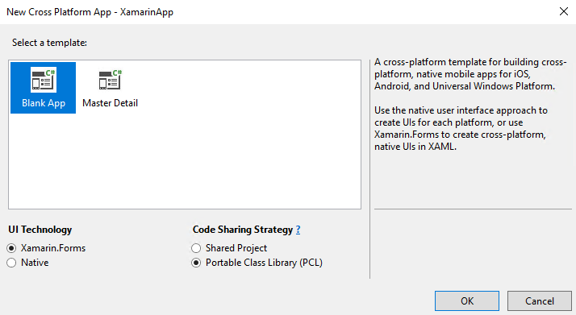
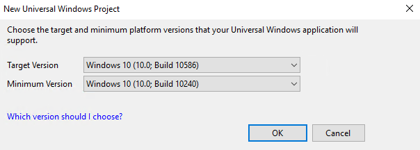
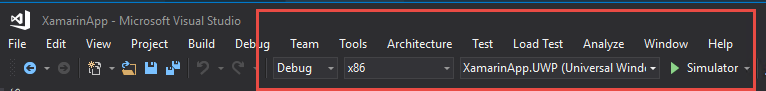
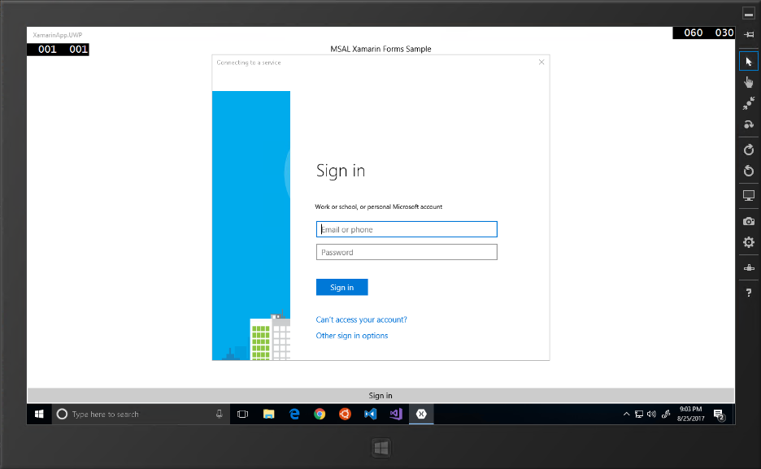

# Microsoft Graph: Building Microsoft Graph Applications - 200 Level
----------------
In this demo, you will walk through building an application using Xamarin.Forms. This demo only walks through creating a UWP
application. For more information on creating Android and iOS projects using Xamarin.Forms that target Microsoft Graph API, 
see the [Xamarin CSharp Connect Sample on GitHub](https://github.com/microsoftgraph/xamarin-csharp-connect-sample). 

## Running the project

The finished solution is provided in this folder. Required edits:

- Edit the PCL project's `App.xaml.cs` file to replace the **CLIENT_ID** placeholder with the registered Application Id.

<a name="xamarinapp"></a>


### Register the application

Visit the [Application Registration Portal](https://apps.dev.microsoft.com/) to register the application. 

- Click the **Add an app** button.
- Copy the **Application Id** that is generated.
- Add a **Native Application** platform. Copy the generated custom redirect URL.
- Make sure the **User.Read** delegated permission is requested.
- Click **Save** to ensure changes are committed.

### Create the application in Visual Studio

Open Visual Studio 2017. Create a new **Cross Platform App (Xamarin)** project. When prompted for the template type, choose **Blank App**, and choose **Portable Class Library (PCL)** as the code sharing strategy.



When prompted, accept defaults for the Universal Windows Platform versions.



Once created, **unload** the portable project within the solution and **edit** the `*.csproj` file. **Replace** the **TargetFrameworkProfile**  element with the following:

````xml
<TargetFrameworkProfile>Profile7</TargetFrameworkProfile>
````

**Reload** the project.

Four projects were created:
- a portable class library project where most logic will reside
- an Android specific project containing Android display logic
- an iOS specific project containing iOS display logic
- a Universal Windows Platform project containing Windows display logic

This demo only walks through creating a UWP
application. For more information on creating Android and iOS projects using Xamarin.Forms that target Microsoft Graph API, 
see the [Xamarin CSharp Connect Sample on GitHub](https://github.com/microsoftgraph/xamarin-csharp-connect-sample). 

Right-click the iOS project. Choose **Remove** and choose **OK**. 
Right-click the Android project. Choose **Remove** and choose **OK**. 

### Add NuGet Packages to projects

Tools / NuGet Package Manager / Package Manager Console. Install the **Microsoft.Identity.Client** package to all projects, and install the **Newtonsoft.Json** package to the portable class library project.

````powershell
Install-Package Microsoft.Identity.Client -ProjectName XamarinApp -pre
Install-Package Newtonsoft.Json -ProjectName XamarinApp -pre
Install-Package Microsoft.Identity.Client -ProjectName XamarinApp.UWP -pre
````

### Edit the portable class library project

Edit the `app.xaml.cs` file in the portable class library project. Replace the `using`'s section with the following:

````csharp
using Microsoft.Identity.Client;
````

Replace the body of the class with the following:

````csharp
public partial class App : Application
{
    public static PublicClientApplication PCA = null;
    public static string ClientID = "YOUR_CLIENT_ID";
    public static string[] Scopes = { "User.Read" };
    public static string Username = string.Empty;

    public static UIParent UiParent = null;
    public App()
    {
        InitializeComponent();
        // default redirectURI; each platform specific project will have to override it with its own
        PCA = new PublicClientApplication(ClientID);
        MainPage = new XamarinApp.MainPage();
    }

    protected override void OnStart()
    {
        // Handle when your app starts
    }

    protected override void OnSleep()
    {
        // Handle when your app sleeps
    }

    protected override void OnResume()
    {
        // Handle when your app resumes
    }
}
````

Replace the **YOUR_CLIENT_ID** placeholder with the Application ID that was generated when the application was registered.
Edit the `MainPage.xaml` file. Replace the generated label control with the following:

````xml
<ContentPage.Content>
    <StackLayout>
        <Label Text="MSAL Xamarin Forms Sample" VerticalOptions="Start" HorizontalTextAlignment="Center" HorizontalOptions="FillAndExpand" />
        <BoxView Color="Transparent" VerticalOptions="FillAndExpand" HorizontalOptions="FillAndExpand" />
        <StackLayout x:Name="slUser" IsVisible="False" Padding="5,10">
            <StackLayout Orientation="Horizontal">
                <Label Text="DisplayName " FontAttributes="Bold" />
                <Label x:Name="lblDisplayName" />
            </StackLayout>
            <StackLayout Orientation="Horizontal">
                <Label Text="GivenName " FontAttributes="Bold" />
                <Label x:Name="lblGivenName" />
            </StackLayout>
            <StackLayout Orientation="Horizontal">
                <Label Text="Surname " FontAttributes="Bold" />
                <Label x:Name="lblSurname" />
            </StackLayout>
            <StackLayout Orientation="Horizontal">
                <Label Text="Id " FontAttributes="Bold" />
                <Label x:Name="lblId" />
            </StackLayout>
            <StackLayout Orientation="Horizontal">
                <Label Text="UserPrincipalName " FontAttributes="Bold" />
                <Label x:Name="lblUserPrincipalName" />
            </StackLayout>
        </StackLayout>
        <BoxView Color="Transparent" VerticalOptions="FillAndExpand" HorizontalOptions="FillAndExpand" />
        <Button x:Name="btnSignInSignOut" Text="Sign in" Clicked="OnSignInSignOut" VerticalOptions="End" HorizontalOptions="FillAndExpand"/>
    </StackLayout>
</ContentPage.Content>
````

Edit the `MainPage.xaml.cs` file. Replace the `using`'s statement with the following:

````csharp
using Microsoft.Identity.Client;
using Newtonsoft.Json.Linq;
using System;
using System.Linq;
using System.Net.Http;
using Xamarin.Forms;
````

**Add** the following methods to the `MainPage.xaml.cs` class.

````csharp
protected override async void OnAppearing()
{
    // let's see if we have a user in our belly already
    try
    {
        AuthenticationResult ar =
            await App.PCA.AcquireTokenSilentAsync(App.Scopes, App.PCA.Users.FirstOrDefault());
        RefreshUserData(ar.AccessToken);
        btnSignInSignOut.Text = "Sign out";
    }
    catch
    {
        // doesn't matter, we go in interactive more
        btnSignInSignOut.Text = "Sign in";
    }
}
async void OnSignInSignOut(object sender, EventArgs e)
{
    try
    {
        if (btnSignInSignOut.Text == "Sign in")
        {
            AuthenticationResult ar = await App.PCA.AcquireTokenAsync(App.Scopes, App.UiParent);
            RefreshUserData(ar.AccessToken);
            btnSignInSignOut.Text = "Sign out";
        }
        else
        {
            foreach (var user in App.PCA.Users)
            {
                App.PCA.Remove(user);
            }
            slUser.IsVisible = false;
            btnSignInSignOut.Text = "Sign in";
        }
    }
    catch (Exception ee)
    {

    }
}

public async void RefreshUserData(string token)
{
    //get data from API
    HttpClient client = new HttpClient();
    HttpRequestMessage message = new HttpRequestMessage(HttpMethod.Get, "https://graph.microsoft.com/v1.0/me");
    message.Headers.Authorization = new System.Net.Http.Headers.AuthenticationHeaderValue("bearer", token);
    HttpResponseMessage response = await client.SendAsync(message);
    string responseString = await response.Content.ReadAsStringAsync();
    if (response.IsSuccessStatusCode)
    {
        JObject user = JObject.Parse(responseString);

        slUser.IsVisible = true;
        lblDisplayName.Text = user["displayName"].ToString();
        lblGivenName.Text = user["givenName"].ToString();
        lblId.Text = user["id"].ToString();
        lblSurname.Text = user["surname"].ToString();
        lblUserPrincipalName.Text = user["userPrincipalName"].ToString();

        // just in case
        btnSignInSignOut.Text = "Sign out";


    }
    else
    {
        DisplayAlert("Something went wrong with the API call", responseString, "Dismiss");
    }
}
````


### Debug the project

To verify the application's behavior, right-click the *Universal Windows Platform** project and choose **Set as StartUp Project**.

In the debug menu, change the target to **Simulator** and click the play button to start debugging.



The simulator loads and you are prompted to log in.



Upon successful sign in, the current user's profile information is displayed. Note that you can sign in using an organizational account such as a work or school account, or you can sign in with a Microsoft Account such as a Live.com, Outlook.com, or Hotmail.com personal address.