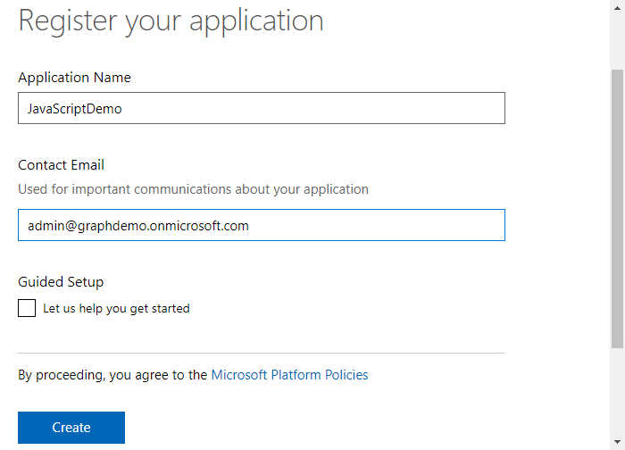
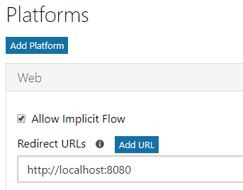
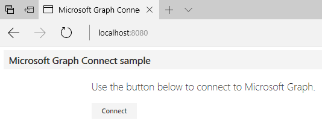
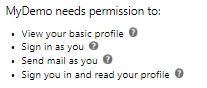
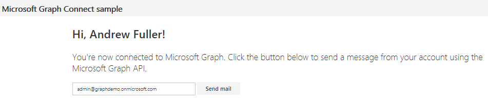

# Microsoft Graph: Building Microsoft Graph Applications - 200 Level
----------------
In this lab, you will walk through building applications that connect with the Microsoft Graph API using multiple technologies. 

## Table of Contents
1. [Build a .NET console application using Microsoft Graph](#dotnetconsoleapp)
2. [Build a JavaScript application using Microsoft Graph](#javascriptapp)
3. [Build an Azure Function using Microsoft Graph](#azurefunction)
4. [Build a mobile application with Xamarin using Microsoft Graph](#xamarinapp)

## Prerequisites

This lab uses Visual Studio 2017. It also requires an **Azure Active Directory** tenant and a user with administrative privileges.

## Setup

Open the Visual Studio Installer and enable the **.NET desktop development**, **Mobile applications with .NET**, **Azure development**,and **Universal Windows Platform** features. Make sure to update Visual Studio 2017 to the latest version, and update VSIX packages (Tools / Extensions and Updates).

<a name="dotnetconsoleapp"></a>

## 1. Build a .NET console application using Microsoft Graph

This lab will walk you through creating a .NET console application from scratch using .NET Framework 4.6.2, the Microsoft Graph SDK, and the Microsoft Authentication Library (MSAL).

### Register the application

Visit the [Application Registration Portal](https://apps.dev.microsoft.com/) to register the application.

Click the **Add an app** button.


On the next page, provide an application name and provide your email address.


Once the application is created, an Application Id is provided on the screen. **Copy this ID**, you will use it as the Client ID within the console application's `app.config` file.


Click the **Add Platform** button. A popup is presented, choose **Native Application**.


Once completed, be sure to scroll to the bottom of the page and **save** all changes.


### Create the project in Visual Studio 2017

In Visual Studio 2017, create a new **Console Application** project targeting .NET Framework 4.6.2.


Click Tools / NuGet Package Manager / **Package Manager Console**. In the console window, run the following commands:

````powershell
Install-Package "Microsoft.Graph"
Install-Package "Microsoft.Identity.Client" -pre
Install-Package "System.Configuration.ConfigurationManager"
````

Edit the app.config file, and immediately before the &lt;/configuration&gt; element, add the following element:

````xml
<appSettings>
    <add key="clientId" value="a943d247-89a1-4a21-9a62-c9714056c456"/>
</appSettings>
````

Make sure to **replace** the value with the **Application ID** value provided from the Application Registration Portal.

### Add AuthenticationHelper.cs

Add a class to the project named **AuthenticationHelper.cs**. This class will be responsible for authenticating using the Microsoft Authentication Library (MSAL), which is the **Microsoft.Identity.Client** package that we installed.

Replace the using statement at the top of the file.

````csharp
using Microsoft.Graph;
using Microsoft.Identity.Client;
using System;
using System.Configuration;
using System.Diagnostics;
using System.Linq;
using System.Net.Http.Headers;
using System.Threading.Tasks;
````

Replace the class declaration with the following.

````csharp
public class AuthenticationHelper
{
    // The Client ID is used by the application to uniquely identify itself to the v2.0 authentication endpoint.
    static string clientId = ConfigurationManager.AppSettings["clientId"].ToString();
    public static string[] Scopes = { "User.Read" , "User.ReadBasic.All"};

    public static PublicClientApplication IdentityClientApp = new PublicClientApplication(clientId);

    private static GraphServiceClient graphClient = null;

    // Get an access token for the given context and resourceId. An attempt is first made to 
    // acquire the token silently. If that fails, then we try to acquire the token by prompting the user.
    public static GraphServiceClient GetAuthenticatedClient()
    {
        if (graphClient == null)
        {
            // Create Microsoft Graph client.
            try
            {
                graphClient = new GraphServiceClient(
                    "https://graph.microsoft.com/v1.0",
                    new DelegateAuthenticationProvider(
                        async (requestMessage) =>
                        {
                            var token = await GetTokenForUserAsync();
                            requestMessage.Headers.Authorization = new AuthenticationHeaderValue("bearer", token);
                        }));
                return graphClient;
            }

            catch (Exception ex)
            {
                Debug.WriteLine("Could not create a graph client: " + ex.Message);
            }
        }

        return graphClient;
    }


    /// <summary>
    /// Get Token for User.
    /// </summary>
    /// <returns>Token for user.</returns>
    public static async Task<string> GetTokenForUserAsync()
    {
        AuthenticationResult authResult = null;
        try
        {
            authResult = await IdentityClientApp.AcquireTokenSilentAsync(Scopes, IdentityClientApp.Users.FirstOrDefault());
            return authResult.AccessToken;
        }
        catch (MsalUiRequiredException ex)
        {
            // A MsalUiRequiredException happened on AcquireTokenSilentAsync. 
            //This indicates you need to call AcquireTokenAsync to acquire a token

            authResult = await IdentityClientApp.AcquireTokenAsync(Scopes);
            
            return authResult.AccessToken;
        }    
        
    }

    /// <summary>
    /// Signs the user out of the service.
    /// </summary>
    public static void SignOut()
    {
        foreach (var user in IdentityClientApp.Users)
        {
            IdentityClientApp.Remove(user);
        }
        graphClient = null;        

    }
}
````

### Get the current user's profile using the Graph SDK

The Microsoft Graph API makes it easy to interrogate the currently logged in user's profile. This sample uses our `AuthenticationHelper.cs` class to obtain an authenticated client before accessing the Me endpoint alias. 

**Edit** the `Program.cs` class and replace the generated using statements with the following:

````csharp
using Microsoft.Graph;
using Newtonsoft.Json.Linq;
using System;
using System.Diagnostics;
using System.Net.Http;
using System.Threading.Tasks;
````

To get the currently logged in user's profile information, **add** the following method: 

````csharp
/// <summary>
/// Gets the currently logged in user's profile information
/// </summary>        
public static async Task<User> GetMeAsync()
{
    User currentUserObject = null;
    try
    {
        var graphClient = AuthenticationHelper.GetAuthenticatedClient();
        currentUserObject = await graphClient.Me.Request().GetAsync();    
                        
        Debug.WriteLine("Got user: " + currentUserObject.DisplayName);
        return currentUserObject;
    }

    catch (ServiceException e)
    {
        Debug.WriteLine("We could not get the current user: " + e.Error.Message);
        return null;
    }            
}
````

### Get the users related to the current user using a REST API

The Microsoft Graph API provides REST endpoints to access information and traverse relationships. One such endpoint is the me/people endpoint that provides information about people closely related to the current user. This method demonstrates accessing the underlying `System.Net.HttpClient` to add an access token in the Authorization header and to configure the URL for the request.

````csharp
/// <summary>
/// Get people near me.  Demonstrates using HttpClient to call the 
/// Graph API.
/// </summary>
/// <returns></returns>
static async Task<string> GetPeopleNearMe()
{
    try
    {
        //Get the Graph client
        var graphClient = AuthenticationHelper.GetAuthenticatedClient();
        
        var token = await AuthenticationHelper.GetTokenForUserAsync();

        var request = new HttpRequestMessage(HttpMethod.Get, graphClient.BaseUrl + "/me/people");
        request.Headers.Authorization = new System.Net.Http.Headers.AuthenticationHeaderValue("Bearer", token);

        var response = await graphClient.HttpProvider.SendAsync(request);
        var bodyContents = await response.Content.ReadAsStringAsync();

        Debug.WriteLine(bodyContents);
        return bodyContents;
    }

    catch (Exception e)
    {
        Debug.WriteLine("Could not get people: " + e.Message);
        return null;
    }
}
````

### Putting it all together

The methods we created use the async/await pattern. Create an async method named **RunAsync** with the following implementation:

````csharp
static async Task RunAsync()
{
    //Display information about the current user            
    Console.WriteLine("Get My Profile");
    Console.WriteLine();

    var me = await GetMeAsync();

    Console.WriteLine(me.DisplayName);
    Console.WriteLine("User:{0}\t\tEmail:{1}", me.DisplayName, me.Mail);
    Console.WriteLine();

    //Display information about people near me
    Console.WriteLine("Get People Near Me");

    var peopleJson = await GetPeopleNearMe();
    dynamic people = JObject.Parse(peopleJson);
    if(null != people)
    {
        foreach(var p in people.value)
        {
            var personType = p.personType;
            Console.WriteLine("Object:{0}\t\t\t\tClass:{1}\t\tSubclass:{2}", p.displayName, personType["class"], personType.subclass);
        }
    }
}
````

Finally, update the Main method to call the `RunAsync()` method.

````csharp
static void Main(string[] args)
{
    RunAsync().GetAwaiter().GetResult();
}
````

Run the application. You are prompted to log in.


After the application runs, you will see output similar to the output shown here.


<a name="javascriptapp"></a>

## 2. Build a JavaScript application using Microsoft Graph 

There are many sample applications that demonstrate how to use the Microsoft Graph API and the Microsoft Graph SDK available online. This lab will walk you through creating a JavaScript application leveraging the QuickStart project template to quickly get started.

### Register the application

Just like in the previous lab, start by visiting the [Application Registration Portal](https://apps.dev.microsoft.com/) to register the application.



**Copy** the application ID, you'll use this to configure the app.

Under platforms, choose **Add Platform / Web**. Make sure the **Allow Implicit Flow** checkbox is selected, and enter http://localhost:8080 as the redirect URI. Make sure to save changes.



### Create the application

As stated previously, we will use a QuickStart application to demonstrate working with AngularJS and the v2 endpoint.

**Download** the [Microsoft Graph Connect Sample for AngularJS](https://github.com/microsoftgraph/angular-connect-rest-sample).

Edit the `config.js` file in public/scripts and replace the **clientID** placeholder with the placeholder of your application.

In a command prompt, change to the **root directory** and run the following:

````shell
npm install
````

Once installed, start the application by typing:

````shell
npm start
````

Note that you may receive an error similar to "npm WARN This failure might be due to the use of legacy binary 'node'. To work around this, install the nodejs-legacy package.

````shell
sudo apt-get install nodejs-legacy
````

The application displays the following dialog box and prompts you to click **Connect**.



You are prompted to log in. Once logged in, you are prompted to grant the permissions requested by the application.



Click **Accept**. The application reads the current user's display name and enables you to send an email.



Inspect the code to see how this was accomplished.

The application is hosted as a Node.js application that uses AngularJS. The `index.html` page defines the ng-app element and loads the files in the scripts directory as well as the `mainController.js` file.

The `graphHelper.js` file contains the code that obtains the token and calls the Graph API. An HTTP GET is issued to obtain the current user's profile, and an HTTP POST is issued to send email on behalf of the current user.

````javascript
// Get the profile of the current user.
me: function me() {
    return $http.get('https://graph.microsoft.com/v1.0/me');
},

// Send an email on behalf of the current user.
sendMail: function sendMail(email) {
    return $http.post('https://graph.microsoft.com/v1.0/me/sendMail', { 'message' : email, 'saveToSentItems': true });
}
````
<a name="azurefunction"></a>

## 3. Build an Azure Function using Microsoft Graph 

This lab will build an Azure Function that runs on a scheduled basis to obtain all the users in the directory.

This solution will require an organizational account. An admin is required to provide consent. To facilitate this, we will start with an existing solution. Once we have tested that our app is successfully authenticating and retrieving users, we will implement an Azure Function that synchronizes users.

### Download and configure the starter application

Clone or download the following project:

- [Build a multi-tenant daemon with the v2.0 endpoint](https://github.com/Azure-Samples/active-directory-dotnet-daemon-v2)

Visit the [Application Registration Portal](https://apps.dev.microsoft.com) and register a new application:

- Copy the **Application Id** assigned to your app.
- Add the **Web** platform for your app.
- Enter two **Redirect URI**s:
    - `https://localhost:44316/`, and
    - `https://localhost:44316/Account/GrantPermissions`
- Generate an **Application Secret** of the type **password**, and copy it for later. Note that in production apps you should always use certificates as your application secrets, but for this sample we will use a simple shared secret password.

### Configure your app for admin consent

In order to use the v2.0 admin consent endpoint, you'll need to declare the application permissions your app will use ahead of time. While still in the registration portal,

- Locate the **Microsoft Graph Permissions** section on your app registration.
- Under **Application Permissions**, add the `User.Read.All` permission.
- Be sure to **Save** your app registration.

Once you've downloaded the sample, open it using Visual Studio. Open the `web.config` file, and replace the following values:

- Replace the `clientId` value with the application ID you copied above.
- Replace the `clientSecret` value with the application secret you copied above.

### Run the sample

Start the **UserSync** application, and begin by signing in as an administrator in your Azure AD tenant. If you don't have an Azure AD tenant for testing, you can [follow these instructions](https://azure.microsoft.com/documentation/articles/active-directory-howto-tenant/) to get one.

When the app loads, click the **Get Started** button.

On the next page, click **Sign In**.

When you sign in, the app will first ask you for permission to sign you in & read your user profile. This allows the application to ensure that you are a business user. The application will then try to sync a list of users from your Azure AD tenant via the Microsoft Graph. If it is unable to do so, it asks you (the tenant administrator) to connect your tenant to the application.

The application then asks for permission to read the list of users in your tenant. When you grant the permission, the application is able to query for users at any point. You can verify this by clicking the **Sync Users** button on the users page to refresh the list of users. Try adding or removing a user and re-syncing the list (but note that it only syncs the first page of users).

> **Note:** There is approximately a 20 minute data replication delay between the time when an application is granted admin consent and when the data can successfully synchronize. For more information, see: https://github.com/Azure-Samples/active-directory-dotnet-daemon-v2/issues/1

### Create the Azure Function project

Visual Studio 2017 provides new tooling to simplify the creation of Azure Functions while enabling local debugging. Under the "Visual C#" node in the tree, choose the "Azure Functions" project template.


For details on creating Azure Functions using Visual Studio, see [Azure Functions Tools for Visual Studio](https://docs.microsoft.com/en-us/azure/azure-functions/functions-develop-vs).

**Right-click** on the new function project and add a new function.


When prompted, set the trigger to a **Timer trigger** and change the schedule to the following format:

````
*/30 * * * * *
````


In the **NuGet Package Manager Console**, run the following commands to install the required packages.

````powershell
Install-Package "Microsoft.Graph"
Install-Package "Microsoft.Identity.Client" -pre
Install-Package "System.Configuration.ConfigurationManager"
````

Azure Functions that run on a schedule require an Azure storage account. Log into your Azure subscription and create a new storage account. Once created, copy its connection string.


Edit the `local.settings.json` file and provide the following items to use while debugging locally:

- **AzureWebJobsStorage**: Azure storage connection string
- **AzureWebJobsDashboard**: Azure storage connection string
- **clientId**: The Application Id of the registered application with AAD
- **clientSecret**: The secret key of the registered application with AAD
- **tenantId**: The tenant Id of the AAD directory
- **authorityFormat**: https://login.microsoftonline.com/{0}/v2.0
- **replyUri**: https://localhost:44316/

Refer to the following image to verify settings:


**Add** a class named `MsGraphUser.cs` to the project with the following contents:

````csharp
using System.Collections.Generic;
using Newtonsoft.Json;

namespace AzureSyncFunction.Models
{
    public class MsGraphUser
    {
        [JsonProperty(PropertyName = "@odata.type")]
        public string odataType { get; set; }
        [JsonProperty(PropertyName = "@odata.id")]
        public string odataId { get; set; }
        public List<string> businessPhones { get; set; }
        public string displayName { get; set; }
        public string givenName { get; set; }
        public string jobTitle { get; set; }
        public string mail { get; set; }
        public string mobilePhone { get; set; }
        public string officeLocation { get; set; }
        public string preferredLanguage { get; set; }
        public string surname { get; set; }
        public string userPrincipalName { get; set; }
        public string id { get; set; }
    }

    public class MsGraphUserListResponse
    {
        [JsonProperty(PropertyName = "@odata.context")]
        public string context { get; set; }
        public List<MsGraphUser> value { get; set; }
    }
}
````

**Replace** the contents of the function class with the following:

````csharp
using System;
using Microsoft.Azure.WebJobs;
using Microsoft.Azure.WebJobs.Host;
using Microsoft.Identity.Client;
using System.Net;
using AzureSyncFunction.Models;
using System.Collections.Concurrent;
using System.Collections.Generic;
using System.Net.Http;
using System.Net.Http.Headers;
using Newtonsoft.Json;
using System.Configuration;

namespace AzureSyncFunction
{
    public static class UserSync
    {
        private static string tenantId = ConfigurationManager.AppSettings["tenantId"];
        private static string authorityFormat = ConfigurationManager.AppSettings["authorityFormat"];

        private static string msGraphScope = "https://graph.microsoft.com/.default";
        private static string msGraphQuery = "https://graph.microsoft.com/v1.0/users";

        private static ConcurrentDictionary<string, List<MsGraphUser>> usersByTenant = new ConcurrentDictionary<string, List<MsGraphUser>>();

        [FunctionName("UserSync")]
        public static void Run([TimerTrigger("*/30 * * * * *")]TimerInfo myTimer, TraceWriter log)
        {
            log.Info($"C# Timer trigger function executed at: {DateTime.Now}");
            try
            {
                ConfidentialClientApplication daemonClient = new ConfidentialClientApplication(ConfigurationManager.AppSettings["clientId"],
                    String.Format(authorityFormat, tenantId),
                    ConfigurationManager.AppSettings["replyUri"],
                    new ClientCredential(ConfigurationManager.AppSettings["clientSecret"]),
                    null, new TokenCache());

                AuthenticationResult authResult = daemonClient.AcquireTokenForClientAsync(new string[] { msGraphScope }).GetAwaiter().GetResult();

                // Query for list of users in the tenant
                HttpClient client = new HttpClient();
                HttpRequestMessage request = new HttpRequestMessage(HttpMethod.Get, msGraphQuery);
                request.Headers.Authorization = new AuthenticationHeaderValue("Bearer", authResult.AccessToken);
                HttpResponseMessage response = client.SendAsync(request).GetAwaiter().GetResult();

                // If the token we used was insufficient to make the query, drop the token from the cache.
                // The Users page of the website will show a message to the user instructing them to grant
                // permissions to the app (see User/Index.cshtml).
                if (response.StatusCode == System.Net.HttpStatusCode.Forbidden)
                {
                    // BUG: Here, we should clear MSAL's app token cache to ensure that on a subsequent call
                    // to SyncController, MSAL does not return the same access token that resulted in this 403.
                    // By clearing the cache, MSAL will be forced to retrieve a new access token from AAD, 
                    // which will contain the most up-to-date set of permissions granted to the app. Since MSAL
                    // currently does not provide a way to clear the app token cache, we have commented this line
                    // out. Thankfully, since this app uses the default in-memory app token cache, the app still
                    // works correctly, since the in-memory cache is not persistent across calls to SyncController
                    // anyway. If you build a persistent app token cache for MSAL, you should make sure to clear 
                    // it at this point in the code.
                    //
                    //daemonClient.AppTokenCache.Clear(Startup.clientId);
                    log.Error("Unable to issue query: Received " + response.StatusCode + " in Run method");
                }

                if (!response.IsSuccessStatusCode)
                {
                    log.Error("Unable to issue query: Received " + response.StatusCode + " in Run method");
                }

                // Record users in the data store (note that this only records the first page of users)
                string json = response.Content.ReadAsStringAsync().GetAwaiter().GetResult();
                MsGraphUserListResponse users = JsonConvert.DeserializeObject<MsGraphUserListResponse>(json);
                usersByTenant[tenantId] = users.value;
                log.Info("Successfully synchronized " + users.value.Count + " users!");

            }
            catch (Exception oops)
            {
                log.Error(oops.Message, oops, "AzureSyncFunction.UserSync.Run");
            }
        }
    }
}
````

### Debug the Azure Function project locally

Now that the project is coded and settings are configured, run the Azure Function project locally. A command window appears and provides output from the running function.


As the timer fires once every 30 seconds, the display will show the successful execution of the Azure Function.


### Deploy the Azure Function project to Microsoft Azure

Right-click the Azure Function project and choose **Publish**. Choose the **Azure Function App**, select **Create New**, and click **OK**.


Choose your Azure subscription, a resource group, an app service plan, and a storage account and then click **Create**. The function is published to your Azure subscription.


The local configuration settings are not published to the Azure Function. Open the Azure Function and choose **Application Settings**. Provide the same key and value pairs that you used within your local debug session.


Finally, click on the **Monitor** node to monitor the Azure Function as it runs every 30 seconds. In the **Logs** window, verify that you are successfully synchronizing users.


<a name="xamarinapp"></a>

## 4. Create a mobile app with Xamarin using Microsoft Graph

In this lab, you will through building an application using Xamarin.Forms. This demo only walks through creating a UWP
application. For more information on creating Android and iOS projects using Xamarin.Forms that target Microsoft Graph API, 
see the [Xamarin CSharp Connect Sample on GitHub](https://github.com/microsoftgraph/xamarin-csharp-connect-sample). 

### Register the application

Visit the [Application Registration Portal](https://apps.dev.microsoft.com/) to register the application. 

- Click the **Add an app** button.
    - Enter a name for the application.
    - Uncheck the **Let us help you get started** option.
    - Click **Create**
- Copy the **Application Id** that is generated.
- Under **Platforms**, click **Add Platform**.
    - Add a **Native Application** platform. Copy the generated custom redirect URL.
- Make sure the **User.Read** delegated permission is requested.
- Click **Save** to ensure changes are committed.

### Create the application in Visual Studio

Open Visual Studio 2017. Create a new **Cross Platform App (Xamarin)** project. When prompted for the template type, choose **Blank App**, and choose **Portable Class Library (PCL)** as the code sharing strategy.


When prompted, accept defaults for the Universal Windows Platform versions.


Once created, **unload** the portable project within the solution and **edit** the `*.csproj` file. **Replace** the **TargetFrameworkProfile**  element with the following:

````xml
<TargetFrameworkProfile>Profile7</TargetFrameworkProfile>
````

**Reload** the project.

Four projects were created:

- a portable class library project where most logic will reside
- an Android specific project containing Android display logic
- an iOS specific project containing iOS display logic
- a Universal Windows Platform project containing Windows display logic

This lab only walks through creating a UWP application using Xamarin.Forms. For more information on creating Android and iOS projects using Xamarin.Forms that target Microsoft Graph API, 
see the [Xamarin CSharp Connect Sample on GitHub](https://github.com/microsoftgraph/xamarin-csharp-connect-sample). 

Right-click the iOS project. Choose **Remove** and choose **OK**. 
Right-click the Android project. Choose **Remove** and choose **OK**. 

### Add NuGet Packages to projects

In Visual Studio, navigate to Tools / NuGet Package Manager / Package Manager Console. Install the **Microsoft.Identity.Client** package to all projects, and install the **Newtonsoft.Json** package to the portable class library project.

````powershell
Install-Package Microsoft.Identity.Client -ProjectName XamarinApp -pre
Install-Package Newtonsoft.Json -ProjectName XamarinApp -pre
Install-Package Microsoft.Identity.Client -ProjectName XamarinApp.UWP -pre
````

### Edit the portable class library project

Edit the `app.xaml.cs` file in the portable class library project. Replace the `using`'s section with the following:

````csharp
using Microsoft.Identity.Client;
````

Replace the body of the class with the following:

````csharp
public partial class App : Application
{
    public static PublicClientApplication PCA = null;
    public static string ClientID = "YOUR_CLIENT_ID";
    public static string[] Scopes = { "User.Read" };
    public static string Username = string.Empty;

    public static UIParent UiParent = null;
    public App()
    {
        InitializeComponent();
        // default redirectURI; each platform specific project will have to override it with its own
        PCA = new PublicClientApplication(ClientID);
        MainPage = new XamarinApp.MainPage();
    }

    protected override void OnStart()
    {
        // Handle when your app starts
    }

    protected override void OnSleep()
    {
        // Handle when your app sleeps
    }

    protected override void OnResume()
    {
        // Handle when your app resumes
    }
}
````

Replace the **YOUR_CLIENT_ID** placeholder with the Application ID that was generated when the application was registered.

Edit the `MainPage.xaml` file. Replace the generated label control with the following:

````xml
<ContentPage.Content>
    <StackLayout>
        <Label Text="MSAL Xamarin Forms Sample" VerticalOptions="Start" HorizontalTextAlignment="Center" HorizontalOptions="FillAndExpand" />
        <BoxView Color="Transparent" VerticalOptions="FillAndExpand" HorizontalOptions="FillAndExpand" />
        <StackLayout x:Name="slUser" IsVisible="False" Padding="5,10">
            <StackLayout Orientation="Horizontal">
                <Label Text="DisplayName " FontAttributes="Bold" />
                <Label x:Name="lblDisplayName" />
            </StackLayout>
            <StackLayout Orientation="Horizontal">
                <Label Text="GivenName " FontAttributes="Bold" />
                <Label x:Name="lblGivenName" />
            </StackLayout>
            <StackLayout Orientation="Horizontal">
                <Label Text="Surname " FontAttributes="Bold" />
                <Label x:Name="lblSurname" />
            </StackLayout>
            <StackLayout Orientation="Horizontal">
                <Label Text="Id " FontAttributes="Bold" />
                <Label x:Name="lblId" />
            </StackLayout>
            <StackLayout Orientation="Horizontal">
                <Label Text="UserPrincipalName " FontAttributes="Bold" />
                <Label x:Name="lblUserPrincipalName" />
            </StackLayout>
        </StackLayout>
        <BoxView Color="Transparent" VerticalOptions="FillAndExpand" HorizontalOptions="FillAndExpand" />
        <Button x:Name="btnSignInSignOut" Text="Sign in" Clicked="OnSignInSignOut" VerticalOptions="End" HorizontalOptions="FillAndExpand"/>
    </StackLayout>
</ContentPage.Content>
````

Edit the `MainPage.xaml.cs` file. Replace the `using` statements with the following:

````csharp
using Microsoft.Identity.Client;
using Newtonsoft.Json.Linq;
using System;
using System.Linq;
using System.Net.Http;
using Xamarin.Forms;
````

**Add** the following methods to the `MainPage.xaml.cs` class.

````csharp
protected override async void OnAppearing()
{
    // let's see if we have a user already
    try
    {
        AuthenticationResult ar =
            await App.PCA.AcquireTokenSilentAsync(App.Scopes, App.PCA.Users.FirstOrDefault());
        RefreshUserData(ar.AccessToken);
        btnSignInSignOut.Text = "Sign out";
    }
    catch
    {
        // doesn't matter, we go in interactive more
        btnSignInSignOut.Text = "Sign in";
    }
}
async void OnSignInSignOut(object sender, EventArgs e)
{
    try
    {
        if (btnSignInSignOut.Text == "Sign in")
        {
            AuthenticationResult ar = await App.PCA.AcquireTokenAsync(App.Scopes, App.UiParent);
            RefreshUserData(ar.AccessToken);
            btnSignInSignOut.Text = "Sign out";
        }
        else
        {
            foreach (var user in App.PCA.Users)
            {
                App.PCA.Remove(user);
            }
            slUser.IsVisible = false;
            btnSignInSignOut.Text = "Sign in";
        }
    }
    catch (Exception ee)
    {
    }
}

public async void RefreshUserData(string token)
{
    //get data from API
    HttpClient client = new HttpClient();
    HttpRequestMessage message = new HttpRequestMessage(HttpMethod.Get, "https://graph.microsoft.com/v1.0/me");
    message.Headers.Authorization = new System.Net.Http.Headers.AuthenticationHeaderValue("bearer", token);
    HttpResponseMessage response = await client.SendAsync(message);
    string responseString = await response.Content.ReadAsStringAsync();
    if (response.IsSuccessStatusCode)
    {
        JObject user = JObject.Parse(responseString);

        slUser.IsVisible = true;
        lblDisplayName.Text = user["displayName"].ToString();
        lblGivenName.Text = user["givenName"].ToString();
        lblId.Text = user["id"].ToString();
        lblSurname.Text = user["surname"].ToString();
        lblUserPrincipalName.Text = user["userPrincipalName"].ToString();

        // just in case
        btnSignInSignOut.Text = "Sign out";
    }
    else
    {
        DisplayAlert("Something went wrong with the API call", responseString, "Dismiss");
    }
}
````


### Debug the project

Running the iOS project requires a Mac. If you have a Mac, follow on-screen directions to connect and deploy the application.

Running the Android project requires an emulator using at least API level 21 and has Chrome, or a physical device meeting the same requirements.

To verify the application's behavior, right-click the *Universal Windows Platform** project and choose **Set as StartUp Project**.

In the debug menu, change the target to **Simulator** and click the play button to start debugging.


The simulator loads and you are prompted to log in.


Upon successful sign in, the current user's profile information is displayed. Note that you can sign in using an organizational account such as a work or school account, or you can sign in with a Microsoft Account such as a Live.com, Outlook.com, or Hotmail.com personal address.