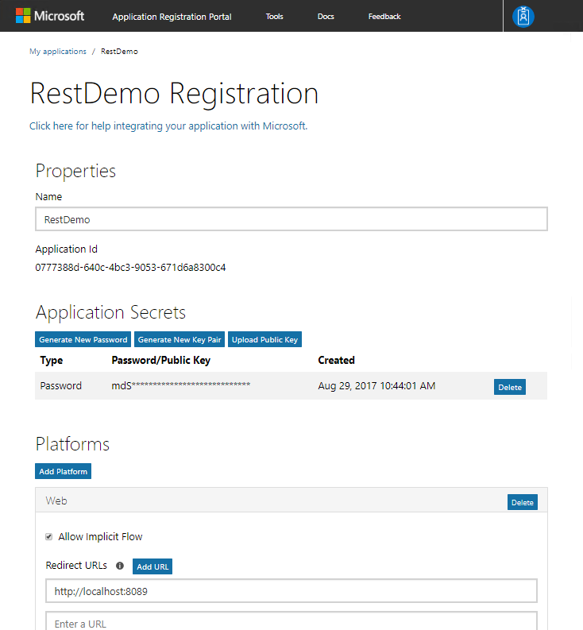
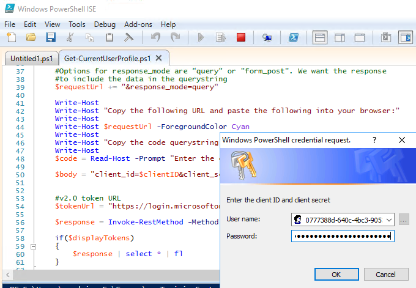
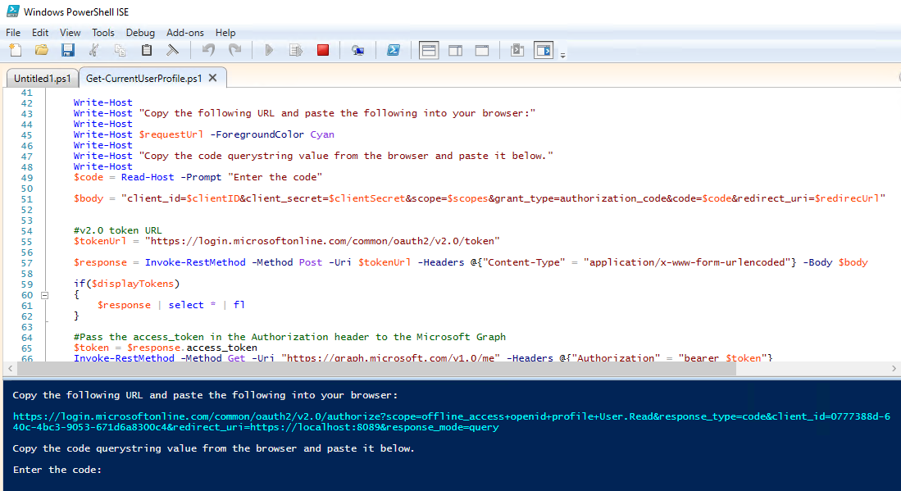
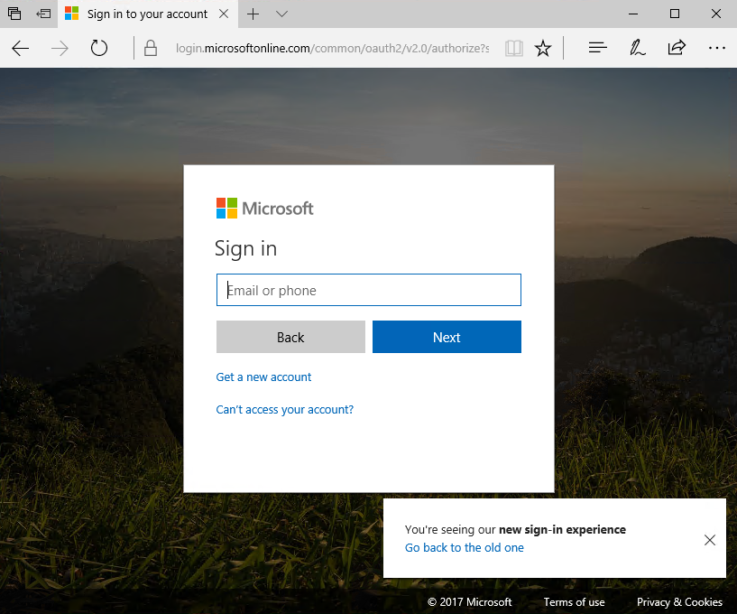
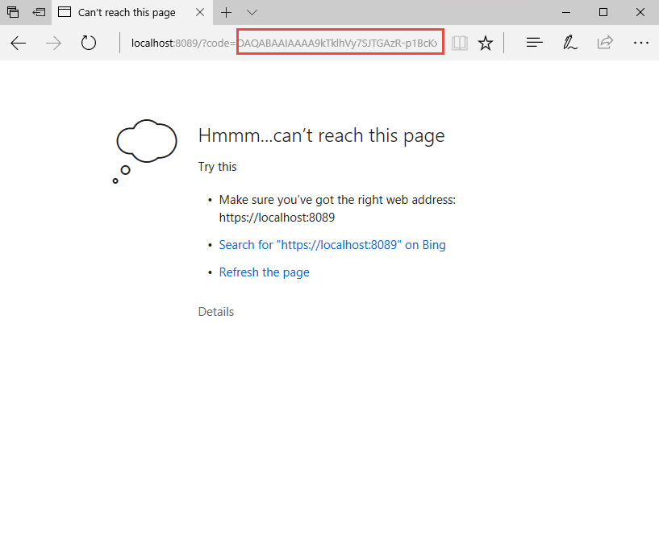
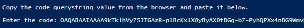
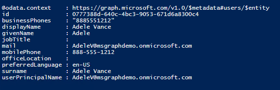
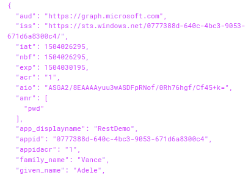

# Microsoft Graph: Building Microsoft Graph Applications - 200 Level
----------------
In this demo, you will walk through authentication and permissions sceanrios leveraging the Microsoft Graph using the Graph SDK and Microsoft Authentication Library (MSAL).

## Prerequisites

This demo uses PowerShell ISE. This demo also requires an **Azure Active Directory** directory and a user who can log in with administrative privileges as well as a directory user who does not have administrative privileges. You can also use this demo with a personal Microsoft Account.

### Register the application

Visit the [Application Registration Portal](https://apps.dev.microsoft.com/) to register the application.

- Once the application is created, an Application Id is provided on the screen. **Copy this ID**, you will use it as the Client ID.
- Add a new secret by clicking the **Generate new password** button and copy the secret to use later as the Client Secret.
- Click the **Add Platform** button. A popup is presented, choose **Web Application**.
- Change the Redirect URL to **http://localhost:8089**. 
- Click **Save** to save all changes.



**Open** a new PowerShell ISE window. **Copy** the following code and **paste** in the script pane.

````powershell
function Get-CurrentUserProfile
{
    Param
    (
        [parameter(Mandatory=$true,
        ValueFromPipeline=$true)]
        [PSCredential]
        $credential,
        [parameter(Mandatory=$true)]
        [string]
        $scopes,
        [parameter(Mandatory=$true)]
        [string]
        $redirecUrl,
        [switch]
        $displayTokens
    )
   
    $clientID = $credential.Username
    $clientSecret = $credential.GetNetworkCredential().Password

    #v2.0 authorize URL
    $authorizeUrl = "https://login.microsoftonline.com/common/oauth2/v2.0/authorize"
    
    #Permission scopes
    $requestUrl = $authorizeUrl + "?scope=$scopes"

    #Code grant, will receive a code that can be redeemed for a token
    $requestUrl += "&response_type=code"

    #Add your app's Application ID
    $requestUrl += "&client_id=$clientID"

    #Add your app's redirect URL
    $requestUrl += "&redirect_uri=$redirecUrl"

    #Options for response_mode are "query" or "form_post". We want the response
    #to include the data in the querystring
    $requestUrl += "&response_mode=query"

    Write-Host
    Write-Host "Copy the following URL and paste the following into your browser:"
    Write-Host
    Write-Host $requestUrl -ForegroundColor Cyan
    Write-Host
    Write-Host "Copy the code querystring value from the browser and paste it below."
    Write-Host
    $code = Read-Host -Prompt "Enter the code"

    $body = "client_id=$clientID&client_secret=$clientSecret&scope=$scopes&grant_type=authorization_code&code=$code&redirect_uri=$redirecUrl"    
    #v2.0 token URL
    $tokenUrl = "https://login.microsoftonline.com/common/oauth2/v2.0/token"

    $response = Invoke-RestMethod -Method Post -Uri $tokenUrl -Headers @{"Content-Type" = "application/x-www-form-urlencoded"} -Body $body

    if($displayTokens)
    {
        $response | select * | fl
    }

    #Pass the access_token in the Authorization header to the Microsoft Graph
    $token = $response.access_token
    Invoke-RestMethod -Method Get -Uri "https://graph.microsoft.com/v1.0/me" -Headers @{"Authorization" = "bearer $token"} 
}


#offline_acess:  Allows requesting refresh tokens
#openid:  Allows your app to sign the user in and receive an app-specific identifier for the user
#profile: Allows your app access to all other basic information such as name, preferred username, object ID, and others
#User.Read: Allows your app to read the current's user's profile
$scopes = "offline_access+openid+profile+User.Read"

#Redirects to this URL will show a 404 in your browser, but allows you to copy the returned code from the URL bar
#Must match a redirect URL for your registered application
$redirectURL = "https://localhost:8089"

$credential = Get-Credential -Message "Enter the client ID and client secret"
Get-CurrentUserProfile $credential -scopes $scopes -redirecUrl $redirectURL -displayTokens
````

This script will first create an URL to the authorize endpoint, providing the client ID, permission scopes, and redirect URL. If we attempted to use Invoke-RestMethod to this endpoint, the result would be the HTML content of the resulting login screen. We need to actually log in and authorize the application, so we will copy the URL to a browser.

**Run** the PowerShell script. You are prompted to enter a username and password. The username is the Application ID generated when you registered the application, and the password is the secret that was generated.



**Copy** the resulting URL.



**Paste** the URL to a browser window. You are prompted to sign in.



After you sign in an authorize the application, the browser is redirected. Since we don't have a web server listening for requests at http://localhost:8089, the browser shows a 404 error screen. However, the URL contains the code needed.  

**Copy** the code value from the querystring in the browser's URL bar, up to the trailing &session_state querystring value.



**Paste** the code value into the PowerShell window.



The result is a successful call to the Microsoft Graph, getting the profile of the currently signed-in user.



The output includes 3 tokens: an id token, an access token, and a refresh token. These tokens are JWT tokens that, as of the time of this writing, can be decoded and their contents inspected.

> **Note:** These tokens are currently not encrypted but that is subject to change. 

**Copy** the token value in the output. 


Open a browser to https://jwt.calebb.net and paste the encoded token to inspect its contents.


