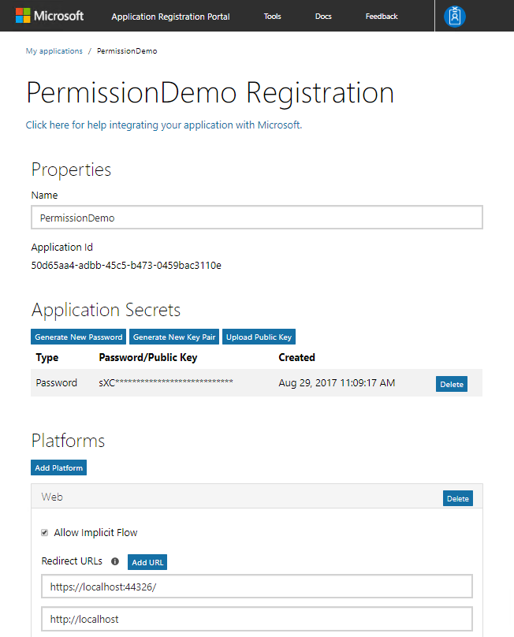
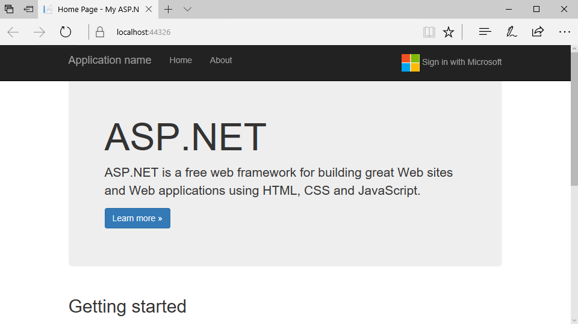
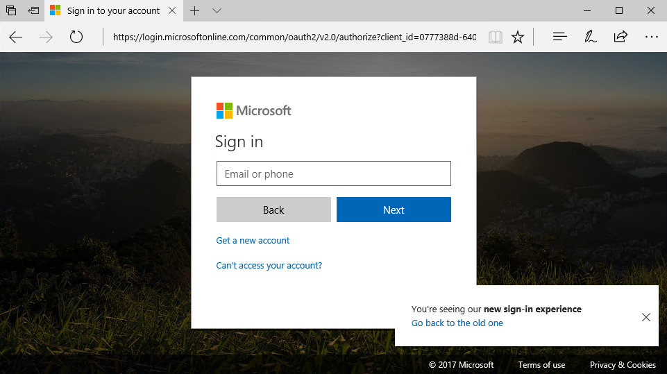
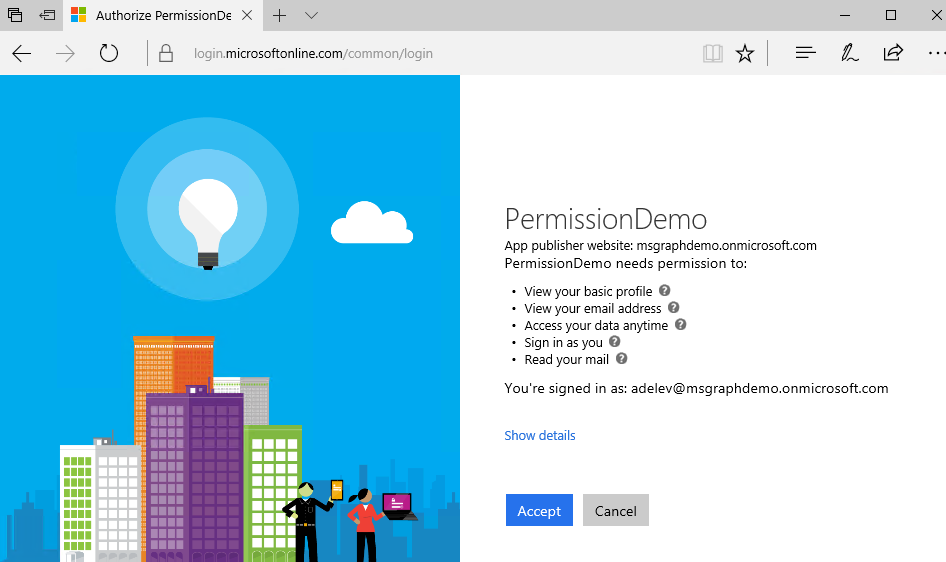
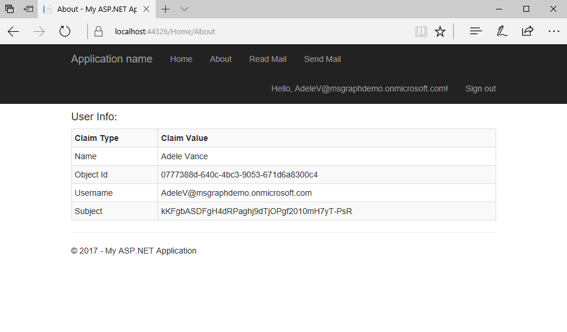

## 2. Connecting with Microsoft Graph using OpenID Connect

This lab will walk you through creating a web application that connects with Microsoft Graph using OpenID Connect.

### Requirements

- Visual Studio 2017
- A personal Microsoft Account with access to an Outlook.com enabled mailbox
- A work or school account with access to an Office 365 enabled mailbox

### Register the application

Visit the [Application Registration Portal](https://apps.dev.microsoft.com/) to register the application.

- Once the application is created, an Application Id is provided on the screen. **Copy this ID**, you will use it as the Client ID.
- Add a new secret by clicking the **Generate new password** button and copy the secret to use later as the Client Secret.
- Click the **Add Platform** button. A popup is presented, choose **Web Application**.
- Change the Redirect URL to **https://localhost:44326/**. 
- Click **Save** to save all changes.



From your shell or command line:

````shell
git clone https://github.com/Azure-Samples/active-directory-dotnet-webapp-openidconnect-v2.git
````

**Edit** the `web.config` file with your app's coordinates. Find the appSettings key `ida:ClientId` and provide the Application ID from your app registration. Find the appSettings key `ida:ClientSecret` and provide the value from the secret generated in the previous step.

### Inspect the code sample

Open the `Startup.Auth.cs` file. This is where authentication begins using the OWIN middleware.

````csharp
app.UseOpenIdConnectAuthentication(
    new OpenIdConnectAuthenticationOptions
    {
        // The `Authority` represents the v2.0 endpoint - https://login.microsoftonline.com/common/v2.0
        // The `Scope` describes the initial permissions that your app will need.  See https://azure.microsoft.com/documentation/articles/active-directory-v2-scopes/                    
        ClientId = clientId,
        Authority = String.Format(CultureInfo.InvariantCulture, aadInstance, "common", "/v2.0"),
        RedirectUri = redirectUri,                    
        Scope = "openid email profile offline_access Mail.Read",
        PostLogoutRedirectUri = redirectUri,
        TokenValidationParameters = new TokenValidationParameters
        {
            ValidateIssuer = false,
            // In a real application you would use IssuerValidator for additional checks, like making sure the user's organization has signed up for your app.
            //     IssuerValidator = (issuer, token, tvp) =>
            //     {
            //        //if(MyCustomTenantValidation(issuer)) 
            //        return issuer;
            //        //else
            //        //    throw new SecurityTokenInvalidIssuerException("Invalid issuer");
            //    },
        },
````

When an authorization code is received, the code is redeemed for an access token and a refresh token, which are stored in cache.

````csharp
Notifications = new OpenIdConnectAuthenticationNotifications
{
    // If there is a code in the OpenID Connect response, redeem it for an access token and refresh token, and store those away.
    AuthorizationCodeReceived = async (context) =>
    {
        var code = context.Code;
        string signedInUserID = context.AuthenticationTicket.Identity.FindFirst(ClaimTypes.NameIdentifier).Value;
        TokenCache userTokenCache = new MSALSessionCache(signedInUserID, 
            context.OwinContext.Environment["System.Web.HttpContextBase"] as HttpContextBase).GetMsalCacheInstance();                            
        ConfidentialClientApplication cca =
            new ConfidentialClientApplication(clientId, redirectUri, new ClientCredential(appKey), userTokenCache,null);
        string[] scopes = { "Mail.Read" };
        try
        {
            AuthenticationResult result = await cca.AcquireTokenByAuthorizationCodeAsync(code, scopes);
        }
        catch (Exception eee)
        {
                                
        }
    },
    AuthenticationFailed = (notification) =>
    {
        notification.HandleResponse();
        notification.Response.Redirect("/Error?message=" + notification.Exception.Message);
        return Task.FromResult(0);
    }
}
````

Open the `Models/MsalSessionCache.cs` file. Notice that the token is persisted in session state.

````csharp
public void Load()
{
    SessionLock.EnterReadLock();
    cache.Deserialize((byte[])httpContext.Session[CacheId]);
    SessionLock.ExitReadLock();
}

public void Persist()
{
    SessionLock.EnterWriteLock();

    // Optimistically set HasStateChanged to false. We need to do it early to avoid losing changes made by a concurrent thread.
    cache.HasStateChanged = false;

    // Reflect changes in the persistent store
    httpContext.Session[CacheId] = cache.Serialize();
    SessionLock.ExitWriteLock();
}
````

In case of a load-balanced application, such as an Azure Web App with multiple instances, you may need to centrally persist the state to avoid forcing the user to log on multiple times.

Open the `Controllers/HomeController.cs` file and view the About controller method. The `Authorize` attribute ensures that only authenticated users can exercise this code. The `About` method contains code to retrieve the current user's claims and makes them available via the `ViewBag` for display by the view. Recall that the Azure AD v2.0 authorize endpoint returns an id_token back to the application which contains these claims. The data backing these claims is present because the OpenID Connect scopes "openid" and "profile" were requested.

````csharp
[Authorize]
public async Task<ActionResult> About()
{
    ViewBag.Name = ClaimsPrincipal.Current.FindFirst("name").Value;
    ViewBag.AuthorizationRequest = string.Empty;
    // The object ID claim will only be emitted for work or school accounts at this time.
    Claim oid = ClaimsPrincipal.Current.FindFirst("http://schemas.microsoft.com/identity/claims/objectidentifier");
    ViewBag.ObjectId = oid == null ? string.Empty : oid.Value;

    // The 'preferred_username' claim can be used for showing the user's primary way of identifying themselves
    ViewBag.Username = ClaimsPrincipal.Current.FindFirst("preferred_username").Value;

    // The subject or nameidentifier claim can be used to uniquely identify the user
    ViewBag.Subject = ClaimsPrincipal.Current.FindFirst("http://schemas.xmlsoap.org/ws/2005/05/identity/claims/nameidentifier").Value;
    return View();
}
````

Open the `Controllers/HomeController.cs` file and view the ReadMail controller method. Unlike the `About` method, this method is not decorated with the `Authorize` attribute. The method retrieves the current user's token cache and creates a new `ConfidentialClientApplication` using the user's token cache. If there are users in the cache, the code calls `AcquireTokenSilentAsync` which will look in the cache for a token matching the user and the requested scope. If one is not present, it will attempt to use the refresh token. It then attaches the token to the request to the Microsoft Graph to retrieve the user's messages.

````csharp
public async Task<ActionResult> ReadMail()
{            
    try
    {
        string signedInUserID = ClaimsPrincipal.Current.FindFirst(ClaimTypes.NameIdentifier).Value;
        TokenCache userTokenCache = new MSALSessionCache(signedInUserID, this.HttpContext).GetMsalCacheInstance();

        ConfidentialClientApplication cca = 
            new ConfidentialClientApplication(clientId, redirectUri, new ClientCredential(appKey), userTokenCache, null);
        if (cca.Users.Count() > 0)
        {
            string[] scopes = { "Mail.Read" };
            AuthenticationResult result = await cca.AcquireTokenSilentAsync(scopes, cca.Users.First());

            HttpClient hc = new HttpClient();
            hc.DefaultRequestHeaders.Authorization =
                new System.Net.Http.Headers.AuthenticationHeaderValue("bearer", result.AccessToken);
            HttpResponseMessage hrm = await hc.GetAsync("https://graph.microsoft.com/v1.0/me/messages");
            string rez = await hrm.Content.ReadAsStringAsync();
            ViewBag.Message = rez;
        }
        else { }
        return View();
    }
    catch (MsalUiRequiredException)
    {
        ViewBag.Relogin = "true";
        return View();
    }
    catch (Exception eee)
    {
        ViewBag.Error = "An error has occurred. Details: " + eee.Message;
        return View();
    }
}
````

### Run the application

Run the application.



Clicking the About link or clicking the sign in link in the top right will prompt you to sign in.



After signing in, the user is prompted for consent.

- View your basic profile
- View your email address
- Access your data anytime
- Sign in as you
- Read your mail



After consenting, click the **About** link. Information about the user is displayed from their current set of claims in the OpenID Connect flow.



Since the user is now logged in, the Read Mail link is now visible. Click the **Read Mail** link. You can now read email messages from your inbox.
