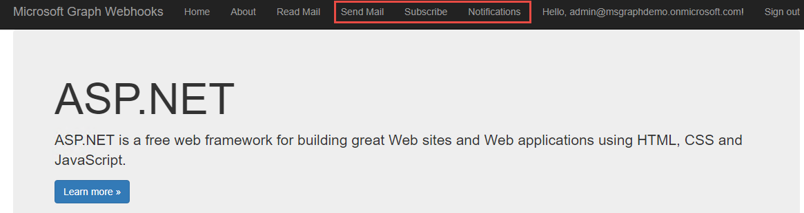
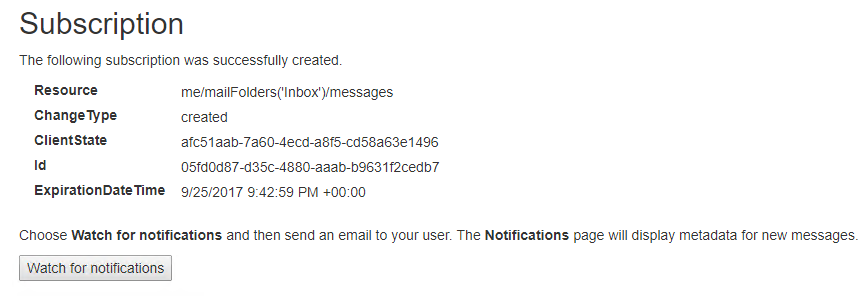
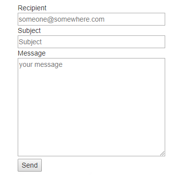
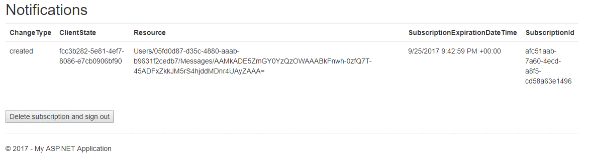

# Microsoft Graph Capabilities – 400 Level
----------------
In this lab, you will walk through capabilities of the Microsoft Graph to build applications to understand the capabilities of Microsoft Graph. 

## Prerequisites

This lab uses Visual Studio 2017. It also requires an Office 365 subscription and a user with administrative privileges. This lab also requires a Microsoft Azure subscription. If you do not have an Azure subscription, get started by creating a [Free Azure Subscription](https://azure.microsoft.com/free).

## 2. Microsoft Graph webhooks

This lab will walk you through creating an application that uses OAuth with ASP.NET OWIN middleware and the v2.0 endpoint with Microsoft Graph to register subscriptions. You will also publish the application to a Microsoft Azure Web App to process notifications.

### Create the Azure Web App
Webhooks in Microsoft Graph require a publicly accessible endpoint such as a Microsoft Azure Web App or another web server. This lab uses Microsoft Azure. In the Azure portal, **create** a new Web App by clicking **New / Web + Mobile / Web App**. Provide a unique name, choose the subscription, and provide a resource group. Choose **Windows** as the OS type. **Edit** the app service plan. Provide the name, location, and change the Pricing tier to **Free**. Click **OK**, then **Create**.

Once the web app is created, copy the URL for later use.

### Register the application

Visit the [Application Registration Portal](https://apps.dev.microsoft.com/) to register the application.

- Once the application is created, an Application Id is provided on the screen. **Copy this ID**, you will use it as the Client ID.
- Add a new secret by clicking the **Generate new password** button and copy the secret to use later as the Client Secret.
- Click the **Add Platform** button. A popup is presented, choose **Web Application**.
- Add a Redirect URL to use while debugging locally (the default setting for the Visual Studio project is `https://localhost:44326/`, if you use something else you need to change this value for your app registration). 
- Add a Redirect URL to use with your Azure Web App (ex: `https://YOURWEBAPP.azurewebsites.net/`).
- Click **Save** to save all changes.

### Clone the starting application
The application will use OpenId Connect with the v2.0 endpoint as a starting point. To start, you will clone the project from GitHub. From your shell or command line:

````shell
git clone https://github.com/Azure-Samples/active-directory-dotnet-webapp-openidconnect-v2.git
````

**Edit** the `web.config` file with your app's coordinates. 
- Find the appSettings key `ida:ClientId` and provide the Application ID from your app registration. 
- Find the appSettings key `ida:ClientSecret` and provide the value from the secret generated in the previous step.
- **Replace** the `ida:RedirectUrl`with the same value you provided in the application registration's Redirect URL for your Azure Web App (for example, `https://YOURWEBAPP.azurewebsites.net/`).
- **Add** a new appSettings key and value, replacing YOURWEBSITE with the name of your newly created Azure Web App.

````xml
<add key="ida:NotificationUrl" value="https://YOURWEBSITE.azurewebsites.net/notification/listen" />
````

The application will need to send and receive emails on behalf of the currently logged in user. 

**Edit** the file `App_Start/Startup.Auth.cs` and update the Scope parameter in `ConfigureAuth` to include the Mail.Send permission scope. It currently has just Mail.Read, append Mail.Send to the space-delimited list.

````csharp
Scope = "openid email profile offline_access Mail.Read Mail.Send",
````

### Add model classes
The application uses several new model classes for (de)serialization and for Razor views.

**Right-click** the `Models` folder and add five new classes:
- `Notification.cs`
- `Notification.cs`
- `Subscription.cs`
- `SubscriptionStore.cs`
- `SubscriptionViewModel.cs`

**Replace** the contents of `Notification.cs` with the following:
````csharp
using Newtonsoft.Json;
using System;

namespace WebApp.Models
{
    // A change notification.
    public class Notification
    {
        // The type of change.
        [JsonProperty(PropertyName = "changeType")]
        public string ChangeType { get; set; }

        // The client state used to verify that the notification is from Microsoft Graph. Compare the value received with the notification to the value you sent with the subscription request.
        [JsonProperty(PropertyName = "clientState")]
        public string ClientState { get; set; }

        // The endpoint of the resource that changed. For example, a message uses the format ../Users/{user-id}/Messages/{message-id}
        [JsonProperty(PropertyName = "resource")]
        public string Resource { get; set; }

        // The UTC date and time when the webhooks subscription expires.
        [JsonProperty(PropertyName = "subscriptionExpirationDateTime")]
        public DateTimeOffset SubscriptionExpirationDateTime { get; set; }

        // The unique identifier for the webhooks subscription.
        [JsonProperty(PropertyName = "subscriptionId")]
        public string SubscriptionId { get; set; }

        // Properties of the changed resource.
        [JsonProperty(PropertyName = "resourceData")]
        public ResourceData ResourceData { get; set; }
    }
}
````
**Replace** the contents of `ResourceData.cs` with the following:
````csharp
using Newtonsoft.Json;

namespace WebApp.Models
{
    public class ResourceData
    {

        // The ID of the resource.
        [JsonProperty(PropertyName = "id")]
        public string Id { get; set; }

        // The OData etag property.
        [JsonProperty(PropertyName = "@odata.etag")]
        public string ODataEtag { get; set; }

        // The OData ID of the resource. This is the same value as the resource property.
        [JsonProperty(PropertyName = "@odata.id")]
        public string ODataId { get; set; }

        // The OData type of the resource: "#Microsoft.Graph.Message", "#Microsoft.Graph.Event", or "#Microsoft.Graph.Contact".
        [JsonProperty(PropertyName = "@odata.type")]
        public string ODataType { get; set; }
    }
}
````
**Replace** the contents of `Subscription.cs` with the following:
````csharp
using Newtonsoft.Json;
using System;

namespace WebApp.Models
{
    public class Subscription
    {
        // The type of change in the subscribed resource that raises a notification.
        [JsonProperty(PropertyName = "changeType")]
        public string ChangeType { get; set; }

        // The string that Microsoft Graph should send with each notification. Maximum length is 255 characters. 
        // To verify that the notification is from Microsoft Graph, compare the value received with the notification to the value you sent with the subscription request.
        [JsonProperty(PropertyName = "clientState")]
        public string ClientState { get; set; }

        // The URL of the endpoint that receives the subscription response and notifications. Requires https.
        // This can include custom query parameters.
        [JsonProperty(PropertyName = "notificationUrl")]
        public string NotificationUrl { get; set; }

        // The resource to monitor for changes.
        [JsonProperty(PropertyName = "resource")]
        public string Resource { get; set; }

        // The amount of time in UTC format when the webhook subscription expires, based on the subscription creation time.
        // The maximum time varies for the resource subscribed to. This sample sets it to the 4230 minute maximum for messages.
        // See https://developer.microsoft.com/graph/docs/api-reference/v1.0/resources/subscription for maximum values for resources.
        [JsonProperty(PropertyName = "expirationDateTime")]
        public DateTimeOffset ExpirationDateTime { get; set; }

        // The unique identifier for the webhook subscription.
        [JsonProperty(PropertyName = "id")]
        public string Id { get; set; }
    }
}
````
**Replace** the contents of `SubscriptionStore.cs` with the following:

````csharp
using System;
using System.Web;

namespace WebApp.Models
{
    public class SubscriptionStore
    {
        public string SubscriptionId { get; set; }
        public string ClientState { get; set; }
        public string UserId { get; set; }
        public string TenantId { get; set; }

        private SubscriptionStore(string subscriptionId, Tuple<string, string, string> parameters)
        {
            SubscriptionId = subscriptionId;
            ClientState = parameters.Item1;
            UserId = parameters.Item2;
            TenantId = parameters.Item3;
        }

        // This sample temporarily stores the current subscription ID, client state, user object ID, and tenant ID. 
        // This info is required so the NotificationController can retrieve an access token from the cache and validate the subscription.
        // Production apps typically use some method of persistent storage.
        public static void SaveSubscriptionInfo(string subscriptionId, string clientState, string userId, string tenantId)
        {
            HttpRuntime.Cache.Insert("subscriptionId_" + subscriptionId,
                Tuple.Create(clientState, userId, tenantId),
                null, DateTime.MaxValue, new TimeSpan(24, 0, 0), System.Web.Caching.CacheItemPriority.NotRemovable, null);
        }

        public static SubscriptionStore GetSubscriptionInfo(string subscriptionId)
        {
            Tuple<string, string, string> subscriptionParams = HttpRuntime.Cache.Get("subscriptionId_" + subscriptionId) as Tuple<string, string, string>;
            return new SubscriptionStore(subscriptionId, subscriptionParams);
        }
    }
}
````
Finally, **replace** the contents of `SubscriptionViewModel.cs` with the following:
````csharp
namespace WebApp.Models
{
    // The data that displays in the Subscription view.
    public class SubscriptionViewModel
    {
        public Subscription Subscription { get; set; }
    }
}
````
### Add controllers
The application requires two new controllers.

**Right-click** the `Controllers` project folder in Visual Studio, choose **Add / Controller**, choose **MVC 5 Controller - Empty**, and name the controller `NotificationController`.

**Replace** the contents of `NotificationController.cs` with the following:

````csharp
using Microsoft.Identity.Client;
using Newtonsoft.Json;
using Newtonsoft.Json.Linq;
using System;
using System.Collections;
using System.Collections.Concurrent;
using System.Collections.Generic;
using System.Configuration;
using System.Linq;
using System.Net.Http;
using System.Net.Http.Headers;
using System.Security.Claims;
using System.Threading;
using System.Threading.Tasks;
using System.Web;
using System.Web.Mvc;
using WebApp.Models;
using WebApp_OpenIDConnect_DotNet.Models;

namespace WebApp.Controllers
{
    public class NotificationController : Controller
    {
        public static string clientId = ConfigurationManager.AppSettings["ida:ClientId"];
        private static string appKey = ConfigurationManager.AppSettings["ida:ClientSecret"];
        private static string redirectUri = ConfigurationManager.AppSettings["ida:RedirectUri"];

        private static ReaderWriterLockSlim SessionLock = new ReaderWriterLockSlim(LockRecursionPolicy.NoRecursion);

        [Authorize]
        public ActionResult Index()
        {
            ViewBag.CurrentUserId = ClaimsPrincipal.Current.FindFirst("http://schemas.microsoft.com/identity/claims/objectidentifier")?.Value;

            //Store the notifications in session state. A production
            //application would likely queue for additional processing.
            //Store the notifications in application state. A production
            //application would likely queue for additional processing.                                                                             
            var notificationArray = (ConcurrentBag<Notification>)HttpContext.Application["notifications"];
            if (notificationArray == null)
            {
                notificationArray = new ConcurrentBag<Notification>();
            }            
            HttpContext.Application["notifications"] = notificationArray;
            return View(notificationArray);
        }

        // The `notificationUrl` endpoint that's registered with the webhook subscription.
        [HttpPost]
        public ActionResult Listen()
        {

            // Validate the new subscription by sending the token back to Microsoft Graph.
            // This response is required for each subscription.
            if (Request.QueryString["validationToken"] != null)
            {
                var token = Request.QueryString["validationToken"];
                return Content(token, "plain/text");
            }

            // Parse the received notifications.
            else
            {
                try
                {                    
                    using (var inputStream = new System.IO.StreamReader(Request.InputStream))
                    {
                        JObject jsonObject = JObject.Parse(inputStream.ReadToEnd());
                        if (jsonObject != null)
                        {

                            // Notifications are sent in a 'value' array. The array might contain multiple notifications for events that are
                            // registered for the same notification endpoint, and that occur within a short timespan.
                            JArray value = JArray.Parse(jsonObject["value"].ToString());
                            foreach (var notification in value)
                            {
                                Notification current = JsonConvert.DeserializeObject<Notification>(notification.ToString());

                                // Check client state to verify the message is from Microsoft Graph. 
                                SubscriptionStore subscription = SubscriptionStore.GetSubscriptionInfo(current.SubscriptionId);

                                // This sample only works with subscriptions that are still cached.
                                if (subscription != null)
                                {
                                    if (current.ClientState == subscription.ClientState)
                                    {
                                        //Store the notifications in application state. A production
                                        //application would likely queue for additional processing.                                                                             
                                        var notificationArray = (ConcurrentBag<Notification>)HttpContext.Application["notifications"];                                        
                                        if(notificationArray == null)
                                        {
                                            notificationArray = new ConcurrentBag<Notification>();                                            
                                        }
                                        notificationArray.Add(current);                                        
                                        HttpContext.Application["notifications"] = notificationArray;                                        
                                    }
                                }
                            }

                        }
                    }
                }
                catch (Exception)
                {

                    // TODO: Handle the exception.
                    // Still return a 202 so the service doesn't resend the notification.
                }
                return new HttpStatusCodeResult(202);
            }
        }

    }
}
````
**Right-click** the `Controllers` project folder in Visual Studio, choose **Add / Controller**, choose **MVC 5 Controller - Empty** and name the controller `SubscriptionController`.

**Replace** the contents of `SubscriptionController.cs` with the following:
````csharp
using Microsoft.Identity.Client;
using Newtonsoft.Json;
using System;
using System.Collections.Generic;
using System.Configuration;
using System.Linq;
using System.Net.Http;
using System.Net.Http.Headers;
using System.Security.Claims;
using System.Threading.Tasks;
using System.Web;
using System.Web.Mvc;
using WebApp.Models;
using WebApp_OpenIDConnect_DotNet.Models;

namespace WebApp.Controllers
{
    public class SubscriptionController : Controller
    {
        public static string clientId = ConfigurationManager.AppSettings["ida:ClientId"];
        private static string appKey = ConfigurationManager.AppSettings["ida:ClientSecret"];
        private static string redirectUri = ConfigurationManager.AppSettings["ida:RedirectUri"];

        // GET: Subscription
        public ActionResult Index()
        {
            return View();
        }

        [Authorize]        
        public async Task<ActionResult> CreateSubscription()
        {
            string subscriptionsEndpoint = "https://graph.microsoft.com/v1.0/subscriptions/";

            // This sample subscribes to get notifications when the user receives an email.
            HttpClient client = new HttpClient();
            client.DefaultRequestHeaders.Accept.Add(new MediaTypeWithQualityHeaderValue("application/json"));

            HttpRequestMessage request = new HttpRequestMessage(HttpMethod.Post, subscriptionsEndpoint);

            Subscription subscription = new Subscription
            {
                Resource = "me/mailFolders('Inbox')/messages",
                ChangeType = "created",
                NotificationUrl = ConfigurationManager.AppSettings["ida:NotificationUrl"],
                ClientState = Guid.NewGuid().ToString(),
                //ExpirationDateTime = DateTime.UtcNow + new TimeSpan(0, 0, 4230, 0) // current maximum timespan for messages
                ExpirationDateTime = DateTime.UtcNow + new TimeSpan(0, 0, 15, 0) // shorter duration useful for testing
            };
            
            string contentString = JsonConvert.SerializeObject(subscription,
                new JsonSerializerSettings { NullValueHandling = NullValueHandling.Ignore });
            request.Content = new StringContent(contentString, System.Text.Encoding.UTF8, "application/json");
            

            // try to get token silently
            string signedInUserID = ClaimsPrincipal.Current.FindFirst(ClaimTypes.NameIdentifier).Value;
            TokenCache userTokenCache = new MSALSessionCache(signedInUserID, this.HttpContext).GetMsalCacheInstance();
            ConfidentialClientApplication cca = new ConfidentialClientApplication(clientId, redirectUri, new ClientCredential(appKey), userTokenCache, null);
            if (cca.Users.Count() > 0)
            {
                string[] scopes = { "Mail.Read" };
                try
                {
                    AuthenticationResult result = await cca.AcquireTokenSilentAsync(scopes, cca.Users.First());

                    request.Headers.Authorization = new AuthenticationHeaderValue("Bearer", result.AccessToken);
                    HttpResponseMessage response = await client.SendAsync(request);

                    if (response.IsSuccessStatusCode)
                    {
                        ViewBag.AuthorizationRequest = null;
                        string stringResult = await response.Content.ReadAsStringAsync();
                        SubscriptionViewModel viewModel = new SubscriptionViewModel
                        {
                            Subscription = JsonConvert.DeserializeObject<Subscription>(stringResult)
                        };

                        // This sample temporarily stores the current subscription ID, client state, user object ID, and tenant ID. 
                        // This info is required so the NotificationController, which is not authenticated, can retrieve an access token from the cache and validate the subscription.
                        // Production apps typically use some method of persistent storage.
                        SubscriptionStore.SaveSubscriptionInfo(viewModel.Subscription.Id,
                            viewModel.Subscription.ClientState,
                            ClaimsPrincipal.Current.FindFirst("http://schemas.microsoft.com/identity/claims/objectidentifier")?.Value,
                            ClaimsPrincipal.Current.FindFirst("http://schemas.microsoft.com/identity/claims/tenantid")?.Value);

                        // This sample just saves the current subscription ID to the session so we can delete it later.
                        Session["SubscriptionId"] = viewModel.Subscription.Id;
                        return View("Subscription", viewModel);
                    }
                }
                catch (MsalUiRequiredException)
                {
                    try
                    {// when failing, manufacture the URL and assign it
                        string authReqUrl = await WebApp.Utils.OAuth2RequestManager.GenerateAuthorizationRequestUrl(scopes, cca, this.HttpContext, Url);
                        ViewBag.AuthorizationRequest = authReqUrl;
                    }
                    catch (Exception ee)
                    {

                    }
                }
            }
            else { }
            return View("Subscription", null);
        }


        // Delete the current webhooks subscription and sign out the user.
        [Authorize]
        public async Task<ActionResult> DeleteSubscription()
        {
            string subscriptionsEndpoint = "https://graph.microsoft.com/v1.0/subscriptions/";
            string subscriptionId = (string)Session["SubscriptionId"];

            // Build the request.
            HttpClient client = new HttpClient();
            
            client.DefaultRequestHeaders.Accept.Add(new MediaTypeWithQualityHeaderValue("application/json"));
            HttpRequestMessage request = new HttpRequestMessage(HttpMethod.Delete, subscriptionsEndpoint + subscriptionId);
            
            // try to get token silently
            string signedInUserID = ClaimsPrincipal.Current.FindFirst(ClaimTypes.NameIdentifier).Value;
            TokenCache userTokenCache = new MSALSessionCache(signedInUserID, this.HttpContext).GetMsalCacheInstance();
            ConfidentialClientApplication cca = new ConfidentialClientApplication(clientId, redirectUri, new ClientCredential(appKey), userTokenCache, null);
            if (cca.Users.Count() > 0)
            {
                string[] scopes = { "Mail.Read" };
                try
                {
                    AuthenticationResult result = await cca.AcquireTokenSilentAsync(scopes, cca.Users.First());
                    request.Headers.Authorization = new AuthenticationHeaderValue("Bearer", result.AccessToken);

                    // Send the `DELETE subscriptions/id` request.
                    HttpResponseMessage response = await client.SendAsync(request);

                    if (!response.IsSuccessStatusCode)
                    {
                        return RedirectToAction("Index", "Error", new { message = response.StatusCode, debug = response.Content.ReadAsStringAsync() });
                    }
                }
                catch (MsalUiRequiredException)
                {
                    try
                    {// when failing, manufacture the URL and assign it
                        string authReqUrl = await WebApp.Utils.OAuth2RequestManager.GenerateAuthorizationRequestUrl(scopes, cca, this.HttpContext, Url);
                        ViewBag.AuthorizationRequest = authReqUrl;
                    }
                    catch (Exception ee)
                    {

                    }
                }
            }
            else { }
            return RedirectToAction("SignOut", "Account");
        }


    }
}
````
### Update the views
We are adding new capabilities to an existing application. Update the `Views/Shared/_Layout.cshtml` file to provide navigation links to your new controllers.
````html
<!DOCTYPE html>
<html>
<head>
    <meta charset="utf-8" />
    <meta name="viewport" content="width=device-width, initial-scale=1.0">
    <title>@ViewBag.Title - My ASP.NET Application</title>
    @Styles.Render("~/Content/css")
    @Scripts.Render("~/bundles/modernizr")
</head>
<body>
    <div class="navbar navbar-inverse navbar-fixed-top">
        <div class="container">
            <div class="navbar-header">
                <button type="button" class="navbar-toggle" data-toggle="collapse" data-target=".navbar-collapse">
                    <span class="icon-bar"></span>
                    <span class="icon-bar"></span>
                    <span class="icon-bar"></span>
                </button>
                @Html.ActionLink("Microsoft Graph Webhooks", "Index", "Subscription", new { area = "" }, new { @class = "navbar-brand" })
            </div>
            <div class="navbar-collapse collapse">
                <ul class="nav navbar-nav">
                    <li>@Html.ActionLink("Home", "Index", "Home")</li>
                    <li>@Html.ActionLink("About", "About", "Home")</li>
@if (Request.IsAuthenticated)
{
    <text>
                    <li>@Html.ActionLink("Read Mail", "ReadMail", "Home")</li>
                    <li>@Html.ActionLink("Send Mail", "SendMail", "Home")</li>
                    <li>@Html.ActionLink("Subscribe", "CreateSubscription", "Subscription")</li>
                    <li>@Html.ActionLink("Notifications", "Index", "Notification")</li>
    </text>
}
</ul>
                @Html.Partial("_LoginPartial")
            </div>
        </div>
    </div>
    <div class="container body-content">
        @RenderBody()
        <hr />
        <footer>
            <p>&copy; @DateTime.Now.Year - My ASP.NET Application</p>
        </footer>
    </div>

    @Scripts.Render("~/bundles/jquery")
    @Scripts.Render("~/bundles/bootstrap")
    @RenderSection("scripts", required: false)
</body>
</html>
````
The `Notification` controller was created but a view was not created for it yet. **Right-click** the `Views/Notification` folder, choose **Add / View**.  Name the view `Index`, leaving all other values as defaults. **Replace** the contents of `Index.cshtml` with the following:

````html
@model IEnumerable<WebApp.Models.Notification>

@{
    ViewBag.Title = "Notification";
}


<h2>Notifications</h2>

@if(Model != null)
{

<table class="table">
    <tr>
        <th>
            @Html.DisplayNameFor(model => model.ChangeType)
        </th>
        <th>
            @Html.DisplayNameFor(model => model.ClientState)
        </th>
        <th>
            @Html.DisplayNameFor(model => model.Resource)
        </th>
        <th>
            @Html.DisplayNameFor(model => model.SubscriptionExpirationDateTime)
        </th>
        <th>
            @Html.DisplayNameFor(model => model.SubscriptionId)
        </th>        
    </tr>


    @foreach (var item in Model) {
    <tr>
        <td>
            @Html.DisplayFor(modelItem => item.ChangeType)
        </td>
        <td>
            @Html.DisplayFor(modelItem => item.ClientState)
        </td>
        <td>
            @Html.DisplayFor(modelItem => item.Resource)
        </td>
        <td>
            @Html.DisplayFor(modelItem => item.SubscriptionExpirationDateTime)
        </td>
        <td>
            @Html.DisplayFor(modelItem => item.SubscriptionId)
        </td>

    </tr>
}

</table>

    <br />

}

<div>
    @using (Html.BeginForm("DeleteSubscription", "Subscription"))
    {
        <button type="submit">Delete subscription and sign out</button>
    }
</div>
````

The SubscriptionContoller was created but does not yet have a view associated with it. **Right-click** the `Views/Subscription` folder, choose **New / View**, and name the view `Index`, leaving all other values as their default.  **Replace** the contents of `Index.cshtml` with the following:

````html
<!--  Copyright (c) Microsoft. All rights reserved. Licensed under the MIT license.
        See LICENSE in the source repository root for complete license information. -->
@{
    ViewBag.Title = "Index";
    bool isAuthenticated = Context.User.Identity.IsAuthenticated;
}
<h2>Microsoft Graph Webhooks</h2>
<div>
    <p>You can subscribe to webhooks for specific resources (such as messages, events, and drive root items) to get notified about changes to the resource.</p>
    <p>This sample creates a subscription for the <i>me/mailFolders('Inbox')/messages</i> resource and the <i>created</i> change type. The request body looks like this:</p>
    <pre>
    {
        "resource": "me/mailFolders('Inbox')/messages",
        "changeType": "created",
        "notificationUrl": "https://your-notification-endpoint",
        "clientState": "your-client-state",
        "expirationDateTime": "2017-03-14T03:13:29.4232606+00:00"
    }</pre>
    <p>See the <a href="https://developer.microsoft.com/en-us/graph/docs/api-reference/v1.0/resources/webhooks" target="_blank">docs</a> for other supported resources and change types.</p>
    <br />
    @if (!isAuthenticated)
    {
        <p>To use this sample, first sign in with a work or school account.</p>
    }
    @if (isAuthenticated)
    {
        <p>Choose <b>Create subscription</b> to create a subscription for the current user.</p>
        using (Html.BeginForm("CreateSubscription", "Subscription"))
        {
            <button type="submit">Create subscription</button>
        }
    }
</div>

````
The SubscriptionController also needs a view to display the properties of a newly created subscription. **Right-click** the `Views/Subscription` folder, choose **Add / New View**, and name the new view `Subscription`, leaving all other values as their default.  **Replace** the contents of `Subscription.cshtml` with the following:

````html
The <!--  Copyright (c) Microsoft. All rights reserved. Licensed under the MIT license.
        See LICENSE in the source repository root for complete license information. -->
@model WebApp.Models.SubscriptionViewModel
@{
    ViewBag.Title = "Subscription";
}
<h2>Subscription</h2>
@if (Model != null)
{
    <p>The following subscription was successfully created.</p>
    <div>
        <table>
            <tr>
                <td>
                    @Html.LabelFor(m => m.Subscription.Resource, htmlAttributes: new { @class = "control-label col-md-2" })
                </td>
                <td>
                    @Model.Subscription.Resource
                </td>
            </tr>
            <tr>
                <td>
                    @Html.LabelFor(m => m.Subscription.ChangeType, htmlAttributes: new { @class = "control-label col-md-2" })
                </td>
                <td>
                    @Model.Subscription.ChangeType
                </td>
            </tr>
            <tr>
                <td>
                    @Html.LabelFor(m => m.Subscription.ClientState, htmlAttributes: new { @class = "control-label col-md-2" })
                </td>
                <td>
                    @Model.Subscription.ClientState
                </td>
            </tr>
            <tr>
                <td>
                    @Html.LabelFor(m => m.Subscription.Id, htmlAttributes: new { @class = "control-label col-md-2" })
                </td>
                <td>
                    @Model.Subscription.Id
                </td>
            </tr>
            <tr>
                <td>
                    @Html.LabelFor(m => m.Subscription.ExpirationDateTime, htmlAttributes: new { @class = "control-label col-md-2" })
                </td>
                <td>
                    @Model.Subscription.ExpirationDateTime
                </td>
            </tr>
        </table>
    </div>
}
<br />
<div>
    <p>Choose <b>Watch for notifications</b> and then send an email to your user. The <b>Notifications</b> page will display metadata for new messages.</p>
    @using (Html.BeginForm("Index", "Notification"))
    {
        <button type="submit">Watch for notifications</button>
    }
</div>
````

### Publish and test the web application
**Right-click** the project node in Visual Studio, choose **Publish**. Choose **Microsoft Azure App Service**, select **Select Existing**, and choose **OK**. Choose your newly created web app and click **OK**.

Azure Web Apps makes it easy to debug a web application in the cloud as if it were running locally. In the Publish screen, click **Settings**, then click the **Settings** tab, and change the Configuration from Release to **Debug**. Click **Save**. In the Publish screen, click **Publish**.

In the resulting browser window, click the **Sign in with Microsoft** link in the top right of the window. When prompted, grant consent to the requested permissions.

Once logged in, the navigation menu will reflect the changes made to the application. 



**Click** the **Subscribe** navigation menu item. This page will initiate a new subscription to your mailbox, and will show the subscription properties when complete.



The subscription was created for mail messages, any time a new message is created in your inbox in the next 15 minutes (the lifetime of the subscription request) a notification is received. To see this, **click** the **Send mail** navigation menu item.  **Enter** your email address, a subject, and body, and click **Send**. 



After a short time, your web application will receive a notification from Microsoft. To check for the notification, **click** the **Notifications** navigation menu item. Refresh the page until the new notification is shown.



Your application could provide additional capabilities such as querying Microsoft Graph for additional data when a notification is received. This application allows multiple users to add subscriptions, but all users can see all notifications. Your application may require you to implement a per-user information store or filter data to only the notifications relevant to the current user. 
