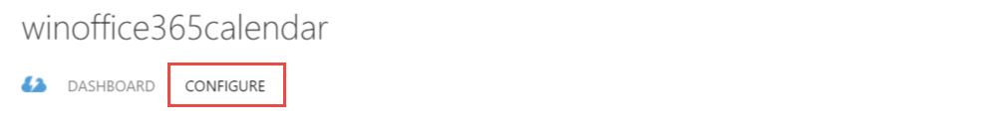
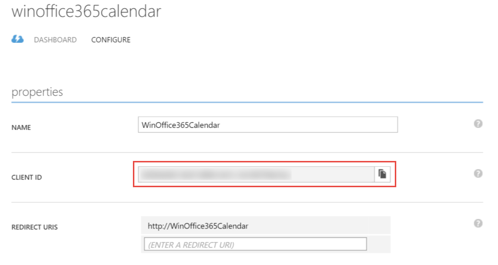
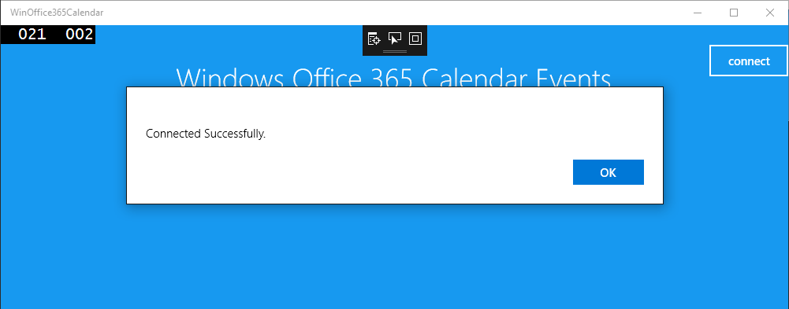
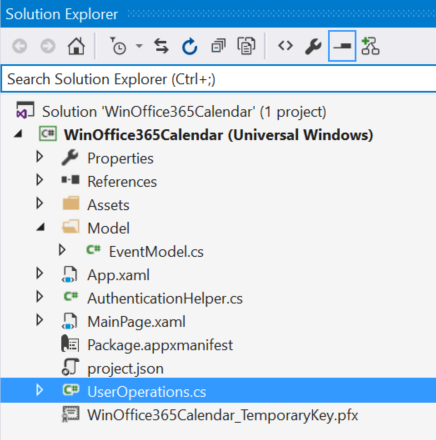
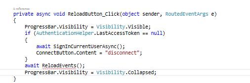

# Calling the Microsoft Graph with a Windows Universal App
In this lab, you will authenticate with Azure AD and get the access token, then access Office 365 data with a Windows 10 Universal Application using the Microsoft Graph.


## Prerequisites

- You must have an Office 365 tenant and Microsoft Azure subscription to complete this lab. If you do not have one, the lab for **O3651-7 Setting up your Developer environment in Office 365** shows you how to obtain a trial.
- You must have Visual Studio 2015.

## Register your application with Azure Active Directory
1. Sign into the [Azure Management Portal](https://manage.windowsazure.com/ "Azure Management Portal") using your Office 365 Developer Site credentials.
2. Click **Active Directory** on the left menu, then click on the **directory** for your Office 365 developer site.
3. On the top menu, click **Applications**.
4. Click **Add** from the bottom menu.
5. On the **What do you want to do** page, click **Add an application my organization is developing**.
6. On the **Tell us about your application** page, specify **WinOffice365Calendar** for the application name and select **NATIVE CLIENT APPLICATION** for Type.

7. Click the **arrow icon** on the bottom-right corner of the page.
8. On the Application information page, specify a Redirect URI, for this example enter **http://WinOffice365Calendar**. Make note of the URI, since you'll need this later when coding the WinOffice365Calendar project. Click the **checkmark** on the bottom-right corner of the page.

9. Once the application has been successfully added, you will be taken to the Quick Start page for the application. From here, click **Configure** on the top menu.

10. On **permissions to other applications**, click **Add application**.

11. Click **Microsoft Graph**, and then click the **check mark icon**. 

12. Under **permissions to other applications**, click the **Delegated Permissions** column for **Microsoft Graph**
- Select **Read User Calendars**.
- Select **Sign in and read user profile**
13. Click **Save**
14. Copy the value specified for **Client ID**; you will need this later when coding the WinOffice365Calendar project.



## Exercise 1: Create a Windows 10 Universal Application and authenticate with Azure AD to get the access token

An access token is required to access the Microsoft Graph, so your application needs to implement the logic to retrieve and manage access tokens.

1. Launch **Visual Studio 2015** as an administrator.
2. In Visual Studio select **File/New/Project**.
3. In the **New Project** dialog, select **Templates/Visual C#/Windows/Universal** and click **Blank App (Universal Windows)**. Name the new project **WinOffice365Calendar** and then click **OK**.  

	

4. In the **New Universal Windows Project** dialog, keep the default settings and click **OK**.  

	

	>**Note:** If you install an early version of Visual Studio Tools for Universal Windows Apps, this dialog won't pop up.
5. Now you need a few NuGet packages to Connect authentication in the application.  Execute the following commands in the Nuget Package Manager Console.

   ````powershell
    PM> Install-Package -Id Microsoft.IdentityModel.Clients.ActiveDirectory
    PM> Install-Package -Id Newtonsoft.Json
	PM> Install-Package -Id Microsoft.Graph
    ````

6. Copy the file **AuthenticationHelper.cs** located the [\\\O3651\O3651-6 Mobile\Universal Windows\Lab Files](Lab Files) folder into **WinOffice365Calendar** project root folder.
7. Include the **AuthenticationHelper.cs** in the project.

	

8. Open the **AuthenticationHelper.cs** file, and enter your redirect URL.

	

9. Open **App.xaml**, and add the following code inside the Application element.
   
    ```xmal
    <Application.Resources>
        <SolidColorBrush x:Key="SampleHeaderBrush" Color="#007ACC" />
        <SolidColorBrush x:Key="ApplicationPageBackgroundThemeBrush" Color="#1799F0" />

        <!-- Add your client id here. -->
        <x:String x:Key="ida:ClientID"></x:String>
        <x:String x:Key="ida:AuthorizationUri">https://login.microsoftonline.com</x:String>

    </Application.Resources>
    ```
    
    

10. Enter your **Client ID**

    

11. Copy the file **MainPage.xaml** located in the [\\\O3651\O3651-6 Mobile\Universal Windows\Lab Files](Lab Files) folder into the **WinOffice365Calendar** project root folder and replace the existing file.
12. Open the file **MainPage.xaml.cs**
13. Add the following `using` statements after the existing `using` statements:

    ```c#
    using System.Threading.Tasks;
    using System.Diagnostics;
    using Windows.UI.Popups;
    ```

14. Add the following **OnNavigatedTo** method to **MainPage** class
 
	```c#
    protected override void OnNavigatedTo(NavigationEventArgs e)
    {
        // Developer code - if you haven't registered the app yet, we warn you. 
        if (!App.Current.Resources.ContainsKey("ida:ClientID"))
        {
            appTitle.Text = "Oops - App not registered with Office 365. To run this sample, you must specify a client Id.";
        }
    }
	```

15. Add the following **SignInCurrentUserAsync** method to authenticate with Azure AD.

    ```c#
    public async Task SignInCurrentUserAsync()
    {
        await AuthenticationHelper.GetGraphAccessTokenAsync();
        if (AuthenticationHelper.LastAccessToken != null)
        {
            Debug.WriteLine("AuthorizationCode: " + AuthenticationHelper.LastAccessToken);
        }
    }
    ```

16. Add the **connect button action** to sign in and sign out.
    ```c#
    //Toggle button for logging user in and out.
    private async void ConnectButton_Click(object sender, RoutedEventArgs e)
    {
        if (AuthenticationHelper.AccessToken == null)
        {
            ProgressBar.Visibility = Visibility.Visible;
            await SignInCurrentUserAsync();
            if (AuthenticationHelper.LastAccessToken == null)
            {
                Debug.WriteLine("Unable to log in user.");
            }
            else
            {
                var messageDialog = new MessageDialog("Connected Successfully.");
                messageDialog.Commands.Add(new UICommand(
                        "OK", null));
                await messageDialog.ShowAsync();
                ConnectButton.Content = "Disconnect";
            }
        }
        else
        {
            ProgressBar.Visibility = Visibility.Visible;
            AuthenticationHelper.SignOut();
            ConnectButton.Content = "connect";
        }
        ProgressBar.Visibility = Visibility.Collapsed;
    }
    ```
17. Add the **ReloadButton_Click** to to **MainPage** class

    ```c#
    private async void ReloadButton_Click(object sender, RoutedEventArgs e)
    {
        
    }
    ```

18. Configure the following settings for VS.

    

19. Press **F5** to run the app.

    

20. Click the **Connect** button.

    

21. Enter your email and password, then click the **Sign In** button.
22. The message box will confirm a successful log in.  Click **OK**.

    

23. You can find debug message about access token in VS output window. 

    

24. Now you have authenticated successfully with Azure AD.
25. Click the **Disconnect** button to sign out.

## Exercise 2: Access the Microsoft Graph to list calendar events
 
After returning the access token, we can access the Microsoft Graph to list calendar events.

01. Right-click the project and select **Add/New Folder**.
02. Name the folder **Model**. 
03. Copy the file **EventModel.cs** located in the [\\\O3651\O3651-6 Mobile\Universal Windows\Lab Files](Lab Files) folder into the Model folder.
04. Include the **EventModel.cs** file in the **WinOffice365Calendar** project.
05. Copy the file **UserOperations.cs** located in the [\\\O3651\O3651-6 Mobile\Universal Windows\Lab Files](Lab Files) folder into the **WinOffice365Calendar** project's root folder. 
06. Include the **UserOperations.cs** file in the **WinOffice365Calendar** project. 
    
    

07. Add the following code to the end in the **UserOperations.cs** class.

	 ```c#
	private GraphServiceClient GetGraphServiceClient()
    {
        var authenticationProvider = new DelegateAuthenticationProvider(
            (requestMessage) =>
            {
                requestMessage.Headers.Authorization = new AuthenticationHeaderValue("Bearer", AuthenticationHelper.LastAccessToken);
                return Task.FromResult(0);
            });

        return new GraphServiceClient(authenticationProvider);
    }
   ```

   

08. Add the following code to the **GetMyEvents** method in the **UserOperations.cs** class.

	 ```c#
	List<EventModel> retEvents = null;
    try
    {
        var graphClient = GetGraphServiceClient();
        var filter = string.Format("Start/DateTime ge '{0}'", DateTime.Now.AddMonths(-1).ToString("yyyy/MM/dd HH:mm"));
        var options = new Option[] { new QueryOption("$filter", filter), new QueryOption("top", "1000") };
        var events = await graphClient.Me.Events.Request(options).GetAsync();
        if (events != null)
        {
            retEvents = new List<EventModel>();
            foreach (var item in events)
            {
                var subject = item.Subject;
                DateTime start = DateTime.Parse(item.Start.DateTime);
                DateTime end = DateTime.Parse(item.End.DateTime);
                retEvents.Add(new EventModel
                {
                    start = start.ToString("yyyy/MM/dd HH:mm"),
                    end = end.ToString("yyyy/MM/dd HH:mm"),
                    subject = subject
                });
            }

        }
    }
    catch (Exception el)
    {
        el.ToString();
    }
    return retEvents;
   ```
   
   

09. Open the **MainPage.xaml.cs** file and add the following `using` statement after the existing `using` statements.

	```c#
	using WinOffice365Calendar.Model;
	```

10. Add the **UserOperations** definition to to **MainPage** class.

    ```c#
    private UserOperations _userOperations = new UserOperations();
    ```
    
    

11. Add the following code to the **ReloadButton_Click** method.

	```c#
    ProgressBar.Visibility = Visibility.Visible;
    if (AuthenticationHelper.LastAccessToken == null)
    {
        await SignInCurrentUserAsync();
        ConnectButton.Content = "disconnect";
    }
    await ReloadEvents();
    ProgressBar.Visibility = Visibility.Collapsed;
	```

   

09. Add the **ReloadEvents** method to the **MainPage** class

	```c#
    public async Task ReloadEvents()
    {
        List<EventModel> eventlist = await _userOperations.GetMyEvents();
        if(eventlist != null && eventlist.Count > 0)
        {
            UsersList.ItemsSource = eventlist;
            UsersList.Visibility = Visibility.Visible;
        }
        else
        {
            UsersList.ItemsSource = null;
            UsersList.Visibility = Visibility.Collapsed;
        }
    }
	```

10. Remove the message box code from the  **ConnectButton_Click** method.  The method will look like this after you remove the code.

    ```c#
    private async void ConnectButton_Click(object sender, RoutedEventArgs e)
    {
        if (AuthenticationHelper.AccessToken == null)
        {
            ProgressBar.Visibility = Visibility.Visible;
            await SignInCurrentUserAsync();
            if (AuthenticationHelper.LastAccessToken == null)
            {
                Debug.WriteLine("Unable to log in user.");
            }
            else
            {
                ConnectButton.Content = "Disconnect";
            }
        }
        else
        {
            ProgressBar.Visibility = Visibility.Visible;
            AuthenticationHelper.SignOut();
            ConnectButton.Content = "connect";
        }
        ProgressBar.Visibility = Visibility.Collapsed;
    }
    ```
11. Press **F5** to run the app.
12. Click the **Connect** button to authenticate with Azure AD.
13. After authenticating successfully, click the **Load Events** button.
14. You will find the events in your calendar for the last 30 days.

    

15. Close the Windows Universal Application, terminate the debugging session and return to Visual Studio.


## Summary

In this exercise, you used the Microsoft Graph within a Windows Universal Application.

**Congratulations! In this lab you have created your first Azure AD application that enabled access to the Microsoft Graph within a Windows Universal Application!**
