# Overview of Office 365 Development
In this lab, you will work with existing Office 365 Add-ins.

## Prerequisites
1. You must have an Office 365 tenant to complete this lab. If you do not have one, the lab for **O3651-7 Setting up your Developer environment in Office 365** shows you how to obtain a trial.
2. You must have Word and Excel 2013 available to complete this lab.
3. You must have a Microsoft account to complete this lab. If you do not have one, [sign up](https://signup.live.com/signup.aspx?lic=1).

## Exercise 1: Get to know the Microsoft Graph and the Microsoft Graph Explorer
In this exercise you will get user profile, Office 365 Group and OneDrive information by using the Microsoft Graph and the Microsoft Graph Explorer

1. Get my profile by using the Microsoft Graph.
  1. Navigate to the [Graph Explorer](http://graphexplorer2.azurewebsites.net/).
  2. Log in with your Microsoft account.
  3. Select **GET** and input this URL https://graph.microsoft.com/v1.0/me
  4. Press **Enter** to get the current user's profile information.

     

2. Get Office 365 Groups by using the Microsoft Graph
  1. Navigate to the [Office 365 login page](https://login.microsoftonline.com).
  2. Sign in with your Microsoft account     
  3. Click **People**

     

  4. Click **Create** in the Groups section.   
  
     

  5. Input a new Office 365 Group name and click **Create**
  
     

  6. Navigate to the [Graph Explorer](http://graphexplorer2.azurewebsites.net/)
  7. Log in with your Microsoft account.   
  8. Select **GET** and input this URL https://graph.microsoft.com/v1.0/groups
  9. Press **Enter** to get all of the Office 365 Groups.  Locate the Office 365 Group you just created in the list.

     

3. Get files from OneDrive by using the Microsoft Graph
  1. Navigate to the [Office 365 login page](https://login.microsoftonline.com)    
  2. Sign in with your Microsoft Account.
  3. Click **OneDrive**
     
	

  4. Click **Upload** -> **Files** in the ribbon. Choose a local file and click **Open** to upload a file into OneDrive.
     
	

  5. Navigate to the [Graph Explorer](http://graphexplorer2.azurewebsites.net/).
  6. Log in with your Microsoft account.
  7. Select **GET** and input this URL https://graph.microsoft.com/v1.0/me/drive/root/children
  8. Press **Enter** to get a list of all of the files in OneDrive.  Notice the new file you uploaded is in the list.

     

## Exercise 2: Add-ins for SharePoint 
In this exercise you will download, install and investigate an existing Add-in for SharePoint.

1. Log into your Office 365 tenant.
  1. Navigate to any site for which you are an administrator.
2. Install an existing Add-in for SharePoint
  1. Click **Site Contents**.
  2. Click **Add an App**<br/>
     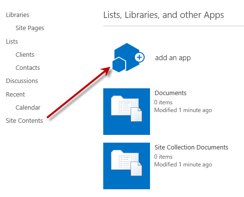
  3. Click **SharePoint Store**
  4. Search the SharePoint Store for **World Clock and Weather**<br/>
     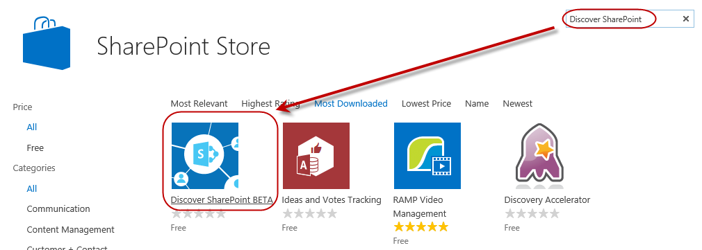
  5. Click the **World Clock and Weather**
  6. Click **Add it**<br/>
     
  7. When prompted, click **Continue**.<br/>
     
  8. Click **Return to site**.<br/>
     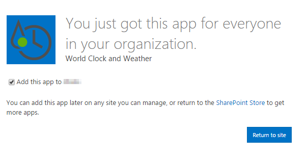


  9. Click **Trust It**.<br/>
     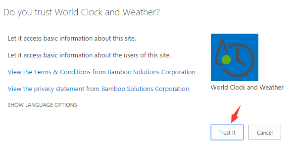

3. Use the new Add-in
  1. Launch the **World Clock and Weather** Add-in.<br/>
     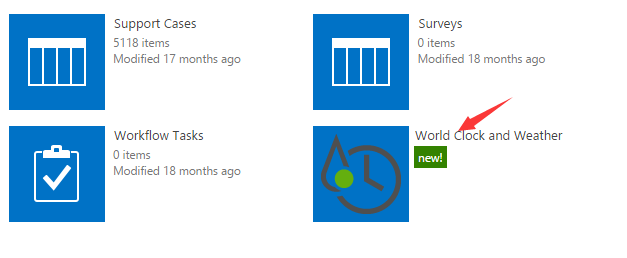
  2. Note that the Add-in launches into a full-screen experience.
  3. Note that the Add-in also provides a link to return to the SharePoint host web.<br/>
     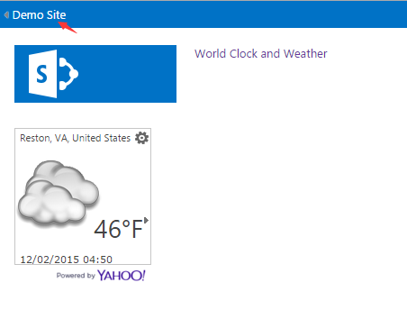
  4. Navigate the Add-in to review its content.
  5. Click **Your Site Name** to return to the host web.

## Exercise 3: Add-in for Office (Word)
In this exercise, you will download, install and investigate an Office Add-in  hosted by Word.

1. Install an existing Add-in for Office
  1. Launch **Word 2013**.
  2. When Word 2013 starts, click **Blank Document**.<br/>
     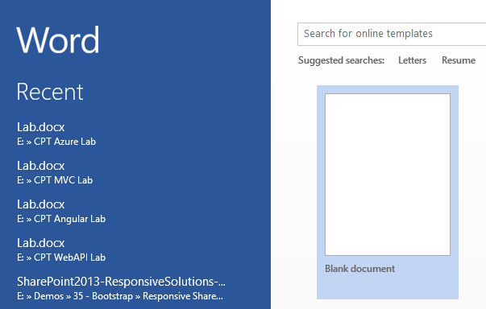
  3. Click the **Insert** tab.
  4. In the **Add-Ins** group, click **Store**.<br/>
     
  5. In the store, search for **Wikipedia**.
  6. Select the App title **Wikipedia**.<br/>
     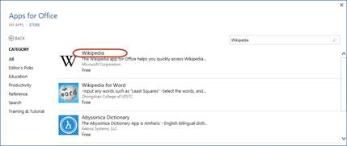
  7. When prompted, click **Trust It**.<br/>
     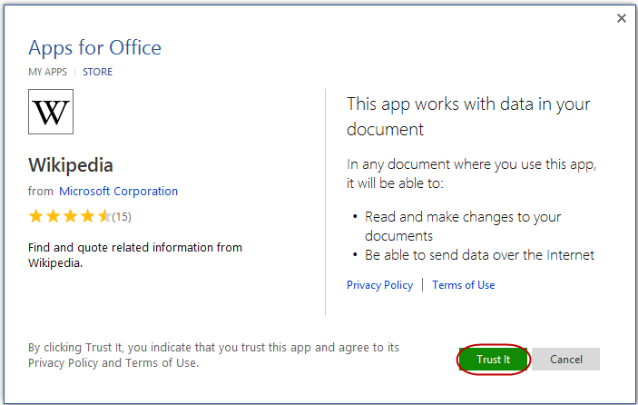
2. Use the new Add-in
  1. In the Wikipedia task pane, search for **Azure**.
  2. Click **EXPAND ARTICLE**.<br/>
     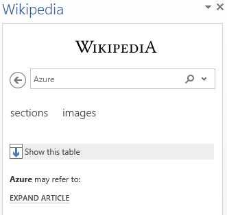
  2. Click **Microsoft Azure**.<br/>
     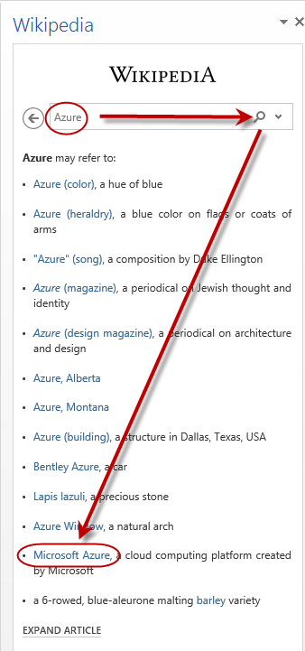
  3. Click **Sections**.
  5. Click **History**.<br/>
     
  5. Highlight the first few paragraphs.
  6. Click the **Plus** symbol (+) to insert the text.<br/>
     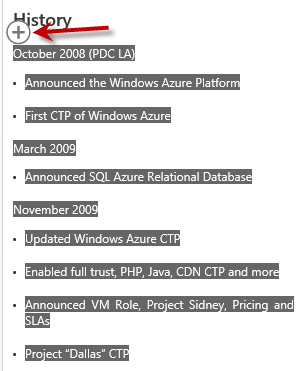
3. Close Word 2013.

## Exercise 4: Add-in for Office (Excel)
In this exercise, you will download, install and investigate an Office Add-in hosted by Excel.

1. Sign up to access sample data.
  1. Navigate to the [Azure Data Market](https://datamarket.azure.com/home).
  2. Sign in with your Microsoft account.
  3. Search for **crime**.
  4. Click **2006-2008 Crime in the United States**<br/>
     
  5. Click **Sign Up**<br/>
     
  6. When complete, click **Explore this Dataset**.<br/>
     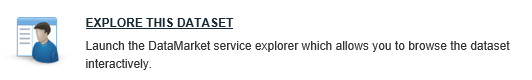
  7. Click **Show** to display the **Primary Account Key**<br/>
     
2. Import data into the Excel spreadsheet
  1. In Excel 2013, click the **Data** tab.
  2. In the **Get External Data** group, click **From Web**.<br/>
     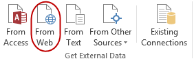
  3. Enter the following URL  and click **GO**. When prompted for a user name and password, use your **Primary Account Key** for both.
     ```
     https://api.datamarket.azure.com/data.gov/Crimes/v1/CityCrime
     ```
  4. Click **Import**. When prompted for a user name and password, use your **Primary Account Key** for both.
  5. In the spreadsheet, locate the data for **Alaska**.
  6. Hide the columns so that **State**, **City**, and **Viloent Crime** columns are next to each other . <br/>
     
3. Install an existing Office Add-in
  1. Click the **Insert** tab.
  2. In the **Add-Ins** group, click **Store**.<br/>
     
  3. In the store, search for **Modern Trend**.
  4. Select the App title **Modern Trend**.<br/>
     
  5. When prompted, click **Trust It**.<br/>
     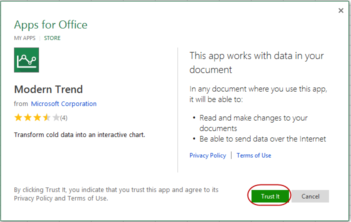
4. Use the Office Add-in
  1. In the app, click **Select Your Data**. <br/>
     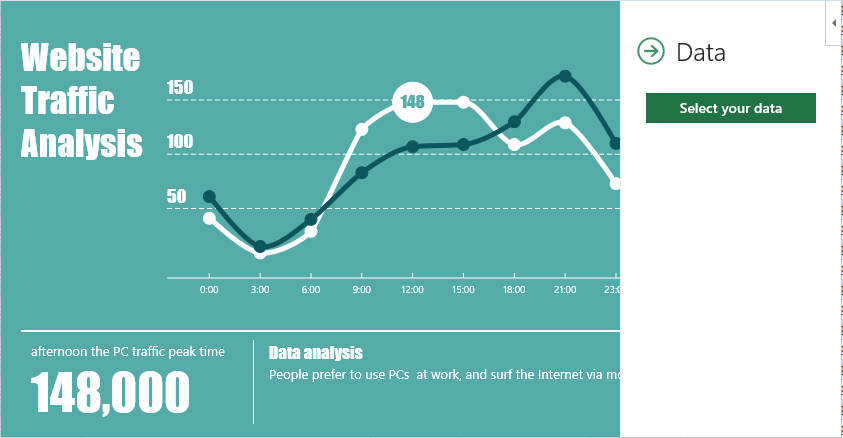
  2. Select the cities and crime statistices.<br/>
     
  3. Click **Create**.

**Congratulations! You have completed investigating Add-ins for SharePoint and Office.**

