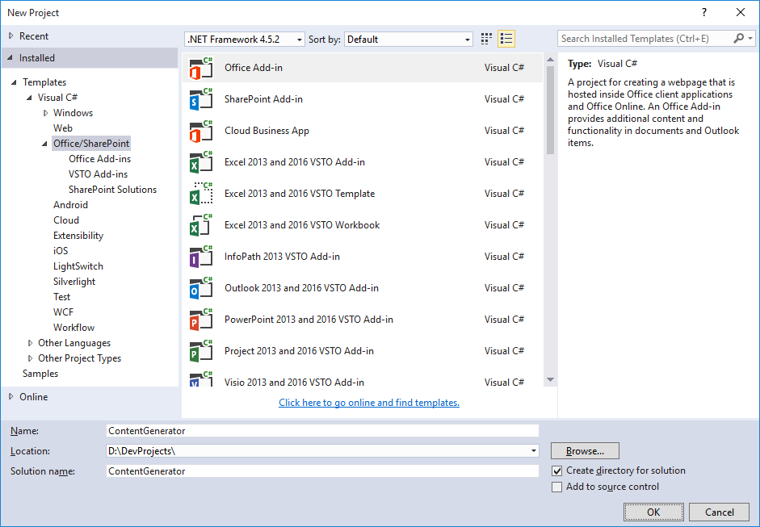
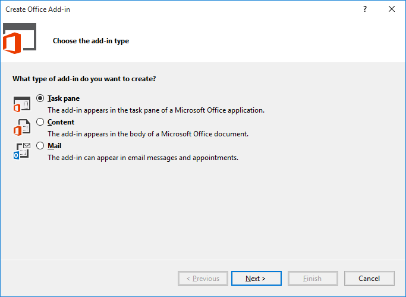
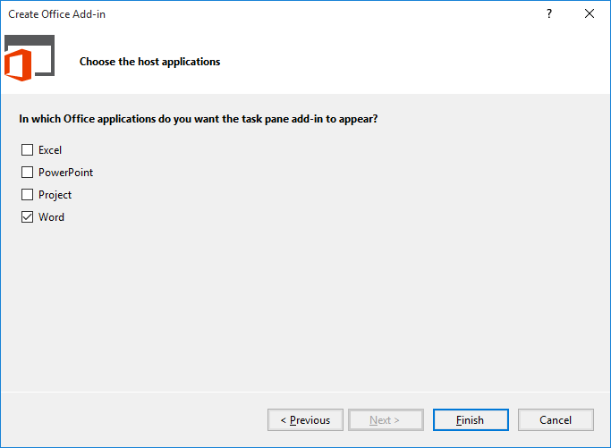
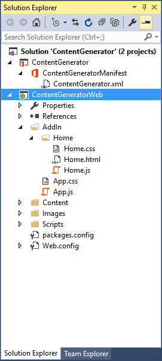
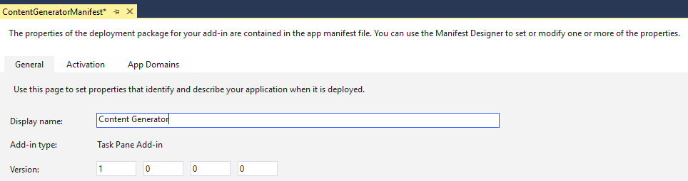
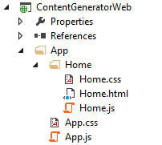
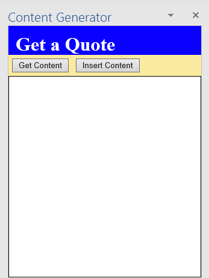

# Getting Started with Office Add-in Development

> **Note:** You can create Office Add-ins with or without Visual Studio 2015.  This lab describes how to make Office add-ins with Visual Studio 2015.  To create Office Add-ins without Visual Studio 2015 please see the following training modules:
>
>[O3657-1 Creating a SharePoint-hosted Add-in using Office UI Fabric and AngularJS](../O3657/O3657-1)
>[O3657-2 Creating Client-Side Only Apps with Angular, ADAL & Microsoft Graph API](../O3657/O3657-2)
>[O3657-3 Building Office Apps for Outlook Using Angular and Material Design](../O3657/O3657-3)
>[O3657-4 Building Office Apps for Excel Using Angular and Material Design](../O3657/O3657-4)

In this lab you will get hands-on experience working with the new Office Add-in development model. Through the exercises in this lab you will learn how to create and test an Office Add-in that runs inside Microsoft Word.

**Prerequisites:** Before you can start this lab, you must have installed Office 2013 with Service Pack 1, Visual Studio 2015 with Update 1, and Microsoft Office Developer Tools for Visual Studio 2015 ENU 14.0.23513 on your development workstation.

## Exercise 1: Creating Your First Office Add-in Project in Visual Studio 2015
*In this exercise you will create a new Office Add-in project in Visual Studio so that you can begin to write, test and debug your first Add-in. The user interface of the Office Add-in you will create in this lab will not be very complicated. You will use the starter user interface that Visual Studio generates automatically when you create a new Office Add-in project and make a few minor adjustments.*

1. Launch Visual Studio 2015 as administrator.
2. From the **File** menu select the **New Project** command. When the **New Project** dialog appears, select the **Office Add-in** project template from the **Office/SharePoint** template folder as shown below. Name the new project **ContentGenerator** and click **OK** to create the new project.
<br/>

3. When you create a new Office Add-in project, Visual Studio prompts you with the **Choose the Add-in type** page of the **Create Office Add-in** dialog. This is the point where you select the type of Office Add-in you want to create. Leave the default setting with the radio button titled **Task pane** and select **Next** to continue.
<br/>

4. On the **Choose the host applications** page of the **Create Office Add-in** dialog, uncheck all the Office application except for **Word** and then click **Finish** to create the new Visual Studio solution. 
<br/>

5. Take a look at the structure of the new Visual Studio solution once it has been created. At a high-level, the new solution has been created using two Visual Studio projects named **ContentGenerator** and **ContentGeneratorWeb**. You should also observe that the top project contains a top-level manifest for the Add-in named **ContentGeneratorManifest** which contains a single file named **ContentGenerator.xml**.
<br/>

6. In the Solution Explorer, double-click on the node named **ContentGeneratorManifest** to open the Add-in manifest file in the Visual Studio designer. Update the **Display Name** settings in the Add-in manifest from **ContentGenerator** to **Content Generator**.
<br/>

7. Save and close **ContentGeneratorManifest**.
8. Over the next few steps you will walk through the default Add-in implementation that Visual Studio generated for you when the Add-in project was created. Begin by looking at the structure of the **AddIn** folder which has two important files named **app.css** and **app.js** which contain CSS styles and JavaScript code which is to be used on an app-wide basis.
<br/>

9. You can see that inside the **AddIn** folder there is a child folder named **Home** which contains three files named **Home.html**, **Home.css** and **Home.js**. Note that the Add-in project is currently configured to use **Home.html** as the Add-in's start page and that **Home.html** is linked to both **Home.css** and **Home.js**.
 
10. Double-click on **app.js** to open it in a code editor window. you should be able to see that the code creates a global variable named **app** based on the JavaScript *Closure* pattern. The global **app** object defines a method named **initialize** but it does not execute this method. 

    ````javascript    
    var app = (function () {
        "use strict";

        var app = {};

        // Common initialization function (to be called from each page)
        app.initialize = function () {
        $('body').append(
            '<div id="notification-message">' +
            '<div class="padding">' +
            '<div id="notification-message-close"></div>' +
            '<div id="notification-message-header"></div>' +
            '<div id="notification-message-body"></div>' +
            '</div>' +
            '</div>');

            $('#notification-message-close').click(function () {
            $('#notification-message').hide();
            });

            // After initialization, expose a common notification function
            app.showNotification = function (header, text) {
            $('#notification-message-header').text(header);
            $('#notification-message-body').text(text);
            $('#notification-message').slideDown('fast');
            };
        };

            return app;
    })();
    ````
    
11. Close **app.js** and be sure not to save any changes.
12. Next you will examine the JavaScript code in **home.js**. Double-click on **home.js** to open it in a code editor window. Note that **Home.html** links to **app.js** before it links to **home.js** which means that JavaScript code written in **Home.js** can access the global **app** object created in **app.js**.
13. Walk through the code in **Home.js** and see how it uses a self-executing function register an event handler on the **Office.initialize** method which in turn registers a document-read event handler using jQuery. This allows the Add-in to call **app.initialize** and to register an event handler using the **getDataFromSelection** function. 
 
 	````javascript
    (function () {
        "use strict";

        // The initialize function must be run each time a new page is loaded
        Office.initialize = function (reason) {
        $(document).ready(function () {
            app.initialize();
            $('#get-data-from-selection').click(getDataFromSelection);
        });
        };

        // Reads data from current document selection and displays a notification
        function getDataFromSelection() {
        Office.context.document.getSelectedDataAsync(Office.CoercionType.Text,
            function (result) {
            if (result.status === Office.AsyncResultStatus.Succeeded) {
                app.showNotification('The selected text is:', '"' + result.value + '"');
            } else {
                app.showNotification('Error:', result.error.message);
            }
        });
        }
    })();
    ````
        
14. Close **Home.js** and be sure not to save any changes.
15. Now it is time to examine the HTML that has been added to the project to create the Add-in's user interface. Double-click **Home.html** to open this file in a Visual Studio editor window. Examine the layout of HTML elements inside the body element. 

	````html
    <body>
        <div id="content-header">
            <div class="padding">
                <h1>Welcome</h1>
            </div>
        </div>
        <div id="content-main">
            <div class="padding">
                <p><strong>Add home screen content here.</strong></p>
                <p>For example:</p>
                <button id="get-data-from-selection">Get data from selection</button>

                <p style="margin-top: 50px;">
                    <a target="_blank" href="https://go.microsoft.com/fwlink/?LinkId=276812">Find more samples online...</a>
                </p>
            </div>
        </div>
    </body>
	````  

16. Replace the text message of **Welcome** inside the **h1** element with a different message such as **My Office Add-in**. Also trim down the contents of the **div** element with the **id** of **content-main** to match the HTML code shown below. 

	````html
    <body>
        <div id="content-header">
            <div class="padding">
                <h1>My Office Add-in</h1>
            </div>
        </div>
        <div id="content-main">
            <div class="padding">
                <button id="get-data-from-selection">Get data from selection</button>
            </div>
        </div>
    </body>
	````        
        
17. Now it's time to test the Add-in using the Visual Studio debugger. Press the **{F5}** key to run the project in the Visual Studio debugger. The debugger should launch Microsoft Word 2013 and you should see your Office Add-in in the task pane on the right as shown in the following screenshot.
<br/>

18. Now test the functionality of the Add-in. Begin by typing some text in the Word document and selecting it as shown in the following screenshot. Once you have selected some text, click the **Get data from select button**. You should see a copy of the selected text appear in a gray box at the bottom of the task pane.
<br/>

19. You have now successfully run and tested the Add-in using the Visual Studio debugger. Close Microsoft Word to stop the debugging session and return to Visual Studio.

## Exercise 2: Creating a Custom User Experience in an Office Add-in
*In this exercise you will continue working on the Visual Studio solution for the ContentGenerator Add-in you created in the previous exercise. You will replace the default user interface with a custom implementation that includes div elements and command buttons along with the JavaScript code which uses jQuery to update HTML elements.*
 
1. In the Solution Explorer, double click on **Home.html** to open it in an editor window. 
2. As you can see, the **head** section of **Home.html** already links to the jQuery library as well as **app.css**, **app.js**, **Home.css** and **Home.js**.
3. Remove all the content from the **body** section of **Home.html** and replace it with the HTML in the following code listing.

    ````html
    <body>

        <div id="topDiv">

            <h2>Get a Quote</h2>

            <div class="toolbar">
                <input id="cmdGetContent" type="button" value="Get Content" />
                <input id="cmdInsertContent" type="button" value="Insert Content" />
            </div>

            <div class="displayPanel">
                <div id="contentArea"></div>
            </div>

        </div>

    </body>
    ````
    
4. Save your changes and close **Home.html**.
5. In the Solution Explorer, double click on **Home.css** to open this CSS file in an editor window.
6. Delete all contents inside **Home.css** and replace it with the following set of CSS rules. 

    ````css
    body {
        margin: 0;
    }

    #topDiv {
        background-color: white;
        padding: 0;
    }

    #topDiv h2 {
        margin: 0;
        font-size: 24pt;
        color: white;
        background-color: #0a00ff;
        padding: 12px;
        height: 24px;
    }

    #topDiv .toolbar {
        background-color: #fbeba0;
        margin: 0;
        padding: 2px;
    }

    #topDiv .toolbar input {
        margin: 4px;
    }

    #topDiv .displayPanel {
        margin: 0;
        border: 1px solid black;
        padding: 6px;
        font-size: 12px;
        font-family: "Garamond, Arial, sans-serif";
        background-color: white;
        color: blue;
        min-height: 320px;
    }
    ````

7. Save your changes and close **Home.css**.
8. In the Solution Explorer, double click on **Home.js** to open this JavaScript file in an editor window. Modify the code in **Home.js** to match the code shown in the following code listing which provides app initialization code and adds three emtpy functions named **getQuote**, **cmdGetContent** and **cmdInsertContent**. 

    ````javascript
    (function () {
        "use strict";

        Office.initialize = function (reason) {
        $(document).ready(function () {
            app.initialize();
        });
        };

        function getQuote() {
        }

        function cmdGetContent() {
        }

        function cmdInsertContent() {
        }

    })(); 
    ````

9. Directly below the call to **app.initialize**, add a line of code to register the **cmdGetContent** function as an event handler for the **click** event of the command button with the **id** of **cmdGetContent**. Likewise, add a second line of code to register the **cmdInsertContent** function as an event handler for the **click** event of  the command button with the **id** of **cmdInsertContent**.   

    ````javascript
    Office.initialize = function (reason) {
        $(document).ready(function () {
        app.initialize();
        // adding event handlers for app command buttons
        $("#cmdGetContent").click(cmdGetContent);
        $("#cmdInsertContent").click(cmdInsertContent);
        });
    };
    ````
    
10. Implement the **getQuote** function to return a random quote from a string array of quotes as shown in the following code listing.

    ````javascript
    function getQuote() {

        var quotes = [
        "I would rather have an Agave bottle in front of me than a frontal lobatomy.",
        "Better to remain silent and be thought a fool than to speak and erase all doubt.",
        "A two-year-old is kind of like having a blender, but you don't have a top for it.",
        "Between two evils, I always pick the one I never tried before."
        ];

        var index = Math.floor(Math.random() * quotes.length);
        return quotes[index];
    }
    ````
        
11. Implement the **cmdGetContent** function to call the **getQuote** function to return a string-based quote. Display the quote on the Add-in's start page by writing it to the div with the **id** of **contentArea**.

    ````javascript
    function cmdGetContent() {
        // display quote inside Agave
        $("#contentArea").html(getQuote());
    }
    ````
    
12. Now it's time to test the Add-in using the Visual Studio debugger. Press the **{F5}** key to run the project in the Visual Studio debugger. The debugger should launch Microsoft Word 2013 and you should see your Office Add-in in the task pane on the right as shown in the following screenshot.
<br/>

13. Now test the functionality of the Add-in by clicking the **Get Content** button. Each time you click this button you should see a different quote appear below as shown in the following screenshot.
<br/>

14. You have now successfully implemented a custom user experience for the Add-in using HTML, CSS and JavaScript. Close Microsoft Word to stop the debugging session and return to Visual Studio.


## Exercise 3: Writing Add-in Code that Generates Content in a Word document
*In this exercise you will continue working on the Visual Studio solution for the ContentGenerator Add-in you worked on in the previous exercise. You will extend the Add-in's capabilities by adding JavaScript code to insert content into the active Word document.*

1. Open the Add-in's main JavaScript logic file named **Home.js** if it is not already open.
2. Locate the **cmdInsertContent** function which should currently be an empty function.
3. Implement the **cmdInsertContent** function to read the current quote from the **contentArea** div and write it into the current Word document at the cursor location. You can accomplish this by calling the **setSelectedDataAsync** method of the **Office.context.document** object using the following syntax.

    ````javascript
    function cmdInsertContent() {
        // insert current quote in Active Word document
        var quote = $("#contentArea").html();
        Office.context.document.setSelectedDataAsync(quote, {}, function () { });
    }
    ````
    
4. Now test the functionality of the Add-in by pressing the {**{F5}** key to start a debugging session. Begin your testing by clicking the **Get Content** button to display a new quote inside the Add-in's user interface in the task pane. Next, click the "Insert Content** button to insert the quote into the current Word document as shown in the following screenshot.
<br/>

5. You have now successfully implemented the Add-in logic required in this lab exercise. Close Microsoft Word to stop the debugging session and return to Visual Studio.
