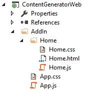

# Getting Started with Office Add-in Development

In this lab you will get hands-on experience working with the new Office Add-in development model. Through the exercises in this lab you will learn how to create and test a Word Web Add-in.

## Prerequisites
Before you can start this lab, you must have installed Office (2016 recommended), Visual Studio 2017 with component Office Developer Tools for Visual Studio.

> **Note:** Visual Studio 2017 is currently in RC, only Visual Studio 2017 Professional and Enterprise have component Office Developer Tools for Visual Studio. There may be a standalone installer of Office Developer Tools for Visual Studio 2017 Community in the future.

## Exercise 1: Creating Your First Word Web Add-in Project in Visual Studio 2017
*In this exercise you will create a new Word Web Add-in project in Visual Studio so that you can begin to write, test and debug your first Add-in. The user interface of the Word Web Add-in you will create in this lab will not be very complicated. You will use the starter user interface that Visual Studio generates automatically when you create a new Word Web Add-in project and make a few minor adjustments.*

1. Launch Visual Studio 2017.
2. From the **File** menu select the **New Project** command. When the **New Project** dialog appears, select the **Word Web Add-in** project template from **Add-ins** group of the **Office/SharePoint** template folder as shown below. Name the new project **ContentGenerator** and click **OK** to create the new project.
<br/>

3. Take a look at the structure of the new Visual Studio solution once it has been created. At a high-level, the new solution has been created using two Visual Studio projects named **ContentGenerator** and **ContentGeneratorWeb**. You should also observe that the top project contains a top-level manifest for the Add-in named **ContentGeneratorManifest** which contains a single file named **ContentGenerator.xml**.
<br/>

4. In the Solution Explorer, double-click on the node named **ContentGeneratorManifest** to open the Add-in manifest file. Update the **DisplayName** property from **ContentGenerator** to **Content Generator**.
<br/>

	> **Note:** Visual Studio 2017 is currently in RC, you can only update the manifest by editing the file content since manifest designer is not available. When manifest designer is available in the future, you could update the manifest in the visual user interface.

5. Save and close **ContentGenerator.xml**.
6. Over the next few steps you will walk through the default Add-in implementation that Visual Studio generated for you when the Add-in project was created.
7. You can see that the project contains three files named **Home.html**, **Home.css** and **Home.js**. Note that the Add-in project is currently configured to use **Home.html** as the Add-in's start page and that **Home.html** is linked to both **Home.css** and **Home.js**.
8. Double-click on **home.js** to open it in a code editor window.
9. Walk through the code in **Home.js** and see how it uses a self-executing function register an event handler on the **Office.initialize** method which in turn registers a document-ready event handler using jQuery. This allows the Add-in to register click event handler for the **Highlight!** button. 
 
	````javascript
	/// <reference path="/Scripts/FabricUI/MessageBanner.js" />


	(function () {
	    "use strict";
	
	    var messageBanner;
	
	    // The initialize function must be run each time a new page is loaded.
	    Office.initialize = function (reason) {
	        $(document).ready(function () {
	            // Initialize the FabricUI notification mechanism and hide it
	            var element = document.querySelector('.ms-MessageBanner');
	            messageBanner = new fabric.MessageBanner(element);
	            messageBanner.hideBanner();
	
	            // If not using Word 2016, use fallback logic.
	            if (!Office.context.requirements.isSetSupported('WordApi', '1.1')) {
	                $("#template-description").text("This sample displays the selected text.");
	                $('#button-text').text("Display!");
	                $('#button-desc').text("Display the selected text");
	                
	                $('#highlight-button').click(displaySelectedText);
	                return;
	            }
	
	            $("#template-description").text("This sample highlights the longest word in the text you have selected in the document.");
	            $('#button-text').text("Highlight!");
	            $('#button-desc').text("Highlights the longest word.");
	            
	            loadSampleData();
	
	            // Add a click event handler for the highlight button.
	            $('#highlight-button').click(hightlightLongestWord);
	        });
	    };
	
		...// Code ommitted for brevity
	
	    function hightlightLongestWord() {
	        Word.run(function (context) {
	            // Queue a command to get the current selection and then
	            // create a proxy range object with the results.
	            var range = context.document.getSelection();
	            
	            // This variable will keep the search results for the longest word.
	            var searchResults;
	            
	            // Queue a command to load the range selection result.
	            context.load(range, 'text');
	
	            // Synchronize the document state by executing the queued commands
	            // and return a promise to indicate task completion.
	            return context.sync()
	                .then(function () {
	                    // Get the longest word from the selection.
	                    var words = range.text.split(/\s+/);
	                    var longestWord = words.reduce(function (word1, word2) { return word1.length > word2.length ? word1 : word2; });
	
	                    // Queue a search command.
	                    searchResults = range.search(longestWord, { matchCase: true, matchWholeWord: true });
	
	                    // Queue a commmand to load the font property of the results.
	                    context.load(searchResults, 'font');
	                })
	                .then(context.sync)
	                .then(function () {
	                    // Queue a command to highlight the search results.
	                    searchResults.items[0].font.highlightColor = '#FFFF00'; // Yellow
	                    searchResults.items[0].font.bold = true;
	                })
	                .then(context.sync);
	        })
	        .catch(errorHandler);
	    }
	
		...// Code ommitted for brevity

	})();
	````

	> **Note:** the **Office.initialize** implements a fallback logic for word versions other than 2016.
 
10. Close **Home.js** and be sure not to save any changes.
11. Now it is time to examine the HTML that has been added to the project to create the Add-in's user interface. Double-click **Home.html** to open this file in a Visual Studio editor window. Examine the layout of HTML elements inside the body element. 

	````html
	<body>
	    <div id="content-main">
	        <div class="padding">
	            <br />
	            <p class="ms-font-xxl ms-fontColor-neutralSecondary ms-fontWeight-semilight">Sample</p>
	            <br /><br />
	            <div class="ms-font-xl ms-fontColor-neutralTertiary">Select some text</div>
	            <p class="ms-font-m-plus ms-fontColor-neutralTertiary" id="template-description"></p>
	            <div class="ms-font-m"><a target="_blank" class="ms-Link ms-Link--hero" href="https://go.microsoft.com/fwlink/?LinkId=276812">Find more samples online...</a></div>
	            <br /><br />
	
	            <button class="ms-Button ms-Button--primary" id="highlight-button">
	                <span class="ms-Button-icon"><i class="ms-Icon ms-Icon--plus"></i></span>
	                <span class="ms-Button-label" id="button-text"></span>
	                <span class="ms-Button-description" id="button-desc"></span>
	            </button>
	        </div>
	    </div>
	    <div class="footer">
	        <div class="ms-Grid ms-bgColor-themeSecondary">
	            <div class="ms-Grid-row">
	                <div class="ms-Grid-col ms-u-sm12 ms-u-md12 ms-u-lg12"> <div class="ms-font-xl ms-fontColor-white">Contoso</div></div>
	            </div>
	        </div>
	    </div>
	
	    <!-- FabricUI component used for displaying notifications -->
	    <div class="ms-MessageBanner" id="notification-popup">
	        <div class="ms-MessageBanner-content">
	            <div class="ms-MessageBanner-text">
	                <div class="ms-MessageBanner-clipper">
	                    <div class="ms-font-m-plus ms-fontWeight-semibold" id="notification-header"></div>
	                    <div class="ms-font-m ms-fontWeight-semilight" id="notification-body"></div>
	                </div>
	            </div>
	            <button class="ms-MessageBanner-expand" style="display:none"><i class="ms-Icon ms-Icon--chevronsDown"></i> </button>
	            <div class="ms-MessageBanner-action"></div>
	        </div>
	        <button class="ms-MessageBanner-close"> <i class="ms-Icon ms-Icon--x"></i> </button>
	    </div>
	</body>
	````  

12. Replace the text message of **Contoso** inside the footer element with a different message such as **My Office Add-in**.    
        
13. Now it's time to test the Add-in using the Visual Studio debugger. Press the **{F5}** key to run the project in the Visual Studio debugger. The debugger should launch Microsoft Word and you should see the new group named **Commands Groups** including **Show Taskpane** button in the **Home** tab of the Ribbon bar.
<br/>

14. Click the **Show Taskpane** button, you should see your Office Add-in in the task pane on the right as shown in the following screenshot.
<br/>

15. Now test the functionality of the Add-in. Select some text, then click the **Highlight!** button, you should see the longest word in the selected text is highlighted.
<br/>

	> **Note:** The screenshot above is the result of running in Word 2016 .

16. You have now successfully run and tested the Add-in using the Visual Studio debugger. Close Microsoft Word to stop the debugging session and return to Visual Studio.

## Exercise 2: Creating a Custom User Experience in a Word Web Add-in
*In this exercise you will continue working on the Visual Studio solution for the ContentGenerator Add-in you created in the previous exercise. You will replace the default user interface with a custom implementation that includes div elements and command buttons along with the JavaScript code which uses jQuery to update HTML elements.*
 
1. In the Solution Explorer, double click on **Home.html** to open it in an editor window. 
2. As you can see, the **head** section of **Home.html** already links to the jQuery library as well as **Home.css** and **Home.js**.
3. Remove all the content from the **body** section of **Home.html** and replace it with the HTML in the following code listing.

    ````html
	<body>
	    <div id="topDiv">
	        <h2>Get a Quote</h2>
	        <div class="toolbar">
	            <input id="cmdGetContent" type="button" value="Get Content" />
	            <input id="cmdInsertContent" type="button" value="Insert Content" />
	        </div>
	        <div class="displayPanel">
	            <div id="contentArea"></div>
	        </div>
	    </div>
	
	    <!-- FabricUI component used for displaying notifications -->
	    <div class="ms-MessageBanner" id="notification-popup">
	        <div class="ms-MessageBanner-content">
	            <div class="ms-MessageBanner-text">
	                <div class="ms-MessageBanner-clipper">
	                    <div class="ms-font-m-plus ms-fontWeight-semibold" id="notification-header"></div>
	                    <div class="ms-font-m ms-fontWeight-semilight" id="notification-body"></div>
	                </div>
	            </div>
	            <button class="ms-MessageBanner-expand" style="display:none"><i class="ms-Icon ms-Icon--chevronsDown"></i> </button>
	            <div class="ms-MessageBanner-action"></div>
	        </div>
	        <button class="ms-MessageBanner-close"> <i class="ms-Icon ms-Icon--x"></i> </button>
	    </div>
	</body>
    ````
    
4. Save your changes and close **Home.html**.
5. In the Solution Explorer, double click on **Home.css** to open this CSS file in an editor window.
6. Delete all contents inside **Home.css** and replace it with the following set of CSS rules. 

    ````css
    body {
        margin: 0;
    }

    #topDiv {
        background-color: white;
        padding: 0;
    }

    #topDiv h2 {
        margin: 0;
        font-size: 24pt;
        color: white;
        background-color: #0a00ff;
        padding: 12px;
        height: 24px;
    }

    #topDiv .toolbar {
        background-color: #fbeba0;
        margin: 0;
        padding: 2px;
    }

    #topDiv .toolbar input {
        margin: 4px;
    }

    #topDiv .displayPanel {
        margin: 0;
        border: 1px solid black;
        padding: 6px;
        font-size: 12px;
        font-family: "Garamond, Arial, sans-serif";
        background-color: white;
        color: blue;
        min-height: 320px;
    }

	.padding {
	    padding: 15px;
	}
	
	#notification-popup.ms-MessageBanner {
	    position: absolute;
	    left: 0px;
	    bottom: 0px;
	    text-align: left;
	    height: inherit;
	    min-width: inherit;
	}
	
	#notification-popup .ms-MessageBanner-text {
	    margin: 0;
	    padding: 18px 15px;
	    min-width: inherit;
	}
    ````

7. Save your changes and close **Home.css**.
8. In the Solution Explorer, double click on **Home.js** to open this JavaScript file in an editor window. Modify the code in **Home.js** to match the code shown in the following code listing which provides app initialization code and adds three empty functions named **getQuote**, **cmdGetContent** and **cmdInsertContent**. 

	````javascript
	/// <reference path="/Scripts/FabricUI/MessageBanner.js" />
	
	
	(function () {
	    "use strict";
	
	    var messageBanner;
	
	    // The initialize function must be run each time a new page is loaded.
	    Office.initialize = function (reason) {
	        $(document).ready(function () {
	            // Initialize the FabricUI notification mechanism and hide it
	            var element = document.querySelector('.ms-MessageBanner');
	            messageBanner = new fabric.MessageBanner(element);
	            messageBanner.hideBanner();
	
	        });
	    };
	
	    function getQuote() {
	    }
	
	    function cmdGetContent() {
	    }
	
	    function cmdInsertContent() {
	    }
	
	    //$$(Helper function for treating errors, $loc_script_taskpane_home_js_comment34$)$$
	    function errorHandler(error) {
	        // $$(Always be sure to catch any accumulated errors that bubble up from the Word.run execution., $loc_script_taskpane_home_js_comment35$)$$
	        showNotification("Error:", error);
	        console.log("Error: " + error);
	        if (error instanceof OfficeExtension.Error) {
	            console.log("Debug info: " + JSON.stringify(error.debugInfo));
	        }
	    }
	
	    // Helper function for displaying notifications
	    function showNotification(header, content) {
	        $("#notification-header").text(header);
	        $("#notification-body").text(content);
	        messageBanner.showBanner();
	        messageBanner.toggleExpansion();
	    }
	})();
	````

9. At the end of document ready event handler inside **app.initialize**, add a line of code to register the **cmdGetContent** function as an event handler for the **click** event of the command button with the **id** of **cmdGetContent**. Likewise, add a second line of code to register the **cmdInsertContent** function as an event handler for the **click** event of  the command button with the **id** of **cmdInsertContent**.   

    ````javascript
    Office.initialize = function (reason) {
        $(document).ready(function () {
            // Initialize the FabricUI notification mechanism and hide it
            var element = document.querySelector('.ms-MessageBanner');
            messageBanner = new fabric.MessageBanner(element);
            messageBanner.hideBanner();
            // adding event handlers for app command buttons
            $("#cmdGetContent").click(cmdGetContent);
            $("#cmdInsertContent").click(cmdInsertContent);
        });
    };
    ````
    
10. Implement the **getQuote** function to return a random quote from a string array of quotes as shown in the following code listing.

    ````javascript
    function getQuote() {

        var quotes = [
        "I would rather have an Agave bottle in front of me than a frontal lobatomy.",
        "Better to remain silent and be thought a fool than to speak and erase all doubt.",
        "A two-year-old is kind of like having a blender, but you don't have a top for it.",
        "Between two evils, I always pick the one I never tried before."
        ];

        var index = Math.floor(Math.random() * quotes.length);
        return quotes[index];
    }
    ````
        
11. Implement the **cmdGetContent** function to call the **getQuote** function to return a string-based quote. Display the quote on the Add-in's start page by writing it to the div with the **id** of **contentArea**.

    ````javascript
    function cmdGetContent() {
        // display quote inside Agave
        $("#contentArea").html(getQuote());
    }
    ````
    
12. Now it's time to test the Add-in using the Visual Studio debugger. Press the **{F5}** key to run the project in the Visual Studio debugger. The debugger should launch Microsoft Word. Click **Show Taskpane** in the Ribbon bar, you should see your Office Add-in in the task pane on the right as shown in the following screenshot.
<br/>

13. Now test the functionality of the Add-in by clicking the **Get Content** button. Each time you click this button you should see a different quote appears below as shown in the following screenshot.
<br/>

14. You have now successfully implemented a custom user experience for the Add-in using HTML, CSS and JavaScript. Close Microsoft Word to stop the debugging session and return to Visual Studio.


## Exercise 3: Writing Add-in Code that Generates Content in a Word document
*In this exercise you will continue working on the Visual Studio solution for the ContentGenerator Add-in you worked on in the previous exercise. You will extend the Add-in's capabilities by adding JavaScript code to insert content into the active Word document.*

1. Open the Add-in's main JavaScript logic file named **Home.js** if it is not already open.
2. Locate the **cmdInsertContent** function which should currently be an empty function.
3. Implement the **cmdInsertContent** function to read the current quote from the **contentArea** div and write it into the current Word document at the cursor location. You can accomplish this by calling the **setSelectedDataAsync** method of the **Office.context.document** object using the following syntax.

    ````javascript
    function cmdInsertContent() {
        // insert current quote in Active Word document
        var quote = $("#contentArea").html();
        Office.context.document.setSelectedDataAsync(quote, {}, function () { });
    }
    ````
    
4. Now test the functionality of the Add-in by pressing the **{F5}** key to start a debugging session. Click **Show Taskpane** in the Ribbon bar. Begin your testing by clicking the **Get Content** button to display a new quote inside the Add-in's user interface in the task pane. Next, click the "Insert Content** button to insert the quote into the current Word document as shown in the following screenshot.
<br/>

5. You have now successfully implemented the Add-in logic required in this lab exercise. Close Microsoft Word to stop the debugging session and return to Visual Studio.
