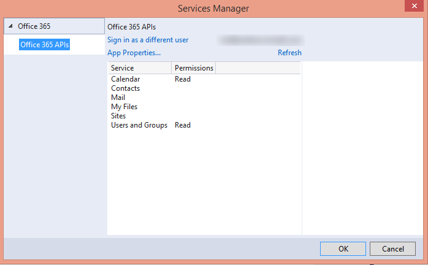

# Getting started with Office 365 APIs
In this lab, you will investigate the O365 APIs.

## Prerequisites
1. You must have an Office 365 tenant to complete this lab. If you do not have one, the lab for **O3651-7 Setting up your Developer environment in Office 365** shows you how to obtain a trial.

## Exercise 1: Obtain the  Office 365 API Tools
In this exercise you install the Office 365 API Tools in Visual Studio. The easiest way to do this is to install the Office Developer tools for Visual Studio 2013.

1. Navigate to the [dev.office.com :arrow_right: Getting Started](http://dev.office.com/getting-started) page.
1. Click the link for the **Office Developer Tools for Visual Studio 2013** found on that page. You can also download the link form here: http://aka.ms/OfficeDevToolsForVS2013.
1. Run the executable you just downloaded to install the tools. It will launch the Microsoft Web Platform Installer pre-configured to download the Office Developer Tools for Visual Studio 2013. Proceed through the wizard to install the tools and all necessary dependencies.

  
  > This lab is based on the Office 365 API Tools version 1.3.41104.1. Later versions may have subtle differences in the screen shots & steps outlined in this module. 

## Exercise 2: Create & Configure an MVC Web Application
In this exercise you will create a new MVC web application to utilize the O365 APIs.

1. In Visual Studio, click **File/New/Project**.
1. In the **New Project** dialog
  1. Select **Templates/Visual C#/Web**.
  1. Select **ASP.NET Web Application**.

    

  1. Click **OK**.
1. In the **New ASP.NET Project** dialog
  1. Click **MVC**.
  2. Click **Change Authentication**.
  3. Select **No Authentication**.
  4. Click **OK**.
  5. Click **OK**.

    

1. Update the web project to use SSL by default:
  1. In the **Solution Explorer** tool window, select the project and look at the **Properties** tool window. 
  1. Change the property **SSL Enabled** to **TRUE**.
  1. Copy the **SSL URL** property to the clipboard for use in the next step.
  1. Save your changes.

    
    > It is important to do this now because in the next step when you create the application in Azure AD, you want the reply URL to use HTTPS. If you did not do this now, you would have to manually make the changes the Visual Studio wizard is going to do for you in creating the app.
    
1. Configure the project to always go to the homepage of the web application when debugging:
  1. In the **Solution Explorer** tool window & select **Properties**.
  1. Select the **Web** tab in the left margin.
  1. Find the section **Start Action**.
  1. Click the radio button **Start URL** and enter the SSL URL of the web project that you copied from the previous step.

1. Now add the Office 365 APIs as a connected service:
  1. In the **Solution Explorer**, right click the project and select **Add/Connected Service**.
  1. In the **Services Manager** dialog...
    1. Click **Register Your App**.
    1. When prompted sign in with your **Organizational Account**.
    1. Click **App Properties**.
    1. Make a note of the name of the application as you will need this in the next exercise.
    1. Verify the option **Single Organization** is selected.
    1. Make sure there is only a single URL listed in the **Redirect URIs** and it is the HTTPS URL of the web project.
    1. Click **Apply**.
    1. Click **Calendar**.
    1. Click **Permissions**.
    1. Check **Read users' calendar**.
    1. Click **Apply**.
    1. Click **Users and Groups**.
    1. Click **Enable sign-on and read user' profiles**.
    1. Click **Apply**.
    1. Click **OK**.

     

## Exercise 3: Configure Web Application to use Azure AD and OWIN
In this exercise you will take the ASP.NET MVC web application you created in the previous exercise and configure it to use Azure AD & OpenID Connect for user & app authentication. You will do this by utilizing the OWIN framework. Once authenticated, you can use the access token returned by Azure AD to access the Office 365 APIs.

1. Obtain and store the Azure AD tenant ID in the `web.config`.
  1. Browse to the [Azure Management Portal](https://manage.windowsazure.com) and sign in with your **Organizational Account**.
  1. In the left-hand navigation, click **Active Directory**.
  1. Select the directory you share with your Office 365 subscription.
  1. Select the application you created for this lab. This is the name of the application in the **App Properties** dialog when you were adding the **Connected Service** in the last exercise.
  1. Select the **Quick Start** page for the in the top navigation... that's the left-most menu item that looks like a lightning bolt in a cloud:

    
 
  1. On the Quick Start page, expand the **Get Started** / **Enable Users to Sign On**. Locate the field **Federation Metadata Document URL**. Within that field value you will see a GUID immediately after the `login.windows.net` part of the URL. Copy just the GUID value to the clipboard.

    

  1. Open the `web.config` file in the project.
  1. Add the following node to the `<appSettings>` section, setting the value equal to the **directory tenant ID** you acquired in the previous step:

    ````xml
    <add key="ida:TenantId" value="######-####-####-####-############"/>
    ````

1. Now you need a few NuGet packages to enable OWIN OpenID Connect authentication & to create a secure token cache (using Entity Framework) in the application:
  1. Open the Package Manager Console: **View/Other Windows/Package Manager Console**.
  1. Enter each line below in the console, one at a time, pressing **ENTER** after each one. NuGet will install the package and all dependent packages:

    ````powershell
    PM> Install-Package -Id EntityFramework
    PM> Install-Package -Id Microsoft.IdentityModel.Clients.ActiveDirectory
    PM> Install-Package -Id Microsoft.Owin.Host.SystemWeb
    PM> Install-Package -Id Microsoft.Owin.Security.Cookies
    PM> Install-Package -Id Microsoft.Owin.Security.OpenIdConnect
    ````

1. Add a new model that will be used by our persistent token cache:
  1. Right-click **Models** folder in the project and select **Add/Class**.
  1. Name the class **PerWebUserCache.cs**.
  1. When the file has been created, add the following code to the class:

    ````c#
    [Key]
    public int EntryId { get; set; }
    public string webUserUniqueId { get; set; }
    public byte[] cacheBits { get; set; }
    public DateTime LastWrite { get; set; }
    ````

  1. At the top of the file, add the following `using` statement:

    ````c#
    using System.ComponentModel.DataAnnotations;
    ````

1. Add a new persistent data store that will be used for the token cache:
  1. Right-click the project and select **Add/New Folder**.
  1. Name the folder **Data**.
  1. Locate the [Lab Files](Lab Files) folder provided with this lab & find two files: `Exercise2Context.cs` & `Exercise2Initializer.cs`. Copy these two files to the **Data** folder you just created.

1. Add a token cache that leverages Entity Framework to store the user specific tokens in persistent storage:
  1. Right-click the project and select **Add/New Folder**.
  2. Name the folder **Utils**.
  1. Locate the [Lab Files](Lab Files) folder provided with this lab & find the file `EDADALTokenCache.cs`. Copy that file to the **Utils** folder.
  
    > Take a moment to examine this file. It uses the `DbContext` you added in the previous step to implement a `TokenCache` which you will use in a moment. This will store the token received from a successful authentication in a persistent store.

1. Add a helper class that will be used to harvest settings out of the `web.config` and create the necessary strings that will be used for authentication:
  1. Locate the [Lab Files](Lab Files) folder provided with this lab & find the file `SettingsHelper.cs`. Copy that file to the **Utils** folder.

1. Configure the app to run startup code when the OWIN libraries startup:
  1. Right-click the project and select **Add/Class**.
  1. Name the class **Startup.cs**.
  1. Add the following `using` statements after the existing `using` statements:

    ````c#
    using Owin;
    using Microsoft.Owin;
    ````

  1. Add the following assembly directive to call the `Startup.Configuration()` method when OWIN starts up. Note that you will only point to the class:

    ````c#
    [assembly:OwinStartup(typeof(Exercise2.Startup))]
    ````

  1. Update the signature of the `Startup` class to be a partial class as you will create another in the next step. Do this by adding the `partial` keyword after the `public` statement so it looks like the following:

    ````c#
    public partial class Startup {}
    ````

  1. Add the following `Confguration()` to the `Startup` class. This calls a method you will create in a moment:

    ````c#
    public void Configuration(IAppBuilder app)
    {
      ConfigureAuth(app);
    }
    ````

  1. Save your changes.
1. Create an authentication process when a user hits the website:
  1. Right-click the **App_Start** folder and select **Add/Class**.
  1. Name the class **Startup.Auth.cs**.
  1. When the file opens make the following two changes:
    1. Modify the namespace to just be `Exercise2`.
    1. Modify the class declaration to be a `partial` class named `Startup` so it looks like the following:

      ````c#
      public partial class Startup {}
      ````

  1. Add the following `using` statements after the existing `using` statements:

    ````c#
    using Microsoft.IdentityModel.Clients.ActiveDirectory;
    using Microsoft.Owin.Security;
    using Microsoft.Owin.Security.Cookies;
    using Microsoft.Owin.Security.OpenIdConnect;
    using Owin;
    using System.Configuration;
    using System.Threading.Tasks;
    using Exercise2.Utils;
    ````

  1. Add the following method to the `Startup` class:

    ````c#
    public void ConfigureAuth(IAppBuilder app) {}
    ````

  1. Configure the authentication type and settings for the app:

    ````c#
    app.SetDefaultSignInAsAuthenticationType(CookieAuthenticationDefaults.AuthenticationType);
    app.UseCookieAuthentication(new CookieAuthenticationOptions());
    ````

  1. Now configure the OWIN authentication process, force the user to go through the login process and collect the result returned from Azure AD:

    ````c#
    app.UseOpenIdConnectAuthentication(new OpenIdConnectAuthenticationOptions {
      ClientId = SettingsHelper.ClientId,
      Authority = SettingsHelper.AzureADAuthority,
      Notifications = new OpenIdConnectAuthenticationNotifications() {
        // when an auth code is received...
        AuthorizationCodeReceived = (context) => {
          // get the OpenID Connect code passed from Azure AD on successful auth
          string code = context.Code;

          // create the app credentials & get reference to the user
          ClientCredential creds = new ClientCredential(SettingsHelper.ClientId, SettingsHelper.ClientSecret);
          string userObjectId = context.AuthenticationTicket.Identity.FindFirst(System.IdentityModel.Claims.ClaimTypes.NameIdentifier).Value;

          // use the OpenID Connect code to obtain access token & refresh token...
          //  save those in a persistent store...
          EFADALTokenCache sampleCache = new EFADALTokenCache(userObjectId);
          AuthenticationContext authContext = new AuthenticationContext(SettingsHelper.AzureADAuthority, sampleCache);

          // obtain access token for the AzureAD graph
          Uri redirectUri = new Uri(HttpContext.Current.Request.Url.GetLeftPart(UriPartial.Path));
          AuthenticationResult authResult = authContext.AcquireTokenByAuthorizationCode(code, redirectUri, creds, SettingsHelper.AzureAdGraphResourceId);

          // successful auth
          return Task.FromResult(0);
        },
        AuthenticationFailed = (context) =>
        {
          context.HandleResponse();
          return Task.FromResult(0);
        }
      },
      TokenValidationParameters = new System.IdentityModel.Tokens.TokenValidationParameters
      {
        ValidateIssuer = false
      }
    });
    ````

  1. Save your changes.
1. With the authentication process wired up into the OWIN startup process, now implement a login controller to provide sign in & sign out functionality:
  1. Right-click the **Controllers** folder and select **Add/Controller**.
    1. In the **Add Scaffold** dialog, select **MVC 4 Controller - Empty**.
    1. Click **Add**.
    1. When prompted for a name, enter **AccountController**.
    1. Click **Add**.
  1. Within the **AccountController** file, add the following `using` statements to the top of the file:
  
    ````c#
    using Exercise2.Utils;
    using Microsoft.IdentityModel.Clients.ActiveDirectory;
    using Microsoft.Owin.Security;
    using Microsoft.Owin.Security.Cookies;
    using Microsoft.Owin.Security.OpenIdConnect;
    using System.Security.Claims;
    ````

  1. Delete the default `Index()` method from the `AcountController` class.
  1. Add a new function to provide a sign in route. This will simply initiate a login challenge using the OWIN framework that will take the user to the Azure AD login page. When this runs, if the user has not already given the app consent to access their Office 365 data, they will be prompted to grant the app consent at this time.

    ````c#
    public void SignIn() {
      if (!Request.IsAuthenticated) {
        HttpContext.GetOwinContext().Authentication.Challenge(new AuthenticationProperties { RedirectUri = "/" }, OpenIdConnectAuthenticationDefaults.AuthenticationType);
      }
    }
    ````

  1. Add a new function to provide a sign out route. This will log the user out of the site & clear the local cache of tokes: 

    ````c#
    public void SignOut() {
      // Remove all cache entries for this user and send an OpenID Connect sign-out request.
      string usrObjectId = ClaimsPrincipal.Current.FindFirst(SettingsHelper.ClaimTypeObjectIdentifier).Value;
      AuthenticationContext authContext = new AuthenticationContext(SettingsHelper.AzureADAuthority, new EFADALTokenCache(usrObjectId));
      authContext.TokenCache.Clear();

      HttpContext.GetOwinContext().Authentication.SignOut(
          OpenIdConnectAuthenticationDefaults.AuthenticationType, CookieAuthenticationDefaults.AuthenticationType);
    }
    ````

  1. Add a pair of functions to handle requesting consent for the application.

    ````c#
    public ActionResult ConsentApp() {
      string strResource = Request.QueryString["resource"];
      string strRedirectController = Request.QueryString["redirect"];

      string authorizationRequest = String.Format(
          "{0}oauth2/authorize?response_type=code&client_id={1}&resource={2}&redirect_uri={3}",
              Uri.EscapeDataString(SettingsHelper.AzureADAuthority),
              Uri.EscapeDataString(SettingsHelper.ClientId),
              Uri.EscapeDataString(strResource),
              Uri.EscapeDataString(String.Format("{0}/{1}", this.Request.Url.GetLeftPart(UriPartial.Authority), strRedirectController))
              );

      return new RedirectResult(authorizationRequest);
    }

    public ActionResult AdminConsentApp() {
      string strResource = Request.QueryString["resource"];
      string strRedirectController = Request.QueryString["redirect"];

      string authorizationRequest = String.Format(
          "{0}oauth2/authorize?response_type=code&client_id={1}&resource={2}&redirect_uri={3}&prompt={4}",
              Uri.EscapeDataString(SettingsHelper.AzureADAuthority),
              Uri.EscapeDataString(SettingsHelper.ClientId),
              Uri.EscapeDataString(strResource),
              Uri.EscapeDataString(String.Format("{0}/{1}", this.Request.Url.GetLeftPart(UriPartial.Authority), strRedirectController)),
              Uri.EscapeDataString("admin_consent")
              );

      return new RedirectResult(authorizationRequest);
    }
    ````

  1. Add one more function to the `AccountController` class to refresh the session and reissue the OWIN authentication challenge:
      
    ````c#
    public void RefreshSession() {
      string strRedirectController = Request.QueryString["redirect"];

      HttpContext.GetOwinContext().Authentication.Challenge(new AuthenticationProperties { RedirectUri = String.Format("/{0}", strRedirectController) }, OpenIdConnectAuthenticationDefaults.AuthenticationType);
    }
    ````

  1. Now that the **AccountController** is setup, the last step is to implement the user interface components to provide sign in and sign out capabilities.
    1. Locate the **Views/Shared** folder in the project.
    1. Right-click the folder and select **Add/View**.
    1. Complete the **Add View** dialog as shown in the following picture, then click **Add**:
      
      

    1. Add the following code to the **_LoginPartial.cshtml** file:

      ````asp
      @if (Request.IsAuthenticated) {
        <text>
          <ul class="nav navbar-nav navbar-right">
            <li class="navbar-text">
              Hello, @User.Identity.Name!
            </li>
            <li>
              @Html.ActionLink("Sign out", "SignOut", "Account")
            </li>
          </ul>
        </text>
      } else {
        <ul class="nav navbar-nav navbar-right">
          <li>@Html.ActionLink("Sign in", "SignIn", "Account", routeValues: null, htmlAttributes: new { id = "loginLink" })</li>
        </ul>
      }
      ````

    1. Open the **_Layout.cshtml** file found in the **Views/Shared** folder.
      1. Locate the part of the file that includes a few links at the top of the page... it should look similar to the following code:
      
        ````asp
        <div class="navbar-collapse collapse">
          <ul class="nav navbar-nav">
            <li>@Html.ActionLink("Home", "Index", "Home")</li>
            <li>@Html.ActionLink("About", "About", "Home")</li>
            <li>@Html.ActionLink("Contact", "Contact", "Home")</li>
          </ul>
        </div>
        ````

      1. Update that navigation to have a new link (the **Calendar** link added below) as well as a reference to the login control you just created:

        ````asp
        <div class="navbar-collapse collapse">
          <ul class="nav navbar-nav">
            <li>@Html.ActionLink("Home", "Index", "Home")</li>
            <li>@Html.ActionLink("About", "About", "Home")</li>
            <li>@Html.ActionLink("Contact", "Contact", "Home")</li>
            <li>@Html.ActionLink("Calendar", "Index", "Calendar")</li>
          </ul>
          @Html.Partial("_LoginPartial")
        </div>
        ````

        > The **Calendar** link will not work yet... you will add that in the next exercise.

1. At this point you can test the authentication flow for your application.
  1. In Visual Studio, press **F5**. The browser will automatically launch taking you to the HTTPS start page for the web application.
  1. To sign in, click the **Sign In** link the upper-right corner.
  1. Login using your **Organizational Account**.
  1. Upon a successful login, since this will be the first time you have logged into this app, Azure AD will present you with the common consent dialog that looks similar to the following image:

    

  1. Click **OK** to approve the app's permission request on your data in Office 365.
  1. You will then be redirected back to your web application. However notice in the upper right corner, it now shows your email address & the **Sign Out** link.

Congratulations... at this point your app is configured with Azure AD and leverages OpenID Connect and OWIN to facilitate the authentication process!

#Exercise 4: Leverage the Office 365 APIs and SDK
In this exercise you will add a controller and views that utilize the Office 365 APIs and SDK.

1. With the authentication process complete, add a new controller that will retrieve events from your calendar:
  1. Right-click the **Controllers** folder and select **Add/Controller**.
    1. In the **Add Scaffold** dialog, select **MVC 5 Controller - Empty** and click **Add**.
    1. In the **Add Controller** dialog, give the controller the name **CalendarController** and click **Add**.
  1. Add the following `using` statements after the existing `using` statements in the **CalendarController.cs** file:

    ````c#
    using Microsoft.Ajax.Utilities;
    using Microsoft.IdentityModel.Clients.ActiveDirectory;
    using Microsoft.Office365.Discovery;
    using Microsoft.Office365.OutlookServices;
    using System.Security.Claims;
    using System.Threading.Tasks;
    using Exercise2.utils;
    ````

  1. Decorate the controller to only allow authenticated users to execute it by adding the `[Authorize]` attribute on the line immediately before the controller declaration:

    ````c#
    namespace Exercise2.Controllers {
      [Authorize]
      public class CalendarController : Controller {}
    }
    ````

  1. Modify the `Index()` method to be asynchronous by adding the `async` keyword and modifying the return type:

    ````c#
    public async Task<ActionResult> Index() {}
    ````

  1. Create a few local variables to store the user's claim ID and their object ID returned by Azure AD.

    ````c#
    var signInUserId = ClaimsPrincipal.Current.FindFirst(ClaimTypes.NameIdentifier).Value;
    var userObjectId = ClaimsPrincipal.Current.FindFirst(SettingsHelper.ClaimTypeObjectIdentifier).Value;

    // discover contact endpoint
    var clientCredential = new ClientCredential(SettingsHelper.ClientId, SettingsHelper.ClientSecret);
    var userIdentifier = new UserIdentifier(userObjectId, UserIdentifierType.UniqueId);
    ````

  1. Create an `AuthenticationContext`, passing in the token cache created previously to avoid having to go through the login process each time the user hits the page:

    ````c#
    AuthenticationContext authContext = new AuthenticationContext(SettingsHelper.AzureADAuthority, new EFADALTokenCache(signInUserId));
    ````

  1. Create an instance of the `DiscoveryClient` and authenticate using the user's credentials. This will be used to determine the user's Office 365 API endpoints they have access to and the specific URLs:

    ````c#
    DiscoveryClient discovery = new DiscoveryClient(new Uri(SettingsHelper.O365DiscoveryServiceEndpoint),
      async () => {
        var authResult = await authContext.AcquireTokenSilentAsync(SettingsHelper.O365DiscoveryResourceId, clientCredential, userIdentifier);

        return authResult.AccessToken;
      });
    ````

  1. Use the `DiscoveryClient` to query for the user's endpoint for the Calendar API:

    ````c#
    var dcr = await discovery.DiscoverCapabilityAsync("Calendar");
    ````

  1. Use the response from the `DiscoveryClient` to create an instance of the `OutlookServicesClient` used to communicate with the Calendar API:

    ````c#
    OutlookServicesClient client = new OutlookServicesClient(dcr.ServiceEndpointUri,
      async () => {
        var authResult = await authContext.AcquireTokenSilentAsync(dcr.ServiceResourceId, clientCredential,
        userIdentifier);

        return authResult.AccessToken;
      });
    ````

  1. Finally, execute a query to retrieve the first 20 events in the user's calendar:

    ````c#
    var results = await client.Me.Events.Take(20).ExecuteAsync();
    ViewBag.Events = results.CurrentPage.OrderBy(c => c.Start);
    ````

      The last line in the `Index()` method will return the default view for the controller so leave that as is. 
  1. Save your changes.
1. Finally, update the view to display the results.
  1. Within the `CalendarController` class, right click the `View()` at the end of the `Index()` method and select **Add View**.
  1. Within the **Add View** dialog, set the following values:
    1. View Name: **Index**.
    1. Template: **Empty (without model)**.
      
      > Leave all other fields blank & unchecked.
    
    1. Click **Add**.
  1. Within the **Views/Calendar/Index.cshtml** file, delete all the code in the file and replace it with the following code:

    ````html
    @{
      ViewBag.Title = "Home Page";
    }
    <div>
      <table>
        <thead>
          <tr>
            <th>Subject</th>
            <th>Start</th>
            <th>End</th>
          </tr>
        </thead>
        <tbody>
          @foreach (var o365Event in ViewBag.Events) {
            <tr>
              <td>@o365Event.Subject</td>
              <td>@o365Event.Start</td>
              <td>@o365Event.End</td>
            </tr>
          }
        </tbody>
      </table>
    </div>
    ````

  1. Save your changes.
1. Run the application by pushing **F5**.
  1. Note that you're not prompted to login immediately. The default route does not require authorization.
  1. On the homepage of the application, click the **Calendar** link in the top navigation. Note that you're now prompted to login (if you're not already logged in) as the `Calendar` route is decorated with the `[Authorize]` attribute
  1. When prompted, login using your **Organizational Account**.
  1. If prompted, trust the permissions requested by the application.
  1. Verify that events appear in the web application.

**Congratulations! You have completed your first Office 365 API application.**
