# Getting started with Mobile Device Development with Office 365 #
In this lab, you will investigate Android development with the Office 365 Calendar.

## Prerequisites ##
1. Android Studio 2.1.1
2. Android SDK 23 (Android 6.0)
3. Java JDK 1.8.0

## Create Android project ##
1. Open **Android Studio**.
2. Click **Start a new Android Studio project**.<br/>
	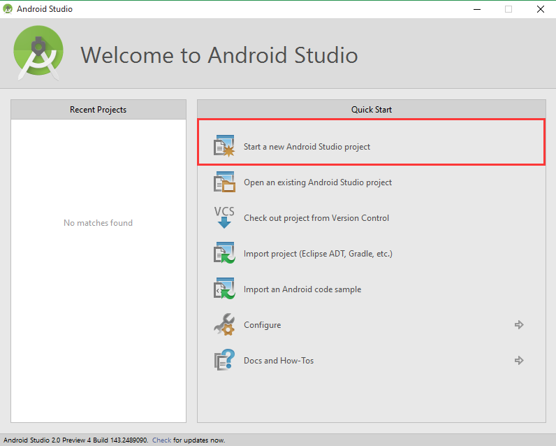
3. Type your **Application name** and **Company Domain** and specify the **Project location**, then click **Next**.  Use the same values in the screenshot below.<br/>
	
4. Select **Minimum SDK API 23** and leave the other settings as default, then click **Next**.<br/>
	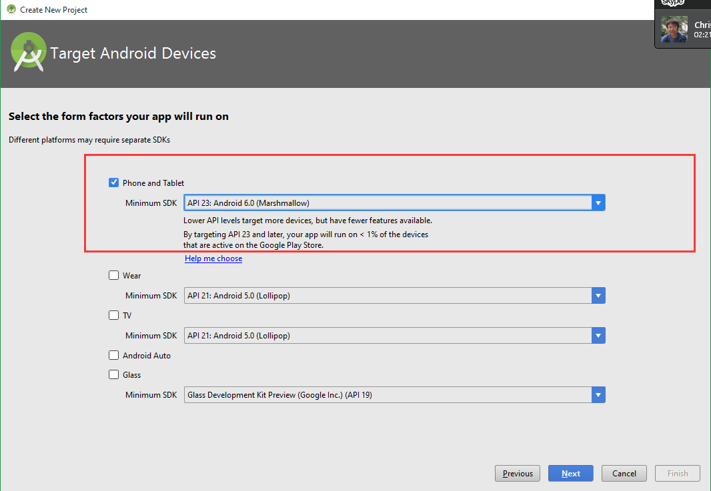
5. Select **Basic Activity**, then click **Next**.<br/>
	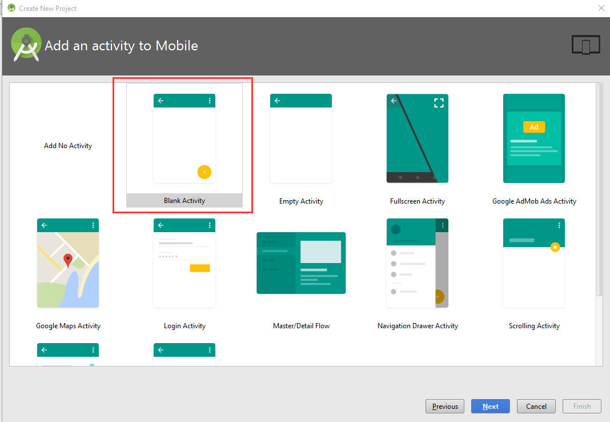
6. Make sure all settings the same as the screenshot below, then click **Finish**.<br/>
	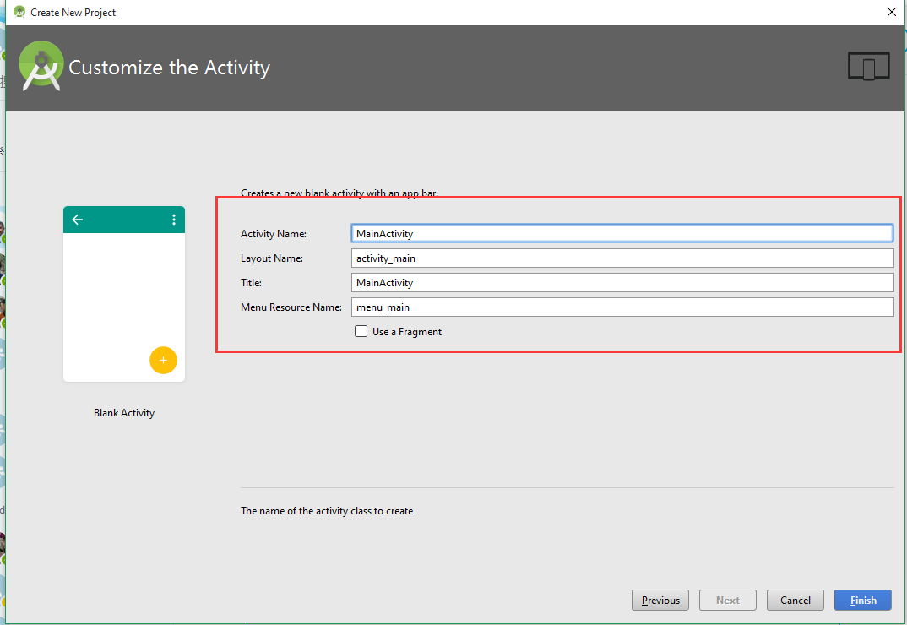
7. The **Android Studio** window is displayed.<br/>
	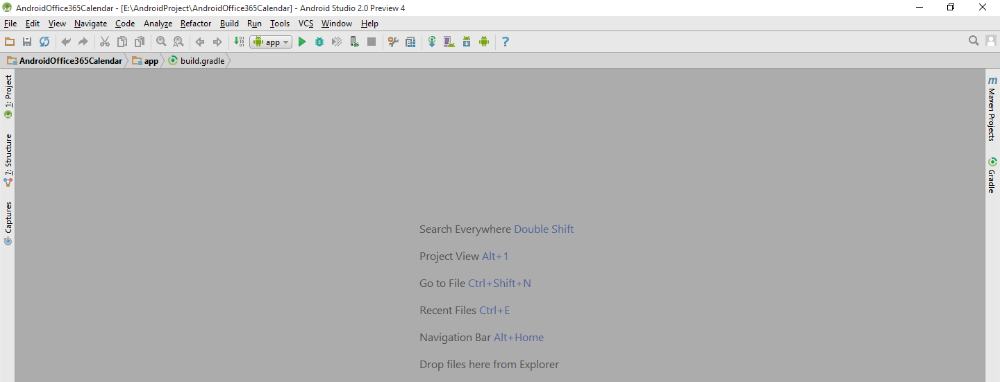
8. Open the **Project** tab and click **build.gradle (Module: app)**<br/>
	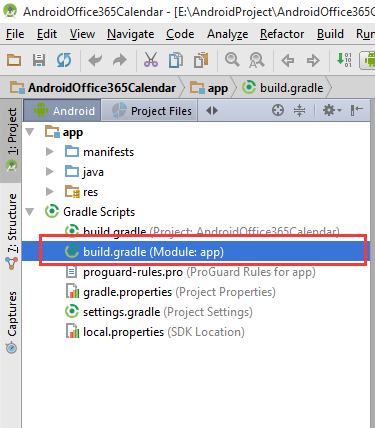
9. Add the code below in **dependencies** section.

	````java
	// base OData library:
	compile group: 'com.microsoft.services', name: 'odata-engine-core', version: '+'
	compile group: 'com.microsoft.services', name: 'odata-engine-android-impl', version: '+', ext:'aar'

	// Azure Active Directory Authentication Library
	compile group: 'com.microsoft.aad', name: 'adal', version: '1.1.3'

	// MSGraph SDK
    compile 'com.microsoft.graph:msgraph-sdk-android:0.9.2'

    // MSGraph SDK Android MSA Auth for Android Adapter
    compile 'com.microsoft.graph:msa-auth-for-android-adapter:0.9.0'

    // Gson library
    compile 'com.google.code.gson:gson:2.3.1'
	````

	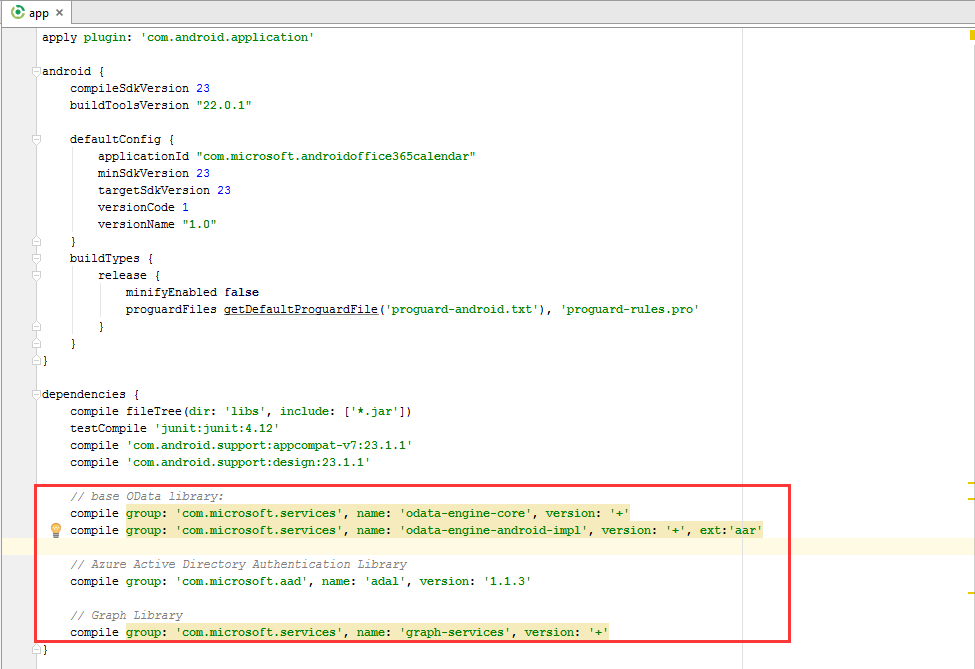
10. Save the file and click **Sync Project with Gradle Files** in the top tool bar.<br/>
	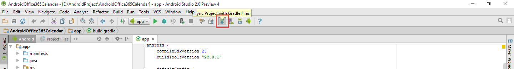

## Integrate Office 365 services ##
1. Sign in to the [Azure Management Portal](https://manage.windowsazure.com/) with your Office 365 credentials.
2. Click **ACTIVE DIRECTORY** on the left menu, go to the **DIRECTORY** tab, and then click your directory.<br/>
	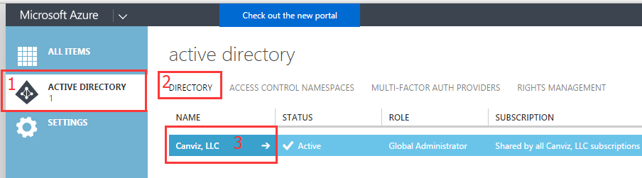
3. Go to the **APPLICATIONS** tab on the new page.
4. Click **ADD** button on the bottom menu.<br/>
	
5. On the **What do you want to do** page, click **Add an application my organization is developing**.<br/>
	
6. On the **Tell us about your application** page, specify your application **NAME** (AndroidOffice365Calendar) and select the option **NATIVE CLIENT APPLICATION** under **Type**, and then click the arrow to go to the next step.<br/>
	
8. On the Application information page, specify a **Redirect URI**. For this example, you can specify **http://AndroidOffice365Calendar** and then click the **Checkmark** icon.
9. Once the application has been successfully added, the Quick Start page for the application is displayed.
10. Click the **CONFIGURE** tab.<br/>
	
11. Click the **Add application** button.<br/>
	
12. Click the service **Microsoft Graph** (or click the plus symbol to add the service) to add the service to the list on the right, then click the **Checkmark** icon to save your selections.<br/>
	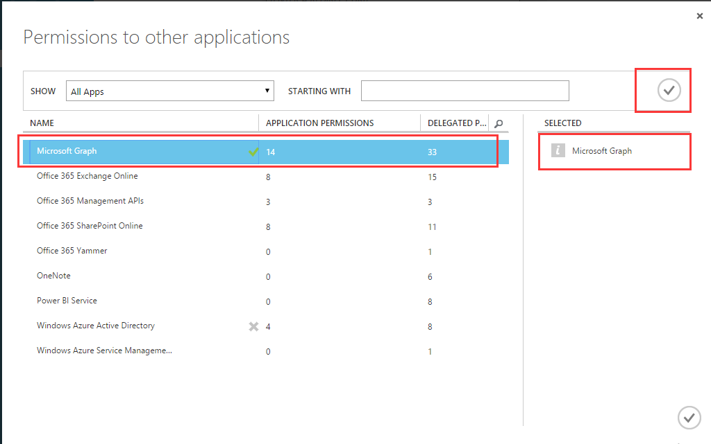
14. Under **permissions to other applications** section, click the **Delegated Permissions** cell in the **Microsoft Graph** row, and check the **Have full access to user calendars** and **Sign in and read user profile** permissions.
15. Click the **SAVE** button on the bottom menu.<br/>
	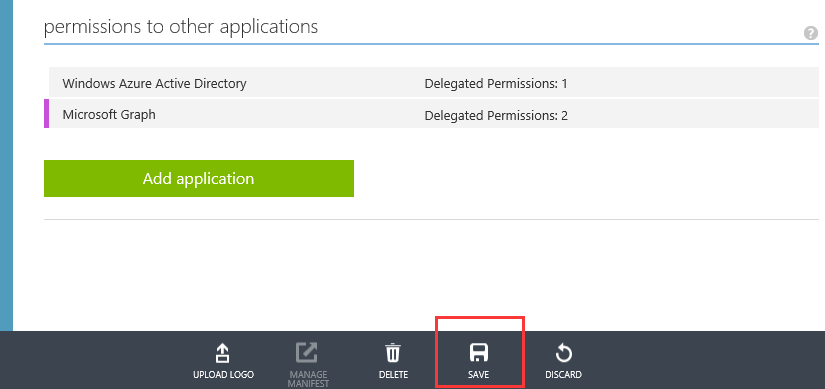

## Code your app ##
1. Go back to the **Android Studio**.
2. Open the file **AndroidManifest.xml** and add the permissions below.

	````xml
	<uses-permission android:name="android.permission.INTERNET" />
	<uses-permission android:name="android.permission.ACCESS_NETWORK_STATE" />
	````
	
	

3. Right click **com.microsoft.androidoffice365calendar** and select New, then click **Java Class**.<br/>
	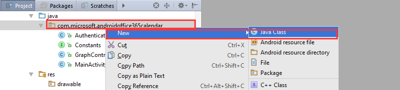
4. In the Name textbox enter **Constants** and select **Interface**, then click the **OK** button.<br/>
	
5. Replace the source code in the **Constants.java** class with the code below and modify the values of **AAD_CLIENT_ID** and **AAD_REDIRECT_URL** to the actual ones you ceated in the previous steps.

    ````java
	package com.microsoft.androidoffice365calendar;

	public interface Constants {
	    public static final String AAD_CLIENT_ID = "Your app client ID";
	    public static final String AAD_REDIRECT_URL = "Your app redirect URL";
	    public static final String AAD_AUTHORITY = "https://login.microsoftonline.com/common";
	    public static final String GRAPH_RESOURCE_ID = "https://graph.microsoft.com/";
	}
	````

	**NOTE: You can find the Client ID and Redirect URL in Microsoft Azure**

	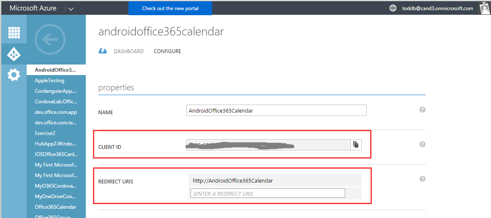
6. Add new class file **AuthenticationController.java**.<br/>
	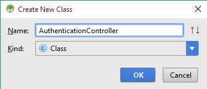
7. Replace the source code in the **AuthenticationController.java** class with the code below.

	````java
	package com.microsoft.androidoffice365calendar;

	import android.app.Activity;
	import android.util.Log;
	
	import com.google.common.util.concurrent.SettableFuture;
	import com.microsoft.aad.adal.AuthenticationCallback;
	import com.microsoft.aad.adal.AuthenticationContext;
	import com.microsoft.aad.adal.AuthenticationResult;
	import com.microsoft.aad.adal.PromptBehavior;
	
	/**
	 * Created by Microsoft on 5/24/2016.
	 */
	public class AuthenticationController {
	    private final String TAG = "Authentication";
	    private AuthenticationContext authContext;
	    private Activity contextActivity;
	    private String resourceId;
	    private String graphToken;
	
	    public static synchronized AuthenticationController getInstance() {
	        if (INSTANCE == null) {
	            INSTANCE = new AuthenticationController();
	        }
	        return INSTANCE;
	    }
	    private static AuthenticationController INSTANCE;
	
	    private AuthenticationController() {
	        resourceId = Constants.GRAPH_RESOURCE_ID;
	    }
	
	    public void setContextActivity(final Activity contextActivity) {
	        this.contextActivity = contextActivity;
	    }
	
	    public SettableFuture<Boolean> initialize() {
	        final SettableFuture<Boolean> result = SettableFuture.create();
	
	        if (verifyAuthenticationContext()) {
	            getAuthenticationContext().acquireToken(
	                    this.contextActivity,
	                    this.resourceId,
	                    Constants.AAD_CLIENT_ID,
	                    Constants.AAD_REDIRECT_URL,
	                    PromptBehavior.Auto,
	                    new AuthenticationCallback<AuthenticationResult>() {
	                        @Override
	                        public void onSuccess(final AuthenticationResult authenticationResult) {
	                            if (authenticationResult != null && authenticationResult.getStatus() == AuthenticationResult.AuthenticationStatus.Succeeded) {
	                                graphToken = authenticationResult.getAccessToken();
	                                result.set(true);
	                            }
	                        }
	
	                        @Override
	                        public void onError(Exception t) {
	                            Log.e(TAG, "Acquire token failed. " + t.getMessage());
	                            result.setException(t);
	                        }
	                    });
	        } else {
	            result.setException(new Throwable("Auth context verification failed."));
	        }
	        return result;
	    }
	
	    public AuthenticationContext getAuthenticationContext() {
	        if (authContext == null) {
	            try {
	                authContext = new AuthenticationContext(this.contextActivity, Constants.AAD_AUTHORITY, false);
	            } catch (Throwable t) {
	                Log.e(TAG, "Get AuthenticationContext failed. " + t.toString());
	            }
	        }
	        return authContext;
	    }
	
	     private boolean verifyAuthenticationContext() {
	        if (this.contextActivity == null) {
	            return false;
	        }
	        return true;
	    }
	
	    public String getGraphToken(){
	        return graphToken;
	    }
	}
	````

8. Create new class file **GraphController.java**.<br/>
	
9. Replace the source code in the **GraphController.java** class with the code below.

	````java
	package com.microsoft.androidoffice365calendar;

	import android.app.Application;
	import android.util.Log;
	
	import com.google.common.util.concurrent.FutureCallback;
	import com.google.common.util.concurrent.Futures;
	import com.google.common.util.concurrent.SettableFuture;
	import com.microsoft.graph.authentication.IAuthenticationAdapter;
	import com.microsoft.graph.authentication.MSAAuthAndroidAdapter;
	import com.microsoft.graph.concurrency.ICallback;
	import com.microsoft.graph.core.ClientException;
	import com.microsoft.graph.core.DefaultClientConfig;
	import com.microsoft.graph.core.IClientConfig;
	import com.microsoft.graph.extensions.Event;
	import com.microsoft.graph.extensions.GraphServiceClient;
	import com.microsoft.graph.extensions.IEventCollectionPage;
	import com.microsoft.graph.extensions.IGraphServiceClient;
	import com.microsoft.graph.http.IHttpRequest;
	import com.microsoft.graph.options.HeaderOption;
	import com.microsoft.graph.options.Option;
	import com.microsoft.graph.options.QueryOption;
	
	import java.text.SimpleDateFormat;
	import java.util.ArrayList;
	import java.util.Arrays;
	import java.util.Calendar;
	import java.util.List;
	
	/**
	 * Created by Microsoft on 5/24/2016.
	 */
	public class GraphController {
	    private final static String TAG = "GraphController";
	
	    public static synchronized GraphController getInstance() {
	        if (INSTANCE == null) {
	            INSTANCE = new GraphController();
	        }
	        return INSTANCE;
	    }
	    private static GraphController INSTANCE;
	
	    public SettableFuture<List<String>> initialize(Application app) {
	        SimpleDateFormat formatter = new SimpleDateFormat("yyyy-MM-dd");
	        Calendar calendar = Calendar.getInstance();
	        int day = calendar.get(Calendar.DAY_OF_MONTH) - 30;
	        calendar.set(Calendar.DAY_OF_MONTH,day);
	        String filterDate = formatter.format(calendar.getTime());
	        final SettableFuture<List<String>> result = SettableFuture.create();
	        final List<String> events = new ArrayList<String>();
	
	        final String graphToken = AuthenticationController.getInstance().getGraphToken();
	        final IAuthenticationAdapter authenticationAdapter = new MSAAuthAndroidAdapter(app) {
	            @Override
	            public String getClientId() {
	                return Constants.AAD_CLIENT_ID;
	            }
	
	            @Override
	            public String[] getScopes() {
	                return new String[] {
	                        "https://graph.microsoft.com/Calendars.ReadWrite",
	                        "https://graph.microsoft.com/User.ReadBasic.All",
	                        "https://graph.microsoft.com/User.ReadWrite",
	                        "offline_access",
	                        "openid"
	                };
	            }
	            @Override
	            public void authenticateRequest(final IHttpRequest request) {
	                for (final HeaderOption option : request.getHeaders()) {
	                    if (option.getName().equals(AUTHORIZATION_HEADER_NAME)) {
	                        return;
	                    }
	                }
	                if (graphToken != null && graphToken.length() > 0){
	                    request.addHeader(AUTHORIZATION_HEADER_NAME, OAUTH_BEARER_PREFIX + graphToken);
	                    return;
	                }
	                super.authenticateRequest(request);
	            }
	        };
	        final IClientConfig mClientConfig = DefaultClientConfig.createWithAuthenticationProvider(authenticationAdapter);
	        final IGraphServiceClient graphServiceClient = new GraphServiceClient
	                .Builder()
	                .fromConfig(mClientConfig)
	                .buildClient();
	
	        try {
	            graphServiceClient
	                    .getMe()
	                    .getEvents()
	                    .buildRequest(Arrays.asList(new Option[] {
	                            new QueryOption("$filter", "Start/DateTime ge '" + filterDate + "'"),
	                            new QueryOption("$select", "subject,start,end"),
	                            new QueryOption("$orderyBy", "Start/DateTime desc"),
	                            new QueryOption("$top", "10000")
	                    }))
	            .get(new ICallback<IEventCollectionPage>(){
	                @Override
	                public void success(IEventCollectionPage page) {
	                    List<Event> list = page.getCurrentPage();
	                    for (Event item : list) {
	                        events.add(item.subject);
	                    }
	                    result.set(events);
	                }
	
	                @Override
	                public void failure(ClientException ex) {
	                    Log.e(TAG, "Get events failed. " + ex.getMessage());
	                    result.setException(ex);
	                }
	            });
	        } catch (Exception e) {
	            Log.e(TAG, "Initialize failed. " + e.getMessage());
	            result.setException(e);
	        }
	        return result;
	    }
	}
	````

12. Open the file **content_main.xml**.<br/>

	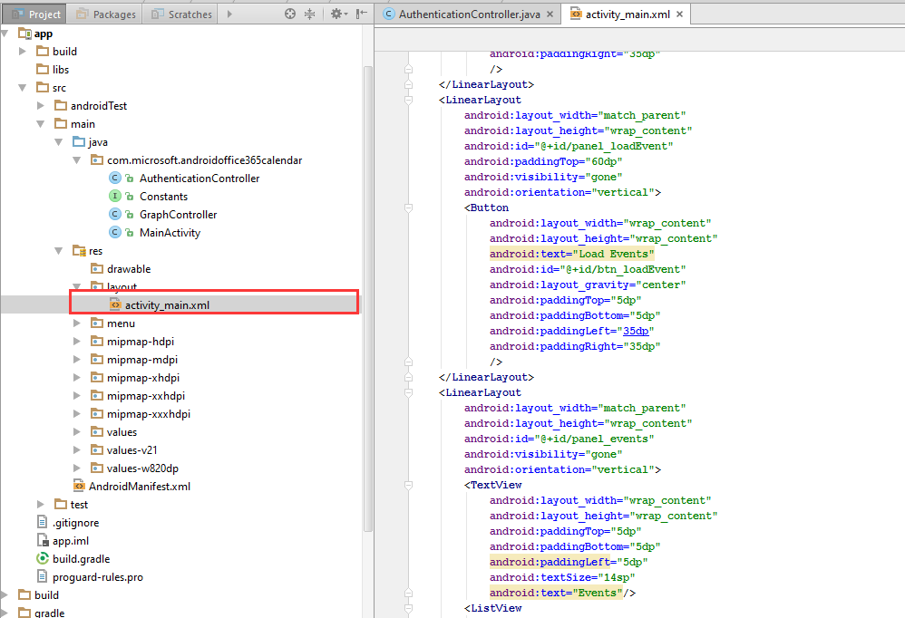
11. Replace the contents of the **content_main.xml** file with the code below.

	````xml
	<?xml version="1.0" encoding="utf-8"?>
	<LinearLayout xmlns:android="http://schemas.android.com/apk/res/android"
	    android:orientation="vertical"
	    android:layout_width="match_parent"
	    android:layout_height="match_parent">

    	<LinearLayout
    	    android:layout_width="match_parent"
    	    android:layout_height="wrap_content"
    	    android:id="@+id/panel_signIn"
    	    android:paddingTop="60dp"
    	    android:visibility="visible"
    	    android:orientation="vertical">
    	    <Button
    	        android:layout_width="wrap_content"
    	        android:layout_height="wrap_content"
    	        android:text="Sign In"
    	        android:id="@+id/btn_signIn"
    	        android:layout_gravity="center"
    	        android:paddingTop="5dp"
    	        android:paddingBottom="5dp"
    	        android:paddingLeft="35dp"
    	        android:paddingRight="35dp"
    	        />
	    </LinearLayout>
    	<LinearLayout
    	    android:layout_width="match_parent"
    	    android:layout_height="wrap_content"
    	    android:id="@+id/panel_loadEvent"
    	    android:paddingTop="60dp"
    	    android:visibility="gone"
    	    android:orientation="vertical">
    	    <Button
    	        android:layout_width="wrap_content"
    	        android:layout_height="wrap_content"
    	        android:text="Load Events"
    	        android:id="@+id/btn_loadEvent"
    	        android:layout_gravity="center"
    	        android:paddingTop="5dp"
    	        android:paddingBottom="5dp"
    	        android:paddingLeft="35dp"
    	        android:paddingRight="35dp"
    	        />
    	</LinearLayout>
    	<LinearLayout
    	    android:layout_width="match_parent"
    	    android:layout_height="wrap_content"
    	    android:id="@+id/panel_events"
    	    android:visibility="gone"
    	    android:orientation="vertical">
    	    <TextView
    	        android:layout_width="wrap_content"
    	        android:layout_height="wrap_content"
    	        android:paddingTop="5dp"
    	        android:paddingBottom="5dp"
    	        android:paddingLeft="5dp"
    	        android:textSize="14sp"
    	        android:text="Events"/>
    	    <ListView
    	        android:layout_width="wrap_content"
    	        android:layout_height="wrap_content"
    	        android:id="@+id/list_events"
    	        android:padding="0dp"
    	        android:paddingLeft="0dp"
    	        android:paddingTop="0dp"
    	        android:paddingRight="0dp"
    	        android:paddingBottom="0dp" />
    	</LinearLayout>

	</LinearLayout>
	````

12. Open the file **MainActivity.java**.<br/>
	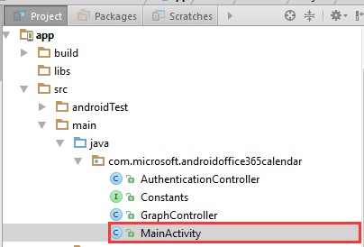
13. Replace the contents of the **MainActivity.java** file with the code below.

	````java
	package com.microsoft.androidoffice365calendar;
	
	import android.app.Activity;
	import android.app.ProgressDialog;
	import android.os.Bundle;
	import android.view.View;
	import android.widget.ArrayAdapter;
	import android.widget.Button;
	import android.util.Log;
	import android.content.Intent;
	
	import com.google.common.util.concurrent.FutureCallback;
	import com.google.common.util.concurrent.Futures;
	import com.google.common.util.concurrent.SettableFuture;
	
	import android.widget.ListView;
	import android.widget.LinearLayout;
	import android.widget.Toast;
	
	import java.util.List;
	
	public class MainActivity extends Activity {
	    private final static String TAG = "MainActivity";
	    private ProgressDialog process;
	    private ListView listEvents;
	    private LinearLayout panelSignIn;
	    private LinearLayout panelEvents;
	    private LinearLayout panelLoadEvent;
	
	    @Override
	    protected void onCreate(Bundle savedInstanceState) {
	        super.onCreate(savedInstanceState);
	        setContentView(R.layout.activity_main);
	
	        listEvents = (ListView)findViewById(R.id.list_events);
	        panelSignIn = (LinearLayout)findViewById(R.id.panel_signIn);
	        panelEvents = (LinearLayout)findViewById(R.id.panel_events);
	        panelLoadEvent = (LinearLayout)findViewById(R.id.panel_loadEvent);
	
	        ((Button)findViewById(R.id.btn_signIn)).setOnClickListener(new View.OnClickListener() {
	            @Override
	            public void onClick(View view) {
	                signIn();
	            }
	        });
	
	        ((Button)findViewById(R.id.btn_loadEvent)).setOnClickListener(new View.OnClickListener() {
	            @Override
	            public void onClick(View view) {
	                loadEvents();
	            }
	        });
	
	        setPanelVisibility(true,false,false);
	    }
	
	    private void signIn() {
	        AuthenticationController.getInstance().setContextActivity(this);
	        SettableFuture<Boolean> authenticated = AuthenticationController.getInstance().initialize();
	
	        Futures.addCallback(authenticated, new FutureCallback<Boolean>() {
	            @Override
	            public void onSuccess(Boolean result) {
	                runOnUiThread(new Runnable() {
	                    @Override
	                    public void run() {
	                        Toast.makeText(MainActivity.this,"Sign in successfully.",Toast.LENGTH_SHORT).show();
	                        setPanelVisibility(false,true,false);
	                    }
	                });
	            }
	            @Override
	            public void onFailure(final Throwable t) {
	                runOnUiThread(new Runnable() {
	                    @Override
	                    public void run() {
	                        Toast.makeText(MainActivity.this,"Sign in failed.",Toast.LENGTH_LONG).show();
	                        Log.e(TAG, "Sign in failed. " + t.getMessage());
	                    }
	                });
	            }
	        });
	    }
	
	    private void loadEvents(){
	        process = ProgressDialog.show(this,"Loading","Loading events in the past 30 days...");
	        SettableFuture<List<String>> graphController = GraphController.getInstance().initialize(getApplication());
	        Futures.addCallback(graphController, new FutureCallback<List<String>>() {
	            @Override
	            public void onSuccess(final List<String> result) {
	                runOnUiThread(new Runnable() {
	                    @Override
	                    public void run() {
	                        Toast.makeText(MainActivity.this,"Load event successfully.",Toast.LENGTH_LONG).show();
	                        process.dismiss();
	                        bindEvents(result);
	                    }
	                });
	            }
	
	            @Override
	            public void onFailure(final Throwable t) {
	                runOnUiThread(new Runnable() {
	                    @Override
	                    public void run() {
	                        Log.e(TAG, "Load event failed. " + t.getMessage());
	                        process.dismiss();
	                        Toast.makeText(MainActivity.this,"Load event failed.",Toast.LENGTH_LONG).show();
	                    }
	                });
	            }
	        });
	    }
	
	    private void bindEvents(List<String> events){
	        setPanelVisibility(false,false,true);
	        ArrayAdapter<String> adapter = new ArrayAdapter<String>(this,android.R.layout.simple_expandable_list_item_1,events);
	        listEvents.setAdapter(adapter);
	    }
	
	    private void setPanelVisibility(Boolean showSignIn, Boolean showLoadEvents, Boolean showList){
	        panelSignIn.setVisibility(showSignIn ? View.VISIBLE : View.GONE);
	        panelLoadEvent.setVisibility(showLoadEvents ? View.VISIBLE : View.GONE);
	        panelEvents.setVisibility(showList ? View.VISIBLE : View.GONE);
	    }
	
	    @Override
	    protected void onActivityResult(int requestCode, int resultCode, Intent data) {
	        Log.i(TAG, "AuthenticationActivity has come back with results");
	        super.onActivityResult(requestCode, resultCode, data);
	        AuthenticationController
	                .getInstance()
	                .getAuthenticationContext()
	                .onActivityResult(requestCode, resultCode, data);
	    }
	
	}
	````

14. Click the **green arrow** button to run your app.<br/>

	
15. Select **API 23** emulator and click **OK**.

	**NOTE: If there is no such emulator please create a new one with API level 23.**

	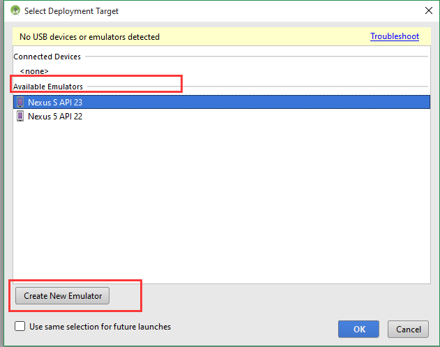
16. The emulator will appear.<br/>

	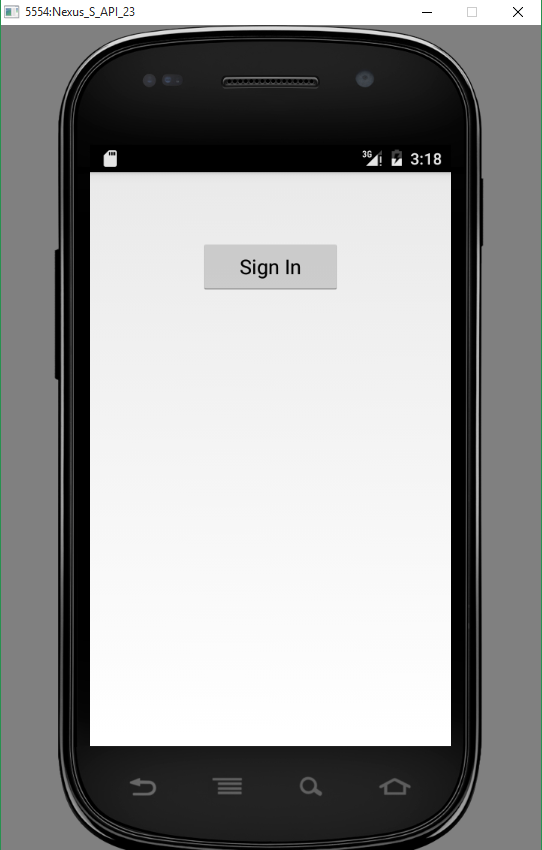
17. Click **Sign In**.
18. Fill in your user name and password, then click **Sign in**.<br/>

	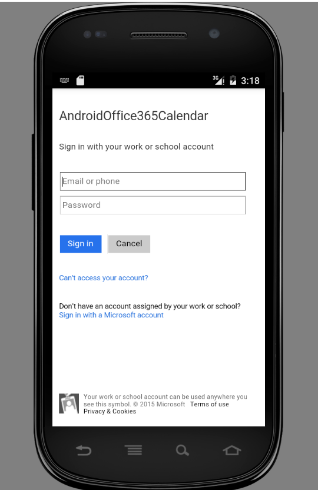
19. Click the **Load Events** button.<br/>

	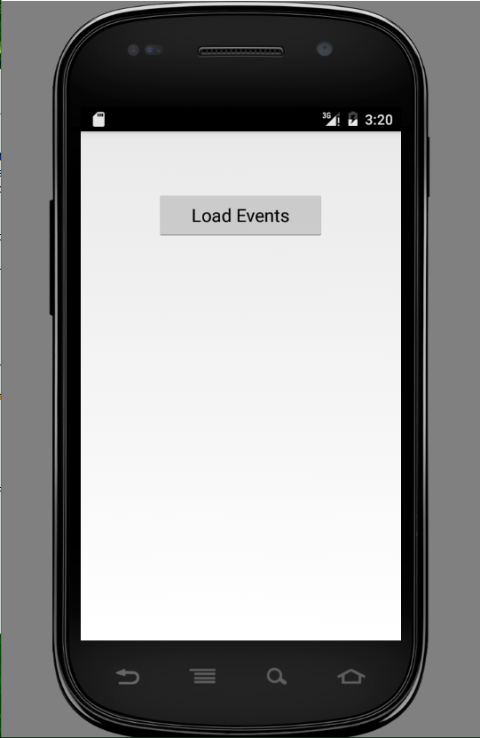
20. The events are displayed.
	

