Calling the O365 Microsoft Graph with iOS
======================================
## Overview

The lab demonstrates how use an AzureAD account authenticate and the Microsoft Graph to access Calendar Events from an iOS app.

## Objectives

- Learn how to authenticate with Azure AD
- Learn how to create an Microsoft Graph client to access calendar events
- Learn how to list calendar events

## Prerequisites

1. OSX 10.X environment
1. [XCode 7][xcode-7]
1. [Cocoapods dependency manager][cocoapods]
1. This lab requires you to use multiple starter files or an entire starter project from the GitHub location. You can either download the whole repo as a zip or clone the repo https://github.com/OfficeDev/TrainingContent.git for those familiar with git.

[xcode-7]: https://itunes.apple.com/nz/app/xcode/id497799835?mt=12
[cocoapods]: https://cocoapods.org/

## Register your application with Azure Active Directory
1. Sign into the [https://manage.windowsazure.com/](https://manage.windowsazure.com/ "[Azure Management Portal]") using your Office 365 Developer Site credentials.
2. Click **Active Directory** on the left menu, then click on the directory for your Office 365 developer site.
3. On the top menu, click **Applications**.
4. Click **Add** from the bottom menu.
5. On the **What do you want to do** page, click **Add an application my organization is developing**.
6. On the **Tell us about your application** page, enter **IOSOffice365Calendar** for the application name and select **NATIVE CLIENT APPLICATION** for the Type.
    
7. Click the **arrow icon** on the bottom-right corner of the page.
8. On the Application information page, specify a Redirect URI, for this example specify http://IOSOffice365Calendar. Make note of the URI, since you'll need this later when coding the IOSOffice365Calendar project. 
9. Click the **check mark icon** on the bottom-right corner of the page.
    
9. Once the application has been successfully added, you will be taken to the Quick Start page for the application. From here, click **Configure** on the top menu.
    
10. On **permissions to other applications**, click **Add application**.
    
11. Click **Microsoft Graph**, and then click the check mark icon. 
    
12. Under **permissions to other applications**, click the **Delegated Permissions** column for **Microsoft Graph**
- Select **Read User Calendars**.
- Select **Sign in and read user profile**
13. Click **Save**
14. Copy the value specified for **Client ID**; you will need this later when coding the IOSOffice365Calendar project.


## Exercise 1: Add O365 iOS Microsoft SDK library to a project
In this exercise you will use an existing application with the AzureAD 
authentication included, to add the O365 Microsfot Graph SDK library in the project.

01. Locate the [\\\O3651\O3651-6 Mobile\IOS\Lab Files](Lab Files) folder that contains a starter project. 
02. In Finder, navigate to the Lab Files folder and open the **Podfile** file under the root folder of the project and add the following lines to the end of the file:

    ```ruby
    pod 'ADALiOS', '=1.2.4'
    pod 'orc'
    pod 'MSGraph-SDK-iOS'
    ```
    
    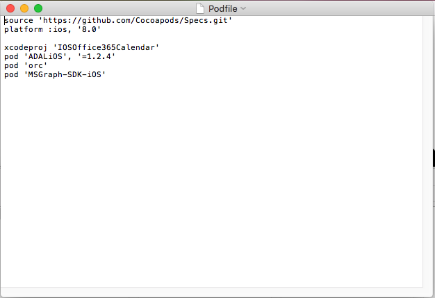
03. **Save** the Podfile. 
04. Open a Terminal and navigate to the `Lab Files/IOSOffice365Calendar` folder of the project.

    Execute the following command and wait for the CocoaPods to install:

    ```bash
    pod install
    ```

05. Open the **.xcworkspace** file in the **IOSOffice365Calendar** folder

06. Find and open the **Auth.plist** file.

07. Fill the AzureAD account settings with the following configuration values:
    -   **resourceId**        - "https://graph.microsoft.com/"
    -   **graphResourceUrl**        - "https://graph.microsoft.com/v1.0"    
    -   **authority**         - "https://login.microsoftonline.com/common"
    -   **redirectUriString** - The redirect URL configured in Azure AD, e.g. "http://IOSOffice365Calendar"
    -   **clientId**          - The client Id obtained from Azure AD, e.g. "1c9e1f23-9080-4551-993d-0d2810a6a9c6"
    
    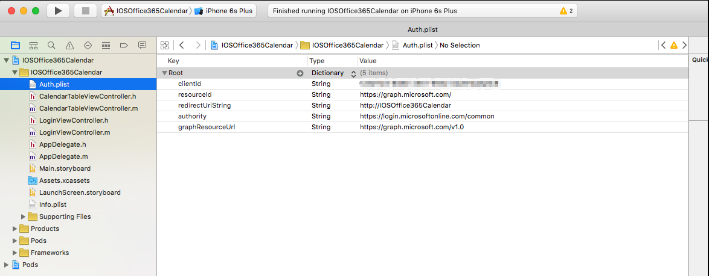

08. Build and Run the project in an iOS Simulator to check the views. You will see a login page with buttons to access the application and to clear credentials.  At this point the app does not include the code required to authenticateor return calendar events.  Close the app.
    
    

## Exercise 2: Authenticate with Azure AD and get the access token
An access token is required to access Office 365 APIs so your application needs to implement the logic to retrieve and manage access tokens. The [Azure Active Directory authentication library (ADAL) for iOS and OSX](https://github.com/AzureAD/azure-activedirectory-library-for-objc) provides you with the ability to manage authentication in your application with just a few lines of code. Learn more about authentication with Azure Active Directory in [What is Azure Active Directory? on Azure.com](https://azure.microsoft.com/en-us/documentation/articles/active-directory-whatis/). The first thing you'll do is create a header file and class named AuthenticationManager that uses the ADAL for iOS and OSX to manage authentication for your app.

### To create the AuthenticationManager class
01. Right-click the IOSOffice365Calendar project folder, select **New File**, and in the **iOS** section, click **Cocoa Touch Class**, and then click **Next**.
02. Specify **AuthenticationManager** as the **Class**, **NSObject** for **Subclass of:**, and then click **Next**.
03. Click **Create** to create the class and header files.


### To code the AuthenticationManager header file
01. Import the necessary Office 365 Graph iOS SDK and ADAL SDK header files by adding the following code directives to **AuthenticationManager.h**

	```objc
	#import <ADALiOS/ADAL.h>
	#import <orc/impl/impl.h>
	#import <MSGraph-SDK-iOS/MSGraphService.h>
	```
    
02. Declare a property for the **ADALDependencyResolver** object from the **ADAL SDK** which uses dependency injection to provide access to the authentication objects.

	```objc
	@property (readonly, nonatomic) ADALDependencyResolver *dependencyResolver;
	```
    
03. Specify the **AuthenticationManager** class as a singleton.

	```objc
	+(AuthenticationManager *)sharedInstance;
	```
04. Declare the methods for retrieving and clearing the access and refresh tokens.

    ```objc
	//retrieve token
	-(void)acquireAuthTokenWithResourceId:(NSString *)resourceId completionHandler:(void (^)(BOOL authenticated))completionBlock;
	//clear token
	-(void)clearCredentials;
    ```
    
    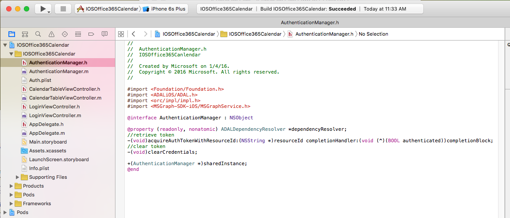
    
### To code the AuthenticationManager class
01. In the **interface** declaration, above **@implementation**, declare the following properties
	```objc 
	@interface AuthenticationManager ()
	@property (strong,    nonatomic) ADAuthenticationContext *authContext;
	@property (readwrite, nonatomic) ADALDependencyResolver  *dependencyResolver;
	@property (readonly, nonatomic) NSURL    *redirectURL;
	@property (readonly, nonatomic) NSString *authority;
	@property (readonly, nonatomic) NSString *clientId;
	@end
	```

2. Add code for the constructor to the implementation.

    ```objc
	-(instancetype)init
	{
	    self = [super init];	    
	    if (self) {
	        //Azure AD account info
	        NSString* plistPath = [[NSBundle mainBundle] pathForResource:@"Auth" ofType:@"plist"];
	        NSDictionary *content = [NSDictionary dictionaryWithContentsOfFile:plistPath];
	        _authority = [content objectForKey:@"authority"];
	        _clientId = [content objectForKey:@"clientId"];
	        _redirectURL = [NSURL URLWithString:[content objectForKey:@"redirectUriString"]];
	    }
	    return self;
	}
	```

3. Add the following code to use a single authentication manager for the application.
	
	```objc
	+(AuthenticationManager *)sharedInstance
	{
	    static AuthenticationManager *sharedInstance;
	    static dispatch_once_t onceToken;
	    // Initialize the AuthenticationManager only once.
	    dispatch_once(&onceToken, ^{
	        sharedInstance = [[AuthenticationManager alloc] init];
	    });
	    return sharedInstance;
	}
	```
	
	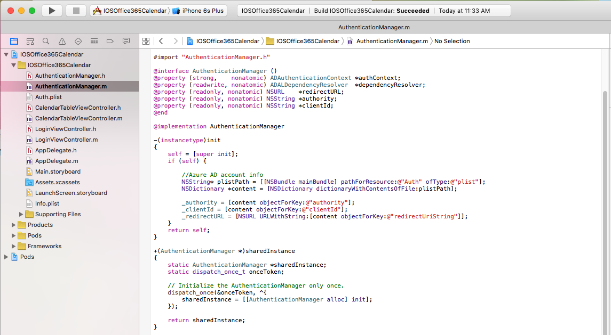
	
4. Acquire access and refresh tokens from Azure AD for the user.
	
	```objc
	-(void)acquireAuthTokenWithResourceId:(NSString *)resourceId completionHandler:(void (^)(BOOL authenticated))completionBlock
	{
	    ADAuthenticationError *error;
	    self.authContext = [ADAuthenticationContext authenticationContextWithAuthority:self.authority error:&error];
	    [self.authContext acquireTokenWithResource:resourceId
	                                      clientId:self.clientId
	                                   redirectUri:self.redirectURL
	                               completionBlock:^(ADAuthenticationResult *result) {
	                                   if (AD_SUCCEEDED != result.status) {
	                                       completionBlock(NO);
	                                   }
	                                   else {
	                                       self.dependencyResolver = [[ADALDependencyResolver alloc] initWithContext:self.authContext
	                                                                                                      resourceId:resourceId
	                                                                                                        clientId:self.clientId
	                                                                                                     redirectUri:self.redirectURL];
	                                       completionBlock(YES);
	                                   }
	                               }];
	}
	```
    >**Note:** The first time the application runs, a request is sent to the URL specified for the AUTHORITY const, which the redirects you to a login page where you can enter your credentials. If your login is successful, the response contains the access and refresh tokens. Subsequent times when the application runs, the authentication manager will use the access or refresh token for authenticating client requests, unless the token cache is cleared.

5. Finally, add code to log out the user by clearing the token cache and removing the application's cookies.

	```objc
	-(void)clearCredentials{
	    id<ADTokenCacheStoring> cache = [ADAuthenticationSettings sharedInstance].defaultTokenCacheStore;
	    ADAuthenticationError *error;
	    if ([[cache allItemsWithError:&error] count] > 0)
	        [cache removeAllWithError:&error];
	    NSHTTPCookieStorage *cookieStore = [NSHTTPCookieStorage sharedHTTPCookieStorage];
	    for (NSHTTPCookie *cookie in cookieStore.cookies) {
	        [cookieStore deleteCookie:cookie];
	    }
	}
	```
	
	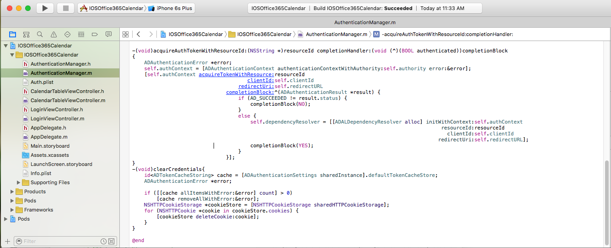
	

### To code the Login Action
1. Open the LoginViewController.h file, and import the **AuthenticationManager.h**
   ```objc
   #import "AuthenticationManager.h"
   ```
2. Open the LoginViewController.m file, add the following code to **loginAction**

   ```objc
    NSString* plistPath = [[NSBundle mainBundle] pathForResource:@"Auth" ofType:@"plist"];
    NSDictionary *content = [NSDictionary dictionaryWithContentsOfFile:plistPath];
    NSString* graphResourceId= [content objectForKey:@"resourceId"];
    NSString* graphResourceURL= [content objectForKey:@"graphResourceUrl"];
    AuthenticationManager *authenticationManager = [AuthenticationManager sharedInstance];
    [authenticationManager acquireAuthTokenWithResourceId:graphResourceId
                                        completionHandler:^(BOOL authenticated) {
                                            if(authenticated){
                                                dispatch_async(dispatch_get_main_queue(), ^{
                                                    [self showMessage:@"Authentication Succeeded." withTitle:@"Success"];
                                                });
                                            }
                                            else{
                                                dispatch_async(dispatch_get_main_queue(), ^{
                                                    NSLog(@"Error in the authentication");
                                                    [self showMessage:@"Authentication failed. Check the log for errors." withTitle:@"Error"];
                                                });
                                            }
                                        }];
   ```
3. Open the LoginViewController.m file, add the following code to **clearAction**

   ```objc
       AuthenticationManager *authenticationManager = [AuthenticationManager sharedInstance];
    [authenticationManager clearCredentials];
    [self showMessage:@"Cookies Cleared" withTitle:@"Success"];
   ```
   
   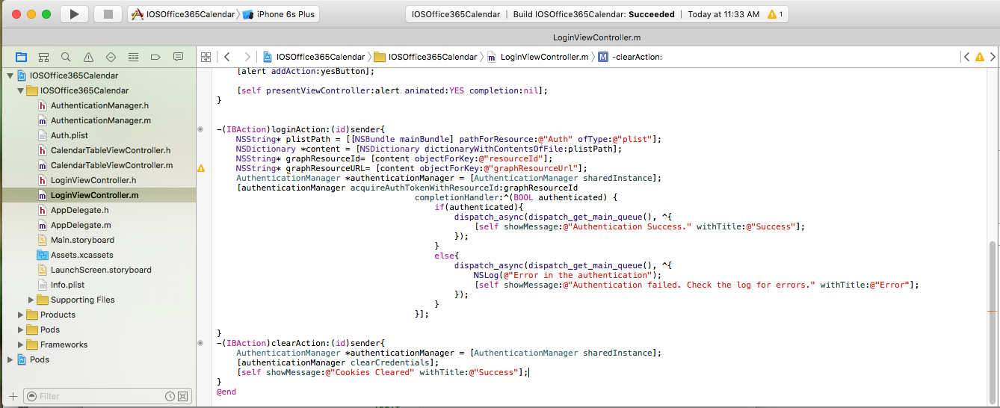
   
   
4. Build and run, now you can click **Login** to Authenticate with Azure AD
   
   
   
5. Login Successfully.

   
   
6. You can click **Clear** to sign out.
   
   
  

## Exercise 3: Connect to the Microsoft Graph to get Calendar events

In this exercise you will connect your application to get a **MSGraphServiceClient**. We can get the calendar events form this client.

01. Go to **LoginViewController.m** and find the **loginAction** method, replace **[self showMessage:@"Authentication Succeeded." withTitle:@"Success"];** with the following code:

    ```objc                                           
	MSGraphServiceClient *graphClient = [[MSGraphServiceClient alloc] initWithUrl:graphResourceURL
		                                                    dependencyResolver:authenticationManager.dependencyResolver];
		                                                    dispatch_async(dispatch_get_main_queue(), ^{
		                                                        CalendarTableViewController *controller = [[UIStoryboard storyboardWithName:@"Main" bundle:nil] instantiateViewControllerWithIdentifier:@"calendarList"];
		                                                        [controller initGraphClient:graphClient];
		                                                        [self.navigationController pushViewController:controller animated:YES];
		                                                    });
		                                                });
		                                            }
		                                            else{
		                                                dispatch_async(dispatch_get_main_queue(), ^{
		                                                    NSLog(@"Error in the authentication");
		                                                    [self showMessage:@"Authentication failed. Check the log for errors." withTitle:@"Error"];
		                                                });
    ```
    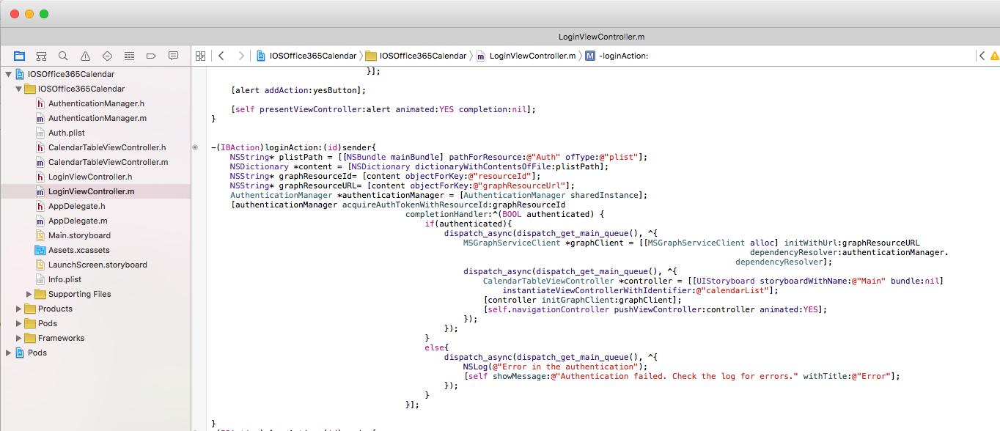

02. Go to **CalendarTableViewController.h**, and import the following header files
    ```objc 
	#import <ADALiOS/ADAL.h>
	#import <orc/impl/impl.h>
	#import <MSGraph-SDK-iOS/MSGraphService.h>
   ```
03. Declare a property to access the Microsoft Graph client.

	```objc
	@property (strong, nonatomic) MSGraphServiceClient *graphCilent;
	```
    
03. Specify the following fuction to store the Microsoft Graph client.

	```objc
	-(void)initGraphClient:(MSGraphServiceClient *)client;
	```
	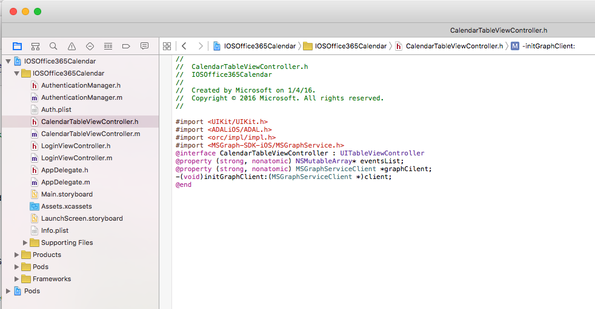
	
04. Go to **CalendarTableViewController.m**, and add the following code to store the **MSGraphServiceClient**
   ```objc
	-(void)initGraphClient:(MSGraphServiceClient *)client{
	    self.graphCilent = client;
	}
   ```
05. Add the following code into the bottom of the fuction **getEvents** to get the Login user's calendar events via the MSGraphServiceClient
    ```objc
    UIActivityIndicatorView* spinner = [[UIActivityIndicatorView alloc]initWithFrame:CGRectMake(100,100,50,50)];
    spinner.activityIndicatorViewStyle = UIActivityIndicatorViewStyleWhiteLarge;
    [spinner setColor:[UIColor blackColor]];
    [self.view addSubview:spinner];
    spinner.hidesWhenStopped = YES;
    [spinner startAnimating];
    NSCalendar *calendar = [NSCalendar autoupdatingCurrentCalendar];
    NSDateComponents *components = [calendar components:NSCalendarUnitYear
                                    | NSCalendarUnitMonth | NSCalendarUnitDay
                                               fromDate:[NSDate date]];
    components.day = components.day -30;
    NSDateFormatter *formatter = [[NSDateFormatter alloc] init];
    [formatter setDateFormat:@"yyyy'-'MM'-'dd"];
    NSString *lastMonth =[formatter stringFromDate: [calendar dateFromComponents:components]];
    NSString *filter =[NSString stringWithFormat:@"Start/DateTime ge '%@'&$top=100",lastMonth];
    MSGraphServiceEventCollectionFetcher * eventsCollectionFetcher = [[[[self.graphCilent me] events]  filter:filter] select:@"subject,start,end"];
    [eventsCollectionFetcher readWithCallback:^(NSArray *events, MSOrcError *error) {
        for(MSGraphServiceEvent* event in events ) {
            [self.eventsList addObject:event];
        }
        dispatch_async(dispatch_get_main_queue(), ^{
            [spinner stopAnimating];
            [spinner removeFromSuperview];
            [self.tableView reloadData];
        });
    }];
   ```
   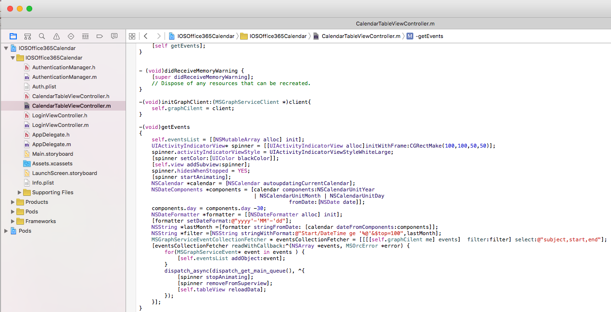
   
06. Go to the following function

   ```objc
	- (UITableViewCell *)tableView:(UITableView *)tableView cellForRowAtIndexPath:(NSIndexPath *)indexPath 
   ```
   
07. Add the following code into the bottom of the function **cellForRowAtIndexPath**

   ```objc
    UILabel *subjectLabel = (UILabel *)[cell viewWithTag:100];
    subjectLabel.text = ((MSGraphServiceEvent *)[self.eventsList objectAtIndex:indexPath.row]).subject;;
    UILabel *startLabel = (UILabel *)[cell viewWithTag:200];
    startLabel.text = [NSString stringWithFormat:@"Start: %@",[self converStringToDateString:((MSGraphServiceEvent *)[self.eventsList objectAtIndex:indexPath.row]).start.dateTime]];
    UILabel *endLabel = (UILabel *)[cell viewWithTag:300];
    endLabel.text = [NSString stringWithFormat:@"End: %@",[self converStringToDateString:((MSGraphServiceEvent *)[self.eventsList objectAtIndex:indexPath.row]).end.dateTime]];
    ```
    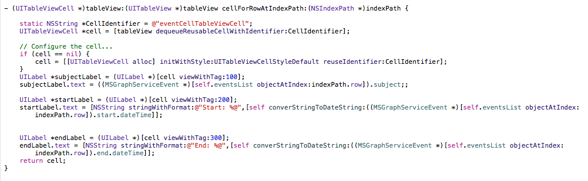
08. Build and Run the application. Click the Login button. Now you can see the  events list after you login successfully.

    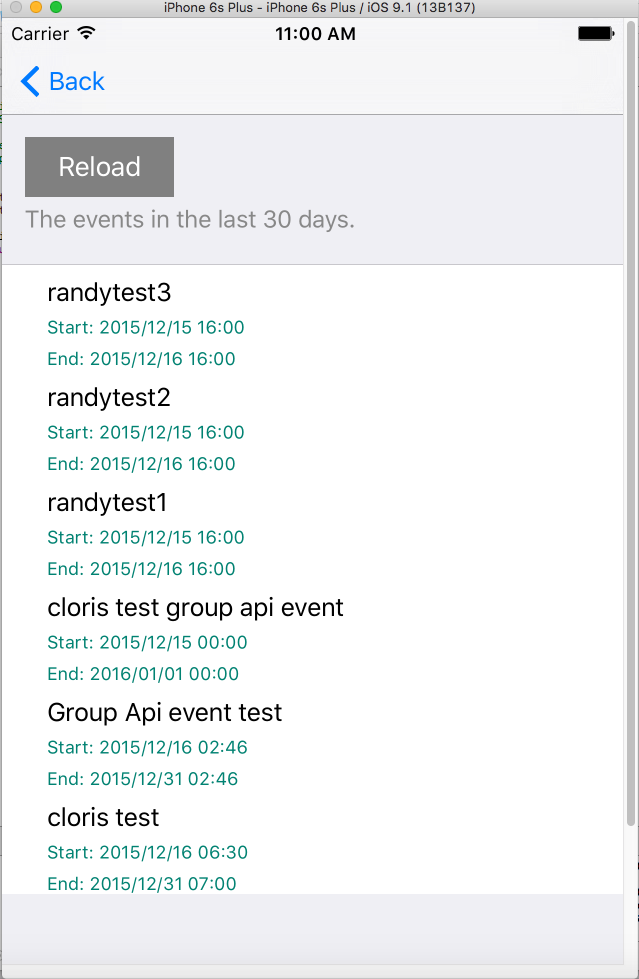

## Summary

In this exercise, you used the Microsoft Graph within an iOS application.

Congratulations! In this lab you have created your first Azure AD application that enabled access to the Microsoft Graph within an iOS application!
