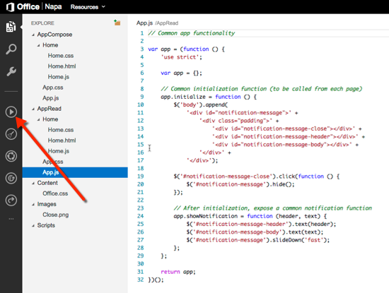
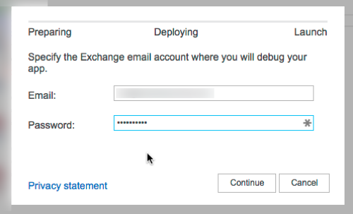
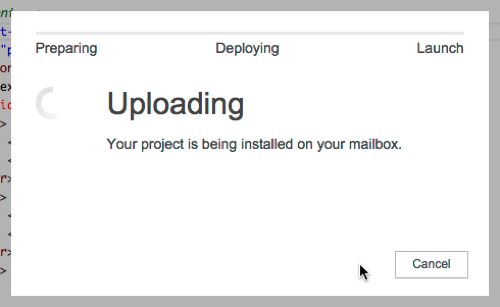
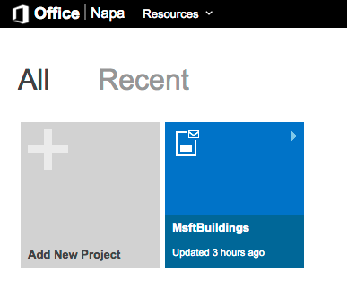
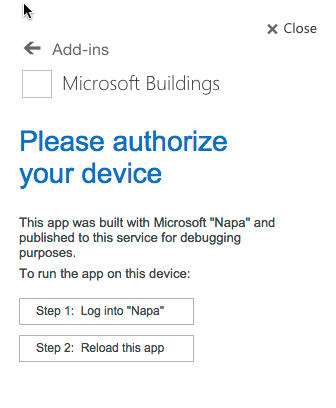

# Introducing Visual Studio Napa for Office Developers
In this lab you will use the NAPA to create a new Office Add-in for Outlook.

## Prerequisites
1. You must have an Office 365 tenant. If you do not have one, the lab for **O3651-7 Setting up your Developer environment in Office 365** shows you how to obtain a trial. You must also have access to an Exchange inbox within an Office 365 developer tenancy.
1. You must have a Microsoft Account in order to login and use Napa.
1. You must have a OneDrive Consumer account as that is where Napa stores project source files.

## Exercise 1: Create an Outlook Mail Add-in
In this exercise you will create an Outlook Add-in that will show a task pane within the email compose form. This first exercise will simply demonstrate how to create, deploy, test as well as see where the add-in was created.


1. Launch Napa & create an Office Add-in for Outlook:
  1. Open an Internet browser and navigate to https://www.napacloudapp.com
  1. You will be prompted to login using your Microsoft Account so go ahead and login.
  1. On the **What Type of Add-in do you want to build?** page, select a **Mail Add-in for Office** and give it a name of **MsftBuildings**:

    

  1. Click **Create**.
1. At this point you have a new mail Outlook Add-in created. This add-in includes controls for both the email compose and read forms:

  

### Deploy and Test the Add-in
1. Without working in the code, let's see how the deployment story works. In the left-hand navigation, click the play button to start the deployment:

  

1. Napa will prompt you for your Office 365 credentials where it will deploy the add-in for you to debug. Enter the credentials for your Office 365 account.

  

  After logging in, it will upload your add-in to Office 365:

  

  Once the add-in is uploaded, Napa will try to launch a new browser window to your Outlook Web App environment. Your browser's pop-up blocker may impact this... if so you can manually launch it by clicking the provided link. In the future you may want to grant Napa access to open windows in your browser's pop-up blocker:

  

1. Once the Outlook Web App loads, select an existing email. You will see the **MsftBuildings** add-in appear in the add-in bar below the email header:

  

1. Close the browser that opened the Outlook Web App.

### Closing and Re-Opening the Add-in Project Later
How would you stop working on the add-in and come back to it at a later date?

1. Back within Napa, click the **Napa** logo in the top-left corner to go back to the Napa homepage.

   Notice the app you created is shown as a tile on the page. This is how you can get back to your project at a later date.

  

### Share the Outlook Add-in
In Napa you can also share a project with someone else that you are currently working on. 

1. From the Napa homepage, select the add-in project **MsftBuildings**.
1. In the left-hand navigation, click the share icon which looks like a little three-way broken circle:

  

1. This will bring up the **Share this project** dialog. Click the **Share** button.

  

1. When Napa complets sharing the project, it will present you with a URL. What Napa did was save the project to your OneDrive Consumer store to a folder named the Add-in within a new / existing folder named **Napa**. 

  This project can take a few minutes to appear in your OneDrive Consumer store. 

1. After a few minutes, if you browse to https://onedrive.live.com/ and login using your Microsoft account, you will the folder for the add-in you shared.

Congratulations! You have created your first Office Add-in using Napa and performed some of the basic functions with it.

## Exercise 2: Create the Microsoft Buildings Email Compose Outlook Add-in
In this exercise you will build off the add-in you created in the previous exercise to customize the email compose form . The task pane will show a list of buildings at Microsoft. You can select a building and add the details to the current email you are creating.

> Note: The application uses a hard coded static JSON file containing a list of Microsoft buildings stored with the add-in. This is because Napa only supports creating client-side applications, not server-side applications. There is no Microsoft service that exists for campus buildings.

1. Ensure the Outlook Add-in you created in the previous exercise is open within Napa. 
1. Update the name and branding of the Add-in:
  1. Upload a new icon for the Add-in by right-clicking the **Images** folder and select **Upload files**.

    Locate the **OfficeDev.png** file located in the [Lab Files](Lab Files) folder in the lab and upload it.
  1. Within the left-hand navigation, click the wrench icon to update the Add-in's settings.
  1. Select the **General** properties tab.
    - Set the **Name** to **Microsoft Buildings**.
    - Set the **Description** to **Easily browse, select & add the details for a Microsoft building to an email you are creating.**
  1. Select the **Read Form** properties tab.
    - **Check** the **Email messages** option.
      - Select the file `AppRead/Home/Home.html` for the **Start Page**.
    - **Uncheck** the **Enable this app on tablets** option.
    - **Uncheck** the **Enable this app on phones** option.
  1. Select the **Compose Form** properties tab.
    - **Check** the **Email messages** option.
      - Select the file `AppCompose/Home/Home.html` for the **Start Page**.
    - **Check** the **Enable this app on tablets** option.
      - Select the file `AppCompose/Home/Home.html` for the **Start Page**.
    - **Check** the **Enable this app on phones** option.
      - Select the file `AppCompose/Home/Home.html` for the **Start Page**.

  

  1. At the bottom of the **Properties** pane, click **Apply** to save your changes.
  1. Go back to the Add-in code view by selecting the first icon (**Explore**) at the top of the left-hand navigation.

### Code the Email Compose Form
1. In the left-hand *Explore* view, select the file **AppCompose \ Home \ Home.html**.
1. After the `<script>` tag that includes the `Office.js` file, add the following script and CSS references for some theme support:

  ````html
  <link rel="stylesheet" type="text/css" href="//ajax.aspnetcdn.com/ajax/jquery.ui/1.10.3/themes/redmond/jquery-ui.css" />
  <script src="//ajax.aspnetcdn.com/ajax/jquery.ui/1.10.3/jquery-ui.js"></script>
  ````

1. Next, locate the `<div id="content-main">` and replace it and it's contents with the following:

  ````html
  <div id="content-main">
    <div class="padding">
      <div>
        <h2>Select a Building:</h2>
        <div id="buildings"></div>
      </div>
    </div>
  </div>
  ````

1. Now open the file **AppCompose \ Home \ Home.js**.
1. Remove the following functions from the file:
  - `setSubject()` 
  - `getSubject()`
  - `addToRecipients()`
1. Next, remove the three jQuery click handlers that attached these functions to the buttons on the page you removed... they should be on or near lines 12-14.
1. Add the following function to the `Home.js` file. This is a client-side click handler that you will use in a moment:

  > Note: Make sure htis code is added to the very end of the `Home.js` file. If you are unsure where to place this, refer to the completed sample for this project in the [Completed Projects](Completed Projects) folder.

  ````javascript
  var buildings = [];
  var buildingsSvcUri = '../../Content/msbuildings.json';

  function insertBuildingDetails(index) {
      var building = buildings[index];
      var buildingDetails = '<div><h4><a href="' + building.DetailsUrl + '">' + building.Name + '</a> - ' + building.Area + '</h4><p>' + building.Address + '</p><br/><a href="' + building.DirectionsUrl + '">Get Directions</a></div>'

      var item = Office.context.mailbox.item;
      item.body.setSelectedDataAsync(buildingDetails, { coercionType: Office.CoercionType.Html });

      if (item.itemType == Office.MailboxEnums.ItemType.Appointment) {
          item.location.setAsync("Microsoft Campus - " + building.Name);
      }
  }
  ````

1. Now, add the following code before the function you just added. This will load the Microsoft buildings from the fake service that you will add to the project in a moment. When someone clicks on one of the buildings in the task pane, it will get added to the current email:

  > Note: Make sure this code is added within the existing JavaScript immediately invoked function expression (IIFE). If you are unsure where to place this, refer to the completed sample for this project in the [Completed Projects](Completed Projects) folder.
  
  ````javascript
  function loadBuildings() {
      // Send an AJAX request
      var xhr = $.getJSON(buildingsSvcUri);
      xhr.done(function (data) {

          buildings = data;
          $('#buildings').accordion({ active: false, collapsible: true });

          // On success, 'data' contains a list of buildings.
          $.each(data, function (key, item) {
              // Add a list item for the building.
              $('#buildings').append('<h3><a href="#"' + item.Id + '>' + item.Name + '</a></h3><div><p>' + item.Area + '<span style="display: inline-block; width: 100px;  text-align:right"><button onclick="insertBuildingDetails(' + item.Id + ')">Insert</button></span></p><p>' + item.Address + '</p></div>');

          });

          $('#buildings').accordion('refresh');

      });
  }
  ````

1. Have this function get called right after initializing the app by adding the following JavaScript code right after the existing `app.initialize()` call:

````javascript
loadBuildings();
````

1. Lastly, right-click the **Content** folder and select **Upload files**. Select the `msbuildings.json` file from the [Lab Files](Lab Files) folder and upload it to the project.

### Test the Email Compose Outlook Add-in
1. In the left-hand navigation, click the **Run Project** button to deploy the Add-in.
1. When the Outlook Web App loads, click **New** to create a new email.

  

1. In the new email interface, click the **Add-ins** button.
1. In the task pane, select the **Microsoft Buildings** form the list of Outlook Add-ins:

  

1. Because this is the first time the Outlook Add-in has been run in this experience, you may be prompted to login & trust the application as shown in the following figure. If so, just follow the two-step instructions:

  

1. Once trusted, you should see the the **Microsoft Buildings** Add-in load as shown in the following figure:

  

1. Select one of the buildings and click the **Insert** button to see the project get added to the body of the email:

  

Congratulations! You have created your first Outlook Add-in using the Napa tools!