Setting Up Your Exchnage Mailbox for Development# Deep Dive into Apps for Office in Outlook

In this lab you will get hands-on experience developing Mail Apps which target Microsoft Outlook and OWA.

**Prerequisites:** Before you can start this lab, you must have installed Office 2013 with Service Pack 1 and Visual Studio 2013 with Update 2 on your development workstation. You must also have access to an Exchange inbox within an Office 365 developer tenancy in which you have administrator permissions.

## Exercise 1: Setting Up Your Exchange Mailbox 
*Mail Apps are displayed within the context of Messages and Appointments in your mailbox in both Outlook and OWA. As such, you will need to have some messages in your mailbox in order to test the mail apps you are developing. Your Exchange account came with a clean mailbox. The following steps will lead you through creating messages for later use in the Hands-On Lab.*

1. Log into Outlook Web App using the URL and account credentials provided to you.
2. Click on the **create new message** icon.
	1. In the **To:** line, address the email to yourself.
	2. In the **subject**, type anything you like.
	3. In the **body** field, type an address such as **xx**.
3. Send the message.
4. Refresh OWA if you don’t see the message appear in your inbox in a few seconds.
5. Now, click on the message. You should see a link to display apps that were activated on this message. 
6. When you click on the link, you should the tab for the **Bing Maps** mail app.  Click on the **Bing Maps** tab to activate the app which should show you a Bing map for the address in the email.
7. Once you have verified that mail apps are working, you can move on to the next exercise where you will create and test your first custom mail app.

## Exercise 2: Creating and Debugging a Mail App using Visual Studio 2013
*In this exercise you will create a new App for Office project in Visual Studio so that you can begin to write, test and debug an App for Office which targets Microsoft Word.*

1. Launch Visual Studio 2013 as administrator.
2. From the **File** menu select the **New Project** command. When the **New Project** dialog appears, select the **App for Office** project template from the **Office/SharePoint** template folder as shown below. Name the new project **MyFirstMailApp** and click **OK** to create the new project.  
 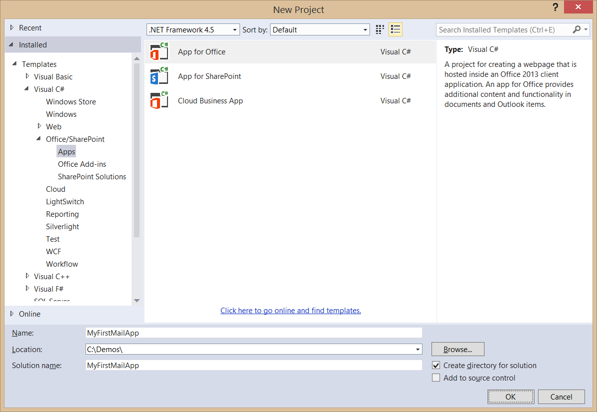
	
3. When you create a new App for Office project, Visual Studio prompts you with the **Choose the app type** page of the **Create app for Office** dialog. This is the point where you select the type of App for Office you want to create. select an app type of **Mail** and select **OK** to continue.  
 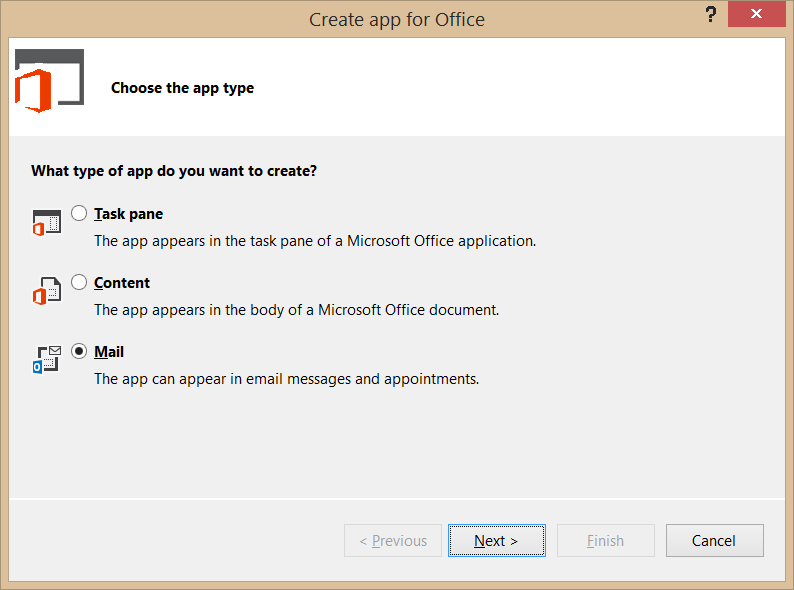
	
4. On the **Choose where you want the app to appear** page of the **Create app for Office** dialog, check **Read Form** for both **Email** and **Appointment**. 
Uncheck **Compose Form** for both **Email** and **Appointment** and then click **Finish** to create the new Visual Studio solution.  
 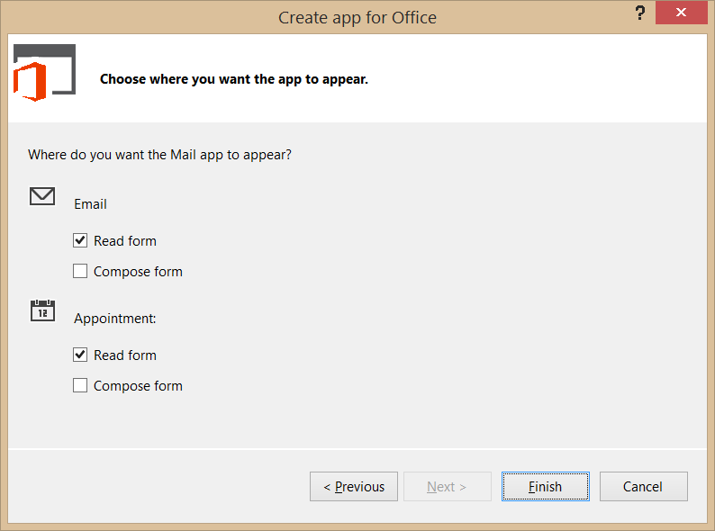
	
5. Take a look at the structure of the new Visual Studio solution once it has been created. At a high-level, the new solution has been created using two Visual Studio projects named **MyFirstMailApp** and **MyFirstMailAppWeb**. You should also observe that the top project contains a top-level manifest for the app named **MyFirstMailAppManifest**.  
 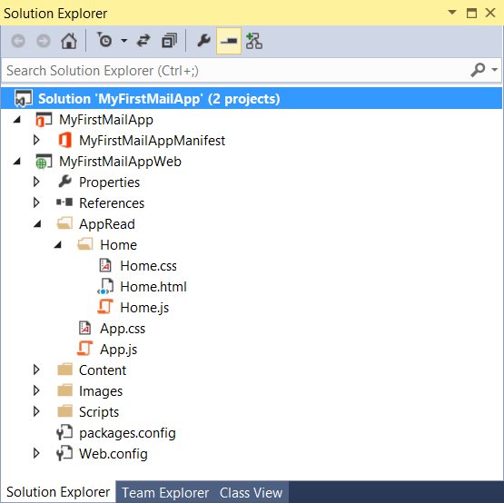

6. Double-click on **MyFirstMailAppManifest** to open the app manifest file in the Visual Studio designer. By default, the designer opens by displaying the **General** tab. Update the **Display Name** settings in the app manifest from **MyFirstMailApp** to **My First Mail App**.  
 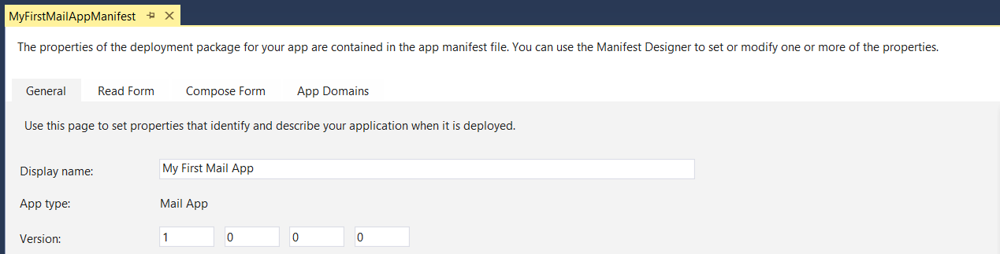

7. Navigate in the manifest designer from the **General** tab to the **Read Form** tab. Examine the default set of activation rules. You can see that the mail app will activate on any item that is either an email message or an appointment.  
 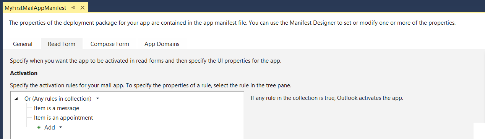
8. Save and close **MyFirstMailAppManifest**.
9. Over the next few steps you will walk through the default app implementation that Visual Studio generated for you when the app project was created. Begin by looking at the structure of the **app** folder which has two important files named **app.css** and **app.js** which contain CSS styles and JavaScript code which is to be used on an app-wide basis.  
 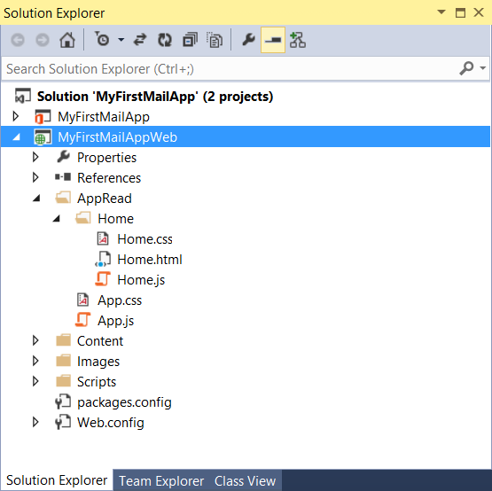
10. You can see that inside the **app** folder there is a child folder named **Home** which contains three files named **Home.html**, **Home.css** and **Home.js**. Note that the app project is currently configured to use **Home.html** as the app's start page and that **Home.html** is linked to both **Home.css** and **Home.js**.
11. Double-click on **app.js** to open it in a code editor window. you should be able to see that the code creates a global variable named **app** based on the JavaScript *Closure* pattern. The global **app** object defines a method named **initialize** but it does not execute this method. 
 
		var app = (function () {
		  "use strict";

		  var app = {};

		  // Common initialization function (to be called from each page)
		  app.initialize = function () {
		    $('body').append(
			  '
' +
			  '
' +
			  '

' +
			  '

' +
			  '

' +
			  '
' +
			  '
');

			  $('#notification-message-close').click(function () {
			    $('#notification-message').hide();
			  });

			  // After initialization, expose a common notification function
			  app.showNotification = function (header, text) {
			    $('#notification-message-header').text(header);
			    $('#notification-message-body').text(text);
			    $('#notification-message').slideDown('fast');
			  };
			};

			  return app;
		})();
12. Close **app.js** and be sure not to save any changes.
13. Next you will examine the JavaScript code in **home.js**. Double-click on **home.js** to open it in a code editor window. Note that **Home.html** links to **app.js** before it links to **home.js** which means that JavaScript code written in **Home.js** can access the global **app** object created in **app.js**.
14. Open **Home.js** examine the code inside. You can see that it uses a self-executing function to register an event handler on the **Office.initialize** method which in turn registers a document-ready event handler using jQuery. This allows the app to call **app.initialize**. Below there is another function named **displayItemDetails** function.
15. Delete the implementation of **displayItemDetails** to make it an empty function. When you are done, your code should match code listing below. 
 
		(function () {
        "use strict";

          // The Office initialize function must be run each time a new page is loaded
          Office.initialize = function (reason) {
            $(document).ready(function () {
                app.initialize();
                displayItemDetails();
            });
          };

          function displayItemDetails() {
        
          }

		})();    
16. Save your changes to **Home.js**. You will return to this source file after you have added your HTML layout to **Home.html**.
17. Now it time to examine the HTML that has been added to the project to create the app's user interface. Double-click **Home.html** to open this file in a Visual Studio editor window. Examine the layout of HTML elements inside the **body** element. 

		<body>
            

                

                    
<strong>Add home screen content here.</strong>

                    
For example, this app was activated with following details:

                    <table id="details">
                        <tr>
                            <th>Subject:</th>
                            <td id="subject"></td>
                        </tr>
                        <tr>
                            <th>From:</th>
                            <td id="from"></td>
                        </tr>
                    </table>
                

            

            

                

                    <a target="_blank" href="https://go.microsoft.com/fwlink/?LinkId=276814">Find more samples online...</a>
                

		    

		</body>
18. Trim down the contents of the **div** element with the **id** of **content-main** to match the HTML code shown below. The new HTML layout will include a single div element with an id of **results**. In the remaining steps of this exercise, you will create the user interface for this app by dynamically generating HTML with jQuery and appending that HTML into the **results** div.

        <body>
            

                

                    

                

            

        </body>  
19. Save and close **Home.html**.
20.	Return to **Home.js** and implement the **displayItemDetails** function using the code shown in the following ode listing.

        function displayItemDetails() {
            var mailbox = Office.context.mailbox;
            $("#result").text("Mailbox Owner: " + mailbox.userProfile.displayName);
        }
21. Save your changes to **Home.js**.
22. Now it's time to test the app using the Visual Studio debugger. Press the **{F5}** key to run the project in the Visual Studio debugger. When you run the debugger for the first time, Visual Studio will prompt you for the email address and password of your exchange mailbox as shown in the following screenshot. Enter your login credentials and click the **Connect** button.  
 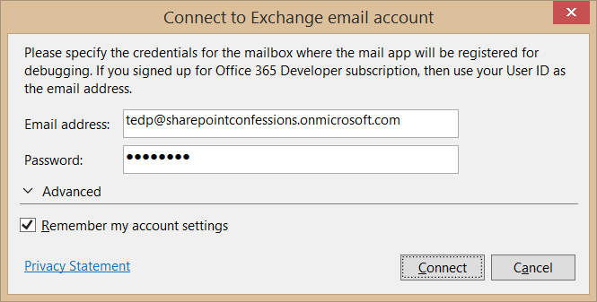
23.	The Visual Studio debugger will now go through the process of installing the app and redirecting you to your inbox in the OWA web client. When you select an email message, you should see the **My First Mail App** activation tab for your app as shown in the following screenshot.  
 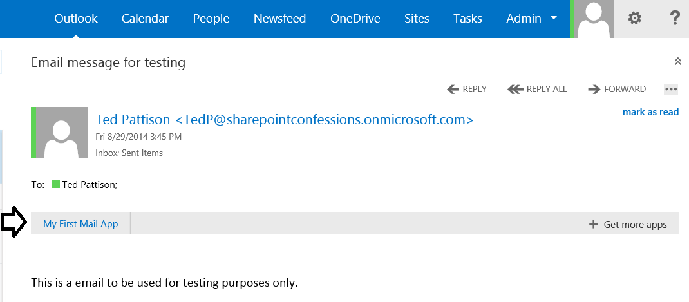
24. Click on the **My First Mail App** activation tab to activate your app. You should be able to verify that the app is displaying a message which shows who the mailbox owner is.
 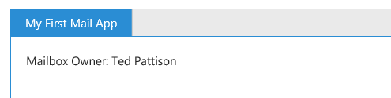
25. In this step you will see how easy it is to make changes to your HTML, CSS and JavaScript code during an active debugging session. Leave the OWA browser window open and return to Visual Studio while leaving the debugging session running. Make a small change to the **displayItemDetails** function implementation by changing the literal text as shown in the following code listing.

        function displayItemDetails() {
            var mailbox = Office.context.mailbox;
            $("#results").text("The Owner of the current mailbox: " + mailbox.userProfile.displayName);
        }
26. Save your changes to **Home.js**.
27. Return to the OWA browser window where the app is currently activated. Right click on the white background of the app and select **Refresh** 
 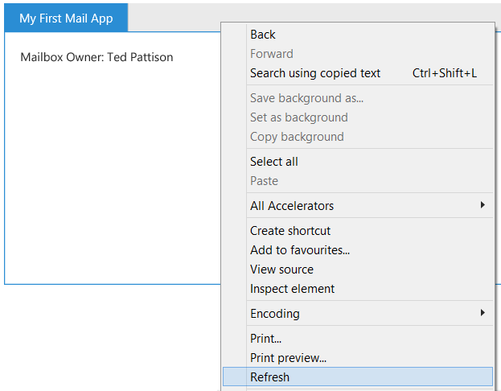
28.	You should see that app now is updating its UI with the more recent update to the **displayItemDetails** function.
 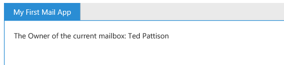
29.	Close the OWA browser window to terminate the debugging session and return to Visual Studio.

## Exercise 3: Programming with Messages and Announcements
*In this exercise you will continue to work on the MyFirstMailApp project that you created in the previous exercise by adding more code that programs against email messages and appointments.*

1.	Make sure the **MyFirstMailApp** project is open.
2. Open the CSS file named **Home.css** and add the following CSS rules. If you would rather not type it in by hand, you can copy and paste these CSS rules from the file named **Home.css.txt** which is located in the **Starter Files** folder for this lab.

		#content-main table {
          margin-left: 15px;
          background-color: aliceblue;
        }

        #content-main table, #content-main table th, #content-main table td {
          border-collapse: collapse;
          border: 1px solid #DDD;
        }

        #content-main table th, #content-main table td {
          padding: 3px;
        }

        #content-main table th {
          width: 150px;
          text-align: left;
          padding-right: 10px;
        }

        #content-main table td {
          width: 300px;
        }
3.	Save and close **Home.css**.
4.	Open **Home.js** in a code editor window.
5.	Add a function named **createRow** directly below the **displayItemDetails** function using the implementation shown in the following code listing.
 
		function createRow(rowLabel, rowValue) {
		    var row = $("<tr>");
		    row.append($("<th>").text(rowLabel));
		    row.append($("<td>").text(rowValue));
		    return row;
		}

6. Update the **displayItemDetails** function as shown in the following code listing.

		function displayItemDetails() {
		                
		    var displayTable = $("<table>");
		
		    var mailbox = Office.context.mailbox;
		    displayTable.append(createRow("Mailbox Owner:", mailbox.userProfile.displayName));
		    displayTable.append(createRow("Mailbox Timezone:", mailbox.userProfile.timeZone));
		    displayTable.append(createRow("EWS Url:", mailbox.ewsUrl));
		
		    var item = Office.cast.item.toItemRead(Office.context.mailbox.item);
		    displayTable.append(createRow("itemType:", item.itemType));
		    displayTable.append(createRow("subject:", item.subject));
		    displayTable.append(createRow("to:", item.to[0].displayName));
		    displayTable.append(createRow("from:", item.from.displayName));
		        
		    $("#results").empty();
		    $("#results").append(displayTable);
		}
7.	Start a new debugging session. Once you have been redirected to the OWA browser window, select a message and activate the app. It should display property value for the mailbox and the current email message as shown in the following screenshot.  
 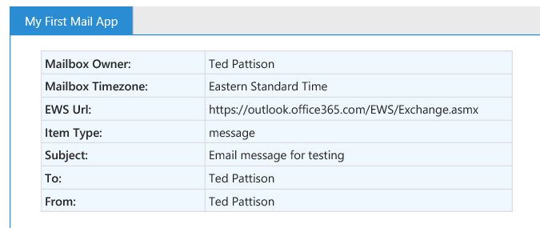
8.	Now that you can see you app works with email messages, it's time to see how the app works when activated within an appointment item. Begin by clicking on the **Calendar** link in top navigation bar to navigate to the calendar so you can create a new appointment.
 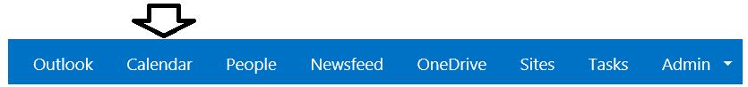  	
9. On the page which shows the calendar, click the **new event** link to create a new appointment.
 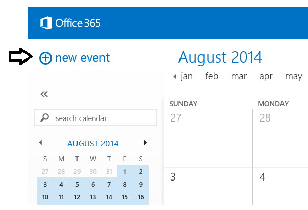
10.	When creating the new appointment, give it a title of **Test appointment** and then save and close it.
11.	Reopen the appointment. When you do this, you should see the **My First Mail App** activation tab.
 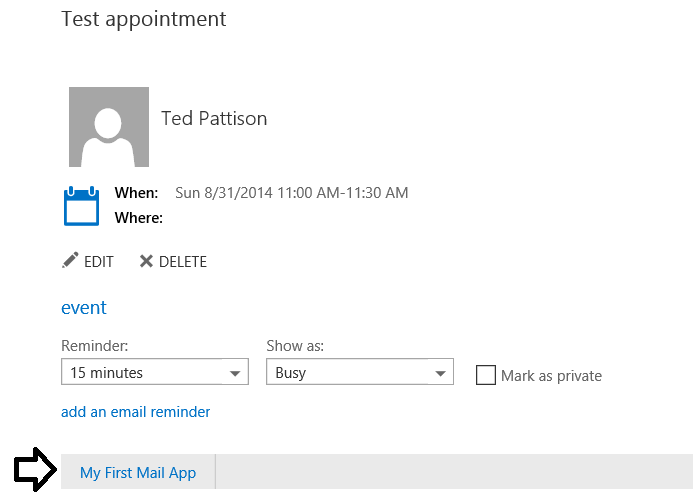
12. Attempt to activate the app. When you do you will experience a run time JavaScript error because certain item properties such as **to** and **from** are valid only for message but not for appointments. You next job is to modify the app with conditional code to inspect when the current item is an email message or an appointment.
13. Return to Visual Studio and modify the **displayItemProperties** function with the code shown in the following code listing which will provide conditional logic depending on whether the current item is a message or a appointment.

		function displayItemDetails() {
		
		    var displayTable = $("<table>");
		
		    var mailbox = Office.context.mailbox;
		    displayTable.append(createRow("Mailbox Owner:", mailbox.userProfile.displayName));
		    displayTable.append(createRow("Mailbox Timezone:", mailbox.userProfile.timeZone));
		    displayTable.append(createRow("EWS Url:", mailbox.ewsUrl));
		
		    var item = Office.cast.item.toItemRead(Office.context.mailbox.item);
		    displayTable.append(createRow("Item Type:", item.itemType));
		
		    if (item.itemType === Office.MailboxEnums.ItemType.Message) {
		        displayTable.append(createRow("Subject:", item.subject));
		        displayTable.append(createRow("To:", item.to[0].displayName));
		        displayTable.append(createRow("From:", item.from.displayName));
		    }
		
		    if (item.itemType === Office.MailboxEnums.ItemType.Appointment) {
		
		        displayTable.append(createRow("Organizer:", item.organizer.displayName));
		        displayTable.append(createRow("Start time:", item.start));
		    }
		
		    $("#results").empty();
		    $("#results").append(displayTable);
		}
14. Save your changes to **Home.js** and refresh the app which has been activated within the appointment. Now it should display properly as shown in the following screenshot.
 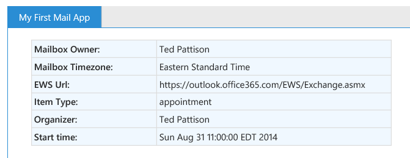

15. You have now completed this lab.