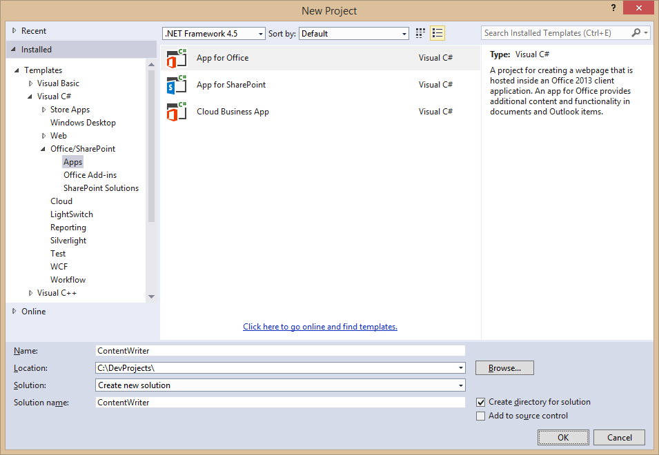
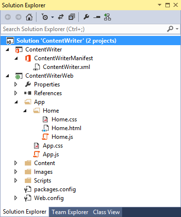
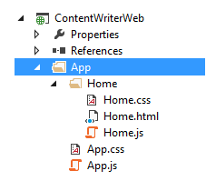
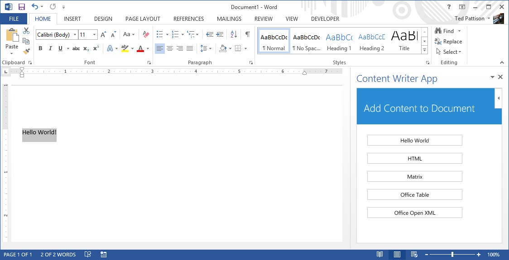
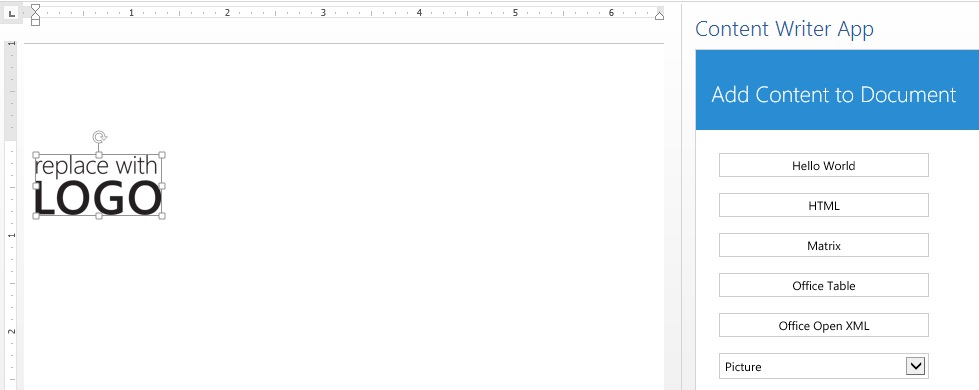
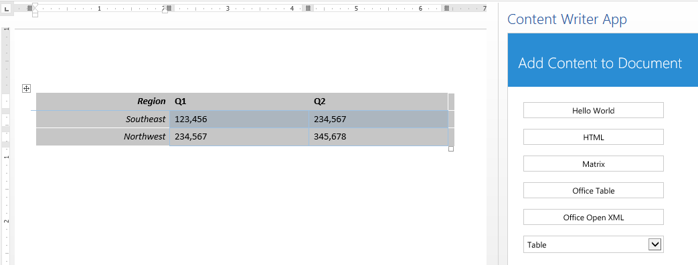

# Deep Dive into Apps for Office with Word

In this lab you will get hands-on experience developing an App for Office which targets Microsoft Word.

**Prerequisites:** Before you can start this lab, you must have installed Office 2013 with Service Pack 1 and Visual Studio 2013 with Update 2 on your development workstation.

## Exercise 1: Creating the ContentWriter App for Office Project
*In this exercise you will create a new App for Office project in Visual Studio so that you can begin to write, test and debug an App for Office which targets Microsoft Word. The user interface of the App for Office you will create in this lab will not be very complicated as it will just contain HTML buttons and JavaScript command handlers.*

1. Launch Visual Studio 2013 as administrator.
2. From the **File** menu select the **New Project** command. When the **New Project** dialog appears, select the **App for Office** project template from the **Office/SharePoint** template folder as shown below. Name the new project **ContentWriter** and click **OK** to create the new project.
 

3. When you create a new App for Office project, Visual Studio prompts you with the **Choose the app type** page of the **Create app for Office** dialog. This is the point where you select the type of App for Office you want to create. Leave the default setting with the radio button titled **Task pane** and select **OK** to continue.
 

4. On the **Choose the host applications** page of the **Create app for Office** dialog, uncheck all the Office application except for **Word** and then click **Finish** to create the new Visual Studio solution. 
 

5. Take a look at the structure of the new Visual Studio solution once it has been created. At a high-level, the new solution has been created using two Visual Studio projects named **ContentWriter** and **ContentWriterWeb**. You should also observe that the top project contains a top-level manifest for the app named **ContentWriterManifest** which contains a single file named **ContentWriter.xml**.
 

6. In the Solution Explorer, double-click on the node named **ContentWriterManifest** to open the app manifest file in the Visual Studio designer. Update the **Display Name** settings in the app manifest from **ContentWriter** to **Content Writer App**.
 

7. Save and close **ContentWriterManifest**.
8. Over the next few steps you will walk through the default app implementation that Visual Studio generated for you when the app project was created. Begin by looking at the structure of the **app** folder which has two important files named **app.css** and **app.js** which contain CSS styles and JavaScript code which is to be used on an app-wide basis.
 

9. You can see that inside the **app** folder there is a child folder named **Home** which contains three files named **Home.html**, **Home.css** and **Home.js**. Note that the app project is currently configured to use **Home.html** as the app's start page and that **Home.html** is linked to both **Home.css** and **Home.js**.
 
10. Double-click on **app.js** to open it in a code editor window. you should be able to see that the code creates a global variable named **app** based on the JavaScript *Closure* pattern. The global **app** object defines a method named **initialize** but it does not execute this method. 
 
		var app = (function () {
		  "use strict";

		  var app = {};

		  // Common initialization function (to be called from each page)
		  app.initialize = function () {
		    $('body').append(
			  '
' +
			  '
' +
			  '

' +
			  '

' +
			  '

' +
			  '
' +
			  '
');

			  $('#notification-message-close').click(function () {
			    $('#notification-message').hide();
			  });

			  // After initialization, expose a common notification function
			  app.showNotification = function (header, text) {
			    $('#notification-message-header').text(header);
			    $('#notification-message-body').text(text);
			    $('#notification-message').slideDown('fast');
			  };
			};

			  return app;
		})();
11. Close **app.js** and be sure not to save any changes.
12. Next you will examine the JavaScript code in **home.js**. Double-click on **home.js** to open it in a code editor window. Note that **Home.html** links to **app.js** before it links to **home.js** which means that JavaScript code written in **Home.js** can access the global **app** object created in **app.js**.
13. Walk through the code in **Home.js** and see how it uses a self-executing function to register an event handler on the **Office.initialize** method which in turn registers a document-ready event handler using jQuery. This allows the app to call **app.initialize** and to register an event handler using the **getDataFromSelection** function. 
 
		(function () {
		  "use strict";

		  // The initialize function must be run each time a new page is loaded
		  Office.initialize = function (reason) {
		    $(document).ready(function () {
		      app.initialize();
		      $('#get-data-from-selection').click(getDataFromSelection);
		    });
		  };

		  // Reads data from current document selection and displays a notification
		  function getDataFromSelection() {
		    Office.context.document.getSelectedDataAsync(Office.CoercionType.Text,
		      function (result) {
		        if (result.status === Office.AsyncResultStatus.Succeeded) {
		          app.showNotification('The selected text is:', '"' + result.value + '"');
		        } else {
		          app.showNotification('Error:', result.error.message);
		      }
			});
		  }
		})();
14. Delete the **getDataFromSelection** function from **Home.js** and also remove the line of code that binds the event handler to the button with the id of **get-data-from-selection** so your code matches the following code listing.

		(function () {
		  "use strict";

		  // The initialize function must be run each time a new page is loaded
		  Office.initialize = function (reason) {
		    $(document).ready(function () {
		      app.initialize();
		      // your app initialization code goes here
		    });
		  };

		})(); 
15. Save your changes to **Home.js**. You will return to this source file after you have added your HTML layout to **Home.html**.
16. Now it time to examine the HTML that has been added to the project to create the app's user interface. Double-click **Home.html** to open this file in a Visual Studio editor window. Examine the layout of HTML elements inside the body element. 

		<body>
			

				

					<h1>Welcome</h1>
				

			

			

				

					
<strong>Add home screen content here.</strong>

					
For example:

					<button id="get-data-from-selection">Get data from selection</button>

					

						<a target="_blank" href="https://go.microsoft.com/fwlink/?LinkId=276812">Find more samples online...</a>
					

				

			

		</body>
17. Replace the text message of **Welcome** inside the **h1** element with a different message such as **Add Content to Document**. Also trim down the contents of the **div** element with the **id** of **content-main** to match the HTML code shown below. 

		<body>
			

				

					<h1>Add Content to Document</h1>
				

			

			

				

					<!-- your app UI layout goes here -->
				

			

		</body>
18. Update the **content-main** div to match the following HTML layout which adds a set of buttons to the app's layout.

		

			

				

					<button id="addContentHellowWorld">Hello World</button>
				

				

					<button id="addContentHtml">HTML</button>
				

				

					<button id="addContentMatrix">Matrix</button>
				

				

					<button id="addContentOfficeTable">Office Table</button>
				

				

					<button id="addContentOfficeOpenXml">Office Open XML</button>
				

			

		

19. Save and close **Home.html**.
20. Open the CSS file named **Home.css** and add the following CSS rule to ensure all the app's command buttons and select element have a uniform width and spacing.

		#content-main button, #content-main select{
				width: 210px;
				margin: 8px;
		}
21. Save and close **Home.js**.
22. Now it's time to test the app using the Visual Studio debugger. Press the **{F5}** key to run the project in the Visual Studio debugger. The debugger should launch Microsoft Word 2013 and you should see your App for Office in the task pane on the right side of a new Word document as shown in the following screenshot.
 

23. Close Microsoft Word to terminate your debugging session and return to Visual Studio.
24. Return to the source file named **Home.js** or open it if it is not already open.
25. Add a new function named **testForSuccess** with the following implementation.

		function testForSuccess(asyncResult) {
			if (asyncResult.status === Office.AsyncResultStatus.Failed) {
				app.showNotification('Error', asyncResult.error.message);
			}
		}

25. Create a function named **onAddContentHellowWorld** and add the following call to **setSelectedDataAsync**.

		function onAddContentHellowWorld() {
			Office.context.document.setSelectedDataAsync("Hello World!", testForSuccess);
		}
26. Finally, add a line of jQuery code into the app initialization logic to bind the click event of the **addContentHellowWorld** button to the **onAddContentHellowWorld** function.

		Office.initialize = function (reason) {
			$(document).ready(function () {
				app.initialize();
				// add this code to wire up event handler
				$("#addContentHellowWorld").click(onAddContentHellowWorld)
			});
		};
27. When you are done, the **Home.js** file should match the following listing.

		(function () {
			"use strict";

			// The initialize function must be run each time a new page is loaded
			Office.initialize = function (reason) {
				$(document).ready(function () {
					app.initialize();
					// wire up event handler
					$("#addContentHellowWorld").click(onAddContentHellowWorld)
				});
			};

			// write text data to current at document selection 
			function onAddContentHellowWorld() {
				Office.context.document.setSelectedDataAsync("Hello World!", testForSuccess);
			}

			function testForSuccess(asyncResult) {
				if (asyncResult.status === Office.AsyncResultStatus.Failed) {
					app.showNotification('Error', asyncResult.error.message);
				}
			}

		})();
28. Save your changes to **Home.js**.
29. Now test the functionality of the app. Press the **{F5}** key to begin a debugging session and click the **Hello World** button. You should see that "Hello World" has been added into the cursor position of the Word document.
 

30. You have now successfully run and tested the app and its JavaScript logic using the Visual Studio debugger. Close Microsoft Word to stop the debugging session and return to Visual Studio.

## Exercise 2: Writing Content Using Coercion Types
*In this exercise you will continue working on the Visual Studio solution for the ContentWriter app you created in the previous exercise. You will add additional JavaScript code to insert content into the current Word document in a variety of formats.*
 
1. In Visual Studio, make sure you have the **ContentWriter** project open.
2. In the Solution Explorer, double click on **Home.js** to open this JavaScript file in an editor window. 
3. Just below the **onAddContentHelloWorld** function, add four new functions named **onAddContentHtml**, **onAddContentMatrix**, **onAddContentOfficeTable** and **onAddContentOfficeOpenXml**.

		function onAddContentHellowWorld() {
			Office.context.document.setSelectedDataAsync("Hello World!", testForSuccess);
		}

		function onAddContentHtml() {
		}

		function onAddContentMatrix() {
		}

		function onAddContentOfficeTable() {
		}

		function onAddContentOfficeOpenXml() {
		}

4. Just below the call to **app.initialize**, add the jQuery code required to bind each of the four new functions to the **click** event of the associated buttons.
   

		Office.initialize = function (reason) {
			$(document).ready(function () {
				app.initialize();
				// wire up event handler
				$("#addContentHellowWorld").click(onAddContentHellowWorld);
				$('#addContentHtml').click(onAddContentHtml);
				$('#addContentMatrix').click(onAddContentMatrix);
				$('#addContentOfficeTable').click(onAddContentOfficeTable);
				$('#addContentOfficeOpenXml').click(onAddContentOfficeOpenXml);
			});
		};
5. Implement the **onAddContentHtml** function to create an HTML div element with several child elements using jQuery and then to write that HTML to the Word document using the HTML coercion type using the code in the following listing.

		function onAddContentHtml() {
			// create HTML element
			var div = $("
")
					.append($("<h2>").text("My Heading"))
					.append($("
").text("This is paragraph 1"))
					.append($("
").text("This is paragraph 2"))

			// insert HTML into Word document
			Office.context.document.setSelectedDataAsync(div.html(), { coercionType: "html" }, testForSuccess);
		}
6. Test your work by starting a debug session and clicking the **HTML** button. When you click the button, you should see that the HTML content has been added to the Word document.
 

7. Implement **onAddContentMatrix** by creating an array of arrays and then by writing the matrix to the Word document using the matrix coercion type as shown in the following code listing.

		function onAddContentMatrix() {

			// create matrix as an array of arrays
			var matrix = [["First Name", "Last Name"],
		                  ["Bob", "White"],
		                  ["Anna", "Conda"],
		                  ["Max", "Headroom"]];

			// insert matrix into Word document
			Office.context.document.setSelectedDataAsync(matrix, { coercionType: "matrix" }, testForSuccess);
		}
8. Test your work by starting a debug session and clicking the **Matrix** button. When you click the button, you should see that the content from the matrix has been added to the Word document as a table.
 

9. Implement **onAddContentOfficeTable** by creating a new Office.TableData object  and then by writing it to the Word document using the table coercion type as shown in the following code listing.

		function onAddContentOfficeTable() {

			// create and populate an Office table
			var myTable = new Office.TableData();
			myTable.headers = [['First Name', 'Last Name']];
			myTable.rows = [['Bob', 'White'], ['Anna', 'Conda'], ['Max', 'Headroom']];

			// add table to Word document
			Office.context.document.setSelectedDataAsync(myTable, { coercionType: "table" }, testForSuccess)
		}

10. Test your work by starting a debug session and clicking the **Office Table** button. When you click the button, you should see that the content from the Office Table object has been added to the Word document as a table.
 

11. You have now finished exercise 2 and it is time to move on to exercise 3.

## Exercise 3: Writing Content to a Word document using Office Open XML
*In this exercise you will continue working on the Visual Studio solution for the ContentWriter app you worked on in the previous exercise. You will extend the app's capabilities by adding JavaScript code to insert content into the active Word document.*

1. Find XML files.
 

2. Add XML files in Visual Studio project.
 

3. Open **Home.html** and add the following select element.

		

		  <button id="addContentOfficeOpenXml">Office Open XML</button>
		  <select id="listOpenXmlContent">
		    <option value="OpenXmlParagraph.xml">Paragraph</option>
		    <option value="OpenXmlPicture.xml">Picture</option>
		    <option value="OpenXmlChart.xml">Chart</option>
		    <option value="OpenXmlTable.xml">Table</option>
		  </select>
		

4. Implement **onAddContentOfficeOpenXml**.

		function onAddContentOfficeOpenXml() {

			var fileName = $("#listOpenXmlContent").val();

			$.ajax({
				url: fileName,
				type: "GET",
				dataType: "text",
				success: function (xml) {
					Office.context.document.setSelectedDataAsync(xml, { coercionType: "ooxml" }, testForSuccess)
				}
			});

		}
5. Test your work by starting a debug session and clicking the **Office Open XML** button when the select element has the default select of Paragraph.
 

6. Change the value of the dropdown select element to Picture and click the **Office Open XML** button.
 

7. Change the value of the dropdown select element to Chart and click the **Office Open XML** button.
 

8. Change the value of the dropdown select element to Tableand click the **Office Open XML** button.
 