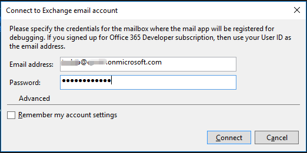
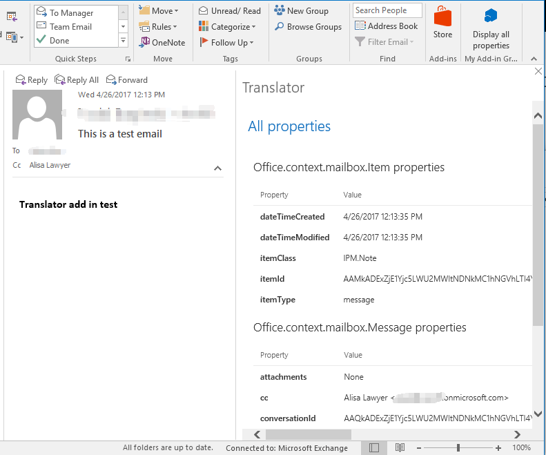

# Create your first Office add-in with the Outlook JavaScript APIs

In this lab, you will use Visual Studio to create your first Outlook add-in using the Outlook JavaScript APIs. The add-in will allow the user to translate parts of a message they are composing into different languages.

## Get an Office 365 developer environment
1. You must have an Office 365 tenant to complete this lab. If you do not have one, the lab for **O3651-7 Setting up your Developer environment in Office 365** shows you how to obtain a trial. 
2. You must also have access to an Exchange Inbox within an Office 365 developer tenancy.
3. You must have Visual Studio 2017 with the Office/SharePoint development tools installed.
4. You must have Office 2016 installed.

## Exercise 1: Create a new Outlook add-in project

In this exercise you will create a new project using the Outlook add-in template.

1. Launch **Visual Studio 2017**. 
2. In Visual Studio 2017, select **File | New | Project**.
   1. Expand **Templates**, **Visual C#**, **Office/SharePoint** ,**Add-ins**. Select **Outlook Web Add-in**. Name the project **Translator** and click **OK**.

    

3. Run the app to verify it works.
  1. Press F5 to begin debugging.
  1. When prompted, enter the email address and password of your Office 365 account. Visual Studio will install the add-in for that user.
  
    
    
  1. With the app running, open Outlook 2016 and log on to the user's mailbox. You should see a **Display all properties** button on the ribbon when you select or open a message. (Note that if this is the first time you are running Outlook on that box you need to go through the typical Outlook configuration to connect to Exchange)
  
    
    
Now that you've verified that the add-in is working, Exercise 1 is complete!

## Exercise 2: Add buttons to the new message ribbon

In this exercise you will add a button to translate text to Latin and a button to open a task pane, allowing the user to select start and end languages.
  
1. Open the project that created on Exercise 1.
2. Add the **Translator** button group to the new message ribbon.
  1. Open the **Translator/TranslatorManifest/Translator.xml** file.
  1. Locate the following line:
  
    ```xml
    <FunctionFile resid="functionFile" />
    ```
    
  1. Insert the following after that line:
  
    ```xml
    <!-- Message Compose -->
    <ExtensionPoint xsi:type="MessageComposeCommandSurface">
      <OfficeTab id="TabDefault">
        <Group id="msgComposeGroup">
          <Label resid="groupLabel"/>
          <!-- Add Latin translation button here -->
          <!-- Add More Options button here -->
        </Group>
      </OfficeTab>
    </ExtensionPoint>
    ```
    
3. Add the **Translate to Latin** button.
  1. Replace the `<!-- Add Latin translation button here -->` line with the following:
    
    ```xml
    <Control xsi:type="Button" id="msgComposeToLatin">
      <Label resid="toLatinLabel"/>
      <Supertip>
        <Title resid="toLatinTitle"/>
        <Description resid="toLatinDesc"/>
      </Supertip>
      <Icon>
        <bt:Image size="16" resid="icon16"/>
        <bt:Image size="32" resid="icon32"/>
        <bt:Image size="80" resid="icon80"/>
      </Icon>
      <Action xsi:type="ExecuteFunction">
        <FunctionName>translateToLatin</FunctionName>
      </Action>
    </Control>
    ```
    
4. Add the **More Options** button.
  1. Replace the `<!-- Add More Options button here -->` line with the following:
  
    ```xml
    <Control xsi:type="Button" id="msgComposePaneButton">
      <Label resid="translatePaneButtonLabel"/>
      <Supertip>
        <Title resid="translatePaneButtonTitle"/>
        <Description resid="translatePaneButtonDesc"/>
      </Supertip>
      <Icon>
        <bt:Image size="16" resid="icon16"/>
        <bt:Image size="32" resid="icon32"/>
        <bt:Image size="80" resid="icon80"/>
      </Icon>
      <Action xsi:type="ShowTaskpane">
        <SourceLocation resid="translatePaneUrl"/>
      </Action>
    </Control>
    ```
    
5. Add resources for the new buttons.
  1. Locate the `<bt:Urls>` element within the `<Resources>` element in **Translator/TranslatorManifest/Translator.xml**.
  2. Add the following element after the last `<bt:Url>` element:
    
    ```xml
    <bt:Url id="translatePaneUrl" DefaultValue="~remoteAppUrl/TranslatePane.html"/>
    ```
  
  3. Locate the `<bt:ShortStrings>` element within the `<Resources>` element.
  4. Change the `DefaultValue` of the `<bt:String>` element with an `id` attribute of `groupLabel` to `Translator`.
    
    ```xml
    <bt:String id="groupLabel" DefaultValue="Translator"/>
    ```
  5. Add the following elements after the last `<bt:String>` element inside the `<bt:ShortStrings>` element:
  
    ```xml
    <bt:String id="toLatinLabel" DefaultValue="Translate to Latin"/>
    <bt:String id="toLatinTitle" DefaultValue="Translate any language to Latin"/>
    <bt:String id="translatePaneButtonLabel" DefaultValue="More Options"/>
    <bt:String id="translatePaneButtonTitle" DefaultValue="Choose to and from language"/>
    ```
    
  6. Locate the `<bt:LongStrings>` element within the `<Resources>` element.
  7. Add the following elements after the last `<bt:String>` element inside the `<bt:LongStrings>` element:
  
    ```xml
    <bt:String id="toLatinDesc" DefaultValue="Auto-detects the starting language and translates the selected text to Latin. Instantly sound smarter!"/>
    <bt:String id="translatePaneButtonDesc" DefaultValue="Opens a window allowing you to choose a to and from language for translation"/>
    ```
    
  8. When you've made all of those changes, the `<Resources>` section of your file should look like the following:
  
    ```xml
    <Resources>
      <bt:Images>
        <bt:Image id="icon16" DefaultValue="~remoteAppUrl/Images/icon16.png"/>
        <bt:Image id="icon32" DefaultValue="~remoteAppUrl/Images/icon32.png"/>
        <bt:Image id="icon80" DefaultValue="~remoteAppUrl/Images/icon80.png"/>
      </bt:Images>
      <bt:Urls>
        <bt:Url id="functionFile" DefaultValue="~remoteAppUrl/Functions/FunctionFile.html"/>
        <bt:Url id="messageReadTaskPaneUrl" DefaultValue="~remoteAppUrl/MessageRead.html"/>
        <bt:Url id="translatePaneUrl" DefaultValue="~remoteAppUrl/TranslatePane.html"/>
      </bt:Urls>
      <bt:ShortStrings>
        <bt:String id="groupLabel" DefaultValue="Translator"/>
        <bt:String id="customTabLabel"  DefaultValue="My Add-in Tab"/>
        <bt:String id="paneReadButtonLabel" DefaultValue="Display all properties"/>
        <bt:String id="paneReadSuperTipTitle" DefaultValue="Get all properties"/>
        <bt:String id="toLatinLabel" DefaultValue="Translate to Latin"/>
        <bt:String id="toLatinTitle" DefaultValue="Translate any language to Latin"/>
        <bt:String id="translatePaneButtonLabel" DefaultValue="More Options"/>
        <bt:String id="translatePaneButtonTitle" DefaultValue="Choose to and from language"/> 
      </bt:ShortStrings>
      <bt:LongStrings>
        <bt:String id="paneReadSuperTipDescription" DefaultValue="Opens a pane displaying all available properties. This is an example of a button that opens a task pane."/>
        <bt:String id="toLatinDesc" DefaultValue="Auto-detects the starting language and translates the selected text to Latin. Instantly sound smarter!"/>
        <bt:String id="translatePaneButtonDesc" DefaultValue="Opens a window allowing you to choose a to and from language for translation."/>
      </bt:LongStrings>
    </Resources>
    ```
    
6. Save your changes and press F5 to start debugging. Once the app starts, open Outlook 2016. (If it is still open from before, the add-in should refresh after a moment.) Create a new message. You should see the **Translate to Latin** and **More Options** buttons on the ribbon:

	
  
Now that the buttons are showing up in Outlook, Exercise 2 is complete!
  
## Exercise 3: Add translation

In this exercise you will implement the functions to call the Yandex Translate API at **translate.yandex.com/developers** and replace selected text in the message that is being composed.

1. Obtain a free Yandex API key.
  1. Go to **translate.yandex.com/developers** in your browser.
  2. Under **Getting Started**, click the **Get a free API key** link.
  3. Register and get your API key. Copy this key, you will need it later.

2. Open the project that built in the previous exercise.

3. Add the code to call the Yandex API and do the translation. 
  1. Expand the **TranslatorWeb** project in Visual Studio. Right-click the **Scripts** folder and choose **Add**, then **JavaScript** file. Name the file `translate` and click **OK**. Add the following code:

    ```javascript
    // Helper function to generate an API request
    // URL to the Yandex translator service
    function generateRequestUrl(sourcelang, targetlang, text) {
      // Split the selected data into individual lines
      var tempLines = text.split(/\r\n|\r|\n/g);
      var lines = [];

      // Add non-empty lines to the data to translate
      for (var i = 0; i < tempLines.length; i++)
        if (tempLines[i] != '')
          lines.push(tempLines[i]);

      // Add each line as a 'text' query parameter
      var encodedText = '';
      for (var i = 0; i < (lines.length) ; i++) {
        encodedText += '&text=' + encodeURI(lines[i].replace(/ /g, '+'));
      }

      // API Key for the yandex service
      // Get one at translate.yandex.com/developers
      var apiKey = 'PASTE YOUR YANDEX API KEY HERE';

      var langspec = sourcelang.length > 0 ? sourcelang + '-' + targetlang : targetlang;

      return 'https://translate.yandex.net/api/v1.5/tr.json/translate?key='
        + apiKey + '&lang=' + langspec + encodedText;
    }

    function translate(sourcelang, targetlang, callback) {
      Office.context.mailbox.item.getSelectedDataAsync('text', function (ar) {
        // Make sure there is a selection
        if (ar === undefined || ar === null ||
            ar.value === undefined || ar.value === null ||
            ar.value.data === undefined || ar.value.data === null) {
          // Display an error message
          callback('No text selected! Please select text to translate and try again.');
          return;
        }

        try {
          // Generate the API call URL
          var requestUrl = generateRequestUrl(sourcelang, targetlang, ar.value.data);

          $.ajax({
            url: requestUrl,
            jsonp: 'callback',
            dataType: 'jsonp',
            success: function (response) {
              var translatedText = response.text;
              var textToWrite = '';

              // The response is an array of one or more translated lines.
              // Append them together with <br/> tags.
              for (var i = 0; i < translatedText.length; i++)
                textToWrite += translatedText[i] + '<br/>';

              // Replace the selected text with the translated version
              Office.context.mailbox.item.setSelectedDataAsync(textToWrite, { coercionType: 'html' }, function (asyncResult) {
                // Signal that we are done.
                callback();
              });
            }
          });
        }
        catch (err) {
          // Signal that we are done.
          callback(err.message);
        }
      });
    }
    ```
    
  2. Replace the `PASTE YOUR YANDEX API KEY HERE` text with the Yandex API key you obtained earlier.

4. Add a UI-less function for the **English to Spanish** button.
  1. Open the **TranslateWeb/Functions/FunctionFile.html** file and add a `<script>` tag for the `translate.js` file you just created. Be sure to add this **before** the tag for `FunctionFile.js`.

    ```html
    <script src="../Scripts/translate.js" type="text/javascript"></script>
    <script src="FunctionFile.js" type="text/javascript"></script>
    ```

  2. Open the **TranslateWeb/Functions/FunctionFile.js** file and add the following function.

    ```javascript
    function translateToLatin(event) {
      translate('', 'la', function (error) {
        if (error) {
          Office.context.mailbox.item.notificationMessages.addAsync('translateError', {
            type: 'errorMessage',
            message: error
          });
        }
        else {
          Office.context.mailbox.item.notificationMessages.addAsync('success', {
            type: 'informationalMessage',
            icon: 'icon-16',
            message: 'Translated successfully',
            persistent: false
          });
        }
      });

      event.completed();
    }
    ```
5. Add a task pane for the **More Options** button.
  1. Right-click the **TranslatorWeb** project and select **Add**, then **HTML Page**. Name the page `TranslatePane` and click **OK**. Replace the contents of that file with the following.
  
    ```html
    <!DOCTYPE html>
    <html>
      <head>
        <meta charset="UTF-8" />
        <meta http-equiv="X-UA-Compatible" content="IE=Edge" />
        <title></title>
        <script src="https://ajax.aspnetcdn.com/ajax/jQuery/jquery-1.9.1.min.js" type="text/javascript"></script>
        
        <script src="https://appsforoffice.microsoft.com/lib/1/hosted/office.js" type="text/javascript"></script>
        
        <link rel="stylesheet" href="https://appsforoffice.microsoft.com/fabric/2.1.0/fabric.min.css" />
        <link rel="stylesheet" href="https://appsforoffice.microsoft.com/fabric/2.1.0/fabric.components.min.css" />
        <link href="TranslatePane.css" rel="stylesheet" type="text/css" />
      
        <script src="Scripts/FabricUI/JQuery.Dropdown.js" type="text/javascript"></script>
         
        <script src="Scripts/translate.js" type="text/javascript"></script>
        <script src="TranslatePane.js" type="text/javascript"></script>
      </head>
      <body>
        <div id="content-header">
          <div class="padding">
            <h1 class="ms-font-xl ms-fontWeight-light ms-fontColor-white">Translate Text</h1>
          </div>
        </div>
        <div id="content-main">
          <div id="pending" class="ms-Overlay ms-Overlay--dark" style="text-align:center">
            <div class="ms-font-xxl" id="pending-message"></div>
          </div>
          <div id="translate-form" class="ms-Grid">
            <div class="ms-Grid-row">
              <div class="ms-Grid-col ms-u-sm12">
                <h2 class="ms-font-l ms-fontWeight-light">Select the text to translate in the body, choose starting and ending languages, then click <strong>Translate</strong>.</h2>
              </div>
            </div>
            <div class="ms-Grid-row">
              <div class="ms-Grid-col ms-u-sm12">
                <div class="ms-Dropdown" id="start-lang">
                  <label class="ms-Label">Starting language</label>
                  <i class="ms-Dropdown-caretDown ms-Icon ms-Icon--caretDown"></i>
                  <select class="ms-Dropdown-select">
                    <option>Choose a language...</option>
                    <option id="start-Auto-detect" value="auto-detect">Auto-detect</option>
                    <option id="start-Afrikaans" value="af">Afrikaans</option>
                    <option id="start-Albanian" value="sq">Albanian</option>
                    <option id="start-Arabic" value="ar">Arabic</option>
                    <option id="start-Armenian" value="hy">Armenian</option>
                    <option id="start-Azerbaijan" value="az">Azerbaijan</option>
                    <option id="start-Basque" value="eu">Basque</option>
                    <option id="start-Belarusian" value="be">Belarusian</option>
                    <option id="start-Bosnian" value="bs">Bosnian</option>
                    <option id="start-Bulgarian" value="bg">Bulgarian</option>
                    <option id="start-Catalan" value="ca">Catalan</option>
                    <option id="start-Chinese" value="zh">Chinese</option>
                    <option id="start-Croatian" value="hr">Croatian</option>
                    <option id="start-Czech" value="cs">Czech</option>
                    <option id="start-Danish" value="da">Danish</option>
                    <option id="start-Dutch" value="nl">Dutch</option>
                    <option id="start-English" value="en">English</option>
                    <option id="start-Estonian" value="et">Estonian</option>
                    <option id="start-Finish" value="fi">Finish</option>
                    <option id="start-French" value="fr">French</option>
                    <option id="start-Galician" value="gl">Galician</option>
                    <option id="start-Georgian" value="ka">Georgian</option>
                    <option id="start-German" value="de">German</option>
                    <option id="start-Greek" value="el">Greek</option>
                    <option id="start-Haitian" value="ht">Haitian</option>
                    <option id="start-Hungarian" value="hu">Hungarian</option>
                    <option id="start-Icelandic" value="is">Icelandic</option>
                    <option id="start-Indonesian" value="id">Indonesian</option>
                    <option id="start-Irish" value="ga">Irish</option>
                    <option id="start-Italian" value="it">Italian</option>
                    <option id="start-Japanese" value="ja">Japanese</option>
                    <option id="start-Kazakh" value="kk">Kazakh</option>
                    <option id="start-Korean" value="ko">Korean</option>
                    <option id="start-Kyrgyz" value="ky">Kyrgyz</option>
                    <option id="start-Latin" value="la">Latin</option>
                    <option id="start-Latvian" value="lv">Latvian</option>
                    <option id="start-Lithuanian" value="lt">Lithuanian</option>
                    <option id="start-Macedonian" value="mk">Macedonian</option>
                    <option id="start-Malagasy" value="mg">Malagasy</option>
                    <option id="start-Malay" value="ms">Malay</option>
                    <option id="start-Maltese" value="mt">Maltese</option>
                    <option id="start-Mongolian" value="mn">Mongolian</option>
                    <option id="start-Norwegian" value="no">Norwegian</option>
                    <option id="start-Persian" value="fa">Persian</option>
                    <option id="start-Polish" value="pl">Polish</option>
                    <option id="start-Portuguese" value="pt">Portuguese</option>
                    <option id="start-Romanian" value="ro">Romanian</option>
                    <option id="start-Russian" value="ru">Russian</option>
                    <option id="start-Serbian" value="sr">Serbian</option>
                    <option id="start-Slovakian" value="sk">Slovakian</option>
                    <option id="start-Slovenian" value="sl">Slovenian</option>
                    <option id="start-Spanish" value="es">Spanish</option>
                    <option id="start-Swahili" value="sw">Swahili</option>
                    <option id="start-Swedish" value="sv">Swedish</option>
                    <option id="start-Tagalog" value="tl">Tagalog</option>
                    <option id="start-Tajik" value="tg">Tajik</option>
                    <option id="start-Tatar" value="tt">Tatar</option>
                    <option id="start-Thai" value="th">Thai</option>
                    <option id="start-Turkish" value="tr">Turkish</option>
                    <option id="start-Ukrainian" value="uk">Ukrainian</option>
                    <option id="start-Uzbek" value="uz">Uzbek</option>
                    <option id="start-Vietnamese" value="vi">Vietnamese</option>
                    <option id="start-Welsh" value="cy">Welsh</option>
                    <option id="start-Yiddish" value="he">Yiddish</option>
                  </select>
                </div>
              </div>
              <div class="ms-Grid-col ms-u-sm12">
                <div class="ms-Dropdown" id="end-lang">
                  <label class="ms-Label">Ending language</label>
                  <i class="ms-Dropdown-caretDown ms-Icon ms-Icon--caretDown"></i>
                  <select class="ms-Dropdown-select">
                    <option>Choose a language...</option>
                    <option id="end-Afrikaans" value="af">Afrikaans</option>
                    <option id="end-Albanian" value="sq">Albanian</option>
                    <option id="end-Arabic" value="ar">Arabic</option>
                    <option id="end-Armenian" value="hy">Armenian</option>
                    <option id="end-Azerbaijan" value="az">Azerbaijan</option>
                    <option id="end-Basque" value="eu">Basque</option>
                    <option id="end-Belarusian" value="be">Belarusian</option>
                    <option id="end-Bosnian" value="bs">Bosnian</option>
                    <option id="end-Bulgarian" value="bg">Bulgarian</option>
                    <option id="end-Catalan" value="ca">Catalan</option>
                    <option id="end-Chinese" value="zh">Chinese</option>
                    <option id="end-Croatian" value="hr">Croatian</option>
                    <option id="end-Czech" value="cs">Czech</option>
                    <option id="end-Danish" value="da">Danish</option>
                    <option id="end-Dutch" value="nl">Dutch</option>
                    <option id="end-English" value="en">English</option>
                    <option id="end-Estonian" value="et">Estonian</option>
                    <option id="end-Finish" value="fi">Finish</option>
                    <option id="end-French" value="fr">French</option>
                    <option id="end-Galician" value="gl">Galician</option>
                    <option id="end-Georgian" value="ka">Georgian</option>
                    <option id="end-German" value="de">German</option>
                    <option id="end-Greek" value="el">Greek</option>
                    <option id="end-Haitian" value="ht">Haitian</option>
                    <option id="end-Hungarian" value="hu">Hungarian</option>
                    <option id="end-Icelandic" value="is">Icelandic</option>
                    <option id="end-Indonesian" value="id">Indonesian</option>
                    <option id="end-Irish" value="ga">Irish</option>
                    <option id="end-Italian" value="it">Italian</option>
                    <option id="end-Japanese" value="ja">Japanese</option>
                    <option id="end-Kazakh" value="kk">Kazakh</option>
                    <option id="end-Korean" value="ko">Korean</option>
                    <option id="end-Kyrgyz" value="ky">Kyrgyz</option>
                    <option id="end-Latin" value="la">Latin</option>
                    <option id="end-Latvian" value="lv">Latvian</option>
                    <option id="end-Lithuanian" value="lt">Lithuanian</option>
                    <option id="end-Macedonian" value="mk">Macedonian</option>
                    <option id="end-Malagasy" value="mg">Malagasy</option>
                    <option id="end-Malay" value="ms">Malay</option>
                    <option id="end-Maltese" value="mt">Maltese</option>
                    <option id="end-Mongolian" value="mn">Mongolian</option>
                    <option id="end-Norwegian" value="no">Norwegian</option>
                    <option id="end-Persian" value="fa">Persian</option>
                    <option id="end-Polish" value="pl">Polish</option>
                    <option id="end-Portuguese" value="pt">Portuguese</option>
                    <option id="end-Romanian" value="ro">Romanian</option>
                    <option id="end-Russian" value="ru">Russian</option>
                    <option id="end-Serbian" value="sr">Serbian</option>
                    <option id="end-Slovakian" value="sk">Slovakian</option>
                    <option id="end-Slovenian" value="sl">Slovenian</option>
                    <option id="end-Spanish" value="es">Spanish</option>
                    <option id="end-Swahili" value="sw">Swahili</option>
                    <option id="end-Swedish" value="sv">Swedish</option>
                    <option id="end-Tagalog" value="tl">Tagalog</option>
                    <option id="end-Tajik" value="tg">Tajik</option>
                    <option id="end-Tatar" value="tt">Tatar</option>
                    <option id="end-Thai" value="th">Thai</option>
                    <option id="end-Turkish" value="tr">Turkish</option>
                    <option id="end-Ukrainian" value="uk">Ukrainian</option>
                    <option id="end-Uzbek" value="uz">Uzbek</option>
                    <option id="end-Vietnamese" value="vi">Vietnamese</option>
                    <option id="end-Welsh" value="cy">Welsh</option>
                    <option id="end-Yiddish" value="he">Yiddish</option>
                  </select>
                </div>
              </div>
            </div>
            <div class="ms-Grid-row">
              <div class="ms-Grid-col ms-u-sm12">
                <button id="translateText" class="ms-Button">
                  <span class="ms-Button-label">Translate</span>
                  <span class="ms-Button-description">Sends the selected text to Yandex for translation</span>
                </button>
              </div>
            </div>
            <div class="ms-Grid-row">
              <div class="ms-Grid-col ms-u-sm12">
                <div id="error-box" class="ms-bgColor-error">
                  <div id="error-msg" class="ms-font-l ms-fontColor-error"></div>
                </div>
              </div>
            </div>
          </div>
        </div>
      </body>
    </html>
    ```
  
  2. Right-click the **TranslatorWeb** project and select **Add**, then **JavaScript file**. Name the file `TranslatePane` and click **OK**. Replace the contents of that file with the following.
  
    ```javascript
    (function () {
      'use strict';
      // The initialize function must be run each time a new page is loaded
      Office.initialize = function (reason) {
        $(document).ready(function () {
          $('#error-box').hide();
          $('#pending').hide();
          $('.ms-Dropdown').Dropdown();
          $('#translateText').click(doTranslate);
        });
      };

      function doTranslate() {
        $('#error-box').hide('fast');
        var startlang = $('#start-lang').children('.ms-Dropdown-title').text();
        var endlang = $('#end-lang').children('.ms-Dropdown-title').text();

        var startlangcode = $('#start-lang').find('#start-' + startlang.replace(/\s|\./g, ''));
        var endlangcode = $('#end-lang').find('#end-' + endlang.replace(/\s|\./g, ''));

        if (startlangcode.length > 0 && endlangcode.length > 0) {
          var startlangcodeval = startlangcode.val() === 'auto-detect' ? '' : startlangcode.val();

          if (startlangcodeval === '') {
            $('#pending-message').html('Working on your ' + endlang + ' translation request');
          }
          else {
            $('#pending-message').html('Working on your ' + startlang +
              ' to ' + endlang + ' translation request');
          }
          $('#translate-form').hide('fast');
          $('#pending').show('fast');
          
          translate(startlangcodeval, endlangcode.val(), function (error) {
            $('#pending').hide('fast');
            $('#translate-form').show('fast');
            if (error) {
              $('#error-msg').html('ERROR: ' + error);
              $('#error-box').show('fast');
            }
          });
        }
        else {
          $('#error-msg').html('Select languages!');
          $('#error-box').show('fast');
        }
      }
    })();
    ```
    
  3. Right-click the **TranslatorWeb** project and select **Add**, then **Style Sheet**. Name the file `TranslatePane` and click **OK**. Replace the contents of that file with the following.
  
    ```css
    #content-header {
      background: #2a8dd4;
      color: #fff;
      position: absolute;
      top: 0;
      left: 0;
      width: 100%;
      height: 80px; /* Fixed header height */
      overflow: hidden; /* Disable scrollbars for header */
    }

    #content-main {
      background: #fff;
      position: fixed;
      top: 80px; /* Same value as #content-header's height */
      left: 0;
      right: 0;
      bottom: 0;
      overflow: auto; /* Enable scrollbars within main content section */
    }

    #translateText {
      width: 100px;
    }

    #error-box {
      margin: 20px 0;
      padding: 5px;
    }

    .padding {
      padding: 15px;
    }
    ```
    
6. Add the Fabric UI Dropdown plugin
  1. Copy the Jquery.Dropdown.js file at ** [\\O3652\O3652-1 Deep Dive in Office Outlook Add-ins\Lab Files](Lab Files)** folder to the **TranslatorWeb/Scripts/FabricUI** folder in the project.
  2. Right-click the **TranslatorWeb/Scripts/FabricUI**, choose **Add**, then **Existing item**. Browse to the **Jquery.Dropdown.js** file in the **FabricUI** folder and click **Add**.
    
7. Run the add-in
  1. Press **F5** to begin debugging.
  2. Open Outlook 2016 and login to the user's mailbox. Compose a new message.
  3. Enter some text in the body, then select it.
      
	  
      
  4. Click the **Translate to Latin** button and verify that the text is translated.
    
      
      
  5. Click the **More Options** button to open the translation pane. Try different combinations.
    
      
      
  Congratulations! In this exercise you have created an Outlook add-in that adds buttons to the Outlook ribbon and modifies the body of messages in the compose window.