# Deep Dive for Office Outlook Add-ins
In this lab, you will create Office Add-ins for Outlook. Then you will test the Outlook Add-ins in Office 365 Outlook Web Access and the Windows Outlook Office 2016 desktop client.

## Prerequisites
1. You must have an Office 365 tenant to complete this lab. If you do not have one, the lab for **O3651-7 Setting up your Developer environment in Office 365** shows you how to obtain a trial. 
2. You must also have access to an Exchange Inbox within an Office 365 developer tenancy.
3. You must have Visual Studio 2017 with the Office/SharePoint development tools installed.
4. In order to complete exercises 1 & 2, you must have Office 2016 installed.  You can download it here: https://products.office.com/en-us/home

## Exercise 1: Create Outlook Add-in & Deploy to Outlook Web Access & the Outlook desktop client
In this exercise, you will create a new Outlook Add-in for reading mail that you will deploy to both Outlook Web Access in Office 365 and the Outlook desktop client on Windows.

1. Launch **Visual Studio 2017**. 
2. In Visual Studio 2017, select **File | New | Project**.
3. In the **New Project** dialog, select **Templates, Visual C#, Office/SharePoint, Add-ins** and click **Outlook Web Add-in**. Name the new project **FirstOutlookAddin** and then click **OK**.  

### Take a moment to examine the project structure

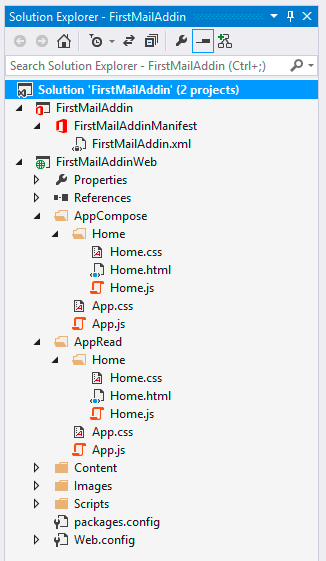

- First, the Outlook Add-in's manifest file is located in the Office Add-in project at the top of the **Solution Explorer** window. This is the file that tells the hosting Office application, Outlook in this case, about the Add-in and where the web application that implements the Add-in resides.
- Next, locate the **MessageRead.css**, **MessageRead.html** and **MessageRead.js** files. These files contain the code that implements read mode functionality of the Add-in. 
- The last few folders, **Content**, **Images** and **Scripts** contain the typical supporting files in any web application.

### Explore the Outlook Add-in manifest file

1. Open the **FirstOutlookAddinManifest** node within the **Solution Explorer** tool window.
- The **Basic Settings** section is where you can change the name, version, description, icon, provider and allowed domains for the Add-in.
- The **Requirements** element specifies the set of APIs available to the Add-in. The `Office.js` SDK documentation on MSDN will reference a specific requirement set version that a specific feature or capability was added to to the API. This is how your application can be developed to support functionality in specific Outlook clients on different platforms because not all clients on all platforms may immediately support the latest features .
- The **Permissions** element contains the required permissions for the Add-in.
- The **FormSettings** element is used by older Outlook clients, which only support schema 1.1 and not **VersionOverrides**. Using this element, developers define how the Add-in will appear in such clients. There are two parts - **ItemRead** and **ItemEdit**.  **ItemRead** is used to specify how the Add-in appears when the user reads messages and appointments. **ItemEdit** describes how the Add-in appears while the user is composing a reply, new message, new appointment or editing an appointment where they are the organizer.	  
-These settings are directly related to the activation rules in the Rule element. For example, if an Add-in specifies that it should appear on a message in compose mode, an ItemEdit form must be specified.	
- The **Rule** element is used to specify Activation rules, which can be used to activate an Add-in based on one or more conditions for the currently selected item.
- All elements defined inside **VersionOverrides** will override the same element in the other part of the manifest. This means that, whenever possible, Outlook will use what is in the **VersionOverrides** section to set up the Add-in. However, if the version of Outlook doesn't support a certain version of **VersionOverrides**, Outlook will ignore it and depend on the information in the rest of the manifest.	   
- The **VersionOverrides** element is the location of information for Add-in commands. For more information on this element, see [Define add-in commands in your Outlook add-in manifest](https://dev.office.com/docs/add-ins/outlook/manifests/define-add-in-commands.htm).

	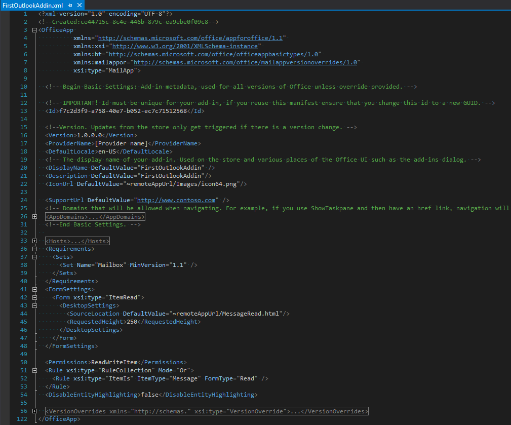

### Deploy the Outlook Add-in to the Exchange server
1. Click the **Start** button in the toolbar (or press **F5**) to start debugging the Add-in.
2. Visual Studio will prompt you to login using your Office 365 credentials. Enter your credentials, then click **Connect**.

	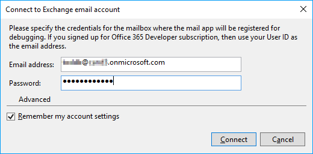

- Visual Studio will deploy the manifest file to the Exchange server, start the **FirstOutlookAddinWeb** web app on localhost, then start  Outlook Web Access in a web browser. 

3. Log into Outlook Web Access in the browser using your Office 365 credentials. 
4. Click on the gear icon in the upper right corner of the page and click on **Manage integrations**.
5. In the panel you just opened, select the **Add-Ins** tab at the top of the panel, then select **My Add-ins** in the left navigation pane.  You will see the **FirstOutlookAddin** Add-in.

	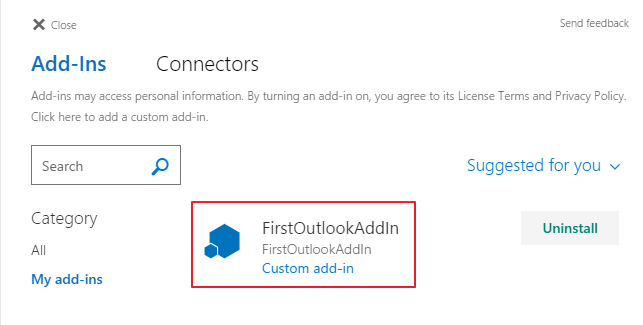

6. Click the **Close** button on the panel to close it.

### Test the Outlook Add-in in Outlook Web Access
1. In Outlook Web Access, click an email, you will see the icon for the **FirstOutlookAddin** Add-in in the **main actions** bar.
2. Click the **FirstOutlookAddin** icon.

	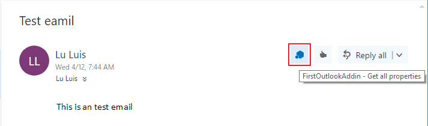

3. You will see the Add-in panel appear to the right of the email.

	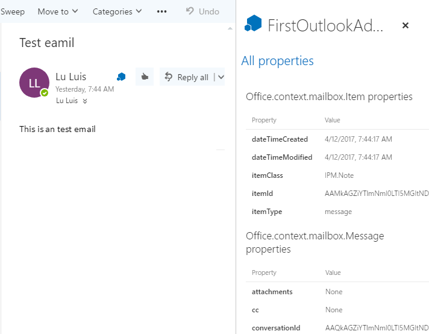

### Test the Outlook Add-in in the local Outlook desktop client
1. Open the Outlook desktop client.
2. Add the email account you used to deploy the Outlook add-in if it has not been added to Outlook desktop client.

	>**Note:** You could also use other accounts with mailboxes in the same organization with the account you used to deploy the Outlook Add-in.

2. Click an email in the mailbox for the account, then select the **Home** tab in the **Ribbon**.  You will see a **Display all properties** button in the **My Add-in Group**.
3. Click the **Display all properties** button.

	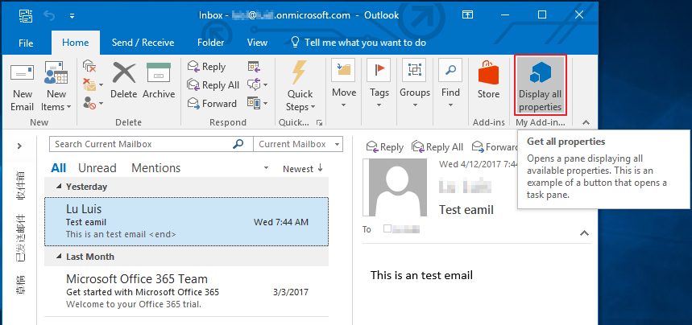

4. You will see the Add-in panel appear to the right of the email.

	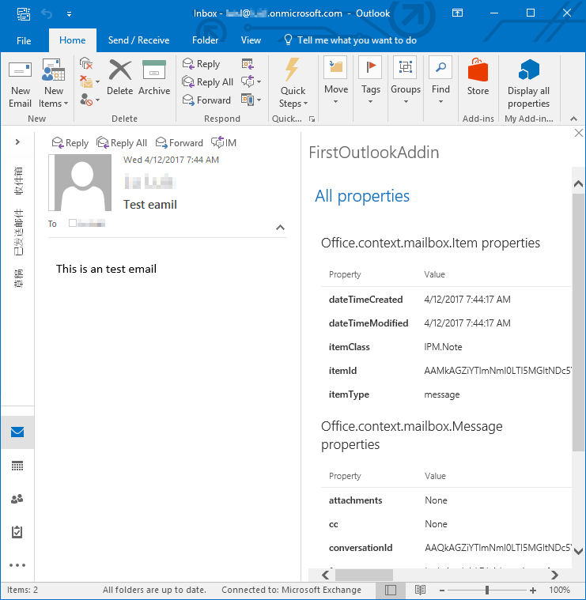

Congratulations! In this brief exercise you have successfully deployed and tested a simple Outlook Add-in within Office 365 Outlook Web Access and the Outlook Windows desktop client.

## Exercise 2: Create a Translator Outlook Add-in
In this exercise you will take the Add-in you built in the previous exercise and customize it to translate emails as you create them.

1. Ensure you have the solution from the previous exercise open in Visual Studio.

	> **Note:** If you skipped exercise 1, you can open the solution in from the [Completed Solutions](Completed%20Solutions) **Exercise01** folder and use it as your starting point.

### Signup for a developer account to Yandex
**Prerequisite:** To complete this exercise, you will need a free developer account from Yandex.

1. In a browser, navigate to https://tech.yandex.com/translate/
1. In the top-right corner, click the **Log In** link and go through the process of creating an account by following the prompts.
1. On the **Yandex Translate API** page, on the third step **Get a free API key**, click the link **API key**.
1. On the **Get API key** page, enter a description of the application you are creating and check the checkbox **I have read the User Agreement and agree to the terms of service**.
1. Click the **Get API key** button.
1. Copy the entire key into notepad for later use. The key will look something like the following string. 

	  ````
	  trnsl.1.1.[TIMESTAMP].[STRING].[STRING]
	  ````

### Create the Compose Form to Translate Selected Text
First, create the compose form to include a button to translate the selected text in the email.

1. Right click on the **FirstOutlookAddinWeb** project and select the **Add, New Item**.
2. In the **Add New Item** dialog, select the **HTML Page** template, enter **TranslateText.html** for the file name, then click the **Add** button.
3. Replace the contents of the **TranslateText.html** file with the following code:

	````html
	<!DOCTYPE html>
	<html>
	<head>
	    <meta charset="UTF-8" />
	    <meta http-equiv="X-UA-Compatible" content="IE=Edge" />
	    <title></title>
	    <script src="Scripts/jquery-1.9.1.js" type="text/javascript"></script>
	
	    <!-- For the JavaScript APIs for Office, go to https://aka.ms/officejs-overview to learn more. -->
	    <script src="https://appsforoffice.microsoft.com/lib/1/hosted/office.js" type="text/javascript"></script>
	
	    <!-- To enable offline debugging using a local reference to Office.js, use: -->
	    <!-- <script src="Scripts/Office/MicrosoftAjax.js" type="text/javascript"></script>  -->
	    <!-- <script src="Scripts/Office/1/office.js" type="text/javascript"></script>  -->
	
	    <script src="TranslateText.js" type="text/javascript"></script>
	
	    <!-- For the Office UI Fabric, go to https://aka.ms/office-ui-fabric to learn more. -->
	    <link rel="stylesheet" href="https://appsforoffice.microsoft.com/fabric/2.1.0/fabric.min.css" />
	    <link rel="stylesheet" href="https://appsforoffice.microsoft.com/fabric/2.1.0/fabric.components.min.css" />
	
	    <!-- To enable the offline use of Office UI Fabric, use: -->
	    <!-- link rel="stylesheet" href="Content/fabric.min.css" -->
	    <!-- link rel="stylesheet" href="Content/fabric.components.min.css" -->
	</head>
	<body>
	    <div id="content-header">
	        <h1>Welcome</h1>
	    </div>
	    <div id="content-main">
	        <button id="translateEmail">Translate English to Spanish</button>
	    </div>
	</body>
	</html>
	````

The compose form is now created.

### Code the Compose Form to Translate Selected Text
Now, add the code that implements the functionality for the compose form.

1. Add a **JavaScript File** named **TranslateText.js** to the **FirstOutlookAddinWeb** project.
2. Fill the **TranslateText.js** file with the following code:

	  ````javascript
	  (function () {
	    'use strict';
	
	    // yandex service endpoint & api key
	
	    // The initialize function must be run each time a new page is loaded
	    Office.initialize = function (reason) {
	      $(document).ready(function () {
			// main business logic
	      });
	    };
	
	  })();
	  ````

2. Add two variables to hold the API key and base endpoint for the **Yandex** service that will be used to translate the selected text, by adding the following code after the comment line `// yandex service endpoint & api key`:

	````javascript
	var yandexApiKey = 'trnsl.1.1.[TIMESTAMP].[STRING].[STRING]';
	var yandexEndpoint = 'https://translate.yandex.net/api/v1.5/tr.json/translate?lang=en-es&key=' + yandexApiKey;
	````

    > **Note:** Make sure you set the correct API key you obtained above in the **yandexApiKey** variable.*

3. Within the `Office.initialize` function, after the comment line `// main business logic`, add the following code to attach a click event handler for the button that you previously added.

	````javascript
	$("#translateEmail").click(translateText);    
	````
4. Now, create a function that will consume a string of text and create the query portion that will be added to the Yandex request.  Do this by adding the following code after the definition of the `Office.initialize` function:

	````javascript
	/**
	* Creates the query portion of the request to translate.
	* @param {string} textToTranslate - The string to translate into a different language.
	* @returns {string} URL escaped string that will be used in the HTTP request query.
	*/
	function getTranslationQuery(textToTranslate) {
	  // break up the lines to translate into an array.
	  var linesToTranslate = textToTranslate.split('\n');
	  var lines = [];
	
	  // loop through each line and remove all blank lines
	  for (var x = 0; x < linesToTranslate.length; x++) {
	    if (linesToTranslate[x] != "") {
	      lines.push(linesToTranslate[x]);
	    }
	  }
	  // create the query for the querystring request
	  var query = '&text=';
	  // loop through all lines to translate URL encoding each one
	  // the service allows multiple lines to be translated... each is submitted
	  //  on it's own 'text=' argument, so append them together
	  for (var y = 0; y < (lines.length - 1) ; y++) {
	    query += encodeURI(lines[y].replace(/ /g, "+")) + "&text=";
	  }
	  query += lines[lines.length - 1].replace(/ /g, "+");
	
	  return query;
	}
	````

	> **Note:** The comments in the code provide a detailed explanation of what the code is doing.

5. Add a new function to the file to translate the selected text.  To do this, add the following code after the `getTranslationQuery` function definition:

	````javascript
	/**
	* Translate the selected text.
	*/
	function translateText() {
	  // get the selected content from the email as plain text
	  Office.context.mailbox.item.getSelectedDataAsync(Office.CoercionType.Text, {}, function (selectedData) {
	    // extract the actual content from the selection & build the query
	    var translateQuery = getTranslationQuery(selectedData.value.data);
	
	    // create the HTTP translation request, appending the query to the end
	    var translationServiceEndpoint = yandexEndpoint + translateQuery;

	    // issue the translation request
	  });
	}
	````

	> **Note:** This code extracts the selected text from the compose form and creates a fully qualified request to the **Yandex** service.

6. Add the following code immediately after the comment line `// issue the translation request` in the function `translateText` you just created. This code does the following:
  - Issues an AJAX request to the Yandex service
  - Takes the response and concatenates the translated lines to a single line separated with HTML `<br>` tags
  - Uses the Office.js API to replace the selected text in the compose email with the translated text (from English to Spanish)

	````javascript
	$.ajax({
	  url: translationServiceEndpoint,
	  jsonp: 'callback',
	  dataType: 'jsonp',
	  success: function (response) {
	    var translatedText = response.text;
	    var escapedText = '';
	
	    // upon a successful response, join the lines together 
	    //  but separate each with <BR>
	    for (var i = 0; i < translatedText.length; i++) {
	      escapedText += translatedText[i] + "<br /><br />";
	    }
	
	    // write the escaped text back to the selected text in the email as HTML
	    Office.context.mailbox.item.setSelectedDataAsync(escapedText, { coercionType: Office.CoercionType.Html }, function(result) {
	      console.log(result);
	    });
	  }
	});
	````

### Update the Add-in Manifest
The functions `getSelectedDataAsync()` and `setSelectedDataAsync()` used in this Add-in, are not included in the original **Office.js** library the Add-in is configured to use. They were introduced in **Office.js** version 1.2. Therefore, you must configure the Add-in to use Office.js version 1.2.  To do this, follow the steps below.

1. Double-click the **FirstOutlookAddinManifest** element in the **FirstOutlookAddin** project to open the manifest file.
2. Change the **Mailbox Requirement Set** to **1.2**.

	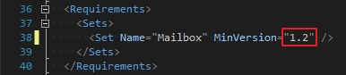

3. Inside the `FormSettings` element, add the following code after the `<Form xsi:type="ItemRead">` element:

	````xml
    <Form xsi:type="ItemEdit">
      <DesktopSettings>
        <SourceLocation DefaultValue="~remoteAppUrl/TranslateText.html"/>
      </DesktopSettings>
    </Form>
	````

	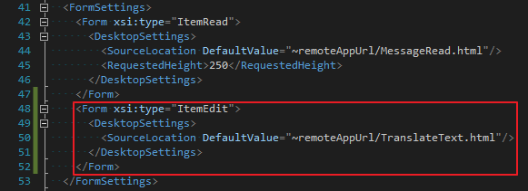

4. Inside the `VersionOverrides` element, add the following code after the `<ExtensionPoint xsi:type="MessageReadCommandSurface">` element:

	````xml
	<!-- Message Compose -->
	<ExtensionPoint xsi:type="MessageComposeCommandSurface">
	  <OfficeTab id="TabDefault">
	    <Group id="msgComposeGroup">
	      <Label resid="groupLabel" />
	      <!-- Function (UI-less) button -->
	      <Control xsi:type="Button" id="msgComposeOpenPaneButton">
	        <Label resid="paneTranslateButtonLabel" />
	        <Supertip>
	          <Title resid="paneTranslateSuperTipTitle" />
	          <Description resid="paneTranslateSuperTipDescription" />
	        </Supertip>
	        <Icon>
	          <bt:Image size="16" resid="icon16" />
	          <bt:Image size="32" resid="icon32" />
	          <bt:Image size="80" resid="icon80" />
	        </Icon>
	        <Action xsi:type="ShowTaskpane">
	          <SourceLocation resid="messageComposeTaskPaneUrl" />
	        </Action>
	      </Control>
	      <!-- Go to http://aka.ms/ButtonCommands to learn how to add more Controls: ExecuteFunction and Menu -->
	      <!-- Menu (dropdown) button -->
	    </Group>
	  </OfficeTab>
	</ExtensionPoint>
	````

	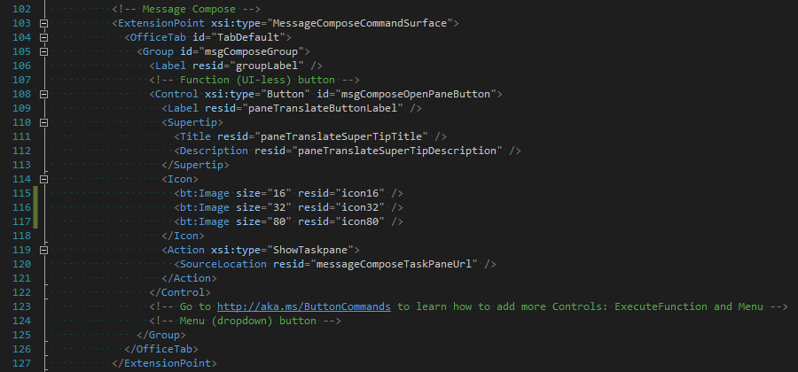

5. Inside the `VersionOverrides` element, append the following code to `bt:Urls` element inside the `Resources` element:

	````xml
	<bt:Url id="messageComposeTaskPaneUrl" DefaultValue="~remoteAppUrl/TranslateText.html"/>
	````

	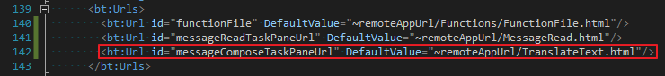

6. Inside the `VersionOverrides` element, append the following code to `bt:ShortStrings` element inside the `Resources` element:

	````xml
    <bt:String id="paneTranslateButtonLabel" DefaultValue="Translate selected text"/>
    <bt:String id="paneTranslateSuperTipTitle" DefaultValue="Translate selected text"/>
	````

	

7. Inside the `VersionOverrides` element, append the following code to `bt:LongStrings` element inside the `Resources` element:

	````xml
	<bt:String id="paneTranslateSuperTipDescription" DefaultValue="Opens a pane that helps you translate the selected text from English to Spanish."/>
	````

	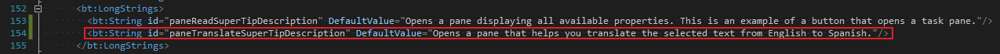

### Test the Compose Form
1. Press **F5** to build and launch the browser (or Outlook client) to test the compose form.
2. Create a new email and add some text to the body of the email. 
3. Open the Add-in using the same techniques demonstrated in the last exercise (depending on which Outlook client you are testing the Add-in with).
4. Select the text you added to the email and click the **Translate English to Spanish** button. Watch the text you selected in the email be replaced with the Spanish translation.

	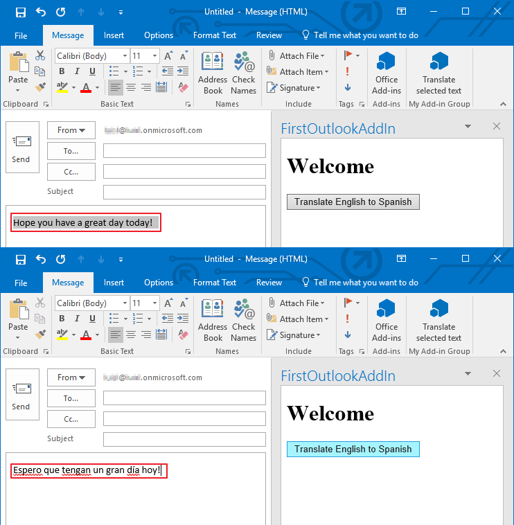

Congratulations! You have created an Outlook Add-in for a Mail Compose Form.