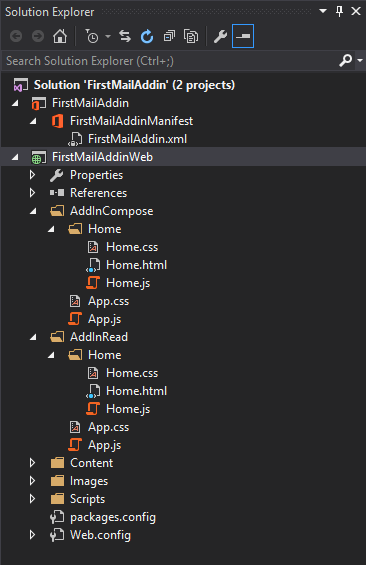
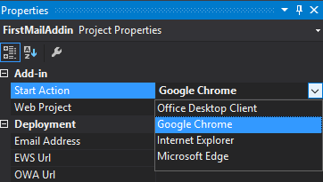

# Deep Dive for Office Outlook Add-ins
In this lab, create Office Add-ins for Outlook. These Outlook Add-ins will be tested in both the Office 365 Outlook Web App as well as the Windows Outlook 2016 desktop client.

## Prerequisites
1. You must have an Office 365 tenant and Microsoft Azure subscription to complete this lab. If you do not have one, the lab for **O3651-7 Setting up your Developer environment in Office 365** shows you how to obtain a trial. You must also have access to an Exchange inbox within an Office 365 developer tenancy.
1. You must have the Office 365 API Tools version 1.4.50428.2 installed in Visual Studio 2013 & Update 4 installed.
1. In order to complete exercise 2 & 3, you must have Office 2016 Preview installed which you can obtain from here: https://products.office.com/en-us/office-2016-preview

## Exercise 1: Create Outlook Add-in & Deploy to Outlook Web App & Outlook Desktop
In this exercise, you will create a new Outlook Add-in for reading and creating mail that you will deploy to both the Outlook Web App in Office 365 and Outlook Desktop client on Windows.

1. Launch **Visual Studio 2013** as administrator. 
1. In Visual Studio select **File/New/Project**.
1. In the **New Project** dialog, select **Templates, Visual C#, Office/SharePoint** and click **App for Office**. Name the new project **FirstMailAddin** and then click **OK**.  
1. On the **Create app for Office / Choose the app type** dialog, select **Mail** and click **Next**.
1. On the **Create app for Office / Choose where you want the app to appear**, check only the two options for **Email message** and click **Finish**.

  

1. Take a moment to examine the project structure:

  

  1. First, the Outlook Add-in's manifest file is located in the Office Add-in project at the top of the **Solution Explorer** window. This is the file that will tell the hosting Office client application, Outlook, about the Add-in and where the web application that implements the Add-in resides.
  1. Next locate the **AppCompose** and **AppRead** folders. These contain the client-side applications that host the two different experiences for the Add-in you created. 

    The first one, **AppComponse**, will host the web application for the Add-in experience when creating an email.

    The second one, **AppRead**, will host the web application for the Add-in experience when reading an email.

  1. The last few folders, **Content**, **Images** and **Scripts** are all the typical supporting files in any web application.

1. Initially the `Office.js` file used in Office Add-ins was distributed with the version of the file in the folder where it resided.

  Open the **AppComponse\Home.html** file and jump to line 10 which is a `<script>` reference to the `Office.js` file.

  Instead of changing the URL, the new direction is to simply host the most current version of the `Office.js` file in a common folder. The developer tools template does not reflect this, so for now, edit the URL to change the `1.1` in the path to just `1` as follows:

    ````html
    <script src="https://appsforoffice.microsoft.com/lib/1/hosted/office.js" 
            type="text/javascript"></script>
    ````

1. Repeat the same script reference change in the **AppRead\Home.html** file.
1. Explore the Outlook Add-in manifest file.
  1. Open the **FirstMailAddinManifest** node within the **Solution Explorer** tool window.
  1. The first tab, **General** is where you can change the name, version, description and provider of the Add-in.

    In addition you can also set the permissions the Add-in requires.

    Notice the last option for the **Mailbox requirement set**. The `Office.js` SDK documentation on MSDN will reference a specific requirement set version that a specific feature or capability was added to to the API. This is how your application can be developed to support functionality in specific Outlook clients on different platforms as not all clients on all platforms may support the latest features immediately.

  1. Select the **Read Form** tab. This is where you can make customizations to the Add-in's read form.

    The **Activation** section allows you to specify under which conditions the Add-in will be available. By default it already has the *Item is a message* rule entered.

    

    The other tabs are used to configure other forms and remote domains that can be accessed within the Add-in.

1. Now deploy the default Outlook add-in to the web client:
  1. Select the **FirstMailAddin** project within the **Solution Explorer** tool window.
  1. Within the **Properties** window there's a **Start Action** selector. Select one of the browser options and press **F5** to start the project.

    

  1. Visual Studio will prompt you to login using your Office 365 credentials. Do this and click **Connect**.
  1. Check to the **AppRead** experience by selecting an email. The add-in will appear just below the header of the email and if you click on it, it will expand:

    

  1. Now create a new email to see the **AppCompose** experience when creating an email.
  1. Add-ins on the compose form are shown in a task pane. Click the **Apps** button to get the task pane to appear.

    

  1. Click the Add-in **FirstMailAdd** and the task pane will refresh with the Add-in. Click a few buttons to see how it works.

    

  1. Go back to Visual Studio and stop debugging.

1. Now deploy the Outlook Add-in to the local Outlook client:
  1. Select the **FirstMailAddin** project within the **Solution Explorer** tool window.
  1. Within the **Properties** window set the **Start Action** selector to **Office Desktop Client** and press **F5** to start the project.
  1. Visual Studio will launch the Outlook desktop client.
  1. Check to the **AppRead** experience by selecting an email. The add-in will appear just below the header of the email and if you click on it, it will expand:

    

  1. Now create a new email to see the **AppCompose** experience when creating an email.
  1. Add-ins on the compose form are shown in a task pane. Click the **Office Add-ins** button to get the **Office Add-ins** dialog to appear. 
    
    Select the **FirstMailAddin** and click the **Start** button to launch the Add-in.

    

  1. The Add-in will launch in a task pane in the email:

    

  1. Go back to Visual Studio and stop debugging.

Congratulations! In this brief exercise you have successfully deployed and tested a simple Outlook Add-in within both the Office 365 Outlook Web App and the Outlook Windows desktop client.

## Exercise 2: Create a Translator Outlook Add-in
In this exercise you will take the Add-in you built in the previous exercise and customize it to translate emails as you create them.

1. Ensure you have the solution from the previous exercise open in Visual Studio.

  > If you skipped exercise 1, you can open the solution in from the [Completed Solutions](Completed Solutions) **Exercise01** folder as your starting point.

### Signup for a developer account to Yandex
To complete this exercise, you will need a free developer account from Yandex.

1. In a browser, navigate to https://tech.yandex.com/translate/
1. In the top-right corner, click the **Log In** link and go through the process of creating an account by following the straightforward prompts.
1. On the **Yandex Translate API** page, on the third step **Get an API key**, click the link **API key**.
1. On the **Get API key** page, enter a description of the application you are creating and check the box to indicate you have *read the User Agreement and agree to the terms of service*, finally clicking the **Get API key** button.
1. Copy the entire key into notepad for later use. The key will look something like the following string. 

  ````
  trnsl.1.1.[TIMESTAMP].[STRING].[STRING]
  ````

### Configure the Compose Form to Translate Selected Text
First, update the compose form to include a button to translate the selected text in the email.

1. Open the file **AppCompose/Home/Home.html**.
1. Scroll to the bottom and locate the `<div>` with an id of **content-main**.
1. Replace the contents of the `<div>` to include only a single button, like the following code:

  ````html
  <div id="content-main">
    <div class="padding">
      <button id="translateEmail">Translate English to Spanish</button>
    </div>
  </div>
  ````

### Code the Compose Form to Translate Selected Text
With the form updated, now update the code that will implement the business logic.

1. Open the file **AppCompose/Home/Home.js**.
1. Clean out all the default code so the file is left with just the remaining code:

  ````javascript
  (function () {
    'use strict';

    // The initialize function must be run each time a new page is loaded
    Office.initialize = function (reason) {
      $(document).ready(function () {
        app.initialize();
      });
    };

  })();
  ````

1. Now, add two variables to hold the API key and base endpoint for the **Yandex** service that will be used to translate the selected text. 

  *Make sure you set the correct API key you obtained above in the first variable.*

  ````javascript
  // yandex service endpoint & api key
  var yandexApiKey = 'trnsl.1.1.[TIMESTAMP].[STRING].[STRING]';
  var yandexEndpoint = 'https://translate.yandex.net/api/v1.5/tr.json/translate?lang=en-es&key=' + yandexApiKey;
  ````

1. Now, within the `Office.initialize` function call, after the line `app.initialize()`, add the following code to attach a click event handler when the button that you added previously is clicked.
1. Now, create a function that will take a string of text and create the query portion that will be added to the Yandex request:

  > You can ignore the comments... they are added just for detailed explanation of what the code is doing.

  ````javascript
  /**
   * Creates the query portion of the request to translate.
   * @param {string} textToTranslate - The string to translate into a different language.
   * @returns {string} URL escaped string that will be used in the HTTP request query.
   */
  function getTranslationQuery(textToTranslate) {
    // break up the lines to translate into an array.
    var linesToTranslate = textToTranslate.split('\n');
    var lines = [];

    // loop through each line and remove all blank lines
    for (var x = 0; x < linesToTranslate.length; x++) {
      if (linesToTranslate[x] != "") {
        lines.push(linesToTranslate[x]);
      }
    }
    // create the query for the querystring request
    var query = '&text=';
    // loop through all lines to translate URL encoding each one
    // the service allows multiple lines to be translated... each is submitted
    //  on it's own 'text=' argument, so append them together
    for (var y = 0; y < (lines.length - 1) ; y++) {
      query += encodeURI(lines[y].replace(/ /g, "+")) + "&text=";
    }
    query += lines[lines.length - 1].replace(/ /g, "+");

    return query;
  }
  ````

1. Add a new function to the file to translate the selected text:

  ````javascript
  /**
   * Translate the selected text.
   */
  function translateText() {
    // get the selected content from the email as plain text
    Office.context.mailbox.item.getSelectedDataAsync(Office.CoercionType.Text, {}, function (selectedData) {
      // extract the actual content from the selection & build the query
      var translateQuery = getTranslationQuery(selectedData.value.data);

      // create the HTTP translation request, appending the query to the end
      var translationServiceEndpoint = yandexEndpoint + translateQuery;
    }
  }
  ````

    This will extract the selected text from the compose form and create a fully qualified request to the **Yandex** service.

1. Add the following code immediately after endpoint variable you just created. This will do the following:
  - issue an AJAX request to the Yandex service
  - take the response and concatenate the translated lines to a single line separated with HTML `<br>` tags
  - use the Office.js API to replace the selected text in the compose email with the translated text (from English to Spanish)

  ````javascript
  // issue the translation request
  $.ajax({
    url: translationServiceEndpoint,
    jsonp: 'callback',
    dataType: 'jsonp',
    success: function (response) {
      var translatedText = response.text;
      var escapedText = '';

      // upon a successful response, join the lines together 
      //  but separate each with <BR>
      for (var i = 0; i < translatedText.length; i++) {
        escapedText += translatedText[i] + "<br /><br />";
      }

      // write the escaped text back to the selected text in the email as HTML
      Office.context.mailbox.item.setSelectedDataAsync(escapedText, { coercionType: Office.CoercionType.Html }, function(result) {
        console.log(result);
      });
    }
  });
  ````

### Update the Add-in Manifest
The functions used in this add-in, `getSelectedDataAsync()` & `setSelectedDataAsync()`, are not included in the original **Office.js** library add-ins are configured to use. 

1. Double-click the **FirstMailAddinManifest** element in the **FirstMailAddin** to open the add-in's manifest designer.
1. On the **General** tab, change the **Mailbox Requirement Set** to **1.2** from it's current value.

  > The two functions `setSelectedDataAsync()` & `getSelectedDataAsync()` were introduced in **Office.js** version 1.2.

  

### Test the Compose Form
1. Press **F5** to build and launch the browser (or Outlook client) to test the compose form.
1. Using the same process as the last exercise, create a new email and add some text to the body of the email. 
1. Open the add-in using the same techniques demonstrated in the last exercise depending on which Outlook client you are testing the app in.
1. Select the text you added to the email and click the **Translate English to Spanish** button. You should notice that the text you have selected in the email has been replaced with the Spanish translation.

Congratulations! You have created an Outlook Add-in for a Mail Compose Form.


