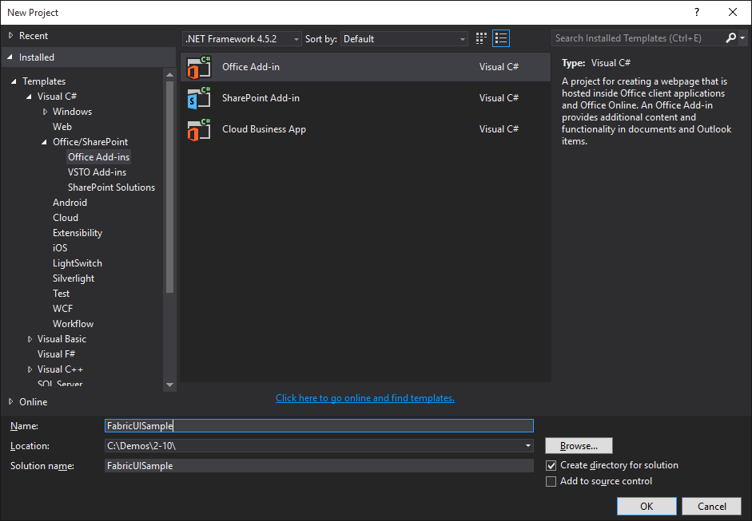
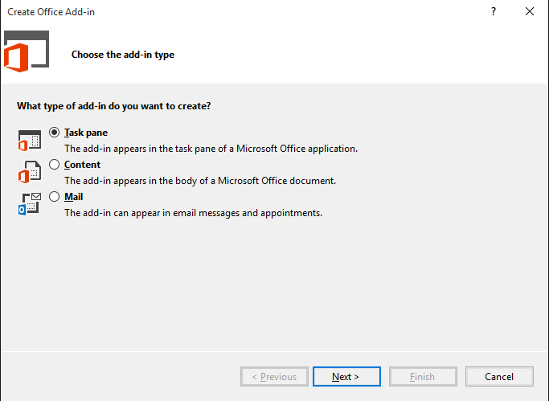
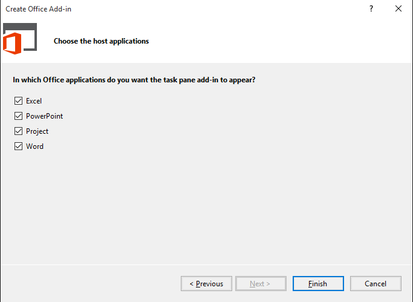
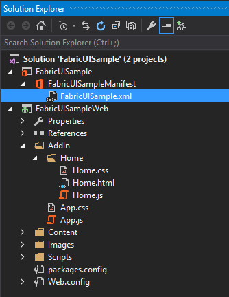
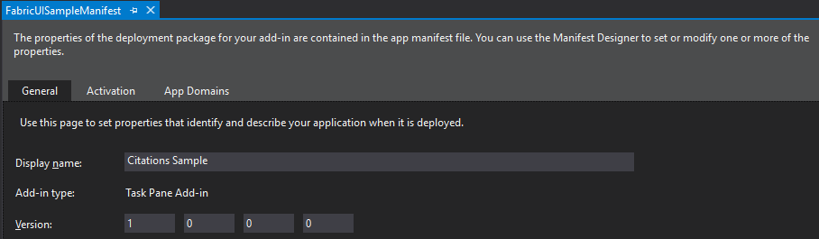
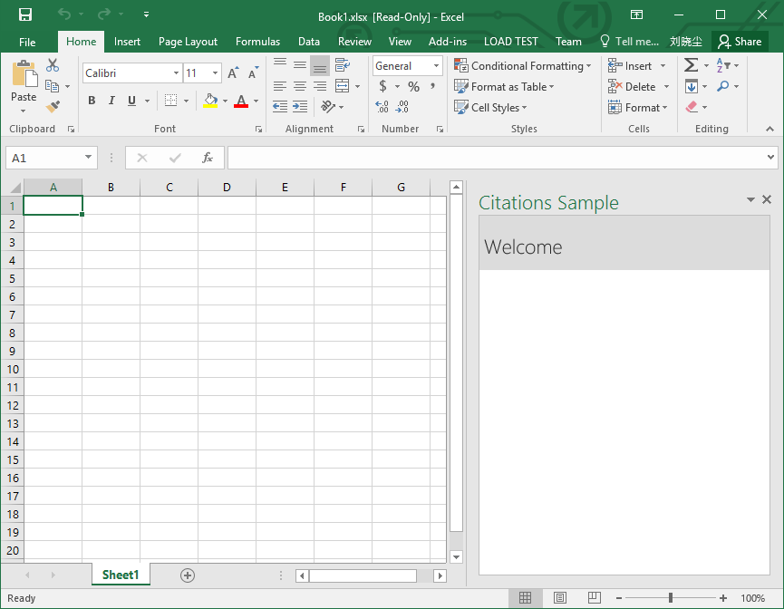
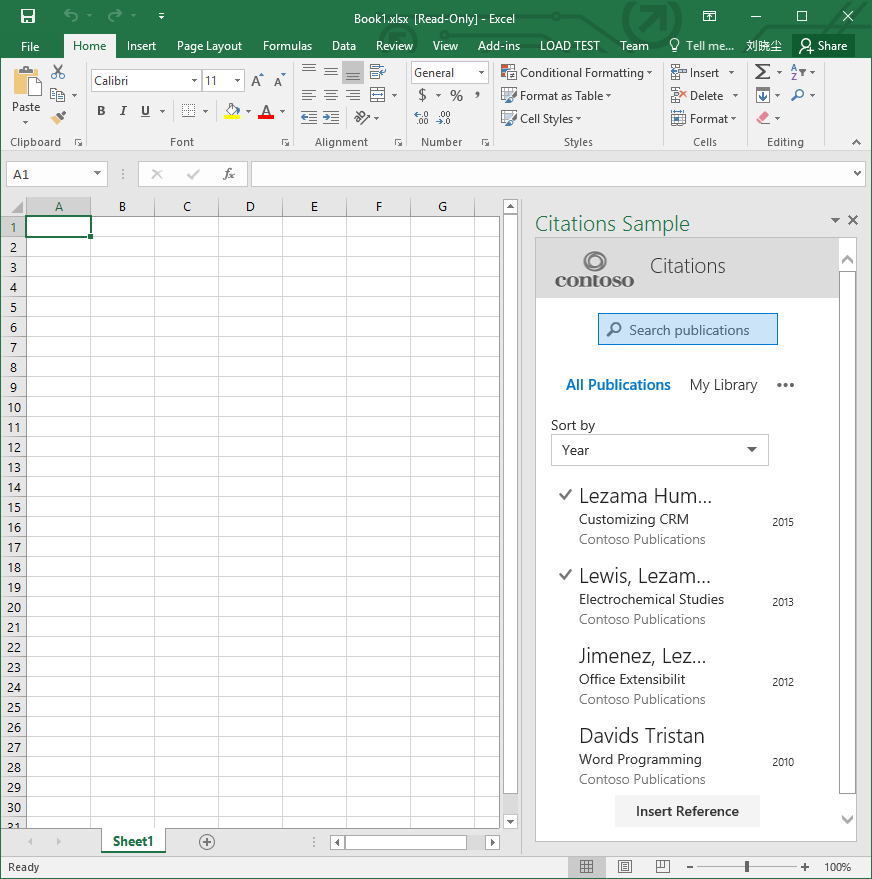

# Apply Office UI Fabric to Office Add-ins  
In this lab you will get hands-on experience developing an Office Add-in with the Office UI Fabric.

**Prerequisites:** Before you can start this lab, you must have installed Office 2013 with Service Pack 1 or above and Visual Studio 2015 on your development workstation.  You will also need the [Office Developer Tools Update 1 for Visual Studio 2015](https://www.visualstudio.com/features/office-tools-vs).

## Exercise 1: Creating Office Add-in with Office UI Fabric
*In this exercise you will create a new Office Add-in project in Visual Studio and add q reference to the Office UI Fabric so that you can begin to write, test and debug Office Add-ins with that use the Office UI Fabric. *

1. Launch Visual Studio 2015 as an administrator.
1. From the **File** menu select the **New Project** command. When the **New Project** dialog appears, select the **Office Add-in** project template from the **Office/SharePoint** template folder as shown below. Name the new project **FabricUISample** and click **OK** to create the new project.

	
    > NOTE: Make sure you enter the exact same name for the Visual Studio Project that is specified in these lab instructions.  The Visual Studio Project name becomes part of the namespace in the code.  The code inside these instructions depends on the namespace matching the Visual Studio Project name specified in these instructions.  If you use a different project name the code will not compile unless you adjust all the namespaces to match the Visual Studio Project name you enter when you create the project.

1. When you create a new Office Add-in project, Visual Studio prompts you with the **Choose the add-in type** page in the **Create Office Add-in** dialog. This is the point where you select the type of Office Add-in you want to create. Leave the default setting with the radio button titled **Task pane** and select **Next** to continue.

	

1. On the **Choose the host applications** page in the **Create Office Add-in** dialog, there is nothing to change.  Simply click **Finish** to create the new Visual Studio solution. 

	

1. Take a look at the structure of the new Visual Studio solution once it has been created. At a high-level, the new solution has been created using two Visual Studio projects named **FabricUISample** and **FabricUISampleWeb**. You should also observe that the top project contains a top-level manifest for the app named **FabricUISampleManifest** which contains a single file named **FabricUISample.xml**.

	

1. In the Solution Explorer, double-click on the node named **FabricUISampleManifest** to open the app manifest file in the Visual Studio designer. Update the **Display Name** settings in the Add-in manifest from **FabricUISample** to **Citations Sample**.

	

1. Save and close **FabricUISampleManifest**.
1. Clean up the existing code and styles.
  1. Open the **Home.html** file under the **AddIn/Home** folder in the **FabricUISampleWeb** project. 
     1. Remove the following code to remove the references to App.js and App.css
     
       ````html
       <link href="../App.css" rel="stylesheet" type="text/css" />
       <script src="../App.js" type="text/javascript"></script>
       ```` 
       
     1. Replace the body element with the following code.

        ````html
        <body>
            <div id="header">
                <h1>Welcome</h1>
            </div>
            <div id="content">
                <!-- search box -->
                <div id="navigation">
                </div>
                <!-- filter -->
                <!-- list -->
                <!-- button -->
            </div>
        </body>
        ````
    
  1. Open the **Home.js** file under the **AddIn/Home** folder in the **FabricUISampleWeb** project. Remove the `function getDataFromSelection()` definition and update the `Office.initialize` function as follows 
  
    ````javascript
    Office.initialize = function (reason) {
        $(document).ready(function () {
        });
    };
    ````
  
  1. Open the **Home.css** file under the **AddIn/Home** folder in the **FabricUISampleWeb** project. Replace the entire contents of the file with the following code to clean up the global style.

    ````css
    html, body {
        margin: 0;
        padding: 0;
        overflow-x: hidden;
    }

    #content {
        top: 80px;
        left: 0;
        right: 0;
        bottom: 0;
        overflow: auto;
        padding: 15px;
    }

    #header {
        top: 0;
        left: 0;
        width: 100%;
        height: 50px; /* Fixed header height */
        padding: 5px;
        background-color: rgb(220,220,220);
        
    }

    #navigation {
        padding: 15px;
    }
    ````
    
1. Download and add the **Office UI Fabric** to the project.
   1. [Download](https://github.com/OfficeDev/Office-UI-Fabric/releases/latest) the latest release of the Office UI Fabric. 

	> This sample was created with the office-ui-fabric-2.0.1.zip file.

   2. Extract the zip file to the root directory in the **FabricUISampleWeb** project.
   4. In Visual Studio select the **FabricUISampleWeb** project.
   5. Click the **Show All Files** button.

		

   6. For each folder in the list below, right-click the folder in the Solution Explorer and select **Include In Project**.
   
	   - components
	   - css
	   - js
	   - samples
	   - sass


1. Now in Visual Studio, press the **F5** key to begin a debugging session. An Excel file with a task pane Add-in opens. Click the stop button in Visual Studio to stop the debugging session.

    

##  Exercise 2: Apply Office UI Fabric to Office Add-in
*In this Exercise, we will add web components and apply Office UI Fabric styles to the Office Add-in*.

1. Add the Office UI Fabric JavaScript and CSS references
  1. Open the **Home.html** file under the **AddIn/Home** folder in the **FabricUISampleWeb** project.
  1. Add the following Office UI Fabric CSS links after the `office.js` reference in the `<head>` element.
      
      ````html
        <link rel="stylesheet" href="https://appsforoffice.microsoft.com/fabric/1.0/fabric.min.css">
        <link rel="stylesheet" href="https://appsforoffice.microsoft.com/fabric/1.0/fabric.components.min.css">
      ````

1. To set a global font style, in the **Home.html** file, add a Fabric font style to the `<body>` element as follows.
   
 ````html
   <body class="ms-font-m">
 ````  

1. Add an Office UI Fabric responsive grid 
  1. Right-click the **Images** folder and select **Add -> Existing Item...**
  1. Select the file [contoso_log.png](Starter Files/contoso_logo.png) in the [\\\O3652\O3652-13 Office Add-ins with Office UI Fabric\Starter Files](Starter Files) folder, click the **Add** button to add the image to the **FabricUISampleWeb** project. 
  1. Open the **Home.html** file under the **AddIn/Home** folder in the **FabricUISampleWeb** project, replace `<h1>Welcome</h1>` with the following code.
  
  ````html
    <div class="ms-Grid">
        <div class="ms-Grid-row">
            <div class="ms-Grid-col ms-u-sm4 ms-u-md4 ms-u-lg4"></div>
            <div class="ms-Grid-col ms-u-sm8 ms-u-md8 ms-u-lg8"> <div class="ms-font-xl" style="line-height:2em">Citations</div></div>
        </div>
    </div>  
  ````

1. Add a SearchBox web component   
  1. Open the **Home.html** file under the **AddIn/Home** folder in the **FabricUISampleWeb** project, add the following code to reference the script for the search box web component after the Office UI Fabric components CSS links (`fabric.components.min.css`) in the `<head>` element.
  
    ````html
      <script src="../../samples/components/SearchBox/Jquery.SearchBox.js"></script>
    ````

  1. In the **Home.html** file, add following code under `<!-- search box -->`
  
    ````html
      <center>
        <div class="ms-SearchBox">
            <label class="ms-SearchBox-label"><i class="ms-SearchBox-icon ms-Icon ms-Icon--search"></i>Search publications</label>
            <input class="ms-SearchBox-field">
            <button class="ms-SearchBox-closeButton"><i class="ms-Icon ms-Icon--x"></i></button>
        </div>
      </center>  
    ````
  
  1. Open the **Home.js** file under the **AddIn/Home** folder in the **FabricUISampleWeb** project, add the  Searchbox web component initialization to the Office.initialize function, as follows.
  
    ````javascript
        Office.initialize = function (reason) {
            $(document).ready(function () {
            });

            $(".ms-SearchBox").SearchBox();
        };
    ````

1. Add a Pivot web component
  1. Open the **Home.html** file under the **AddIn/Home** folder in the **FabricUISampleWeb** project, add the following code to reference the script for the Pivot web component after the search box script reference in the `<head>` element.
  
    ````html
      <script src="../../samples/components/Pivot/Jquery.Pivot.js"></script>
    ````
    
  1. In the **Home.html** file, add the following code to the `<div id="navigation">` element.
    
    ````html
      <ul class="ms-Pivot">
          <li class="ms-Pivot-link is-selected">All Publications</li>
          <li class="ms-Pivot-link">My Library</li>
          <li class="ms-Pivot-link ms-Pivot-link--overflow">
            <i class="ms-Pivot-ellipsis ms-Icon ms-Icon--ellipsis"></i>
          </li>
      </ul>
    ````
    
  1. Open the **Home.js** file under the **AddIn/Home** folder in the **FabricUISampleWeb** project, add the Pivot web component initialization to the Office.initialize function after `$(".ms-SearchBox").SearchBox();`.
  
    ````javascript
      $(".ms-Pivot").Pivot();
    ````
  
1. Add a DropDown web component
  1. Open the **Home.html** file under the **AddIn/Home** folder in the **FabricUISampleWeb** project, add the following code to reference the script for the Dropdown web component after Pivot the script reference in the `<head>` element.
  
    ````html
      <script src="../../samples/components/Dropdown/Jquery.Dropdown.js"></script>
    ````
    
  1. In **Home.html** file, add the following code after `<!-- filter -->`.
    
    ````html
      <div>
          <div class="ms-font-m">Sort by</div>
          <div class="ms-Dropdown" tabindex="0" style="width:80%">
            <i class="ms-Dropdown-caretDown ms-Icon ms-Icon--caretDown"></i>
            <select class="ms-Dropdown-select" >
              <option>Year</option>
              <option>Publisher</option>
              <option>Author</option>
            </select>
          </div>
      </div>
    ````
    
  1. Open the **Home.js** file under the **AddIn/Home** folder in the **FabricUISampleWeb** project, add the Dropdown web component initialization to the Office.initialize function after `$(".ms-Pivot").Pivot();`.
  
    ````javascript
      $(".ms-Dropdown").Dropdown();
    ````

1. Add List and ListItem web components
  1. Open the **Home.html** file under the **AddIn/Home** folder in the **FabricUISampleWeb** project, add the following code to reference the script for the ListItem web component after the Dropdown script reference in the `<head>` element.
  
    ````html
      <script src="../../samples/components/ListItem/Jquery.ListItem.js"></script>
    ````
    
  1. In the **Home.html** file, add following the code after `<!-- list -->`.
    
    ````html
      <ul class="ms-List">
          <div class="ms-ListItem is-selected is-selectable">
            <span class="ms-ListItem-primaryText">Lezama Humberto</span>
            <span class="ms-ListItem-secondaryText">Customizing CRM</span>
            <span class="ms-ListItem-tertiaryText">Contoso Publications</span>
            <span class="ms-ListItem-metaText">2015</span>
            <div class="ms-ListItem-selectionTarget js-toggleSelection"></div>
            <div class="ms-ListItem-actions">
            </div>
          </div>
          
          <div class="ms-ListItem is-selected is-selectable">
            <span class="ms-ListItem-primaryText">Lewis, Lezama et al</span>
            <span class="ms-ListItem-secondaryText">Electrochemical Studies</span>
            <span class="ms-ListItem-tertiaryText">Contoso Publications</span>
            <span class="ms-ListItem-metaText">2013</span>
            <div class="ms-ListItem-selectionTarget js-toggleSelection"></div>
            <div class="ms-ListItem-actions">
            </div>
          </div>
          
          <div class="ms-ListItem is-selectable">
            <span class="ms-ListItem-primaryText">Jimenez, Lezama et al</span>
            <span class="ms-ListItem-secondaryText">Office Extensibilit</span>
            <span class="ms-ListItem-tertiaryText">Contoso Publications</span>
            <span class="ms-ListItem-metaText">2012</span>
            <div class="ms-ListItem-selectionTarget js-toggleSelection"></div>
            <div class="ms-ListItem-actions">
            </div>
          </div>
                    
          <div class="ms-ListItem is-selectable">
            <span class="ms-ListItem-primaryText">Davids Tristan</span>
            <span class="ms-ListItem-secondaryText">Word Programming</span>
            <span class="ms-ListItem-tertiaryText">Contoso Publications</span>
            <span class="ms-ListItem-metaText">2010</span>
            <div class="ms-ListItem-selectionTarget js-toggleSelection"></div>
            <div class="ms-ListItem-actions">
            </div>
          </div>        
      </ul>
    ````
    
  1. Open the **Home.js** file under the **AddIn/Home** folder in the **FabricUISampleWeb** project, add the ListItem web component initialization to the Office.initialize function after `$(".ms-Dropdown").Dropdown();`.
  
    ````javascript
      $(".ms-ListItem").ListItem();
    ````

1. Add a Button web component
  1. Open the **Home.html** file under the **AddIn/Home** folder in the **FabricUISampleWeb** project, add the following code after `<!-- button -->`.
    
    ````html
      <center>
          <button class="ms-Button" id="set-data">
              <span class="ms-Button-icon"><i class="ms-Icon ms-Icon--plus"></i></span>
              <span class="ms-Button-label">Insert Reference</span>
              <span class="ms-Button-description">Insert Reference into document</span>
          </button>
      </center>
      
      <div>
          <p id="display-data"></p>
      </div>
    ````
    
  1. Open the **Home.js** file under the **AddIn/Home** folder in the **FabricUISampleWeb** project, add the `function writeText()` after the Office.initialize function.
  
    ````javascript
        function writeText() {
            Office.context.document.setSelectedDataAsync("Citation goes here",
                function (asyncResult) {
                    var error = asyncResult.error;
                    if (asyncResult.status === "failed"){
                        $('#display-data').text("Failure" + error.message);
                    }
                    else
                    {
                        $('#display-data').text("Done");
                    }
                });
        }
    ````
    
  1. In the **Home.js** file, register the click event for the `<button class="ms-Button" id="set-data">` element.  Do this in the Office.initialize function, as follows.
  
    ````javascript
        Office.initialize = function (reason) {
            $(document).ready(function () {
                $('#set-data').click(writeText);
            });

            $(".ms-SearchBox").SearchBox();
            $(".ms-Pivot").Pivot();
            $(".ms-Dropdown").Dropdown();
            $(".ms-ListItem").ListItem();
        };
    ```` 

1. Now in Visual Studio, press the **F5** key to begin a debugging session. An Excel file with a task pane Add-in opens. The Add-in uses the Office UI Fabric.  Take some time to explore the components. 

    
    
Congratulations! You've now written an Office Add-in that uses the Office UI Fabric.


