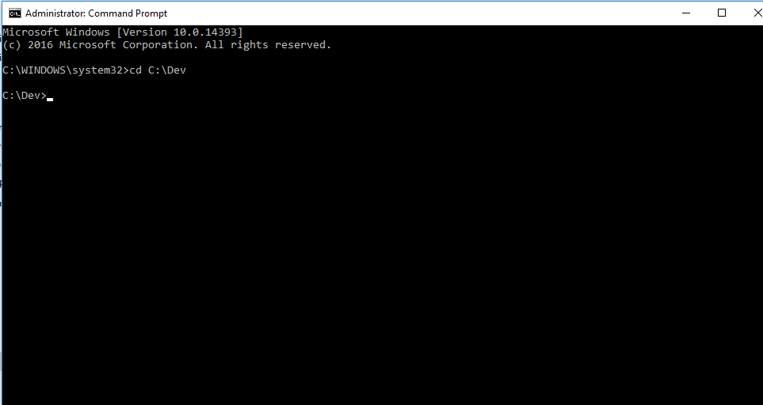
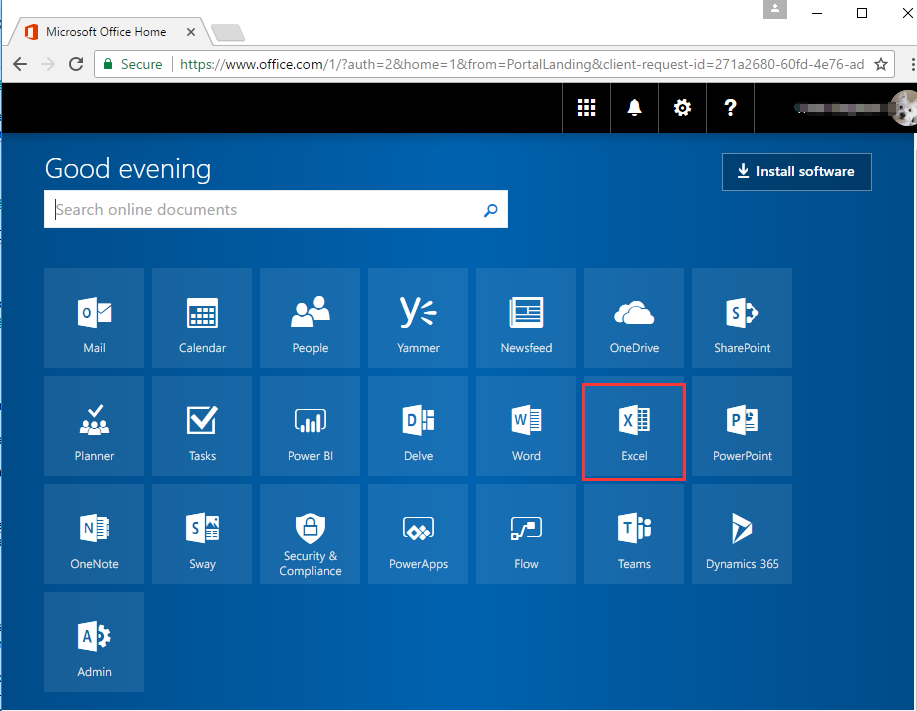
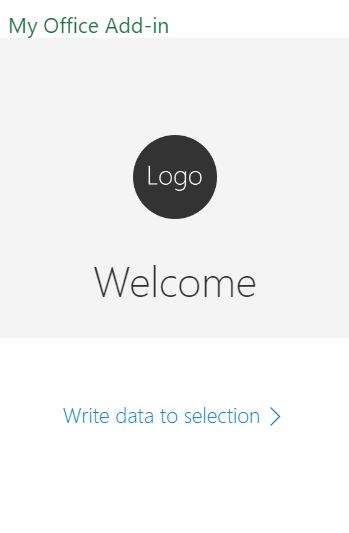

# Create and Test an Office Add-in in Excel Online
This lab will teach you how to create an Add-in using only the shell and a browser. Learn how to create an Add-in from scratch using command-line tools and test it using Office Online.

**Prerequisites**
1. Install [NodeJS](https://nodejs.org/en/) Long Term Support (LTS) version.
- If you have NodeJS already installed please check you have the latest version using node -v. It should return the current [LTS version](https://nodejs.org/en/download/).
- If you are using a Mac, it is recommended you use [homebrew](http://brew.sh/) to install and manage NodeJS.

After installing node, make sure npm is up to date by running following command:

````shell
npm install -g npm
````

In case of Linux previous command might result in 'permission denied' message, so it should be instead executed as

````shell
sudo npm install -g npm
````

2. You must have VS Code [or your favorite code editor] installed.

## Exercise 1: Create an Add-in with the Yeoman generator

1. Open a terminal/command prompt.
2. Create **Dev** folder and go to the C:\Dev\ folder on Windows or the ~/Desktop/add-ins directory on Mac.
	

3. Install yo (Yeoman) and generator-office globally using NPM if you have not installed.
	```cmd
	npm install -g yo generator-office
	```
	

4. Create a new folder for your Add-in project with the command `md myHelloWorldAddin` and go to that folder.
	

5. Run the Office yeoman generator by entering the command `yo office`.
	

6. Provide the following information about your Add-in:
  * Would you like to create a new subfolder for your project? (y/N) - **N**
  * What do you want to name your Add-in? (My Office Add-in) - use default name
  * Which Office client application would you like to support? (Use arrow keys) - **Excel**
  * Would you like to create a new Add-in? (Use arrow keys) - **yes**
  * Would you like to use TypeScript? (Y/n) - **n**
  * Choose a framework: (Use arrow keys)`,select **Jquery**
  * Would you like to open it now while we finish creating your project? (Y/n) - **y**
    

7. You can host your Add-in locally or use any web server. Make sure that the Add-in is served using HTTPS and also update the Add-in’s source location in the manifest. To help you get started, we have included browser-sync for your convenience. To learn more about it, see [browsersync.io](https://www.browsersync.io). Run the following command to install browsersync.
	```cmd
	npm install -g browser-sync
	```
    

8. Launch the local HTTPS site on **https://localhost:3000** by simply typing the following command in the command prompt/terminal:
    ```cmd
	npm start
	```
	>NOTE: Browsersync will start a HTTPS server, which includes a self-signed SSL cert that your development environment must trust. Refer to our doc, [Adding Self-Signed Certificates as Trusted Root Certificate](https://github.com/OfficeDev/generator-office/blob/master/src/docs/ssl.md), for instructions on how to do this.

9. You will find Add-in look like as following screen shot.
    


## Exercise 2: Load the Add-in in Excel Online

1. Go to **https://portal.office.com** and **Sign In**.
2. click on the **Excel** tile.
    

3. Create a blank workbook.
4. Go to the **Insert** tab and choose **Office Add-ins**.
    

5. In the Office Add-ins dialog, choose **Manage My Add-ins** in the upper-right corner, and select **Upload My Add-in**.
6. Click **Browse** and select the *my-office-add-in-manifest.xml* file from your project folder, then click **Upload**.
	

7. Click **Show Taskpane** button
	

8. Your Add-in should load in Excel.
	

## Exercise 3: Edit and debug the Add-in code

An Office Add-in is just a web app that is displayed within the Office UI and can interact with Office content using Office.js APIs. In this exercise, you'll edit the HTML and JavaScript of the Add-in, see your changes reflected, and use a debugger to verify that your code is running properly.

1. Open **Visual Studio Code**(Note: you can use any text editor, we recommend **Visual Studio Code**)
2. Open the index.html file found in **C:\Dev\myHelloWorldAddin**. 
3. Use the following html instead of **main** tag content:
	```html
	<main class="ms-welcome__main">
	    <button id="write-data-to-selection" class="ms-welcome__action ms-Button ms-Button--hero ms-u-slideUpIn20">
	        <span class="ms-Button-label">Write data to selection</span>
	        <span class="ms-Button-icon"><i class="ms-Icon ms-Icon--ChevronRight"></i></span>
	    </button>
	     <br />
	</main>
	```

4. Save the index.html file.
5. Open the app.js file from the same folder.
6. **Remove** all script and **add** the following script:
 	```js
	'use strict';
	(function () {
	  // The initialize function must be run each time a new page is loaded
	  Office.initialize = function (reason) {
	    $(document).ready(function () {
	      $('#write-data-to-selection').click(writeDataToSelection);
	    });
	  };
	  function writeDataToSelection(){
	     Office.context.document.setSelectedDataAsync("Office Add-ins are awesome!",
	      function(result){
	        if (result.status === Office.AsyncResultStatus.Succeeded) {
	          console.log("Writing to the document succeeded!");
	        } else {
	          console.log("Writing to the document failed: " + result.error.message);
	        }
	      }
	    );
	 }
	})();
 	```
7. Save the **app.js** file. 
8. Go back to Excel Online and refresh the page. 
9. Click **Show Taskpane** button and you should see your Add-in.
	

10. Select an empty cell in the worksheet and click the new button that says "Write data to selection". You should see "Office Add-ins are awesome!" written to the cell.
11. Open the browser's developer tools (this can be done by pressing F12 for most browsers), and go to the Console. You should see a message written to the console by the button.
 
 
You've now completed the entire lifecycle of Add-in development: new project creation, code editing, hosting, loading the Add-in into Office, testing, and debugging. You can use this method to create Add-ins for any Office application, on any platform that supports Add-ins.
