# Deep Dive into Office Word Add-ins 
In this lab, you will get hands-on experience using two JavaScript APIs to interact with the objects and metadata in a Word document:
- JavaScript API for Office (Office.js) - Introduced in Office 2013.
- Word JavaScript API - Introduced in Office 2016.

**Prerequisites:**
1. You must have Visual Studio 2017 installed.
2. You must have Office 2016 installed.

## Part 1: Understanding JavaScript API for Office (Office.js) - Introduced in Office 2013

### Exercise 1: Creating the Content Writer Add-in Project and Hello World!
*In this exercise you will create a new Office Add-in project in Visual Studio so that you can begin to write, test and debug an Office Word Add-in. The user interface of the Office Add-in you will create in this lab will not be very complicated as it will just contain HTML buttons and JavaScript command handlers. You will also code your first  "Hello World!" sample!*

1. Launch **Visual Studio 2017**. 
2. In Visual Studio 2017, select **File | New | Project**. Expand **Templates**, **Visual C#**, **Office/SharePoint** ,**Add-ins**. Select **Word Web Add-in**. Name the project **StatementOfWork** and click **OK**.

	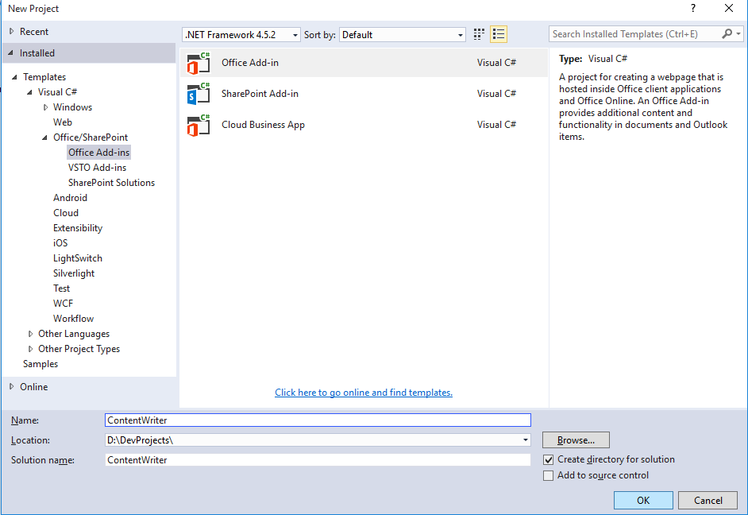

3. Take a look at the structure of the new Visual Studio solution once it has been created. At a high-level, the new solution has been created using two Visual Studio projects named **StatementOfWork** and **StatementOfWorkWeb**. You should also observe that the top project contains a top-level manifest for the Add-in named **StatementOfWorkManifest** which contains a single file named **StatementOfWork.xml**.

	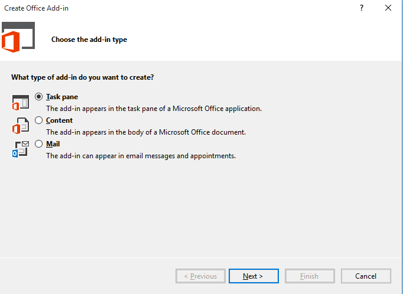

4. In the Solution Explorer, double-click on the node named **StatementOfWorkManifest** to open the add-in manifest file in the Visual Studio editor. 
5. Browse through the file and note the different options you can set for your Add-in, such as provider, version, Display Name.
6. Now, find the XML block that looks like this. Take a minute and read through it as it describes how add-ins can integrate with the Office UI. The example below demonstrates how an add-in can add a button to the Word ribbon's Home tab using Add-in commands. 
    ```XML
      <!-- PrimaryCommandSurface is the main Office Ribbon. -->
      <ExtensionPoint xsi:type="PrimaryCommandSurface">
        <!-- Use OfficeTab to extend an existing Tab. Use CustomTab to create a new tab. -->
        <OfficeTab id="TabHome">
          <!-- Ensure you provide a unique id for the group. Recommendation for any IDs is to namespace using your company name. -->
          <Group id="Contoso.Group1">
            <!-- Label for your group. resid must point to a ShortString resource. -->
            <Label resid="Contoso.Group1Label" />
            <!-- Icons. Required sizes 16,32,80, optional 20, 24, 40, 48, 64. Strongly recommended to provide all sizes for great UX. -->
            <!-- Use PNG icons. All URLs on the resources section must use HTTPS. -->
            <Icon>
              <bt:Image size="16" resid="Contoso.tpicon_16x16" />
              <bt:Image size="32" resid="Contoso.tpicon_32x32" />
              <bt:Image size="80" resid="Contoso.tpicon_80x80" />
            </Icon>

            <!-- Control. It can be of type "Button" or "Menu". -->
            <Control xsi:type="Button" id="Contoso.TaskpaneButton">
              <Label resid="Contoso.TaskpaneButton.Label" />
              <Supertip>
                <!-- ToolTip title. resid must point to a ShortString resource. -->
                <Title resid="Contoso.TaskpaneButton.Label" />
                <!-- ToolTip description. resid must point to a LongString resource. -->
                <Description resid="Contoso.TaskpaneButton.Tooltip" />
              </Supertip>
              <Icon>
                <bt:Image size="16" resid="Contoso.tpicon_16x16" />
                <bt:Image size="32" resid="Contoso.tpicon_32x32" />
                <bt:Image size="80" resid="Contoso.tpicon_80x80" />
              </Icon>

              <!-- This is what happens when the command is triggered (E.g. click on the Ribbon). Supported actions are ExecuteFunction or ShowTaskpane. -->
              <Action xsi:type="ShowTaskpane">
                <TaskpaneId>ButtonId1</TaskpaneId>
                <!-- Provide a URL resource id for the location that will be displayed on the task pane. -->
                <SourceLocation resid="Contoso.Taskpane.Url" />
              </Action>
            </Control>
          </Group>
        </OfficeTab>
      </ExtensionPoint>
	```
7. Let's modify the button to say "Statement of Work" instead of "Show Taskpane". Find the following element in the file.

	```XML
	<Title resid="Contoso.TaskpaneButton.Label" />
	```

8. This indicates that the label of the title is stored in a string resource named **Contoso.TaskpaneButton.Label**.
9. Scroll down until you find the **ShortString** string resource with that label.

10. (Optional)Now, set the DefaultValue attribute to **Statement of Work**. Your XML should look like this: 

	```XML
	<bt:String id="Contoso.TaskpaneButton.Label" DefaultValue="Statement of Work" />
	```
        
11. Press **F5** (or click the "Start" button) to try your changes. 

	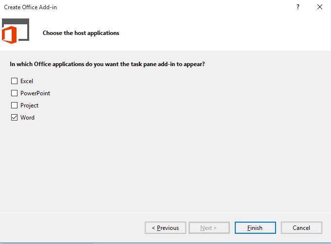

12. Switch back to Visual Studio and click the Stop Debugging button (or Shift+F5)

13. There are other 2 very important files that are part of this project that are on the root of the **StatementOfWorkWeb** project. One of them is the  **Home.html** page which is opened by default in Visual Studio and represents the add-in's starting page. If not already opened please double click on it, you will see some HTML that begins like this: 
 	
    ```html
    <head>
	    <meta charset="UTF-8" />
	    <meta http-equiv="X-UA-Compatible" content="IE=Edge" />
	    <title>Word Add-In with Commands Sample</title>
	
	    <script src="Scripts/jquery-1.9.1.js" type="text/javascript"></script>
	    <script src="Scripts/FabricUI/MessageBanner.js" type="text/javascript"></script>
	    <script src="https://appsforoffice.microsoft.com/lib/1/hosted/office.js" type="text/javascript"></script>
	
	    <!-- To enable offline debugging using a local reference to Office.js, use:                        -->
	    <!-- <script src="Scripts/Office/MicrosoftAjax.js" type="text/javascript"></script>  -->
	    <!-- <script src="Scripts/Office/1/office.js" type="text/javascript"></script>  -->
	
	    <link href="Home.css" rel="stylesheet" type="text/css" />
	    <script src="Home.js" type="text/javascript"></script>
	
	    <!-- For the Office UI Fabric, go to https://aka.ms/office-ui-fabric to learn more. -->
	    <link rel="stylesheet" href="https://appsforoffice.microsoft.com/fabric/2.1.0/fabric.min.css">
	    <link rel="stylesheet" href="https://appsforoffice.microsoft.com/fabric/2.1.0/fabric.components.min.css">
	    
	    <!-- To enable the offline use of Office UI Fabric, use: -->
	    <!-- link rel="stylesheet" href="Content/fabric.min.css" -->
	    <!-- link rel="stylesheet" href="Content/fabric.components.min.css" -->
    </head>
	```

14. There are important references included in the **Home.html** head element. One for our Office.js library**<script src="https://appsforoffice.microsoft.com/lib/1/hosted/office.js" type="text/javascript"></script>**, which enables the developer to interact with Word. There is also a reference to include  Office UI Fabric components, which are the styles you can use to make your add-in look great. Finally, there is also a reference to **Home.js** script on this page, which implements the logic of the add-in.

15. Let's examine the JavaScript code in **home.js**. Double-click **home.js** to open it in a code editor window.
16. Walk through the code in **Home.js**. It includes a simple example to highlight the largest word in the user selection. Note at the end of the file there is an **errorHandler** function we will reuse in the lab to handle errors, as well as a **showNotification** function to display messages from the lab.  

17. Let's clean up **Home.js** for our lab. Replace the content of the entire file with the following snippet. Your Home.js should look like this: 

	````javascript
	/// <reference path="/Scripts/FabricUI/MessageBanner.js" />
	(function () {
	    "use strict";
	    var messageBanner;
	    // The initialize function must be run each time a new page is loaded.
	    Office.initialize = function (reason) {
	        $(document).ready(function () {
	            // Initialize the FabricUI notification mechanism and hide it
	            var element = document.querySelector('.ms-MessageBanner');
	            messageBanner = new fabric.MessageBanner(element);
	            messageBanner.hideBanner();
	            // Add event handlers here.....
	        });
	    };
	    //$$(Helper function for treating errors, $loc_script_taskpane_home_js_comment34$)$$
	    function errorHandler(error) {
	        // $$(Always be sure to catch any accumulated errors that bubble up from the Word.run execution., $loc_script_taskpane_home_js_comment35$)$$
	        showNotification("Error:", error);
	        console.log("Error: " + error);
	        if (error instanceof OfficeExtension.Error) {
	            console.log("Debug info: " + JSON.stringify(error.debugInfo));
	        }
	    }
	    // Helper function for displaying notifications
	    function showNotification(header, content) {
	        $("#notificationHeader").text(header);
	        $("#notificationBody").text(content);
	        messageBanner.showBanner();
	        messageBanner.toggleExpansion();
	    }
	})();
	````

18. Save your changes to **Home.js**. You will return to this source file after you have added your HTML layout to **Home.html**.
19. Now it's time to examine the HTML that has been added to the project to create the add-in's user interface. Double-click **Home.html** to open this file in a Visual Studio editor window. Examine the layout of HTML elements inside the **body** element. 
20. Update the **content-main** div within **Home.html** to match the following HTML layout, which adds a set of buttons to the add-in's layout. These are all the buttons you need for the lab.

	````html
	<div id="content-main">
        <div id="sowPanel" class="padding">
            <div class="ms-font-xl ms-fontColor-blue">JavaScript API for Office</div>
            <button class="ms-Button ms-Button--compound" id="addContentHelloWorld">
                <span class="ms-Button-label" id="button-text">Hello World!</span>
                <span class="ms-Button-description" id="button-desc">Just a simple Hello World!! This code writes the famous string.</span>
            </button><br><br>

            <button class="ms-Button ms-Button--compound" id="SetDataAsHTML">
                <span class="ms-Button-label" id="button-text">Step 1: Set Data As HTML</span>
                <span class="ms-Button-description" id="button-desc">Writing Content to a Word Document Using Html Coercion Type.</span>
            </button><br><br>

            <button class="ms-Button ms-Button--compound" id="SetDataAsMatrix">
                <span class="ms-Button-label" id="button-text">Step 2: Set Data As Tabular Data With No Headers</span>
                <span class="ms-Button-description" id="button-desc">Writing Content to a Word Document Using Matrix Coercion Type.</span>
            </button><br><br>

            <button class="ms-Button ms-Button--compound" id="SetDataAsTable">
                <span class="ms-Button-label" id="button-text">Step 3: Set Data As Tabular Data With Optional Headers</span>
                <span class="ms-Button-description" id="button-desc">Writing Content to a Word Document Using Table Coercion Type.</span>
            </button><br><br>

            <button class="ms-Button ms-Button--compound" id="SetDataAsOoxml">
                <span class="ms-Button-label" id="button-text">Step 4: Office Open XML</span>
                <span class="ms-Button-description" id="button-desc">Writing Content to a Word Document Using ooxml Coercion Type.</span>
            </button>
            <br><br>

            <div class="ms-font-xl ms-fontColor-blue">Word JavaScript API</div>

            <button class="ms-Button ms-Button--compound" id="addText">
                <span class="ms-Button-label" id="button-text">Step 5: Add Text</span>
                <span class="ms-Button-description" id="button-desc">How to add Text.</span>
            </button><br><br>

            <button class="ms-Button ms-Button--compound" id="addBibliography">
                <span class="ms-Button-label" id="button-text">Step 6: Add Bibliography</span>
                <span class="ms-Button-description" id="button-desc">How to add Bibliography.</span>
            </button><br><br>

            <button class="ms-Button ms-Button--compound" id="addXML">
                <span class="ms-Button-label" id="button-text">Step 7: Add XML</span>
                <span class="ms-Button-description" id="button-desc">Insert XML document</span>
            </button><br><br>

            <button class="ms-Button ms-Button--compound" id="addPicture">
                <span class="ms-Button-label" id="button-text">Step 8: Fix Picture!</span>
                <span class="ms-Button-description" id="button-desc">How to insert or replace images in a document.</span>
            </button><br><br>

            <button class="ms-Button ms-Button--compound" id="addSearchAndTempletize">
                <span class="ms-Button-label" id="button-text">Step 9: Search and Templetize!</span>
                <span class="ms-Button-description" id="button-desc">Search for 'Contoso' and insert content controls to hold the customer name. </span>
            </button><br><br>

            <button class="ms-Button ms-Button--compound" id="addChangeCustomer">
                <span class="ms-Button-label" id="button-text">Step 10: Replace Customer!</span>
                <span class="ms-Button-description" id="button-desc">Set the customer name to 'Fabrikam' using content controls.</span>
            </button><br><br>

            <button class="ms-Button ms-Button--compound" id="addReuseContent">
                <span class="ms-Button-label" id="button-text">Step 11: Reuse Content!</span>
                <span class="ms-Button-description" id="button-desc">Reuse content by merging in another document</span>
            </button><br><br>

            <button class="ms-Button ms-Button--compound" id="addHighlights">
                <span class="ms-Button-label" id="button-text">Step 12: Highlight Word by Word!</span>
                <span class="ms-Button-description" id="button-desc">Shows how to get (as range) word by word of a paragraph.</span>
            </button><br><br>

            <button class="ms-Button ms-Button--compound" id="addOpenDoc">
                <span class="ms-Button-label" id="button-text">Step 13: Create a New Document!</span>
                <span class="ms-Button-description" id="button-desc">This samples shows how to create and open a new document.</span>
            </button><br><br>
        </div>
    </div>
	````

21. Save and close **Home.html**.
22. Let's try the add-in one more time to see the progress. Press the **{F5}** key to run the project in the Visual Studio debugger. The debugger should launch Word 2016. NOTE: Once Word opens, make sure you launch your add-in by clicking on the **Statement of Work** button on the ribbon. (and make sure to repeat this operation each time you F5)
23. After you click on this button you should see your Office Add-in in the task pane on the right side of a new Word document, as shown in the following screen shot.

	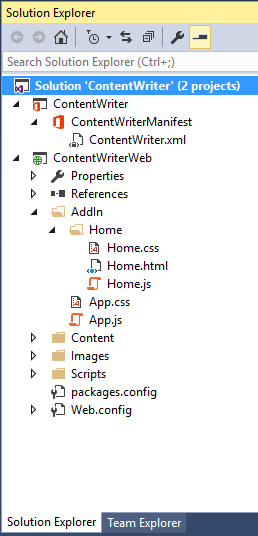

24. Close Word to terminate your debugging session and return to Visual Studio.
25. Open **Home.js** file, add a new function named **testForSuccess** with the following implementation.

	````javascript
	function testForSuccess(asyncResult) {
		if (asyncResult.status === Office.AsyncResultStatus.Failed) {
			app.showNotification('Error', asyncResult.error.message);
		}
	}
	````

26. Create a function named **onAddContentHellowWorld** and add the following call to **setSelectedDataAsync**.

	````javascript
	function onAddContentHellowWorld() {
		Office.context.document.setSelectedDataAsync("Hello World!", testForSuccess);
	}
	````

27. Finally, add a line of jQuery code into the add-in initialization logic to bind the click event of the **addContentHelloWorld** button to the **onaddContentHelloWorld** function (after the **// Add event handlers here comment**).

	````javascript
    Office.initialize = function (reason) {
        $(document).ready(function () {
            // Initialize the FabricUI notification mechanism and hide it
            var element = document.querySelector('.ms-MessageBanner');
            messageBanner = new fabric.MessageBanner(element);
            messageBanner.hideBanner();

            // Add event handlers here.....
            $('#addContentHelloWorld').click(onAddContentHellowWorld);
        });
    };
	````

28. Now test the functionality of the add-in. Press the **{F5}** key to begin a debugging session and click the **Hello World** button. You should see that "Hello World" has been added into the cursor position of the Word document.

	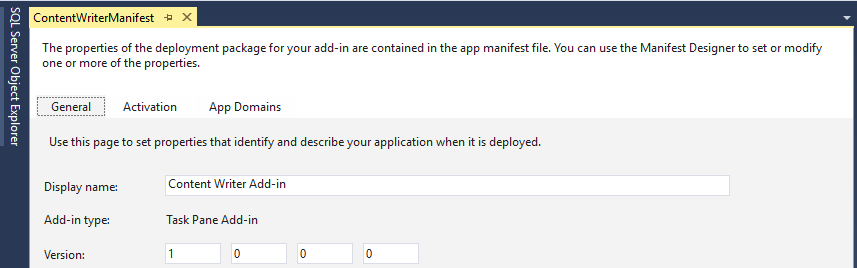

29. You have now successfully run and tested the add-in and its JavaScript logic using the Visual Studio debugger. Close Microsoft Word to stop the debugging session and return to Visual Studio.


### Exercise 2: Writing Content to a Word Document Using Coercion Types
*In this exercise you will continue working on the Visual Studio solution for the Add-in you created in the previous exercise. You will add additional JavaScript code to insert content into the current Word document in a variety of formats.*
 
1. In Visual Studio, open **Home.js** file.
2. Just below the **onAddContentHellowWorld** function, add four new functions named **onAddContentHtml**, **onAddContentMatrix**, **onAddContentOfficeTable** and **onAddContentOfficeOpenXml**.

	````javascript
	function onAddContentHtml() {
	}

	function onAddContentMatrix() {
	}

	function onAddContentOfficeTable() {
	}

	function onAddContentOfficeOpenXml() {
	}
	````

3. Just below the call to **app.initialize**, add the jQuery code required to bind each of the four new functions to the **click** event of the associated buttons.
   
	````javascript
    Office.initialize = function (reason) {
        $(document).ready(function () {
            // Initialize the FabricUI notification mechanism and hide it
            var element = document.querySelector('.ms-MessageBanner');
            messageBanner = new fabric.MessageBanner(element);
            messageBanner.hideBanner();

            // Add event handlers here.....
            $('#addContentHelloWorld').click(onAddContentHellowWorld);
            $('#addContentHelloWorld').click(onAddContentHellowWorld);
            $('#SetDataAsHTML').click(onAddContentHtml);
            $('#SetDataAsMatrix').click(onAddContentMatrix);
            $('#SetDataAsTable').click(onAddContentOfficeTable);
            $('#SetDataAsOoxml').click(onAddContentOfficeOpenXml);
        });
    };
	````

4. Implement the **onAddContentHtml** function to create an HTML div element with several child elements using jQuery and then to write that HTML to the Word document using the HTML coercion type using the code in the following listing.

	````javascript
	function onAddContentHtml() {
		// create HTML element
		var div = $("<div>")
				.append($("<h2>").text("My Heading"))
				.append($("<p>").text("This is paragraph 1"))
				.append($("<p>").text("This is paragraph 2"))

		// insert HTML into Word document
		Office.context.document.setSelectedDataAsync(div.html(), { coercionType: "html" }, testForSuccess);
	}
	````

5. Test your work by pressing **{F5}** key to start a debug session and then click the **Step 1: Set Data As HTML** button, you should see that the HTML content has been added to the Word document.

	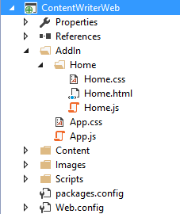

6. Implement **onAddContentMatrix** by creating an array of arrays and then by writing the matrix to the Word document using the matrix coercion type as shown in the following code listing.

	````javascript
	function onAddContentMatrix() {
		// create matrix as an array of arrays
		var matrix = [["First Name", "Last Name"],
	                  ["Bob", "White"],
	                  ["Anna", "Conda"],
	                  ["Max", "Headroom"]];

		// insert matrix into Word document
		Office.context.document.setSelectedDataAsync(matrix, { coercionType: "matrix" }, testForSuccess);
	}
	````

8. Test your work by pressing **{F5}** key to start a debug session and then click the **Set Data As Tabular Data With No Headers** button, you should see that the content from the matrix has been added to the Word document as a table.

	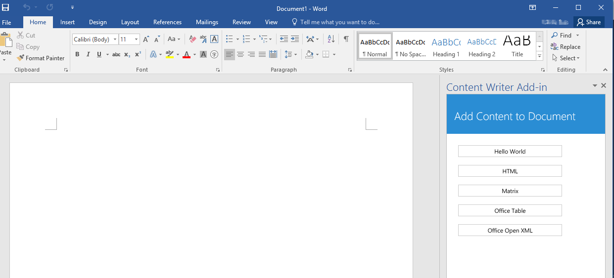

9. Implement **onAddContentOfficeTable** by creating a new Office.TableData object and then by writing it to the Word document using the table coercion type as shown in the following code listing.

	````javascript
	function onAddContentOfficeTable() {

		// create and populate an Office table
		var myTable = new Office.TableData();
		myTable.headers = [['First Name', 'Last Name']];
		myTable.rows = [['Bob', 'White'], ['Anna', 'Conda'], ['Max', 'Headroom']];

		// add table to Word document
		Office.context.document.setSelectedDataAsync(myTable, { coercionType: "table" }, testForSuccess)
	}
	````

10. Test your work by pressing **{F5}** key to start a debug session and then click the **Step 3: Set Data As Tabular Data With Optional Headers** button, you should see that the content from the Office Table object has been added to the Word document as a table.

	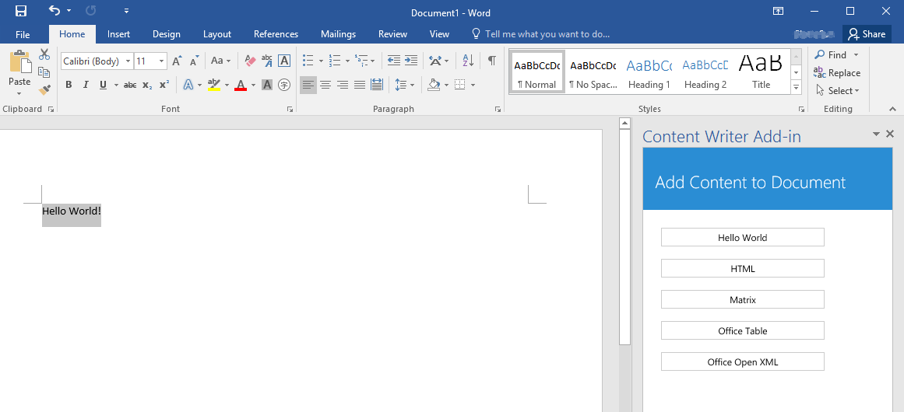

11. Locate the [Starter Files](./Starter%20Files) folder, you can find a xml file named **OpenXMLChart.xml**, add this XML file into **StatementOfWorkWeb** project.

	

12. Return to the code editor window with **Home.js**. 
13. Implement the **onAddContentOfficeOpenXml** function to execute an HTTP GET request using the jQuery **$.ajax** function to retrieve the XML file. In the success callback function, call **setSelectedDataAsync** to write the XML content to the current Word document using the **ooxml** coercion type as shown in the following code listing.

	````javascript
	function onAddContentOfficeOpenXml() {
		$.ajax({
			url: "OpenXMLChart.xml",
			type: "GET",
			dataType: "text",
			success: function (xml) {
				Office.context.document.setSelectedDataAsync(xml, { coercionType: "ooxml" }, testForSuccess)
			}
		});
	}
	````

14. Test your work by starting a debug session and clicking the **Step 4: Office Open XML** button, you should see that the Open Office XML content has been used to create a simple bar chart.

	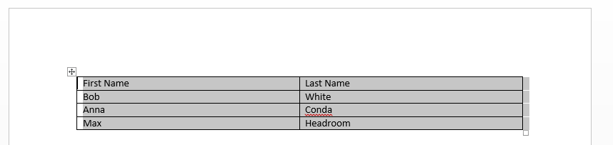

Congratulations! In this exercise you extended the Add-in's capabilities by adding JavaScript code to insert content into the active Word document using coercionType.


## Part 2: Leverage the Word JavaScript API - Introduced in Office 2016.

### Exercise 3: Use Word JavaScript API to add text
*In this exercise, you will continue working on the Visual Studio solution for the StatementOfWork add-in you created in the previous exercise. You will use the Word JavaScript API to add text.*

1. In Visual Studio, open **Home.js** in **StatementOfWorkWeb** project. 
2. Just below the **onAddContentOfficeOpenXml** function, add the following new functions(after **onAddContentOfficeOpenXml** function).

	````javascript
    function onAddText() {
    }
    function onAddBibliography() {
    }
    function onAddXML() {
    }
    function onFixPicture() {
    }
    function onSearchAndTempletize() {
    } 
    function onaddChangeCustomer() {
    }
    function onaddReuseContent() {
    }
    function onaddHighlights() {
    }
    function onaddOpenDoc() {
    } 
	````

3. Go back to Office.initialize and provide the handlers for each button **click** event associating the buttons with the corresponding newly created functions.
   
	````javascript
    Office.initialize = function (reason) {
        $(document).ready(function () {
            // Initialize the FabricUI notification mechanism and hide it
            var element = document.querySelector('.ms-MessageBanner');
            messageBanner = new fabric.MessageBanner(element);
            messageBanner.hideBanner();

            // Add event handlers here.....
            $('#addContentHelloWorld').click(onAddContentHellowWorld);
            $('#SetDataAsHTML').click(onAddContentHtml);
            $('#SetDataAsMatrix').click(onAddContentMatrix);
            $('#SetDataAsTable').click(onAddContentOfficeTable);
            $('#SetDataAsOoxml').click(onAddContentOfficeOpenXml);
            $('#addText').click(onAddText);
            $('#addBibliography').click(onAddBibliography);
            $('#addXML').click(onAddXML);
            $('#addPicture').click(onFixPicture);
            $('#addSearchAndTempletize').click(onSearchAndTempletize);
            $('#addChangeCustomer').click(onaddChangeCustomer);
            $('#addReuseContent').click(onaddReuseContent);
            $('#addHighlights').click(onaddHighlights);
            $('#addOpenDoc').click(onaddOpenDoc);
        });
    };
	````
4. Implement **onAddText** by using **body.insertText**. This method is replacing the entire body of the document with the **Use Word JavaScript API to add text** string (note that instead of "replace" the method can also insert at the "start" or "end" of the body). Also add a handler for success and error

	````javascript
    function onAddText() {
        Word.run(function (context) {
            context.document.body.insertText("Use Word JavaScript API to add text", "replace");
            return context.sync()
        }).then(function () {
            showNotification("Task Complete!");
        })
            .catch(function (myError) {
                showNotification("Error", myError.message);
            });
    }
	````
5. Test your work by starting a debug session and clicking the **Step 5: Add Text** button, you should see the following screen shot.

	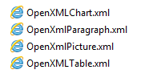

6. Implement **onAddBibliography** as following.

	````javascript
    function onAddBibliography() {
        Word.run(function (context) {
            var bibliographyParagraph = context.document.body.insertParagraph("Bibliography", "end");
            bibliographyParagraph.style = "Heading 1";
            var bookOneTitle = context.document.body.insertParagraph("Design Patters, Elements of Reusable Object-Oriented Software", "end");
            bookOneTitle.style = "Book Title";
            var bookOneAuthors = context.document.body.insertParagraph("by Erich Gamma, Richard Helm, Ralph Johnson and John Vlissides", "end");
            bookOneAuthors.style = "Subtle Emphasis";
            var bookTwoTitle = context.document.body.insertParagraph("Refactoring: Improving the Design of Existing Code", "end");
            bookTwoTitle.style = "Book Title";
            var bookTwoAuthors = context.document.body.insertParagraph("by Martin Fowler", "end");
            bookTwoAuthors.style = "Subtle Emphasis";
            return context.sync();
        }).then(function () {
            showNotification("Task Complete!");
            }).catch(function (myError) {
                showNotification("Error", myError.message);
            });
    }
	````
7. Test your work by starting a debug session and clicking the **Step 6: Add Bibliography** button, you should see the following screen shot.

	

8. Locate the [Starter Files](./Starter%20Files) folder, you can find a xml file named **documentSample.xml**, add this XML file into **StatementOfWorkWeb** project.

	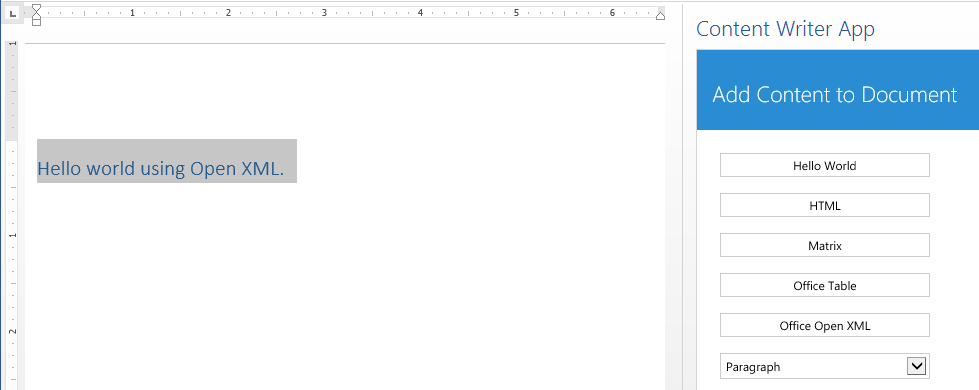

9. Implement **onAddXML** function to load the OOXML fragment with the starting document and then to write that OOXML to the Word document using the **body.insertOoxml** method by  using the code in the following listing.

	````javascript
    function onAddXML() {
        $.ajax({
            url: "documentSample.xml",
            type: "GET",
            dataType: "text",
            success: function (xml) {
                Word.run(function (context) {
                    var body = context.document.body;
                    body.insertOoxml(xml, "replace");
                    return context.sync()

                }).then(function () {
                    showNotification("Task Complete!");
                })
                    .catch(function (myError) {
                        showNotification("Error", myError.message);
                    });
            }
        });
    }
	````
10. Test your work by starting a debug session and clicking the **Step 7: Add XML** button, you should see the following screen shot.

	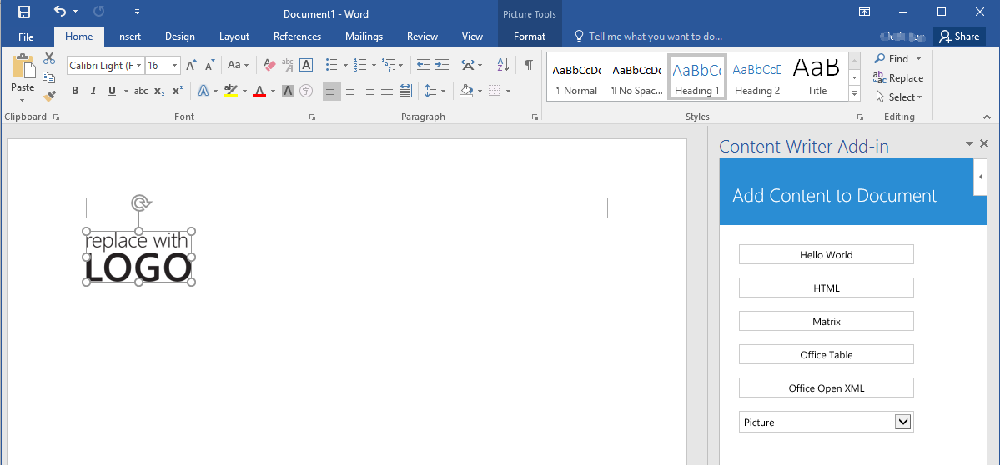


### Exercise 4: Learning how to handle inline Pictures in Word by replacing an existing image in the document
*In this exercise you will continue working on the Visual Studio solution for the StatementOfWork add-in you created on in the previous exercise. You will extend the add-in's capabilities by adding JavaScript code to replace an image in the  active Word document by using the inlinePicture object members.*

1. In Visual Studio, open **Home.js** in **StatementOfWorkWeb** project. 
2. Locate the [Starter Files](./Starter%20Files) folder, you can find a document file named **base64Image.docx**, add this file into **StatementOfWorkWeb** project.

	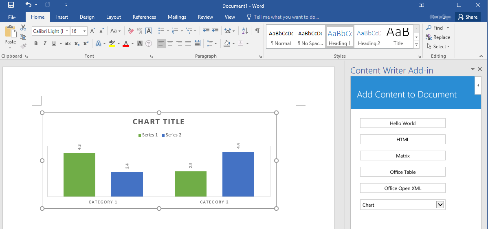

3. Implement **onFixPicture** function as following:

	````javascript
	function onFixPicture() {
        $.ajax({
            url: "base64Image.docx",
            type: "GET",
            dataType: "text",
            success: function (mybase64) {
                Word.run(function (context) {
                    var pics = context.document.body.inlinePictures;
                    context.load(pics);
                    return context.sync()
                        .then(function () {
                            pics.items[0].insertInlinePictureFromBase64(mybase64, "replace");
                            return context.sync()
                                .then(function () {
                                    showNotification("Task Complete!");
                                })
                        })
                }).catch(function (myError) {
                    showNotification("Error", myError.message);
                })
            }
        });
    }
	````
4. Test your work by pressing **{F5}** key to start a debug session and then click the **Step 7: Add XML** button. After the document gets inserted click on the  **Step 8: Fix Picture!** button to try your code. The image should be replaced and the document should look like this:

	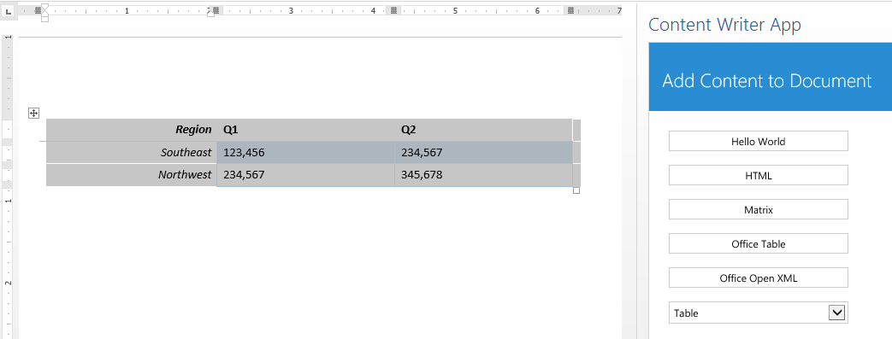 

5. Congratulations! In this exercise, you learned how to navigate through the inline pictures on a document and learned how to replace images! Let's continue with Exercise 5!

### Exercise 5: Using Search and inserting Content Controls
*In this exercise, you will continue working on the Visual Studio solution for the StatementOfWork add-in you created on in the previous steps. You will extend the add-in's capabilities by adding JavaScript code to search for content in the document and add content controls. Content controls are a key building block in Word development and using them enables developers to insert 'placeholders' in the document that can be later identified and replaced with different content.*

1. In Visual Studio, open **Home.js** in **StatementOfWorkWeb** project. 
2. Add the following code to the **onSearchAndTempletize** function:

	````javascript
    function onSearchAndTempletize() {
        Word.run(function (ctx) {
            var results = ctx.document.body.search("Contoso");
            ctx.load(results);
            return ctx.sync()
                .then(function () {
                    for (var i = 0; i < results.items.length; i++) {
                        results.items[i].font.color = "#FF0000";
                        results.items[i].font.highlightColor = "#FFFF00";
                        results.items[i].font.bold = true;
                        var cc = results.items[i].insertContentControl();
                        cc.tag = "customer";
                        cc.title = "Customer Name";
                    }
                    return ctx.sync();
                })
                .then(function () {
                    showNotification("Task Complete!");
                })
                .catch(function (myError) {
                    showNotification("Error", myError.message);
                })
        });
    }
	````

3. Note that the code is searching for **Contoso**. The search method returns a collection of ranges matching the search criteria. The code iterates through that collection and wraps each instance with a content control. Note that you are adding to each content control a tag with a **customer** title. This is important as we will use this information in the next exercise to replace the content of all the content controls with this tag with a new customer's name.

4. Test your work by pressing **{F5}** key to start a debug session and then click the **Step 7: Add XML** button. After the starting document gets inserted, click on the  **Step 9: Search and Templetize!** button to try your code. Each **Contoso** instance should be wrapped with a content control and with a yellow highlight. For visibility purposes we are also adding a red font color and yellow highlight to each search result instance. Your document should look like this after you click on the Step 7 and Step 9 buttons:

	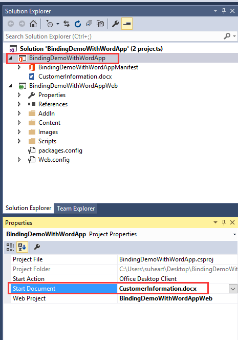

5. Make sure to select any of the **Contoso** search instances and verify they were tagged as **customer**. To check this make sure that the Developer tab in the Word ribbon is activated. Go to File->Options->Customize Ribbon  and make sure in the right panel that **Developer** is selected.

	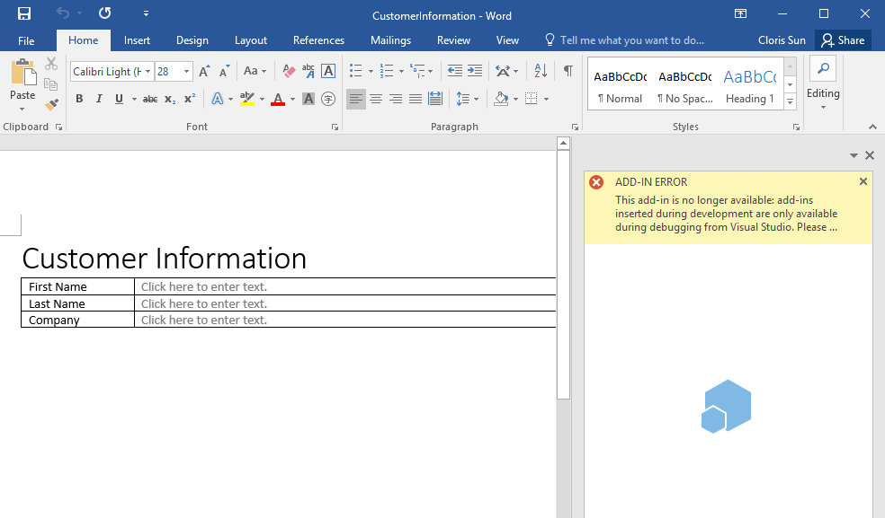

6. Then, while having the cursor within any **Contoso** instance, click on the Developer tab and then on **Properties**. You will see each content control has the **customer** tag.

	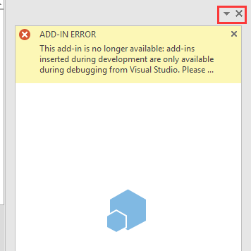

7. Congratulations! In this exercise you learned how to use the search API and how to insert and tagged content controls, as well as changing formatting attributes. Let's continue with Exercise 6! 

### Exercise 6: Changing content of tagged Content Controls!
*In this exercise, you will continue working on the Visual Studio solution for the StatementOfWork add-in you created in the previous steps. You will extend the add-in's capabilities by adding JavaScript code to replace content in tagged content controls. Content controls are a key building block in Word development and enable developers to insert 'placeholders' in the document that can be later identified and replaced with different content.*

1. In Visual Studio, open **Home.js** in **StatementOfWorkWeb** project. 
2. Add the following code to the **onaddChangeCustomer** function:

	````javascript
    function onaddChangeCustomer() {
        Word.run(function (ctx) {
            var ccs = ctx.document.contentControls.getByTag("customer");
            ctx.load(ccs, { select: 'text', expand: 'font' });
            return ctx.sync()
                .then(function () {
                    for (var i = 0; i < ccs.items.length; i++) {
                        ccs.items[i].insertText("Fabrikam", "replace");
                        ccs.items[i].font.color = "#FF0000";
                        ccs.items[i].font.highlightColor = "#FFFF00";
                    }

                })
                .then(function () {
                    showNotification("Task Complete!");
                })
                .catch(function (myError) {
                    showNotification("Error", myError.message);
                })
        });
    } 
	````

3. Note that the code is first getting all the content controls tagged as **customer**, then iterates each of the occurrences and changes the content and the formatting information.
4. Test your work by pressing **{F5}** key to start a debug session and then click the **Step 7: Add XML** button. After the document gets inserted, click on the  **Step 9: Search and Templetize!** to create a template. Now try your code by clicking on **Step 10: Replace Customer!**. Each **Contoso** instance should be replaced with **Fabrikam** and look like the following image:

	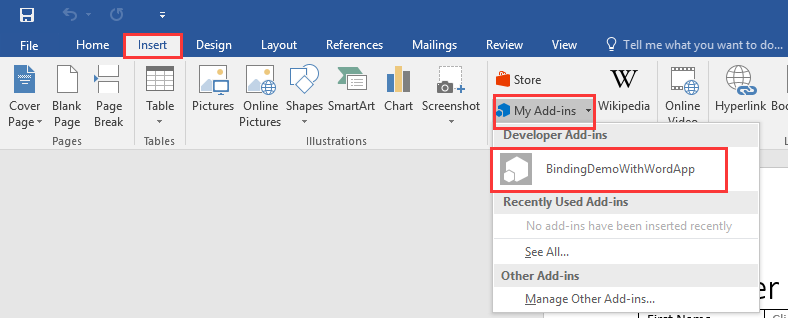 

5. Congratulations! In this exercise you learned how to get content controls by its tag and replace their content! Let's continue with Exercise 7!

### Exercise 7: Reusing content by inserting other Word documents!
*In this exercise, you will continue working on the Visual Studio solution for the StatementOfWork add-in you created in the previous steps. You will extend the add-in's capabilities by adding JavaScript code to insert an existing Word (docx) file at the end of the current document. This exercise is cummulative and assumes you completed  Exercise 2.*

1. In Visual Studio, open **Home.js** in **StatementOfWorkWeb** project. 
2. Locate the [Starter Files](./Starter%20Files) folder, you can find a document file named **base64Document.docx**, add this file into **StatementOfWorkWeb** project.

	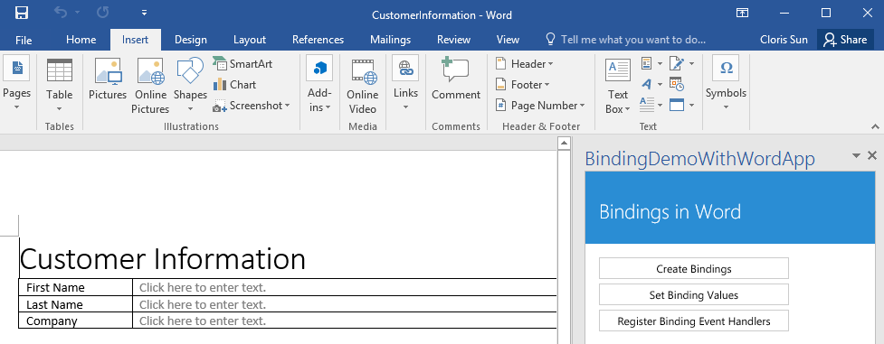

3. Add the following code to the **onaddReuseContent** function:

	````javascript
    function onaddReuseContent() {
        $.ajax({
            url: "base64Document.docx",
            type: "GET",
            dataType: "text",
            success: function (myBase64File) {
                Word.run(function (ctx) {
                    var newParagraph = ctx.document.body.insertParagraph("Costs", "end");
                    newParagraph.style = "Heading 1";
                    ctx.document.body.insertFileFromBase64(myBase64File, "end");
                    return ctx.sync();
                }).then(function () {
                    showNotification("Task Complete!");
                }).catch(function (myError) {
                    showNotification("Error", myError.message);
                })
            }
        });
    } 
	````

4. Note that the code is getting a sample file encoded as base64 (which is the format the insertFile method expects), then iterates each of the occurrences and changes the content and the formatting information.

5. Test your work by pressing **{F5}** key to start a debug session and then click the **Step 7: Add XML** button. After the document gets inserted, try your code by clicking  on the  **Step 11: Reuse Content!** to insert the file at the end of the document. Now try your code by clicking on **Step 9: Search and Templetize!** and then **Step 10: Replace Customer!**. Each **Contoso** instance should be replaced with **Fabrikam** and look like the following image:

	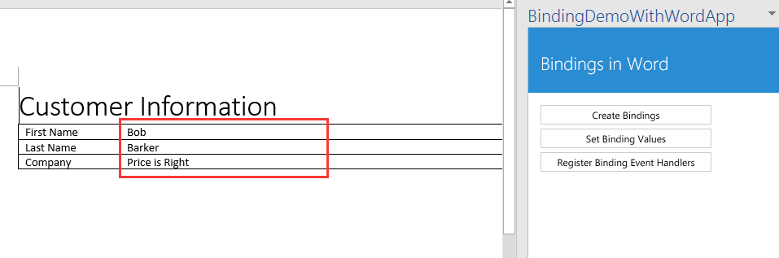 
	
5. Congratulations! In this exercise, you learned how to insert existing Word (docx) files into a document! Let's continue with Exercise 8!

### Exercise 8: Granular access to ranges!
*In this exercise, you will continue working on the Visual Studio solution for the StatementOfWork add-in you created in the previous steps. You will extend the add-in's capabilities by adding JavaScript code to iterate through the words in a paragraph by using the range manipulation functionalities available in the API.*

1. In Visual Studio, open **Home.js** in **StatementOfWorkWeb** project. 
2. Add the following code to the **onaddHighlights** function:

	````javascript
	function onaddHighlights() {
        Word.run(function (ctx) {
            var myParagraphs = ctx.document.body.paragraphs;
            ctx.load(myParagraphs);
            return ctx.sync()
                .then(function () {
                    var myWords = myParagraphs.items[3].split([" "], false, false);
                    ctx.load(myWords, { expand: 'font' });
                    ctx.sync().then(function () {
                        var i = 0;
                        var originalSize = myWords.items[i].font.size;
                        ctx.sync();
                        function delayCallback() {
                            if (i < myWords.items.length) {
                                if (i >= 1) {
                                    myWords.items[i - 1].font.highlightColor = "#FFFFFF";
                                }
                                myWords.items[i].font.highlightColor = "#FFFF00";
                                myWords.items[i].font.size = originalSize * 1.30;
                                i++;
                                return ctx.sync().then(function () {
                                    setTimeout(delayCallback, 100)
                                });
                            }
                        };
                        delayCallback();
                    });
                })
        }).catch(function (myError) {
            showNotification("Error", myError.message);
        });
    }
	````
	

3. This code sample is implementing both highlight and increase the font size word by word of the last paragraph of the document. SO once we have a handle of that paragraph we are using the *split()* method to get, as a collection of ranges, each word (by specifying a space (" ") delimiter. once we have the Range collection we are traversing it in order to highlight word by word.

4. Test your work by pressing **{F5}** key to start a debug session and then click the **Step 7: Add XML** button. After the starting document gets inserted, try your code by clicking  on the  **Step 12: Highlight Word by Word!** to start the animation. Notice how each word will get highlighted in the last paragraph!

	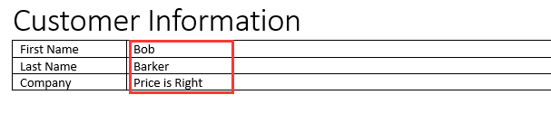 
	
5. Congratulations! In this exercise, you learned how to split a paragraph into multiple ranges and traversing the ranges collection! Let's continue with Exercise 9!

### Exercise 9: Creating and opening a new Word document!
*In this exercise, it will use the PREVIEW APIs for the Word JavaScript API, currently supported as preview! You will continue working on the Visual Studio solution for the StatementOfWork add-in you created in the previous steps. You will extend the add-in's capabilities by adding JavaScript code to create an open a new Word document.*

1. Go back to Visual Studio, make sure you are using the **StatementOfWorkWeb** project, open **Home.html** file.
2. Update **Home.html** to use the preview location of Office.js **https://appsforoffice.microsoft.com/lib/beta/hosted/office.js**, so your head element should be like: (make sure to comment out the other Office.js reference)
	
	````html
	<head>
	    <meta charset="UTF-8" />
	    <meta http-equiv="X-UA-Compatible" content="IE=Edge" />
	    <title>Word Add-In with Commands Sample</title>
	    <script src="Scripts/jquery-1.9.1.js" type="text/javascript"></script>
	    <script src="Scripts/FabricUI/MessageBanner.js" type="text/javascript"></script>
	    <!--<script src="https://appsforoffice.microsoft.com/lib/1/hosted/office.js" type="text/javascript"></script>-->
	    <script src="https://appsforoffice.microsoft.com/lib/beta/hosted/office.js" type="text/javascript"></script>  
	    <!-- To enable offline debugging using a local reference to Office.js, use:                        -->
	    <!-- <script src="Scripts/Office/MicrosoftAjax.js" type="text/javascript"></script>  -->
	    <!-- <script src="Scripts/Office/1/office.js" type="text/javascript"></script>  -->
	    <link href="Home.css" rel="stylesheet" type="text/css" />
	    <script src="Home.js" type="text/javascript"></script>
	    <!-- For the Office UI Fabric, go to https://aka.ms/office-ui-fabric to learn more. -->
	    <link rel="stylesheet" href="https://appsforoffice.microsoft.com/fabric/2.1.0/fabric.min.css">
	    <link rel="stylesheet" href="https://appsforoffice.microsoft.com/fabric/2.1.0/fabric.components.min.css">
	    <!-- To enable the offline use of Office UI Fabric, use: -->
	    <!-- link rel="stylesheet" href="Content/fabric.min.css" -->
	    <!-- link rel="stylesheet" href="Content/fabric.components.min.css" -->
	</head>
	````

3. Open **Home.js** file, add the following code to the **onaddOpenDoc** function:

	````javascript
	function onaddOpenDoc() {
        $.ajax({
            url: "base64Document.docx",
            type: "GET",
            dataType: "text",
            success: function (myBase64File) {
                Word.run(function (ctx) {
                    var myNewDoc = ctx.application.createDocument(myBase64File);
                    ctx.load(myNewDoc);
                    return ctx.sync()
                        .then(function () {
                            var myParagraph = myNewDoc.body.insertParagraph("Hello World This is a new Document!!!", "end");
                            myParagraph.font.bold = true;
                            myParagraph.font.name = "Courier new";
                            myNewDoc.open();
                            ctx.sync();
                        }).catch(function (myError) {
                            showNotification("Error", myError.message);
                        })
                }).then(function () {
                    showNotification("Task Complete!");
                }).catch(function (myError) {
                    showNotification("Error", myError.message);
                })
            }
        });
    }
	````

4. This code basically creates a new document, using an existing doc (base64 encoded) as a starting doc (this doc is optional). Then adds a paragraph at the end of the document by using the API and finally opens the document. Note that after the document is opened, no other operations can be send to it.
5. Test your work by pressing **{F5}** key to start a debug session and then click the **Step 13: Create a New Document** button. You will see that a new document is created and opened !

	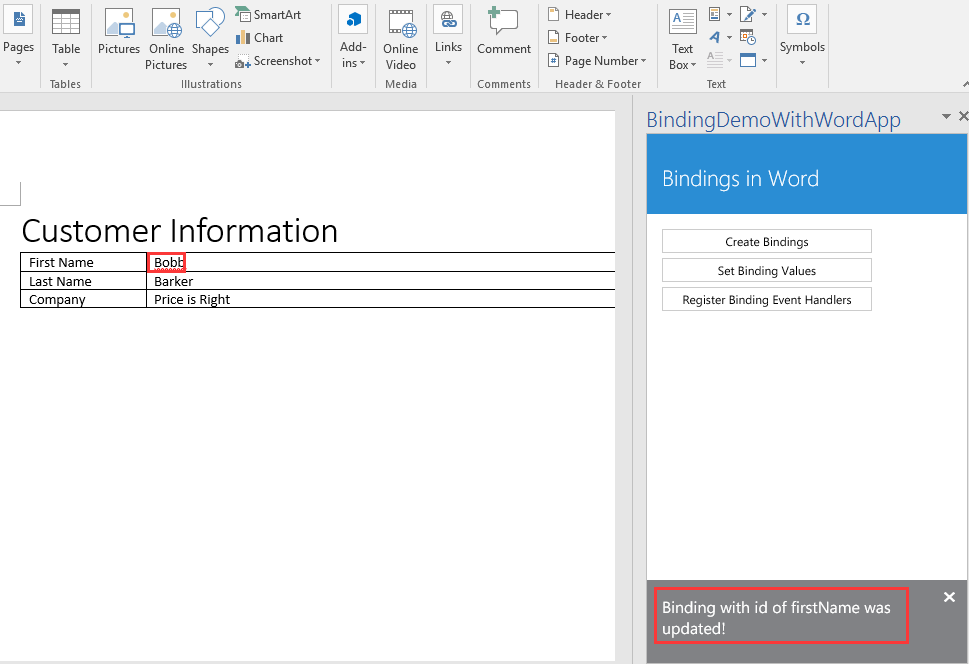 
	
6. Congratulations! In this exercise, you learned how to create and open new Word documents!

Congratulations on finishing the New Word APIs Lab!!