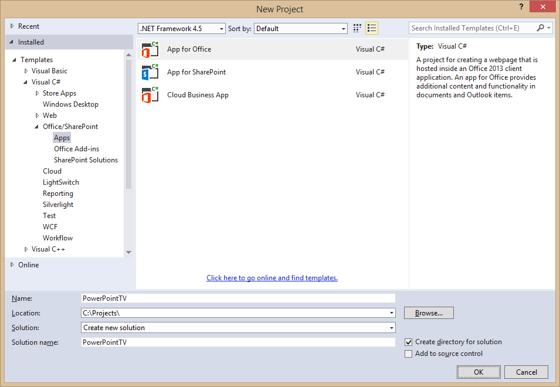
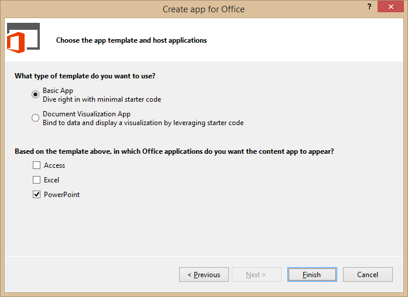
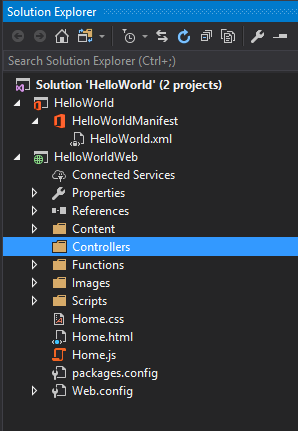
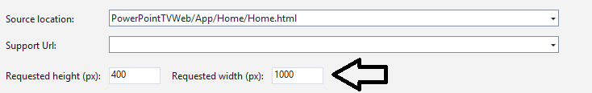
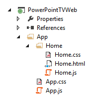
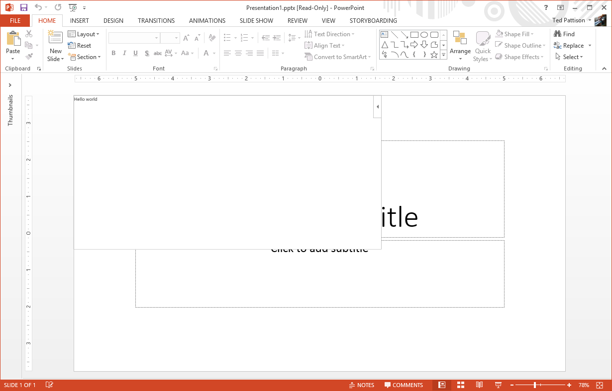
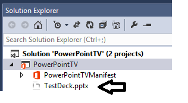
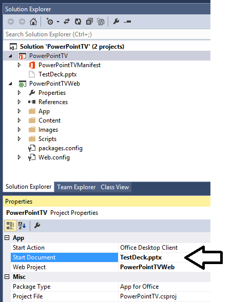
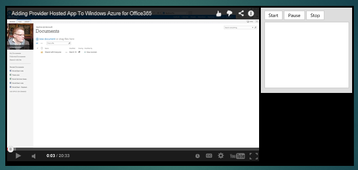
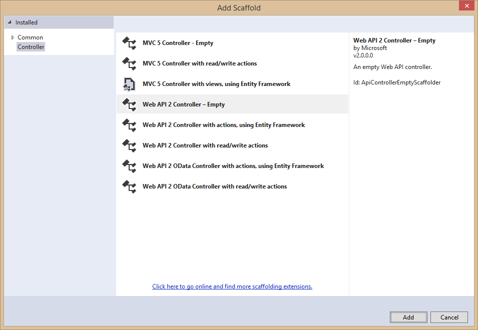

# Deep Dive into Office PowerPoint add-ins
Office Add-ins let you add your solution where ever they run. In PowerPoint, add-ins can help you build richer presentations

**Prerequisites:**
1. You must have Visual Studio 2017 installed.
2. You must have Office 2016 installed.

## Exercise 1: Create your first add-in
*In this exercise you will learn how to use Visual Studio to create your first add-in and you will learn about the files that are created for you. You will also learn about how to customize buttons on the ribbon and learn more about add-in commands. *

1. Launch Visual Studio 2017
2. In Visual Studio 2017, select **File | New | Project**. Expand **Templates**, **Visual C#**, **Office/SharePoint** ,**Add-ins**. Select **PowerPoint Web Add-in**. Name the project **HelloWorld** and click **OK**.

    

3. When you create a new **PowerPoint Web Add-in** project, Visual Studio prompts you with the **Choose the add-in type** page of the **Create Office Add-in** dialog. This is the point where you select the type of add-in you want to create. Leave the default setting with the radio button titled **Add new functionalities to PowerPoint** and select **Finish** to continue.

    

4. Visual Studio will create the project. There are a few parts that are created for you:
	- A manifest xml file - this holds the metadata that your add-in needs to run in Office, including how it will present itself on the ribbon.
	- A HelloWorldWeb project with a Home.html and Home.js - The HelloWorldWeb project in the solution contains the HTLM and Javascript you need to run your Office Add-in.
5. Use the Solution Explorer to drill down into the **HelloWorld.xml** file.

    

6. Now, find the XML block that looks like this. Take a minute and read through it as it describes how add-ins can integrate with the Office UI. The example below demonstrates how an add-in can add a button to the PowerPoint ribbon's Home tab.

	```XML
    <ExtensionPoint xsi:type="PrimaryCommandSurface">
	    <!-- Use OfficeTab to extend an existing Tab. Use CustomTab to create a new tab. -->
	    <OfficeTab id="TabHome">
	      <!-- Ensure you provide a unique id for the group. Recommendation for any IDs is to namespace using your company name. -->
	      <Group id="Contoso.Group1">
	        <!-- Label for your group. resid must point to a ShortString resource. -->
	        <Label resid="Contoso.Group1Label" />
	        <!-- Icons. Required sizes 16,32,80, optional 20, 24, 40, 48, 64. Strongly recommended to provide all sizes for great UX. -->
	        <!-- Use PNG icons. All URLs on the resources section must use HTTPS. -->
	        <Icon>
	          <bt:Image size="16" resid="Contoso.tpicon_16x16" />
	          <bt:Image size="32" resid="Contoso.tpicon_32x32" />
	          <bt:Image size="80" resid="Contoso.tpicon_80x80" />
	        </Icon>
	
	        <!-- Control. It can be of type "Button" or "Menu". -->
	        <Control xsi:type="Button" id="Contoso.TaskpaneButton">
	          <Label resid="Contoso.TaskpaneButton.Label" />
	          <Supertip>
	            <!-- ToolTip title. resid must point to a ShortString resource. -->
	            <Title resid="Contoso.TaskpaneButton.Label" />
	            <!-- ToolTip description. resid must point to a LongString resource. -->
	            <Description resid="Contoso.TaskpaneButton.Tooltip" />
	          </Supertip>
	          <Icon>
	            <bt:Image size="16" resid="Contoso.tpicon_16x16" />
	            <bt:Image size="32" resid="Contoso.tpicon_32x32" />
	            <bt:Image size="80" resid="Contoso.tpicon_80x80" />
	          </Icon>
	
	          <!-- This is what happens when the command is triggered (E.g. click on the Ribbon). Supported actions are ExecuteFunction or ShowTaskpane. -->
	          <Action xsi:type="ShowTaskpane">
	            <TaskpaneId>ButtonId1</TaskpaneId>
	            <!-- Provide a URL resource id for the location that will be displayed on the task pane. -->
	            <SourceLocation resid="Contoso.Taskpane.Url" />
	          </Action>
	        </Control>
	      </Group>
	    </OfficeTab>
    </ExtensionPoint>
	```
    
9. Let's modify the button to say "Daily Photo" instead of "Show Taskpane". Find the following element in the file.

	```XML
	<Title resid="Contoso.TaskpaneButton.Label" />
	```
10. This indicates that the label of the title is stored in a string resource named **Contoso.TaskpaneButton.Label**.
11. Scroll down until you find the short string resource with that label.

	```XML
	<bt:String id="Contoso.TaskpaneButton.Label" DefaultValue="Show Taskpane" />
	```
12. Now, set the DefaultValue attribute to *Daily Photo*.

	```XML
	<bt:String id="Contoso.TaskpaneButton.Label" DefaultValue="Daily Photo" />
	```
13. Press **{F5}** (or click the "Start" button) to try your changes. 
	

14. Switch back to Visual Studio and click the Stop Debugging button (or Shift+F5)

15. Select **HelloWorldWeb** project, open **Home.html**. Find the div with the id **content-main** and it will look like the following.

    ```HTML
    <div id="content-main">
        <div class="padding">
            <br />
            <p class="ms-font-xxl ms-fontColor-neutralSecondary ms-fontWeight-semilight">Sample</p>
            <br />
            <div class="ms-font-xl ms-fontColor-neutralTertiary">Getting Started</div>
            <p class="ms-font-m-plus ms-fontColor-neutralTertiary">This sample reads the value of the text you have selected in the slide. </p>
             <br /><br />
            <button class="ms-Button ms-Button--primary" id="get-data-from-selection">
                <span class="ms-Button-icon"><i class="ms-Icon ms-Icon--plus"></i></span>
                <span class="ms-Button-label">Get data from selection</span>
                <span class="ms-Button-description">Gets the selected data and displays it.</span>
            </button>
            <br /><br /><br />
            <div class="ms-font-m"><a target="_blank" class="ms-Link ms-Link--hero" href="https://go.microsoft.com/fwlink/?LinkId=276812">Find more samples online...</a></div>
        </div>
    </div>
    ```

16. Replace that with:

    ```HTML
    <div id="content-main">
        <div class="padding">
            <p class="ms-font-xxl ms-fontColor-neutralSecondary ms-fontWeight-semilight">Bing Photo of the day</p>

            <button class="ms-Button ms-Button--primary" id="get-photo-of-the-day">
                <span class="ms-Button-icon"><i class="ms-Icon ms-Icon--plus"></i></span>
                <span class="ms-Button-label">InsertImage</span>
                <span class="ms-Button-description">Gets the photo of the day that shows on Bing.com's home page and adds it to the slide.</span>
            </button>
        </div>
    </div>
    ```

17. Next, we'll replace the contents of the **Home.js** file with the following:

    ```js
	/// <reference path="/Scripts/FabricUI/MessageBanner.js" />
	(function () {
	    "use strict";
	    var messageBanner;
	    // The initialize function must be run each time a new page is loaded.
	    Office.initialize = function (reason) {
	        $(document).ready(function () {
	            // Initialize the FabricUI notification mechanism and hide it
	            var element = document.querySelector('.ms-MessageBanner');
	            messageBanner = new fabric.MessageBanner(element);
	            messageBanner.hideBanner();
	
	            $('#get-photo-of-the-day').click(insertImageFromBing);
	        });
	    };
	    function insertImageFromBing() {
	
	        //Get image from from webservice. 
	        //The service should fetch the photo return it as a base 64 embedded string
	        $.ajax({
	            url: "/api/Photo/", success: function (result) {
	                insertImageFromBase64String(result);
	            }, error: function (xhr, status, error) {
	
	                showNotification("Fail", "oops something went wrong");
	            }
	        });
	    }
	    //This function uses the Office JavaScript API to add content to the Slide
	    function insertImageFromBase64String(image) {
	        //TODO
	    }
	    // Helper function for displaying notifications
	    function showNotification(header, content) {
	        $("#notificationHeader").text(header);
	        $("#notificationBody").text(content);
	        messageBanner.showBanner();
	        messageBanner.toggleExpansion();
	    }
	})();
    ```

18. Next, we will create the web service to make the call to get Bing's photo of the day.
19. Add a new folder to the **HelloWorldWeb** project named **Controllers**.  

	  

20. Right-click the **Controllers** folder and select **Add > New Scaffolded Item...**.
21. In the **Add Scaffold** dialog, select **Web API 2 Controller - Empty** and click the **Add** button.  

	  

22. On the **AddController** dialog, enter a name of **PhotoController** and click the **Add** button. 

	  

23. Open **PhotoController.cs**, let's replace the contents of the file with the code to call the Bing Service.  

    ```c#
    using System;
    using System.IO;
    using System.Net;
    using System.Text;
    using System.Web.Http;
    using System.Xml;

    namespace HelloWorldWeb.Controllers
    {
        public class PhotoController : ApiController
        {
            public string Get()
            { 
                //you can also set format=js to get a JSON response back. To keep things concise, we'll use XML.
                string url = "http://www.bing.com/HPImageArchive.aspx?format=xml&idx=0&n=1";

                //create the request
                HttpWebRequest request = (HttpWebRequest)WebRequest.Create(url);
                WebResponse response = request.GetResponse();

                using (Stream responseStream = response.GetResponseStream())
                {
                    //process the result
                    StreamReader reader = new StreamReader(responseStream, Encoding.UTF8);
                    string result = reader.ReadToEnd();

                    //parse the xml response and to get the URL 
                    XmlDocument doc = new XmlDocument();
                    doc.LoadXml(result);
                    string photoURL = "http://bing.com" + doc.SelectSingleNode("/images/image/url").InnerText;

                    //fetch the photo and return it as a Base64Encoded string
                    return getPhotoFromURL(photoURL); 
                }
            }

            private string getPhotoFromURL(string imageURL)
            {
                var webClient = new WebClient();
                byte[] imageBytes = webClient.DownloadData(imageURL);
                return Convert.ToBase64String(imageBytes);
            }
        }
    }
    ```
    
24. Now, let's go back to **Home.js** and add in the call to insert the image. Replace the **insertImageFromBase64String** function with the following:
    ```js
    function insertImageFromBase64String(image) {
        //Call Office.js to insert it into the document. You can also pass in imageTop and imageLeft parameters.
        Office.context.document.setSelectedDataAsync(image, {
            coercionType: Office.CoercionType.Image
        },
            function (asyncResult) {
                if (asyncResult.status === Office.AsyncResultStatus.Failed) {
                    showNotification("error", asyncResult.error.message);
                }
            });
    }
    ```

25. Save your changes. Test your work by pressing **{F5}** to start the project. When PowerPoint loads, click the *Daily Photo* button on the home tab.
26. Then click the insert image button and you should see the Bing Photo of the Day added, you can then use the designer in PowerPoint to customize the slide deck with designs based on the photo.

	  

## Exercise 2: Create PowerPointTV Add-in to insert video into PowerPoint slides.
*In this exercise you will learn how to create add-in that insert new embeddable objects into PowerPoint slides.*

1. Launch Visual Studio 2017
2. In Visual Studio 2017, select **File | New | Project**. Expand **Templates**, **Visual C#**, **Office/SharePoint** ,**Add-ins**. Select **PowerPoint Web Add-in**. Name the project **PowerPointTV** and click **OK**.
3. When you create a new **PowerPoint Web Add-in** project, Visual Studio prompts you with the **Choose the add-in type** page of the **Create Office Add-in** dialog. This is the point where you select the type of add-in you want to create. Leave the setting with the radio button titled **Insert content into PowerPoint slides** and select **Finish** to continue.

    

4. Take a look at the structure of the new Visual Studio solution once it has been created. At a high-level, the new solution has been created using two Visual Studio projects named **PowerPointTV** and **PowerPointTVWeb**. You should also observe that the top project contains a top-level manifest for the app named **PowerPointTVManifest** which contains a single file named **PowerPointTV.xml**.  
5. In the Solution Explorer, double-click on the node named **PowerPointTVManifest** to open the app manifest file in the Visual Studio designer. Locate the **Requested width** setting, modify **Requested height** to *600* pixels and **Requested width** to *1000* pixels.

	

6. Save and close **PowerPointTVManifest**.
7. Select **PowerPointTV** project.
8. Open **Home.html**, find the div with the id **content-main** and it will look like the following.

    ```HTML
    <div id="content-main">
        <div class="padding">
            <br />
            <div class="ms-font-xxl ms-fontColor-themeDarkAlt ms-fontWeight-semilight">Welcome</div>
            <p class="ms-font-m-plus">This example will read the current document selection.</p>

            <button class="ms-Button ms-Button--primary" id="get-data-from-selection">
                <span class="ms-Button-icon"><i class="ms-Icon ms-Icon--plus"></i></span>
                <span class="ms-Button-label">Get data from selection</span>
                <span class="ms-Button-description">Gets the selected data and displays it.</span>
            </button>
            <br /><br /><br />
            <div class="ms-font-m"><a target="_blank" class="ms-Link ms-Link--hero" href="https://go.microsoft.com/fwlink/?LinkId=276813">Find more samples online...</a></div>
        </div>
    </div>
    ```

9. Replace that with following HTML.

	```html
    <div id="content-main">
        <div class="padding">
            <br />
            <div id="player"></div>
        </div>
    </div>
	```

10. Open **Home.js** and replace the code inside using the code shown in the following code listing

    ```js
	/// <reference path="/Scripts/FabricUI/MessageBanner.js" />
	
	(function () {
	    "use strict";
	
	    var messageBanner;
	
	    // The initialize function must be run each time a new page is loaded
	    Office.initialize = function (reason) {
	        $(document).ready(function () {
	            var element = document.querySelector('.ms-MessageBanner');
	            messageBanner = new fabric.MessageBanner(element);
	            messageBanner.hideBanner();
	
	            // your app initialization code goes here		
	            var tag = document.createElement('script');
	            tag.src = "https://www.youtube.com/iframe_api";
	            var firstScriptTag = document.getElementsByTagName('script')[0];
	            firstScriptTag.parentNode.insertBefore(tag, firstScriptTag);
	        });
	    };
	    
	    // Helper function for displaying notifications
	    function showNotification(header, content) {
	        $("#notificationHeader").text(header);
	        $("#notificationBody").text(content);
	        messageBanner.showBanner();
	        messageBanner.toggleExpansion();
	    }
	})();
	
	// add support for YouTube player
	var player;
	
	function onYouTubeIframeAPIReady() {
	    var videoId = 'Y0hsjr7S-kM';
	    player = new YT.Player('player', {
	        height: '390',
	        width: '640',
	        videoId: videoId,
	        events: {
	            'onReady': onPlayerReady
	        }
	    });
	}
	
	function onPlayerReady(event) {
	    event.target.playVideo();
	}
    ```

11. Save your changes. Test your work by pressing **{F5}** to start a debugging session. You should see that the app displays and plays a video from youtube.

	

12. Open **Home.html**, find the div with the id **content-main**, update the div with the following.

	```html
	<div id="content-main">
        <div class="padding">
            <div id="player"></div>
            <div id="control_panel">
                <div>
                    <button id="cmdStart">Start</button>
                    <button id="cmdPause">Pause</button>
                    <button id="cmdStop">Stop</button>
                </div>
                <div>
                    <select size="10" id="videoList"></select>
                </div>
            </div>
        </div>
    </div>
	```
13. Open **Home.css** and update it to match the following code listing.

	```css
	body {
	    background-color: black;
	}
	.padding {
	    padding: 15px;
	}
	#player {
		float: left;
	}
	#control_panel {
		background-color: #DDD;
		padding: 8px;
		margin-left: 644px;
	}
	#control_panel select {
	    width: 100%;
	} 
	```

14. Open **Home.js**. At the bottom of **Home.js**, add the following three function named **onStart**, **onPause** and **onStop**.

	```javascript		
	function onStart() {
		player.playVideo();
	}

	function onPause() {
		player.pauseVideo();
	}

	function onStop() {
		player.stopVideo();
	}
	```
15. At the bottom of the document ready handler, add code to register the click event handler for the three button.

	````javascript
    Office.initialize = function (reason) {
        $(document).ready(function () {
            var element = document.querySelector('.ms-MessageBanner');
            messageBanner = new fabric.MessageBanner(element);
            messageBanner.hideBanner();

            // your app initialization code goes here		
            var tag = document.createElement('script');
            tag.src = "https://www.youtube.com/iframe_api";
            var firstScriptTag = document.getElementsByTagName('script')[0];
            firstScriptTag.parentNode.insertBefore(tag, firstScriptTag);

            // register event handlers for control panem buttons
            $("#cmdStart").click(onStart);
            $("#cmdPause").click(onPause);
            $("#cmdStop").click(onStop);
        });
    };
	````
16. Save your changes. Test your work by pressing **{F5}** to start a debugging session. You should see that the app displays and plays a video from youtube just as before. However, now the three buttons should work and allow you to play, pause and stop the video.

	

17. Close PowerPoint to terminate your debugging session and return to Visual Studio.

## Exercise 3: Programming the PowerPointTV Add-in to Load YouTube Videos
*In this exercise, you will continue working on the PowerPointTV Add-in project you created in the previous exercise by extending with a custom web service to supply the app with a list of videos.*

1. Add a new folder the **PowerPointTVWeb** project named **Controllers**.  

	  

2. Right-click on the **Controllers** folder and select **Add > Controller**.
3. In the **Add Scaffold** dialog, select **Web API 2 Controller - Empty** and click the **Add** button.  

	 

4. On the **Add Controller** dialog, enter a name of **VideosController** and click the **Add** button.  
5. You should now see that the Web API controller has been added to a file named **VideosController.cs**. You can also see that Visual Studio has added a few extra files such as **Global.asax** and **WebApiConfig.cs** to provide support for the Web API.  

	

6. Examine what's inside **VideosController.cs**. You can see that there is an **ApiController**-derived class named **VideosController** which is initially empty.

	```c#
	using System;
	using System.Collections.Generic;
	using System.Linq;
	using System.Net;
	using System.Net.Http;
	using System.Web.Http;
	
	namespace PowerPointTVWeb.Controllers
	{
	    public class VideosController : ApiController
	    {
	    }
	}
	```
7. Just above the **VideosController** class, add a new class named **VideoInfo** using the following code.

	```c#
	namespace PowerPointTVWeb.Controllers {

		public class VideoInfo {
			public string videoId { get; set; }
			public string title { get; set; }
		}

		public class VideosController : ApiController {
		}
	}
	```
8. Add a **Get** method in the **VideosController** class using the following code.

	```c#
	public class VideosController : ApiController {
		public IEnumerable<VideoInfo> Get() {
			return new List<VideoInfo>() {
				new VideoInfo{videoId="Y0hsjr7S-kM", title="Adding Provider Hosted App To Windows Azure for Office365"},
				new VideoInfo{videoId="GbYzzubLGEI", title="Async Site Collection Provisioning With App Model for Office365"},
				new VideoInfo{videoId="_Duwtgn9rhc", title="Building Connected SharePoint App Parts With SignalR"},
				new VideoInfo{videoId="m2R8Bfb9Qss", title="Scot Hillier on what makes IT Unity Special"}
			};
		}
	}
	```

9. Open **Home.js** and add two functions named **onLoadVideo** and **loadVideos** at the bottom of the file.

	```javascript
	function loadVideos() {
		$.ajax({
			url: "/api/Videos/",
		}).done(function (videos) {
			$("#videoList").empty();
			for (var i = 0; i < videos.length; i++) {
				$("#videoList").append($("<option>", { value: videos[i].videoId }).text(videos[i].title));
			}
			$("#videoList").click(onLoadVideo);
		});
	}
	
	function onLoadVideo() {
		var videoId = $("#videoList").val();
		if (videoId) {
			player.loadVideoById(videoId);
		}
	}
	```
10. At the end of the app initialization code, add a call to the **loadVideos** function.

	```javascript
    Office.initialize = function (reason) {
        $(document).ready(function () {
            var element = document.querySelector('.ms-MessageBanner');
            messageBanner = new fabric.MessageBanner(element);
            messageBanner.hideBanner();

            // your app initialization code goes here		
            var tag = document.createElement('script');
            tag.src = "https://www.youtube.com/iframe_api";
            var firstScriptTag = document.getElementsByTagName('script')[0];
            firstScriptTag.parentNode.insertBefore(tag, firstScriptTag);

            // register event handlers for control panem buttons
            $("#cmdStart").click(onStart);
            $("#cmdPause").click(onPause);
            $("#cmdStop").click(onStop);

            // call to Videos web service
            loadVideos();
        });
    };
	```

11. Save your changes. Test your work by pressing **{F5}** to start a debugging session. The app should fill the select element with a list of videos using data retrieved from the web service call. You should also be able to change the currently playing video by clicking one of the videos titles in the list of videos.

	


Congratulations on completing this quick start challenge!


