# Deep Dive into Office Excel Add-ins
In this lab, you will get hands-on experience using two JavaScript APIs to interact with the objects and metadata in a Excel document:
- Common APIs - APIs that were introduced with Office 2013.
- Host-specific - APIs that were introduced with Office 2016.

**Prerequisites:** 
1. You must have Visual Studio 2017 installed.
2. You must have Office 2016 installed.

## Part 1: Common APIs - APIs that were introduced with Office 2013
Common APIs - APIs that were introduced with Office 2013. This is loaded for all Office host applications and connects your add-in application with the Office client application. The object model contains APIs that are specific to Office clients, and APIs that are applicable to multiple Office client host applications. All of this content is under Shared API. Outlook also uses the common API syntax. Everything under the alias Office in code) contains objects you can use to write scripts that interact with content in Office documents, worksheets, presentations, mail items, and projects from your Office Add-ins. You must use these common APIs if your add-in will target Office 2013 and later. This object model uses callbacks.

## Exercise 1: Creating the LoanAppraisal Add-in for Office Project
In this exercise you will create a new Office Add-in project in Visual Studio so that you can begin to write, test and debug an Office Excel Add-in.

1. Launch Visual Studio 2017.
2. In Visual Studio 2017, select **File | New | Project**. Expand **Templates**, **Visual C#**, **Office/SharePoint** ,**Add-ins**. Select **Excel Web Add-in**. Name the project **LoanAppraisal** and click **OK**.  

	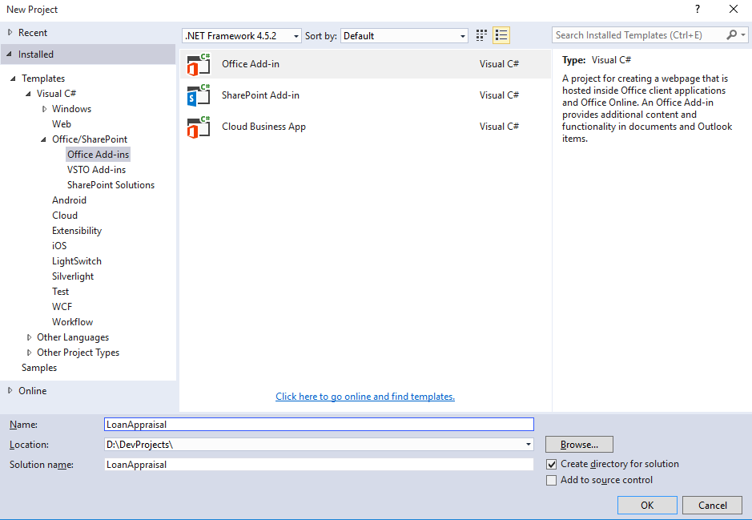

3. When you create a new Add-in for Office project, Visual Studio prompts you with the **Choose the add-in type** page of the **Create Office Add-in** dialog. This is the point where you select the type of Office Add-in you want to create. Leave the default setting with the radio button titled **Add new functionalities to Excel** and select **Finish** to continue. 

	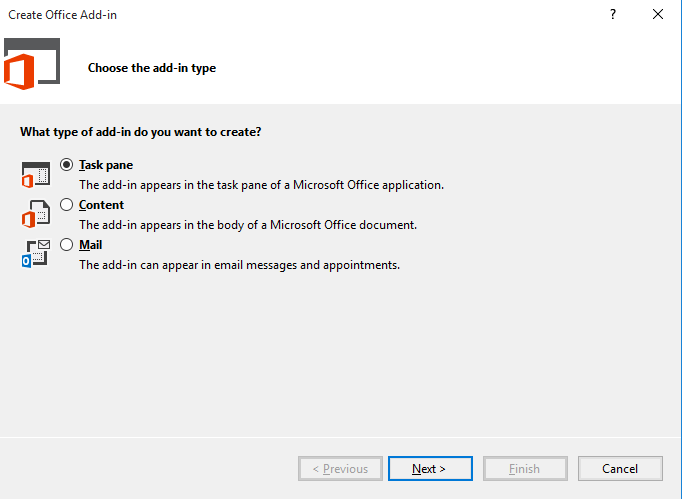

4. Take a look at the structure of the new Visual Studio solution once it has been created. At a high-level, the new solution has been created using two Visual Studio projects named **LoanAppraisal** and **LoanAppraisalWeb**. You should also observe that the top project contains a top-level manifest for the Add-in named **LoanAppraisalManifest** which contains a single file named **LoanAppraisal.xml**.  

	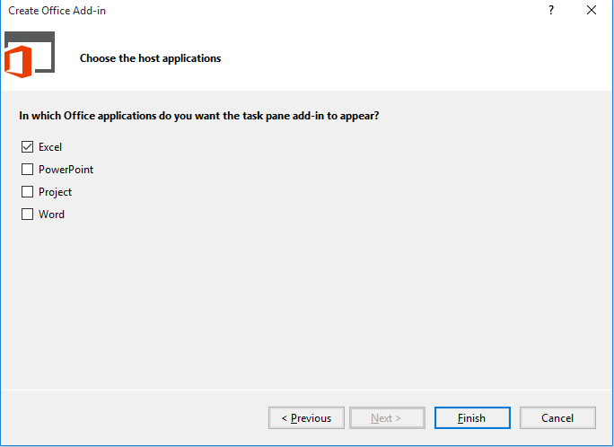

5. In the Solution Explorer, double-click on the node named **LoanAppraisalManifest** to open the add-in manifest file, find the XML block that looks like this. Take a minute and read through it as it describes how add-ins can integrate with the Office UI. The example below demonstrates how an add-in can add a button to the Excel ribbon's Home tab.  

	```xml
      <ExtensionPoint xsi:type="PrimaryCommandSurface">
        <!-- Use OfficeTab to extend an existing Tab. Use CustomTab to create a new tab. -->
        <OfficeTab id="TabHome">
          <!-- Ensure you provide a unique id for the group. Recommendation for any IDs is to namespace using your company name. -->
          <Group id="Contoso.Group1">
            <!-- Label for your group. resid must point to a ShortString resource. -->
            <Label resid="Contoso.Group1Label" />
            <!-- Icons. Required sizes 16,32,80, optional 20, 24, 40, 48, 64. Strongly recommended to provide all sizes for great UX. -->
            <!-- Use PNG icons. All URLs on the resources section must use HTTPS. -->
            <Icon>
              <bt:Image size="16" resid="Contoso.tpicon_16x16" />
              <bt:Image size="32" resid="Contoso.tpicon_32x32" />
              <bt:Image size="80" resid="Contoso.tpicon_80x80" />
            </Icon>

            <!-- Control. It can be of type "Button" or "Menu". -->
            <Control xsi:type="Button" id="Contoso.TaskpaneButton">
              <Label resid="Contoso.TaskpaneButton.Label" />
              <Supertip>
                <!-- ToolTip title. resid must point to a ShortString resource. -->
                <Title resid="Contoso.TaskpaneButton.Label" />
                <!-- ToolTip description. resid must point to a LongString resource. -->
                <Description resid="Contoso.TaskpaneButton.Tooltip" />
              </Supertip>
              <Icon>
                <bt:Image size="16" resid="Contoso.tpicon_16x16" />
                <bt:Image size="32" resid="Contoso.tpicon_32x32" />
                <bt:Image size="80" resid="Contoso.tpicon_80x80" />
              </Icon>

              <!-- This is what happens when the command is triggered (E.g. click on the Ribbon). Supported actions are ExecuteFunction or ShowTaskpane. -->
              <Action xsi:type="ShowTaskpane">
                <TaskpaneId>ButtonId1</TaskpaneId>
                <!-- Provide a URL resource id for the location that will be displayed on the task pane. -->
                <SourceLocation resid="Contoso.Taskpane.Url" />
              </Action>
            </Control>
          </Group>
        </OfficeTab>
      </ExtensionPoint>
    ```

6. Let's modify the button to say "Loan Appraisal" instead of "Show Taskpane". Find the following element in the file.

	```XML
	<Title resid="Contoso.TaskpaneButton.Label" />
	```
7. This indicates that the label of the title is stored in a string resource named **Contoso.TaskpaneButton.Label**.
8. Scroll down until you find the **ShortString** string resource with that label.
9. Now, set the DefaultValue attribute to *Loan Appraisal*. Your XML should look like this: 

	```XML
	<bt:String id="Contoso.TaskpaneButton.Label" DefaultValue="Loan Appraisal" />
	```

10. Save your changes and press **{F5}** to try your changes. You should see you add-in deploy in Excel and a button appear on the Home Tab.

	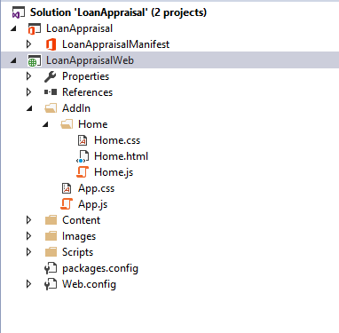


## Exercise 2: Adding a Test Document to an Office Add-in project & Adding Bindings Between an Add-in and an Excel Workbook
*In this exercise you continue to work on the LoanAppraisal project you created in the previous lab by integrating a preexisting Excel workbook into the development process. You will write code to create bindings on named ranges within the the Excel workbook named TestDoc.xlsx. You will also create event handlers so that the Add-in responds to the user when updating the Add-in user interface.*

1. Ensure that you still have the **LoanAppraisal** Add-in project opened in Visual Studio.
2. Locate [Starter Files](./Starter%20Files)folder, you can find a excel file named **TestDoc.xlsx**. Double-click on **TestDoc.xlsx** to open the workbook in Microsoft Excel.  You should see that the workbook provides mortgage loan information and a chart as shown in the following screen shot.  

	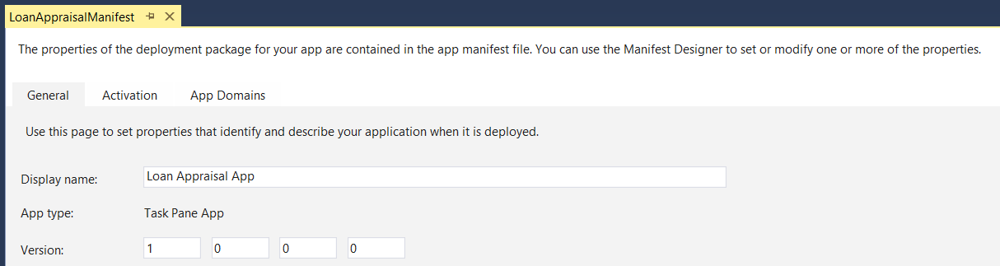  

4. Close **TestDoc.xlsx** and also close Microsoft Excel.
5.	Add the file **TestDoc.xlsx** into the **LoanAppraisal** project. The easiest way to do this is to copy the file to the clipboard in Windows Explorer and then to paste it into the root of the the **LoanAppraisal** project and then include it in the project. When you are done, you should be able to see **TestDoc.xlsx** at the root of the **LoanAppraisal** project right below **LoanAppraisalManifest** as shown in the following screenshot.

	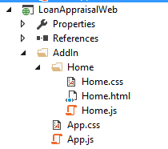  

6.	With the **LoanAppraisal** project selected in the Solution Explorer, locate the properties window and modify the **Start Document** property to **TestDoc.xslx**.  

	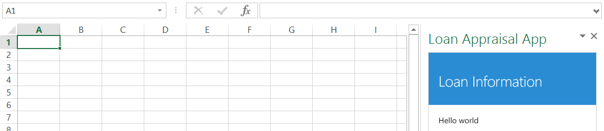  

7. Press **{F5}** to begin a debugging session. You should see that Visual Studio initialize the debugging session with **TestDoc.xlsx** instead of using a new Excel workbook.
8. Stop debugging, now that you have integrated the test document into your project, it is time to move ahead to write code to bind to name ranges in the workbook.
9. The workbook **TestDoc.xlsx** contains several cells that have already been defined as named ranges. Review the following list which shows the names of the Excel named ranges that you will be programming against in this exercise.
	-	**Applicant_Name**
	-	**Loan_Amount**
	-	**Interest_Rate**
	-	**Loan_Duration**
	-	**Monthly_Payment**
	-	**Total_Income**
	-	**Yearly_Mortgage**
	-	**Fixed_Expenses**
	-	**Available_Income**
10. Open **Home.html** file, update the **content-main** div within **Home.html** to match the following HTML layout.

	```html
	<div id="content-main">
        <div class="padding" id="currentApplicantInfo">
            <table>
                <tr>
                    <td colspan="2" class="header_cell">Loan Application Detail</td>
                </tr>
                <tr>
                    <td>Name:</td>
                    <td id="applicant_name">&nbsp;</td>
                </tr>
                <tr>
                    <td>Loan Amount:</td>
                    <td id="loan_amount">&nbsp;</td>
                </tr>
                <tr>
                    <td>Interest Rate:</td>
                    <td id="interest_rate">&nbsp;</td>
                </tr>
                <tr>
                    <td>Load Duration:</td>
                    <td id="loan_duration">&nbsp;</td>
                </tr>
                <tr>
                    <td>Monthy Payment:</td>
                    <td id="monthly_payment">&nbsp;</td>
                </tr>
                <tr>
                    <td colspan="2" class="header_cell">High-level Finanical Summary</td>
                </tr>
                <tr>
                    <td>Total Income:</td>
                    <td id="total_income">&nbsp;</td>
                </tr>
                <tr>
                    <td>Yearly Morgage:</td>
                    <td id="yearly_mortgage">&nbsp;</td>
                </tr>
                <tr>
                    <td>Fixed Expenses:</td>
                    <td id="fixed_expenses">&nbsp;</td>
                </tr>
                <tr>
                    <td>Available Income:</td>
                    <td id="available_income">&nbsp;</td>
                </tr>
            </table>
        </div>
        <div>
            <h3>Interest Rate</h3>
            <div id="selectInterestRate" class="section"></div>
            <h3>Select a loan applicant</h3>
            <div id="selectApplicant" class="section"></div>
        </div>
    </div>
	```

11. Save and close **Home.html**.
12. Open **Home.css** file, replace the contents with the following style.

	```css
	html {
	    position: relative;
	    min-height: 100%;
	}
	
	body {
	    margin: 0 0 40px;
	    background-color: #eee;
	}
	
	.footer {
	    position: absolute;
	    left: 0;
	    bottom: 0;
	    height: 40px;
	    width: 100%;
	}
	
	.padding {
	    padding: 15px;
	}
	
	#notification-popup.ms-MessageBanner {
	    position: absolute;
	    left: 0px;
	    bottom: 0px;
	    text-align: left;
	    height: inherit;
	    min-width: inherit;
	}
	
	#notification-popup .ms-MessageBanner-text {
	    margin: 0;
	    padding: 18px 15px;
	    min-width: inherit;
	}
	
	h3 {
	    margin: 2px;
	}
	
	#currentApplicantInfo {
	    margin: 0px;
	    padding: 0px;
	}
	
	.section {
	    margin: 0px;
	    padding: 0px;
	    padding-top: 2px;
	    padding-bottom: 4px;
	}
	
	    .section input[type="radio"] {
	        margin: 0px;
	        margin-left: 4px;
	        padding: 0px;
	    }
	
	    .section label {
	        margin: 0px;
	        padding: 0px;
	        font-size: 0.8em;
	    }
	
	#currentApplicantInfo table {
	    margin: 0px;
	    width: 100%;
	    box-sizing: border-box;
	    border: 1px solid black;
	    border-collapse: collapse;
	}
	
	    #currentApplicantInfo table td {
	        min-width: 100px;
	        border: 1px solid #ddd;
	        border-collapse: collapse;
	        padding: 2px;
	        padding-left: 4px;
	        background: white;
	        font-size: 1.0em;
	    }
	
	        #currentApplicantInfo table td.header_cell {
	            color: #eee;
	            background-color: navy;
	            font-weight: bold;
	            border: 1px solid black;
	        }
	
	#monthly_payment {
	    color: red;
	}
	```

13. Save and close **Home.css**.
14. Open **Home.js** file and replace the contents with the following code.
	
	```javascript
	/// <reference path="/Scripts/FabricUI/MessageBanner.js" />

	(function () {
	    "use strict";
	
	    var messageBanner;
	
	    // The initialize function must be run each time a new page is loaded.
	    Office.initialize = function (reason) {
	        $(document).ready(function () {
	            // Initialize the FabricUI notification mechanism and hide it
	            var element = document.querySelector('.ms-MessageBanner');
	            messageBanner = new fabric.MessageBanner(element);
	            messageBanner.hideBanner();
	
	        });
	    }
	})();

	```

15. Start a debugging session by pressing the **{F5}** key to inspect the Add-in's new HTML layout. Launch your add-in by clicking the **Loan Appraisal** button on the Ribbon. You should see the user interface appears like the one in the following screen shot.

	    

16.	Close Excel and return to Visual Studio.
17.	Inside **Home.js**, place the cursor under the **"use strict;"** statement at the top of the closure and add the following code. 

	```javascript
	var interestRates = [0.0425, 0.0500, 0.0750];
	var currentRate = interestRates[0];

	var applicants = [
	  { name: "Brian Cox", loan_amount: 100000, loan_duration: 30, total_income: 82000, fixed_expenses: 22000 },
	  { name: "Wendy Wheeler", loan_amount: 325000, loan_duration: 30, total_income: 145000, fixed_expenses: 40000 },
	  { name: "Ken Sanchez", loan_amount: 225000, loan_duration: 30, total_income: 162000, fixed_expenses: 40000 },
	  { name: "Joe Healy", loan_amount: 625000, loan_duration: 30, total_income: 182000, fixed_expenses: 72000 },
	  { name: "Mke Fitzmaurice", loan_amount: 725000, loan_duration: 8, total_income: 320000, fixed_expenses: 120000 },
	  { name: "Chris Sells", loan_amount: 1225000, loan_duration: 15, total_income: 325000, fixed_expenses: 167000 }
	];
	var currentApplicant = applicants[0];
	```

18. After this step is complete, your **Home.js** file should match the following code listing.

	```javascript
	/// <reference path="/Scripts/FabricUI/MessageBanner.js" />
	
	(function () {
	    "use strict";
	    var interestRates = [0.0425, 0.0500, 0.0750];
	    var currentRate = interestRates[0];
	    var applicants = [
	        { name: "Brian Cox", loan_amount: 100000, loan_duration: 30, total_income: 82000, fixed_expenses: 22000 },
	        { name: "Wendy Wheeler", loan_amount: 325000, loan_duration: 30, total_income: 145000, fixed_expenses: 40000 },
	        { name: "Ken Sanchez", loan_amount: 225000, loan_duration: 30, total_income: 162000, fixed_expenses: 40000 },
	        { name: "Joe Healy", loan_amount: 625000, loan_duration: 30, total_income: 182000, fixed_expenses: 72000 },
	        { name: "Mke Fitzmaurice", loan_amount: 725000, loan_duration: 8, total_income: 320000, fixed_expenses: 120000 },
	        { name: "Chris Sells", loan_amount: 1225000, loan_duration: 15, total_income: 325000, fixed_expenses: 167000 }
	    ];
	    var currentApplicant = applicants[0];
	    var messageBanner;
	
	    // The initialize function must be run each time a new page is loaded.
	    Office.initialize = function (reason) {
	        $(document).ready(function () {
	            // Initialize the FabricUI notification mechanism and hide it
	            var element = document.querySelector('.ms-MessageBanner');
	            messageBanner = new fabric.MessageBanner(element);
	            messageBanner.hideBanner();
	
	        });
	    }
	})();
	```

19. Add five new functions named **updateAppUI**, **onInitializeUI**, **formatToCurrencyUSD**, **onRateChanged** and **onApplicantChanged** to the bottom of **Office.initialize** function.

	```javascript	
	/// <reference path="/Scripts/FabricUI/MessageBanner.js" />
	
	(function () {
	    "use strict";
	    var interestRates = [0.0425, 0.0500, 0.0750];
	    var currentRate = interestRates[0];
	    var applicants = [
	        { name: "Brian Cox", loan_amount: 100000, loan_duration: 30, total_income: 82000, fixed_expenses: 22000 },
	        { name: "Wendy Wheeler", loan_amount: 325000, loan_duration: 30, total_income: 145000, fixed_expenses: 40000 },
	        { name: "Ken Sanchez", loan_amount: 225000, loan_duration: 30, total_income: 162000, fixed_expenses: 40000 },
	        { name: "Joe Healy", loan_amount: 625000, loan_duration: 30, total_income: 182000, fixed_expenses: 72000 },
	        { name: "Mke Fitzmaurice", loan_amount: 725000, loan_duration: 8, total_income: 320000, fixed_expenses: 120000 },
	        { name: "Chris Sells", loan_amount: 1225000, loan_duration: 15, total_income: 325000, fixed_expenses: 167000 }
	    ];
	    var currentApplicant = applicants[0];
	    var messageBanner;
	
	    // The initialize function must be run each time a new page is loaded.
	    Office.initialize = function (reason) {
	        $(document).ready(function () {
	            // Initialize the FabricUI notification mechanism and hide it
	            var element = document.querySelector('.ms-MessageBanner');
	            messageBanner = new fabric.MessageBanner(element);
	            messageBanner.hideBanner();
	
	        });
	    }

	function updateAppUI() {
	}

	function onInitializeUI() {
	}

	function formatToCurrencyUSD(amount) {
	}

	function onRateChanged() {
	}

	function onApplicantChanged() {
	}
	})();
	```

20. Implement the **updateAppUI** function using the following code.

	```javascript
	function updateAppUI() {
	    $("#applicant_name").text(currentApplicant.name);
	    $("#loan_amount").text(formatToCurrencyUSD(currentApplicant.loan_amount));
	    $("#interest_rate").text((currentRate * 100) + "%");
	    $("#loan_duration").text(currentApplicant.loan_duration + " years");
	    $("#total_income").text(formatToCurrencyUSD(currentApplicant.total_income));
	    $("#fixed_expenses").text(formatToCurrencyUSD(currentApplicant.fixed_expenses));
	}
	```

21. Implement the **onInitializeUI** function using the following code.

	```javascript
	function onInitializeUI() {
	    var divRates = $("#selectInterestRate");
	    divRates.empty();

	    for (var i = 0; i < interestRates.length; ++i) {
	        var rate = interestRates[i];
	        divRates.append($('<input>', { type: 'radio', name: 'rate', value: rate }));
	        var formatedRate = (rate * 100).toFixed(2) + "%";
	        divRates.append($('<label>').text(formatedRate));
	        divRates.append($("<br>"));
	    }

	    var divApplicants = $("#selectApplicant");
	    divApplicants.empty();

	    for (i = 0; i < applicants.length; ++i) {
	        var name = applicants[i].name;
	        divApplicants.append($('<input>', { type: 'radio', name: 'Applicant', value: i }));
	        divApplicants.append($('<label>').text(applicants[i].name));
	        divApplicants.append($("<br>"));
	    }

	    $("#selectInterestRate :first-child").attr("checked", "checked");
	    $("#selectApplicant :first-child").attr("checked", "checked");

	    $("input[name='rate']").click(onRateChanged);
	    $("input[name='Applicant']").click(onApplicantChanged);

	    updateAppUI();
	}
	```

22. Implement the **formatToCurrencyUSD** function using the following code.

	```javascript
	function formatToCurrencyUSD(amount) {
	    var sign; var cents; var i;
	    amount = amount.toString().replace(/\$|\,/g, '');
	    if (isNaN(amount)) { amount = "0"; }
	    sign = (amount == (amount = Math.abs(amount)));
	    amount = Math.floor(amount * 100 + 0.50000000001);
	    cents = amount % 100;
	    amount = Math.floor(amount / 100).toString();
	    if (cents < 10) {
	        cents = '0' + cents;
	    }
	    for (i = 0; i < Math.floor((amount.length - (1 + i)) / 3) ; i++) {
	        amount = amount.substring(0, amount.length - (4 * i + 3)) + ',' + amount.substring(amount.length - (4 * i + 3));
	    }
	    return (((sign) ? '' : '-') + '$' + amount + '.' + cents);
	}
	```

23. Implement the **onRateChanged** and **onApplicantChanged** functions using the following code.

	```javascript
	function onRateChanged() {
	    var rate = parseFloat($(this).attr("value"));
	    currentRate = rate;
	    updateAppUI();
	}

	function onApplicantChanged() {
	    var applicant = applicants[parseInt(this.value)];
	    currentApplicant = applicant;
	    updateAppUI();
	}
	```

24. Modify the Add-in's initialization code to call the **onInitializeUI** function. 

	```javascript
	// The initialize function must be run each time a new page is loaded.
    Office.initialize = function (reason) {
        $(document).ready(function () {
            // Initialize the FabricUI notification mechanism and hide it
            var element = document.querySelector('.ms-MessageBanner');
            messageBanner = new fabric.MessageBanner(element);
            messageBanner.hideBanner();

            onInitializeUI();
        });
    }
	```

25. Now it's again time to test the Add-in in the Visual Studio. Press the **{F5}** key and wait for the debugging session and the Add-in to initialize. Once the Add-in has activated, you should be able to see it is displaying information about a loan for the current applicant as shown in the following screen shot. Also note that the UI for the Add-in will automatically update when you change the interest rate or the loan applicant.  

	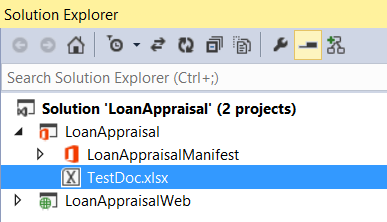  

26. Close Excel and return to Visual Studio.
27. Inside **Home.js** directly below the **onApplicantChanged** function, add six new functions named **createBindings**, **onAllBindingCreated**, **updateBindingsToDocument**, **onBindingUpdated**, **updateBindingsFromDocument** and **onBindingReadFromDocument**.

	```javascript
	function createBindings() {
	}

	function onAllBindingCreated(asyncResult) {
	}

	function updateBindingsToDocument() {
	}

	function onBindingUpdated(asncResult) {
	}

	function updateBindingsFromDocument() {
	}

	function onBindingReadFromDocument(asyncResult) {
	}
	```

28. Implement the **createBindings** function using the following code.

	```javascript
	function createBindings() {	
        var bindings = Office.context.document.bindings;
	    bindings.addFromNamedItemAsync("Sheet1!Applicant_Name", "text",
	                                    { id: "applicant_name" }, function () { });
	
	    bindings.addFromNamedItemAsync("Sheet1!Loan_Amount", "text",
	                                   { id: "loan_amount" }, function () { });
	
	    bindings.addFromNamedItemAsync("Sheet1!Interest_Rate", "text",
	                                   { id: "interest_rate" }, function () { });
	
	    bindings.addFromNamedItemAsync("Sheet1!Loan_Duration", "text",
	                                   { id: "loan_duration" }, function () { });
	
	    bindings.addFromNamedItemAsync("Sheet1!Monthly_Payment", "text",
	                                   { id: "monthly_payment" }, function () { });
	
	    bindings.addFromNamedItemAsync("Sheet1!Total_Income", "text",
	                                   { id: "total_income" }, function () { });
	
	    bindings.addFromNamedItemAsync("Sheet1!Yearly_Mortgage", "text",
	                                   { id: "yearly_mortgage" }, function () { });
		
	    bindings.addFromNamedItemAsync("Sheet1!Fixed_Expenses", "text",
	                                   { id: "fixed_expenses" }, function () { });
	
	    bindings.addFromNamedItemAsync("Sheet1!Available_Income", "text",
	                                   { id: "available_income" }, onAllBindingCreated);
	}
	```

29. Implement the **onAllBindingCreated** function using the following code.

	```javascript		
	function onAllBindingCreated(asyncResult) {
	    updateBindingsToDocument();
	}
	```

30. Implement the **updateBindingsToDocument** function using the following code.

	```javascript
	function updateBindingsToDocument() {
		Office.select("bindings#applicant_name")
		        .setDataAsync(currentApplicant.name, function () { });
		
		Office.select("bindings#loan_amount")
		        .setDataAsync(currentApplicant.loan_amount, function () { });
		
		Office.select("bindings#interest_rate")
		        .setDataAsync(currentRate, function () { });
		
		Office.select("bindings#loan_duration")
		        .setDataAsync(currentApplicant.loan_duration, function () { });
		
		Office.select("bindings#total_income")
		        .setDataAsync(currentApplicant.total_income, function () { });
		
		Office.select("bindings#fixed_expenses")
		        .setDataAsync(currentApplicant.fixed_expenses, onBindingUpdated);
	}
	```

31. Implement the **onBindingUpdated** function using the following code.

	````javascript
	function onBindingUpdated(asncResult) {
	    updateBindingsFromDocument();
	}
	````

32. Implement the **updateBindingsFromDocument** function using the following code.

	```javascript
	function updateBindingsFromDocument() {		
	    Office.select("bindings#monthly_payment")
	          .getDataAsync({
	              asyncContext: "monthly_payment",
	              valueFormat: Office.ValueFormat.Formatted
	          }, onBindingReadFromDocument);
	
	    Office.select("bindings#yearly_mortgage")
	          .getDataAsync({
	              asyncContext: "yearly_mortgage",
	              valueFormat: Office.ValueFormat.Formatted
	          }, onBindingReadFromDocument);
	
	    Office.select("bindings#available_income")
	          .getDataAsync({
	              asyncContext: "available_income",
	              valueFormat: Office.ValueFormat.Formatted
	          }, onBindingReadFromDocument);
	}
	```

33. Implement the **onBindingReadFromDocument** function using the following code.

	```javascript
	function onBindingReadFromDocument(asyncResult) {
	    var value = asyncResult.value;
	    var targetDiv = "#" + asyncResult.asyncContext;
	    $(targetDiv).text(value);
	}
	```

34. Update both the **onRateChanged** and **onApplicantChanged** functions so that each of these functions calls **updateBindingsToDocument**.
		
	````javascript
	function onRateChanged() {
	    var rate = parseFloat($(this).attr("value"));
	    currentRate = rate;
	    updateAppUI();
	    updateBindingsToDocument();
	}
	
	function onApplicantChanged() {
	    var applicant = applicants[parseInt(this.value)];
	    currentApplicant = applicant;
	    updateAppUI();
	    updateBindingsToDocument();
	}
	````

35. Modify the Add-in's initialization code to call the **createBindings** function just after calling **onInitializeUI**. 

	```javascript
    // The initialize function must be run each time a new page is loaded.
    Office.initialize = function (reason) {
        $(document).ready(function () {
            // Initialize the FabricUI notification mechanism and hide it
            var element = document.querySelector('.ms-MessageBanner');
            messageBanner = new fabric.MessageBanner(element);
            messageBanner.hideBanner();

            onInitializeUI();
            createBindings(); 
        });
    }
	```

36. Now it's again time to test the Add-in in the Visual Studio. Press the **{F5}** key and wait for the debugging session and the Add-in to initialize. Once the Add-in has activated, test how the Add-in behaves when you change the Interest Rate or the Loan Applicant using the radio button at the bottom of the task pane. You should see that the Add-in updates information in the workbook and then retrieves values from the workbook for Monthly Payment and Yearly Mortgage and updates the UI in the task pane.

	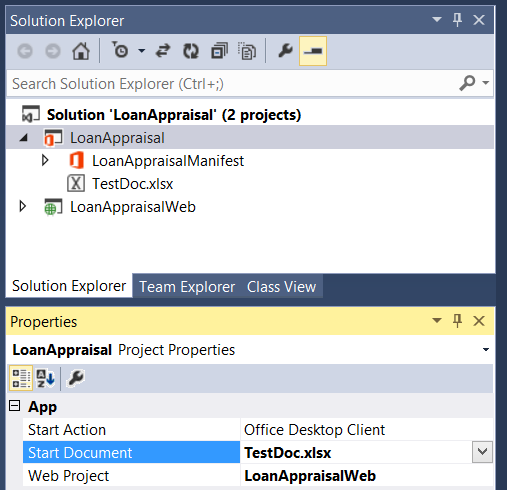  

Congratulations! In exercise you wrote code to create bindings on named ranges within the Excel workbook named TestDoc.xlsx. You also created event handlers so that the Add-in responds to the user when interacting with the Add-in user interface.

## Part 2: Host-specific - APIs that were introduced with Office 2016
Host-specific - APIs that were introduced with Office 2016. This object model provides host-specific strongly-typed objects that correspond to familiar objects that you see when you use Office clients, and represents the future of Office JavaScript APIs. The host-specific APIs currently include the [Word JavaScript API](https://dev.office.com/reference/add-ins/word/word-add-ins-reference-overview) and the [Excel JavaScript API](https://dev.office.com/reference/add-ins/excel/application). In this part, we will introduce Excel JavaScript API.

## Exercise 3: Leverage the Excel JavaScript API
In this exercise you will create a Excel Add-in that uses the Excel JavaScript API included in Excel 2016. 

1. Launch Visual Studio 2017, select **File | New | Project**. Expand **Templates**, **Visual C#**, **Office/SharePoint** ,**Add-ins**. Select **Excel Web Add-in**. Name the project **ExpenseReport** and click **OK**.  
2. When you create a new Add-in for Office project, Visual Studio prompts you with the **Choose the add-in type** page of the **Create Office Add-in** dialog. This is the point where you select the type of Office Add-in you want to create. Leave the default setting with the radio button titled **Add new functionalities to Excel** and select **Finish** to continue. 
3. Now update the user interface for the Add-in:
	1. Locate the `<body>` section of the page within the `home.html` file.
	1. Replace the entire contents of the **content-main** div with the following markup:

		```html
		<div id="content-main">
	        <div class="padding">
	            <br />
	            <button class="ms-Button ms-Button--primary" id="addRange">
	                <span class="ms-Button-icon"><i class="ms-Icon ms-Icon--plus"></i></span>
	                <span class="ms-Button-label" id="button-text">Add Range of Data</span>
	                <span class="ms-Button-description" id="button-desc">Add Range of Data</span>
	            </button>
	            <br />
	            <br />
	            <button class="ms-Button ms-Button--primary" id="addFormattedData">
	                <span class="ms-Button-icon"><i class="ms-Icon ms-Icon--plus"></i></span>
	                <span class="ms-Button-label" id="button-text">Add Formatted Data Range</span>
	                <span class="ms-Button-description" id="button-desc">Add Formatted Data Range</span>
	            </button>
	            <br />
	            <br />
	            <button class="ms-Button ms-Button--primary" id="insertData">
	                <span class="ms-Button-icon"><i class="ms-Icon ms-Icon--plus"></i></span>
	                <span class="ms-Button-label" id="button-text">Insert Data</span>
	                <span class="ms-Button-description" id="button-desc">Inseart Data, add a table and adjust layout</span>
	            </button>
	            <br />
	            <br />
	            <button class="ms-Button ms-Button--primary" id="sort">
	                <span class="ms-Button-icon"><i class="ms-Icon ms-Icon--plus"></i></span>
	                <span class="ms-Button-label" id="button-text">Sort</span>
	                <span class="ms-Button-description" id="button-desc">Sort my data based on transaction date</span>
	            </button>
	            <br />
	            <br />
	            <button class="ms-Button ms-Button--primary" id="filter">
	                <span class="ms-Button-icon"><i class="ms-Icon ms-Icon--plus"></i></span>
	                <span class="ms-Button-label" id="button-text">Filter</span>
	                <span class="ms-Button-description" id="button-desc">Only show my transtions in fuel and education</span>
	            </button>
	            <br />
	            <br />
	            <button class="ms-Button ms-Button--primary" id="report">
	                <span class="ms-Button-icon"><i class="ms-Icon ms-Icon--plus"></i></span>
	                <span class="ms-Button-label" id="button-text">Report</span>
	                <span class="ms-Button-description" id="button-desc">Create a report on my spending and Protect the report </span>
	            </button>
	        </div>
	    </div>
		```

4. The next step is to code the business logic for the add-in.
	1. Locate the **Home.js** file.
	1. Remove all the sample code except the add-in initialization code so all that is left is the following:

		```javascript
		/// <reference path="/Scripts/FabricUI/MessageBanner.js" />
		
		(function () {
		    "use strict";

		    var messageBanner;
		
		    // The initialize function must be run each time a new page is loaded.
		    Office.initialize = function (reason) {
		        $(document).ready(function () {
		            // Initialize the FabricUI notification mechanism and hide it
		            var element = document.querySelector('.ms-MessageBanner');
		            messageBanner = new fabric.MessageBanner(element);
		            messageBanner.hideBanner();
		
		            // attach click handlers to the word document
		
		        });
		    }
		
		
		    // Helper function for treating errors
		    function errorHandler(error) {
		        // Always be sure to catch any accumulated errors that bubble up from the Excel.run execution
		        showNotification("Error", error);
		        console.log("Error: " + error);
		        if (error instanceof OfficeExtension.Error) {
		            console.log("Debug info: " + JSON.stringify(error.debugInfo));
		        }
		    }
		
		    // Helper function for displaying notifications
		    function showNotification(header, content) {
		        $("#notification-header").text(header);
		        $("#notification-body").text(content);
		        messageBanner.showBanner();
		        messageBanner.toggleExpansion();
		    }
		})();

		```

5. Inside **Home.js** , add six new functions named **addRange**, **addFormattedData**, **insertData**, **sort**, **filter** and **report** to the bottom of **Office.initialize** function.

	```javascript
	function addRange() {
	}

	function addFormattedData() {
	}

	function insertData() {
	}

	function sort(asncResult) {
	}

	function filter() {
	}

	function report(asyncResult) {
	}
	```
6. At the end of the app initialization code, add button click event handler.

	```javascript
    $('#addRange').click(addRange);
    $('#addFormattedData').click(addFormattedData);
    $('#insertData').click(insertData);
    $('#sort').click(sort);
    $('#filter').click(filter);
    $('#report').click(report);
	```
7. Now **Office.initialize** function should look like as the following:

	```javascript
	// The initialize function must be run each time a new page is loaded.
    Office.initialize = function (reason) {
        $(document).ready(function () {
            // Initialize the FabricUI notification mechanism and hide it
            var element = document.querySelector('.ms-MessageBanner');
            messageBanner = new fabric.MessageBanner(element);
            messageBanner.hideBanner();

            $('#addRange').click(addRange);
            $('#addFormattedData').click(addFormattedData);
            $('#insertData').click(insertData);
            $('#sort').click(sort);
            $('#filter').click(filter);
            $('#report').click(report);
        });
    }
	```
8. Implement the **addRange** function using the following code.

	```javascript
    function addRange() {
        var context = new Excel.RequestContext();
        Excel.run(function (context) {
            var currentWorksheet = context.workbook.worksheets.getActiveWorksheet();
            var worksheets = context.workbook.worksheets.load();
            return context.sync().then(function () {
                var worksheetList = [];
                worksheetList.push(['Worksheets in the Workbook']);
                for (var i = 0; i < worksheets.items.length; i++) {
                    worksheetList.push([worksheets.items[i].name]);
                };
                var rangeSpec = "A1:A" + worksheetList.length;
                var range = currentWorksheet.getRange(rangeSpec);
                range.values = worksheetList;
                context.sync().then(function () { }, errorHandler);
            }, errorHandler);
        }).catch(function (error) {
            console.log('Error: ' + JSON.stringify(error));
            if (error instanceof OfficeExtension.Error) {
                console.log('Debug info: ' + JSON.stringify(error.debugInfo));
            }
        });
    }
	```

9. Implement the **addFormattedData** function using the following code.

	```javascript
    function addFormattedData() {
        var context = new Excel.RequestContext();
        Excel.run(function (context) {
            var rangeAddress = "C3:E5";
            var values = [
                ['Expense', 'Date', 'Amount'],
                ['Lunch', '7/15/2015', 45.98],
                ['Taxi', '7/15/2015', 18.22]
            ];
            var formats = [
                [null, null, null],
                [null, 'mmmm dd, yyyy', '$#,##0.00'],
                [null, 'mmmm dd, yyyy', '$#,##0.00']
            ];

            var range = context.workbook.worksheets.getActiveWorksheet().getRange(rangeAddress);
            range.numberFormat = formats;
            range.values = values;
            range.load();
            context.sync().then(function () { }, errorHandler);
        }).catch(function (error) {
            console.log('Error: ' + JSON.stringify(error));
            if (error instanceof OfficeExtension.Error) {
                console.log('Debug info: ' + JSON.stringify(error.debugInfo));
            }
        });
    }
	```

10. Implement the **insertData** function using the following code.

	```javascript
	function insertData() {
        Excel.run(function (ctx) {
            var sheet = ctx.workbook.worksheets.add("Data");
            sheet.activate();
            var range = sheet.getRange("A1:E11");
            range.values = [[
                "Date",
                "Merchant",
                "Category",
                "Sub-Category",
                "Amount"],
            [
                "01/12/2014",
                "WHOLE FOODS MARKET",
                "Merchandise & Supplies",
                "Groceries",
                "84.99"
            ],
            [
                "01/13/2014",
                "COSTCO GAS",
                "Transportation",
                "Fuel",
                "52.20"
            ],
            [
                "01/13/2014",
                "COSTCO WHOLESALE",
                "Merchandise & Supplies",
                "Wholesale Stores",
                "163.67"
            ],
            [
                "01/13/2014",
                "ITUNES",
                "Merchandise & Supplies",
                "Internet Purchase",
                "9.83"
            ],
            [
                "01/13/2014",
                "SMITH BROTHERS FARMS INC",
                "Merchandise & Supplies",
                "Groceries",
                "21.45"
            ],
            [
                "01/14/2014",
                "SHELL",
                "Transportation",
                "Fuel",
                "44.00"
            ],
            [
                "01/14/2014",
                "WHOLE FOODS MARKET",
                "Merchandise & Supplies",
                "Groceries",
                "17.98"
            ],
            [
                "01/15/2014",
                "BRIGHT EDUCATION SERVICES",
                "Other",
                "Education",
                "59.92"
            ],
            [
                "01/15/2014",
                "BRIGHT EDUCATION SERVICES",
                "Other",
                "Education",
                "59.92"
            ],
            [
                "01/17/2014",
                "SMITH BROTHERS FARMS INC-HQ",
                "Merchandise & Supplies",
                "Groceries",
                "21.45"
            ]];
            range.getEntireColumn().format.autofitColumns();
            range.getEntireRow().format.autofitRows();

            var table = ctx.workbook.tables.add("Data!A1:E11", true);
            return ctx.sync().then(function () {
            });
        }).catch(errorHandler);
    }
	```

11. Implement the **sort** function using the following code.

	```javascript
	function sort() {
        Excel.run(function (ctx) {
            var sheet = ctx.workbook.worksheets.getItem("Data");
            sheet.activate();
            var sortRange = sheet.getRange("A1:E1").getEntireColumn().getUsedRange();
            sortRange.sort.apply([
                {
                    key: 0,
                    ascending: false,
                },
            ]);
            return ctx.sync().then(function () {
            })
        }).catch(errorHandler);
    }
	```

12. Implement the **filter** function using the following code.

	```javascript
    function filter() {
        Excel.run(function (ctx) {
            var sheet = ctx.workbook.worksheets.getItem("Data");
            sheet.activate();
            var table = sheet.tables.getItemAt(0);
            var filter = table.columns.getItemAt(3).filter;
            filter.applyValuesFilter(["Fuel", "Education"]);
            return ctx.sync().then(function () {
            })
        }).catch(errorHandler);
    }
	```

13. Implement the **report** function using the following code.

	```javascript
    function report() {
        Excel.run(function (ctx) {
            var sheet = ctx.workbook.worksheets.add("Summary");
            sheet.activate();
            var sumRange = sheet.getRange("A1:B6");
            sumRange.values = [['Category', 'Total'],
            ['Groceries', '=SUMIF( Data!D2:D100, "Groceries", Data!E2:E100 )'],
            ['Fuel', '=SUMIF( Data!D2:D100, "Fuel", Data!E2:E100 )'],
            ['Wholesale Store', '=SUMIF( Data!D2:D100, "Wholesale Stores", Data!E2:E100 )'],
            ['Internet Purchase', '=SUMIF( Data!D2:D100, "Internet Purchase", Data!E2:E100 )'],
            ['Education', '=SUMIF( Data!D2:D100, "Education", Data!E2:E100 )']];

            ctx.workbook.tables.add("Summary!A1:B6", true);
            var chartRange = sheet.getRange("A1:B6");
            var chart = ctx.workbook.worksheets.getItem("Summary").charts.add("Pie", chartRange);
            chart.title.text = "Spending based on catagory";
            sheet.protection.protect();
            return ctx.sync().then(function () {

            })
                .then(ctx.sync);
        }).catch(errorHandler);
    }
	```

14. Now start a debugging session by pressing the **{F5}**, launch your add-in by clicking the **Show Taskpane** button on the Ribbon. **ExpenseReport** add-in is shown in the following screen shot.

	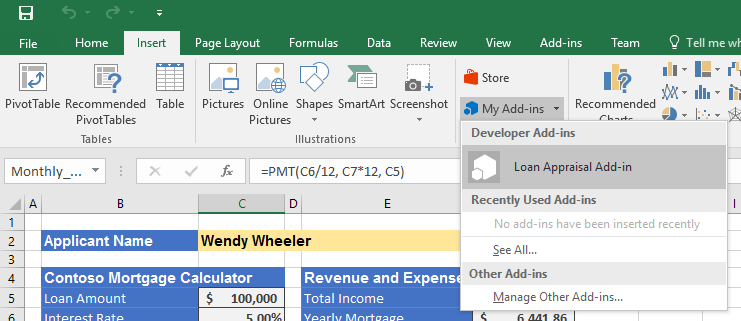  

15. Now, make sure you have a few worksheets in the workbook and then click the button **Add Range of Data**.
	> Notice how Excel creates a list of all the worksheets starting with cell **A1** in the current worksheet, but it adds a title to the worksheet at the top.

	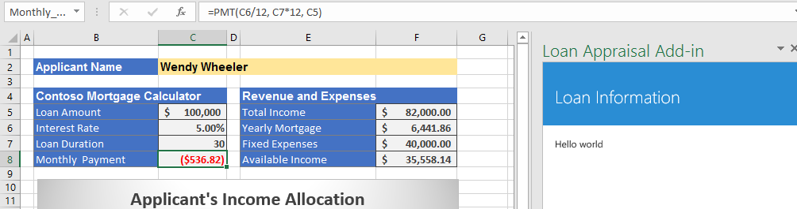 

16. Click the button **Add Formatted Data Range**.
	> Notice how Excel creates a new table of data in the middle of the worksheet, but the dates and currency values are formatted accordingly.

	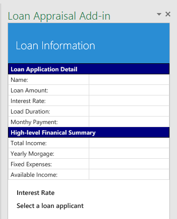

17. Click the button **Insert Data**.
	> Notice how Excel creates a new worksheet named "Data", inserted my transaction data and added a table on top of sheet.

	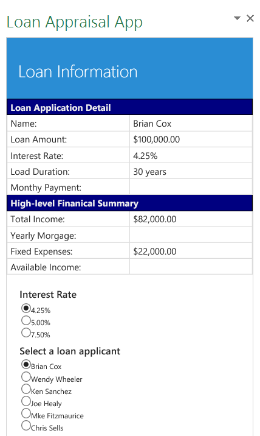

18. Click the button **Sort**.
	> Notice how Excel sorted my transactions based on date, the latest transaction is on top now.

	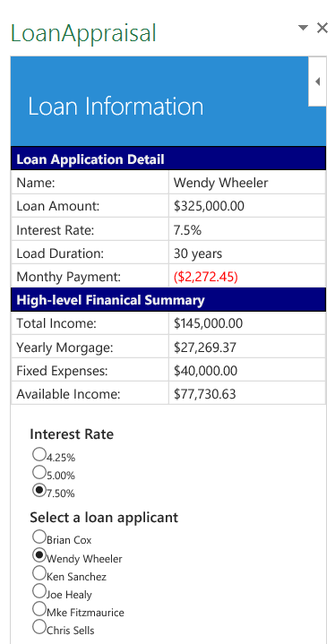

19. Click the button **Filter**.
	> Notice how Excel filtered my transactions based on sub-category, now only transactions under Education and Fuel are shown.

	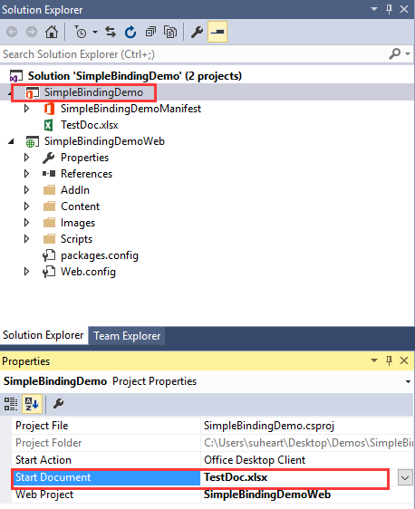

20. Finally, click the button **Report**.
	> Notice how Excel summarized my transactions with formulas and created a pie chart to visualize my spending.

	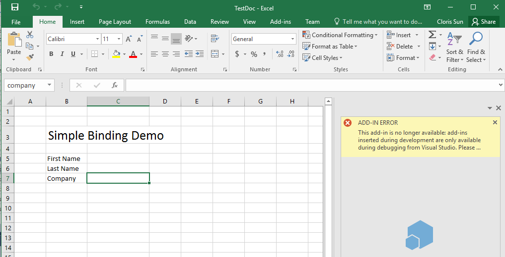
	
**Congratulations! You've now written an Excel add-in that uses the new Excel JavaScript API.**