# Deep Dive into OAuth with SharePoint Add-ins
In this lab, you will create add-ins that use different approaches for OAuth authentication and examine the process flow. You will explore two different OAuth flows for obtaining an access token: the Authorization Code flow and the Client Credentials flow.

## Prerequisites
1. You must have an Office 365 tenant and Microsoft Azure subscription to complete this lab. If you do not have one, the lab for **O3651-7 Setting up your Developer environment in Office 365** shows you how to obtain a trial.
1. You must have [Fiddler](http://www.telerik.com/fiddler) installed.
1. This lab requires you to use multiple starter files or an entire starter project from the GitHub location. You can either download the whole repo as a zip or clone the repo https://github.com/OfficeDev/TrainingContent.git for those familiar with git.

## Exercise 1: Authorization Code Flow - OAuth in a Provider-Hosted Add-In 
In this exercise you create a new provider-hosted add-in and examine the OAuth Authorization Code flow.

1. Create the new solution in Visual Studio 2013:
  1. Launch **Visual Studio 2013** as administrator. 
  1. In Visual Studio select **File/New/Project**.
  1. In the New Project dialog:
    1. Select **Templates/Visual C#/Office/SharePoint/Apps**.
    1. Click **App for SharePoint 2013**.
    1. Name the new project **ProviderHostedOAuth** and click **OK**.

      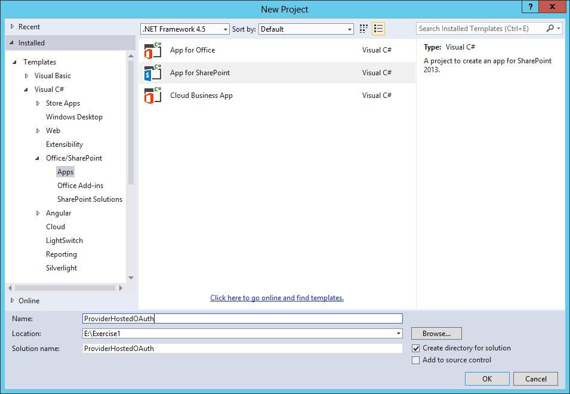

  1. In the **New App for SharePoint** wizard:
    1. Enter the address of a SharePoint site to use for testing the add-in (**NOTE:** The targeted site must be based on a Developer Site template)
    1. Select **Provider-Hosted** as the hosting model.
    1. Click **Next**.

      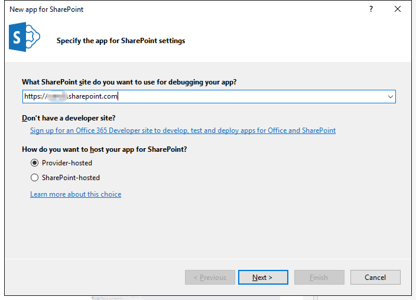

    1. Select **ASP.NET MVC Web Application**.
    1. Click **Next**.

      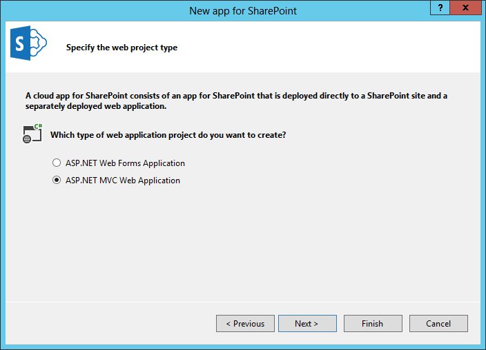

    1. Select the option labeled **Use Windows Azure Access Control Service (for SharePoint cloud add-ins)**.
    1. Click **Finish**.

      

    1. When prompted, log in using your Office 365 administrator credentials.
    1. After the new project is created, set breakpoints in **HomeController.cs** as shown.

      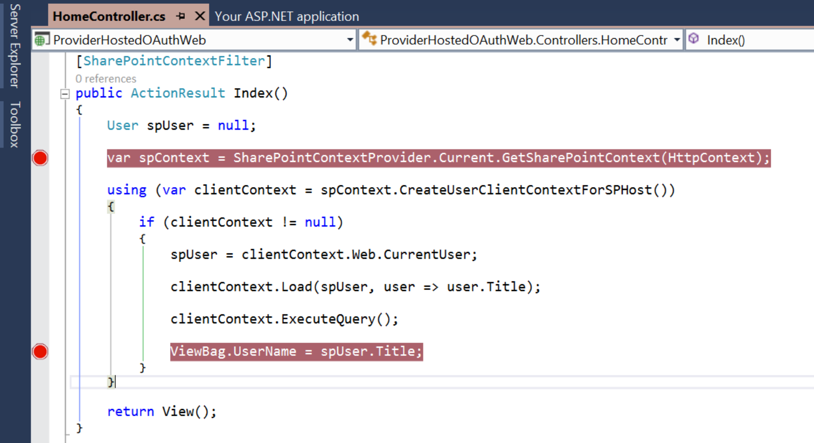

1. Start **Fiddler** to capture web traffic from your add-in.
  1. In Fiddler click **Tools/Fiddler Options**.
  1. Click **HTTPS**.
  1. Check the box entitled **Decrypt HTTPS Traffic**.
  1. When warned, click **Yes** to trust the Fiddler root certificate.
  1. Confirm any additional dialog boxes to install the certificate.
  1. Click **OK** to close the options dialog.
1. Debug the add-in by pressing **F5** in Visual Studio 2013.
  1. When prompted, sign into Office 365.
  1. When prompted, click **Trust It**.

    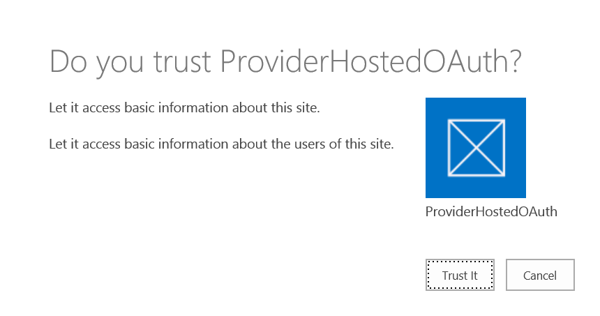

  1. When the first breakpoint is hit, look for the session in Fiddler near the bottom of the list.

    

  1. Right click the session and select **View in New Window**.
  1. Click the **Web Forms** tab.

    > Notice that SharePoint has included the SPHostUrl, SPLanguage, SPClientTag, and SPProductNumber query string parameters in the initial call. These are known as the **Standard Tokens**.

  1. Notice that the context token is included in the body as **SPAppToken**.
 
    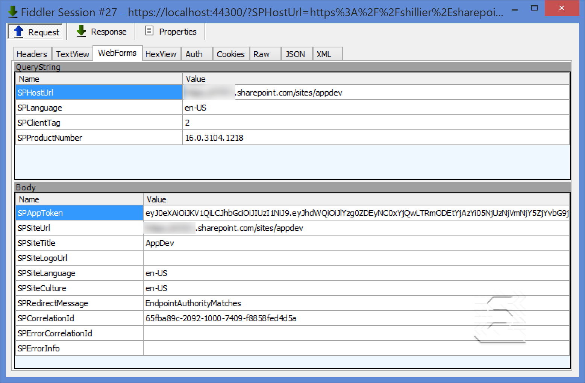
 
  1. Close the window.
  1. Return to Visual Studio, and press **F5** to continue debugging.
  1. When the second breakpoint is hit, look for the session in Fiddler near the bottom of the list.

    

  1. Right click the session and select **View in New Window**.
  1. Click the **Headers** tab and examine the access token in the **Cookies/Login** section.

    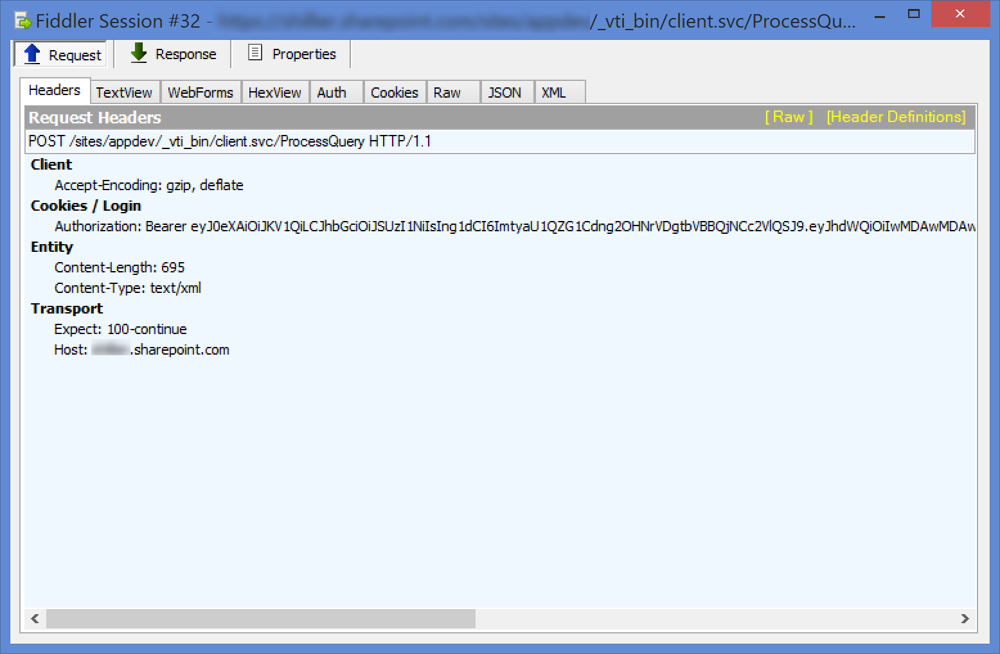

  1. Return to Visual Studio, and press **F5** to continue debugging.
  1. With the add-in still running, open a new browser window to **/_layouts/15/AppPrincipals.aspx**.
  1. Look for **ProviderHostedOAuth** in the list of registered add-ins to confirm that the add-in was registered during debugging.
  1. Stop debugging.

In this exercise you created a new provider-hosted add-in and examined the OAuth Authorization Code flow.

## Exercise 2: Authorization Code Flow - OAuth with the Office 365 APIs 
In this exercise you create a new web application and examine the OAuth Authorization Code flow.

1. Create the new solution in Visual Studio 2013:
  1. Launch **Visual Studio 2013** as administrator. 
  1. In Visual Studio select **File/New/Project**.
  1. In the New Project dialog:
    1. Select **Templates/Visual C#/Web**.
    1. Click **ASP.NET Web Application**.
    1. Name the new project **OfficeOAuth** and click **OK**.

      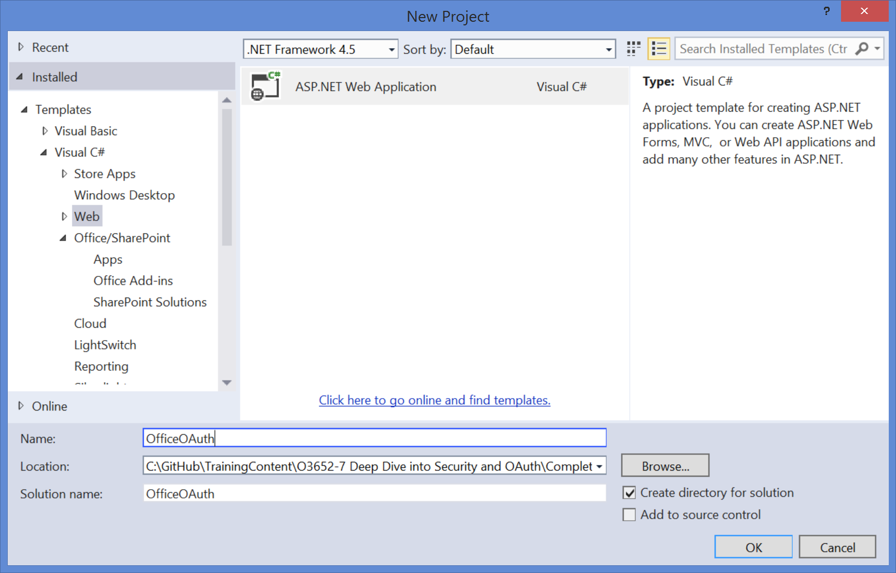

  1. In the **New ASP.NET Project** dialog, select **Web API**.
  1. Check **Host in the Cloud**.
  1. Click **Change Authentication**.
  1. In the **Change Authentication** dialog:
    1. Click **No Authentication**.
    1. Click **OK**.
  1. Click **OK**.

    

  1. If prompted, sign into **Microsoft Azure**.

    

  1. When the **Configure Windows Azure Sites Settings** dialog appears, make appropriate selections for your project.
  1. Click **OK**.
1. If you do not have the **Office 365 API Tools** installed:
  1. Click **Tools/Extensions and Updates**.
  1. In the **Extensions and Updates" dialog, click **Online**.
  1. Click **Visual Studio Gallery**.
  1. Type **Office 365** in the search box.
  1. Click **Office 365 API Tools - Preview**.
  1. Click **Install**.
1. Add an Office 365 connection
  1. Right click the **OfficeOAuth** project and select **Add/Connected Service**.
  1. In the **Services Manager** dialog, click **Sign In**.
  1. Sign in with your managed account.
  1. Click **Calendar**.
  1. Click **Permissions**.
  1. Check **Read user's calendar**.
  1. Click **Apply**.

    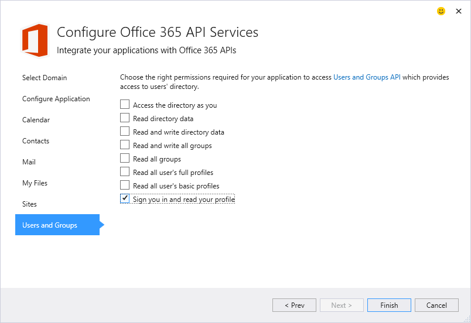

  1. Click **OK**.
1. Update the Home Controller.
  1. Expand the **Controllers** folder and open **HomeController.cs**.
  1. Replace the **Index** method with the following code
  
    ````c#
    public async Task<ActionResult> Index()
    {
        IOrderedEnumerable<IEvent> events = await CalendarAPISample.GetCalendarEvents();
        ViewBag.Events = events;
        return View();
    }
    ````

1. Update the Index View.
  1. Expand the **Views/Home** folders and open **Index.cshtml**.
  1. Replace all of the code with the following:

    ````html
    <div style="margin:25px;">
      <table>
        <tr>
          <th>Start</th>
          <th>End</th>
          <th>Subject</th>
          <th>Location</th>
        </tr>
        @foreach (var Event in ViewBag.Events)
        {
          <tr>
            <td>
                <div style="width:200px;">@Event.Start.ToString()</div>
            </td>
            <td>
                <div style="width:200px;">@Event.End.ToString()</div>
            </td>
            <td>
                <div style="width:200px;">@Event.Subject</div>
            </td>
            <td>
                <div style="width:200px;">@Event.Location.DisplayName</div>
            </td>
        </tr>
        }
      </table>
    </div>
    ````

1. Debug the add-in.
  1. Start **Fiddler**.
  1. Press **F5** in Visual Studio 2013 to debug the application.
  1. When prompted, login to Office 365 with your managed account.
  1. Verify that the application displays your calendar information.
  1. In **Fiddler**, locate the session entry containing the query string parameter **code**. This is the Authorization Code returned from Azure Access Control Services.

    

  1. Right click the session and select **Inspect in New Window**.
  1. In the session window, click the **Web Forms** tab.
  1. Examine the authorization code.

    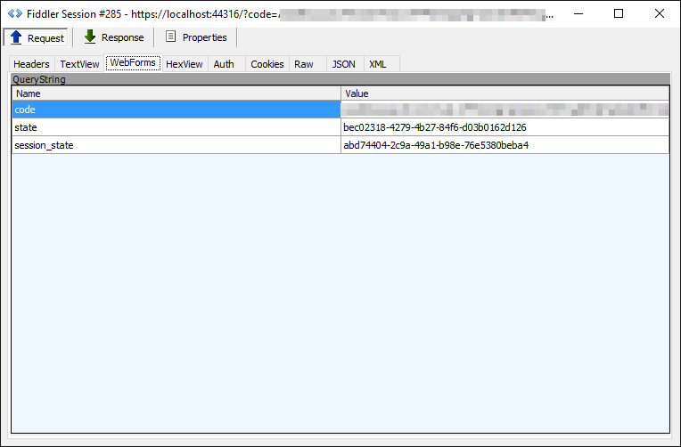

  1. Close the window.
  1. Stop debugging.
1. Examine the Microsoft Azure configuration.
  1. Log into the [Azure Management Portal](https://manage.windowsazure.com)
  1. Click **Active Directory**.
  1. Select your Azure Active Directory instance.
  1. Click on the add-in entitled **OfficeOAuth.Office365App**. This entry was made for you by the Office 365 tools in Visual Studio.
  1. Click **Configure**.
  1. Scroll to the section entitled **Permissions to Other Applications**.
  1. Examine the **Office 365 Exchange Online** permissions. These are the permissions you granted in Visual Studio.

    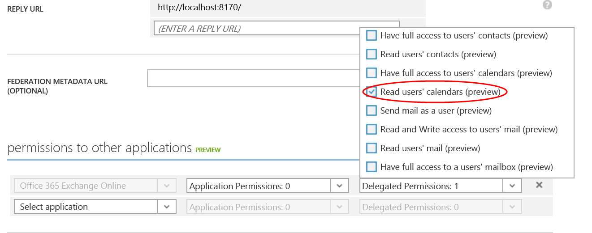

In this exercise you created a new web application and examined the OAuth Authorization Code Flow.

## Exercise 3: Client Credentials Flow - OAuth with the Office 365 APIs 
In this exercise you create a new web application and examine the OAuth Client Credentials flow.

> Note: In order to fully demonstrate the capabilities of app-only permissions using the client credentials OAuth flow, you will need at least two users in your Office 365 tenant with some email in their inbox.

### Configure Azure AD Application for App-Only Authentication
The first step is to create & configure an application in your Azure AD directory to support app-only permissions.

1. Locate the starter project in the Starter Project folder within this lab located at [TrainingContent/O3652/O3652-7 Deep Dive into Security and OAuth](O3652/O3652-7 Deep Dive into Security and OAuth). Open the Visual Studio solution ClientCredsAddin.sln in Visual Studio.
1. Update the web project to use SSL by default:
  1. In the **Solution Explorer** tool window, select the project and look at the **Properties** tool window. 
  1. Change the property **SSL Enabled** to **TRUE**.
  1. Copy the **SSL URL** property to the clipboard for use in the next step.
  1. Save your changes.

    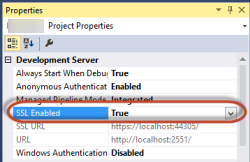

    > It is important to do this now because in the next step when you create the application in Azure AD, you want the reply URL to use HTTPS. If you did not do this now, you would have to manually make the changes the Visual Studio wizard is going to do for you in creating the app.
    
1. Configure the project to always go to the homepage of the web application when debugging:
  1. In the **Solution Explorer** tool window & select **Properties**.
  1. Select the **Web** tab in the left margin.
  1. Find the section **Start Action**.
  1. Click the radio button **Start URL** and enter the SSL URL of the web project that you copied from the previous step.

1. In the **Solution Explorer**, right click the **Office365Contacts** project and select **Add/Connected Service**.
  1. In the **Services Manager** dialog:
    1. Click **Register Your App**.
    1. When prompted, login with your **Organizational Account**.
    1. Click **App Properties**.
      1. Verify the option **Single Organization** is selected.
      1. Make sure there is only a single URL listed in the **Redirect URIs** and it is the HTTPS URL of the web project.
      1. Click **Apply**.
    1. Click **Users and Groups**.
      1. Click **Enable sign-on and read user' profiles**.
      1. Click **Apply**.
    1. Click **OK**.

1. Now you need to create a public-private key-pair certificate. Do this by creating a self-signed certificate:
  1. Launch a Visual Studio Command Prompt: **Start / Visual Studio 2013 / Visual Studio Tools / Developer Command Prompt for VS2013**.
  1. In the command prompt, change directory to the root folder of the starter project. *The remaining steps assume you are in a folder such as `c:\dev\ClientCredsAddin`.*
  1. Run the following commands to create a new self-signed certificate:

    ````powershell
    PS C:\dev\ClientCredsAddin\makecert -r -pe -n "CN=Contoso SuperApp Cert" -b 01/01/2015 -e 12/31/2015 -ss my -len 2048
    ````

1. Next, extract the public & private keys from the machine's certificate store:
  1. Launch an MMC instance (**Start / Run / MMC **).
  1. In the menu, select **File / Add or Remove Snap-ins**.
  1. Select **Certificates**, click **Add** and **OK**. *If prompted, pick the current user option.*

    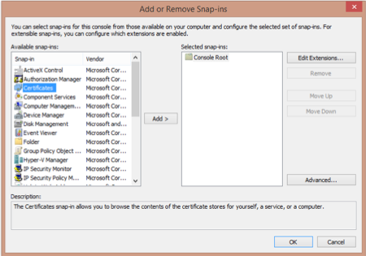

  1. Expand the tree to **Console Root / Certificates - Current User / Personal / Certificates**:
  1. Find the certificate you created by name, right-click and select **All Tasks / Export...**

    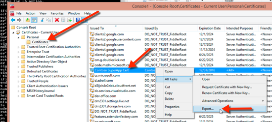

  1. First export the public key by selecting **No, do not export the private key** and clicking **Next**.

    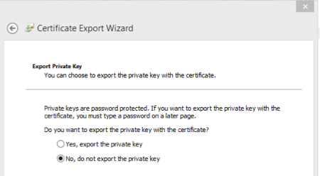

  1. Select **DER encoded binary X.509 (.CER)** and click **Next**.
  1. Save the file to you system as **ClientCredsAddin.cer**. This is the public key part of the certificate.
  1. Repeat the process above in finding the certificate and select **All Tasks / Export...**.
  1. This time, select **Yes, export the private key** and click **Next**.
  1. Select the format **Personal Information Exchange - PKCS #12 (.PFX)** and check the **Include all certificates in the certification path if possible**, finally clicking **Next**.

    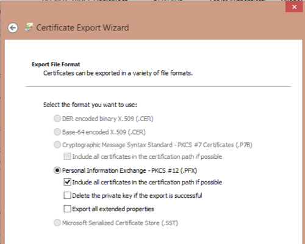

  1. On the **Security** page, check the **Password** option and enter a password you will remember such as **password1** and click **Next**.
  1. Finally click **Finish** and save the certificate to the file system as **CertCredsAddin.pfx**.

Now that you have the certificate public-private key pair, you need to add the public portion to the Azure AD application and that will be used by Azure AD to authenticate the request sent by the ASP.NET MVC web application

1. First, use PowerShell to extract the thumbprint & certificate value from the public certificate:
  1. Launch a PowerShell session.
  1. Enter the following PowerShell to extract the value (**$base64Value**), the thumbprint (**$base64Thumbprint**) & create a new unique ID for the key (**$keyId**). Make sure you save these values to a text file as you will need them in the next step:

    ````powershell
    $cer = New-Object System.Security.Cryptography.X509Certificates.X509Certificate2
    $cer.Import("c:\dev\ClientCredsAddin\ClientCredsAddin.cer")
    $bin = $cer.GetRawCertData()

    $base64Value = [System.Convert]::ToBase64String($bin)
     
    $bin = $cer.GetCertHash()
    $base64Thumbprint = [System.Convert]::ToBase64String($bin)

    $keyid = [System.Guid]::NewGuid().ToString()
    ````

1. Now, update the application's registration in the Azure Management Portal:
  1. Open a browser and navigate to the Azure Management Portal at https://manage.windowsazure.com.
  1. In the left-hand navigation, scroll down to and click on **Active Directory**.
  1. Click on the name of your Azure AD directory & then click **Applications** in the toolbar. 
  1. Locate the name of the application you created using Visual Studio's *Connected Service* wizard (you may need to change the filter to **Applications my company owns** to get it to show up).
  1. Click the **Configure** tab on the top horizontal navigation for the app.
  
  > There is no user interface to add a certificate so you will add it manually to the manifest.
  
  1. At the bottom of the page, click the **Manage Manifest** button and select **Download Manifest** to download a JSON manifest of the application. 
  1. Open the JSON file in a text editor & locate the section `"keyCredentials": [],`.
  1. Add a JSON object to this empty array that matches looks like the following, but take care to update values **$base64Value**, **$base64Thumbprint** & **$keyId** from the values you obtained in PowerShell previously:

    ````
    "keyCredentials": [
      {
        "customKeyIdentifier": "$base64Thumbprint",
        "keyId": "$keyId",
        "type": "AsymmetricX509Cert",
        "usage": "Verify",
        "value":  "$base64Value"
      }
    ],
    ````

  1. Save your changes.
  1. Go back to the Azure Management Portal where your app is still selected.
  1. Click the **Manage Manifest** button and select **Upload Manifest**.
  1. Upload the JSON file you just modified.

  1. Now, modify the permissions for the application to grant the application app-only permissions.
    1. Scroll down to the **permissions to other applications** section. 
      1. In the **Select Application** dropdown, select **Office 365 Exchange Online**. 
      1. In the **Application Permissions** dropdown on the same line for **Office 365 Exchange Online**, the following permission:
      
        + Read mail in all mailboxes

      1. In the line for **Windows Azure Active Directory**, select the **Application Permissions** dropdown and add the following permission:

        + Read directory data
  1. Click the **Save** button at the bottom of the page.

1. Before leaving Azure AD, collect two values that will be needed in the next step:
  1. On the page for the Azure AD application, locate the **Client ID** GUID and copy it to a text file.
  1. At the bottom of the page, click the **View Endpoints** button. All of the endpoints have a GUID near the start of them. Copy that GUID as that is the **tenant ID** or your Azure AD directory.

### Setup the ASP.NET MVC Web Application for App-Only Authentication
Now that the application is configured with the public certificate & necessary permissions in Azure AD, you can now update the ASP.NET MVC application for app-only permissions and leverage the client credentials OAuth flow.

1. Ensure you have the starter project **ClientCredsAddin** open in Visual Studio.
1. Open the `web.config` and set the following values in the `<appSettings>` section:
  - **ida:ClientID**: This is the Client ID of the Azure AD application you obtained in the Azure Management Portal.
  - **ida:AadTenantID**: This is the Tenant ID of the Azure AD directory you obtained in the Azure Management Portal.
  - **ida:CertPfxFilePath**: Enter `~/Content/ClientCredsAddin.pfx` and copy the `*.pfx` file to the **Content** folder in the project. *In a real application you will want to put this certificate in a safe place on your production server and not the root of the web application, but for this lab this is sufficient.*
  - **ida:CertPfxFilePassword**: Enter the password you used when exporting the private `*.pfx` file.

1. Create a MVC controller that will be used for all authentication routing for the web application:
  1. Right-click the **Controllers** folder and select **Add/Controller**.
    1. In the **Add Scaffold** dialog, select **MVC 5 Controller - Empty**.
    1. Click **Add**.
    1. When prompted for a name, enter **AccountController**.
    1. Click **Add**.
  1. Within the **AccountController** file, verify the following `using` statements are at the top of the file:

    ````c#
    using System;
    using System.Collections.Generic;
    using System.Linq;
    using System.Security.Claims;
    using System.Threading.Tasks;
    using System.Web;
    using System.Web.Mvc;
    using ClientCredsAddin.Models;
    using Microsoft.IdentityModel.Clients.ActiveDirectory;
    using ClientCredsAddin.Utils;
    ````

  1. Because apps that use application permissions & the client credentials flow require the global tenant administrator for the Azure AD directory to explicitly grant them access, add a route that will handle the user triggering this request. Notice a few things in this method:
    - The request includes **response_type=code+id_token** which will retrieve OpenID token identifying the user who logged in and granted the consent.
    - The request specifies the user should be prompted to grant an administrator's consent to the application permissions as indicated by **prompt=admin_consent**.
    - Upon a successful authentication & granting the consent, redirect the app to **https://[MVC-App-Url-On-Localhost]/Account/Auth**, a route you will implement in a moment.

    ````c#
    public ActionResult AdminConsentApp() {

      string authorizationRequest = String.Format(
          "{0}oauth2/authorize?response_type=code+id_token&response_mode=form_post&prompt=admin_consent&client_id={1}&resource={2}&redirect_uri={3}&nonce={4}",
              SettingsHelper.AzureADAuthority,
              Uri.EscapeDataString(SettingsHelper.ClientId),
              Uri.EscapeDataString("https://graph.windows.net/"),
              Uri.EscapeDataString(String.Format("{0}/Account/Auth", this.Request.Url.GetLeftPart(UriPartial.Authority))),
              Uri.EscapeDataString(Guid.NewGuid().ToString())
              );

      return new RedirectResult(authorizationRequest);
    }
    ````

  1. Then you need to implement the route that Azure AD will send the user back to. Go ahead and add the following method to the **AccountController**, even though there will be some reference issues that we will implement in a moment. Take note of the following things:
    - You will create a `AuthHelper` class that will aid in obtaining app-only access tokens.
    - The method extracts values from the OpenID token returned from Azure AD.
    - A `AppState` class will be created that will contain the state information for the application & will be kept in a Session. *In a production app you might want to store this data in a server side cache for scalability and performance reasons.* 

    ````c#
    public async Task<ActionResult> Auth() {
      var authHelper = new AuthHelper();
      var appState = new AppState();

      // get id token from successful AzureAD auth
      var openIdToken = AuthHelper.OpenIdToken(Request.Form["id_token"]);
      appState.TenantId = openIdToken.TenantId;
      appState.TenantDomain = openIdToken.Domain;
      appState.LoggedOnUser = openIdToken.UserPrincipalName;

      // set app as authoirzed
      appState.AppIsAuthorized = true;

      // obtain access token for graph client
      var aadGraphAccessToken = await authHelper.GetAppOnlyAccessToken(
        SettingsHelper.AzureAdGraphResourceId, 
        appState.TenantId);

      // TODO LATER: get all users in the directory

      // get access token for exchange online
      var exchangeOnlineAccessToken = await authHelper.GetAppOnlyAccessToken(SettingsHelper.ExchangeOnlineResourceId, appState.TenantId);
      appState.ExchangeOnlineAccessToken = exchangeOnlineAccessToken;

      Session["ClientCredsAddinAppState"] = appState;

      return new RedirectResult("/Mail");
    }
    ````

  1. Create a new class **JwtToken** in the **Models** folder to represent the OpenID JWT token returned from Azure AD and add the following code to it:

    ````c#
    public static JwtToken OpenIdToken(string idToken)
    {
      string encodedOpenIdToken = idToken;
      string decodedOpenIdToken = Base64UrlDecodeJwtTokenPayload(encodedOpenIdToken);

      return JsonConvert.DeserializeObject<JwtToken>(decodedOpenIdToken);
    }

    private static string Base64UrlDecodeJwtTokenPayload(string base64UrlEncodedJwtToken) {
      string payload = base64UrlEncodedJwtToken.Split('.')[1];

      return Base64UrlEncoder.Decode(payload);
    }
    ````

  1. Create the `AuthHelper` utility class that will be used to handle the heavy lifting part of getting access tokens and processing OpenID tokens.
    1. Add a new class to the **Utils** folder named **AuthHelper.cs**.
    1. Ensure the following using statements are present at the top of the file:

      ````c#
      using System;
      using System.Collections.Generic;
      using System.IdentityModel.Tokens;
      using System.Linq;
      using System.Security.Cryptography.X509Certificates;
      using System.Threading.Tasks;
      using System.Web;
      using ClientCredsAddin.Models;
      using Microsoft.IdentityModel.Clients.ActiveDirectory;
      using Newtonsoft.Json;
      ````

    1. Add the following methods to the `AuthHelper` class to process the OpenID JWT token returned from Azure AD:

      ````c#
      public static JwtToken OpenIdToken(string idToken)
      {
        string encodedOpenIdToken = idToken;
        string decodedOpenIdToken = Base64UrlDecodeJwtTokenPayload(encodedOpenIdToken);

        return JsonConvert.DeserializeObject<JwtToken>(decodedOpenIdToken);
      }

      private static string Base64UrlDecodeJwtTokenPayload(string base64UrlEncodedJwtToken) {
        string payload = base64UrlEncodedJwtToken.Split('.')[1];

        return Base64UrlEncoder.Decode(payload);
      }
      ````

    1. Add the following method to the `AuthHelper` class to obtain an app-only OAuth access token from Azure AD for the specified resource:

    ````c#
    public async Task<string> GetAppOnlyAccessToken(string resource, string tenantId)
    {
      string authority = SettingsHelper.AzureADAuthority;
      var authContext = new Microsoft.IdentityModel.Clients.ActiveDirectory.AuthenticationContext(authority, false);

      // get certificate & password
      string certFile = HttpContext.Current.Server.MapPath(SettingsHelper.CertPfxFilePath);
      string certPassword = SettingsHelper.CertPfxFilePassword;
      var cert = new X509Certificate2(certFile, certPassword, X509KeyStorageFlags.MachineKeySet);
      var clientAssertionCert = new ClientAssertionCertificate(SettingsHelper.ClientId, cert);
      
      // authenticate
      var authResult = await authContext.AcquireTokenAsync(resource, clientAssertionCert);

      return authResult.AccessToken;
    }
    ````

  1. Finally, add a class to hold the application state that will be stored in the session state. Add a class named **AppState** to the **Models** folder and add the following code to it:

    ````c#
    public async Task<string> GetAppOnlyAccessToken(string resource, string tenantId)
    {
      string authority = SettingsHelper.AzureADAuthority;
      var authContext = new Microsoft.IdentityModel.Clients.ActiveDirectory.AuthenticationContext(authority, false);

      // get certificate & password
      string certFile = HttpContext.Current.Server.MapPath(SettingsHelper.CertPfxFilePath);
      string certPassword = SettingsHelper.CertPfxFilePassword;
      var cert = new X509Certificate2(certFile, certPassword, X509KeyStorageFlags.MachineKeySet);
      var clientAssertionCert = new ClientAssertionCertificate(SettingsHelper.ClientId, cert);
      
      // authenticate
      var authResult = await authContext.AcquireTokenAsync(resource, clientAssertionCert);

      return authResult.AccessToken;
    }
    ````

### Get Users From Azure AD Directory with App-Only Permissions
With authentication setup with the application in Azure AD and in the ASP.NET MVC web application, you can add the code that will get some data to display in the interface.

1. First create a repository object that will handle retrieving users from the Azure AD directory using the Graph REST API:
  1. Add a new class named **GraphRepository** to the **Models** folder.
  2. Ensure the following `using` statements are present at the top of the file:

    ````c#
    using System;
    using System.Collections.Generic;
    using System.Linq;
    using System.Net.Http;
    using System.Threading.Tasks;
    using System.Web;
    using ClientCredsAddin.Models.JsonHelpers;
    using ClientCredsAddin.Utils;
    using Newtonsoft.Json;
    ````

  1. Next, add the following method to retrieve and return a collection of users from the Azure AD directory using the Azure AD graph REST API:

    ````c#
    public async Task<Dictionary<string, string>> GetUsers(string accessToken) {
      string graphQuery = SettingsHelper.AzureAdGraphEndpoint + "users?api-version=2013-04-05";

      HttpClient client = new HttpClient();
      client.DefaultRequestHeaders.Add("Accept", "application/json;odata=verbose");
      client.DefaultRequestHeaders.Add("Authorization", "Bearer " + accessToken);
      // these headers should be added when doing app-only for auditing purposes
      client.DefaultRequestHeaders.Add("client-request-id", Guid.NewGuid().ToString());
      client.DefaultRequestHeaders.Add("return-client-request-id", "true");
      client.DefaultRequestHeaders.Add("UserAgent", "OfficeDev-ClientCredsAddin-HOL");

      // create request
      HttpRequestMessage request = new HttpRequestMessage(HttpMethod.Get, graphQuery);

      // issue request & get response
      var response = await client.SendAsync(request);
      string responseString = await response.Content.ReadAsStringAsync();
      // convert response to object
      var jsonResponse = JsonConvert.DeserializeObject<AadUserResponseJson>(responseString);

      return jsonResponse.Data.Users.ToDictionary(user => user.objectId, user => user.mail);
    }
    ````

  1. Go back to the **AccountController**. Locate the `TODO LATER` comment in the `Auth()` route handler and replace them with the following code that will retrieve the users from the directory:

    ````c#
    // get all users in the directory
    var graphRepo = new GraphRepository();
    var users = await graphRepo.GetUsers(aadGraphAccessToken);
    appState.MailboxList = users;
    ````

### Retrieve Any User's Email Messages with App-Only Permissions
Now that you have the users in the directory, you can use the same app-only access token technique to get all the email messages for any user within the directory.

1. Create a repository object that will handle retrieving users from the Azure AD directory using the Graph REST API:
  1. Add a new class named **MessageRepository** to the **Models** folder.
  2. Ensure the following `using` statements are present at the top of the file:

    ````c#
    using System;
    using System.Collections.Generic;
    using System.Linq;
    using System.Net.Http;
    using System.Threading.Tasks;
    using System.Web;
    using ClientCredsAddin.Models.JsonHelpers;
    using ClientCredsAddin.Utils;
    using Newtonsoft.Json;
    ````

  1. Next, add the following private field and constructor to the `MessageRepository` class to keep the app-only access token when creating the repository object:

    ````c#
    private string _accessToken = null;

    public MessageRepository(string accessToken) {
      _accessToken = accessToken;
    }
    ````

  1. Add the following method to retrieve all messages from the specified user's mailbox using the Office 365 Mail REST API:

    ````c#
    public async Task<List<string>> GetMessages(string mailboxId) {
      var mailQuery = string.Format("{0}api/v1.0/users('{1}')/folders/inbox/messages?$top=10&?select=Subject",
        SettingsHelper.ExchangeOnlineEndpoint, mailboxId);

      HttpClient client = new HttpClient();
      client.DefaultRequestHeaders.Add("Accept", "application/json");
      client.DefaultRequestHeaders.Add("Authorization", "Bearer " + _accessToken);
      // these headers should be added when doing app-only for auditing purposes
      client.DefaultRequestHeaders.Add("client-request-id", Guid.NewGuid().ToString());
      client.DefaultRequestHeaders.Add("return-client-request-id", "true");
      client.DefaultRequestHeaders.Add("UserAgent", "OfficeDev-ClientCredsAddin-HOL");

      // create request
      HttpRequestMessage request = new HttpRequestMessage(HttpMethod.Get, mailQuery);

      // issue request & get response
      var response = await client.SendAsync(request);
      string responseString = await response.Content.ReadAsStringAsync();
      // convert response to object
      var jsonResponse = JsonConvert.DeserializeObject<ExchangeMessageReponseJson>(responseString);

      return jsonResponse.Message.Select(message => message.Subject).ToList();
    }
    ````

### Display Any User's Emails
The ASP.NET MVC web application now contains all the *worker* code to authenticate, obtain access tokens and retrieve users and messages using different REST APIs. The last step is to create a controller & view that brings it all together.

1. Add a controller to the web application:
  1. Right-click the **Controllers** folder and select **Add/Controller**.
    1. In the **Add Scaffold** dialog, select **MVC 5 Controller - Empty**.
    1. Click **Add**.
    1. When prompted for a name, enter **MailController**.
    1. Click **Add**.
  1. Within the **MailController** file, verify the following `using` statements are at the top of the file:

    ````c#
    using System;
    using System.Collections.Generic;
    using System.Linq;
    using System.Threading.Tasks;
    using System.Web;
    using System.Web.Mvc;
    using ClientCredsAddin.Models;
    using ClientCredsAddin.Utils;
    ````

  1. The first thing you need is a way to handle the admin constent required when using app-only permissions in Azure AD. Do this by adding the following method to the `MailController`. It leverages a custom attribute, `MultipleButton`, that is already present in the project that handles having multiple submit buttons in the view:

    ````c#
    [HttpPost]
    [MultipleButton(Name = "action", Argument = "GoAdminConsent")]
    public ActionResult Authorize() {
      return Redirect("/Account/AdminConsentApp");
    }
    ````

1. Add the view that will handle this requirement:
  1. Within the `MailController` class, right click the `View()` at the end of the `Index()` method and select **Add View**.
  1. Within the **Add View** dialog, set the following values:
    1. View Name: **Index**.
    1. Template: **Empty (without model)**.
      
      > Leave all other fields blank & unchecked.
    
  1. Click **Add**.
1. Within the **Views/Mail/Index.cshtml** file, delete all the code in the file and replace it with the following code:

  ````html
  @model ClientCredsAddin.Models.MailViewModel
  @{
    ViewBag.Title = "Index";
  }

  <h2>Index</h2>

  @if (Model.AppState.AppIsAuthorized == false) {
    using (Html.BeginForm("", "Mail", FormMethod.Post)) {
      <p>Force admin consent:</p>
      <button type="submit" name="action:GoAdminConsent">Go Admin Consent</button>
    }
  }
  ````

1. Notice that the code you just added to the view uses a custom view model object. Go ahead and add that:
  1. Add a new class named **MailViewModel** to the **Models** folder.
  1. Replace the code in the **MailViewModel** file with the following:

    ````c#
    using System;
    using System.Collections.Generic;
    using System.Linq;
    using System.Web;
    using System.Web.Mvc;

    namespace ClientCredsAddin.Models {
      public class MailViewModel {
        public string SelectedMailbox;
        public List<string> Messages;
        public AppState AppState;
        public List<SelectListItem> UserListSelectors;

        public MailViewModel() {
          SelectedMailbox = string.Empty;
          Messages = new List<string>();
        }
      }
    }
    ````

1. Implement the default route for the **MailController**:
  1. Go back to the `MailController` class within the **Controllers** folder.
  1. Add the following `Index()` route to the `MailController`:

    ````c#
    public ActionResult Index() {
      // try to load the app state (set if previously authenticated)
      //  if session value not present, create new app state
      var appState = Session["ClientCredsAddinAppState"] as AppState ?? new AppState();

      // create viewmodel for the view
      var viewModel = new MailViewModel {
        AppState = appState
      };

      // if logged in, get data and add to view model
      if (appState.AppIsAuthorized) {
        // create select list of all users
        viewModel.UserListSelectors = GetMailboxSelectOptions(appState.MailboxList);
      }

      return View(viewModel);
    }
    ````

  1. Add the utility method `GetMailboxSelectOptions()` to the `MailController` class. This will create select box options for the drop down list that you will later add to the view used to select a different mailbox:

    ````c#
    private List<SelectListItem> GetMailboxSelectOptions(Dictionary<string, string> mailboxList) {
      return mailboxList.Select(user => new SelectListItem {
        Text = user.Value,
        Value = user.Value
      }).ToList();
    }
    ````

  1. Now go back to the view file (**Views/Mail/Index.cshtml**) and add the following code to implement the details of the current login session and the drop down list of mailboxes.

    ````html
    @if (Model.AppState.AppIsAuthorized == true) {
      <p>
        <strong>Organization:</strong> [@Model.AppState.TenantDomain]<br />
        <strong>Current logged in user:</strong> [@Model.AppState.LoggedOnUser]
      </p>

      using (Html.BeginForm("", "Mail", FormMethod.Post)) {
        <p>
          Select a mailbox:<br />
          @Html.DropDownList("Mailbox", Model.UserListSelectors)
          <button type="submit" name="action:viewMailboxMessages">View User's Emails</button>
        </p>
      }
    }
    ````

1. Last but not least, go back to the `MailController` to add one last method that will handle when the user click the button to fetch the email messages from a user's mailbox:

  ````c#
  [HttpPost]
  [MultipleButton(Name = "action", Argument = "viewMailboxMessages")]
  public async Task<ActionResult> ListEmailMessages() {
    var appState = Session["ClientCredsAddinAppState"] as AppState;

    // get requested mailbox
    var requestedMailbox = Request.Form["Mailbox"];

    // build view model
    var viewModel = new MailViewModel {
      AppState = appState,
      SelectedMailbox = requestedMailbox,
      UserListSelectors = GetMailboxSelectOptions(appState.MailboxList)
    };

    // get messages
    var repo = new MessageRepository(viewModel.AppState.ExchangeOnlineAccessToken);
    var results = await repo.GetMessages(requestedMailbox);

    viewModel.SelectedMailbox = requestedMailbox;
    viewModel.Messages = results;

    return View("Index", viewModel);
  }
  ````

1. Test the application by pressing **F5** in Visual Studio or using the **Debug / Start Debugging** menu item.
  1. When the browser launches, click the **Mail** menu item in the top navigation.
  1. Notice no mailboxes are shown because your application is not authenticated. Click the button **Go Admin Consent** to trigger the login & admin consent prompt for the global tenant administrator:

    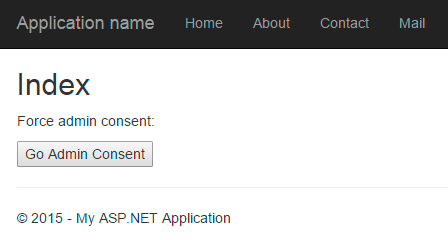

  1. Login to Azure AD using the credentials for the global tenant administrator for your Azure AD directory.
  1. Notice that after you successfully login, you are presented with the admin consent screen. This page is telling you the permissions it needs and how broad sweeping the permission request is as indicated by the message *If you agree, this app will have access to the specified resources for all users in your organization. No one else will be prompted.*

    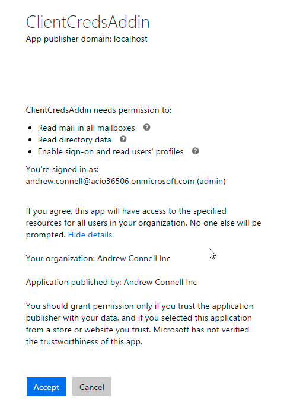

  1. Click **Accept** to grant the app permissions and to go back to your ASP.NET MVC web application.
  1. The app will take you back to the **Mail** controller and display the tenant and logged in user. Notice that it also now has a list of all the users in your directory within the drop down:

    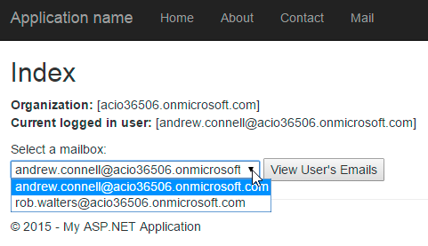

  1. Select one user and click the **View User's Emails** button. The page will reload and show a list of the subject lines of those emails:

    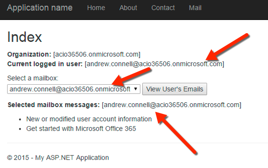

    Notice in the figure above, the currently logged in user's emails are being shown. 

    Now let's see how sweeping app-only permissions are

  1. Change to another user and click the **View User's Emails** button. Notice how you are now reading someone else's emails!

    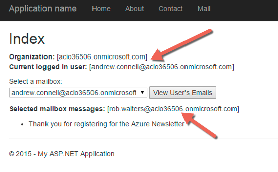

In this exercise you created a new web application and examined the OAuth Client Credentials flow.

**Congratulations! You have completed investigation OAuth in Office 365.**