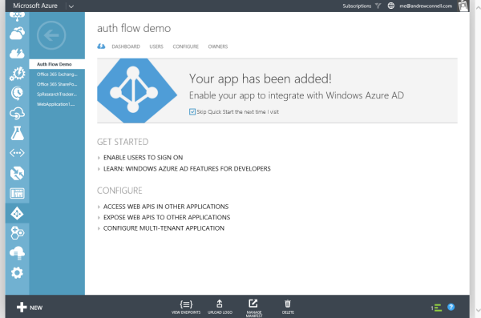

#Deep Dive into Azure AD with the Office 365 APIs

In this lab you will configure your Azure Active Directory (Azure AD) tenant to provide authentication services to various application types; you will walk thru the http requests that facilitate authentication and you will explore the O365 Discovery Service using a Windows Store App.

## Prerequisites
1. You must have an Office 365 tenant and Windows Azure subscription to complete this lab. If you do not have one, the lab for **O3651-7 Setting up your Developer environment in Office 365** shows you how to obtain a trial.
1. You must have the Office 365 API Tools version 1.2.41027.2 installed in Visual Studio 2013.
1. You must have the TelerikFiddler application installed. Fiddler can be downloaded from [http://www.telerik.com/fiddler](http://www.telerik.com/fiddler) 

## Exercise 1: Register an application in Azure AD 
*Consuming O365 APIs requires all requests to be authorized, both the current user and the application. Azure AD Provides the authentication for the app and user.*

### Create the app domain:
1. Launch Internet Explorer.
1. In Internet Explorer, navigate to https://manage.windowsazure.com/
1. Enter the email address and password of an account that have permissions to manage the directory of the Azure tenant (e.g. admin@sample.onmicrosoft.com).
1. In the left-hand navigation, scroll down to and click on Active Directory.
1. Click on the name of a directory to select it and display. Depending on the state of your portal, you will see the Quick Start page, or the list of Users. On either page, click **Applications** in the toolbar. 

	

	*You may notice that the list of applications includes Office 365 Exchange Online and Office 365 SharePoint Online.*

1. Click the **Add** button at the bottom of the display.
1. On the **What do you want to do** page, click **Add an application my organization is developing**. This will start the **Add Application** wizard.
1. In the **Add Application** wizard, enter a name of **Auth Flow Demo** and choose the type **Web Application and/or Web API**. Click the arrow to advance to the next page of the wizard.
1. In the **App Properties** page, enter a **SIGN-ON URL** of **http://authflowdemo.com**
	> NOTE: The Sign-On URL property is used to redirect the user's browser once authentication is complete. In this lab, we will not actually build a site at that URL. In a later exercise, you will monitor the authentication flow, but will not actually navigate to that URL.

1. Enter an **App ID Uri** of **http://[your-domain].onmicrosoft.com/AuthFlowDemo**.
	> NOTE: The App ID Uri must be unique within the Azure tenancy. Using a host name that matches your tenant name helps to prevent confusion, and using a value for the path that matches the app name helps to enforce uniqueness. This value can be changed if the app name or purpose changes.
1. Click the **check** image in the lower right of the wizard to create the application. The application Quick Start page will display once the application is created.

	

1. On the application Quick Start page, click on **CONFIGURE** in the toolbar.
1. Scroll down to the **Keys** section. 
	1. In the **Select Duration** dropdown, select **1 year**. 
	1. Then click the **Save** button at the bottom of the page.

	*The page will refresh and include the value of the key. In addition, a message is displayed advising that the key will not be shown a second time.*

1. For both the **Client ID** and **Key**, copy the values to the clipboard and paste into Notepad. We will require these values later.

	

1. Scroll down to the **permissions to other applications** section. 
	1. In the **Select Application** dropdown, select **Office 365 Exchange Online**. 
	1. In the **Delegated Permissions** dropdown on the same line, choose **Read users' mail**. 
	1. Again, in the **Select Application** dropdown, select **Office 365 SharePoint Online**. 
	1. In the **Delegated Permissions** dropdown on the same line, choose **Read users' files**. 
<br />

1. Click the **Save** button at the bottom of the page.

*You have completed the creation & registration of an application in Azure AD.*  

##Exercise 2: Manually invoke and review the authentication flow
*In this exercise, we will manually walk thru the steps of logging in, consenting the application and requesting an access token for an Office 365 service.*

### Login and consent the application
1. Launch an **InPrivate** session of Internet Explorer.
1. Navigate to the Azure AD authorize page:

	`https://login.windows.net/common/oauth2/authorize?resource=Microsoft.SharePoint&redirect_uri=http://authflowdemo.com/&response_type=code&client_id=[CLIENT-ID]`

	> Note: Replace the placeholder [CLIENT-ID] with the actual Client Id copied from the application configuration page.

	The following are the query string parameters that are part of this request:
	- **resource**: the Azure AD-secured resource for which authorization is being performed.
	- **redirect_uri**: the URL to which the authorization code is to be sent upon completion of the authorization & consent process
	- **response_type**: indicates that the authorization should respond with an authorization code instead of an access token. The Office 365 APIs utilize the code approach, since different tokens are required for the various services (Exchange, SharePoint, etc.). An authorization code can be used to request multiple access tokens.
	- **client_id**: used to identity the application making the request
	
1. If prompted, enter the user name and password.
1. Before continuing, launch **Fiddler**. Fiddler will intercept the conversation between the browser and server, providing the ability to view the details of the request & response.
1. In Internet Explorer, click **OK** to continue. The browser will display a DNS error.

	> Remember, we configured the application to redirect to a url of http://authflowdemo.com, but we did not create a website at that address.
	
	Notice the address bar of Internet Explorer also contains query string parameters.
1. Switch to **Fiddler**. Near the bottom of the session list will be an entry in red with a result code of 502. Before that, there will be a session with a response code of 302. 
1. Select "302" entry.
1. Notice that the **Hostname** of the entry is `login.windows.net`.
1. On the right side of the Fiddler display, select the **Inspectors** tab. The **Inspectors** tab shows the request from the browser on the top and the response from the server on the bottom.
1. In the response inspector (lower half), click the **Headers** tab. The headers include instructions for the browser to store cookies from Azure AD (`login.windows.net`) to persist the login as well as a **Location** header to redirect the browser. The address for the redirect is the **Sign-On Url** of the application in Azure AD. The redirect request includes query string parameters.

	

1. In the **Fiddler** session list, select the "502" entry which should be the next one immediately after the 302. 
	1. In the **Inspectors** tab, view the Request (upper half) **WebForms** tab. This will display the query string parameters in a grid format. Notice a **code** parameter - this is the authorization code returned by AzureAD for this request. The code will be unique to the application and user.

		

	1. Copy this code to Notepad. The code will be required in the next step.

###Request an Access token
1. In **Fiddler**, click on the **Composer** tab.

	>The composer tab providers the ability to construct an http request.

1. Change the verb to **POST**
1. Change the url to:
 
	````
	https://login.windows.net/common/oauth2/token
	````

1. Add the following to **Request Headers**:

	````
	Content-Type: application/x-www-form-urlencoded
	````

1. The **Request Body** must be UrlEncoded, so there is a preparatory step before completing the form.

	Launch **Windows PowerShell ISE**

	Run the following cmdlets:

	````powershell
	[System.Reflection.Assembly]::LoadWithPartialName("System.Web") | out-null
	[System.Web.HttpUtility]::UrlEncode("[CLIENT-SECRET]")
	````

	>Note: Replace the placeholder [CLIENT-SECRET] with the actual key copied from the application configuration page previously.

	The `UrlEncode` method will output the encoded client secret. Copy this value to Notepad.

1. The **Request Body** contains the following parameters that are required to get an access token.
	- **grant_type**: specifies that we are providing an authorization code instead of requesting the user to enter credentials.
	- **resource**: the resource to which an access token is requested.
	- **redirect_uri**: the URL to which the access token is to be sent upon validation of the request
	- **client_id**: used to identity the application making the request
	- **client_secret**: used to authenticate the application

	Enter the following in the **Request Body**, replacing the [tokens] with values as described below:

	````
	grant_type=authorization_code&resource=https://outlook.office365.com&
	redirect_uri=http%3A%2F%2Fauthflowdemo.com%2F&
	client_id=[CLIENT-ID]&client_secret=[CLIENT-SECRET]
	&code=[AUTHORIZATION-CODE]
	````

	> **Note: Token replacement instructions:**
	> 
	> Make sure line breaks are removed... the **Request Body** should be on a single line. Line breaks were added in the code above for readability.
	> 
	> - **client_id**: copied from the application configuration page in the Azure portal.
	> - **client_secret**: copied from the UrlEncode method in Windows PowerShell ISE.
	> - **code**: copied from the Fiddler Inspector tab of the "502" request

1. Click the **Execute** button to issue the request and get the access token.

	

1. In the session list, click on the just-issued request, then click on the **Inspectors** tab. In the Response window (lower half), click the **JSON** tab. Notice that the response contains an access token and a refresh token.
1. Click on the Composer tab. In the **RequestBody**, change the resource to **https://[your-domain]-my.sharepoint.com**. Click **Execute**.

	

You have successfully retrieved an access code for two different resources using the same authorization code


## Exercise 3: Consume the Discovery Service in a Windows Store app 
*In this exercise, you will build a Windows Store app that consumes the Discovery Service and displays the data returned from the service at each step.*

###Register a Native Client app in Azure AD
1. Launch Internet Explorer.
1. In Internet Explorer, navigate to https://manage.windowsazure.com/
1. Enter the email address and password of an account that have permissions to manage the directory of the Azure tenant (e.g. admin@sample.onmicrosoft.com).
1. In the left-hand navigation, scroll down to and click on **Active Directory**.
1. Click on the name of a directory to select it and display. Depending on the state of your portal, you will see the Quick Start page, or the list of Users. On either page, click **Applications** in the toolbar. 
1. Click the **Add** button at the bottom of the display.
1. On the **What do you want to do** page, click **Add an application my organization is developing**. This will start the **Add Application** wizard.
1. In the **Add Application** wizard:
	1. Enter a name of **DiscoveryWin8**
	1. Choose the type **Native Client Application**.
	1. Click the arrow to advance to the next page of the wizard.
1. In the **Application information** page:
	1. Enter a **Redirect Uri** of **http://[your-domain].onmicrosoft.com/DiscoveryWin8**.
	1. Click the checkmark (complete) button OK to create the application. The application Quick Start page will display once the application is created.
1. On the application Quick Start page, click on **CONFIGURE** in the toolbar.
1. Scroll down to the **permissions to other applications** section.
	1. In the **Select Application** dropdown, select **Office 365 Exchange Online**. 
	1. In the **Delegated Permissions** dropdown on the same line, choose **Read users' mail**. 
	1. Again, in the **Select Application** dropdown, select **Office 365 SharePoint Online**. 
	1. In the **Delegated Permissions** dropdown on the same line, choose **Read users' files**. 
1. Click the **Save** button at the bottom of the page.

*You have completed the creation & registration of a Native Client application in Azure AD.*  

###Create the Windows Store App
1. Launch Visual Studio 2013.
1. Open the **DiscoveryWin8.sln** solution from the folder **StarterFiles\Exercise3\Project**.
1. Open the **config.cs** file. Change the values of the **OrganizationalAccount[..]** strings with values from the Azure portal. 

	````c#
	// App registration for Organizational account (Office 365 account)
	public string OrganizationalAccountClientId = "<ENTER YOUR CLIENT ID FOR APPLICATION>";
	public string OrganizationalAccountRedirectUri = "<ENTER YOUR REDIRECT URI FOR APPLICATION>";
	````
	    
1. In the **Solution Explorer**, right-click on the file **MainPage.xaml** and choose **View Code**.
1. Expand the **First Sign-In** region. Location the comment block:

	````c#
	////////////////////////////
	//
	//  First Sign-in code here
	//
	///////////////////////////
	````

1. Replace the comment block with the following code snippet. (The code snippets are in the folder **StarterFiles\Exercise3**.)

	````c#
	// Build the /FirstSignIn URL
	var firstSignInUri = new Uri(
				string.Format("{0}/discovery/me/FirstSignIn?redirect_uri={1}&scope={2}", 
					this.DiscoveryServiceHost.Text,
					TerminalUriText,
					Scope));
	var terminalUri = new Uri(TerminalUriText);

	var webAuthResult = await WebAuthenticationBroker.AuthenticateAsync(WebAuthenticationOptions.None, firstSignInUri, terminalUri)
			.AsTask().ConfigureAwait(continueOnCapturedContext: true);

	if (webAuthResult.ResponseStatus == WebAuthenticationStatus.Success)
	{
		ParseNavigationResult(webAuthResult.ResponseData);
		RenderUserRealmData();
		this.Status.Foreground = SuccessBrush;

	                
		m_settings["discovery_resource"] = "Microsoft.SharePoint"; // TODO: for Mail, use "https://outlook.office365.com/";
	}
	else
	{
		// This error wasn't expected
		this.Status.Text = string.Format("Error = {0}\nHTTP code = {1}\n", webAuthResult.ResponseStatus, webAuthResult.ResponseErrorDetail);
		this.Status.Foreground = ErrorBrush;
	}
	````

1. Expand the **Get Authorized for Discovery** region.
1. Locate the following comment block:

	````c#
	////////////////////////////
	//
	//  Get Authorized For Discovery code here
	//
	///////////////////////////
	````

1. Replace the comment block with the following code snippet. 

	````c#
	private async Task<bool> GetAuthorizationCodeAsync()
	{
		var accountType = m_settings["account_type"];
		var authzService = m_settings["authorization_service"];
		var clientId = m_settings["client_id"];
		var clientSecret = m_settings["client_secret"];
		var scope = m_settings.ContainsKey("scope") ? m_settings["scope"] : string.Empty;
		var userEmail = m_settings["user_email"];
		var redirectUri = m_settings["authz_redirect_uri"];

		var url = string.Format("{0}?response_type=code&client_id={1}{2}{3}&{4}={5}&redirect_uri={6}",
					authzService,
					clientId,
					!string.IsNullOrEmpty(clientSecret) ? "&client_secret=" + WebUtility.UrlEncode(clientSecret) : string.Empty,
					!string.IsNullOrEmpty(scope) ? "&scope=" + WebUtility.UrlEncode(scope) : string.Empty,
					accountType.Equals(AccountTypeMicrosoft) ? "username" : "login_hint",
					WebUtility.UrlEncode(userEmail),
					WebUtility.UrlEncode(redirectUri));
		this.Status.Text += url + "\n";

		// Navigate using the WebAuthenticationBroker!
		var webAuthResult = await WebAuthenticationBroker.AuthenticateAsync(WebAuthenticationOptions.None, new Uri(url), new Uri(redirectUri))
				.AsTask().ConfigureAwait(continueOnCapturedContext: true);

		// Process the navigation result
		if (webAuthResult.ResponseStatus == WebAuthenticationStatus.Success)
		{
			string authzCode = null;

			// Parse the output parameters
			var queryParams = SplitQueryString(webAuthResult.ResponseData);
			foreach (var param in queryParams)
			{
				// Split the current parameter into name and value
				var parts = param.Split('=');
				var paramName = parts[0].ToLowerInvariant().Trim();
				var paramValue = WebUtility.UrlDecode(parts[1]).Trim();

				// Log the output parameter
				this.Status.Text += string.Format("{0} = '{1}'\n", paramName, paramValue);

				// Process the output parameter
				if (paramName.Equals("code"))
				{
					authzCode = paramValue;
					m_settings["authz_code"] = paramValue;
				}
			}

			// Return the final result
			return !string.IsNullOrWhiteSpace(authzCode);
		}

		// Consent was not obtained
		this.Status.Text += string.Format("Consent was not obtained. Status: '{0}', Error: '{1}', Data: '{2}'\n",
																		webAuthResult.ResponseStatus,
																		webAuthResult.ResponseErrorDetail,
																		webAuthResult.ResponseData);
		this.Status.Foreground = ErrorBrush;
		return false;
	}

	private async Task<bool> GetAccessTokenAsync(string grantType, string grantName, string grant, string resource)
	{
		var tokenService = m_settings["token_service"];
		var clientId = m_settings["client_id"];
		var clientSecret = m_settings["client_secret"];
		var redirectUri = m_settings["authz_redirect_uri"];

		// Build request body
		var requestBody = string.Format("grant_type={0}&{1}={2}&client_id={3}{4}{5}&redirect_uri={6}",
											grantType,
											grantName,
											grant,
											clientId,
											!string.IsNullOrEmpty(clientSecret) ? "&client_secret=" + WebUtility.UrlEncode(clientSecret) : string.Empty,
											!string.IsNullOrEmpty(resource) ? "&resource=" + WebUtility.UrlEncode(resource) : string.Empty,
											WebUtility.UrlEncode(redirectUri));
		var requestBytes = Encoding.UTF8.GetBytes(requestBody);
		this.Status.Text += requestBody + "\n";

		// Build request
		var request = HttpWebRequest.CreateHttp(tokenService);
		request.Method = "POST";
		request.ContentType = "application/x-www-form-urlencoded";
		var requestStream = await request.GetRequestStreamAsync()
										.ConfigureAwait(continueOnCapturedContext: true);
		await requestStream.WriteAsync(requestBytes, 0, requestBytes.Length);

		// Get response
		var response = await request.GetResponseAsync()
										.ConfigureAwait(continueOnCapturedContext: true) as HttpWebResponse;
		var responseReader = new StreamReader(response.GetResponseStream());
		var responseBody = await responseReader.ReadToEndAsync()
										.ConfigureAwait(continueOnCapturedContext: true);

		if (response.StatusCode == HttpStatusCode.OK)
		{
			// Parse the JWT
			var jwt = JsonObject.Parse(responseBody);
			var accessToken = jwt["access_token"].GetString();
			var refreshToken = jwt["refresh_token"].GetString();

			m_settings["access_token"] = accessToken;
			m_settings["refresh_token"] = refreshToken;

			this.Status.Text += string.Format("access_token = '{0}'\nrefresh_token = '{1}'\n",
													accessToken,
													refreshToken);
			return true;
		}

		// Consent was not obtained
		this.Status.Text += string.Format("Access token was not obtained. Status: '{0}', Body: '{1}'\n",
													response.StatusCode,
													responseBody);
		this.Status.Foreground = ErrorBrush;
		return false;
	}
	````

1. Expand the **Discover** region.
1. Locate the following comment block:

	````c#
	////////////////////////////
	//
	//  Discover code here
	//
	///////////////////////////
	````

1. Replace the comment block with the following code snippet. 

	````c#
	try
	{
		// Discover the service for the desired capability
		var accessToken = m_settings["access_token"];
		var discoveryService = m_settings["discovery_service"];
		var url = string.Format("{0}/services", discoveryService);

		// Build request
		var request = HttpWebRequest.CreateHttp(url);
		request.Method = "GET";
		request.Headers["Authorization"] = "Bearer " + accessToken;

		// Get response
		var response = await request.GetResponseAsync()
											.ConfigureAwait(continueOnCapturedContext: true) as HttpWebResponse;
		var responseReader = new StreamReader(response.GetResponseStream());
		var responseBody = await responseReader.ReadToEndAsync()
											.ConfigureAwait(continueOnCapturedContext: true);

		// Load the XML of the response body
		using (var xdocReader = new StringReader(responseBody))
		{
			var xdoc = XDocument.Load(xdocReader);
			if (xdoc != null)
			{
				foreach (var entryElement in xdoc.Root.Elements(DiscoveryXElements.EntryAtom))
				{
					var contentElement = entryElement.Element(DiscoveryXElements.ContentAtom);
					var propertiesElement = contentElement.Element(DiscoveryXElements.PropertiesMetadata);
					var capabilityElement = propertiesElement.Element(DiscoveryXElements.Capability);
					var serviceIdElement = propertiesElement.Element(DiscoveryXElements.ServiceId);
					var serviceUriElement = propertiesElement.Element(DiscoveryXElements.ServiceEndpointUri);
					var serviceResourceIdElement = propertiesElement.Element(DiscoveryXElements.ServiceResourceId);

					// Since this is a MyFiles app, we only store the MyFiles service
					if (capabilityElement.Value.Equals(MyFiles, StringComparison.OrdinalIgnoreCase))
					{
						m_settings[DiscoveryXElements.ServiceEndpointUri.LocalName] = serviceUriElement.Value;
						m_settings[DiscoveryXElements.ServiceResourceId.LocalName] = serviceResourceIdElement.Value;
					}

					this.Status.Text += "**********************************\n";
					this.Status.Text += capabilityElement.Value + "\n";
					this.Status.Text += serviceIdElement.Value + "\n";
					this.Status.Text += serviceUriElement.Value + "\n";
					this.Status.Text += serviceResourceIdElement.Value + "\n";
				}
				this.Status.Text += "**********************************\n";
			}
		}
	}
	catch (Exception ex)
	{
		this.Status.Text += "Exception caught: '" + ex.Message + "'.";
		this.Status.Foreground = ErrorBrush;
	}
	````

1. Expand the **Get Token for Target Service** region.
1. Locate the following comment block:

	````c#
	////////////////////////////
	//
	//  Get Token For Target Service code here
	//
	///////////////////////////
	````

1. Replace the comment block with the following code snippet.

	````c#
	try
	{
		var accountType = m_settings["account_type"];

		if (accountType.Equals(AccountTypeMicrosoft))
		{
			this.Status.Text += "The original token is good for Live. No new token is needed.\n";
		}
		else
		{
			// Get access token for the target service
			if (!await GetAccessTokenForServiceAsync()
											.ConfigureAwait(continueOnCapturedContext: true))
			{
				return;
			}
		}
	}
	catch (Exception ex)
	{
		this.Status.Text += "Exception caught: '" + ex.Message + "'.";
		this.Status.Foreground = ErrorBrush;
	}
	````

1. Expand the **Get Files** region.
1. Locate the following comment block:

	````c#
	////////////////////////////
	//
	//  Get Files code here
	//
	///////////////////////////
	````

1. Replace the comment block with the following code snippet.

	````c#
	private async Task<JsonObject> GetFilesAsJsonAsync()
	{
		var filesService = m_settings[DiscoveryXElements.ServiceEndpointUri.LocalName];
		var accessToken = m_settings["access_token"];

		// Build request
		var url = filesService + "/files";
		var request = HttpWebRequest.CreateHttp(url);
		request.Method = "GET";
		request.Accept = "application/json;odata=verbose";
		request.Headers["Authorization"] = "Bearer " + accessToken;

		// Get response
		var response = await request.GetResponseAsync()
											.ConfigureAwait(continueOnCapturedContext: true) as HttpWebResponse;
		var responseReader = new StreamReader(response.GetResponseStream());
		var responseBody = await responseReader.ReadToEndAsync()
											.ConfigureAwait(continueOnCapturedContext: true);

		if (response.StatusCode == HttpStatusCode.OK)
		{
			// Parse the JSON result
			var jsonResult = JsonObject.Parse(responseBody);
			return jsonResult;
		}

		// Consent was not obtained
		this.Status.Text += string.Format("Request failed. Status: '{0}', Body: '{1}'\n",
											response.StatusCode,
											responseBody);
		this.Status.Foreground = ErrorBrush;

		return null;
	}
	````

1. Press **F5** to start the program.
1. Click thru the buttons in order, exploring the output displayed after each step.

	

	

You have completed the lab for this module.