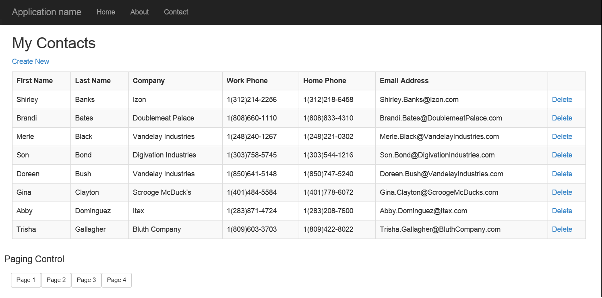

# Office 365 APIs for Calendar, Mail, and Contacts
In this lab, you will use the Exchange client of the Office 365 APIs to program against Office 365 contacts as part of an ASP.NET MVC5 application.

## Prerequisites
1. You must have an Office 365 tenant and Windows Azure subscription to complete this lab. If you do not have one, the lab for **O3651-7 Setting up your Developer environment in Office 365** shows you how to obtain a trial. You must also have access to an Exchange inbox within an Office 365 developer tenancy.
1. You must have the Office 365 API Tools version 1.2.41027.2 installed in Visual Studio 2013.

## Lab Setup: Setting up your Exchange account with Sample Contacts for Testing
1. Using the browser, navigate to https://outlook.office365.com/owa and log into your OWA mailbox.
1. In the top navigation bar, click the **People** link to navigate to the page which shows you your contacts.
1. Make sure there are a few contacts for testing. If you have no contacts or less then 10 contacts, use OWA to enter a few sample contacts so you have at least 10.
1. Once you have verified that you have a set of contacts for testing, you can move on to the next exercise where you will create and test your first app that programs against this contacts list.

## Exercise 1: Create an ASP.NET MVC5 Application
In this exercise, you will create the ASP.NET MVC5 application and register it with Azure active Directory.

1. Launch **Visual Studio 2013** as administrator. 
1. In Visual Studio select **File/New/Project**.
1. In the **New Project** dialog, select **Templates/Visual C#/Web** and click **ASP.NET Web Application**. Name the new project **Office365Contacts** and then click **OK**.  
         
1. In the **New ASP.NET Project** dialog, click **MVC** and then click **Change Authentication**.
1. Select **No Authentication** and click **OK**.

1. Once the **New ASP.NET Project** dialog appears like the following screenshot, click **OK**. 


1. In the **Solution Explorer**, right click the **Office365Contacts** project and select **Add/Connected Service**.
  1. In the **Services Manager** dialog:
    1. Click **Register Your App**.
    1. When prompted, login with your **Organizational Account**.
    1. Click **Users and Groups**.
      1. Click **Permissions**.
      1. Check **Enable sign-on and read users' profiles**.
      1. Click **Apply**.
      
    1. Click **Contacts**.
      1. Click **Permissions**.
      1. Check **Have full access to users' contacts**.
      1. Click **Apply**.
      
    1. Click **Mail**.
      1. Click **Permissions**.
      1. Check **Send mail as a user**.
      1. Check **Read and Write access to users' mail**.    
      1. Click **Apply**.
       
    1. Click **OK**.<br/>
       

1. Obtain and store the Azure AD tenant ID in the `web.config`.
  1. Browse to the [Azure Management Portal](https://manage.windowsazure.com) and sign in with your **Organizational Account**.
  2. In the left-hand navigation, click **Active Directory**.
  3. Select the directory you share with your Office 365 subscription.
  4. In the URL, find the first GUID and copy it to the clipboard. This is your **directory tenant ID**.
    > The URL will look like the following with the **BOLD** part being the GUID you are looking for: `https://manage.windowsazure.com/[..]#Workspaces/ActiveDirectoryExtension/Directory/[YOU WANT THIS GUID: ######-####-####-####-############]/users`
  5. Open the `web.config` file in the project.
  6. Add the following node to the `<appSettings>` section, setting the value equal to the **directory tenant ID** you acquired in the previous step:

    ````xml
    <add key="tenantId" value="######-####-####-####-############"/>
    ````


## Exercise 2: Configure the Project to use OWIN for Azure AD Authentication
1. Add the NuGet OWIN packages to enable OWIN OpenID Connect authentication on the application:
  1. Open the Package Manager Console: **View/Other Windows/Package Manager Console**.
  1. First restore all missing packages by clicking the **Restore** button in the top-right corner of the window.
  1. After that completes, enter each line below in the console, one at a time, pressing **ENTER** after each one. NuGet will install the package and all dependent packages:

    ````powershell
    PM> Install-Package -Id Microsoft.Owin.Host.SystemWeb
    PM> Install-Package -Id Microsoft.Owin.Security.Cookies
    PM> Install-Package -Id Microsoft.Owin.Security.OpenIdConnect
    ````

1. Add a temp token cache. Notice the comments in the code as this is not intended to be used in production as it is exactly what it's name implies: naive.
  1. Right-click the project and select **Add/New Folder**.
  1. Name the folder **Utils**.
  1. Right-click the **Utils** folder and select **Add/Class**.
  1. Name the class **NaiveSessionCache**.
  1. Replace the code in the **NaiveSessionCache.cs** file with the following code (this file is also found in the [Lab Files](Lab Files) folder):

    ````c#
    // Copyright (c) Microsoft. All rights reserved. Licensed under the MIT license. See full license at the bottom of this file.
    using Microsoft.IdentityModel.Clients.ActiveDirectory;
    using System.Threading;
    using System.Web;

    namespace Office365Contacts.Utils {
      /// <summary>
      /// A basic token cache using current session
      /// ADAL will automatically save tokens in the cache whenever you obtain them.  
      /// More details here: http://www.cloudidentity.com/blog/2014/07/09/the-new-token-cache-in-adal-v2/
      /// !!! NOTE: DO NOT USE THIS IN PRODUCTION. A MORE PERSISTENT CACHE SUCH AS A DATABASE IS RECOMMENDED FOR PRODUCTION USE !!!!
      /// </summary>
      public class NaiveSessionCache : TokenCache {
        private static ReaderWriterLockSlim SessionLock = new ReaderWriterLockSlim(LockRecursionPolicy.NoRecursion);
        string UserObjectId = string.Empty;
        string CacheId = string.Empty;

        public NaiveSessionCache(string userId) {
          UserObjectId = userId;
          CacheId = UserObjectId + "_TokenCache";

          this.AfterAccess = AfterAccessNotification;
          this.BeforeAccess = BeforeAccessNotification;
          Load();
        }

        public void Load() {
          SessionLock.EnterReadLock();
          this.Deserialize((byte[])HttpContext.Current.Session[CacheId]);
          SessionLock.ExitReadLock();
        }

        public void Persist() {
          SessionLock.EnterWriteLock();

          // Optimistically set HasStateChanged to false. We need to do it early to avoid losing changes made by a concurrent thread.
          this.HasStateChanged = false;

          // Reflect changes in the persistent store
          HttpContext.Current.Session[CacheId] = this.Serialize();
          SessionLock.ExitWriteLock();
        }

        public override void DeleteItem(TokenCacheItem item) {
          base.DeleteItem(item);
          Persist();
        }

        // Empties the persistent store.
        public override void Clear() {
          base.Clear();
          System.Web.HttpContext.Current.Session.Remove(CacheId);
        }

        // Triggered right before ADAL needs to access the cache.
        // Reload the cache from the persistent store in case it changed since the last access.
        void BeforeAccessNotification(TokenCacheNotificationArgs args) {
          Load();
        }

        // Triggered right after ADAL accessed the cache.
        void AfterAccessNotification(TokenCacheNotificationArgs args) {
          // if the access operation resulted in a cache update
          if (this.HasStateChanged) {
            Persist();
          }
        }
      }
    }
    //*********************************************************  
    //  
    //O365 APIs Starter Project for ASPNET MVC, https://github.com/OfficeDev/Office-365-APIs-Starter-Project-for-ASPNETMVC
    // 
    //Copyright (c) Microsoft Corporation 
    //All rights reserved.  
    // 
    //MIT License: 
    // 
    //Permission is hereby granted, free of charge, to any person obtaining 
    //a copy of this software and associated documentation files (the 
    //""Software""), to deal in the Software without restriction, including 
    //without limitation the rights to use, copy, modify, merge, publish, 
    //distribute, sublicense, and/or sell copies of the Software, and to 
    //permit persons to whom the Software is furnished to do so, subject to 
    //the following conditions: 
    // 
    //The above copyright notice and this permission notice shall be 
    //included in all copies or substantial portions of the Software. 
    // 
    //THE SOFTWARE IS PROVIDED ""AS IS"", WITHOUT WARRANTY OF ANY KIND, 
    //EXPRESS OR IMPLIED, INCLUDING BUT NOT LIMITED TO THE WARRANTIES OF 
    //MERCHANTABILITY, FITNESS FOR A PARTICULAR PURPOSE AND 
    //NONINFRINGEMENT. IN NO EVENT SHALL THE AUTHORS OR COPYRIGHT HOLDERS BE 
    //LIABLE FOR ANY CLAIM, DAMAGES OR OTHER LIABILITY, WHETHER IN AN ACTION 
    //OF CONTRACT, TORT OR OTHERWISE, ARISING FROM, OUT OF OR IN CONNECTION 
    //WITH THE SOFTWARE OR THE USE OR OTHER DEALINGS IN THE SOFTWARE. 
    //  
    //********************************************************* 
    ````

1. Configure the app to run startup code when the OWIN libraries startup:
  1. Right-click the project and select **Add/Class**.
  1. Name the class **Startup.cs**.
  1. Add the following `using` statements after the existing `using` statements:

    ````c#
    using Owin;
    using Microsoft.Owin;
    ````

  1. Add the following assembly directive to call the `Startup.Configuration()` method when OWIN starts up. Note that you will only point to the class:

    ````c#
    [assembly:OwinStartup(typeof(Exercise2.Startup))]
    ````

  1. Update the signature of the `Startup` class to be a partial class as you will create another in the next step. Do this by adding the `partial` keyword after the `public` statement so it looks like the following:

    ````c#
    public partial class Startup {}
    ````

  1. Add the following `Confguration()` to the `Startup` class. This calls a method you will create in a moment:

    ````c#
    public void Configuration(IAppBuilder app)
    {
      ConfigureAuth(app);
    }
    ````

  1. Save your changes.
1. Create an authentication process when a user hits the website:
  1. Right-click the **App_Start** folder and select **Add/Class**.
  1. Name the class **Startup.Auth.cs**.
  1. When the file opens make the following two changes:
    1. Modify the namespace to just be `Exercise2`.
    1. Modify the class declaration to be a `partial` class named `Startup` so it looks like the following:

      ````c#
      public partial class Startup {}
      ````

  1. Add the following `using` statements after the existing `using` statements:

    ````c#
    using Microsoft.IdentityModel.Clients.ActiveDirectory;
    using Microsoft.Owin.Security;
    using Microsoft.Owin.Security.Cookies;
    using Microsoft.Owin.Security.OpenIdConnect;
    using Owin;
    using System.Configuration;
    using System.Threading.Tasks;
    ````

  1. Add the following variables and constants to the class for later use:

    ````c#
    private static string CLIENT_ID = ConfigurationManager.AppSettings["ida:ClientID"];
    private static string CLIENT_SECRET = ConfigurationManager.AppSettings["ida:Password"];
    private static string TENANT_ID = ConfigurationManager.AppSettings["tenantId"];
    private static string GRAPH_RESOURCE_ID = "https://graph.windows.net";
    ````

  1. Add the following method to the `Startup` class:

    ````c#
    public void ConfigureAuth(IAppBuilder app) {}
    ````

  1. Create a variable to store the tenant authority for later use when logging in:

    ````c#
    // create the authority for user login by concatenating the 
    //  URI added by O365 API tools in web.config 
    //  & user's tenant ID provided in the claims when the logged in
    var tenantAuthority = string.Format("{0}/{1}",
      ConfigurationManager.AppSettings["ida:AuthorizationUri"],
      TENANT_ID);
    ````

  1. Configure the authentication type and settings for the app:

    ````c#
    app.SetDefaultSignInAsAuthenticationType(CookieAuthenticationDefaults.AuthenticationType);
    app.UseCookieAuthentication(new CookieAuthenticationOptions());
    ````

  1. Now configure the OWIN authentication process, force the user to go through the login process and collect the result returned from Azure AD:

    ````c#
    app.UseOpenIdConnectAuthentication(new OpenIdConnectAuthenticationOptions {
      ClientId = CLIENT_ID,
      Authority = tenantAuthority,
      Notifications = new OpenIdConnectAuthenticationNotifications() {
        // when an auth code is received...
        AuthorizationCodeReceived = (context) => {
          // get the OpenID Connect code passed from Azure AD on successful auth
          string code = context.Code;

          // create the app credentials & get reference to the user
          ClientCredential creds = new ClientCredential(CLIENT_ID, CLIENT_SECRET);
          string userObjectId = context.AuthenticationTicket.Identity.FindFirst(System.IdentityModel.Claims.ClaimTypes.NameIdentifier).Value;

          // use the OpenID Connect code to obtain access token & refresh token...
          //  save those in a persistent store... for now, use the simplistic NaiveSessionCache
          //  NOTE: read up on the links in the NaieveSessionCache... should not be used in production
          Utils.NaiveSessionCache sampleCache = new Utils.NaiveSessionCache(userObjectId);
          AuthenticationContext authContext = new AuthenticationContext(tenantAuthority, sampleCache);

          // obtain access token for the AzureAD graph
          Uri redirectUri = new Uri(HttpContext.Current.Request.Url.GetLeftPart(UriPartial.Path));
          AuthenticationResult authResult = authContext.AcquireTokenByAuthorizationCode(
            code, redirectUri, creds, GRAPH_RESOURCE_ID);

          // successful auth
          return Task.FromResult(0);
        }

      }
    });
    ````

  1. Save your changes.

## Exercise 3: Code the Contacts API
In this exercise, you will create a repository object for wrapping CRUD operations associated with the Contacts API.

1. In the **Solution Explorer**, locate the **Models** folder in the **Office365Contacts** project.
1. Right-click the **Models** folder and select **Add/Class**.
1. In the **Add New Item** dialog, name the new class **MyContact** and click **Add** to create the new source file for the class.  

  

1. At the top of the course file **MyContact.cs**, add the following using statement just after the using statements that are already there.

  ````c#
  using System.ComponentModel;
  ````

1. Implement the new class **MyContact** using the following class definition.
    
  ````c#
  public class MyContact {
    public string Id { get; set; }
    [DisplayName("First Name")]
    public string GivenName { get; set; }
    [DisplayName("Last Name")]
    public string Surname { get; set; }
    [DisplayName("Company")]
    public string CompanyName { get; set; }
    [DisplayName("Work Phone")]
    public string BusinessPhone { get; set; }
    [DisplayName("Home Phone")]
    public string HomePhone { get; set; }
    [DisplayName("Email Address")]
    public string EmailAddress { get; set; }
  }
  ````

1. Right-click the **Models** folder and select **Add/Class**. 
  1. In the **Add New Item** dialog, name the new class `MyContactRepository`.
  1. Click **Add** to create the new source file for the class.    

    

1. **Add** the following `using` statements to the top of the `MyContactRepository` class.

  ````c#
  using Microsoft.IdentityModel.Clients.ActiveDirectory;
  using Microsoft.Office365.Discovery;
  using Microsoft.Office365.OAuth;
  using Microsoft.Office365.OutlookServices;
  using Office365Contacts.Utils;
  using System.Configuration;
  using System.IO;
  using System.Security.Claims;
  using System.Threading.Tasks;
  ````

1. **Add** the following statements to the `MyContactRepository` class:

  ````c#
  private static string CLIENT_ID = ConfigurationManager.AppSettings["ida:ClientID"];
  private static string CLIENT_SECRET = ConfigurationManager.AppSettings["ida:Password"];
  private static string TENANT_ID = ConfigurationManager.AppSettings["tenantId"];
  const string DISCOVERY_ENDPOINT = "https://api.office.com/discovery/v1.0/me/";
  const string DISCOVERY_RESOURCE = "https://api.office.com/discovery/";
  ````

1. **Add** a method named `EnsureClientCreated()` to the `MyContactRepository` class with the following implementation to create and return an **OutlookServicesClient** object.
    
  ````c#
  private async Task<OutlookServicesClient> EnsureClientCreated() {
    // fetch from stuff user claims
    var signInUserId = ClaimsPrincipal.Current.FindFirst(ClaimTypes.NameIdentifier).Value;
    var userObjectId =
      ClaimsPrincipal.Current.FindFirst("http://schemas.microsoft.com/identity/claims/objectidentifier").Value;

    // create the authority by concatenating the URI added by O365 API tools in web.config 
    //  & user's tenant ID provided in the claims when the logged in
    var tenantAuthority = string.Format("{0}/{1}",
      ConfigurationManager.AppSettings["ida:AuthorizationUri"],
      TENANT_ID);

    // discover contact endpoint
    var clientCredential = new ClientCredential(CLIENT_ID, CLIENT_SECRET);
    var userIdentifier = new UserIdentifier(userObjectId, UserIdentifierType.UniqueId);

    // create auth context
    AuthenticationContext authContext = new AuthenticationContext(tenantAuthority, new Utils.NaiveSessionCache(signInUserId));

    // create O365 discovery client 
    DiscoveryClient discoveryClient = new DiscoveryClient(new Uri(DISCOVERY_ENDPOINT),
      async () => {
        var authResult = await authContext.AcquireTokenSilentAsync(DISCOVERY_RESOURCE, clientCredential, userIdentifier);

        return authResult.AccessToken;
      });

    // query discovery service for endpoint for 'calendar' endpoint
    CapabilityDiscoveryResult dcr = await discoveryClient.DiscoverCapabilityAsync("Contacts");

    // create an OutlookServicesclient
    return new OutlookServicesClient(dcr.ServiceEndpointUri,
      async () => {
        var authResult =
          await
            authContext.AcquireTokenSilentAsync(dcr.ServiceResourceId, clientCredential, userIdentifier);
        return authResult.AccessToken;
      });
  }
  ````

1. **Add** a method named `GetContactCount()` to the `MyContactRepository` class to retrieve a count of contacts.

  ````c#
  public async Task<int> GetContactCount() {
    var client = await EnsureClientCreated();
    var contactResults = await client.Me.Contacts.ExecuteAsync();
    return contactResults.CurrentPage.Count();
  }
  ````

1. **Add** a method named `GetContacts()` to the `MyContactRepository` class to retrieve and return a list of **MyContact** objects.

  ````c#
  public async Task<List<MyContact>> GetContacts(int pageIndex, int pageSize) {
    // acquire a O365 client to retrieve contacts
    OutlookServicesClient client = await EnsureClientCreated();

    // get contacts, sort by their last name and only one page of content
    var contactsResults = await client.Me.Contacts.ExecuteAsync();
    var contacts = contactsResults.CurrentPage
                                    .OrderBy(e => e.Surname)
                                    .Skip(pageIndex * pageSize)
                                    .Take(pageSize);

    // convert response from Office 365 API > internal class
    var myContactsList = new List<MyContact>();
    foreach (var contact in contacts) {
      myContactsList.Add(new MyContact {
        Id = contact.Id,
        GivenName = contact.GivenName,
        Surname = contact.Surname,
        CompanyName = contact.CompanyName,
        EmailAddress = contact.EmailAddresses[0] != null ? contact.EmailAddresses[0].Address : string.Empty,
        BusinessPhone = contact.BusinessPhones[0] ?? string.Empty,
        HomePhone = contact.HomePhones[0] ?? string.Empty
      });
    }

    // return collection oc contacts
    return myContactsList;
  }
  ````

1. Add a `DeleteContact()` method  to the `MyContactRepository` class to delete a contact.

  ````c#
  public async Task DeleteContact(string id) {
    // acquire a O365 client to retrieve contacts
    var client = await EnsureClientCreated();

    // get the contact to be deleted
    var contact = await client.Me.Contacts.GetById(id).ExecuteAsync();

    // delete the contact
    await contact.DeleteAsync();
  }
  ````

1. Add a `AddContact()` function  to the `MyContactRepository` class to create a new contact.

  ````c#
  public async Task AddContact(MyContact myContact) {
    // acquire a O365 client to retrieve contacts
    var client = await EnsureClientCreated();

    // create new contact record
    var newContact = new Microsoft.Office365.OutlookServices.Contact {
      GivenName = myContact.GivenName,
      Surname = myContact.Surname,
      CompanyName = myContact.CompanyName
    };

    // add email address
    newContact.EmailAddresses.Add(new EmailAddress() {
      Address = myContact.EmailAddress,
      Name = myContact.EmailAddress
    });

    // add phone numbers to collections
    newContact.HomePhones.Add(myContact.HomePhone);
    newContact.BusinessPhones.Add(myContact.BusinessPhone);

    // create the contact in O365
    await client.Me.Contacts.AddContactAsync(newContact);
  }
  ````

## Exercise 4: Code the MVC Application
In this exercise, you will code the **Home** controller of the MVC application to display contacts as well as adding behavior for adding and deleting contacts.

1. In the **Solution Explorer**, expand the **Controllers** folder and open the **HomeController.cs** file.
1. **Add** the following using statements to the top of the file.

  ````c#
  using Microsoft.Office365.OAuth;
  using System.Threading.Tasks;
  using Office365Contacts.Models;
  ````

1. **Replace** the `Index()` method with the following code to read contacts.

  ````c#
  [Authorize]
  public async Task<ActionResult> Index(int? pageNumber) {
    // setup paging control
    int pageSize = 8;
    int pageIndex = (pageNumber != null) ? (int)pageNumber - 1 : 0;
    ViewBag.pageIndex = pageIndex;
    ViewBag.pageSize = pageSize;

    // get a list of all contacts
    List<MyContact> contacts = null;
    MyContactRepository contactRepository = new MyContactRepository();
    ViewBag.ContactCount = await contactRepository.GetContactCount();
    contacts = await contactRepository.GetContacts(pageIndex, pageSize);

    // pass the collection of contacts to the view in the model
    return View(contacts);
  }
  ````

1. In the **Solution Explorer**, expand the **Views/Home** folder and open the **Index.cshtml** file.
1. Delete all existing content from **Index.cshtml** and replace it with the following code to display a table of contacts:
    
  ````asp
  @model IEnumerable<Office365Contacts.Models.MyContact>

  @{ ViewBag.Title = "My Contacts"; }

  <h2>My Contacts</h2>

  <p>@Html.ActionLink("Create New", "Create")</p>

  <table id="contactsTable" class="table table-striped table-bordered">
    <tr>
      <th>@Html.DisplayNameFor(model => model.GivenName)</th>
      <th>@Html.DisplayNameFor(model => model.Surname)</th>
      <th>@Html.DisplayNameFor(model => model.CompanyName)</th>
      <th>@Html.DisplayNameFor(model => model.BusinessPhone)</th>
      <th>@Html.DisplayNameFor(model => model.HomePhone)</th>
      <th>@Html.DisplayNameFor(model => model.EmailAddress)</th>
      <th></th>
    </tr>
    @foreach (var item in Model) {
      <tr>
        <td>@Html.DisplayFor(modelItem => item.GivenName)</td>
        <td>@Html.DisplayFor(modelItem => item.Surname)</td>
        <td>@Html.DisplayFor(modelItem => item.CompanyName)</td>
        <td>@Html.DisplayFor(modelItem => item.BusinessPhone)</td>
        <td>@Html.DisplayFor(modelItem => item.HomePhone)</td>
        <td>@Html.DisplayFor(modelItem => item.EmailAddress)</td>
        <td>@Html.ActionLink("Delete", "Delete", new { id = item.Id })</td>
      </tr>
    }
  </table>
  ````

1. Enter the following code into **Index.cshtml** at the bottom under the table element you created in the previous step. Note that this code is being added at the bottom of the page to support paging.

  ````asp
  <div class="row">
    <h4>Paging Control</h4>
    <div class="btn btn-group-sm">
      @{
        int pageIndex = ViewBag.pageIndex;
        int pageSize = ViewBag.pageSize;
        int contactCount = ViewBag.contactCount;

        int pageCount = (int)System.Math.Ceiling((double)contactCount / (double)pageSize);

        for (int i = 1; i <= pageCount; i++) {
          Dictionary<string, object> attributes = new Dictionary<string, object>();
          attributes.Add("class", "btn btn-default");
          RouteValueDictionary routeValues = new RouteValueDictionary();
          routeValues.Add("pageNumber", i.ToString());
          @Html.ActionLink("Page " + i.ToString(), "Index", "Home", routeValues, attributes);
        }
      }
    </div>
  </div>
  ````

1. In **Visual Studio**, hit **F5** to begin debugging.
1. When prompted, log in with your **Organizational Account**.
1. Once the application has initialized and displayed its home page, you should be able to verify that your application displays contacts from your Office 365 account.  

  

  Try using the paging controls at the bottom of the page. As long as you have nine or more contacts, you should have at least two pages. Test the paging buttons to verify that they can be used to navigate from page to page.
1. Close the browser window, terminate the debugging session and return to Visual Studio.
1. In the **HomeController.cs** file, add an action method named `Delete()` using the following code to delete a contact.

  ````c#
  [Authorize]
  public async Task<ActionResult> Delete(string id) {
    MyContactRepository contactRepository = new MyContactRepository();
    if (id != null) {
      await contactRepository.DeleteContact(id);
    }
    return Redirect("/");
  }
  ````

1. Now add the ability to create an item. 
  1. In the **HomeController.cs** file, add an action method named `Create()` using the following code to create a new contact.

    ````c#
    [Authorize]
    public async Task<ActionResult> Create(MyContact myContact) {
      // if a contact was submitted, create it
      if (Request.HttpMethod == "POST") {
        MyContactRepository contactRepository = new MyContactRepository();
        await contactRepository.AddContact(myContact);
        return Redirect("/");
      // else create a empty model & return to the create page view
      } else {
        return View(myContact);
      }
    }
    ````

  1. Now you must create a new MVC view for the **Create** action method. You can accomplish this right-clicking on the white space inside the the **Create** action method in the **HomeController.cs** and selecting **Add View**.
  1. In the **Add View** dialog, select **Create** as the **Template** and select **MyContact** as the model class. When the **Add View** dialog matches the following screenshot, click add to generate the view.  

    

  1. Take a moment to look through the code that has been added into the new view file **Create.cshtml**. 
    > Note there is no need to modify anything because it should provide the needed behavior without any changes. However notice that it includes the following statement:
 
    ````asp
    @Html.AntiForgeryToken()
    ````

    > This is a standard security validation technique you can read about on [MSDN - HtmlHelper.AntiForgeryToken](http://msdn.microsoft.com/en-us/library/dd470175(v=vs.118).aspx). 

    > When claims based authentication is used, as in this lab, the **AntiForgeryToken** uses a claim from the user's claims as the unique key for this user's session. However that assumes the default claim type used by the **AntiForgeryToken** is in the user's claim. That may not be the case. It is a good practice to tell the **AntiForgeryToken** what claim type to use, using a claim you know will be present in the user's claim.

    Open the **Global.asax.cs** file and add the following code to the end of the `Application_Start()` method:

      ````c#
      // configure antiforgery token to use specific claim in the 
      //  case default claim type it uses isn't in the user's claim...
      //  specify it to something you know is present in their claim
      AntiForgeryConfig.UniqueClaimTypeIdentifier = ClaimTypes.NameIdentifier;
      ````

1. In **Visual Studio**, hit **F5** to begin debugging.

1. When prompted, log in with your **Organizational Account**.

1. Test the delete functionality of the app by clicking on the **Delete** link for a contact in the table of contacts.

1. Test the create functionality of the app by clicking the **Create New** link on the home page and navigating to the **Create** page. Fill in the input controls with a sample contact and click **Create**.  

  

1. After clicking **Create**, you should be able to verify that the contact was properly created.  

  

Congratulations! You have completed working with the the Exchange Client APIs.


