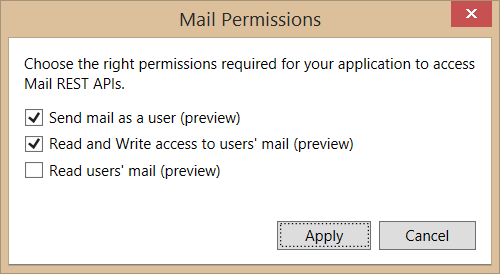
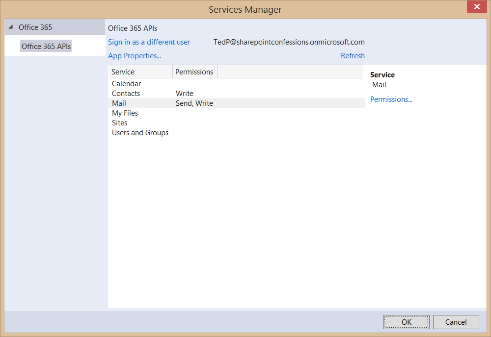
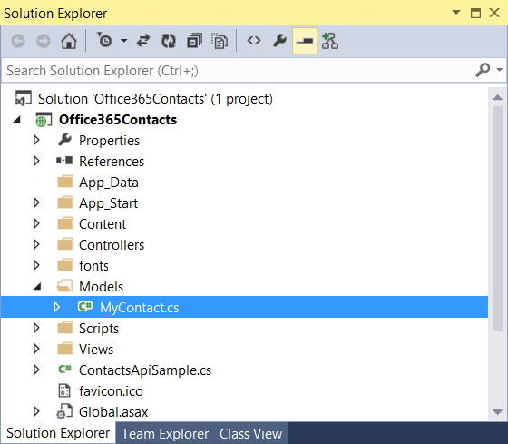

# Office 365 APIs for Calendar, Mail, and Contacts
In this lab, you will use the Exchange client of the Office 365 APIs to program against Office 365 contacts as part of an ASP.NET MVC5 application.

## Prerequisites
1. You must have an Office 365 tenant and Windows Azure subscription to complete this lab. If you do not have one, the lab for **O3651-7 Setting up your Developer environment in Office 365** shows you how to obtain a trial. You must also have access to an Exchange inbox within an Office 365 developer tenancy.
2. You must have the Office 365 API Tools version 1.1.728 installed in Visual Studio 2013.

## Lab Setup: Setting up your Exchange account with Sample Contacts for Testing
1. Using the browser, navigate to https://outlook.office365.com/owa and log into your OWA mailbox.
2. In the top navigation bar, click the **People** link to navigate to the page which shows you your contacts.
3. Make sure there are a few contacts for testing. If you have no contacts or less then 10 contacts, use OWA to enter a few sample contacts so you have at least 10.
4. Once you have verified that you have a set of contacts for testing, you can move on to the next exercise where you will create and test your first app that programs against this contacts list.

## Exercise 1: Create an ASP.NET MVC5 Application
In this exercise, you will create the ASP.NET MVC5 application and register it with Azure active Directory.

1. Launch **Visual Studio 2013** as administrator. 
2. In Visual Studio select **File/New/Project**.
3. In the **New Project** dialog, select **Templates/Visual C#/Web** and click **ASP.NET Web Application**. Name the new project **Office365Contacts** and then click **OK**.  
         
4. In the **New ASP.NET Project** dialog, click **MVC** and then click **Change Authentication**.
5. Select **No Authentication** and click **OK**.

6. Once the **New ASP.NET Project** dialog appears like the following screenshot, click **OK**. 

7. In the **Solution Explorer**, right click the **Office365Contacts** project and select **Add/Connected Service**.
	2. In the **Services Manager** dialog:
    1. Click **Register Your App**.
    2. When prompted, login with your **Organizational Account**.
    3. Click **Contacts**.
    4. Click **Permissions**.
    5. Check **Have full access to users' contacts**.
    6. Click **Apply**. 
       
    8. Click **Mail**.
    9. Click **Permissions**.
    10. Check **Send mail as a user**.
    11. Check **Read and Write access to users' mail**.    
    12. Click **Apply**. 
       
    13. Click **OK**. 
       

## Exercise 2: Code the Files API
In this exercise, you will create a respository object for wrapping CRUD operations associated with the Contacts API.

1. In the **Solution Explorer**, locate the **Models** folder in the **Office365Contacts** project.
2. Right-click the **Models** folder and select **Add/Class**.
3. In the **Add New Item** dialog, name the new class **MyContact** and click **Add** to create the new source file for the class.  
 
4. At the top of the course file **MyContact.cs**, add the following using statement just after the using statements that are already there.

		using System.ComponentModel;
5. Implement the new class **MyContact** using the following class defintion.
		
		public class MyContact {
		    public string Id { get; set; }
		    [DisplayName("First Name")]
		    public string GivenName { get; set; }
		    [DisplayName("Last Name")]
		    public string Surname { get; set; }
		    [DisplayName("Company")]
		    public string CompanyName { get; set; }
		    [DisplayName("Work Phone")]
		    public string BusinessPhone1 { get; set; }
		    [DisplayName("Home Phone")]
		    public string HomePhone1 { get; set; }
		    [DisplayName("Email Address")]
		    public string EmailAddress1 { get; set; }
		
		}
6. Right-click the **Models** folder and select **Add/Class**. In the **Add New Item** dialog, name the new class **MyContactsRepository** and click **Add** to create the new source file for the class.    
 
7. **Add** the following using statements to the top of the **MyContactsRepository** class.
		
		using Microsoft.Office365.OAuth;
		using Microsoft.Office365.Exchange;
		using System.IO;
		using System.Threading.Tasks;
8. **Add** the following helper functions to the **MyContactsRepository** class to manage session state variables.

		private void SaveInCache(string name, object value){
		  System.Web.HttpContext.Current.Session[name] = value;
		}
		
		private object GetFromCache(string name){
		  return System.Web.HttpContext.Current.Session[name];
		}
		
		private void RemoveFromCache(string name){
		  System.Web.HttpContext.Current.Session.Remove(name);
		}
6. **Add** a function named **EnsureClientCreated** to the **MyContactsRepository** class with the following implementation to create and return an **ExchangeClient** object.
		
		private async Task<ExchangeClient> EnsureClientCreated() {
		
		    DiscoveryContext disco = GetFromCache("DiscoveryContext") as DiscoveryContext;
		
		    if (disco == null) {
		        disco = await DiscoveryContext.CreateAsync();
		        SaveInCache("DiscoveryContext", disco);
		    }
		
		    string ServiceResourceId = "https://outlook.office365.com";
		    Uri ServiceEndpointUri = new Uri("https://outlook.office365.com/ews/odata");
		
		    var dcr = await disco.DiscoverResourceAsync(ServiceResourceId);
		
		    SaveInCache("LastLoggedInUser", dcr.UserId);
		
		    return new ExchangeClient(ServiceEndpointUri, async () => {
		        return (await disco.AuthenticationContext.AcquireTokenByRefreshTokenAsync(
		            new SessionCache().Read("RefreshToken"),
		            new Microsoft.IdentityModel.Clients.ActiveDirectory.ClientCredential(
		                disco.AppIdentity.ClientId,
		                disco.AppIdentity.ClientSecret),
		                ServiceResourceId)).AccessToken;
		    });	
		}

7. **Add** a function named **GetContactCount** to the **MyContactsRepository** class to retrieve a count of contacts.

		public async Task<int> GetContactCount() {
		    var client = await EnsureClientCreated();
		    var contactsResults = await client.Me.Contacts.ExecuteAsync();
		    return contactsResults.CurrentPage.Count;
		}
8. **Add** a function named **GetContacts** to the **MyContactsRepository** class to retrieve and return a list of **MyContact** objects.
		
		public async Task<List<MyContact>> GetContacts(int pageIndex, int pageSize) {
		
		    var client = await EnsureClientCreated();
		    var contactsResults = await client.Me.Contacts.ExecuteAsync();
		
		    var myContactsList = new List<MyContact>();
		
		    foreach (var contact in contactsResults.CurrentPage.OrderBy(e => e.Surname).Skip(pageIndex * pageSize).Take(pageSize)) {
		        myContactsList.Add(new MyContact {
		            Id = contact.Id,
		            GivenName = contact.GivenName,
		            Surname = contact.Surname,
		            CompanyName = contact.CompanyName,
		            EmailAddress1 = contact.EmailAddress1,
		            BusinessPhone1 = contact.BusinessPhone1,
		            HomePhone1 = contact.HomePhone1
		        });
		    }
		    return myContactsList;
		}
8. Add a **DeleteContact** function  to the **MyContactsRepository** class to delete a contact.

		public async Task DeleteContact(string id) {
		    var client = await EnsureClientCreated();
		    var contact = await client.Me.Contacts.GetById(id).ExecuteAsync();
		    await contact.DeleteAsync();
		}
9. Add a **AddContact** function  to the **MyContactsRepository** class to create a new contact.

		public async Task AddContact(MyContact myContact) {
		    var client = await EnsureClientCreated();
		    var newContact = new Microsoft.Office365.Exchange.Contact {
		        GivenName = myContact.GivenName,
		        Surname = myContact.Surname,
		        CompanyName = myContact.CompanyName,
		        EmailAddress1 = myContact.EmailAddress1,
		        BusinessPhone1 = myContact.BusinessPhone1,
		        HomePhone1 = myContact.HomePhone1
		    };
		    await client.Me.Contacts.AddContactAsync(newContact);
		}

## Exercise 3: Code the MVC Application
In this exercise, you will code the **Home** controller of the MVC application to display contacts as well as adding behavior for adding and deleting contacts.

1. In the **Solution Explorer**, expand the **Controllers** folder and open the **HomeController.cs** file.
2. **Add** the following using statements to the top of the file.

		using Microsoft.Office365.OAuth;
		using System.Threading.Tasks;
		using Office365Contacts.Models;
3. **Replace** the **Index** method with the following code to read files.
		
		public async Task<ActionResult> Index(int? pageNumber) {
		
		    int pageSize = 8;
		    int pageIndex = (pageNumber != null) ? (int)pageNumber - 1 : 0;
		
		    ViewBag.pageIndex = pageIndex;
		    ViewBag.pageSize = pageSize;
		
		    List<MyContact> contacts = null;
		    try {
		        MyContactsRepository repository = new MyContactsRepository();
		        ViewBag.contactCount = await repository.GetContactCount();
		        contacts = await repository.GetContacts(pageIndex, pageSize);
		    }
		    catch (RedirectRequiredException x) {
		        return Redirect(x.RedirectUri.ToString());
		    }
		    return View(contacts);
		}
4. In the **Solution Explorer**, expand the **Views/Home** folder and open the **Index.cshtml** file.
5. Delete all existing content from **Index.cshtml** and replace it with the following code.
		
		@model IEnumerable<Office365Contacts.Models.MyContact>
		
		@{ ViewBag.Title = "My Contacts"; }
		
		<h2>My Contacts</h2>
		
		
@Html.ActionLink("Create New", "Create")

		
		<table id="contactsTable" class="table table-striped table-bordered">
		    <tr>
		        <th>@Html.DisplayNameFor(model => model.GivenName)</th>
		        <th>@Html.DisplayNameFor(model => model.Surname)</th>
		        <th>@Html.DisplayNameFor(model => model.CompanyName)</th>
		        <th>@Html.DisplayNameFor(model => model.BusinessPhone1)</th>
		        <th>@Html.DisplayNameFor(model => model.HomePhone1)</th>
		        <th>@Html.DisplayNameFor(model => model.EmailAddress1)</th>
		        <th></th>
		    </tr>
		    @foreach (var item in Model) {
		        <tr>
		            <td>@Html.DisplayFor(modelItem => item.GivenName)</td>
		            <td>@Html.DisplayFor(modelItem => item.Surname)</td>
		            <td>@Html.DisplayFor(modelItem => item.CompanyName)</td>
		            <td>@Html.DisplayFor(modelItem => item.BusinessPhone1)</td>
		            <td>@Html.DisplayFor(modelItem => item.HomePhone1)</td>
		            <td>@Html.DisplayFor(modelItem => item.EmailAddress1)</td>
		            <td>@Html.ActionLink("Delete", "Delete", new { id = item.Id })</td>
		        </tr>
		    }
		</table>
6. Enter the following code into **Index.cshtml** at the bottom under the table element you created in the previous step. Note that this code is being added at the bottom of the page to support paging.

		

		    <h4>Paging Control</h4>
		    

		        @{
		            int pageIndex = ViewBag.pageIndex;
		            int pageSize = ViewBag.pageSize;
		            int contactCount = ViewBag.contactCount;
		
		            int pageCount = (int)System.Math.Ceiling((double)contactCount / (double)pageSize);
		
		            for (int i = 1; i <= pageCount; i++) {
		                Dictionary<string, object> attributes = new Dictionary<string, object>();
		                attributes.Add("class", "btn btn-default");
		                RouteValueDictionary routeValues = new RouteValueDictionary();
		                routeValues.Add("pageNumber", i.ToString());
		                @Html.ActionLink("Page " + i.ToString(), "Index", "Home", routeValues, attributes);
		            }
		        }
		    

		

7. In **Visual Studio**, hit **F5** to begin debugging.
8. When prompted, log in with your **Organizational Account**.
9. Once the application has initialized and displayed its home page, you should be able to verify that your application displays contacts from your Office 365 account.  
 
10. Try using the paging controls at the bottom of the page. As long as you have nine or more contacts, you should have at least two pages. Test the paging buttons to verify that they can be used to navigate from page to page.
11. Close the browser window, terminate the debugging session and return to Visual Studio.
12. In the **HomeController.cs** file, add an action method named **Delete** using the following code to delete a contact.

        public async Task<ActionResult> Delete(string id) {
            MyContactsRepository repository = new MyContactsRepository();
            if (id != null) {
                await repository.DeleteContact(id);
            }
            return Redirect("/");
        }

13. In the **HomeController.cs** file, add an action method named **Createusing the following code to create a new contact.

		 public async Task<ActionResult> Create(MyContact myContact) {
		    if (Request.HttpMethod == "POST") {
		        MyContactsRepository repository = new MyContactsRepository();
		        await repository.AddContact(myContact);
		        return Redirect("/");
		    }
		    else {
		        return View(myContact);
		    }
		}
14. Now you must create a new MVC view for the **Create** action method. You can accomplish this right-clicking on the white space inside the the **Create** action method in the **HomeController.cs** and selecting **Add View**.
15. In the **Add View** dialog, select **Create** as the **Template** and select **MyContact** as the model class. When the **Add View** dialog matches the following screenshot, click add to generate the view.  
 
16, Take a moment to look through the code that has been added into the new view file **Create.cshtml**. Note there is no need to modify anything because it should provide the needed behavior without any changes.
17. Press **F5** to begin a debugging session. When prompted, log in using your Office 365 credentials and then wait for the home page to appear.
18. Test the delete functionality of the app by clicking on the **Delete** link for a contact in the table of contacts.
19. Test the create functionality of the app by clicking the **Create New** link on the home page and navigating to the **Create** page. Fill in the input controls with a sample contact and click **Create**.  
 
20. After clicking **Create**, you should be able to verify that the contact was properly created.  
 

Congratulations! You have completed working with the the Exchange Client APIs.

