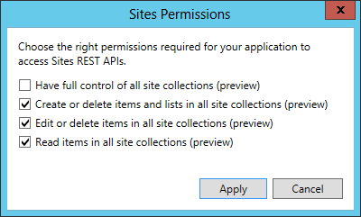
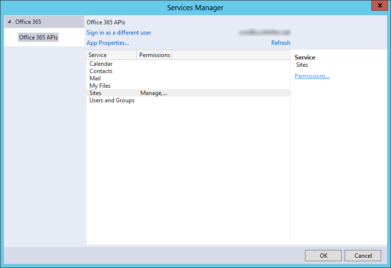
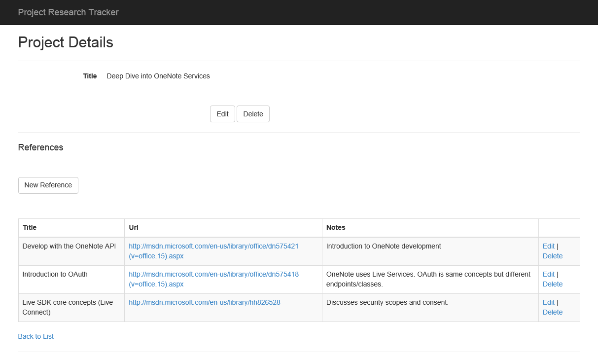

# Office 365 APIs for OneNote Services
In this lab, you will use the APIs for the OneNote Service as part of an ASP.NET MVC5 application to archive web pages stored in a Project Research Tracking application.

## Prerequisites
1. You must have an Office 365 tenant and Windows Azure subscription to complete this lab. If you do not have one, the lab for **O3651-7 Setting up your Developer environment in Office 365** shows you how to obtain a trial.
2. You must have the Office 365 API Tools version 1.1.728 installed in Visual Studio 2013.
3. You must have a Microsoft Account (formerly known as a Windows Live Id) and an online OneNote notebook under that account.

## Exercise 1: Register an App with Windows Live Services
In this exercise, you will register an application with Windows Live Services. Windows Live is the underlying service that hosts the OneNote Service.

1. Navigate to the **Microsoft account Developer Center** at http://go.microsoft.com/fwlink/p/?LinkId=193157
2. Log in with your Microsoft Account.
3. Name the application **Research Tracker Archive**
4. Click **I accept**
5. In the left navigation, click **API Settings**
6. On the **API Settings** page:
	1. For **Mobile or desktop client app:**, choose **No**.
	2. For **Restrict JWT issuing:**, choose **Yes**.
	3. Enter a Redirect URL of **https://officedevlocal.com/OneNote/Process**
	4. Click **Save**
7. In the left navigation, click **App Settings**
	1. On the **App Settings** page, make note of the **Client ID** and **Client secret**. These will be added to the application code.

##Exercise 2: Configure the starter project and create data
In this exercise, you will configure the starter project to connect to your Office 365 tenant. You will also create data using the app for use in a later exercise.  The starter project is a copy of the **Research Project Tracker** project available at https://github.com/OfficeDev/Research-Project-Code-Sample. The starter project uses the Visual Studio-generated scaffolding for the user interface instead of the AngularJS framework. More information about the Research Project Tracker sample can be found in its GitHub repository.

1. Launch **Visual Studio 2013** as an administrator.
2. In Visual Studio, select **File/Open Project**.
3. In the **Open Project** dialog, select **SPResearchTracker.sln** from the **Labs\SpResearchTracker** folder.
4. In Solution Explorer, double-click on the **Properties** node of the SPResearchTracker project.
	1. Choose the **Web** properties from the left navigation.
	2. In the Start Action section, choose **Start URL**. Enter a Start URL of **https://officedevlocal.com:44300/**.
	3. In the Servers section:
		1. Click **Create Virtual Directory**.
			*You must be running Visual Studio as an administrator to create a virtual directory.*
		2. Choose to Override application root URL. Enter an application root URL of **https://officedevlocal.com:44300/**
	4. Press **Ctrl+S** to save the web properties.
5. Launch **NotePad** as an administrator.
6. In Notepad, select **File/Open**.
7. In the **Open** dialog, select file **My Documents\IISExpress\config\applicationhost.config**
8. Modify the bindings of the SPResearchTracker project:
	1. Press **Ctrl+F** to invoke the Find command. In the Find what box, enter **SPResearchTracker**
	2. Ensure you have found the correct &lt;site> node by inspecting the &lt;virtualDirectory node. The physicalPath attribute should match the location of the .csprof file.
	3. Modify the &lt;binding> node. Change the bindingInformation attribute to ***:44300:officedevlocal.com**.
	4. Save and close file **applicationhost.config**.
9. In Notepad, select **File/Open**
10. In the **Open** dialog, select file **C:\windows\system32\drivers\etc\hosts**
	1. Add an entry:

			127.0.0.1	officedevlocal.com 
	
	2. Save and close file **hosts**.
11. Return to **Visual Studio**.
12. Right-click on the **SPResearchTracker** project and choose **Add.../Connected Service**.
	1. In the **Services Manager** dialog, sign in to your Office 365 tenant.
	2. You may see a pop-up indicating that the **App registration is not found**. If so, click **Yes** to re-register the app.
	3. If you do not see a pop-up, click **Register your app**.
    3. Click **Sites**.
    4. Click **Permissions**.
    5. Check **Create or Delete Items and Lists in All Site Collections**.
    6. Check **Edit or Delete Items in All Site Collections**.
    7. Check **Read Items in All Site Collections**.
    8. Click **Apply**. 
       
    9. Click **OK**. 
       

13. In **Solution Explorer**, delete the file **SitesApiSample.cs**. This file was added as part of the Connected Service, but is not necessary for this application.
14. Open the **web.config** file. In the &lt;appSettings> section, locate the following keys and change the values to match your Office 365 tenant.
	- **ida:Tenant**
	- **ida.SiteUrl**

15. Press **Ctrl+F5** to run the application. Create a Project and add several references.

##Exercise 3: Add OneNote Services
In this exercise, you will extend the application to enable OneNote functionality. You will add a button to the application that will Create a OneNote section containing the references of the current project.

1. Add a button to invoke the OneNote services.
	1. Open the file **Views\Home\_Project.cshtml**
	2. Locate the comment **@*[[ OneNote Button ]]*@** and replace with the following:

			@Html.ActionLink("Archive in OneNote", "Index", "OneNote", new { id = Model.Id }, new { @class = "btn btn-default" })

	3. Save and close the **_Project.cshtml** file.
2. Add the LiveSDK to the project:
	1. In Visual Studio, select **Tools/NuGet Package Manager/Package Manager Console**,
	2. In the Package Manager Console, type the command **Install-Package LiveSDKServer** and press Enter

	This will install the LiveSDK into the current project.

3. Add a model to support the communication with Live Services:
	1. Right-click on the **Models** folder and select **Add/Class...***.
	2. In the **Add New Item** dialog, enter a Name of **OneNoteViewModel**.
	3. Click **Add**.
	4. Add the following properties to the **OneNoteViewModel** class:

			public string ResponseMessage { get; set; }
			public string NewNotebookLink { get; set; }

4. Add a controller to manage the communication with Live Services:
	1. Right-click on the **Controllers** folder and select **Add/Controller...**.
	2. In the **Add Scaffold** dialog, choose **MVC 5 Controller - Empty**. Click **Add**
	3. Name the controller **OneNoteController**

5. In the new controller, add the following using directives:

		using Microsoft.Live;
		using SPResearchTracker.Models;
		using System.Threading.Tasks;
		using System.Text;

6. In the new controller, add the following class-scoped constants before the Index method:

        private const string clientId = "[LiveClientId]";
        private const string clientSecret = "[LiveClientSecret]";
        private const string clientRedirect = "https://officedevlocal.com:44300/OneNote/Process";
        private string[] scopes = new string[] { "wl.signin", "wl.offline_access", "Office.OneNote_Create" };

	Replace the string constants for **clientId** and **clientSecret** with values from the App Registration

7. Create a class-scoped variable to manage the Live Services authentication:

		private LiveAuthClient liveAuthClient = new LiveAuthClient(clientId, clientSecret, clientRedirect); 

8. Modify the Index action (method) to support asynchrony and to accept a project id by changing the method declaration to the following:

		public async Task<ActionResult> Index(string id)

9. In the Index action, add code to initialize the Live Services session and redirect the browser to the Live Services log in page:

		// save the selected project id
		this.HttpContext.Session["onenote-project"] = id;
		LiveLoginResult loginStatus = await liveAuthClient.InitializeWebSessionAsync(this.HttpContext);
		return Redirect(liveAuthClient.GetLoginUrl(scopes)); 
  
10. The Index action will redirect the browser to the Live Log in page. Once log in and consent is completed, the Live service will redirect to your application. The Process action will perform the creation of the OneNote Notebook for the selected project.

	Add an action to handle the redirect from Live Services:

		public async Task<ActionResult> Process(string code)
		{
			OneNoteViewModel model = new OneNoteViewModel();
			// variable declarations

			if (code != null)
			{
				LiveLoginResult loginStatus = await liveAuthClient.ExchangeAuthCodeAsync(this.HttpContext);

				// processing steps

				return View(model);
			}
			else
			{
				RedirectToAction("Index", "Home");
			}
			return null;
		}

11. Create a view for the Process method.
	1. Right-click in the code window, inside of the Process method.
	
	2. Choose **Add View...**.
	3. Enter a View name of **Process**.
	4. Select a Template of **Details**
	5. Select a Model class of **OneNoteViewModel (SPResearchTracker.Models)**
	6. Click **Add**.
	7. Replace the **DisplayFor** method of the ResponseMessage property with the following:

			@Html.Raw(Model.ResponseMessage)

	8. Replace the **DisplayFor** method of the NewNotebookLink property with the following:

			<a target="_blank" href="@Model.NewNotebookLink">@Model.NewNotebookLink</a>

	9. Remove the two lines containing @Html.ActionLink entries from the bottom of the view.  
12. Create a Model for OneNote notebooks.
	1. In Solution Explorer, right-click on the **Models** folder.
	2. Choose **Add/Class**.
	3. Name the class **OneNoteNotebook**.
	4. Replace the default class definition with the following:

			public class OneNoteNotebook
			{
				public string name { get; set; }
				public bool isDefault { get; set; }
				public string userRole { get; set; }
				public bool isShared { get; set; }
				public string sectionsUrl { get; set; }
				public string sectionGroupsUrl { get; set; }
				public OneNoteNotebookLink links { get; set; }
				public string self { get; set; }
				public string id { get; set; }
				public string createdBy { get; set; }
				public DateTime createdTime { get; set; }
				public string lastModifiedBy { get; set; }
				public DateTime lastModifiedTime { get; set; }
			}
		
			public class OneNoteNotebookLink
			{
				public OneNoteNotebookLinkUrl oneNoteClientUrl { get; set; }
				public OneNoteNotebookLinkUrl oneNoteWebUrl { get; set; }
			}
		
			public class OneNoteNotebookLinkUrl
			{
				public string href { get; set; }
			}
		
			public class OneNoteNotebookCreationInformation
			{
				public string name { get; set; }
			}

13. Create a Model for OneNote notebooks.
	1. In Solution Explorer, right-click on the **Models** folder.
	2. Choose **Add/Class**.
	3. Name the class **OneNoteSection**.
	4. Replace the default class definition with the following:

			public class OneNoteSection
			{
				public bool isDefault { get; set; }
				public string pagesUrl { get; set; }
				public string self { get; set; }
				public string id { get; set; }
				public string name { get; set; }
				public string createdBy { get; set; }
				public DateTime createdTime { get; set; }
				public string lastModifiedBy { get; set; }
				public DateTime lastModifiedTime { get; set; }
			}
		
			public class OneNoteSectionCreationInformation
			{
				public string name { get; set; }
			}

14. Create a repository class to facilitate the communication with the OneNote API.
	1. In Solution Explorer, right-click on the **Models** folder.
	2. Choose **Add/Class**.
	3. Name the class **OneNoteRepository**.
	4. Add the following statements at the top of the class file:

			using Microsoft.Live;
			using Newtonsoft.Json;
			using Newtonsoft.Json.Linq;
			using System.Net.Http;
			using System.Net.Http.Formatting;
			using System.Net.Http.Headers;
			using System.Threading.Tasks;
 
	5. Add the following class-scoped variables in the OneNoteRepository class:

			private const string NotebookName = "Project Research Tracker";
			private const string notebooksEndPoint = "https://www.onenote.com/api/v1.0/notebooks";
			private LiveConnectSession liveConnectSession;

	6. Add the following constructor to the OneNoteRepository class:

			public OneNoteRepository(LiveConnectSession liveConnectSession)
			{
				this.liveConnectSession = liveConnectSession;
			}

	7. Add the following **GetNotebook** method to the **OneNoteRepository** class.

		This method will make a REST call to the OneNote API that includes an OData filter to select a single notebook. The "GET notebooks" endpoint always returns an array of notebooks, so the first entry in the array is returned.

			public async Task<Tuple<string, OneNoteNotebook>> GetNotebook(string filter)
			{
				string uri = notebooksEndPoint;
				if (!String.IsNullOrEmpty(filter))
				{
					uri += "?$filter=" + filter;
				}
				var getNotebookMessage = new HttpRequestMessage(HttpMethod.Get, uri);
				HttpClient httpClient = new HttpClient();
				httpClient.DefaultRequestHeaders.Authorization = 
				  new AuthenticationHeaderValue("Bearer", liveConnectSession.AccessToken);
				httpClient.DefaultRequestHeaders.Accept.Add(
				  new MediaTypeWithQualityHeaderValue("application/json"));
	
				HttpResponseMessage response = await httpClient.SendAsync(getNotebookMessage);
	
				OneNoteNotebook notebook = null; 
				if (response.StatusCode == System.Net.HttpStatusCode.OK)
				{
					string payload = await response.Content.ReadAsStringAsync();
	
					dynamic results = JsonConvert.DeserializeObject(payload);
					JArray resultArray = results.value as JArray;
					if (resultArray.Count > 0)
					{
						JObject jNotebook = resultArray[0] as JObject;
						notebook = jNotebook.ToObject<OneNoteNotebook>(); 
					}
				}
				string status = String.Format("HttpStatus: {0} - {1} notebook: {2}",
												(int)response.StatusCode, response.ReasonPhrase,
												(notebook == null) ? "null" : notebook.id);
				return Tuple.Create(status, notebook);
			}

	8. Add the following **CreateNotebook** method to the **OneNoteRepository** class.
	
		This method will make a REST call to the OneNote API to create a notebook. The "POST notebooks" endpoint request must include a JSON object with the name of the notebook to create. We created a **OneNoteNotebookCreationInformation** object for this purpose. (The name follows the familiar SharePoint creation information object naming scheme.) The "POST notebooks" endpoint returns just the new notebook, so the response payload is deserialized directly into a OneNoteNotebook object.	

			public async Task<Tuple<string, OneNoteNotebook>> CreateNotebook()
			{
				var createNotebookMessage = new HttpRequestMessage(HttpMethod.Post, notebooksEndPoint)
				{
					Content = new ObjectContent<OneNoteNotebookCreationInformation>(
													new OneNoteNotebookCreationInformation { name = NotebookName },
													new JsonMediaTypeFormatter(), "application/json")
				};
	
				HttpClient httpClient = new HttpClient();
				httpClient.DefaultRequestHeaders.Authorization = 
					new AuthenticationHeaderValue("Bearer", liveConnectSession.AccessToken);
				httpClient.DefaultRequestHeaders.Accept.Add(
					new MediaTypeWithQualityHeaderValue("application/json"));
	
				HttpResponseMessage response = await httpClient.SendAsync(createNotebookMessage);
	
				OneNoteNotebook notebook = null;
				if (response.StatusCode == System.Net.HttpStatusCode.Created)
				{
					string payload = await response.Content.ReadAsStringAsync();
					notebook = JsonConvert.DeserializeObject<OneNoteNotebook>(payload);
				}
				string status = String.Format("HttpStatus: {0} - {1} notebook: {2}",
												(int)response.StatusCode, response.ReasonPhrase,
												(notebook == null) ? "null" : notebook.id);
				return Tuple.Create(status, notebook);
			}

	9. Add the following **GetNotebookSection** method to the **OneNoteRepository** class. 
	
		This class follows a pattern similar to the GetNotebook method.

			public async Task<Tuple<string, OneNoteSection>> GetNotebookSection(OneNoteNotebook notebook, string filter)
			{
				string uri = notebook.sectionsUrl + "?$filter=" + filter;
				var getSectionMessage = new HttpRequestMessage(HttpMethod.Get, uri);
				HttpClient httpClient = new HttpClient();
				httpClient.DefaultRequestHeaders.Authorization = 
					new AuthenticationHeaderValue("Bearer", liveConnectSession.AccessToken);
				httpClient.DefaultRequestHeaders.Accept.Add(
					new MediaTypeWithQualityHeaderValue("application/json"));
	
				HttpResponseMessage response = await httpClient.SendAsync(getSectionMessage);
	
				OneNoteSection section = null;
				if (response.StatusCode == System.Net.HttpStatusCode.OK)
				{
					string payload = await response.Content.ReadAsStringAsync();
					dynamic results = JsonConvert.DeserializeObject(payload);
					JArray resultArray = results.value as JArray;
					if (resultArray.Count > 0)
					{
						JObject jSection = resultArray[0] as JObject;
						section = jSection.ToObject<OneNoteSection>();
					}
				}
				string status = String.Format("HttpStatus: {0} - {1} section: {2}",
												(int)response.StatusCode, response.ReasonPhrase,
												(section == null) ? "null" : section.id);
				return Tuple.Create(status, section);
			}

	10. Add the following **CreteNotebookSection** method to the **OneNoteRepository** class. 
	
		This class follows a pattern similar to the CreateNotebook method.

			public async Task<Tuple<string, OneNoteSection>> CreateSection(OneNoteNotebook notebook, string sectionName)
			{
				var createSectionMessage = new HttpRequestMessage(HttpMethod.Post, notebook.sectionsUrl)
				{
					Content = new ObjectContent<OneNoteSectionCreationInformation>(
													new OneNoteSectionCreationInformation { name = sectionName },
													new JsonMediaTypeFormatter(), "application/json")
				};
	
				HttpClient httpClient = new HttpClient();
				httpClient.DefaultRequestHeaders.Authorization = 
				  new AuthenticationHeaderValue("Bearer", liveConnectSession.AccessToken);
				httpClient.DefaultRequestHeaders.Accept.Add(
				  new MediaTypeWithQualityHeaderValue("application/json"));
	
				HttpResponseMessage response = await httpClient.SendAsync(createSectionMessage);
	
				OneNoteSection section = null;
				if (response.StatusCode == System.Net.HttpStatusCode.Created)
				{
					string payload = await response.Content.ReadAsStringAsync();
					section = JsonConvert.DeserializeObject<OneNoteSection>(payload);
				}
				string status = String.Format("HttpStatus: {0} - {1} section: {2}",
												(int)response.StatusCode, response.ReasonPhrase,
												(section == null) ? "null" : section.id);
				return Tuple.Create(status, section);
			}

	11. Add the following **CreatePageForReference** method to the **OneNoteRepository** class.

		To take a snapshot of the referenced web page, this method uses the *data-render-src* approach for creating the content. This instructs the OneNote service to capture the referenced page as an image.

		Since the only content being added to OneNote is the html containing notes and the &lt;img> element, a non-multi-part request is used.

			public async Task<string> CreatePageForReference(string pageEndPoint, Reference reference)
			{
				string pageTemplate = @"<html>" +
										"<head>" +
										  "<title>{0}</title>" +
										  "<meta name=\"created\" content=\"{1}\" />" +
										"</head>" +
										"<body>" +
										  "
{2}
" +
										  "" +
										"</body>" +
									   "</html>";
				string pageContent = String.Format(pageTemplate,
											reference.Title,
											DateTime.Now.ToString("o"),
											reference.Notes,
											reference.Url,
											reference.Title);
	
				var createPageMessage = new HttpRequestMessage(HttpMethod.Post, pageEndPoint)
				{
					Content = new StringContent(pageContent, System.Text.Encoding.UTF8, "text/html")
				};
	
				HttpClient httpClient = new HttpClient();
				httpClient.DefaultRequestHeaders.Authorization = 
					new AuthenticationHeaderValue("Bearer", liveConnectSession.AccessToken);
				httpClient.DefaultRequestHeaders.Accept.Add(
					new MediaTypeWithQualityHeaderValue("application/json"));
	
				HttpResponseMessage response = await httpClient.SendAsync(createPageMessage);
	
				return String.Format("HttpStatus: {0} - {1}", (int)response.StatusCode, response.ReasonPhrase);
			}

15. Now that the models and repository are created, the controller can be changed to perform the steps required to archive the project references to OneNote.
 
	1. Open the **OneNoteController**.
	2. Locate the comment **// variable declarations** in the Process method.
	3. Replace the comment with the following:
			StringBuilder status = new StringBuilder();
			Tuple<string, OneNoteNotebook> notebookApiResult = null;
			Tuple<string, OneNoteSection> sectionApiResult = null;
	4. Location the comment **// processing steps** in the Process method.
	5. Replace the comment with the following:

			// get the selected project
			string projectId = (string)this.HttpContext.Session["onenote-project"];
			ProjectDetailViewModel data = await GetProjectAndReferencesFromSharePoint(projectId);

			OneNoteRepository repository = new OneNoteRepository(loginStatus.Session);

			status.Append("GetNotebook: ");
			notebookApiResult = await repository.GetNotebook("name eq 'Project Research Tracker'");
			status.Append(notebookApiResult.Item1 + " ");
			OneNoteNotebook notebook = notebookApiResult.Item2;

			if (notebook == null)
			{
				status.Append("CreateNotebook: ");
				notebookApiResult = await repository.CreateNotebook();
				status.Append(notebookApiResult.Item1 + " ");
				notebook = notebookApiResult.Item2;
			}

			if (notebook != null)
			{
				model.NewNotebookLink = notebook.links.oneNoteWebUrl.href;

				string filter = String.Format("name eq '{0}'", data.Project.Title);
				status.Append("GetSection: ");
				sectionApiResult = await repository.GetNotebookSection(notebook, filter);
				status.Append(sectionApiResult.Item1 + " ");
				OneNoteSection section = sectionApiResult.Item2;

				if (section == null)
				{
					status.Append("CreateSection: ");
					sectionApiResult = await repository.CreateSection(notebook, data.Project.Title);
					status.Append(sectionApiResult.Item1 + " ");
					section = sectionApiResult.Item2;
				}

				if (section != null)
				{
					foreach (Reference reference in data.References)
					{
						status.Append("CreatePage: ");
						string result = await repository.CreatePageForReference(section.pagesUrl, reference);
						status.Append(result + " ");
					}
				}
			}

			model.ResponseMessage = status.ToString();

	6. Add the following helper method to the **OneNoteController**:

			private async Task<ProjectDetailViewModel> GetProjectAndReferencesFromSharePoint(string projectId)
			{
				ProjectDetailViewModel model = new ProjectDetailViewModel();
				ProjectsRepository projectRepository = new ProjectsRepository();
				ReferencesRepository referenceRepository = new ReferencesRepository();

				int id = -1;
				if (Int32.TryParse(projectId, out id))
				{
					model.Project = await projectRepository.GetProject(id, String.Empty);
					model.References = (await referenceRepository.GetReferencesForProject(id)).ToList();
				}
				return model;
			}
