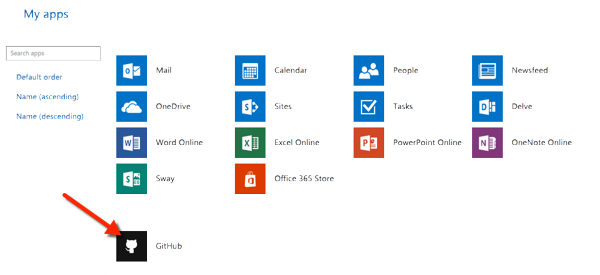
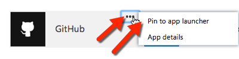
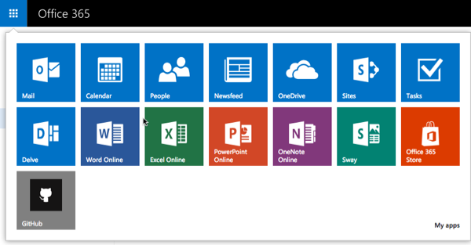

# Deep Dive into Office 365 App Launcher & My Apps Extensibility
In this lab you will explore the customization and extensibility options available using the Office 365 App Launcher & My Apps page.

## Prerequisites
1. You must have an Office 365 tenant and Microsoft Azure subscription to complete this lab. If you do not have one, the lab for **O3651-7 Setting up your Developer environment in Office 365** shows you how to obtain a trial. You must also have access to an Exchange inbox within an Office 365 developer tenancy.
1. You must have the Office 365 API Tools version 1.3.41104.1 installed in Visual Studio 2013.
1. For exercise 1, you will need access to an account in [GitHub](https://www.github.com).

## Exercise 1: Explore Single Sign-on with AzureAD Apps in the Azure App Gallery using a Username & Password
In this exercise you will configure and explore the single sign-on capability with Azure AD apps using a username and password. 

*This exercise will use a [GitHub](https://www.github.com) account to configure with single sign-on.*

1. Verify GitHub has not been added to your account in Office 365 yet:
  1. Navigate to http://portal.office.com and login using an account in your Office 365 tenant.
  1. Click the *waffle* icon in the top-left corner of the page to activate the **App Launcher**:

    

  1. Notice that GitHub is not listed on this page.
  1. Click the **My Apps** link in the lower-right corner of the App Launcher.
  1. Notice in the lower-half of the page, a GitHub app tile is not present.

1. Add GitHub to your organization's Azure AD apps from the Application Gallery
  1. Login to the Azure Management Portal at https://manage.windowsazure.com using the global administrator account for your Azure subscription.
  1. When the Azure Management Portal loads, scroll down to the bottom of the left-hand navigation and click the **Active Directory** option.
  1. Select the Azure AD directory for your Office 365 tenant.
  1. Select the **Applications** menu item in the top-navigation.
  1. Using the controls at the bottom of the page, click the **Add** button.
  1. On the **What do you want to do?** dialog, click the **Add an application from the gallery** option.
  1. Using the search box in the top-right corner of the application browser, enter *github* and click the search icon to execute a search.
  1. Select **GitHub** in the search result and click the check button in the lower right:

    

1. Configure GitHub for the organization:
  1. On the **Applications** page in the Azure AD directory, click the **GitHub** entry.
  1. On the **GitHub** application page, click the **Configure single sign-on** button.
  1. Notice how it is already configured for **Password Single Sign-On**. Do not change this setting & click the check in the lower right corner of the dialog.
  
    > The other option, *Existing Single Sign-On*, is used when the other system supports Active Directory Federation Services or other third-party single sign-on providers.
  
  1. Click the **Assign Users** button.
  1. Select the user you are testing in your directory and click the **Assign** button at the bottom of the page.
  1. Check the **I want to enter GitHub credentials on behalf of the user**.
  1. Enter the username and password for the user's account on GitHub.
  1. Click the check in the lower right corner of the dialog.

1. Verify GitHub is now on the My Apps page.
  1. Navigate back to the **My Apps** page in Office 365 by going back to Office 365, clicking on the *waffle* icon & then clicking on the **My Apps** link.
  1. Notice GitHub now appears on the user's *My Apps* page. Clicking on this will take you to GitHub and automatically log you into the site.

    

1. Add GitHub to the App Launcher:
  1. While still on the My Apps page, hover over the GitHub tile & select the **...** menu.
  1. Select the menu item **Pin to app launcher**.

    

  1. Now, click the *waffle* icon to see the GitHub app is now listed on your app launcher.

    

In this exercise you added an application that uses username and password for authentication to your Office 365 App Launcher and My Apps page for single sign-on.

## Exercise 2: Sign Up to An Application that Supports Azure AD Federated Authentication
In this exercise you will sign up for an application that supports Azure AD federated authentication. As part of this process, you will see how the application leverages the support for OpenID Connect to retrieve some details about the signed in user.

1. Within a browser, navigate to the site http://www.smartsheet.com.
1. Click the **login** button on the homepage.
1. On the login page, click the icon for the Azure AD / Organization Account login:

    

1. Smartsheet will redirect you back to the Azure AD signon page. Once you've signed in, you will be prompted to grant Smartsheet the ability to sign you in and read your profile. Click **Accept** to continue:

    

1. After signing in, Smartsheet will prompt you to confirm your account by clicking on a link they sent to your account in email. Complete this confirmation process.
1. Once you have completed the signup process and are logged into Smartsheet, click the **Account => Personal Settings..** menu item.
1. Notice how how the application is listing your first & last name even though you didn't enter this information. This is because Smartsheet retrieved it using an OpenID Connect token that was passed to Smartsheet from Azure AD upon a successful signin.
1. Verify Smartsheet is now on the My Apps page.
  1. Navigate back to the **My Apps** page in Office 365 by going back to Office 365, clicking on the *waffle* icon & then clicking on the **My Apps** link.
  1. Notice Smartsheet now appears on the user's *My Apps* page. Clicking on this will take you to Smartsheet and automatically log you into the site.

In this exercise you signed up for an external application using the support for Azure AD federated login and added information to your new account using OpenID Connect.

## Exercise 3: Create a Custom Azure AD Application and Add it to your Office 365 App Launcher and My Apps Page
In this exercise you will create a custom Azure AD application and see how to add it to your Office 365 App Launcher menu and My Apps page.

1. Create an Azure AD application:

  > Usually you would create a web or client application that would go with this Azure AD application, but in this exercise, you only need an Azure AD application.

  1. In a browser navigate to https://manage.windowsazure.com & login.
  1. In the left-hand navigation, scroll down to and click on **Active Directory**.
  1. Click on the name of your Azure AD directory & then click **Applications** in the toolbar. 

    

  1. Click the **Add** button at the bottom of the display.
  1. On the **What do you want to do** page, click **Add an application my organization is developing**. This will start the **Add Application** wizard.
  1. In the **Add Application** wizard, enter a name of **My App Launcher App** and choose the type **Web Application and/or Web API**. Click the arrow to advance to the next page of the wizard.
  1. In the **App Properties** page, enter a **SIGN-ON URL** of **http://dev.office.com**

  1. Enter an **App ID Uri** of **http://[your-tenant].onmicrosoft.com/MyAppLauncherApp**.
    > NOTE: The App ID Uri must be unique within the Azure tenancy. Using a host name that matches your tenant name helps to prevent confusion, and using a value for the path that matches the app name helps to enforce uniqueness. This value can be changed if the app name or purpose changes.
  1. Click the **check** image in the lower right of the wizard to create the application. The application **Quick Start** page will display once the application is created.

    

  1. Click the **Save** button at the bottom of the page.

1. Assign the application to someone in your organization:
  1. Within the Active Directory page within the Azure Management Portal, find the application you just created.
  1. Click the **Users** menu item in the top-navigation for the app.
  1. Select the user you are testing in your directory and click the **Assign** button at the bottom of the page.
    1. When prompted, confirm you want to enable access to the app for the selected user by clicking the **Yes** option in the footer.

1. Verify your custom Azure AD application is now on the My Apps page.
  1. Navigate back to the **My Apps** page in Office 365 by going back to Office 365, clicking on the *waffle* icon & then clicking on the **My Apps** link.
  1. Notice **My App Launcher App** now appears on the user's *My Apps* page. Clicking on this will take you to your app's signon page (*which in this case is just the Office Developer homepage*).

  > Just like the previous exercises, you could pin this app to your App Launcher from the My Apps page.

In this exercise you created a custom Azure AD application and saq how to add it to your Office 365 App Launcher menu and My Apps page.