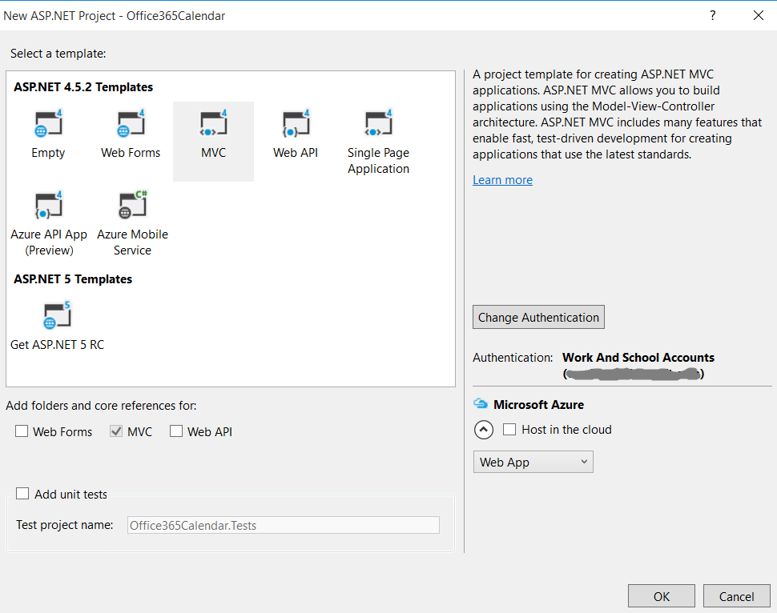
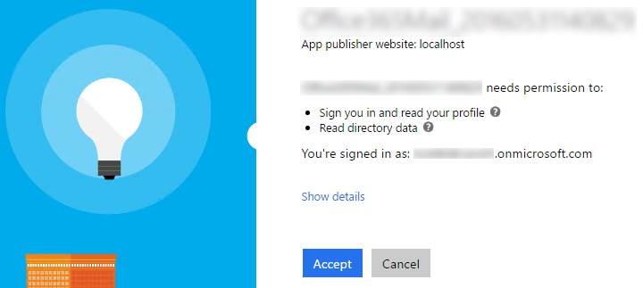
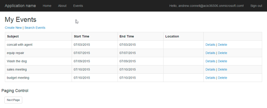
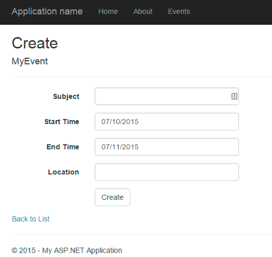
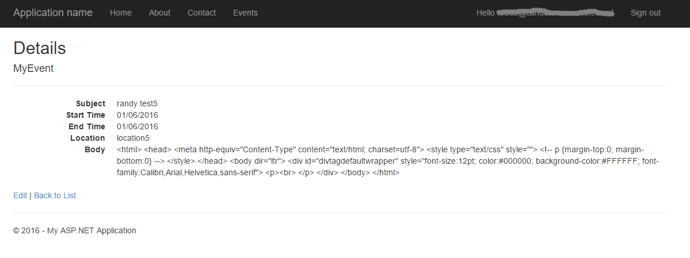

# Microsoft Graph for Calendar
In this lab, you will use Microsoft Graph to work with Office 365 calendars as part of an ASP.NET MVC5 application.

## Prerequisites
1. You must have an Office 365 tenant and Microsoft Azure subscription to complete this lab. If you do not have one, the lab for **O3651-7 Setting up your Developer environment in Office 365** shows you how to obtain a trial. 
1. You must have Visual Studio 2015.

## Lab Setup: Setting up your Exchange account with Sample Calendar Events for Testing
1. Using the browser, navigate to https://outlook.office365.com and log into your Office 365 mailbox.
1. Click the *waffle* icon in the top-left corner to open the App Launcher and click the **Calendar** tile.
1. Add some calendar items to your calendar if you don't have any in your mailbox.
1. Once you have verified that you have a set of calendar events for testing, you can move on to the next exercise.

## Exercise 1: Create an ASP.NET MVC5 Application
In this exercise, you will create the ASP.NET MVC5 application and register it with Azure active Directory.
1. Launch **Visual Studio 2015** as administrator.
1. In Visual Studio, click **File/New/Project**.
1. In the **New Project** dialog
  1. Select **Templates/Visual C#/Web**.
  1. Select **ASP.NET Web Application**.

    

  1. Give the project the name **Office365Calendar** and Click **OK**.
1. In the **New ASP.NET Project** dialog
  1. Click **MVC**.
  2. Click **Change Authentication**.
  3. Select **Work And School Accounts**.
  4. Select **Cloud - Single Organization**
  5. Input **Domain** of your O365 tenancy
  6. Check **Read directory data** under Directory Access Permissions
  4. Click **OK**.
  5. Uncheck **Host in the cloud**
  5. Click **OK**.

    

    

1. Ensure the web project uses SSL by default:
  1. In the **Solution Explorer** tool window, select the project and look at the **Properties** tool window. 
  1. Ensure **SSL Enabled** is set to **TRUE**.
  1. Copy the **SSL URL** property to the clipboard for use in the next step.

    
    > It is important to do this now because in the next step when you create the application in Azure AD, you want the reply URL to use HTTPS. If you did not do this now, you would have to manually make the changes the Visual Studio wizard is going to do for you in creating the app.
    
1. Configure the project always goes to the homepage of the web application when debugging:
  1. In the **Solution Explorer** tool window, right-click the project and select **Properties**.
  1. Select the **Web** tab in the left margin.
  1. Find the section **Start Action**.
  1. Click the radio button **Start URL** and enter the SSL URL of the web project that you copied from the previous step.
  
    
  
1. At this point you can test the authentication flow for your application.
  1. In Visual Studio, press **F5**. The browser will automatically launch taking you to the HTTPS start page for the web application.
  
  > **Note:** If you receive an error that indicates ASP.NET could not connect to the SQL database, please see the [SQL Server Database Connection Error Resolution document](../../SQL-DB-Connection-Error-Resolution.md) to quickly resolve the issue. 

  1. To sign in, click the **Sign In** link in the upper-right corner.
  1. Login using your **Organizational Account**.
  1. Upon a successful login, since this will be the first time you have logged into this app, Azure AD will present you with the common consent dialog that looks similar to the following image:

    

  1. Click **Accept** to approve the app's permission request on your data in Office 365.
  1. You will then be redirected back to your web application. However notice in the upper right corner, it now shows your email address & the **Sign Out** link.

Congratulations... at this point your app is configured with Azure AD and leverages OpenID Connect and OWIN to facilitate the authentication process!

## Exercise 2: Configure Web Application to use Azure AD and OWIN
In this exercise you will take the ASP.NET MVC web application you created in the previous exercise and configure it to use Azure AD & OpenID Connect for user & app authentication. You will do this by utilizing the OWIN framework. Once authenticated, you can use the access token returned by Azure AD to access the Microsoft Graph.


1. Grant App Necessary Permissions.

  1. Browse to the [Azure Management Portal](https://manage.windowsazure.com) and sign in with your **Organizational Account**.
  1. In the left-hand navigation, click **Active Directory**.
  1. Select the directory you share with your Office 365 subscription.
  1. Select the application you created for this lab.
  1. Open **Configure** tab
  1. Scroll down to the **permissions to other applications** section. 
  1. Click the **Add Application** button.
  1. In the **Permissions to other applications** dialog, click the **PLUS** icon next to the **Microsoft Graph** option.
  1. Click the **CHECK** icon in the lower right corner.
  1. For the new **Microsoft Graph** application permission entry, select the **Delegated Permissions** dropdown on the same line and then select the following permissions:
    * **Have full access to user calendars**    
  1. Click the **Save** button at the bottom of the page.

     
1. Add a helper class that will be used to harvest settings out of the `web.config` and create the necessary strings that will be used for authentication:

  1. Right-click the project and select **Add/New Folder**. Give the folder the name **Utils**. 
  
  1. Locate the [\\\O3653\O3653-13 Deep Dive into Office 365 APIs for Calendar\Lab\Lab Files](/O3653/O3653-13 Deep Dive into Office 365 APIs for Calendar/Lab/Lab Files) folder provided with this lab and find the [`SettingsHelper.cs`](/O3653/O3653-13 Deep Dive into Office 365 APIs for Calendar/Lab/Lab Files/SettingsHelper.cs) file . Drag the [`SettingsHelper.cs`](/O3653/O3653-13 Deep Dive into Office 365 APIs for Calendar/Lab/Lab Files/SettingsHelper.cs) file to the **Utils** folder in the project.
      
1. Update **_Layout** file to add **Events** link:
    1. Open the **_Layout.cshtml** file found in the **Views/Shared** folder.
      1. Locate the part of the file that includes a few links at the top of the page... it should look similar to the following code:
      
        ````asp
        <div class="navbar-collapse collapse">
          <ul class="nav navbar-nav">
            <li>@Html.ActionLink("Home", "Index", "Home")</li>
            <li>@Html.ActionLink("About", "About", "Home")</li>
            <li>@Html.ActionLink("Contact", "Contact", "Home")</li>
          </ul>
          @Html.Partial("_LoginPartial")
        </div>
        ````

      1. Update that navigation to have a new link (the **Events** link added below) as well as a reference to the login control you just created:

        ````asp
        <div class="navbar-collapse collapse">
          <ul class="nav navbar-nav">
            <li>@Html.ActionLink("Home", "Index", "Home")</li>
            <li>@Html.ActionLink("About", "About", "Home")</li>
            <li>@Html.ActionLink("Contact", "Contact", "Home")</li>
            <li>@Html.ActionLink("Events", "Index", "Calendar")</li>
          </ul>
          @Html.Partial("_LoginPartial")
        </div>
        ````

        > The **Events** link will not work yet... you will add that in the next exercise.

## Exercise 3: Code the Calendar API
In this exercise, you will create a repository object for wrapping CRUD operations associated with the Calendar API.

1. In the **Solution Explorer**, locate the **Models** folder in the **Office365Calendar** project.
1. Right-click the **Models** folder and select **Add/Class**.
1. In the **Add New Item** dialog, name the new class **MyEvent** and click **Add** to create the new source file for the class.  
    1. At the top of the source file **MyEvent.cs**, add the following using statement just after the using statements that are already there.

	````c#
	using System.ComponentModel;
	using System.ComponentModel.DataAnnotations;
	````

    1. Implement the new class **MyEvent** using the following class definition.
		
    ````c#
    public class MyEvent {
      public string Id { get; set; }
         
      [DisplayName("Subject")]
      public string Subject { get; set; }
      
      [DisplayName("Start Time")]
      [DisplayFormat(DataFormatString = "{0:MM/dd/yyyy}", ApplyFormatInEditMode = true)]
      public DateTimeOffset? Start { get; set; }
      
      [DisplayName("End Time")]
      [DisplayFormat(DataFormatString = "{0:MM/dd/yyyy}", ApplyFormatInEditMode = true)]
      public DateTimeOffset? End { get; set; }
      
      [DisplayName("Location")]
      public string Location { get; set; }
      
      [DisplayName("Body")]
      public string Body { get; set; }      
    }
    ````

1. Right-click the **Models** folder and select **Add/Class**. In the **Add New Item** dialog, name the new class **Event** and click **Add** to create the new source file for the class. Implement the new class **Event** using the following class definition.

    ````c#
    public class Event
    {
        public string Id { get; set; }
        public string Subject { get; set; }
        public Start Start { get; set; }
        public End End { get; set; }
        public Location Location { get; set; }
        public Body Body { get; set; }
    }

    public class Start
    {
        public string dateTime { get; set; }
        public string timeZone { get { return "UTC"; } }
    }

    public class End
    {
        public string dateTime { get; set; }
        public string timeZone { get { return "UTC"; } }
    }

    public class Location
    {
        public string address { get; set; }
        public string displayName { get; set; }
    }

    public class Body
    {
        public string contentType { get { return "text"; } }
        public string content { get; set; }
    }
    ````
1. Assembly references are not added to the shared projects in ASP.NET MVC, rather they are added to the actual client projects. Therefore you need to add the following NuGet packages manually.
	1. Open the Package Manager Console: **View/Other Windows/Package Manager Console**.
	1. Enter each line below in the console, one at a time, pressing **ENTER** after each one. NuGet will install the package and all dependent packages:
	
		````powershell
		PM> Install-Package -Id Microsoft.IdentityModel.Clients.ActiveDirectory
		PM> Install-Package -Id Newtonsoft.Json		
		````

1. Right-click the **Models** folder and select **Add/Class**. In the **Add New Item** dialog, name the new class **MyEventsRepository** and click **Add** to create the new source file for the class.    
    1. **Add** the following using statements to the top of the **MyEventsRepository** class.
		
	````c#
	using System.Security.Claims;
	using System.Threading.Tasks;
	using Office365Calendar.Utils;
	using System.Net.Http;
    using System.Net.Http.Headers;
	using Microsoft.IdentityModel.Clients.ActiveDirectory;
    using Newtonsoft.Json.Linq;
	using Newtonsoft.Json;
	using System.Text;
	````

    1. **Add** a function named **GetGraphAccessTokenAsync** to the **MyEventsRepository** class with the following implementation to get access token for Microsoft Graph Authentication.
		
    ````c#
    public async Task<string> GetGraphAccessTokenAsync()
    {
        var signInUserId = ClaimsPrincipal.Current.FindFirst(ClaimTypes.NameIdentifier).Value;
        var userObjectId = ClaimsPrincipal.Current.FindFirst(SettingsHelper.ClaimTypeObjectIdentifier).Value;

        var clientCredential = new ClientCredential(SettingsHelper.ClientId, SettingsHelper.ClientSecret);
        var userIdentifier = new UserIdentifier(userObjectId, UserIdentifierType.UniqueId);

        // create auth context
        AuthenticationContext authContext = new AuthenticationContext(SettingsHelper.AzureAdAuthority, new ADALTokenCache(signInUserId));
        var result = await authContext.AcquireTokenSilentAsync(SettingsHelper.AzureAdGraphResourceURL, clientCredential, userIdentifier);

        return result.AccessToken;
    }
    ````

    1. **Add** a public property named **MorePagesAvailable** to the **MyEventsRepository** class to indicate if there are more pages.
    
	````c#
	public bool MorePagesAvailable { get; private set; }
	````

    1. **Add** a function named **GetEvents** to the **MyEventsRepository** class to retrieve and return a list of **MyEvent** objects.
		
    ````c#
    public async Task<List<MyEvent>> GetEvents(int pageIndex, int pageSize)
    {
        var eventsResults = new List<MyEvent>();
        var accessToken = await GetGraphAccessTokenAsync();
        var restURL = string.Format("{0}me/events?$top={1}&$skip={2}", SettingsHelper.GraphResourceUrl, pageSize, pageIndex * pageSize);
        try
        {
            using (HttpClient client = new HttpClient())
            {
                var accept = "application/json";

                client.DefaultRequestHeaders.Add("Accept", accept);
                client.DefaultRequestHeaders.Authorization = new AuthenticationHeaderValue("Bearer", accessToken);

                using (var response = await client.GetAsync(restURL))
                {
                    if (response.IsSuccessStatusCode)
                    {
                        var jsonresult = JObject.Parse(await response.Content.ReadAsStringAsync());

                        foreach (var item in jsonresult["value"])
                        {
                            eventsResults.Add(new MyEvent
                            {
                                Start = !string.IsNullOrEmpty(item["start"]["dateTime"].ToString()) ? DateTime.Parse(item["start"]["dateTime"].ToString()) : new DateTime(),
                                End = !string.IsNullOrEmpty(item["end"]["dateTime"].ToString()) ? DateTime.Parse(item["end"]["dateTime"].ToString()) : new DateTime(),
                                Id = !string.IsNullOrEmpty(item["id"].ToString()) ? item["id"].ToString() : string.Empty,
                                Subject = !string.IsNullOrEmpty(item["subject"].ToString()) ? item["subject"].ToString() : string.Empty,
                                Body = !string.IsNullOrEmpty(item["body"].ToString()) ? item["body"]["content"].ToString() : string.Empty,
                                Location = !string.IsNullOrEmpty(item["location"].ToString()) ? item["location"]["displayName"].ToString() : string.Empty,
                            });
                        }
                    }
                }
            }
        }
        catch (Exception el)
        {
            el.ToString();
        }

        // indicate if more results available
        MorePagesAvailable = eventsResults.Count < pageSize ? false : true;

        return eventsResults.OrderBy(e => e.Start).ToList();
    }
    ````

    1. Add a **GetEvent** function to the **MyEventsRepository** class to get a specific event:

    ````c#
    public async Task<MyEvent> GetEvent(string id)
    {
        var accessToken = await GetGraphAccessTokenAsync();
        var restURL = string.Format("{0}me/events/{1}", SettingsHelper.GraphResourceUrl, id);
        var ev = new MyEvent();
        try
        {
            using (HttpClient client = new HttpClient())
            {
                var accept = "application/json";

                client.DefaultRequestHeaders.Add("Accept", accept);
                client.DefaultRequestHeaders.Authorization = new AuthenticationHeaderValue("Bearer", accessToken);

                using (var response = await client.GetAsync(restURL))
                {
                    if (response.IsSuccessStatusCode)
                    {
                        var item = JObject.Parse(await response.Content.ReadAsStringAsync());

                        if (item != null)
                        {
                            ev.Start = !string.IsNullOrEmpty(item["start"]["dateTime"].ToString()) ? DateTime.Parse(item["start"]["dateTime"].ToString()) : new DateTime();
                            ev.End = !string.IsNullOrEmpty(item["end"]["dateTime"].ToString()) ? DateTime.Parse(item["end"]["dateTime"].ToString()) : new DateTime();
                            ev.Id = !string.IsNullOrEmpty(item["id"].ToString()) ? item["id"].ToString() : string.Empty;
                            ev.Subject = !string.IsNullOrEmpty(item["subject"].ToString()) ? item["subject"].ToString() : string.Empty;
                            ev.Body = !string.IsNullOrEmpty(item["body"].ToString()) ? item["body"]["content"].ToString() : string.Empty;
                            ev.Location = !string.IsNullOrEmpty(item["location"].ToString()) ? item["location"]["displayName"].ToString() : string.Empty;
                        }
                    }
                }
            }
        }
        catch (Exception el)
        {
            el.ToString();
        }

        return ev;
    }
    ````

    1. Add a **DeleteEvent** function to the **MyEventsRepository** class to delete an event.

    ````c#
    public async Task DeleteEvent(string id)
    {
        var accessToken = await GetGraphAccessTokenAsync();
        var restURL = string.Format("{0}me/events('{1}')", SettingsHelper.GraphResourceUrl, id);
        try
        {
            using (HttpClient client = new HttpClient())
            {
                var accept = "application/json";

                client.DefaultRequestHeaders.Add("Accept", accept);
                client.DefaultRequestHeaders.Authorization = new AuthenticationHeaderValue("Bearer", accessToken);

                using (var response = await client.DeleteAsync(restURL))
                {
                    if (response.IsSuccessStatusCode)
                        return;
                    else
                        throw new Exception("delete event error: " + response.StatusCode);
                }
            }
        }
        catch (Exception el)
        {
            el.ToString();
        }
    }
    ````

    1. Add a **AddEvent** function  to the **MyEventsRepository** class to create a new event.

    ````c#
    public async Task AddEvent(MyEvent myEvent)
    {
        var accessToken = await GetGraphAccessTokenAsync();
        var restURL = string.Format("{0}me/events", SettingsHelper.GraphResourceUrl);
        try
        {
            using (HttpClient client = new HttpClient())
            {
                var accept = "application/json";

                client.DefaultRequestHeaders.Add("Accept", accept);
                client.DefaultRequestHeaders.Authorization = new AuthenticationHeaderValue("Bearer", accessToken);

                var ev = new Event
                {
                    Subject = myEvent.Subject,
                    Start = new Start { dateTime = myEvent.Start.ToString() },
                    End = new End { dateTime = myEvent.End.ToString() },
                    Location = new Location { displayName = myEvent.Location },
					Body = new Body { content = myEvent.Body }
                };
                string postBody = JsonConvert.SerializeObject(ev);

                using (var response = await client.PostAsync(restURL, new StringContent(postBody, Encoding.UTF8, "application/json")))
                {
                    if (response.IsSuccessStatusCode)
                        return;
                    else
                        throw new Exception("add event error: " + response.StatusCode);
                }

            }
        }
        catch (Exception el)
        {
            el.ToString();
        }
    }
    ````

    1. Finally, add a **Search** function to the **MyEventsRepository** class to add search functionality:

    ````c#
    public async Task<List<MyEvent>> Search(string searchTerm)
    {
        var eventsResults = new List<MyEvent>();
        var accessToken = await GetGraphAccessTokenAsync();
        var restURL = string.Format("{0}me/events?$filter=startswith(subject,+'{1}')", SettingsHelper.GraphResourceUrl, searchTerm);
        try
        {
            using (HttpClient client = new HttpClient())
            {
                var accept = "application/json";

                client.DefaultRequestHeaders.Add("Accept", accept);
                client.DefaultRequestHeaders.Authorization = new AuthenticationHeaderValue("Bearer", accessToken);

                using (var response = await client.GetAsync(restURL))
                {
                    if (response.IsSuccessStatusCode)
                    {
                        var jsonresult = JObject.Parse(await response.Content.ReadAsStringAsync());

                        foreach (var item in jsonresult["value"])
                        {
                            eventsResults.Add(new MyEvent
                            {
                                Start = !string.IsNullOrEmpty(item["start"]["dateTime"].ToString()) ? DateTime.Parse(item["start"]["dateTime"].ToString()) : new DateTime(),
                                End = !string.IsNullOrEmpty(item["end"]["dateTime"].ToString()) ? DateTime.Parse(item["end"]["dateTime"].ToString()) : new DateTime(),
                                Id = !string.IsNullOrEmpty(item["id"].ToString()) ? item["id"].ToString() : string.Empty,
                                Subject = !string.IsNullOrEmpty(item["subject"].ToString()) ? item["subject"].ToString() : string.Empty,
                                Body = !string.IsNullOrEmpty(item["body"].ToString()) ? item["body"]["content"].ToString() : string.Empty,
                                Location = !string.IsNullOrEmpty(item["location"].ToString()) ? item["location"]["displayName"].ToString() : string.Empty,
                            });
                        }
                    }
                }
            }
        }
        catch (Exception el)
        {
            el.ToString();
        }

        return eventsResults.OrderBy(e => e.Start).ToList();
    }
    ````

At this point you have created the repository that will be used to talk to the Microsoft Graph.

## Exercise 4: Code the MVC Application
In this exercise, you will code the **CalendarController** of the MVC application to display events as well as adding behavior for adding and deleting events.

1. Right-click the **Controllers** folder and select **Add/Controller**.
  1. In the **Add Scaffold** dialog, select **MVC 5 Controller - Empty**.
  1. Click **Add**.
  1. When prompted for a name, enter **CalendarController**.
  1. Click **Add**.
1. Within the **CalendarController** file, add the following `using` statements to the top of the file:

    ````c#
    using System;
    using System.Collections.Generic;
    using System.Linq;
    using System.Web;
    using System.Web.Mvc;
    using Office365Calendar.Models; 
    using System.Threading.Tasks;
    ````

1. Within the `CalendarController` class, add the following field to get a reference to the repository you previously created:

    ````c#
    MyEventsRepository _repo = new MyEventsRepository();
    ````

1. Within the `CalendarController` class, add a route handler and view to list all the events:
  1. **Replace** the **Index** method with the following code to read events.
      
    ````c#
    [Authorize]
    public async Task<ActionResult> Index(int? pageNumber)
    {
        // setup paging
        const int pageSize = 5;
        if (pageNumber == null)
            pageNumber = 1;

        // get list of entities
        List<MyEvent> events = null;
        events = await _repo.GetEvents((int)pageNumber - 1, pageSize);

        ViewBag.pageNumber = pageNumber;
        ViewBag.morePagesAvailable = _repo.MorePagesAvailable;

        return View(events);

    }
    ````

    > Notice how the route handler takes in an optional parameter for the page number. This will be used to implement paging for the controller. Right now the page size is small, set to 5, for demonstration purposes. Also notice how the repository has a public property `ModePagesAvailable` that indicates if there are more pages of results as reported by the Microsoft Graph.

  1. Finally, update the view to display the results.
    1. Within the `CalendarController` class, right click the `View(events)` at the end of the `Index()` action method and select **Add View**.
    1. Within the **Add View** dialog, set the following values:
      1. View Name: **Index**.
      1. Template: **Empty (without model)**.
        
        > Leave all other fields blank & unchecked.
      
      1. Click **Add**.
    1. Within the **Views/Calendar/Index.cshtml** file, delete all the code in the file and replace it with the following code:
      
        ````html
        @model IEnumerable<Office365Calendar.Models.MyEvent>
		@{ ViewBag.Title = "My Events"; }
		<h2>My Events</h2>
		<p>
		    @Html.ActionLink("Create New", "Create") |
		    @Html.ActionLink("Search Events", "Search")
		</p>
		<table id="eventsTable" class="table table-striped table-bordered">
		    <tr>
		        <th>@Html.DisplayNameFor(model => model.Subject)</th>
		        <th>@Html.DisplayNameFor(model => model.Start)</th>
		        <th>@Html.DisplayNameFor(model => model.End)</th>
		        <th>@Html.DisplayNameFor(model => model.Location)</th>
		        <th></th>
		    </tr>
		    @foreach (var item in Model)
		    {
		        <tr>
		            <td>@Html.DisplayFor(modelItem => item.Subject)</td>
		            <td>@Html.DisplayFor(modelItem => item.Start)</td>
		            <td>@Html.DisplayFor(modelItem => item.End)</td>
		            <td>@Html.DisplayFor(modelItem => item.Location)</td>
		            <td>
		                @Html.ActionLink("Details", "Details", new { id = item.Id }) |
		                @Html.ActionLink("Delete", "Delete", new { id = item.Id })
		            </td>
		        </tr>
		    }
		</table>
		<div class="row">
		    <h4>Paging Control</h4>
		    <div class="btn btn-group-sm">
		        @{
		            var pageLinkAttributes = new Dictionary<string, object> { { "class", "btn btn-default" } };
		
		            int pageNumber = ViewBag.pageNumber;
		
		            // do prev link if not on first page
		            if (pageNumber > 1)
		            {
		                var routeValues = new RouteValueDictionary { { "pageNumber", pageNumber - 1 } };
		                @Html.ActionLink("Previous Page", "Index", "Calendar", routeValues, pageLinkAttributes);
		            }		
		
		            // do next link if current page = max page size
		            if (ViewBag.morePagesAvailable)
		            {
		                var routeValues = new RouteValueDictionary { { "pageNumber", pageNumber + 1 } };
		                @Html.ActionLink("Next Page", "Index", "Calendar", routeValues, pageLinkAttributes);
		            }
		        }
		    </div>
		</div>
        ````  
1. Test the new view:
  1. In **Visual Studio**, hit **F5** to begin debugging.

   > **Note:** If you receive an error that indicates ASP.NET could not connect to the SQL database, please see the [SQL Server Database Connection Error Resolution document](../../SQL-DB-Connection-Error-Resolution.md) to quickly resolve the issue. 

  1. When prompted, log in with your **Organizational Account**.
  1. Once the application is loaded click the **Events link** in the top menu bar.
  1. Verify that your application displays calendar events from your Office 365 account.  

    

  1. Close the browser window, terminate the debugging session and return to Visual Studio.

1. Add a route handler to delete an event:
  1. In the **CalendarController.cs** file, add an action method named **Delete** using the following code to delete an event.

    ````c#
    [Authorize]
    public async Task<ActionResult> Delete(string id)
    {
        if (id != null)
        {
            await _repo.DeleteEvent(id);
        }

        return Redirect("/Calendar");

    }
    ````

1. Add a route handler and views to handle creating events:
  1. In the **CalendarController.cs** file, add an action method named **Create** using the following code to create a new event. Notice how you are adding two items, when the create form is requested (the `HttpGet` option) and one for when the form is submitted (the `HttpPost` option).

    ````c#
    [HttpGet]
    [Authorize]
    public async Task<ActionResult> Create()
    {
        var myEvent = new MyEvent
        {
            Start = DateTimeOffset.Now,
            End = DateTimeOffset.Now.AddDays(1)
        };

        return View(myEvent);
    }

    [HttpPost]
    [Authorize]
    public async Task<ActionResult> Create(MyEvent myEvent)
    {

        await _repo.AddEvent(myEvent);
        return Redirect("/Calendar");
    }
    ````

  1. Within the `CalendarController` class, right click the `View(myEvent)` at the end of the `Create()` action method and select **Add View**.
  1. In the **Add View** dialog, set the following options on the dialog and click **Add**.
    + View name: **Create**
    + Template: **Create**
    + Model class: **MyEvent (Office365Calendar.Models)**
    + Create as partial view: **unchecked**
    + Reference script libraries: **unchecked**
    + Use a layout page: **checked**
    + Click **Add**
  1. Open the **Create.cshtml** file. Delete all the code in the file and replace it with the following code:

    ````html
    @model Office365Calendar.Models.MyEvent
	@{
	    ViewBag.Title = "Create";
	}	
	<h2>Create</h2>	
	@using (Html.BeginForm()) 
	{    
	    <div class="form-horizontal">
	        <h4>MyEvent</h4>
	        <hr />
	        @Html.ValidationSummary(true, "", new { @class = "text-danger" })
	        <div class="form-group">
	            @Html.LabelFor(model => model.Subject, htmlAttributes: new { @class = "control-label col-md-2" })
	            <div class="col-md-10">
	                @Html.EditorFor(model => model.Subject, new { htmlAttributes = new { @class = "form-control" } })
	                @Html.ValidationMessageFor(model => model.Subject, "", new { @class = "text-danger" })
	            </div>
	        </div>
	
	        <div class="form-group">
	            @Html.LabelFor(model => model.Start, htmlAttributes: new { @class = "control-label col-md-2" })
	            <div class="col-md-10">
	                @Html.EditorFor(model => model.Start, new { htmlAttributes = new { @class = "form-control" } })
	                @Html.ValidationMessageFor(model => model.Start, "", new { @class = "text-danger" })
	            </div>
	        </div>
	
	        <div class="form-group">
	            @Html.LabelFor(model => model.End, htmlAttributes: new { @class = "control-label col-md-2" })
	            <div class="col-md-10">
	                @Html.EditorFor(model => model.End, new { htmlAttributes = new { @class = "form-control" } })
	                @Html.ValidationMessageFor(model => model.End, "", new { @class = "text-danger" })
	            </div>
	        </div>
	
	        <div class="form-group">
	            @Html.LabelFor(model => model.Location, htmlAttributes: new { @class = "control-label col-md-2" })
	            <div class="col-md-10">
	                @Html.EditorFor(model => model.Location, new { htmlAttributes = new { @class = "form-control" } })
	                @Html.ValidationMessageFor(model => model.Location, "", new { @class = "text-danger" })
	            </div>
	        </div>
	
	        <div class="form-group">
	            @Html.LabelFor(model => model.Body, htmlAttributes: new { @class = "control-label col-md-2" })
	            <div class="col-md-10">
	                @Html.EditorFor(model => model.Body, new { htmlAttributes = new { @class = "form-control" } })
	                @Html.ValidationMessageFor(model => model.Body, "", new { @class = "text-danger" })
	            </div>
	        </div>
	
	        <div class="form-group">
	            <div class="col-md-offset-2 col-md-10">
	                <input type="submit" value="Create" class="btn btn-default" />
	            </div>
	        </div>
	    </div>
	}
	
	<div>
	    @Html.ActionLink("Back to List", "Index")
	</div>
    ````

1. Test the new view:
  1. In **Visual Studio**, hit **F5** to begin debugging.

   > **Note:** If you receive an error that indicates ASP.NET could not connect to the SQL database, please see the [SQL Server Database Connection Error Resolution document](../../SQL-DB-Connection-Error-Resolution.md) to quickly resolve the issue. 

  1. When Prompted, log in with your **Organizational Account**.
  1. Once the application is loaded click the **Events link** in the top menu bar.
  1. Click the **Create New** link. You should see the form below. Fill the form out to add a new item:

    

  1. Close the browser window, terminate the debugging session and return to Visual Studio.

1. Add a route handler and view to handle showing the details of a selected event:
  1. In the **CalendarController.cs** file, add an action method named **Details** using the following code to view an event.

    ````c#
    [Authorize]
    public async Task<ActionResult> Details(string id)
    {

        MyEvent myEvent = null;
        myEvent = await _repo.GetEvent(id);
        return View(myEvent);
    }
    ````
  1. Within the `CalendarController` class, right click the `View(myEvent)` at the end of the `Details()` action method and select **Add View**.
  1. In the **Add View** dialog, set the following options on the dialog and click **Add**.
    + View name: **Details**
    + Template: **Details**
    + Model class: **MyEvent (Office365Calendar.Models)**
    + Create as partial view: **unchecked**
    + Reference script libraries: **unchecked**
    + Use a layout page: **checked**
    + Click **Add**

1. Test the new view:
  1. In **Visual Studio**, hit **F5** to begin debugging.

   > **Note:** If you receive an error that indicates ASP.NET could not connect to the SQL database, please see the [SQL Server Database Connection Error Resolution document](../../SQL-DB-Connection-Error-Resolution.md) to quickly resolve the issue. 

  1. When Prompted, log in with your **Organizational Account**.
  1. Once the application is loaded click the **Events link** in the top menu bar.
  1. Click the **Details** link for one of the items. 

    

  1. Close the browser window, terminate the debugging session and return to Visual Studio.

1. Add a route handler and view to handle search for events:
  1. In the **CalendarController.cs** file, add two action methods named **Search** using the following code to search events.

    ````c#
    [HttpGet]
    [Authorize]
    public async Task<ActionResult> Search()
    {
        return View();
    }

    [HttpPost]
    [Authorize]
    public async Task<ActionResult> Search(string searchTerm)
    {
        var events = await _repo.Search(searchTerm);
        return View(events);
    }
    ````

  1. Within the `CalendarController` class, right click the `View()` at the end of the `Search()` action method and select **Add View**.
  1. In the **Add View** dialog, set the following options on the dialog and click **Add**.
    + View name: **Search**
    + Template: **Empty**
    + Create as partial view: **unchecked**
    + Reference script libraries: **unchecked**
    + Use a layout page: **checked**
    + Click **Add**
  1. Open the generated **Search.cshtml** view and replace the markup with the following code:

    ````html
    @model IEnumerable<Office365Calendar.Models.MyEvent>
	@{
	    ViewBag.Title = "Search";
	}
	<h2>Search</h2>
	@using (Html.BeginForm("Search", "Calendar", FormMethod.Post))
	{
	    <p>
	        <div class="form-horizontal">
	            <div class="form-group">
	                <div class="col-md-10">
	                    <input type="text" id="searchTerm" name="searchTerm" class="form-control" /><br />
	                    <button type="submit">search for events</button>
	                </div>
	            </div>
	        </div>
	    </p>
	}
	<table class="table">
	    <tr>
	        <th>@Html.DisplayNameFor(model => model.Subject)</th>
	        <th>@Html.DisplayNameFor(model => model.Start)</th>
	        <th>@Html.DisplayNameFor(model => model.End)</th>
	        <th></th>
	    </tr>
	    @if (Model != null)
	    {
	        foreach (var item in Model)
	        {
	            <tr>
	                <td>@Html.DisplayFor(modelItem => item.Subject)</td>
	                <td>@Html.DisplayFor(modelItem => item.Start)</td>
	                <td>@Html.DisplayFor(modelItem => item.End)</td>
	                <td>
	                    @Html.ActionLink("Details", "Details", new { id = item.Id }) |
	                    @Html.ActionLink("Delete", "Delete", new { id = item.Id })
	                </td>
	            </tr>
	        }
	    }
	</table>
	<p>
	    @Html.ActionLink("Back to List", "Index")
	</p>
    ````

1. Test the new view:
  1. In **Visual Studio**, hit **F5** to begin debugging.

   > **Note:** If you receive an error that indicates ASP.NET could not connect to the SQL database, please see the [SQL Server Database Connection Error Resolution document](../../SQL-DB-Connection-Error-Resolution.md) to quickly resolve the issue. 

  1. When Prompted, log in with your **Organizational Account**.
  1. Once the application is loaded click the **Events link** in the top menu bar.
  1. Click the **Search Events** link and enter a search term on the next page. You should see a filtered set of results:

    

  1. Close the browser window, terminate the debugging session and return to Visual Studio.

Congratulations! You have completed working with the the Calendar API.
