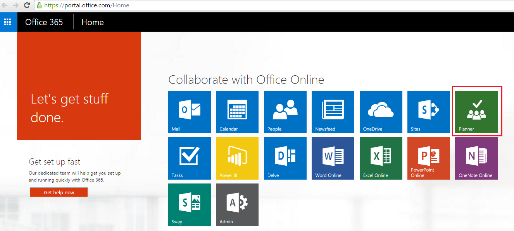
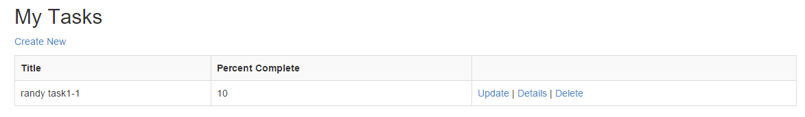

# Microsoft Graph for Planner and Task
In this lab, you will use Microsoft Graph to work with Office 365 Planner/Tasks as part of an ASP.NET MVC5 application.

## Prerequisites
1. You must have an Office 365 tenant and Microsoft Azure subscription to complete this lab. If you do not have one, the lab for **O3651-7 Setting up your Developer environment in Office 365** shows you how to obtain a trial. 
1. You must have Visual Studio 2015.

## Exercise 1: Create an ASP.NET MVC5 Application
In this exercise, you will create the ASP.NET MVC5 application and register it with Azure active Directory.
1. Launch **Visual Studio 2015** as administrator.
1. In Visual Studio, click **File/New/Project**.
1. In the **New Project** dialog
  1. Select **Templates/Visual C#/Web**.
  1. Select **ASP.NET Web Application**.
    
  > **Note:** Make sure you enter the exact same name for the Visual Studio Project that is specified in these lab instructions. The Visual Studio Project name becomes part of the namespace in the code. The code inside these instructions depends on the namespace matching the Visual Studio Project name specified in these instructions. If you use a different project name the code will not compile unless you adjust all the namespaces to match the Visual Studio Project name you enter when you create the project.  
  1. Click **OK**.
1. In the **New ASP.NET Project** dialog
  1. Click **MVC**.
  2. Click **Change Authentication**.
  3. Select **Work And School Accounts**.
  4. Select **Cloud - Single Organization**
  5. Input **Domain** of your O365 tenancy
  6. Check **Read directory data** under Directory Access Permissions
  4. Click **OK**.
  5. Uncheck **Host in the cloud**
  5. Click **OK**.

    

    
1. At this point you can test the authentication flow for your application.
  1. In Visual Studio, press **F5**. The browser will automatically launch taking you to the HTTPS start page for the web application.
  
  > **Note:** If you receive an error that indicates ASP.NET could not connect to the SQL database, please see the [SQL Server Database Connection Error Resolution document](../../SQL-DB-Connection-Error-Resolution.md) to quickly resolve the issue. 

  1. To sign in, click the **Sign In** link in the upper-right corner.
  1. Login using your **Organizational Account**.
  1. Upon a successful login, since this will be the first time you have logged into this app, Azure AD will present you with the common consent dialog that looks similar to the following image:

    

  1. Click **Accept** to approve the app's permission request on your data in Office 365.
  1. You will then be redirected back to your web application. However notice in the upper right corner, it now shows your email address & the **Sign Out** link.

Congratulations... at this point your app is configured with Azure AD and leverages OpenID Connect and OWIN to facilitate the authentication process!

## Exercise 2: Configure Web Application to use Azure AD and OWIN
In this exercise you will take the ASP.NET MVC web application you created in the previous exercise and configure it to use Azure AD & OpenID Connect for user & app authentication to the Microsoft Graph. You will do this by utilizing the OWIN framework. Once authenticated, you can use the access token returned by Azure AD to access the Microsoft Graph.


1. Grant App Necessary Permissions.

  1. Open **Office365PlannerTask** solution that you created in Exercise 1.
  1. Open **Web.config** file.
  
     

  1. Find **ida:ClientId**, then copy value to use later.
     
     
  
  1. Browse to the [Azure Management Portal](https://manage.windowsazure.com) and sign in with your **Organizational Account**.
  1. In the left-hand navigation, click **Active Directory**.
  1. Select the directory you share with your Office 365 subscription.
  1. Go to **APPLICATIONS** tab.
     
     

  1. Type **ClientId** value that you copied above and search.
  
     

  1. Select the application.
  1. Open **Configure** tab
  1. Scroll down to the **permissions to other applications** section. 
  1. Click the **Add Application** button.
  1. In the **Permissions to other applications** dialog, click the **PLUS** icon next to the **Microsoft Graph** option.
  1. Click the **CHECK** icon in the lower right corner.
  1. For the new **Microsoft Graph** application permission entry, select the **Delegated Permissions** dropdown on the same line and then select the following permissions:
    * **Read and write all groups**    
  1. Click the **Save** button at the bottom of the page.

     
1. Add a helper class that will be used to harvest settings out of the `web.config` and create the necessary strings that will be used for authentication:

  1. Right-click the project and select **Add/New Folder**. Give the folder the name **Utils**. 
  2. Locate the [\\\O3653\O3653-15 Microsoft Graph for Planner and Tasks\Lab\Lab Files](Lab Files) folder provided with this lab and find the [`SettingsHelper.cs`](Lab Files/SettingsHelper.cs) file.  Drag the [`SettingsHelper.cs`](Lab Files/SettingsHelper.cs) file to the **Utils** folder in the project.
    
1. Update **_Layout** file to add **Plans** link:
    1. Open the **_Layout.cshtml** file found in the **Views/Shared** folder.
      1. Locate the part of the file that includes a few links at the top of the page... it should look similar to the following code:
      
        ````asp
        <div class="navbar-collapse collapse">
          <ul class="nav navbar-nav">
            <li>@Html.ActionLink("Home", "Index", "Home")</li>
            <li>@Html.ActionLink("About", "About", "Home")</li>
            <li>@Html.ActionLink("Contact", "Contact", "Home")</li>
          </ul>
          @Html.Partial("_LoginPartial")
        </div>
        ````

      1. Update that navigation to have a new link (the **Plans** link added below) as well as a reference to the login control you just created:

        ````asp
        <div class="navbar-collapse collapse">
          <ul class="nav navbar-nav">
            <li>@Html.ActionLink("Home", "Index", "Home")</li>
            <li>@Html.ActionLink("About", "About", "Home")</li>
            <li>@Html.ActionLink("Contact", "Contact", "Home")</li>
            <li>@Html.ActionLink("Plans", "Index", "Plan")</li>
          </ul>
          @Html.Partial("_LoginPartial")
        </div>
        ````

        > The **Plans** link will not work yet... you will add that in the next exercise.

## Exercise 3: Code the Planner/Task API
In this exercise, you will create a repository object for wrapping CRUD operations associated with the Planner/Tasks API.

1. In the **Solution Explorer**, locate the **Models** folder in the **Office365PlannerTask** project.
1. Right-click the **Models** folder and select **Add/Class**.
1. In the **Add New Item** dialog, name the new class **MyPlan** and click **Add** to create the new source file for the class.  
    1. At the top of the source file **MyPlan.cs**, add the following using statement just after the using statements that are already there.

	````c#
	using System.ComponentModel;	
	````

    1. Implement the new class **MyPlan** using the following class definition.
		
    ````c#
    public class MyPlan
    {
        public string id { get; set; }
        [DisplayName("Title")]
        public string title { get; set; }
        [DisplayName("Owner")]
        public string owner { get; set; }
        [DisplayName("Created By")]
        public string createdBy { get; set; }
        public string Etag { get; set; }
    }
    ````

1. Right-click the **Models** folder and select **Add/Class**. In the **Add New Item** dialog, name the new class **MyTask** and click **Add** to create the new source file for the class. 
    1. At the top of the source file **MyTask.cs**, add the following using statement just after the using statements that are already there.
    
    ````c#
	using System.ComponentModel;	
	````

    1. Implement the new class **MyTask** using the following class definition.
    
    ````c#
    public class MyTask
    {
        public string id { get; set; }
        [DisplayName("Title")]
        public string title { get; set; }
        [DisplayName("Percent Complete")]
        public int percentComplete { get; set; }
        public string planId { get; set; }
        public string Etag { get; set; }

    }
    ````
1. Assembly references are not added to the shared projects in ASP.NET MVC, rather they are added to the actual client projects. Therefore you need to add the following NuGet packages manually.
	1. Open the Package Manager Console: **View/Other Windows/Package Manager Console**.
	1. Enter each line below in the console, one at a time, pressing **ENTER** after each one. NuGet will install the package and all dependent packages:
	
		````powershell
		PM> Install-Package -Id Microsoft.IdentityModel.Clients.ActiveDirectory
		PM> Install-Package -Id Newtonsoft.Json		
		````

1. Right-click the **Models** folder and select **Add/Class**. In the **Add New Item** dialog, name the new class **MyPlansRepository** and click **Add** to create the new source file for the class.    
    1. **Add** the following using statements to the top of the **MyPlansRepository** class.
		
	````c#
	using System.Security.Claims;
	using System.Threading.Tasks;
	using Office365PlannerTask.Utils;
	using System.Net.Http;
	using System.Net.Http.Headers;
	using Microsoft.IdentityModel.Clients.ActiveDirectory;
	using Newtonsoft.Json.Linq;
	using Newtonsoft.Json;
	using System.Text;	
	using System.Net;
	````

    1. **Add** a method named **GetGraphAccessTokenAsync** to the **MyPlansRepository** class with the following implementation to get access token for Microsoft Graph Authentication.
		
    ````c#
    public async Task<string> GetGraphAccessTokenAsync()
    {
        var signInUserId = ClaimsPrincipal.Current.FindFirst(ClaimTypes.NameIdentifier).Value;
        var userObjectId = ClaimsPrincipal.Current.FindFirst(SettingsHelper.ClaimTypeObjectIdentifier).Value;

        var clientCredential = new ClientCredential(SettingsHelper.ClientId, SettingsHelper.ClientSecret);
        var userIdentifier = new UserIdentifier(userObjectId, UserIdentifierType.UniqueId);

        // create auth context
        AuthenticationContext authContext = new AuthenticationContext(SettingsHelper.AzureAdAuthority, new ADALTokenCache(signInUserId));
        var result = await authContext.AcquireTokenSilentAsync(SettingsHelper.AzureAdGraphResourceURL, clientCredential, userIdentifier);

        return result.AccessToken;
    }
    ````
    
    1. **Add** a method named **GetPlans** to the **MyPlansRepository** class to retrieve and return a list of **MyPlan** objects.
		
    ````c#
    public async Task<List<MyPlan>> GetPlans()
    {
        var plansResult = new List<MyPlan>();
        var accessToken = await GetGraphAccessTokenAsync();
        var restURL = string.Format("{0}me/plans/", SettingsHelper.GraphResourceUrl);
        try
        {
            using (HttpClient client = new HttpClient())
            {
                var accept = "application/json";

                client.DefaultRequestHeaders.Add("Accept", accept);
                client.DefaultRequestHeaders.Authorization = new AuthenticationHeaderValue("Bearer", accessToken);

                using (var response = await client.GetAsync(restURL))
                {
                    if (response.IsSuccessStatusCode)
                    {
                        var jsonresult = JObject.Parse(await response.Content.ReadAsStringAsync());

                        foreach (var item in jsonresult["value"])
                        {
                            plansResult.Add(new MyPlan
                            {
                                id = item["id"].ToString(),
                                title = item["title"].ToString(),
                                owner = !string.IsNullOrEmpty(item["owner"].ToString()) ? item["owner"].ToString() : "",
                                createdBy = !string.IsNullOrEmpty(item["createdBy"].ToString()) ? item["createdBy"].ToString() : "",
                                Etag = !string.IsNullOrEmpty(item["@odata.etag"].ToString()) ? item["@odata.etag"].ToString() : ""
                            });
                        }
                    }
                }
            }
        }
        catch (Exception el)
        {
            el.ToString();
        }

        return plansResult;
    }
    ````

    1. Add a **GetPlan** method to the **MyPlansRepository** class to get a specific plan:

    ````c#
    public async Task<MyPlan> GetPlan(string id)
    {
        MyPlan plan = new MyPlan();
        var accessToken = await GetGraphAccessTokenAsync();
        var restURL = string.Format("{0}plans/{1}", SettingsHelper.GraphResourceUrl, id);
        try
        {
            using (HttpClient client = new HttpClient())
            {
                var accept = "application/json";

                client.DefaultRequestHeaders.Add("Accept", accept);
                client.DefaultRequestHeaders.Authorization = new AuthenticationHeaderValue("Bearer", accessToken);

                using (var response = await client.GetAsync(restURL))
                {
                    if (response.IsSuccessStatusCode)
                    {
                        var item = JObject.Parse(await response.Content.ReadAsStringAsync());

                        if (item != null)
                        {
                            plan.title = !string.IsNullOrEmpty(item["title"].ToString()) ? item["title"].ToString() : string.Empty;
                            plan.Etag = !string.IsNullOrEmpty(item["@odata.etag"].ToString()) ? item["@odata.etag"].ToString() : "";
                        }
                    }
                }
            }
        }
        catch (Exception el)
        {
            el.ToString();
        }

        return plan;
    }
    ````

    1. Add a **CreatePlan** method to the **MyPlansRepository** class to Create a plan. 

    ````c#
    public async Task CreatePlan(MyPlan myPlan)
    {
        try
        {
            string groupId = await CreateGroup(myPlan.title);
            await CreatePlan(myPlan, groupId);
        }
        catch (Exception el)
        {
            el.ToString();
        }
    }

    private async Task<string> CreateGroup(string groupTitle)
    {
        var accessToken = await GetGraphAccessTokenAsync();
        string groupId = string.Empty;
        dynamic groupJSON = new JObject();
        groupJSON.displayName = groupTitle;
        groupJSON.mailNickname = groupTitle.Replace(" ", "");
        groupJSON.securityEnabled = false;
        groupJSON.mailEnabled = true;
        groupJSON.groupTypes = new JArray("Unified");
        HttpRequestMessage message = new HttpRequestMessage(HttpMethod.Post, string.Format("{0}groups", SettingsHelper.GraphResourceUrl));
        message.Content = new StringContent(groupJSON.ToString(), System.Text.Encoding.UTF8, "application/json");
        message.Headers.Accept.Add(new MediaTypeWithQualityHeaderValue("application/json"));
        message.Headers.Authorization = new AuthenticationHeaderValue("Bearer", accessToken);
        using (HttpClient client = new HttpClient())
        {
            var responseMessage = await client.SendAsync(message);

            if (responseMessage.StatusCode != System.Net.HttpStatusCode.Created)
                throw new Exception(responseMessage.StatusCode.ToString());

            var payload = await responseMessage.Content.ReadAsStringAsync();

            groupId = JObject.Parse(payload)["id"].ToString();

            await AddMemberForGroup(groupId);
        }

        return groupId;
    }

    private async Task AddMemberForGroup(string groupid)
    {
        var accessToken = await GetGraphAccessTokenAsync();
        var userObjectId = ClaimsPrincipal.Current.FindFirst(SettingsHelper.ClaimTypeObjectIdentifier).Value;
        var restURL = string.Format("{0}groups('{1}')/members/$ref", SettingsHelper.GraphResourceUrl, groupid);
        string strAddMememberToGroup = "{\"@odata.id\":\"" + SettingsHelper.GraphResourceUrl + "users('" + userObjectId + "')\"}";

        try
        {
            using (HttpClient client = new HttpClient())
            {
                client.DefaultRequestHeaders.Accept.Add(new MediaTypeWithQualityHeaderValue("application/json"));
                client.DefaultRequestHeaders.Authorization = new AuthenticationHeaderValue("Bearer", accessToken);

                var requestMessage = new HttpRequestMessage(HttpMethod.Post, restURL);
                requestMessage.Content = new StringContent(strAddMememberToGroup, System.Text.Encoding.UTF8, "application/json");
                using (var response = await client.SendAsync(requestMessage))
                {
                    if (response.IsSuccessStatusCode)
                        return;
                    else
                        throw new Exception("add memeber to group error: " + response.StatusCode);
                }
            }
        }
        catch (Exception el)
        {
            el.ToString();
        }
    }

    private async Task CreatePlan(MyPlan myPlan, string groupId)
    {
        var accessToken = await GetGraphAccessTokenAsync();
        var restURL = string.Format("{0}plans/", SettingsHelper.GraphResourceUrl);
        dynamic postPlanJSON = new JObject();
        postPlanJSON.title = myPlan.title;
        postPlanJSON.owner = groupId;

        try
        {
            using (HttpClient client = new HttpClient())
            {
                client.DefaultRequestHeaders.Accept.Add(new MediaTypeWithQualityHeaderValue("application/json"));
                client.DefaultRequestHeaders.Authorization = new AuthenticationHeaderValue("Bearer", accessToken);

                var requestMessage = new HttpRequestMessage(HttpMethod.Post, restURL);
                requestMessage.Content = new StringContent(postPlanJSON.ToString(), System.Text.Encoding.UTF8, "application/json");
                using (var response = await client.SendAsync(requestMessage))
                {
                    if (response.IsSuccessStatusCode)
                        return;
                    else
                        throw new Exception("add plan error: " + response.StatusCode);
                }
            }
        }
        catch (Exception el)
        {
            el.ToString();
        }
    }
    ````

    1. Add a **UpdatePlan** method  to the **MyPlansRepository** class to update an existing plan.

    ````c#
    public async Task UpdatePlan(MyPlan myPlan)
    {
        var accessToken = await GetGraphAccessTokenAsync();
        var restURL = string.Format("{0}plans/{1}", SettingsHelper.GraphResourceUrl, myPlan.id);
        dynamic postPlanJSON = new JObject();
        postPlanJSON.title = myPlan.title;
        try
        {
            using (HttpClient client = new HttpClient())
            {
                byte[] btBodys = Encoding.UTF8.GetBytes(postPlanJSON.ToString());
                HttpWebRequest request = (HttpWebRequest)HttpWebRequest.Create(restURL);
                request.Method = "PATCH";
                request.Accept = "application/json";
                request.ContentType = "application/json";
                request.Headers.Add("Authorization", "Bearer " + accessToken);
                request.Headers.Add("If-Match", myPlan.Etag);
                request.GetRequestStream().Write(btBodys, 0, btBodys.Length);
                using (HttpWebResponse response = await request.GetResponseAsync() as HttpWebResponse)
                {
                    if (response.StatusCode == HttpStatusCode.NoContent)
                    {
                        //update successfully
                    }
                }
            }
        }
        catch (Exception el)
        {
            el.ToString();
        }
    }
    ````
1. Right-click the **Models** folder and select **Add/Class**. In the **Add New Item** dialog, name the new class **MyTasksRepository** and click **Add** to create the new source file for the class.    
    1. **Add** the following using statements to the top of the **MyTasksRepository** class.
		
	````c#
	using System.Security.Claims;
	using System.Threading.Tasks;
	using Office365PlannerTask.Utils;
	using System.Net.Http;
	using System.Net.Http.Headers;
	using Microsoft.IdentityModel.Clients.ActiveDirectory;
	using Newtonsoft.Json.Linq;
	using Newtonsoft.Json;
	using System.Text;	
	using System.Net;
	````

    1. **Add** a method named **GetGraphAccessTokenAsync** to the **MyTasksRepository** class with the following implementation to get access token for Microsoft Graph Authentication.
		
    ````c#
    public async Task<string> GetGraphAccessTokenAsync()
    {
        var signInUserId = ClaimsPrincipal.Current.FindFirst(ClaimTypes.NameIdentifier).Value;
        var userObjectId = ClaimsPrincipal.Current.FindFirst(SettingsHelper.ClaimTypeObjectIdentifier).Value;

        var clientCredential = new ClientCredential(SettingsHelper.ClientId, SettingsHelper.ClientSecret);
        var userIdentifier = new UserIdentifier(userObjectId, UserIdentifierType.UniqueId);

        // create auth context
        AuthenticationContext authContext = new AuthenticationContext(SettingsHelper.AzureAdAuthority, new ADALTokenCache(signInUserId));
        var result = await authContext.AcquireTokenSilentAsync(SettingsHelper.AzureAdGraphResourceURL, clientCredential, userIdentifier);

        return result.AccessToken;
    }
    ````
    
    1. **Add** a method named **GetTasks** to the **MyTasksRepository** class to retrieve and return a list of **MyTask** objects.
		
    ````c#
    public async Task<List<MyTask>> GetTasks(string planid)
    {
        var tasksResult = new List<MyTask>();
        var accessToken = await GetGraphAccessTokenAsync();
        var restURL = string.Format("{0}plans/{1}/tasks", SettingsHelper.GraphResourceUrl, planid);
        try
        {
            using (HttpClient client = new HttpClient())
            {
                var accept = "application/json";

                client.DefaultRequestHeaders.Add("Accept", accept);
                client.DefaultRequestHeaders.Authorization = new AuthenticationHeaderValue("Bearer", accessToken);

                using (var response = await client.GetAsync(restURL))
                {
                    if (response.IsSuccessStatusCode)
                    {
                        var jsonresult = JObject.Parse(await response.Content.ReadAsStringAsync());

                        foreach (var item in jsonresult["value"])
                        {
                            tasksResult.Add(new MyTask
                            {
                                id = item["id"].ToString(),
                                title = item["title"].ToString(),
                                percentComplete = !string.IsNullOrEmpty(item["percentComplete"].ToString()) ? Convert.ToInt32(item["percentComplete"].ToString()) : 0,
                                planId = planid,
                                Etag = !string.IsNullOrEmpty(item["@odata.etag"].ToString()) ? item["@odata.etag"].ToString() : ""
                            });
                        }
                    }
                }
            }
        }
        catch (Exception el)
        {
            el.ToString();
        }

        return tasksResult;
    }
    ````

    1. Add a **GetTask** method to the **MyTasksRepository** class to get a specific task:

    ````c#
    public async Task<MyTask> GetTask(string id)
    {
        MyTask task = new MyTask();
        var accessToken = await GetGraphAccessTokenAsync();
        var restURL = string.Format("{0}tasks/{1}", SettingsHelper.GraphResourceUrl, id);
        try
        {
            using (HttpClient client = new HttpClient())
            {
                var accept = "application/json";

                client.DefaultRequestHeaders.Add("Accept", accept);
                client.DefaultRequestHeaders.Authorization = new AuthenticationHeaderValue("Bearer", accessToken);

                using (var response = await client.GetAsync(restURL))
                {
                    if (response.IsSuccessStatusCode)
                    {
                        var item = JObject.Parse(await response.Content.ReadAsStringAsync());

                        if (item != null)
                        {
                            task.id = item["id"].ToString();
                            task.title = item["title"].ToString();
                            task.percentComplete = !string.IsNullOrEmpty(item["percentComplete"].ToString()) ? Convert.ToInt32(item["percentComplete"].ToString()) : 0;
                            task.planId = item["planId"].ToString();
                            task.Etag = !string.IsNullOrEmpty(item["@odata.etag"].ToString()) ? item["@odata.etag"].ToString() : "";
                        }
                    }
                }
            }
        }
        catch (Exception el)
        {
            el.ToString();
        }

        return task;
    }
    ````

    1. Add a **CreateTask** method to the **MyTasksRepository** class to Create a task. 

    ````c#
    public async Task CreateTask(MyTask myTask)
    {
        var accessToken = await GetGraphAccessTokenAsync();
        var restURL = string.Format("{0}tasks", SettingsHelper.GraphResourceUrl);
        dynamic postTaskJSON = new JObject();
        postTaskJSON.title = myTask.title;
        postTaskJSON.percentComplete = myTask.percentComplete;
        postTaskJSON.planId = myTask.planId;
        try
        {
            using (HttpClient client = new HttpClient())
            {
                client.DefaultRequestHeaders.Accept.Add(new MediaTypeWithQualityHeaderValue("application/json"));
                client.DefaultRequestHeaders.Authorization = new AuthenticationHeaderValue("Bearer", accessToken);

                var requestMessage = new HttpRequestMessage(HttpMethod.Post, restURL);
                requestMessage.Content = new StringContent(postTaskJSON.ToString(), System.Text.Encoding.UTF8, "application/json");
                using (var response = await client.SendAsync(requestMessage))
                {
                    if (response.IsSuccessStatusCode)
                        return;
                    else
                        throw new Exception("add task error: " + response.StatusCode);
                }
            }
        }
        catch (Exception el)
        {
            el.ToString();
        }
    }
    ````

    1. Add a **UpdateTask** method  to the **MyTasksRepository** class to update an existing task.

    ````c#
    public async Task UpdateTask(MyTask myTask)
    {
        var accessToken = await GetGraphAccessTokenAsync();
        var restURL = string.Format("{0}tasks/{1}", SettingsHelper.GraphResourceUrl, myTask.id);
        dynamic postTaskJSON = new JObject();
        postTaskJSON.title = myTask.title;
        postTaskJSON.percentComplete = myTask.percentComplete;
        try
        {
            byte[] btBodys = Encoding.UTF8.GetBytes(postTaskJSON.ToString());
            HttpWebRequest request = (HttpWebRequest)HttpWebRequest.Create(restURL);
            request.Method = "PATCH";
            request.Accept = "application/json";
            request.ContentType = "application/json";
            request.Headers.Add("Authorization", "Bearer " + accessToken);
            request.Headers.Add("If-Match", myTask.Etag);
            request.GetRequestStream().Write(btBodys, 0, btBodys.Length);
            using (HttpWebResponse response = await request.GetResponseAsync() as HttpWebResponse)
            {
                if (response.StatusCode == HttpStatusCode.NoContent)
                {
                    //update successfully
                }
            }
        }
        catch (Exception el)
        {
            el.ToString();
        }
    }
    ````

    1. Add a **DeleteTask** method  to the **MyTasksRepository** class to delete a task.

    ````c#
    public async Task DeleteTask(string id, string eTag)
    {
        var accessToken = await GetGraphAccessTokenAsync();
        var restURL = string.Format("{0}tasks/{1}", SettingsHelper.GraphResourceUrl, id);
        try
        {
            using (HttpClient client = new HttpClient())
            {
                var accept = "application/json";

                client.DefaultRequestHeaders.Add("Accept", accept);
                client.DefaultRequestHeaders.Authorization = new AuthenticationHeaderValue("Bearer", accessToken);
                client.DefaultRequestHeaders.Add("If-Match", eTag);

                using (var response = await client.DeleteAsync(restURL))
                {
                    if (response.IsSuccessStatusCode)
                        return;
                    else
                        throw new Exception("delete task error: " + response.StatusCode);
                }
            }
        }
        catch (Exception el)
        {
            el.ToString();
        }
    }
    ````
    

At this point you have created the repository that will be used to talk to the Microsoft Graph.

## Exercise 4: Code the MVC Application
In this exercise, you will code the **PlanController** and **TaskController** of the MVC application to display plans/tasks as well as adding behavior for adding and deleting plans/tasks.

1. Right-click the **Controllers** folder and select **Add/Controller**.
  1. In the **Add Scaffold** dialog, select **MVC 5 Controller - Empty**.
  1. Click **Add**.
  1. When prompted for a name, enter **PlanController**.
  1. Click **Add**.
1. Within the **PlanController** file, add the following `using` statements to the top of the file:

    ````c#
    using System;
	using System.Collections.Generic;
	using System.Linq;
	using System.Web;
	using System.Web.Mvc;
	using Office365PlannerTask.Models;
	using System.Threading.Tasks;
    ````

1. Within the `PlanController` class, add the following field to get a reference to the repository you previously created:

    ````c#
    MyPlansRepository _repo = new MyPlansRepository();
    ````

1. Within the `PlanController` class, add a route handler and view to list all the plans:
  1. **Replace** the **Index** method with the following code to read plans.
      
    ````c#
    [Authorize]
    public async Task<ActionResult> Index()
    {
        List<MyPlan> plans = null;
        plans = await _repo.GetPlans();

        return View(plans);
    }
    ````

  1. Finally, update the view to display the results.
    1. Within the `PlanController` class, right click the `View(plans)` at the end of the `Index()` action method and select **Add View**.
    1. Within the **Add View** dialog, set the following values:
       + View Name: **Index**.
       + Template: **Empty (without model)**.        
        > Leave all other fields blank & unchecked.      
       + Click **Add**.
    1. Within the **Views/Plan/Index.cshtml** file, delete all the code in the file and replace it with the following code:
      
        ````html
        @model IEnumerable<Office365PlannerTask.Models.MyPlan>
		@{ ViewBag.Title = "My Plans"; }
		<h2>My Plans</h2>
		<p>
		    @Html.ActionLink("Create New", "Create")
		</p>
		<table id="plansTable" class="table table-striped table-bordered">
		    <tr>
		        <th>@Html.DisplayNameFor(model => model.title)</th>        
		        <th></th>
		    </tr>
		    @foreach (var item in Model)
		    {
		        <tr>
		            <td>@Html.DisplayFor(modelItem => item.title)</td>            
		            <td>
		                @Html.ActionLink("Details", "Details", new { id = item.id }) |
		                @Html.ActionLink("Update", "Update", new { id = item.id }) |
		                @Html.ActionLink("Tasks", "../Task/Index", new { planid = item.id })
		            </td>
		        </tr>
		    }
		</table>
        ````  
1. Test the new view:
  1. In **Visual Studio**, hit **F5** to begin debugging.
  1. When prompted, log in with your **Organizational Account**.
  1. Once the application is loaded click the **Plans link** in the top menu bar.
  
  > **Note:** If you receive an error that indicates ASP.NET could not connect to the SQL database, please see the [SQL Server Database Connection Error Resolution document](../../SQL-DB-Connection-Error-Resolution.md) to quickly resolve the issue. 

  1. Verify that your application displays plans from your Office 365 account.  

    

  1. Close the browser window, terminate the debugging session and return to Visual Studio.

1. Add a route handler and views to handle creating plans:
  1. In the **PlanController.cs** file, add an action method named **Create** using the following code to create a new plan. Notice how you are adding two items, when the create form is requested (the `HttpGet` option) and one for when the form is submitted (the `HttpPost` option).

    ````c#
    [HttpGet]
    [Authorize]
    public async Task<ActionResult> Create()
    {
        var myPlan = new MyPlan();
        return View(myPlan);
    }

    [HttpPost]
    [Authorize]
    public async Task<ActionResult> Create(MyPlan myPlan)
    {

        await _repo.CreatePlan(myPlan);
        return Redirect("/Plan");
    }
    ````

  1. Within the `PlanController` class, right click the `View(myPlan)` at the end of the `Create()` action method and select **Add View**.
  1. In the **Add View** dialog, set the following options on the dialog and click **Add**.
    + View name: **Create**
    + Template: **Create**
    + Model class: **MyPlan (Office365PlannerTask.Models)**
    + Create as partial view: **unchecked**
    + Reference script libraries: **unchecked**
    + Use a layout page: **checked**
    + Click **Add**
  1. Open the **Create.cshtml** file. Delete all the code in the file and replace it with the following code:

    ````html
    @model Office365PlannerTask.Models.MyPlan

	@{
	    ViewBag.Title = "Create";
	}
	
	<h2>Create</h2>
	
	@using (Html.BeginForm())
	{
	    <div class="form-horizontal">
	        <h4>MyPlan</h4>
	        <hr />
	        @Html.ValidationSummary(true, "", new { @class = "text-danger" })
	        <div class="form-group">
	            @Html.LabelFor(model => model.title, htmlAttributes: new { @class = "control-label col-md-2" })
	            <div class="col-md-10">
	                @Html.EditorFor(model => model.title, new { htmlAttributes = new { @class = "form-control" } })
	                @Html.ValidationMessageFor(model => model.title, "", new { @class = "text-danger" })
	            </div>
	        </div>
	
	        <div class="form-group">
	            <div class="col-md-offset-2 col-md-10">
	                <input type="submit" value="Create" class="btn btn-default" />
	            </div>
	        </div>
	    </div>
	}
	
	<div>
	    @Html.ActionLink("Back to List", "Index")
	</div>
    ````

1. Test the new view:
  1. In **Visual Studio**, hit **F5** to begin debugging.
  2. When Prompted, log in with your **Organizational Account**.
  3. Once the application is loaded click the **Plans link** in the top menu bar.
  
  	> **Note:** If you receive an error that indicates ASP.NET could not connect to the SQL database, please see the [SQL Server Database Connection Error Resolution document](../../SQL-DB-Connection-Error-Resolution.md) to quickly resolve the issue. 

  4. Click the **Create New** link. You should see the form below. Fill the form out to add a new item and click the **Create** button.
    

	  > **Note:** You can't see this new Plan in the plan list immediately. Please go to the Planner page on the Office 365 site to sync it manually following these steps:
	  > 1. Log in Office 365 site: https://login.microsoftonline.com/
	  > 2. Go to the Planner page by clicking the **Planner** button. This may take a few days to appear after your tenancy is flighted with the Planner service. 
	     
	  > 3. Find the new plan in the planner page and click it to sync it.
	    
	  > 4. Then you can see the new plan by clicking the **Plans link** in the top menu bar.
	    
  
  5. Close the browser window, terminate the debugging session and return to Visual Studio.

1. Add a route handler and views to handle updating plans:
  1. In the **PlanController.cs** file, add an action method named **Update** using the following code to update an existing plan. Notice how you are adding two items, when the update form is requested (the `HttpGet` option) and one for when the form is submitted (the `HttpPost` option).

    ````c#
    [HttpGet]
    [Authorize]
    public async Task<ActionResult> Update(string id)
    {
        MyPlan myPlan = await _repo.GetPlan(id);

        return View(myPlan);
    }

    [HttpPost]
    [Authorize]
    public async Task<ActionResult> Update(MyPlan myPlan)
    {

        await _repo.UpdatePlan(myPlan);
        return Redirect("/Plan");
    }
    ````

  1. Within the `PlanController` class, right click the `View(myPlan)` at the end of the `Update(string id)` action method and select **Add View**.
  1. In the **Add View** dialog, set the following options on the dialog and click **Add**.
    + View name: **Update**
    + Template: **Create**
    + Model class: **MyPlan (Office365PlannerTask.Models)**
    + Create as partial view: **unchecked**
    + Reference script libraries: **unchecked**
    + Use a layout page: **checked**
    + Click **Add**
  1. Open the **Update.cshtml** file. Delete all the code in the file and replace it with the following code:

    ````html
    @model Office365PlannerTask.Models.MyPlan

	@{
	    ViewBag.Title = "Update";
	}
	
	<h2>Update</h2>
	
	@using (Html.BeginForm())
	{
	    <div class="form-horizontal">
	        <h4>MyPlan</h4>
	        <hr />
	        @Html.HiddenFor(model => model.id)
	        @Html.HiddenFor(model => model.Etag)
	        @Html.ValidationSummary(true, "", new { @class = "text-danger" })
	        <div class="form-group">
	            @Html.LabelFor(model => model.title, htmlAttributes: new { @class = "control-label col-md-2" })
	            <div class="col-md-10">
	                @Html.EditorFor(model => model.title, new { htmlAttributes = new { @class = "form-control" } })
	                @Html.ValidationMessageFor(model => model.title, "", new { @class = "text-danger" })
	            </div>
	        </div>
	
	        <div class="form-group">
	            <div class="col-md-offset-2 col-md-10">
	                <input type="submit" value="Save" class="btn btn-default" />
	            </div>
	        </div>
	    </div>
	}
	
	<div>
	    @Html.ActionLink("Back to List", "Index")
	</div>
    ````

1. Test the new view:
  1. In **Visual Studio**, hit **F5** to begin debugging.
  1. When Prompted, log in with your **Organizational Account**.
  1. Once the application is loaded click the **Plans link** in the top menu bar.
  
  > **Note:** If you receive an error that indicates ASP.NET could not connect to the SQL database, please see the [SQL Server Database Connection Error Resolution document](../../SQL-DB-Connection-Error-Resolution.md) to quickly resolve the issue. 

  1. Click the **Update** link for one of the items. You should see the form below. Fill the form out to update the item, then click the **Save** button.

    

  1. Close the browser window, terminate the debugging session and return to Visual Studio.

1. Add a route handler and view to handle showing the details of a selected plan:
  1. In the **PlanController.cs** file, add an action method named **Details** using the following code to view a plan.

    ````c#
    [Authorize]
    public async Task<ActionResult> Details(string id)
    {
        MyPlan myPlan = null;
        myPlan = await _repo.GetPlan(id);
        return View(myPlan);
    }
    ````
  1. Within the `PlanController` class, right click the `View(myPlan)` at the end of the `Details(string id)` action method and select **Add View**.
  1. In the **Add View** dialog, set the following options on the dialog and click **Add**.
    + View name: **Details**
    + Template: **Details**
    + Model class: **MyPlan (Office365PlannerTask.Models)**
    + Create as partial view: **unchecked**
    + Reference script libraries: **unchecked**
    + Use a layout page: **checked**
    + Click **Add**
  1. Open the **Details.cshtml** file. Delete all the code in the file and replace it with the following code:

    ````html
    @model Office365PlannerTask.Models.MyPlan

	@{
	    ViewBag.Title = "Details";
	}
	
	<h2>Details</h2>
	
	<div>
	    <h4>MyPlan</h4>
	    <hr />
	    <dl class="dl-horizontal">
	        <dt>
	            @Html.DisplayNameFor(model => model.title)
	        </dt>
	
	        <dd>
	            @Html.DisplayFor(model => model.title)
	        </dd>
	
	    </dl>
	</div>
	<p>
	    @Html.ActionLink("Back to List", "Index")
	</p>
    ````

1. Test the new view:
  1. In **Visual Studio**, hit **F5** to begin debugging.
  1. When Prompted, log in with your **Organizational Account**.
  
  > **Note:** If you receive an error that indicates ASP.NET could not connect to the SQL database, please see the [SQL Server Database Connection Error Resolution document](../../SQL-DB-Connection-Error-Resolution.md) to quickly resolve the issue. 

  1. Once the application is loaded click the **Plans link** in the top menu bar.
  1. Click the **Details** link for one of the items. 

    

  1. Close the browser window, terminate the debugging session and return to Visual Studio.

1. Right-click the **Controllers** folder and select **Add/Controller**.
  1. In the **Add Scaffold** dialog, select **MVC 5 Controller - Empty**.
  1. Click **Add**.
  1. When prompted for a name, enter **TaskController**.
  1. Click **Add**.
1. Within the **TaskController** file, add the following `using` statements to the top of the file:

    ````c#
    using System;
	using System.Collections.Generic;
	using System.Linq;
	using System.Web;
	using System.Web.Mvc;
	using Office365PlannerTask.Models;
	using System.Threading.Tasks;
    ````

1. Within the `TaskController` class, add the following field to get a reference to the repository you previously created:

    ````c#
    MyTasksRepository _repo = new MyTasksRepository();
    ````

1. Within the `TaskController` class, add a route handler and view to list all the tasks of a selected plan:
  1. **Replace** the **Index** method with the following code to read tasks.
      
    ````c#
    [Authorize]
    public async Task<ActionResult> Index(string planid)
    {
        List<MyTask> tasks = null;
        tasks = await _repo.GetTasks(planid);

        return View(tasks);
    }
    ````

  1. Finally, update the view to display the results.
    1. Within the `TaskController` class, right click the `View(tasks)` at the end of the `Index()` action method and select **Add View**.
    1. Within the **Add View** dialog, set the following values:
      1. View Name: **Index**.
      1. Template: **Empty (without model)**.
        
        > Leave all other fields blank & unchecked.
      
      1. Click **Add**.
    1. Within the **Views/Task/Index.cshtml** file, delete all the code in the file and replace it with the following code:
      
        ````html
        @model IEnumerable<Office365PlannerTask.Models.MyTask>
		@{ ViewBag.Title = "My Tasks"; }
		<h2>My Tasks</h2>
		<p>
		    @Html.ActionLink("Create New", "Create", new { planid = Request.QueryString["planid"] != null ? Request.QueryString["planid"].ToString() : string.Empty })
		</p>
		<table id="tasksTable" class="table table-striped table-bordered">
		    <tr>
		        <th>@Html.DisplayNameFor(model => model.title)</th>
		        <th>@Html.DisplayNameFor(model => model.percentComplete)</th>
		        <th></th>
		    </tr>
		    @foreach (var item in Model)
		    {
		        <tr>
		            <td>@Html.DisplayFor(modelItem => item.title)</td>
		            <td>@Html.DisplayFor(model => item.percentComplete)</td>
		            <td>
		                @Html.ActionLink("Update", "Update", new { id = item.id }) |
		                @Html.ActionLink("Details", "Details", new { id = item.id }) |
		                @Html.ActionLink("Delete", "Delete", new { id = item.id, eTag = item.Etag, planid = item.planId })
		            </td>
		        </tr>
		    }
		</table>
        ````  
1. Test the new view:
  1. In **Visual Studio**, hit **F5** to begin debugging.
  1. When prompted, log in with your **Organizational Account**.
  1. Once the application is loaded click the **Plans link** in the top menu bar.
  
  > **Note:** If you receive an error that indicates ASP.NET could not connect to the SQL database, please see the [SQL Server Database Connection Error Resolution document](../../SQL-DB-Connection-Error-Resolution.md) to quickly resolve the issue. 

  1. Click the **Tasks** link for one of the items. Verify that your application displays tasks from your selected plan.  

    

  1. Close the browser window, terminate the debugging session and return to Visual Studio.

1. Add a route handler and views to handle creating tasks:
  1. In the **TaskController.cs** file, add an action method named **Create** using the following code to create a new task. Notice how you are adding two items, when the create form is requested (the `HttpGet` option) and one for when the form is submitted (the `HttpPost` option).

    ````c#
    [HttpGet]
    [Authorize]
    public async Task<ActionResult> Create(string planid)
    {
        var myTask = new MyTask
        {
             planId= planid
        };

        return View(myTask);
    }

    [HttpPost]
    [Authorize]
    public async Task<ActionResult> Create(MyTask myTask)
    {

        await _repo.CreateTask(myTask);
        return Redirect("/Task/Index?planid="+ myTask.planId);
    }
    ````

  1. Within the `TaskController` class, right click the `View(myTask)` at the end of the `Create(string planid)` action method and select **Add View**.
  1. In the **Add View** dialog, set the following options on the dialog and click **Add**.
    + View name: **Create**
    + Template: **Create**
    + Model class: **MyTask (Office365PlannerTask.Models)**
    + Create as partial view: **unchecked**
    + Reference script libraries: **unchecked**
    + Use a layout page: **checked**
    + Click **Add**
  1. Open the **Create.cshtml** file. Delete all the code in the file and replace it with the following code:

    ````html
	@model Office365PlannerTask.Models.MyTask
	
	@{
	    ViewBag.Title = "Create";
	}
	
	<h2>Create</h2>
	
	@using (Html.BeginForm())
	{
	    <div class="form-horizontal">
	        <h4>MyTask</h4>
	        <hr />
	        @Html.ValidationSummary(true, "", new { @class = "text-danger" })
	        <div class="form-group">
	            @Html.LabelFor(model => model.title, htmlAttributes: new { @class = "control-label col-md-2" })
	            <div class="col-md-10">
	                @Html.EditorFor(model => model.title, new { htmlAttributes = new { @class = "form-control" } })
	                @Html.ValidationMessageFor(model => model.title, "", new { @class = "text-danger" })
	            </div>
	        </div>
	
	        <div class="form-group">
	            @Html.LabelFor(model => model.percentComplete, htmlAttributes: new { @class = "control-label col-md-2" })
	            <div class="col-md-10">
	                @Html.EditorFor(model => model.percentComplete, new { htmlAttributes = new { @class = "form-control" } })
	                @Html.ValidationMessageFor(model => model.percentComplete, "", new { @class = "text-danger" })
	            </div>
	        </div>
	
	        <div class="form-group">
	            <div class="col-md-offset-2 col-md-10">
	                <input type="submit" value="Create" class="btn btn-default" />
	            </div>
	        </div>
	    </div>
	}
	
	<div>
	    @Html.ActionLink("Back to List", "Index", new { planid = Model.planId })
	</div>
    ````

1. Test the new view:
  1. In **Visual Studio**, hit **F5** to begin debugging.
  1. When Prompted, log in with your **Organizational Account**.
  1. Once the application is loaded click the **Plans link** in the top menu bar.
  
  > **Note:** If you receive an error that indicates ASP.NET could not connect to the SQL database, please see the [SQL Server Database Connection Error Resolution document](../../SQL-DB-Connection-Error-Resolution.md) to quickly resolve the issue. 

  1. Click the **Tasks** link for one of the plans. Click the **Create New** link. You should see the form below. Fill the form out to add a new item, then click the **Create** button.

    

  1. Close the browser window, terminate the debugging session and return to Visual Studio.

1. Add a route handler and views to handle updating tasks:
  1. In the **TaskController.cs** file, add an action method named **Update** using the following code to update an existing task. Notice how you are adding two items, when the update form is requested (the `HttpGet` option) and one for when the form is submitted (the `HttpPost` option).

    ````c#
    [HttpGet]
    [Authorize]
    public async Task<ActionResult> Update(string id)
    {
        MyTask myTask = await _repo.GetTask(id);

        return View(myTask);
    }

    [HttpPost]
    [Authorize]
    public async Task<ActionResult> Update(MyTask myTask)
    {

        await _repo.UpdateTask(myTask);
        return Redirect("/Task/Index?planid=" + myTask.planId);
    }
    ````

  1. Within the `TaskController` class, right click the `View(myTask)` at the end of the `Update(string id)` action method and select **Add View**.
  1. In the **Add View** dialog, set the following options on the dialog and click **Add**.
    + View name: **Update**
    + Template: **Create**
    + Model class: **MyTask (Office365PlannerTask.Models)**
    + Create as partial view: **unchecked**
    + Reference script libraries: **unchecked**
    + Use a layout page: **checked**
    + Click **Add**
  1. Open the **Update.cshtml** file. Delete all the code in the file and replace it with the following code:

    ````html
	@model Office365PlannerTask.Models.MyTask
	
	@{
	    ViewBag.Title = "Update";
	}
	
	<h2>Update</h2>
	
	@using (Html.BeginForm())
	{
	    <div class="form-horizontal">
	        <h4>MyTask</h4>
	        <hr />
	        @Html.ValidationSummary(true, "", new { @class = "text-danger" })
	        @Html.HiddenFor(model => model.id)
	        @Html.HiddenFor(model => model.planId)
	        @Html.HiddenFor(model => model.Etag)
	
	        <div class="form-group">
	            @Html.LabelFor(model => model.title, htmlAttributes: new { @class = "control-label col-md-2" })
	            <div class="col-md-10">
	                @Html.EditorFor(model => model.title, new { htmlAttributes = new { @class = "form-control" } })
	                @Html.ValidationMessageFor(model => model.title, "", new { @class = "text-danger" })
	            </div>
	        </div>
	
	        <div class="form-group">
	            @Html.LabelFor(model => model.percentComplete, htmlAttributes: new { @class = "control-label col-md-2" })
	            <div class="col-md-10">
	                @Html.EditorFor(model => model.percentComplete, new { htmlAttributes = new { @class = "form-control" } })
	                @Html.ValidationMessageFor(model => model.percentComplete, "", new { @class = "text-danger" })
	            </div>
	        </div>
	
	        <div class="form-group">
	            <div class="col-md-offset-2 col-md-10">
	                <input type="submit" value="Save" class="btn btn-default" />
	            </div>
	        </div>
	    </div>
	}
	
	<div>
	    @Html.ActionLink("Back to List", "Index", new { planid = Model.planId })
	</div>
    ````

1. Test the new view:
  1. In **Visual Studio**, hit **F5** to begin debugging.
  1. When Prompted, log in with your **Organizational Account**.
  1. Once the application is loaded click the **Plans link** in the top menu bar.
  
  > **Note:** If you receive an error that indicates ASP.NET could not connect to the SQL database, please see the [SQL Server Database Connection Error Resolution document](../../SQL-DB-Connection-Error-Resolution.md) to quickly resolve the issue. 

  1. Click the **Tasks** link for one of the plans. Click the **Update** link for one of the items. You should see the form below. Fill the form out to update the item, then click the **Save** button.:

    

  1. Close the browser window, terminate the debugging session and return to Visual Studio.

1. Add a route handler to delete a task:
  1. In the **TaskController.cs** file, add an action method named **Delete** using the following code to delete a task.

    ````c#
    [Authorize]
    public async Task<ActionResult> Delete(string id, string eTag, string planid)
    {
        if (id != null)
        {
            await _repo.DeleteTask(id, eTag);
        }

        return Redirect("/Task/Index?planid=" + planid);
    }
    ````

1. Add a route handler and view to handle showing the details of a selected task:
  1. In the **TaskController.cs** file, add an action method named **Details** using the following code to view a task.

    ````c#
    [Authorize]
    public async Task<ActionResult> Details(string id)
    {
        MyTask myTask = null;
        myTask = await _repo.GetTask(id);
        return View(myTask);
    }
    ````
  1. Within the `TaskController` class, right click the `View(myTask)` at the end of the `Details(string id)` action method and select **Add View**.
  1. In the **Add View** dialog, set the following options on the dialog and click **Add**.
    + View name: **Details**
    + Template: **Details**
    + Model class: **MyTask (Office365PlannerTask.Models)**
    + Create as partial view: **unchecked**
    + Reference script libraries: **unchecked**
    + Use a layout page: **checked**
    + Click **Add**
  1. Open the **Details.cshtml** file. Delete all the code in the file and replace it with the following code:

    ````html
	@model Office365PlannerTask.Models.MyTask
	
	@{
	    ViewBag.Title = "Details";
	}
	
	<h2>Details</h2>
	
	<div>
	    <h4>MyTask</h4>
	    <hr />
	    <dl class="dl-horizontal">
	        <dt>
	            @Html.DisplayNameFor(model => model.title)
	        </dt>
	
	        <dd>
	            @Html.DisplayFor(model => model.title)
	        </dd>
	
	        <dt>
	            @Html.DisplayNameFor(model => model.percentComplete)
	        </dt>
	
	        <dd>
	            @Html.DisplayFor(model => model.percentComplete)
	        </dd>
	
	    </dl>
	</div>
	<p>
	    @Html.ActionLink("Back to List", "Index", new { planid = Model.planId })
	</p>
    ````

1. Test the new view:
  1. In **Visual Studio**, hit **F5** to begin debugging.
  1. When Prompted, log in with your **Organizational Account**.
  
  > **Note:** If you receive an error that indicates ASP.NET could not connect to the SQL database, please see the [SQL Server Database Connection Error Resolution document](../../SQL-DB-Connection-Error-Resolution.md) to quickly resolve the issue. 

  1. Once the application is loaded click the **Plans link** in the top menu bar.
  1. Click the **Tasks** link for one of the plans. Click the **Details** link for one of the items. 

    

  1. Close the browser window, terminate the debugging session and return to Visual Studio.

Congratulations! You have completed working with the Microsoft Graph Planner and Tasks API.
