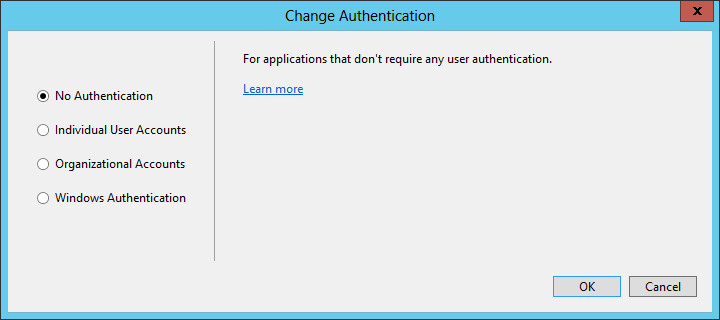
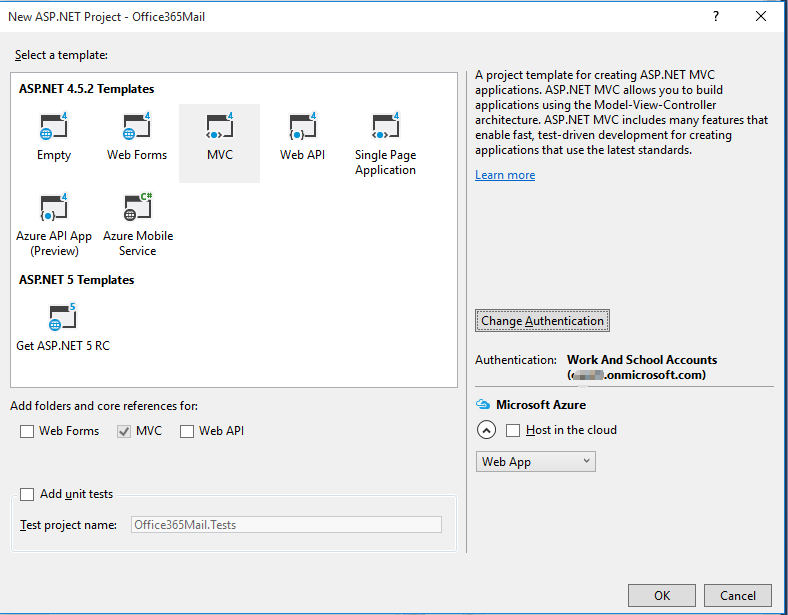
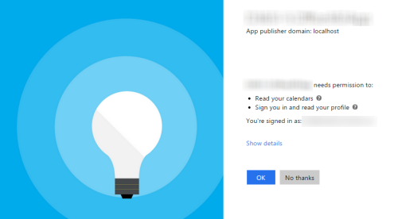
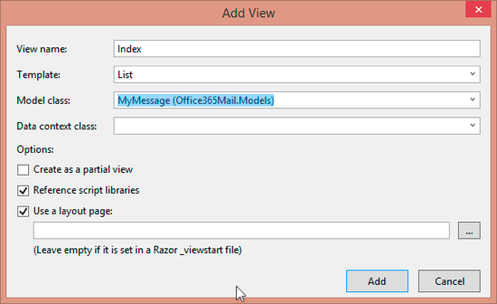
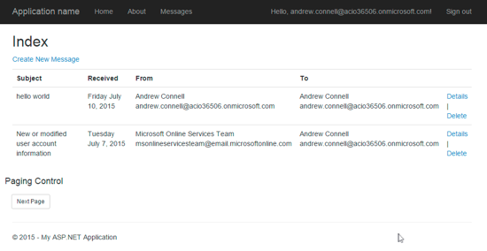
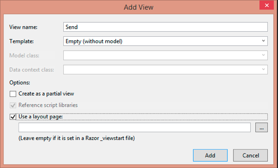

# Office 365 APIs for Mail
In this lab, you will use the Exchange client of the Office 365 APIs to program against Office 365 mailbox as part of an ASP.NET MVC5 application.

## Prerequisites
1. You must have an Office 365 tenant and Microsoft Azure subscription to complete this lab. If you do not have one, the lab for **O3651-7 Setting up your Developer environment in Office 365** shows you how to obtain a trial. You must also have access to an Exchange inbox within an Office 365 developer tenancy.
1. You must have the Office 365 API Tools version 1.3.41104.1 installed in Visual Studio 2013.

## Lab Setup: Setting up your Exchange account with Sample Mail Events for Testing
1. Using the browser, navigate to https://outlook.office365.com and log into your Office 365 mailbox.
1. Click the *waffle* icon in the top-left corner to open the App Launcher and click the **Mail** tile.
1. Add some Mail items to your Mail if you don't have any in your mailbox.
1. Once you have verified that you have a set of Mail events for testing, you can move on to the next exercise.

## Exercise 1: Create an ASP.NET MVC5 Application
In this exercise, you will create the ASP.NET MVC5 application and register it with Azure active Directory.

1. Launch **Visual Studio 2013** as administrator. 
1. In Visual Studio select **File/New/Project**.
1. In the **New Project** dialog, select **Templates/Visual C#/Web** and click **ASP.NET Web Application**. Name the new project **Office365Mail** and then click **OK**.  

	  

1. In the **New ASP.NET Project** dialog, click **MVC** and then click **Change Authentication**.
1. Select **No Authentication** and click **OK**.

	

1. Once the **New ASP.NET Project** dialog appears like the following screenshot, click **OK**. 

	

1. Update the web project to use SSL by default:
  1. In the **Solution Explorer** tool window, select the project and look at the **Properties** tool window. 
  1. Change the property **SSL Enabled** to **TRUE**.
  1. Copy the **SSL URL** property to the clipboard for use in the next step.
  1. Save your changes.

    
    > It is important to do this now because in the next step when you create the application in Azure AD, you want the reply URL to use HTTPS. If you did not do this now, you would have to manually make the changes the Visual Studio wizard is going to do for you in creating the app.
    
1. Configure the project to always go to the homepage of the web application when debugging:
  1. In the **Solution Explorer** tool window & select **Properties**.
  1. Select the **Web** tab in the left margin.
  1. Find the section **Start Action**.
  1. Click the radio button **Start URL** and enter the SSL URL of the web project that you copied from the previous step.

1. In the **Solution Explorer**, right click the **Office365Mail** project and select **Add/Connected Service**.
	1. In the **Services Manager** dialog:
    1. Click **Register Your App**.
    1. When prompted, login with your **Organizational Account**.
    1. Click **App Properties**.
	    1. Verify the option **Single Organization** is selected.
	    1. Make sure there is only a single URL listed in the **Redirect URIs** and it is the HTTPS URL of the web project.
	    1. Click **Apply**.
    1. Click **Mail**.
      1. Click **Permissions**.
      1. Check **Read and write user calendars**.
      1. Check **Read user calendars**.
      1. Click **Apply**.
    1. Click **Users and Groups**.
      1. Click **Enable sign-on and read user' profiles**.
      1. Click **Apply**.
    1. Click **OK**.

## Exercise 3: Configure Web Application to use Azure AD and OWIN
In this exercise you will take the ASP.NET MVC web application you created in the previous exercise and configure it to use Azure AD & OpenID Connect for user & app authentication. You will do this by utilizing the OWIN framework. Once authenticated, you can use the access token returned by Azure AD to access the Office 365 APIs.

1. Obtain and store the Azure AD tenant ID in the `web.config`.
  1. Browse to the [Azure Management Portal](https://manage.windowsazure.com) and sign in with your **Organizational Account**.
  1. In the left-hand navigation, click **Active Directory**.
  1. Select the directory you share with your Office 365 subscription.
  1. Select the application you created for this lab. This is the name of the application in the **App Properties** dialog when you were adding the **Connected Service** in the last exercise.
  1. Select the **Quick Start** page for the in the top navigation... that's the left-most menu item that looks like a lightning bolt in a cloud:

    
 
  1. On the Quick Start page, expand the **Get Started** / **Enable Users to Sign On**. Locate the field **Federation Metadata Document URL**. Within that field value you will see a GUID immediately after the `login.windows.net` part of the URL. Copy just the GUID value to the clipboard.

    

  1. Open the `web.config` file in the project.
  1. Add the following node to the `<appSettings>` section, setting the value equal to the **directory tenant ID** you acquired in the previous step:

    ````xml
    <add key="ida:AadTenantId" value="######-####-####-####-############"/>
    ````

1. Now you need a few NuGet packages to enable OWIN OpenID Connect authentication & to create a secure token cache (using Entity Framework) in the application:
  1. Open the Package Manager Console: **View/Other Windows/Package Manager Console**.
  1. Enter each line below in the console, one at a time, pressing **ENTER** after each one. NuGet will install the package and all dependent packages:

    ````powershell
    PM> Install-Package -Id EntityFramework
    PM> Install-Package -Id Microsoft.IdentityModel.Clients.ActiveDirectory
    PM> Install-Package -Id Microsoft.Owin.Host.SystemWeb
    PM> Install-Package -Id Microsoft.Owin.Security.Cookies
    PM> Install-Package -Id Microsoft.Owin.Security.OpenIdConnect
    ````

1. Add a new model that will be used by our persistent token cache:
  1. Right-click **Models** folder in the project and select **Add/Class**.
  1. Name the class **PerWebUserCache.cs**.
  1. When the file has been created, add the following code to the class:

    ````c#
    [Key]
    public int EntryId { get; set; }
    public string webUserUniqueId { get; set; }
    public byte[] cacheBits { get; set; }
    public DateTime LastWrite { get; set; }
    ````

  1. At the top of the file, add the following `using` statement:

    ````c#
    using System.ComponentModel.DataAnnotations;
    ````

1. Add a new persistent data store that will be used for the token cache:
  1. Right-click the project and select **Add/New Folder**.
  1. Name the folder **Data**.
  1. Locate the [Lab Files](Lab Files) folder provided with this lab & find two files: `Office365MailContextOffice365MailContext.cs` & `Office365MailInitializer.cs`. Copy these two files to the **Data** folder you just created.

1. Add a token cache that leverages Entity Framework to store the user specific tokens in persistent storage:
  1. Right-click the project and select **Add/New Folder**.
  2. Name the folder **Utils**.
  1. Locate the [Lab Files](Lab Files) folder provided with this lab & find the file `EDADALTokenCache.cs`. Copy that file to the **Utils** folder.
  
    > Take a moment to examine this file. It uses the `DbContext` you added in the previous step to implement a `TokenCache` which you will use in a moment. This will store the token received from a successful authentication in a persistent store.

1. Add a helper class that will be used to harvest settings out of the `web.config` and create the necessary strings that will be used for authentication:
  1. Locate the [Lab Files](Lab Files) folder provided with this lab & find the file `SettingsHelper.cs`. Copy that file to the **Utils** folder.

1. Configure the app to run startup code when the OWIN libraries startup:
  1. Right-click the project and select **Add/Class**.
  1. Name the class **Startup.cs**.
  1. Add the following `using` statements after the existing `using` statements:

    ````c#
    using Owin;
    using Microsoft.Owin;
    ````

  1. Add the following assembly directive to call the `Startup.Configuration()` method when OWIN starts up. Note that you will only point to the class:

    ````c#
    [assembly:OwinStartup(typeof(Office365Mail.Startup))]
    ````

  1. Update the signature of the `Startup` class to be a partial class as you will create another in the next step. Do this by adding the `partial` keyword after the `public` statement so it looks like the following:

    ````c#
    public partial class Startup {}
    ````

  1. Add the following `Confguration()` to the `Startup` class. This calls a method you will create in a moment:

    ````c#
    public void Configuration(IAppBuilder app)
    {
      ConfigureAuth(app);
    }
    ````

  1. Save your changes.
1. Create an authentication process when a user hits the website:
  1. Right-click the **App_Start** folder and select **Add/Class**.
  1. Name the class **Startup.Auth.cs**.
  1. When the file opens make the following two changes:
    1. Modify the namespace to just be `Office365Mail`.
    1. Modify the class declaration to be a `partial` class named `Startup` so it looks like the following:

      ````c#
      public partial class Startup {}
      ````

  1. Add the following `using` statements after the existing `using` statements:

    ````c#
    using Microsoft.IdentityModel.Clients.ActiveDirectory;
    using Microsoft.Owin.Security;
    using Microsoft.Owin.Security.Cookies;
    using Microsoft.Owin.Security.OpenIdConnect;
    using Owin;
    using System.Configuration;
    using System.Threading.Tasks;
    using Office365Mail.Utils;
    ````

  1. Add the following method to the `Startup` class:

    ````c#
    public void ConfigureAuth(IAppBuilder app) {}
    ````

  1. Configure the authentication type and settings for the app:

    ````c#
    app.SetDefaultSignInAsAuthenticationType(CookieAuthenticationDefaults.AuthenticationType);
    app.UseCookieAuthentication(new CookieAuthenticationOptions());
    ````

  1. Now configure the OWIN authentication process, force the user to go through the login process and collect the result returned from Azure AD:

    ````c#
    app.UseOpenIdConnectAuthentication(new OpenIdConnectAuthenticationOptions {
      ClientId = SettingsHelper.ClientId,
      Authority = SettingsHelper.AzureADAuthority,
      PostLogoutRedirectUri = HttpContext.Current.Request.Url.GetLeftPart(UriPartial.Authority),
      Notifications = new OpenIdConnectAuthenticationNotifications() {
        // when an auth code is received...
        AuthorizationCodeReceived = (context) => {
          // get the OpenID Connect code passed from Azure AD on successful auth
          string code = context.Code;

          // create the app credentials & get reference to the user
          ClientCredential creds = new ClientCredential(SettingsHelper.ClientId, SettingsHelper.ClientSecret);
          string userObjectId = context.AuthenticationTicket.Identity.FindFirst(System.IdentityModel.Claims.ClaimTypes.NameIdentifier).Value;

          // use the OpenID Connect code to obtain access token & refresh token...
          //  save those in a persistent store...
          EFADALTokenCache sampleCache = new EFADALTokenCache(userObjectId);
          AuthenticationContext authContext = new AuthenticationContext(SettingsHelper.AzureADAuthority, sampleCache);

          // obtain access token for the AzureAD graph
          Uri redirectUri = new Uri(HttpContext.Current.Request.Url.GetLeftPart(UriPartial.Path));
          AuthenticationResult authResult = authContext.AcquireTokenByAuthorizationCode(code, redirectUri, creds, SettingsHelper.AzureAdGraphResourceId);

          // successful auth
          return Task.FromResult(0);
        },
        AuthenticationFailed = (context) =>
        {
          context.HandleResponse();
          return Task.FromResult(0);
        }
      },
      TokenValidationParameters = new System.IdentityModel.Tokens.TokenValidationParameters
      {
        ValidateIssuer = false
      }
    });
    ````

  1. Save your changes.
1. With the authentication process wired up into the OWIN startup process, now implement a login controller to provide sign in & sign out functionality:
  1. Right-click the **Controllers** folder and select **Add/Controller**.
    1. In the **Add Scaffold** dialog, select **MVC 4 Controller - Empty**.
    1. Click **Add**.
    1. When prompted for a name, enter **AccountController**.
    1. Click **Add**.
  1. Within the **AccountController** file, add the following `using` statements to the top of the file:
  
    ````c#
    using Office365Mail.Utils;
    using Microsoft.IdentityModel.Clients.ActiveDirectory;
    using Microsoft.Owin.Security;
    using Microsoft.Owin.Security.Cookies;
    using Microsoft.Owin.Security.OpenIdConnect;
    using System.Security.Claims;
    ````

  1. Delete the default `Index()` method from the `AcountController` class.
  1. Add a new function to provide a sign in route. This will simply initiate a login challenge using the OWIN framework that will take the user to the Azure AD login page. When this runs, if the user has not already given the app consent to access their Office 365 data, they will be prompted to grant the app consent at this time.

    ````c#
    public void SignIn() {
      if (!Request.IsAuthenticated) {
        HttpContext.GetOwinContext().Authentication.Challenge(new AuthenticationProperties { RedirectUri = "/" }, OpenIdConnectAuthenticationDefaults.AuthenticationType);
      }
    }
    ````

  1. Add a new function to provide a sign out route. This will log the user out of the site & clear the local cache of tokes: 

    ````c#
    public void SignOut() {
      // Remove all cache entries for this user and send an OpenID Connect sign-out request.
      string usrObjectId = ClaimsPrincipal.Current.FindFirst(SettingsHelper.ClaimTypeObjectIdentifier).Value;
      AuthenticationContext authContext = new AuthenticationContext(SettingsHelper.AzureADAuthority, new EFADALTokenCache(usrObjectId));
      authContext.TokenCache.Clear();

      HttpContext.GetOwinContext().Authentication.SignOut(
          OpenIdConnectAuthenticationDefaults.AuthenticationType, CookieAuthenticationDefaults.AuthenticationType);
    }
    ````

  1. Add a pair of functions to handle requesting consent for the application.

    ````c#
    public ActionResult ConsentApp() {
      string strResource = Request.QueryString["resource"];
      string strRedirectController = Request.QueryString["redirect"];

      string authorizationRequest = String.Format(
          "{0}oauth2/authorize?response_type=code&client_id={1}&resource={2}&redirect_uri={3}",
              Uri.EscapeDataString(SettingsHelper.AzureADAuthority),
              Uri.EscapeDataString(SettingsHelper.ClientId),
              Uri.EscapeDataString(strResource),
              Uri.EscapeDataString(String.Format("{0}/{1}", this.Request.Url.GetLeftPart(UriPartial.Authority), strRedirectController))
              );

      return new RedirectResult(authorizationRequest);
    }

    public ActionResult AdminConsentApp() {
      string strResource = Request.QueryString["resource"];
      string strRedirectController = Request.QueryString["redirect"];

      string authorizationRequest = String.Format(
          "{0}oauth2/authorize?response_type=code&client_id={1}&resource={2}&redirect_uri={3}&prompt={4}",
              Uri.EscapeDataString(SettingsHelper.AzureADAuthority),
              Uri.EscapeDataString(SettingsHelper.ClientId),
              Uri.EscapeDataString(strResource),
              Uri.EscapeDataString(String.Format("{0}/{1}", this.Request.Url.GetLeftPart(UriPartial.Authority), strRedirectController)),
              Uri.EscapeDataString("admin_consent")
              );

      return new RedirectResult(authorizationRequest);
    }
    ````

  1. Add one more function to the `AccountController` class to refresh the session and reissue the OWIN authentication challenge:
      
    ````c#
    public void RefreshSession() {
      string strRedirectController = Request.QueryString["redirect"];

      HttpContext.GetOwinContext().Authentication.Challenge(new AuthenticationProperties { RedirectUri = String.Format("/{0}", strRedirectController) }, OpenIdConnectAuthenticationDefaults.AuthenticationType);
    }
    ````

  1. Now that the **AccountController** is setup, the last step is to implement the user interface components to provide sign in and sign out capabilities.
    1. Locate the **Views/Shared** folder in the project.
    1. Right-click the folder and select **Add/View**.
    1. Complete the **Add View** dialog as shown in the following picture, then click **Add**:
      
      

    1. Add the following code to the **_LoginPartial.cshtml** file:

      ````asp
      @if (Request.IsAuthenticated) {
        <text>
          <ul class="nav navbar-nav navbar-right">
            <li class="navbar-text">
              Hello, @User.Identity.Name!
            </li>
            <li>
              @Html.ActionLink("Sign out", "SignOut", "Account")
            </li>
          </ul>
        </text>
      } else {
        <ul class="nav navbar-nav navbar-right">
          <li>@Html.ActionLink("Sign in", "SignIn", "Account", routeValues: null, htmlAttributes: new { id = "loginLink" })</li>
        </ul>
      }
      ````

    1. Open the **_Layout.cshtml** file found in the **Views/Shared** folder.
      1. Locate the part of the file that includes a few links at the top of the page... it should look similar to the following code:
      
        ````asp
        <div class="navbar-collapse collapse">
          <ul class="nav navbar-nav">
            <li>@Html.ActionLink("Home", "Index", "Home")</li>
            <li>@Html.ActionLink("About", "About", "Home")</li>
            <li>@Html.ActionLink("Contact", "Contact", "Home")</li>
          </ul>
        </div>
        ````

      1. Update that navigation so the Messages link points to the Mail controller (the **Messages** link added below) as well as a reference to the login control you just created:

        ````asp
        <div class="navbar-collapse collapse">
          <ul class="nav navbar-nav">
            <li>@Html.ActionLink("Home", "Index", "Home")</li>
            <li>@Html.ActionLink("About", "About", "Home")</li>
            <li>@Html.ActionLink("Messages", "Index", "Mail")</li>
          </ul>
          @Html.Partial("_LoginPartial")
        </div>
        ````

      > The **Messages** link will not work yet... you will add that in the next exercise.

1. At this point you can test the authentication flow for your application.
  1. In Visual Studio, press **F5**. The browser will automatically launch taking you to the HTTPS start page for the web application.
  1. To sign in, click the **Sign In** link the upper-right corner.
  1. Login using your **Organizational Account**.
  1. Upon a successful login, since this will be the first time you have logged into this app, Azure AD will present you with the common consent dialog that looks similar to the following image:

    

  1. Click **OK** to approve the app's permission request on your data in Office 365.
  1. You will then be redirected back to your web application. However notice in the upper right corner, it now shows your email address & the **Sign Out** link.

Congratulations... at this point your app is configured with Azure AD and leverages OpenID Connect and OWIN to facilitate the authentication process!

## Exercise 3: Code the Mail API
In this exercise, you will create a repository object for wrapping CRUD operations associated with the Mail API.

1. In the **Solution Explorer**, locate the **Models** folder in the **Office365Mail** project.
1. Right-click the **Models** folder and select **Add/Class**.
1. In the **Add New Item** dialog, name the new class **MyMessage** and click **Add** to create the new source file for the class.  
1. At the top of the course file **MyMessage.cs**, add the following using statement just after the using statements that are already there.

	````c#
	using System.ComponentModel;
	````

1. Implement the new class **MyMessage** using the following class definition.
		
  ````c#
  public class MyMessage {
    public string Id { get; set; }
    public string ConversationId { get; set; }
    public string Subject { get; set; }
    [DisplayName("From Name")]
    public string FromName { get; set; }
    [DisplayName("From Email Address")]
    public string FromEmailAddress { get; set; }
    [DisplayName("Sent")]
    [DisplayFormat(DataFormatString = "{0:dddd MMMM d, yyyy}")]
    public DateTimeOffset? DateTimeSent { get; set; }
    [DisplayName("Received")]
    [DisplayFormat(DataFormatString = "{0:dddd MMMM d, yyyy}")]
    public DateTimeOffset? DateTimeReceived { get; set; }
    [DisplayName("Has Attachments")]
    public bool? HasAttachments { get; set; }
    public string Importance { get; set; }
    public bool? IsDraft { get; set; }
    [DisplayName("To Name")]
    public string ToName { get; set; }
    [DisplayName("To Email Address")]
    public string ToEmailAddress { get; set; }
    public string Body { get; set; }
  }
  ````

1. Right-click the **Models** folder and select **Add/Class**. In the **Add New Item** dialog, name the new class **MyMessagesRespository** and click **Add** to create the new source file for the class.    
1. **Add** the following using statements to the top of the **MyMessagesRespository** class.
		
	````c#
	using System.Security.Claims;
	using System.Threading.Tasks;
	using Microsoft.IdentityModel.Clients.ActiveDirectory;
	using Microsoft.Office365.Discovery;
	using Microsoft.Office365.OutlookServices;
	using Office365Mail.Utils;
  using Office365Mail.Models;
	````

1. **Add** a function named **EnsureClientCreated** to the **MyMessagesRespository** class with the following implementation to create and return an **OutlookServicesClient** object.
		
  ````c#
  private async Task<OutlookServicesClient> EnsureClientCreated() {
    // fetch from stuff user claims
    var signInUserId = ClaimsPrincipal.Current.FindFirst(ClaimTypes.NameIdentifier).Value;
    var userObjectId = ClaimsPrincipal.Current.FindFirst(SettingsHelper.ClaimTypeObjectIdentifier).Value;

    // discover endpoint
    var clientCredential = new ClientCredential(SettingsHelper.ClientId, SettingsHelper.ClientSecret);
    var userIdentifier = new UserIdentifier(userObjectId, UserIdentifierType.UniqueId);

    // create auth context
    AuthenticationContext authContext = new AuthenticationContext(SettingsHelper.AzureADAuthority, new EFADALTokenCache(signInUserId));

    // create O365 discovery client 
    DiscoveryClient discovery = new DiscoveryClient(new Uri(SettingsHelper.O365DiscoveryServiceEndpoint),
      async () => {
        var authResult = await authContext.AcquireTokenSilentAsync(SettingsHelper.O365DiscoveryResourceId, clientCredential, userIdentifier);

        return authResult.AccessToken;
      });

    // query discovery service for endpoint for 'Mail' endpoint
    CapabilityDiscoveryResult dcr = await discovery.DiscoverCapabilityAsync("Mail");

    // create an OutlookServicesclient
    return new OutlookServicesClient(dcr.ServiceEndpointUri,
      async () => {
        var authResult =
          await
            authContext.AcquireTokenSilentAsync(dcr.ServiceResourceId, clientCredential, userIdentifier);
        return authResult.AccessToken;
      });
  }
  ````

1. **Add** a function named **GetMessages** to the **MyMessagesRespository** class to retrieve and return a list of **MyMessage** objects.
		
  ````c#
  public async Task<List<MyMessage>> GetMessages(int pageIndex, int pageSize) {

    var client = await EnsureClientCreated();

    var messageResults = await (from message in client.Me.Messages
                                orderby message.DateTimeSent descending
                                select message)
                              .Skip(pageIndex * pageSize)
                              .Take(pageSize)
                              .ExecuteAsync();

    MorePagesAvailable = messageResults.MorePagesAvailable;

    var messageList = new List<MyMessage>();

    foreach (IMessage message in messageResults.CurrentPage) {
      var myMessage = new MyMessage {
        Id = message.Id,
        Subject = message.Subject,
        DateTimeReceived = message.DateTimeReceived,
        FromName = message.From.EmailAddress.Name,
        FromEmailAddress = message.From.EmailAddress.Address,
        ToName = message.ToRecipients[0].EmailAddress.Name,
        ToEmailAddress= message.ToRecipients[0].EmailAddress.Address,
        HasAttachments = message.HasAttachments
      };

      messageList.Add(myMessage);
    }
    return messageList;
  }
  ````

1. Add a **GetMessage** function to the **MyMessagesRespository** class to get a specific message:

  ````c#
  public async Task<MyMessage> GetMessage(string id) {
    var client = await EnsureClientCreated();
    var existingMessage = await client.Me.Messages.GetById(id).ExecuteAsync();

    var newMessage = new MyMessage {
      Id = existingMessage.Id,
      ConversationId = existingMessage.ConversationId,
      Subject = existingMessage.Subject,
      DateTimeSent = existingMessage.DateTimeSent,
      DateTimeReceived = existingMessage.DateTimeReceived,
      FromName = existingMessage.From.EmailAddress.Name,
      FromEmailAddress = existingMessage.From.EmailAddress.Address,
      Body = existingMessage.Body.Content ?? string.Empty,
      HasAttachments = existingMessage.HasAttachments,
      ToName = existingMessage.ToRecipients[0].EmailAddress.Name,
      ToEmailAddress = existingMessage.ToRecipients[0].EmailAddress.Address
    };

    return newMessage;
  }
  ````

1. Add a **DeleteMessage** function to the **MyMessagesRespository** class to delete a message.

  ````c#
  public async Task DeleteMessage(string id) {
    var client = await EnsureClientCreated();
    var myMessage = await client.Me.Messages.GetById(id).ExecuteAsync();
    await myMessage.DeleteAsync();
  }
  ````

1. Add a **SendMessage** function  to the **MyMessagesRespository** class to send a new email.

  ````c#
  public async Task SendMessage(MyMessage myMessage) {

    var client = await EnsureClientCreated();

    var newMessage = new Message {Subject = myMessage.Subject};

    var email = new EmailAddress {
      Name = myMessage.ToName,
      Address = myMessage.ToEmailAddress
    };
    newMessage.ToRecipients.Add(new Recipient { EmailAddress = email });

    newMessage.Body = new ItemBody {
      ContentType = BodyType.Text,
      Content = myMessage.Body
    };

    await client.Me.Messages.AddMessageAsync(newMessage);

    await newMessage.SendAsync();
  }
  ````

At this point you have created the repository that will be used to talk to the Office 365 API.

## Exercise 4: Code the MVC Application
In this exercise, you will code the **MailController** of the MVC application to display messages as well as adding behavior for sending and deleting messages.

1. Right-click the **Controllers** folder and select **Add/Controller**.
  1. In the **Add Scaffold** dialog, select **MVC 4 Controller - Empty**.
  1. Click **Add**.
  1. When prompted for a name, enter **MailController**.
  1. Click **Add**.
1. Within the **MailController** file, add the following `using` statements to the top of the file:

  ````c#
  using System;
  using System.Collections.Generic;
  using System.Linq;
  using System.Threading.Tasks;
  using System.Web;
  using System.Web.Mvc;
  using System.Web.UI;
  using Office365Mail.Models;
  ````

1. Within the `MailController` class, add the following field to get a reference to the repository you previously created:

  ````c#
  MyMessagesRespository _repo = new MyMessagesRespository();
  ````

1. In the **Solution Explorer**, expand the **Controllers** folder and open the **MailController.cs** file.
1. **Add** the following using statements to the top of the file.

  ````c#
  using System.Threading.Tasks;
  using Office365Mail.Models;
  ````

1. Add a field to the class to indicate if there are more items beyond what was returned in the last query:

  ````c#
  MyMessagesRespository _repo = new MyMessagesRespository();
  ````

1. Add a route handler and view to list all the events:
  1. **Replace** the **Index** method with the following code to read files.
      
    ````c#
    [Authorize]
    public async Task<ActionResult> Index(int? pageNumber) {
      // setup paging
      const int pageSize = 2;
      if (pageNumber == null)
        pageNumber = 1;

      // get list of entities
      var messages = await _repo.GetMessages((int)pageNumber - 1, pageSize);

      ViewBag.pageNumber = pageNumber;
      ViewBag.morePagesAvailable = _repo.MorePagesAvailable;

      return View(messages);

    }
    ````

    > Notice how the route handler takes in an optional parameter for the page number. This will be used to implement paging for the controller. Right now the page size is small, set to 5, for demonstration purposes. Also notice how the repository has a public property `ModePagesAvailable` that indicates if there are more pages of results as reported by the Office 365 API.

  1. Finally, update the view to display the results.
    1. Within the `MailController` class, right click the `View()` at the end of the `Index()` method and select **Add View**.
    1. Within the **Add View** dialog, set the following values:
      1. View Name: **Index**.
      1. Template: **Empty (without model)**.
        
        > Leave all other fields blank & unchecked.
      
      1. Click **Add**.

      

    1. Within the **Views/Mail/Index.cshtml** file, delete all the code in the file and replace it with the following code:
      
      ````html
      @model IEnumerable<Office365Mail.Models.MyMessage>

      @{
        ViewBag.Title = "Index";
      }

      <h2>Index</h2>

      <p>
        @Html.ActionLink("Create New Message", "Send")
      </p>
      <table class="table">
        <tr>
          <th>@Html.DisplayNameFor(model => model.Subject)</th>
          <th>@Html.DisplayNameFor(model => model.DateTimeReceived)</th>
          <th>From</th>
          <th>To</th>
          <th></th>
        </tr>

        @foreach (var item in Model) {
          <tr>
            <td>@Html.DisplayFor(modelItem => item.Subject)</td>
            <td>@Html.DisplayFor(modelItem => item.DateTimeReceived)</td>
            <td>
              @Html.DisplayFor(modelItem => item.FromName)<br />
              @Html.DisplayFor(modelItem => item.FromEmailAddress)
            </td>
            <td>
              @Html.DisplayFor(modelItem => item.ToName)<br />
              @Html.DisplayFor(modelItem => item.ToEmailAddress)
            </td>
            <td>
              @Html.ActionLink("Details", "Details", new { id = item.Id }) |
              @Html.ActionLink("Delete", "Delete", new { id = item.Id })
            </td>
          </tr>
        }
      </table>
      ````

  1. Now at the bottom of the **Index.cshtml** file, add the following code that will implement paging for the index page:

    ````html
    <div class="row">
      <h4>Paging Control</h4>
      <div class="btn btn-group-sm">
        @{
          var pageLinkAttributes = new Dictionary<string, object> { { "class", "btn btn-default" } };

          int pageNumber = ViewBag.pageNumber;

          // do prev link if not on first page
          if (pageNumber > 1) {
            var routeValues = new RouteValueDictionary { { "pageNumber", pageNumber - 1 } };
            @Html.ActionLink("Previous Page", "Index", "Mail", routeValues, pageLinkAttributes);
          }


          // do next link if current page = max page size
          if (ViewBag.morePagesAvailable) {
            var routeValues = new RouteValueDictionary { { "pageNumber", pageNumber + 1 } };
            @Html.ActionLink("Next Page", "Index", "Mail", routeValues, pageLinkAttributes);
          }
        }
      </div>
    </div>
    ````

1. Test the new view:
  1. In **Visual Studio**, hit **F5** to begin debugging.
  1. When prompted, log in with your **Organizational Account**.
  1. Once the application has initialized and displayed its home page, you should be able to verify that your application displays Mail from your Office 365 account.  

    

  1. Close the browser window, terminate the debugging session and return to Visual Studio.

1. Add a route handler delete a message:
  1. In the **MailController.cs** file, add an action method named **Delete** using the following code to delete a message.

    ````c#
    [Authorize]
    public async Task<ActionResult> Delete(string id) {
      if (id != null) {
        await _repo.DeleteMessage(id);
      }

      return Redirect("/Mail");

    }
    ````

1. Test the new view:
  1. In **Visual Studio**, hit **F5** to begin debugging.
  1. When prompted, log in with your **Organizational Account**.
  1. Once the application has initialized and displayed its home page, you should be able to verify that your application displays Mail from your Office 365 account.  

    

  1. Close the browser window, terminate the debugging session and return to Visual Studio.

1. Add a route handler and views to handle sending events:
  1. In the **MailController.cs** file, add an action method named **Send** using the following code to create a new event. Notice how you are adding two items, when the create form is requested (the `HttpGet` option) and one for when the form is submitted (the `HttpPost` option).

    ````c#
    [HttpGet]
    [Authorize]
    public async Task<ActionResult> Send() {
      return View(new MyMessage());
    }

    [HttpPost]
    [Authorize]
    public async Task<ActionResult> Send(MyMessage myEvent) {
      myEvent.FromName = User.Identity.Name;
      myEvent.FromEmailAddress = User.Identity.Name;

      await _repo.SendMessage(myEvent);
      return Redirect("/Mail");
    }
    ````

  1. Now you must create a new MVC view for the **Send** action method. You can accomplish this right-clicking on the white space inside the the **Send** action method in the **MailController.cs** and selecting **Add View**.
  1. In the **Add View** dialog, set the following options on the dialog and click **Add**.
    + View name: **Send**
    + Template: **Create**
    + Model class: **MyMessage (Office365Mail.Models)**
    + Create as partial view: **unchecked**
    + Reference script libraries: **unchecked**
    + Use a layout page: **checked**

    

  1. Open the **Send.cshtml** file and make sure the code looks like the following code to build a form that will allow a user to create a message:

    ````html
    [HttpGet]
    [Authorize]
    public async Task<ActionResult> Send() {
      return View(new MyMessage());
    }

    [HttpPost]
    [Authorize]
    public async Task<ActionResult> Send(MyMessage myEvent) {
      myEvent.FromName = User.Identity.Name;
      myEvent.FromEmailAddress = User.Identity.Name;

      await _repo.SendMessage(myEvent);
      return Redirect("/Mail");
    }
    ````

1. Test the new view:
  1. In **Visual Studio**, hit **F5** to begin debugging.
  1. When Prompted, log in with your **Organizational Account**.
  1. Once the application as loaded and displayed the homepage, click the **Create New** link. You should see the form below. Fill the form out to add a new item:

    

  1. Close the browser window, terminate the debugging session and return to Visual Studio.

Congratulations! You have completed working with the the Mail API.