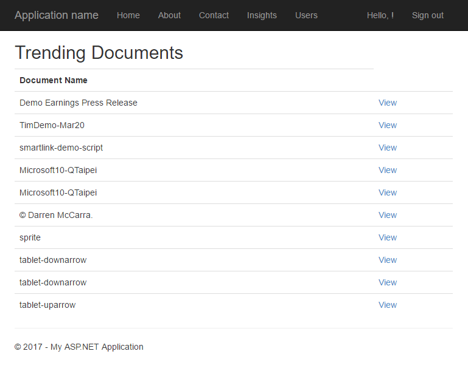
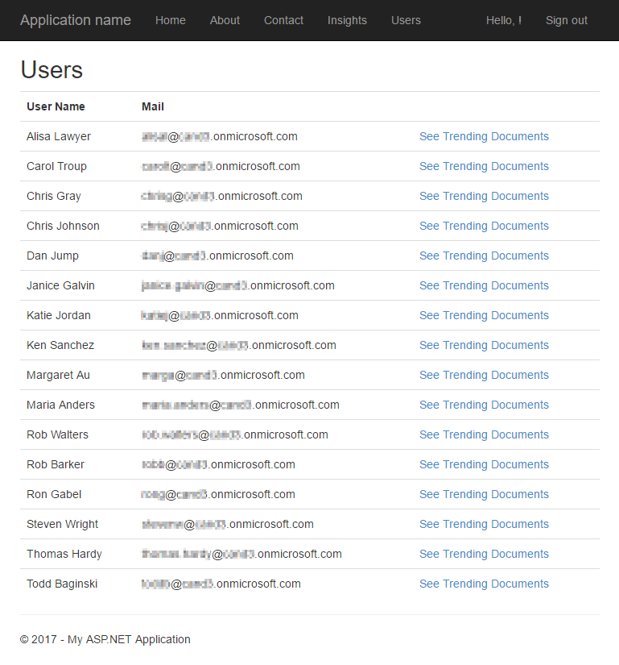

# Insights from Microsoft Graph
In this lab, you will use Microsoft Graph to connect to insights in the Office Graph. You will build an ASP.NET MVC 5 application that retrieves documents trending around users in your Office 365 tenant.

## Prerequisites
1. You must have an Office 365 tenant and Microsoft Azure subscription to complete this lab. If you do not have one, the lab for **O3651-7 Setting up your Developer environment in Office 365** shows you how to obtain a trial.
2. You must have Visual Studio 2017 with the ASP.NET and web application components installed.

## Exercise 1: Displaying my trending documents
1. Launch Visual Studio 2017.
	1. Locate the [StarterFiles\OfficeGraphLab](StarterFiles\OfficeGraphLab) folder that contains a starter project. The starter project is an ASP.NET MVC5 web application that you will update to call the Microsoft Graph API.
	2. Open the **OfficeGraphLab** solution in Visual Studio 2017.
	3. Open the **Web.config** file and find the **appSettings** element. This is where you will need to add your appId and app secret you will generate in the next steps.
	4. Set the value for **ida:Domain** with your domain of your tenant(e.g. example.onmicrosoft.com) in your project's **Web.config** file
  
2. Launch the Application Registration Portal by opening a browser and navigating to https://apps.dev.microsoft.com to register a new application.
	1. Sign into the portal using your Office 365 work account username and password. This project allows you to sign in with a Microsoft account, an Office 365 for business account, or  a school account, but the "trending around" feature currently works only with Office 365 for business accounts and school accounts.
	2. Click **Add an App** and type **OfficeGraphLab** for the application name.
	3. Copy the **Application Id** and paste it into the value for **ida:AppId** in your project's **Web.config** file.
	4. Under **Application Secrets** click **Generate New Password** to create a new client secret for your app.
	5. Copy the displayed app password and paste it into the value for **ida:AppSecret** in your project's **Web.config** file.
	6. Under **Platforms**, click **Add Platform**, select **Web** in the popup window.
	7. Copy the value for **ida:PostLogoutRedirectUri** in your project's **Web.config** file and paste it into the **Redirect URLs** and **Logout URL** for the application in the Application Registration Portal.
	8. Save the changes for the application in the Application Registration Portal.
	9. Save the **Web.config** file in your project.

3. Update the layout file to add links to **Insights** and **Users**
	1. Open the **_Layout.cshtml** file found in the **Views/Shared** folder.
	2. Locate the part of the file that includes links at the top of the page:
      
		````html
		  <ul class="nav navbar-nav">
		    <li>@Html.ActionLink("Home", "Index", "Home")</li>
		    <li>@Html.ActionLink("About", "About", "Home")</li>
		    <li>@Html.ActionLink("Contact", "Contact", "Home")</li>
		  </ul>
		````

	3. Update that navigation to have two new links (the **Insights** and **Users** links added below). 

		````html
		  <ul class="nav navbar-nav">
		    <li>@Html.ActionLink("Home", "Index", "Home")</li>
		    <li>@Html.ActionLink("About", "About", "Home")</li>
		    <li>@Html.ActionLink("Contact", "Contact", "Home")</li>
		    <li>@Html.ActionLink("Insights", "Index", "Trending")</li>
		    <li>@Html.ActionLink("Users", "Users", "Trending")</li>
		  </ul>
		````

		> **NOTE**: The links will not work just yet. We'll add some functionality to the pages later.
 
4. Create a controller for displaying trending documents
	1. Right-click the **Controllers** folder and choose **Add** > **New Scaffolded Item...**.
	2. In the **Add Scaffold** dialog, select **MVC 5 Controller - Empty**.
	3. Click **Add**.
	4. When prompted for a name, enter **TrendingController**.
	5. Click **Add**.
	6. Copy the following `using` statements to the top of the **TrendingController** file, replacing the existing ones:

		````c#
		using System;
		using System.Configuration;
		using System.Threading.Tasks;
		using System.Web.Mvc;
		using System.Net.Http;
		using System.Collections.Generic;
		using System.Linq;
		using Newtonsoft.Json;
		using OfficeGraphLab.Auth;
		using OfficeGraphLab.Models;
		using OfficeGraphLab.TokenStorage;
		````

	7. Add the following code inside the **TrendingController** class:

		````c#
		private static string _msGraphEndpoint = "https://graph.microsoft.com/beta";
		````

	8. Add the following helper functions that will handle authentication to the **TrendingController** class.

		````c#
		private async Task<string> GetToken()
		{
		    string userObjId = AuthHelper.GetUserId(System.Security.Claims.ClaimsPrincipal.Current);
		    SessionTokenCache tokenCache = new SessionTokenCache(userObjId, HttpContext);
		
		   var authority = ConfigurationManager.AppSettings["ida:AADInstance"] + "common";
		   var appId = ConfigurationManager.AppSettings["ida:AppId"];
		   var appSecret = ConfigurationManager.AppSettings["ida:AppSecret"];
		   AuthHelper authHelper = new AuthHelper(authority, appId, appSecret, tokenCache);
		   var redirectUri = ConfigurationManager.AppSettings["ida:PostLogoutRedirectUri"];
		   return await authHelper.GetUserAccessToken(redirectUri);
		}
		
		private HttpClient GetHttpClient(string token)
		{
		    var client = new HttpClient();
		    client.DefaultRequestHeaders.Add("Accept", "application/json");
		
		    // set the access token on all requests to the Microsoft Graph API
		    client.DefaultRequestHeaders.Add("Authorization", "Bearer " + token);
		    return client;
		}
		````

	8. Add the following helper functions that will retrieve trending documents to the **TrendingController** class.

		````c#
		private async Task<IEnumerable<Trending>> GetTrendingAroundByUserAsync(string token, string userId)
		{
		    var client = GetHttpClient(token);
		
		    // create query
		    var query = string.IsNullOrEmpty(userId) ? _msGraphEndpoint + "/me/insights/trending" : string.Format("{0}/users/{1}/insights/trending", _msGraphEndpoint, userId);
		
		    // create request
		    var request = new HttpRequestMessage(HttpMethod.Get, query);
		
		    // issue request & get response
		    var response = await client.SendAsync(request);
		    string content = await response.Content.ReadAsStringAsync();
		    var trendingArounds = JsonConvert.DeserializeObject<Collection<Trending>>(content);
		    return trendingArounds.value;
		}
		````

	9. **Replace** the **Index** method with the following code to retrieve trending documents.
      
		````c#
		public async Task<ActionResult> Index(string userId)
		{
		    var token = await GetToken();
		    if (!string.IsNullOrEmpty(token))
		    {
		        var model = await GetTrendingAroundByUserAsync(token, userId);
		        return View(model);
		    }
		    return RedirectToAction("SignOut", "Account");
		}
		````

	10. Save the file.

5. Create a view for displaying trending documents
	1. Within the `TrendingController` class, right click the `View(model)` method inside the `Index()` action and select **Add View**.
   
	2. Make sure the following properties are entered in the **Add View** dialog:
		1. View Name: **Index**.
		2. Template: **Empty (without model)**.
		3. Leave all other fields default.

		

	3. Click **Add**.
	4. Within the **Views/Trending/Index.cshtml** file, replace all the code in the file with the following code:
      
		````html
		@model IEnumerable<OfficeGraphLab.Models.Trending>
		@{
		    ViewBag.Title = "Trending Documents";
		}
		<h2>Trending Documents</h2>
		@if (Model != null && Model.Any())
		{
		    <table class="table">
		        <tr>
		            <th>Document Name</th>
		        </tr>
		        @foreach (var item in Model)
		        {
		            <tr>
		                <td>@item.ResourceVisualization.Title</td>
		                <td><a href="@item.ResourceReference.WebUrl" target="_blank">View</a></td>
		            </tr>
		        }
		    </table>
		}
		else
		{
		    <p>No trending documents for this user.</p>
		}
		````

	5. Save the file.   

6. Press **F5** to compile and launch your new application in the default browser.
	1. Once prompted, login with your Office 365 account.
	2. Review the permissions the application you are requesting, and click **Accept**.
	3. Now that you are signed into your application, click **Insights** in the top nav bar. You will see your trending documents.
 
		

	4. Stop debugging.

		> **NOTE**: The web application enabled SSL by default. However, since a default certificate is not configured for your computer, your browser will report a certificate error. Depending on the browser you are using, you will need to add an exception (for example: Mozilla, Firefox) or click Advanced and select to proceed to the website (for example: Microsoft Edge, Google Chrome).

## Exercise 2: Displaying trending documents of other users
1. Add an action method to handle displaying documents trending of a specific user:
	1. In the **TrendingController.cs** file, add the following helper function that will retrieve all the users of the domain of your tenant.

		````c#
		private async Task<IEnumerable<User>> GetUsersAsync(string token)
		{
		    var client = GetHttpClient(token);
		
		    // create query
		    var query = string.Format("{0}/users", _msGraphEndpoint);
		
		    // create request
		    var request = new HttpRequestMessage(HttpMethod.Get, query);
		
		    // issue request & get response
		    var response = await client.SendAsync(request);
		    string content = await response.Content.ReadAsStringAsync();
		    var users = JsonConvert.DeserializeObject<Collection<User>>(content);
		    var domain = ConfigurationManager.AppSettings["ida:Domain"];
		    return users.value.Where(user => !string.IsNullOrEmpty(user.Mail) && user.Mail.EndsWith(domain)).Select(user => user);
		}
		````

	2. In the **TrendingController.cs** file, add an action method named **Users** with the following code:

		````c#
		public async Task<ActionResult> Users()
		{
		    var token = await GetToken();
		    if (!string.IsNullOrEmpty(token))
		    {
		        var model = await GetUsersAsync(token);
		        return View(model);
		    }
		    return RedirectToAction("SignOut", "Account");
		}
		````

	3. Save the file.

2. Create a view to display users.    
	1. Within the `TrendingController` class, right click the `View(model)` at inside the `Users()` action method that you just created and select **Add View**.

	2. Make sure the following properties are entered in the **Add View** dialog.
		1. View Name: **Users**.
		2. Template: **Empty (without model)**.
		3. Leave all other fields default.
      
	3. Click **Add**.

3. Within the **Views/Trending/Users.cshtml** file, replace all the code in the file with the following code:

	````html
	@model IEnumerable<OfficeGraphLab.Models.User>
	@{
	    ViewBag.Title = "Users";
	}
	<h2>Users</h2>
	<table class="table">
	    <tr>
	        <th>User Name</th>
	        <th>Mail</th>
	        <th>
	        </th>
	    </tr>
	
	    @foreach (var item in Model)
	    {
	        <tr>
	            <td>@item.DisplayName</td>
	            <td>@item.Mail</td>
	            <td>
	                @Html.ActionLink("See Trending Documents", "Index", new { userId = item.Id })
	            </td>
	        </tr>
	    }
	</table>
	````

4. Save the file.  
       
5. Press **F5** to compile and launch your new application in the default browser.
	1. Login with your Office 365 account.
	2. Click **Users** in the top nav bar. You will see all the users of the domain of your tenant.
 
		
  
	3. Click **See Trending Documents** link for a user. You will see the trending documents of that user.