# Synchronize Outlook data with your application
In this lab, you will use the Microsoft Graph API to synchronize messages from a user's inbox with a DocumentDB database.

## Overview 
The Microsoft Graph API now has the capabilities to synchronize messages with your application's data store. This allows your app to retrieve only the changes to a message collection since the last sync.

## Prerequisites
1. You must have an Office 365 tenant and Microsoft Azure subscription to complete this lab. If you do not have one, the lab for **O3651-7 Setting up your Developer environment in Office 365** shows you how to obtain a trial.
1. You must have Visual Studio 2017 with ASP.NET and web development workload installed.


## Register the application
In this step, you'll register an app on the Microsoft App Registration Portal. This generates the app ID and password that you'll use to configure the app in Visual Studio.

1. Sign into the [Microsoft App Registration Portal](https://apps.dev.microsoft.com "Microsoft App Registration Portal") using either your personal or work or school account.
2. Choose **Add an app**.
3. Enter a name for the app, and choose Create application.
    > The registration page displays, listing the properties of your app.

4. Copy the application ID. This is the unique identifier for your app.
5. Under **Application Secrets**, choose **Generate New Password**. Copy the password from the **New password generated** dialog.
    > You'll use the application ID and password to configure the app.

6. Under **Platforms**, choose **Add platform > Web**.
7. Make sure the **Allow Implicit Flow** check box is selected, and enter **https://localhost:44304/** as the Redirect URI.
    > The Allow Implicit Flow option enables the OpenID Connect hybrid flow. During authentication, this enables the app to receive both sign-in info (the id_token) and artifacts (in this case, an authorization code) that the app uses to obtain an access token.
 
8. Modify the **Microsoft Graph Permissions** value to include the required **Mail.Read, User.Read** scope.
	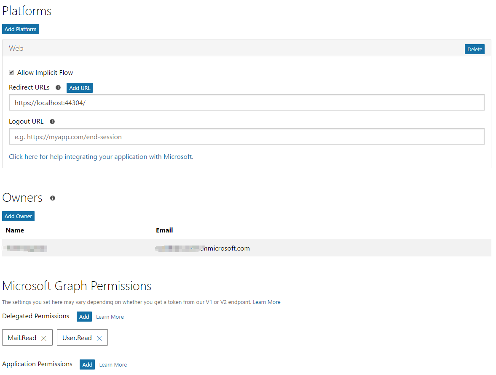

9. Choose **Save**.


## Exercise 1: Configure a starter project using Azure Active Directory v2 authentication

In this first step, you will configure a ASP.NET MVC starter project using the **AAD Auth v2** to authentication, and log in to your app and generate access tokens for calling the Graph API.

1. Locate the [Starter Project](./Starter%20Project) folder that contains a starter project. The starter project is an ASP.NET MVC5 web application that you will update to call the Microsoft Graph.

2. **Launch** Visual Studio 2017 and **open** the starter project.

	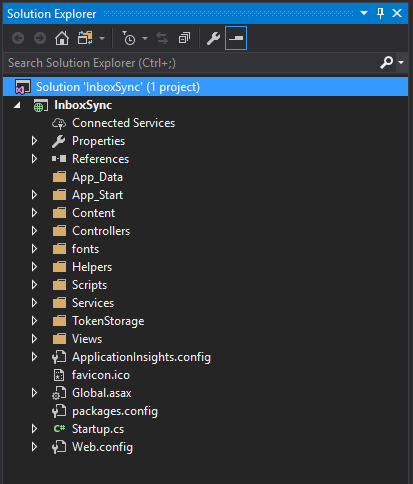

3. Open the **Web.config** file and find the **appSettings** element.
	

4. Locate the app configuration keys in the appSettings element. Replace the **ENTER_YOUR_CLIENT_ID** and **ENTER_YOUR_SECRET** placeholder values with the values you just copied.
5. Paste **Mail.Read User.Read** into the value for **ida:GraphScopes**.
	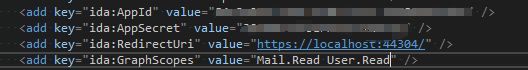

6. Press F5 to compile and launch your new application in the default browser.
   1. When the Graph and AAD v2 Auth Endpoint Starter page appears, click **Sign in** and log on to your Office 365 account.
   2. Review the permissions the application is requesting, and click **Accept**.
   3. Now that you are signed in to your application, exercise 1 is complete!
   4. Make sure to stop debugging and sign out before continuing to exercise 2.
  
## Exercise 2: Configure DocumentDB and access the database
In this exercise, you will configure a DocumentDB database and add code to the project to access the database.

1. In a new window, sign in to the [Azure portal](https://portal.azure.com/).
2. In the left pane, click **New**, click **Databases**, and then click **Azure Cosmos DB**.
	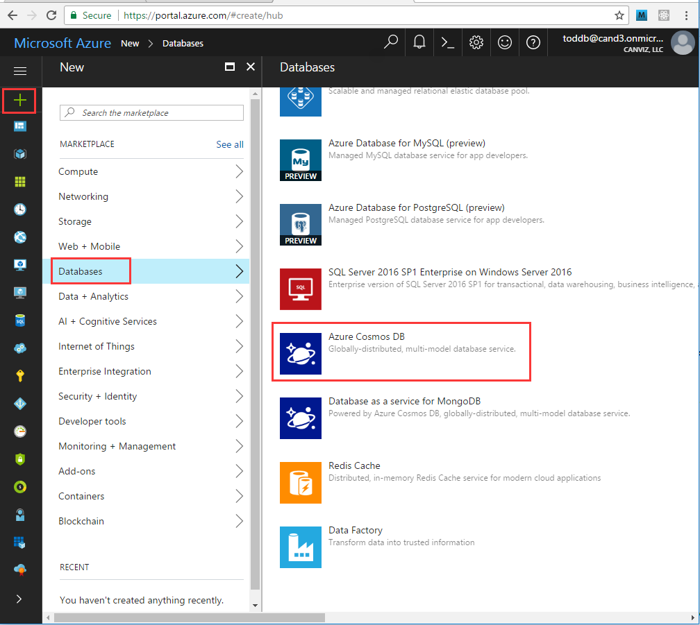

3. On the **New account** blade, specify the configuration that you want for the Azure Cosmos DB account.

4. Type **inboxsync** as **ID** value and select **SQL(DocumentDB)** API, create new a resource group or use exist group, select a location.
5. Click **Save** button.
	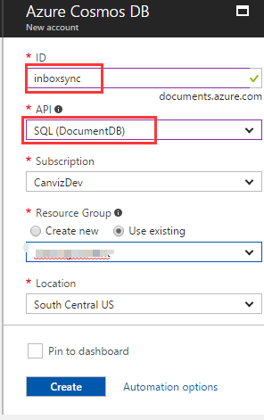

6. When the deployment is complete, navigate **inboxsync** DocumentDB account blade.
	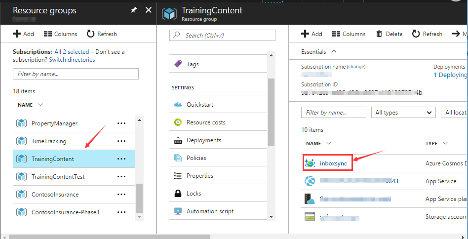

7. Click **Keys**, copy it as we will use these values in the web application we create next.
	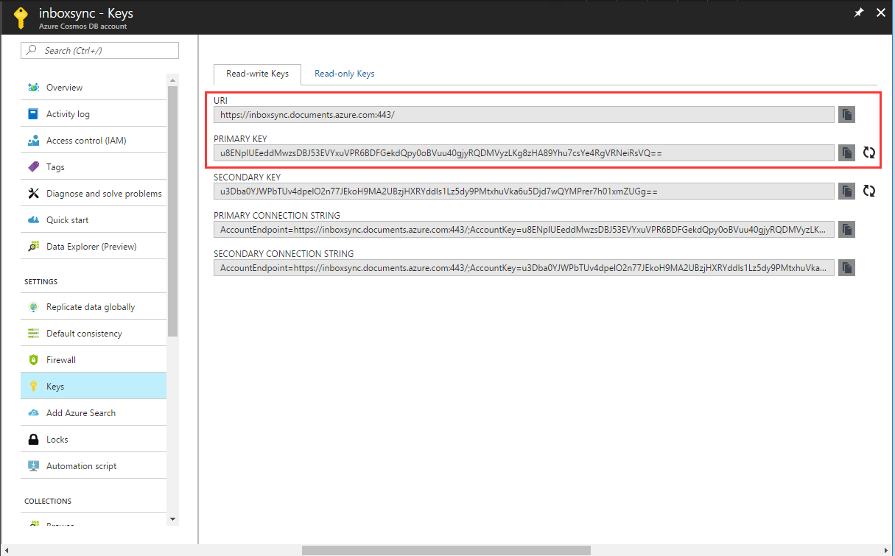

8. **Launch** Visual Studio 2017 and pen the **InboxSync** solution that created in exercise 1.

9. Install the **Microsoft Azure Cosmos DB Client Library package** and the **PagedList** library. On the **Tools** menu, choose **NuGet Package Manager**, then **Package Manager Console**. 
10. In the console, enter the following commands:
    ```powershell
	Install-Package Microsoft.Azure.DocumentDB
	Install-Package PagedList.Mvc
	```

11. Open the Web.config file of your application and add the following lines under the <AppSettings> section.
	```xml
    <add key="endpoint" value="enter the URI from the Keys blade of the Azure Portal"/>
    <add key="authKey" value="enter the PRIMARY KEY, or the SECONDARY KEY, from the Keys blade of the Azure  Portal"/>
    <add key="database" value="InboxSync" />
	```
	>Note: Now, update the values for endpoint and authKey using the Keys blade of the Azure Portal. Use the URI from the Keys blade as the value of the endpoint setting, and use the PRIMARY KEY, or SECONDARY KEY from the Keys blade as the value of the authKey setting.
	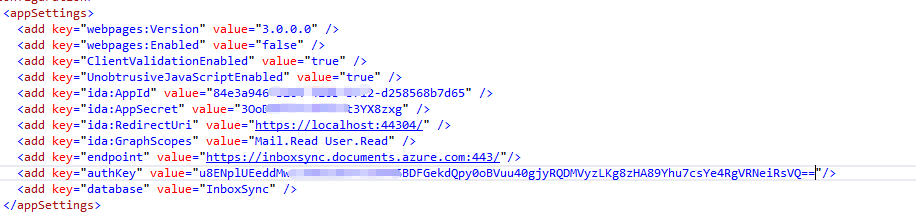

12. Right-click the **InboxSync** project and choose **Add**, then **New Folder**. Name the new folder **Models**.
13. Right-click the **Models** folder, click **Add**, and then click **Class**. The **Add New Item** dialog box appears. Name your new class **User.cs** and click **Add**.
14. Replace the entire contents of the file with the following.
	```c#
	using Newtonsoft.Json;
	namespace InboxSync.Models
	{
	    public class User
	    {
	        [JsonProperty(PropertyName = "id")]
	        public string Id { get; set; }
	        [JsonProperty(PropertyName = "email")]
	        public string Email { get; set; }
	    }
	}
	```

15. Right-click the **Models** folder, click **Add**, and then click **Class**. The **Add New Item** dialog box appears. Name your new class **Message.cs** and click **Add**.
16. Replace the entire contents of the file with the following.
	```c#
	using System;
	using System.ComponentModel.DataAnnotations;
	using Newtonsoft.Json;

	namespace InboxSync.Models
	{
	    public class EmailAddress
	    {
	        [JsonProperty(PropertyName = "name")]
	        [DisplayFormat(ConvertEmptyStringToNull = true, NullDisplayText = "*no name*")]
	        public string Name { get; set; }
	
	        [JsonProperty(PropertyName = "address")]
	        [DisplayFormat(ConvertEmptyStringToNull = true, NullDisplayText = "*no email*")]
	        public string Address { get; set; }
	    }
	    public class FromField
	    {
	        [JsonProperty(PropertyName = "emailaddress")]
	        public EmailAddress EmailAddress { get; set; }
	    }
	    public class Message
	    {
	        [JsonProperty(PropertyName = "id")]
	        public string Id { get; set; }
	        [JsonProperty(PropertyName = "owner")]
	        public string Owner { get; set; }
	        [JsonProperty(PropertyName = "outlookid")]
	        public string OutlookId { get; set; }
	        [JsonProperty(PropertyName = "bodypreview")]
	        [DisplayFormat(ConvertEmptyStringToNull = true, NullDisplayText = "*no body*")]
	        public string BodyPreview { get; set; }
	        [JsonProperty(PropertyName = "from")]
	        public FromField From { get; set; }
	        [JsonProperty(PropertyName = "isread")]
	        public bool IsRead { get; set; }
	        [JsonProperty(PropertyName = "receiveddateTime")]
	        public DateTime ReceivedDateTime { get; set; }
	        [JsonProperty(PropertyName = "subject")]
	        [DisplayFormat(ConvertEmptyStringToNull = true, NullDisplayText = "*no subject*")]
	        public string Subject { get; set; }
	    }
	}
	```
17. Right-click the **Helpers** folder and choose **Add**, then **Class**. Name the class **DocumentDBRepository** and choose **Add**. Replace the entire contents of the file with the following.
	```c#
	using Microsoft.Azure.Documents;
	using Microsoft.Azure.Documents.Client;
	using Microsoft.Azure.Documents.Linq;
	using System.Configuration;
	using System.Linq.Expressions;
	using System.Threading.Tasks;
	using System.Collections.Generic;
	using System.Linq;
	using System;

	namespace InboxSync.Helpers
	{
	    public static class DocumentDBRepository<T> where T : class
	    {
	        private static string DatabaseId = ConfigurationManager.AppSettings["database"];
	        private static string CollectionId;
	        private static DocumentClient client;
	
	        public static void InitializeUsers()
	        {
	            CollectionId = "userscollection";
	            client = new DocumentClient(new Uri(ConfigurationManager.AppSettings["endpoint"]), ConfigurationManager.AppSettings["authKey"]);
	            CreateDatabaseIfNotExistsAsync().Wait();
	            CreateCollectionIfNotExistsAsync().Wait();
	        }
	
	        public static void InitializeMessages()
	        {
	            CollectionId = "messagescollection";
	            client = new DocumentClient(new Uri(ConfigurationManager.AppSettings["endpoint"]), ConfigurationManager.AppSettings["authKey"]);
	            CreateDatabaseIfNotExistsAsync().Wait();
	            CreateCollectionIfNotExistsAsync().Wait();
	        }
	
	        private static async Task CreateDatabaseIfNotExistsAsync()
	        {
	            try
	            {
	                await client.ReadDatabaseAsync(UriFactory.CreateDatabaseUri(DatabaseId));
	            }
	            catch (DocumentClientException e)
	            {
	                if (e.StatusCode == System.Net.HttpStatusCode.NotFound)
	                {
	                    await client.CreateDatabaseAsync(new Database { Id = DatabaseId });
	                }
	                else
	                {
	                    throw;
	                }
	            }
	        }
	
	        private static async Task CreateCollectionIfNotExistsAsync()
	        {
	            try
	            {
	                await client.ReadDocumentCollectionAsync(UriFactory.CreateDocumentCollectionUri(DatabaseId, CollectionId));
	            }
	            catch (DocumentClientException e)
	            {
	                if (e.StatusCode == System.Net.HttpStatusCode.NotFound)
	                {
	                    await client.CreateDocumentCollectionAsync(
	                        UriFactory.CreateDatabaseUri(DatabaseId),
	                        new DocumentCollection { Id = CollectionId },
	                        new RequestOptions { OfferThroughput = 1000 });
	                }
	                else
	                {
	                    throw;
	                }
	            }
	        }
	    }
	}
	```

18. Copy and paste the following code snippet anywhere within the **DocumentDBRepository** class to get Items.
	```c#
    public static async Task<IEnumerable<T>> GetItemsAsync(Expression<Func<T, bool>> predicate)
    {
        try
        {
            IDocumentQuery<T> query = client.CreateDocumentQuery<T>(UriFactory.CreateDocumentCollectionUri(DatabaseId, CollectionId))
                .Where(predicate)
                .AsDocumentQuery();

            List<T> results = new List<T>();
            while (query.HasMoreResults)
            {
                results.AddRange(await query.ExecuteNextAsync<T>());
            }

            return results;
        }
        catch (DocumentClientException e)
        {
            return null;
        }
    }
	```

19. Copy and paste the following code snippet anywhere within the **DocumentDBRepository** class to create Item.
	```c#
    public static async Task<Document> CreateItemAsync(T item)
    {
        try
        {
            return await client.CreateDocumentAsync(UriFactory.CreateDocumentCollectionUri(DatabaseId, CollectionId), item);
        }
        catch (DocumentClientException e)
        {
            return null;
        }
    }
	```
20. Copy and paste the following code snippet anywhere within the **DocumentDBRepository** class to update Item.
	```c#
    public static async Task<Document> UpdateItemAsync(string id, T item)
    {
        try
        {
            return await client.ReplaceDocumentAsync(UriFactory.CreateDocumentUri(DatabaseId, CollectionId, id), item);
        }
        catch (DocumentClientException e)
        {
            return null;
        }
    }
	```
21. Copy and paste the following code snippet anywhere within the **DocumentDBRepository** class to delete Item.
	```c#
    public static async Task<Document> DeleteItemAsync(string id)
    {
        try
        {
            return await client.DeleteDocumentAsync(UriFactory.CreateDocumentUri(DatabaseId, CollectionId, id));
        }
        catch (DocumentClientException e)
        {
            return null;
        }
    }
	```
22. Open **Global.asax.cs** and add the following line to the **Application_Start** method to initialize DocumentDB collection.
	```c#
    DocumentDBRepository<User>.InitializeUsers();
    DocumentDBRepository<Message>.InitializeMessages();
	```
23. Open **Global.asax.cs** and add following using statements above the **namespace** declaration.
	```c#
	using InboxSync.Helpers;
	using InboxSync.Models;
	```
24. Press F5 to compile and launch your new application in the default browser.
   1. Click **Sign in** and log on to your Office 365 account.
   2. After you are signed in to your application, sign in to the [Azure portal](https://portal.azure.com/) and navigate **inboxsync** DocumentDB account blade.
   3. Click **Document Explorer**, you will find the **messagesCollection** and **usersCollection** has been created.
      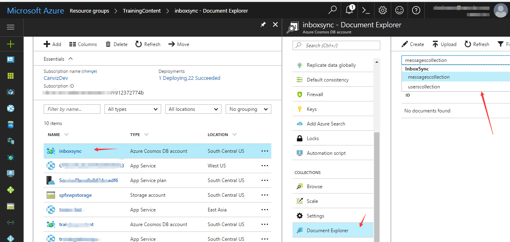
   4. Exercise 2 is complete, make sure to stop debugging and sign out before continuing to exercise 3.
  
## Exercise 3: Add message sync
Now let's add the ability to sync messages from the user's inbox into the database.

1. **Launch** Visual Studio 2017 and pen the **InboxSync** solution that created in exercise 2.
2. **Right-click** the **Helpers** folder and choose **Add**, then **Class**. Name the class **UserManager** and choose **Add**. Replace the entire contents of the file with the following.
	```c#
	using System;
	using System.Collections.Generic;
	using System.Linq;
	using System.Threading.Tasks;
	using System.Security.Claims;
	using InboxSync.Models;
	using InboxSync.Services;
	
	namespace InboxSync.Helpers
	{
	    public class UserManager
	    {
	        public static async Task<User> AddOrUpdateCurrentUser()
	        {
	            string email = ClaimsPrincipal.Current.FindFirst("preferred_username")?.Value;
	            var users = await DocumentDBRepository<User>.GetItemsAsync(u => u.Email.Equals(email));
	            var user = users.FirstOrDefault();
	
	            if (null != user)
	            {
	                var result = await DocumentDBRepository<User>.UpdateItemAsync(user.Id, user);
	            }
	            else
	            {
	                user = new User()
	                {
	                    Id = Guid.NewGuid().ToString(),
	                    Email = email
	                };
	                await DocumentDBRepository<User>.CreateItemAsync(user);
	            }
	
	            return user;
	        }
	        public static async Task<long> GetUsersMessageCount(string userId)
	        {
	            var messageCollection = await DocumentDBRepository<Message>.GetItemsAsync(message => message.Owner.Equals(userId));
	
	            return messageCollection.Count();
	        }
	        public static async Task<List<Message>> GetUsersMessages(string userId, int pageSize, int pageNum)
	        {
	            var messageCollection = await DocumentDBRepository<Message>.GetItemsAsync(message => message.Owner.Equals(userId));
	            return messageCollection.OrderByDescending(x => x.ReceivedDateTime).Skip((pageNum - 1) * pageSize).Take(pageSize).ToList<Message>();
	        }
	
	        public static async Task SyncUsersInbox(User user)
	        {
	            GraphService graphService = new GraphService();
	            var graphMessages = await graphService.SyncInbox();
	           await ParseSyncItems(user.Id , graphMessages);
	        }
	
	        private static async Task ParseSyncItems(string userId, List<Microsoft.Graph.Message> syncItems)
	        {
	            List<Message> newDocumentDBMessages = new List<Message>();
	
	            foreach (Microsoft.Graph.Message syncItem in syncItems)
	            {
	                var messageCollection = await DocumentDBRepository<Message>.GetItemsAsync(message => message.OutlookId.Equals(syncItem.Id));
	                var existingMsg = messageCollection.FirstOrDefault();
	                if (null != existingMsg)
	                {
	                    bool update = (syncItem.IsRead != existingMsg.IsRead);
	                    if (update)
	                    {
	                        existingMsg.IsRead = (bool)syncItem.IsRead;
	                        var updateResult = await DocumentDBRepository<Message>.UpdateItemAsync(existingMsg.Id, existingMsg);
	                    }
	                }
	                else
	                {
	                    Message newMessage = new Message()
	                    {
	                        Id = Guid.NewGuid().ToString(),
	                        BodyPreview = syncItem.BodyPreview,
	
	                        From = new FromField
	                        {
	                            EmailAddress = new EmailAddress()
	                            {
	                                Name = syncItem.From.EmailAddress.Name,
	                                Address = syncItem.From.EmailAddress.Address
	                            }
	                        },
	                        IsRead = (bool)syncItem.IsRead,
	                        OutlookId = syncItem.Id,
	                        Owner = userId,
	                        ReceivedDateTime = syncItem.ReceivedDateTime == null? DateTime.Now: ((DateTimeOffset)syncItem.ReceivedDateTime).DateTime,
	                        Subject = syncItem.Subject
	                    };
	
	                    newDocumentDBMessages.Add(newMessage);
	                }
	            }
	
	            if (newDocumentDBMessages.Count > 0)
	            {
	                foreach (Message newdocumentmessage in newDocumentDBMessages)
	                {
	                    await DocumentDBRepository<Message>.CreateItemAsync(newdocumentmessage);
	                }
	            }
	        }
	
	    }
	}
	```
3. Open **GraphService.cs** file and replace the entire contents of the file with the following.
	```c#
	using Microsoft.Graph;
	using System;
	using System.Collections.Generic;
	using System.Threading.Tasks;
	using InboxSync.Helpers;
	
	namespace InboxSync.Services
	{
	    public class GraphService
	    {
	        public async Task<List<Message>> SyncInbox()
	        {
	            GraphServiceClient graphClient = SDKHelper.GetAuthenticatedClient();
	            List<Message> messagesCollection = new List<Message>();
	            IMailFolderMessagesCollectionRequest nextRequest = null;
	            do
	            {
	                IMailFolderMessagesCollectionPage messagesCollectionPage;
	                if (nextRequest != null)
	                {
	                    messagesCollectionPage = await nextRequest.GetAsync();
	                }
	                else
	                {
	                    messagesCollectionPage = await graphClient.Me.MailFolders.Inbox.Messages.Request()
	                                                              .Select("Subject,ReceivedDateTime,From,BodyPreview,IsRead")
	                                                              .OrderBy("ReceivedDateTime+desc")
	                                                              .Filter("ReceivedDateTime ge " + DateTime.Now.AddDays(-7).ToString("yyyy-MM-ddTHH:mm:ssZ")).GetAsync();
	                }
	                messagesCollection.AddRange(messagesCollectionPage.CurrentPage);
	                if (messagesCollectionPage.CurrentPage.Count == 0)
	                {
	                    nextRequest = null;
	                }
	                else
	                {
	                    nextRequest = messagesCollectionPage.NextPageRequest;
	                }
	            }
	            while (nextRequest != null);
	            return messagesCollection;
	        }
	    }
	}
	```
4. **Right-click** the **Controllers** folder, click **Add**, and then click **Controller**. The **Add Scaffold** dialog box appears. Select **MVC 5 Controller - Empty** and then click **Add**.
5. **Name** your new Controller, **MailController**.
6. **Replace** the entire contents of the file with the following
	  ```c#
	using System.Threading.Tasks;
	using System.Web.Mvc;
	using PagedList;
	using InboxSync.Models;
	using InboxSync.Helpers;
	
	namespace InboxSync.Controllers
	{
	    public class MailController : Controller
	    {
	        [Authorize]
	        public async Task<ActionResult> Inbox(int? page)
	        {
	            var user = await UserManager.AddOrUpdateCurrentUser();
	
	            int pageSize = 20;
	            int pageNumber = (page ?? 1);
	            long totalCount = await UserManager.GetUsersMessageCount(user.Id);
	
	            var messages = await UserManager.GetUsersMessages(user.Id, pageSize, pageNumber);
	            return View(new StaticPagedList<Message>(messages, pageNumber, pageSize, (int)totalCount));
	
	        }
	        [Authorize]
	        [HttpPost]
	        public async Task<ActionResult> SyncInbox()
	        {
	            var user = await UserManager.AddOrUpdateCurrentUser();
	            try
	            {
	                await UserManager.SyncUsersInbox(user);
	            }
	            catch (Microsoft.Graph.ServiceException se)
	            {
	                if (se.Error.Message == "Error_AuthChallengeNeeded") return new EmptyResult();
	                return RedirectToAction("Index", "Error", new { message = se.Error.Message + Request.RawUrl + ": " + se.Error.Message });
	            }
	
	            return RedirectToAction("Inbox");
	        }
	    }
	}
	  ```
7. In **Solution Explorer**, right-click the **Mail** folder in **Views** folder, click **Add**, and then click **MVC 5 View Page(Razor)**.
8. Type **Inbox** as view Item Name.
9. **Replace** the entire contents of the file with the following
	```aspx
	@model PagedList.IPagedList<InboxSync.Models.Message>
	@using PagedList.Mvc;
	
	<link href="~/Content/PagedList.css" rel="stylesheet" type="text/css" />
	
	@{
	    ViewBag.Title = "Inbox";
	}
	
	<h2>Inbox</h2>
	<p>
	    @using (Html.BeginForm("SyncInbox", "Mail", FormMethod.Post, new { @class = "sync-form" }))
	    {
	        <input type="submit" value="Sync Now" class="btn btn-primary btn-sm" />
	    }
	</p>
	<table class="table">
	    <tr>
	        <th>
	            From
	        </th>
	        <th>
	            Subject
	        </th>
	        <th>
	            Body Preview
	        </th>
	        <th>
	            Received
	        </th>
	        <th>
	            Is Read?
	        </th>
	    </tr>
	
	    @foreach (var item in Model)
	    {
	        <tr>
	            <td>
	                @Html.DisplayFor(modelItem => item.From.EmailAddress.Name) <strong>&lt;</strong>@Html.DisplayFor(modelItem => item.From.EmailAddress.Address)<strong>&gt;</strong>
	            </td>
	            <td>
	                @Html.DisplayFor(modelItem => item.Subject)
	            </td>
	            <td>
	                @Html.DisplayFor(modelItem => item.BodyPreview)
	            </td>
	            <td>
	                @Html.DisplayFor(modelItem => item.ReceivedDateTime)
	            </td>
	            <td>
	                @Html.DisplayFor(modelItem => item.IsRead)
	            </td>
	        </tr>
	    }
	
	</table>
	<br />
	Page @(Model.PageCount < Model.PageNumber ? 0 : Model.PageNumber) of @Model.PageCount
	
	@Html.PagedListPager(Model, page => Url.Action("Inbox", new { page }))
	```
10. Expand the **Views/Shared** folder in the project. Open the **_Layout.cshtml** file found in the **Views/Shared** folder.
  1. Locate the part of the file that includes a few links at the top of the page. It should look similar to the following code:
    ```aspx
    <ul class="nav navbar-nav">
        <li>@Html.ActionLink("Home", "Index", "Home")</li>
        <li>@Html.ActionLink("About", "About", "Home")</li>
        <li>@Html.ActionLink("Contact", "Contact", "Home")</li>
    </ul>
    ```
  1. Update that navigation to add the "Local Inbox" Link and connect this to the controller you just created.
    ```aspx
    <ul class="nav navbar-nav">
        <li>@Html.ActionLink("Home", "Index", "Home")</li>
        <li>@Html.ActionLink("About", "About", "Home")</li>
        <li>@Html.ActionLink("Contact", "Contact", "Home")</li>
        <li>@Html.ActionLink("Local Inbox", "Inbox", "Mail")</li>
    </ul>
    ```

11. Press F5 to compile and launch your new application in the default browser.
   1. click **Sign in** and log on to your Office 365 account.
   2. After you are signed in to your application, choose on the **Local Inbox** link in the top navigation bar.
     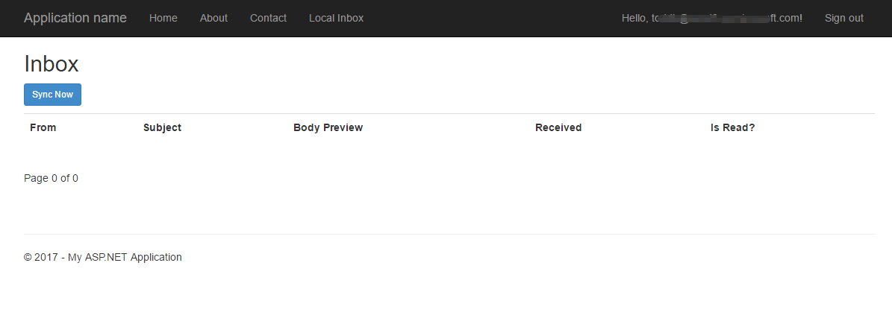
   3. Choose the **Sync Now** button to sync your inbox, the messages that your received in last 7 days will be displayed on the page.
    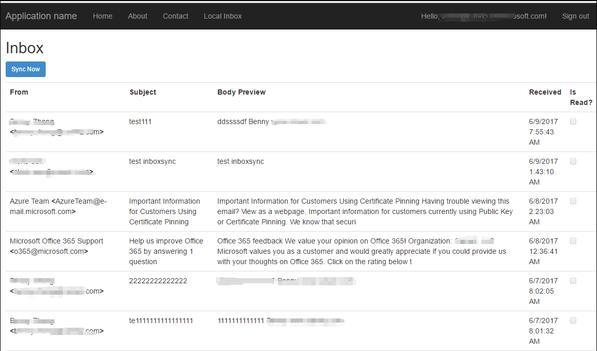


Congratulations! In this section you have created an MVC application that uses the Microsoft Graph API to sync a user's inbox to a DocumentDB.
