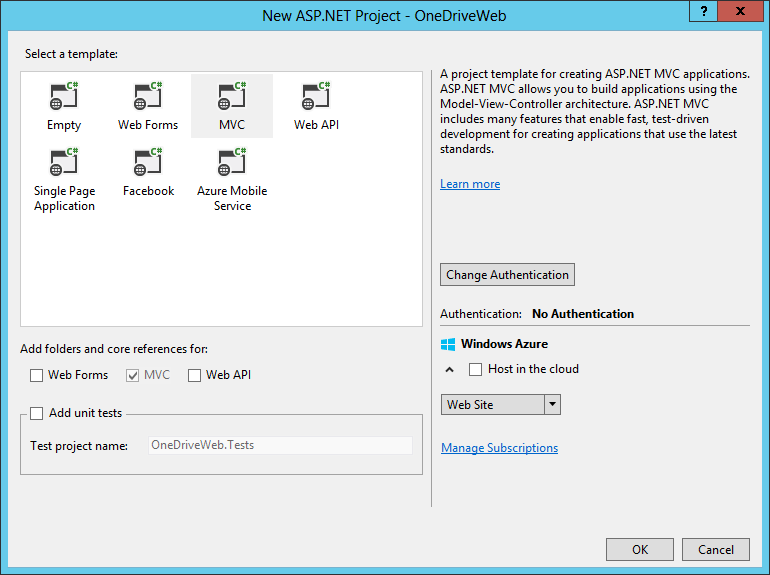
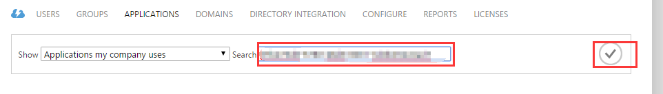
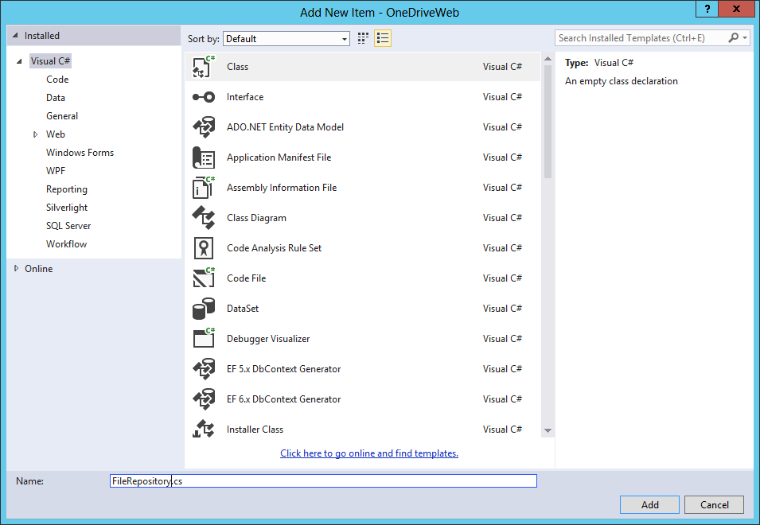
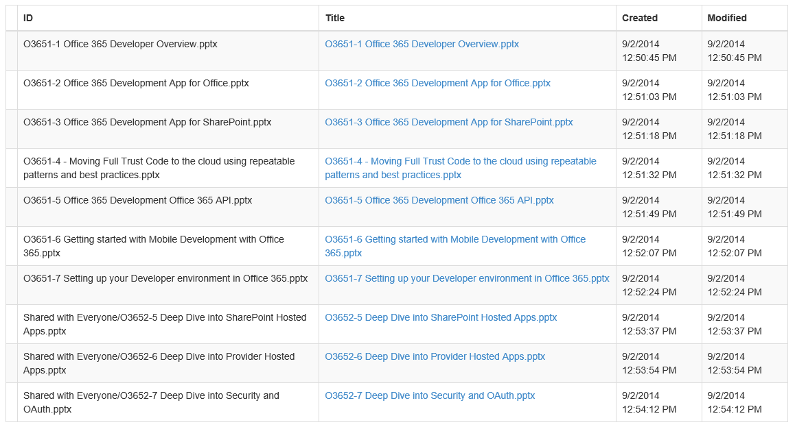

# Office 365 APIs for OneDrive for Business
In this lab, you will use the Office 365 APIs for OneDrive for Business as part of an ASP.NET MVC5 application.

## Prerequisites
1. You must have an Office 365 tenant and Windows Azure subscription to complete this lab. If you do not have one, the lab for **O3651-7 Setting up your Developer environment in Office 365** shows you how to obtain a trial.
1. You must have the Office 365 API Tools version 1.3.41104.1 installed in Visual Studio 2013.

## Exercise 1: Create an ASP.NET MVC5 Application
In this exercise, you will create the ASP.NET MVC5 application and register it with Azure active Directory.

1. Create the new solution in Visual Studio 2013:
  1. Launch **Visual Studio 2013** as administrator. 
  1. In Visual Studio select **File/New/Project**.
  1. In the **New Project** dialog:
    1. Select **Templates/Visual C#/Web**.
    1. Click **ASP.NET Web Application**.
    1. Name the new project **OneDriveWeb**.
    1. Click **OK**.

       

  1. In the **New ASP.NET Project** dialog:
    1. Click **MVC**.
    1. Click **Change Authentication**.
    1. Select **No Authentication**.
    1. Click **OK**.

       

    1. Click **OK**.

       

1. Update the web project to use SSL by default:
  1. In the **Solution Explorer** tool window, select the project and look at the **Properties** tool window. 
  1. Change the property **SSL Enabled** to **TRUE**.
  1. Copy the **SSL URL** property to the clipboard for use in the next step.
  1. Save your changes.

    
    > It is important to do this now because in the next step when you create the application in Azure AD, you want the reply URL to use HTTPS. If you did not do this now, you would have to manually make the changes the Visual Studio wizard is going to do for you in creating the app.
    
1. Configure the project to always go to the homepage of the web application when debugging:
  1. In the **Solution Explorer** tool window & select **Properties**.
  1. Select the **Web** tab in the left margin.
  1. Find the section **Start Action**.
  1. Click the radio button **Start URL** and enter the SSL URL of the web project that you copied from the previous step.

1. Connect the OneDrive for Business service:
  1. In the **Solution Explorer**, right click the **OneDriveWeb** project and select **Add/Connected Service**.
  1. In the **Services Manager** dialog:
    1. Click **Register Your App**.
    1. When prompted, login with your **Organizational Account**.
    1. Click **Users and Groups**.
      1. Click **Permissions**.      
      1. Check **Enable sign-on and read users' profiles**.
      1. Click **Apply**.

        

    1. Click **My Files**.
      1. Click **Permissions**.
      1. Check **Edit or Delete User's Files**.
      1. Check **Read User's Files**.
      1. Click **Apply**.

        

    1. Click **Sites**.
      1. Click **Permissions**.
      1. Check **Create or Delete items and lists in all site collections**.
      1. Check **Edit or Delete items in all site collections**.
      1. Check **Read items in all site collections**.
      1. Click **Apply**.

         

    1. Click **OK**.

       

## Exercise 2: Configure Web Application to use Azure AD and OWIN
In this exercise you will take the ASP.NET MVC web application you created in the previous exercise and configure it to use Azure AD & OpenID Connect for user & app authentication. You will do this by utilizing the OWIN framework. Once authenticated, you can use the access token returned by Azure AD to access the Office 365 APIs.

1. Obtain and store the Azure AD tenant ID in the `web.config`.
  1. Browse to the [Azure Management Portal](https://manage.windowsazure.com) and sign in with your **Organizational Account**.
  1. In the left-hand navigation, click **Active Directory**.
  1. Select the directory you share with your Office 365 subscription.
  1. Select the application you created for this lab. This is the name of the application in the **App Properties** dialog when you were adding the **Connected Service** in the last exercise.
  1. Select the **Quick Start** page for the in the top navigation... that's the left-most menu item that looks like a lightning bolt in a cloud:

    
 
  1. On the Quick Start page, expand the **Get Started** / **Enable Users to Sign On**. Locate the field **Federation Metadata Document URL**. Within that field value you will see a GUID immediately after the `login.windows.net` part of the URL. Copy just the GUID value to the clipboard.

    

  1. Open the `web.config` file in the project.
  1. Add the following node to the `<appSettings>` section, setting the value equal to the **directory tenant ID** you acquired in the previous step:

    ````xml
    <add key="ida:TenantId" value="######-####-####-####-############"/>
    ````

1. Now you need a few NuGet packages to enable OWIN OpenID Connect authentication & to create a secure token cache (using Entity Framework) in the application:
  1. Open the Package Manager Console: **View/Other Windows/Package Manager Console**.
  1. Enter each line below in the console, one at a time, pressing **ENTER** after each one. NuGet will install the package and all dependent packages:

    ````powershell
    PM> Install-Package -Id EntityFramework
    PM> Install-Package -Id Microsoft.IdentityModel.Clients.ActiveDirectory
    PM> Install-Package -Id Microsoft.Owin.Host.SystemWeb
    PM> Install-Package -Id Microsoft.Owin.Security.Cookies
    PM> Install-Package -Id Microsoft.Owin.Security.OpenIdConnect
    ````

1. Add a new model that will be used by our persistent token cache:
  1. Right-click **Models** folder in the project and select **Add/Class**.
  1. Name the class **PerWebUserCache.cs**.
  1. When the class has been created, change its accessibility to public:
    ````c#
    public class PerWebUserCache {}
    ````

  1. add the following code to the class:

    ````c#
    [Key]
    public int EntryId { get; set; }
    public string webUserUniqueId { get; set; }
    public byte[] cacheBits { get; set; }
    public DateTime LastWrite { get; set; }
    ````

  1. At the top of the file, add the following `using` statement:

    ````c#
    using System.ComponentModel.DataAnnotations;
    ````

1. Add a new persistent data store that will be used for the token cache:
  1. Right-click the project and select **Add/New Folder**.
  1. Name the folder **Data**.
  1. Locate the [Lab Files](Lab Files) folder provided with this lab & find two files: `OneDriveWebContext.cs` & `OneDriveWebInitializer.cs`. Copy these two files to the **Data** folder you just created.

1. Add a token cache that leverages Entity Framework to store the user specific tokens in persistent storage:
  1. Right-click the project and select **Add/New Folder**.
  2. Name the folder **Utils**.
  1. Locate the [Lab Files](Lab Files) folder provided with this lab & find the file `EDADALTokenCache.cs`. Copy that file to the **Utils** folder.
  
    > Take a moment to examine this file. It uses the `DbContext` you added in the previous step to implement a `TokenCache` which you will use in a moment. This will store the token received from a successful authentication in a persistent store.

1. Add a helper class that will be used to harvest settings out of the `web.config` and create the necessary strings that will be used for authentication:
  1. Locate the [Lab Files](Lab Files) folder provided with this lab & find the file `SettingsHelper.cs`. Copy that file to the **Utils** folder.

1. Configure the app to run startup code when the OWIN libraries startup:
  1. Right-click the project and select **Add/Class**.
  1. Name the class **Startup.cs**.
  1. Add the following `using` statements after the existing `using` statements:

    ````c#
    using Owin;
    using Microsoft.Owin;
    ````

  1. Add the following assembly directive to call the `Startup.Configuration()` method when OWIN starts up. Note that you will only point to the class:

    ````c#
    [assembly:OwinStartup(typeof(OneDriveWeb.Startup))]
    ````

  1. Update the signature of the `Startup` class to be a partial class as you will create another in the next step. Do this by adding the `partial` keyword after the `public` statement so it looks like the following:

    ````c#
    public partial class Startup {}
    ````

  1. Add the following `Confguration()` to the `Startup` class. This calls a method you will create in a moment:

    ````c#
    public void Configuration(IAppBuilder app)
    {
      ConfigureAuth(app);
    }
    ````

  1. Save your changes.
1. Create an authentication process when a user hits the website:
  1. Right-click the **App_Start** folder and select **Add/Class**.
  1. Name the class **Startup.Auth.cs**.
  1. When the file opens make the following two changes:
    1. Modify the namespace to just be `OneDriveWeb`.
    1. Modify the class declaration to be a `partial` class named `Startup` so it looks like the following:

      ````c#
      public partial class Startup {}
      ````

  1. Add the following `using` statements after the existing `using` statements:

    ````c#
    using Microsoft.IdentityModel.Clients.ActiveDirectory;
    using Microsoft.Owin.Security;
    using Microsoft.Owin.Security.Cookies;
    using Microsoft.Owin.Security.OpenIdConnect;
    using Owin;
    using System.Web;
    using System.Configuration;
    using System.Threading.Tasks;
    using OneDriveWeb.Utils;
    ````

  1. Add the following method to the `Startup` class:

    ````c#
    public void ConfigureAuth(IAppBuilder app) {}
    ````

  1. Configure the authentication type and settings for the app:

    ````c#
    app.SetDefaultSignInAsAuthenticationType(CookieAuthenticationDefaults.AuthenticationType);
    app.UseCookieAuthentication(new CookieAuthenticationOptions());
    ````

  1. Now configure the OWIN authentication process, force the user to go through the login process and collect the result returned from Azure AD:

    ````c#
    app.UseOpenIdConnectAuthentication(new OpenIdConnectAuthenticationOptions {
      ClientId = SettingsHelper.ClientId,
      Authority = SettingsHelper.AzureADAuthority,
      Notifications = new OpenIdConnectAuthenticationNotifications() {
        // when an auth code is received...
        AuthorizationCodeReceived = (context) => {
          // get the OpenID Connect code passed from Azure AD on successful auth
          string code = context.Code;

          // create the app credentials & get reference to the user
          ClientCredential creds = new ClientCredential(SettingsHelper.ClientId, SettingsHelper.ClientSecret);
          string userObjectId = context.AuthenticationTicket.Identity.FindFirst(System.IdentityModel.Claims.ClaimTypes.NameIdentifier).Value;

          // use the OpenID Connect code to obtain access token & refresh token...
          //  save those in a persistent store...
          EFADALTokenCache sampleCache = new EFADALTokenCache(userObjectId);
          AuthenticationContext authContext = new AuthenticationContext(SettingsHelper.AzureADAuthority, sampleCache);

          // obtain access token for the AzureAD graph
          Uri redirectUri = new Uri(HttpContext.Current.Request.Url.GetLeftPart(UriPartial.Path));
          AuthenticationResult authResult = authContext.AcquireTokenByAuthorizationCode(code, redirectUri, creds, SettingsHelper.AzureAdGraphResourceId);

          // successful auth
          return Task.FromResult(0);
        },
        AuthenticationFailed = (context) =>
        {
          context.HandleResponse();
          return Task.FromResult(0);
        }
      },
      TokenValidationParameters = new System.IdentityModel.Tokens.TokenValidationParameters
      {
        ValidateIssuer = false
      }
    });
    ````

  1. Save your changes.
1. With the authentication process wired up into the OWIN startup process, now implement a login controller to provide sign in & sign out functionality:
  1. Right-click the **Controllers** folder and select **Add/Controller**.
    1. In the **Add Scaffold** dialog, select **MVC 4 Controller - Empty**.
    1. Click **Add**.
    1. When prompted for a name, enter **AccountController**.
    1. Click **Add**.
  1. Within the **AccountController** file, add the following `using` statements to the top of the file:
  
    ````c#
    using OneDriveWeb.Utils;
    using Microsoft.IdentityModel.Clients.ActiveDirectory;
    using Microsoft.Owin.Security;
    using Microsoft.Owin.Security.Cookies;
    using Microsoft.Owin.Security.OpenIdConnect;
    using System.Security.Claims;
    ````

  1. Delete the default `Index()` method from the `AcountController` class.
  1. Add a new function to provide a sign in route. This will simply initiate a login challenge using the OWIN framework that will take the user to the Azure AD login page. When this runs, if the user has not already given the app consent to access their Office 365 data, they will be prompted to grant the app consent at this time.

    ````c#
    public void SignIn() {
      if (!Request.IsAuthenticated) {
        HttpContext.GetOwinContext().Authentication.Challenge(new AuthenticationProperties { RedirectUri = "/" }, OpenIdConnectAuthenticationDefaults.AuthenticationType);
      }
    }
    ````

  1. Add a new function to provide a sign out route. This will log the user out of the site & clear the local cache of tokes: 

    ````c#
    public void SignOut() {
      // Remove all cache entries for this user and send an OpenID Connect sign-out request.
      string usrObjectId = ClaimsPrincipal.Current.FindFirst(SettingsHelper.ClaimTypeObjectIdentifier).Value;
      AuthenticationContext authContext = new AuthenticationContext(SettingsHelper.AzureADAuthority, new EFADALTokenCache(usrObjectId));
      authContext.TokenCache.Clear();

      HttpContext.GetOwinContext().Authentication.SignOut(
          OpenIdConnectAuthenticationDefaults.AuthenticationType, CookieAuthenticationDefaults.AuthenticationType);
    }
    ````

  1. Add a pair of functions to handle requesting consent for the application.

    ````c#
    public ActionResult ConsentApp() {
      string strResource = Request.QueryString["resource"];
      string strRedirectController = Request.QueryString["redirect"];

      string authorizationRequest = String.Format(
          "{0}oauth2/authorize?response_type=code&client_id={1}&resource={2}&redirect_uri={3}",
              Uri.EscapeDataString(SettingsHelper.AzureADAuthority),
              Uri.EscapeDataString(SettingsHelper.ClientId),
              Uri.EscapeDataString(strResource),
              Uri.EscapeDataString(String.Format("{0}/{1}", this.Request.Url.GetLeftPart(UriPartial.Authority), strRedirectController))
              );

      return new RedirectResult(authorizationRequest);
    }

    public ActionResult AdminConsentApp() {
      string strResource = Request.QueryString["resource"];
      string strRedirectController = Request.QueryString["redirect"];

      string authorizationRequest = String.Format(
          "{0}oauth2/authorize?response_type=code&client_id={1}&resource={2}&redirect_uri={3}&prompt={4}",
              Uri.EscapeDataString(SettingsHelper.AzureADAuthority),
              Uri.EscapeDataString(SettingsHelper.ClientId),
              Uri.EscapeDataString(strResource),
              Uri.EscapeDataString(String.Format("{0}/{1}", this.Request.Url.GetLeftPart(UriPartial.Authority), strRedirectController)),
              Uri.EscapeDataString("admin_consent")
              );

      return new RedirectResult(authorizationRequest);
    }
    ````

  1. Add one more function to the `AccountController` class to refresh the session and reissue the OWIN authentication challenge:
      
    ````c#
    public void RefreshSession() {
      string strRedirectController = Request.QueryString["redirect"];

      HttpContext.GetOwinContext().Authentication.Challenge(new AuthenticationProperties { RedirectUri = String.Format("/{0}", strRedirectController) }, OpenIdConnectAuthenticationDefaults.AuthenticationType);
    }
    ````

  1. Now that the **AccountController** is setup, the last step is to implement the user interface components to provide sign in and sign out capabilities.
    1. Locate the **Views/Shared** folder in the project.
    1. Right-click the folder and select **Add/View**.
    1. Complete the **Add View** dialog as shown in the following picture, then click **Add**:
      
      

    1. Add the following code to the **_LoginPartial.cshtml** file:

      ````asp
      @if (Request.IsAuthenticated) {
        <text>
          <ul class="nav navbar-nav navbar-right">
            <li class="navbar-text">
              Hello, @User.Identity.Name!
            </li>
            <li>
              @Html.ActionLink("Sign out", "SignOut", "Account")
            </li>
          </ul>
        </text>
      } else {
        <ul class="nav navbar-nav navbar-right">
          <li>@Html.ActionLink("Sign in", "SignIn", "Account", routeValues: null, htmlAttributes: new { id = "loginLink" })</li>
        </ul>
      }
      ````

    1. Open the **_Layout.cshtml** file found in the **Views/Shared** folder.
      1. Locate the part of the file that includes a few links at the top of the page... it should look similar to the following code:
      
        ````asp
        <div class="navbar-collapse collapse">
          <ul class="nav navbar-nav">
            <li>@Html.ActionLink("Home", "Index", "Home")</li>
            <li>@Html.ActionLink("About", "About", "Home")</li>
            <li>@Html.ActionLink("Contact", "Contact", "Home")</li>
          </ul>
        </div>
        ````

      1. Update that navigation to have a new link (the **Files (SDK)** link added below) as well as a reference to the login control you just created:

        ````asp
        <div class="navbar-collapse collapse">
          <ul class="nav navbar-nav">
            <li>@Html.ActionLink("Home", "Index", "Home")</li>
            <li>@Html.ActionLink("About", "About", "Home")</li>
            <li>@Html.ActionLink("Contact", "Contact", "Home")</li>
            <li>@Html.ActionLink("Files (SDK)", "Index", "Home")</li>
          </ul>
          @Html.Partial("_LoginPartial")
        </div>
        ````

        > The **Files (SDK)** link will not work yet... you will add that in the next exercise.

1. At this point you can test the authentication flow for your application.
  1. In Visual Studio, press **F5**. The browser will automatically launch taking you to the HTTPS start page for the web application.
  1. To sign in, click the **Sign In** link the upper-right corner.
  1. Login using your **Organizational Account**.
  1. Upon a successful login, since this will be the first time you have logged into this app, Azure AD will present you with the common consent dialog that looks similar to the following image:

    

  1. Click **OK** to approve the app's permission request on your data in Office 365.
  1. You will then be redirected back to your web application. However notice in the upper right corner, it now shows your email address & the **Sign Out** link.

Congratulations... at this point your app is configured with Azure AD and leverages OpenID Connect and OWIN to facilitate the authentication process!

## Exercise 3: Code the Files Native .NET SDK
In this exercise, you will create a repository object for wrapping CRUD operations associated with the Files native .NET SDK.

1. In the **Solution Explorer**, locate the **Models** folder in the **OneDriveWeb** project.
2. Right-click the **Models** folder and select **Add/Class**.
1. In the **Add New Item** dialog, name the new class **FileRepository.cs**.
1. Click **Add**.

  

1. **Add** the following references to the top of the `FileRepository` class.

  ````c#
  using Microsoft.IdentityModel.Clients.ActiveDirectory;
  using Microsoft.Office365.Discovery;
  using Microsoft.Office365.SharePoint.CoreServices;
  using Microsoft.Office365.SharePoint.FileServices;
  using OneDriveWeb.Utils;
  using System.Security.Claims;
  using System.Threading.Tasks;
  ````

1. **Add** a method named `EnsureClientCreated()` to the `FileRepository` class with the following implementation to create and return an **SharePointClient** object.
    
  ````c#
  private async Task<SharePointClient> EnsureClientCreated() {
    // fetch from stuff user claims
    var signInUserId = ClaimsPrincipal.Current.FindFirst(ClaimTypes.NameIdentifier).Value;
    var userObjectId = ClaimsPrincipal.Current.FindFirst(SettingsHelper.ClaimTypeObjectIdentifier).Value;

    // discover contact endpoint
    var clientCredential = new ClientCredential(SettingsHelper.ClientId, SettingsHelper.ClientSecret);
    var userIdentifier = new UserIdentifier(userObjectId, UserIdentifierType.UniqueId);

    // create auth context
    AuthenticationContext authContext = new AuthenticationContext(SettingsHelper.AzureADAuthority, new EFADALTokenCache(signInUserId));

    // create O365 discovery client 
    DiscoveryClient discovery = new DiscoveryClient(new Uri(SettingsHelper.O365DiscoveryServiceEndpoint),
      async () => {
        var authResult = await authContext.AcquireTokenSilentAsync(SettingsHelper.O365DiscoveryResourceId, clientCredential, userIdentifier);

        return authResult.AccessToken;
      });

    // query discovery service for endpoint for 'calendar' endpoint
    CapabilityDiscoveryResult dcr = await discovery.DiscoverCapabilityAsync("MyFiles");

    // create an OutlookServicesclient
    return new SharePointClient(dcr.ServiceEndpointUri,
      async () => {
        var authResult =
          await
            authContext.AcquireTokenSilentAsync(dcr.ServiceResourceId, clientCredential, userIdentifier);
        return authResult.AccessToken;
      });
  }  
  ````

1. **Add** the following code to read a page of files.

  ````c#
  public async Task<IEnumerable<IITem>> GetMyFiles(int pageIndex, int pageSize)
  {
      var client = await EnsureClientCreated();

      var filesResults = await client.Files.ExecuteAsync();
      return filesResults.CurrentPage.OrderBy(e => e.Name).Skip(pageIndex * pageSize).Take(pageSize);
  }
  ````

1. **Add** the following code to upload a file.

  ````c#
  public async Task<File> UploadFile(System.IO.Stream filestream, string filename){
    var client = await EnsureClientCreated();

    File newFile = new File {
      Name = filename
    };

    // create the entry for the file
    await client.Files.AddItemAsync(newFile);
    // upload the file
    await client.Files.GetById(newFile.Id).ToFile().UploadAsync(filestream);

    return newFile;
  }
  ````

1. **Add** the following code to delete a file.

  ````c#
  public async Task DeleteFile(string id) {
    var client = await EnsureClientCreated();

    IFile file = await client.Files.GetById(id).ToFile().ExecuteAsync();
    await file.DeleteAsync();
  }
  ````

### Code the MVC Application
Now you will code the MVC application to allow navigating the OneDrive for Business file collection using the native .NET SDK.

1. Right-click the **Controllers** folder and select **Add/Controller**.
  1. In the **Add Scaffold** dialog, select **MVC 5 Controller - Empty** and click **Add**.
  1. In the **Add Controller** dialog, give the controller the name **FilesController** and click **Add**.
1. **Add** the following references to the top of the file.

  ````c#
  using OneDriveWeb.Models;
  using System.Threading.Tasks;
  ````

1. **Replace** the **Index** method with the following code to read files.

  ````c#
  [Authorize]
  public async Task<ActionResult> Index(int? pageIndex, int? pageSize) {

    FileRepository repository = new FileRepository();

    // setup paging defaults if not provided
    pageIndex = pageIndex ?? 0;
    pageSize = pageSize ?? 10;

    // setup paging for the IU
    ViewBag.PageIndex = (int)pageIndex;
    ViewBag.PageSize = (int)pageSize;

    var myFiles = await repository.GetMyFiles((int)pageIndex, (int)pageSize);
    var results = myFiles.OrderBy(f => f.Name);

    return View(results);
  }
  ````

1. Within the `FilesController` class, right click the `View()` at the end of the `Index()` method and select **Add View**.
1. Within the **Add View** dialog, set the following values:
  1. View Name: **Index**.
  1. Template: **Empty (without model)**.
    
    > Leave all other fields blank & unchecked.
  
  1. Click **Add**.
1. **Replace** all of the code in the file with the following:

  ````asp
  @model IEnumerable<Microsoft.Office365.SharePoint.FileServices.IItem>

  @{ ViewBag.Title = "My Files"; }

  <h2>My Files</h2>

  <div class="row" style="margin-top:50px;">
    <div class="col-sm-12">
      <div class="table-responsive">
        <table id="filesTable" class="table table-striped table-bordered">
          <thead>
            <tr>
              <th></th>
              <th>ID</th>
              <th>Title</th>
              <th>Created</th>
              <th>Modified</th>
            </tr>
          </thead>
          <tbody>
            @foreach (var file in Model) {
              <tr>
                <td>
                  @{
                    //Place delete control here
                  }
                </td>
                <td>
                  @file.Id
                </td>
                <td>
                  <a href="@file.WebUrl">@file.Name</a>
                </td>
                <td>
                  @file.DateTimeCreated
                </td>
                <td>
                  @file.DateTimeLastModified
                </td>
              </tr>
            }
          </tbody>
        </table>
      </div>
      <div class="btn btn-group-sm">
        @{
          //Place Paging controls here
        }
      </div>
    </div>
  </div>
  ````

1. Open a browser and navigate to `https://[tenant].onedrive.com`.
1. Make sure that you have some test files available in the library.
1. In **Visual Studio**, hit **F5** to begin debugging.
1. When prompted, log in with your **Organizational Account**.
1. Verify that your application displays files from the OneDrive for Business library.

  

1. Stop debugging.
1. In the **FilesController.cs** file, **add** the following code to upload and delete files.

  ````c#
  [Authorize]
  public async Task<ActionResult> Upload() {

    FileRepository repository = new FileRepository();

    foreach (string key in Request.Files) {
      if (Request.Files[key] != null && Request.Files[key].ContentLength > 0) {
        var file = await repository.UploadFile(
            Request.Files[key].InputStream,
            Request.Files[key].FileName.Split('\\')[Request.Files[key].FileName.Split('\\').Length - 1]);
      }
    }

    return Redirect("/");
  }

  [Authorize]
  public async Task<ActionResult> Delete(string name) {
    FileRepository repository = new FileRepository();

    if (name != null) {
      await repository.DeleteFile(name);
    }

    return Redirect("/");

  }
  ````

1. In the **Index.cshtml** file, **add** the following code under the comment `Place delete control here`.

  ````c#
  Dictionary<string, object> attributes1 = new Dictionary<string, object>();
  attributes1.Add("class", "btn btn-warning");

  RouteValueDictionary routeValues1 = new RouteValueDictionary();
  routeValues1.Add("name", file.Id);
  @Html.ActionLink("X", "Delete", "Home", routeValues1, attributes1);
  ````

1. **Add** the following code under the comment `Place Paging controls here`:

  ````c#
  Dictionary<string, object> attributes2 = new Dictionary<string, object>();
  attributes2.Add("class", "btn btn-default");

  RouteValueDictionary routeValues2 = new RouteValueDictionary();
  routeValues2.Add("pageIndex", (ViewBag.PageIndex == 0 ? 0 : ViewBag.PageIndex - 1).ToString());
  routeValues2.Add("pageSize", ViewBag.PageSize.ToString());
  @Html.ActionLink("Prev", "Index", "Files", routeValues2, attributes2);

  RouteValueDictionary routeValues3 = new RouteValueDictionary();
  routeValues3.Add("pageIndex", (ViewBag.PageIndex + 1).ToString());
  routeValues3.Add("pageSize", ViewBag.PageSize.ToString());
  @Html.ActionLink("Next", "Index", "Files", routeValues3, attributes2);
  ````

1. **Add** the following code to the bottom of the **Index.cshtml** file to create an upload control.

  ````asp
  <div class="row" style="margin-top:50px;">
    <div class="col-sm-12">
      @using (Html.BeginForm("Upload", "Home", FormMethod.Post, new { enctype = "multipart/form-data" }))
      {
        <input type="file" id="file" name="file" class="btn btn-default" />
        <input type="submit" id="submit" name="submit" value="Upload" class="btn btn-default" />
      }
    </div>
  </div>
  ````

1. Press **F5** to begin debugging.
1. Test the paging, upload, and delete functionality of the application.

Congratulations! In this exercise you have created an MVC application to allow navigate the OneDrive for Business file collection using the native .NET SDK

## Exercise 5: Use the new OneDrive REST API
In this exercise, you will create another repository, controller and view similar to the last exercise, but this time you will use the new OneDrive for Business REST API that mirrors the same API signature as the OneDrive consumer API.

1. In the **Solution Explorer**, locate the **Models** folder in the **OneDriveWeb** project.
1. First, you will use JSON serialization to simply the processing of the response coming from the OneDrive for Business REST API.
  1. Right-click the **Models** folder and select **Add - Folder**.
  1. Name the folder **JsonHelpers**.
  1. Locate the file **FolderContents.cs** in the [Lab Files](Lab Files) folder and copy it into the **JsonHelpers** folder in the project.
1. Now create the new repository class:
  1. Right-click the **Models** folder and select **Add - Class**.
  1. In the **Add New Item** dialog, name the new class **OneDriveNewApiRepository.cs**.
  1. Click **Add**.

1. Add the following references to the top of the FileRepository class.

  ````c#
  using Microsoft.IdentityModel.Clients.ActiveDirectory;
  using Microsoft.Office365.Discovery;
  using Microsoft.Office365.SharePoint.FileServices;
  using OneDriveWeb.Utils;
  using System.Security.Claims;
  using System.Threading.Tasks;
  ````

1. Add the following code to the `OneDriveNewApiRepository` class, creating a few private fields and a new constructor:

  ````c#
  private HttpClient _client;

  private string _oneDriveAccessToken = string.Empty;
  private string _oneDriveResourceId = string.Empty;
  private string _oneDriveEndpoint = string.Empty;

  public OneDriveNewApiRepository() {
    _client = new HttpClient();
    _client.DefaultRequestHeaders.Add("Accept", "application/json");
  }
  ````

1. Now, you will need the resource ID, endpoint and access token for the new OneDrive REST API. Add the following method to the `OneDriveNewApiRepository` class. This will use the Office 365 Discovery Service to get the endpoint for the v1.0 OneDrive REST API. You will take this and update it to point to the 2.0 version of the API.

  ````c#
  private async Task InitOneDriveNewRestConnection() {
    // fetch from stuff user claims
    var signInUserId = ClaimsPrincipal.Current.FindFirst(ClaimTypes.NameIdentifier).Value;
    var userObjectId = ClaimsPrincipal.Current.FindFirst(SettingsHelper.ClaimTypeObjectIdentifier).Value;

    // discover contact endpoint
    var clientCredential = new ClientCredential(SettingsHelper.ClientId, SettingsHelper.ClientSecret);
    var userIdentifier = new UserIdentifier(userObjectId, UserIdentifierType.UniqueId);

    // create auth context
    AuthenticationContext authContext = new AuthenticationContext(SettingsHelper.AzureADAuthority, new EFADALTokenCache(signInUserId));

    // authenticate with directory service
    var discoClient = new DiscoveryClient(new Uri(SettingsHelper.O365DiscoveryServiceEndpoint),
      async () => {
        var authResult = await authContext.AcquireTokenSilentAsync(SettingsHelper.O365DiscoveryResourceId, clientCredential, userIdentifier);
        return authResult.AccessToken;
      });

    // query discovery service for endpoint for onedrive endpoint
    var discoCapabilityResult = await discoClient.DiscoverCapabilityAsync("MyFiles");

    // get details around onedrive endpoint (replace 1.0 with 2.0 for the new REST API)
    _oneDriveResourceId = discoCapabilityResult.ServiceResourceId;
    _oneDriveEndpoint = discoCapabilityResult.ServiceEndpointUri.ToString().Replace("1.0", "2.0");
    _oneDriveAccessToken = (await authContext.AcquireTokenSilentAsync(_oneDriveResourceId, clientCredential, userIdentifier)).AccessToken;

    return;
  }
  ````

1. Add the following method to get a list of all the items (folders & files) within the root of the user's OneDrive:

  ````c#
  public async Task<IEnumerable<IItem>> GetMyFiles(int pageIndex, int pageSize) {
    // ensure connection established to new onedrive API
    if ((string.IsNullOrEmpty(_oneDriveAccessToken)) ||
        (string.IsNullOrEmpty(_oneDriveEndpoint)) ||
        (string.IsNullOrEmpty(_oneDriveResourceId))) {
      await InitOneDriveNewRestConnection();
    }

    // set the access token on the request
    _client.DefaultRequestHeaders.Add("Authorization", "Bearer " + _oneDriveAccessToken);

    // create the query for all file at the root
    var query = _oneDriveEndpoint + "/drive/root/children";

    // create request for items
    HttpRequestMessage request = new HttpRequestMessage(HttpMethod.Get, query);

    // issue request & get response
    var response = await _client.SendAsync(request);
    string responseString = await response.Content.ReadAsStringAsync();
    // convert them to JSON
    var jsonResponse = JsonConvert.DeserializeObject<JsonHelpers.FolderContents>(responseString);

    // convert to model object
    var items = new List<IItem>();

    foreach (var folderItem in jsonResponse.FolderItems) {
      // if folder
      if (folderItem.FileSize == 0) {
        var folder = new Folder {
          Id = folderItem.Id,
          Name = folderItem.Name,
          ETag = folderItem.eTag,
          DateTimeCreated = folderItem.CreatedDateTime,
          DateTimeLastModified = folderItem.LastModifiedDateTime,
          WebUrl = folderItem.WebUrl,
          Size = 0
        };
        items.Add(folder);
      } else {
        var file = new File {
          Id = folderItem.Id,
          Name = folderItem.Name,
          ETag = folderItem.eTag,
          DateTimeCreated = folderItem.CreatedDateTime,
          DateTimeLastModified = folderItem.LastModifiedDateTime,
          WebUrl = folderItem.WebUrl,
          Size = folderItem.FileSize
        };
        items.Add(file);
      }
    }

    return items.OrderBy(item => item.Name).ToList();
  }
  ````

1. Lastly, add the following method to the `OneDriveNewApiRepository` class to delete a single file from the user's OneDrive for Business drive:

  ````c#
  public async Task DeleteFile(string id, string etag) {
    // ensure connection established to new onedrive API
    if ((string.IsNullOrEmpty(_oneDriveAccessToken)) ||
        (string.IsNullOrEmpty(_oneDriveEndpoint)) ||
        (string.IsNullOrEmpty(_oneDriveResourceId))) {
      await InitOneDriveNewRestConnection();
    }

    // set the access token on the request
    _client.DefaultRequestHeaders.Add("Authorization", "Bearer " + _oneDriveAccessToken);

    // create query request to delete file
    var query = _oneDriveEndpoint + "/drive/items/" + id;

    // create delete request
    HttpRequestMessage request = new HttpRequestMessage(HttpMethod.Delete, query);
    request.Headers.IfMatch.Add(new EntityTagHeaderValue(etag));

    await _client.SendAsync(request);
  }
  ````

### Code the MVC Application
Now you will code the MVC application to allow navigating the OneDrive for Business file collection using the new OneDrive for Business REST API.

1. Right-click the **Controllers** folder and select **Add/Controller**.
  1. In the **Add Scaffold** dialog, select **MVC 5 Controller - Empty** and click **Add**.
  1. In the **Add Controller** dialog, give the controller the name **OneDriveNewApiRepository** and click **Add**.
1. **Add** the following references to the top of the file.

  ````c#
  using OneDriveWeb.Models;
  using System.Threading.Tasks;
  ````

1. **Replace** the **Index** method with the following code to read files.

  ````c#
  [Authorize]
  public async Task<ActionResult> Index(int? pageIndex, int? pageSize) {

    var repository = new OneDriveNewApiRepository();

    // setup paging defaults if not provided
    pageIndex = pageIndex ?? 0;
    pageSize = pageSize ?? 10;

    // setup paging for the IU
    ViewBag.PageIndex = (int)pageIndex;
    ViewBag.PageSize = (int)pageSize;

    var myFiles = await repository.GetMyFiles((int)pageIndex, (int)pageSize);

    return View(myFiles);
  }
  ````

1. Within the `FilesController` class, right click the `View()` at the end of the `Index()` method and select **Add View**.
1. Within the **Add View** dialog, set the following values:
  1. View Name: **Index**.
  1. Template: **Empty (without model)**.
    
    > Leave all other fields blank & unchecked.
  
  1. Click **Add**.
1. **Replace** all of the code in the file with the following:

  ````asp
  @model IEnumerable<Microsoft.Office365.SharePoint.FileServices.IItem>

  <h2>My Files (New OneDrive API)</h2>

  <div class="row" style="margin-top:50px;">
    <div class="col-sm-12">
      <div class="table-responsive">
        <table id="filesTable" class="table table-striped table-bordered">
          <thead>
            <tr>
              <th></th>
              <th>ID</th>
              <th>Title</th>
              <th>Created</th>
              <th>Modified</th>
            </tr>
          </thead>
          <tbody>
            @foreach (var file in Model) {
              <tr>
                <td>
                  @{
                    Dictionary<string, object> attributes1 = new Dictionary<string, object>();
                    attributes1.Add("class", "btn btn-warning");

                    RouteValueDictionary routeValues1 = new RouteValueDictionary();
                    routeValues1.Add("id", file.Id);
                    routeValues1.Add("etag", file.ETag);
                    @Html.ActionLink("X", "Delete", "OneDriveNewApi", routeValues1, attributes1);                  
                  }
                </td>
                <td>
                  @file.Id
                </td>
                <td>
                  <a href="@file.WebUrl">@file.Name</a>
                </td>
                <td>
                  @file.DateTimeCreated
                </td>
                <td>
                  @file.DateTimeLastModified
                </td>
              </tr>
            }
          </tbody>
        </table>
      </div>
      <div class="btn btn-group-sm">
        @{
          Dictionary<string, object> attributes2 = new Dictionary<string, object>();
          attributes2.Add("class", "btn btn-default");

          RouteValueDictionary routeValues2 = new RouteValueDictionary();
          routeValues2.Add("pageIndex", (ViewBag.PageIndex == 0 ? 0 : ViewBag.PageIndex - 1).ToString());
          routeValues2.Add("pageSize", ViewBag.PageSize.ToString());
          @Html.ActionLink("Prev", "Index", "OneDriveNewApi", routeValues2, attributes2);

          RouteValueDictionary routeValues3 = new RouteValueDictionary();
          routeValues3.Add("pageIndex", (ViewBag.PageIndex + 1).ToString());
          routeValues3.Add("pageSize", ViewBag.PageSize.ToString());
          @Html.ActionLink("Next", "Index", "OneDriveNewApi", routeValues3, attributes2);
        }
      </div>
    </div>
  </div>
  ````

1. Now add the code to delete a file:
  1. Within the `OneDriveNewApiController` class, add the following function to delete a file:

    ````c#
    [Authorize]
    public async Task<ActionResult> Delete(string id, string etag) {
      var repository = new OneDriveNewApiRepository();

      if (id != null) {
        await repository.DeleteFile(id, etag);
      }

      return Redirect("/");
    }
    ````

1. Now press **F5** and test the application. Login using the same process you used in the previous exercise and see if you can see your files. In addition, verify you can delete a file by clicking the **X** in the list of all the files.

Congratulations! You have completed creating another repository, controller and view similar to the last exercise, but this time you used the new OneDrive for Business REST API that mirrors the same API signature as the OneDrive consumer API.
