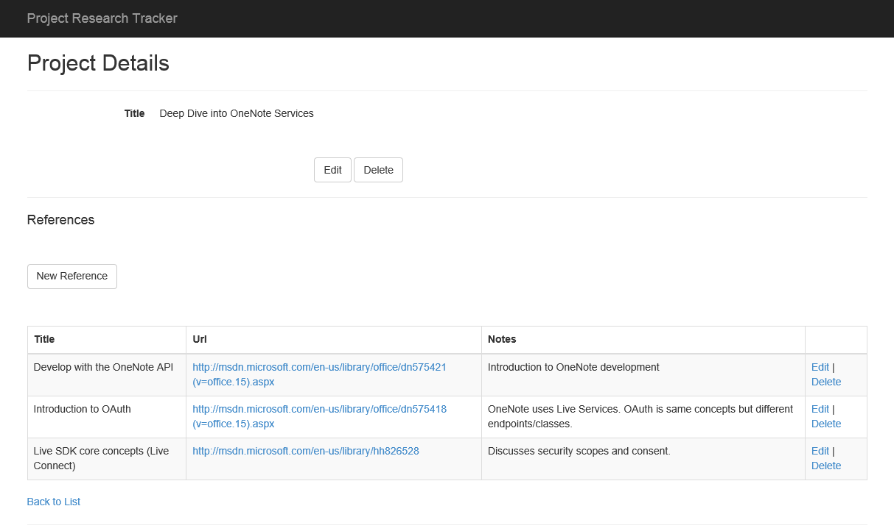

# Office 365 APIs for OneNote Services
In this lab, you will use the APIs for the OneNote Service as part of an ASP.NET MVC5 application to archive web pages stored in a Project Research Tracking application.

## Prerequisites
1. You must have an Office 365 tenant and Windows Azure subscription to complete this lab. If you do not have one, the lab for **O3651-7 Setting up your Developer environment in Office 365** shows you how to obtain a trial.
1. You must have the Office 365 API Tools version 1.3.41104.1 installed in Visual Studio 2013.
1. You must have a Microsoft Account (formerly known as a Windows Live Id) and an online OneNote notebook under that account to complete exercise 1.
1. You must have a Office 365 Account, provisioned OneDrive for Business account & at least one OneNote notebook within your OneDrive for Business folder to complete excercise 2

## Exercise 1: Use the OneNote API with Notebooks in OneDrive Consumer
In this exercise you will program against the OneNote API against a OneNote notebook that is stored in the user's OneDrive Consumer store.

### Register an App with Windows Live Services
In this section, you will register an application with Windows Live Services. Windows Live is the underlying service that hosts the OneNote Service.

1. Navigate to the **Microsoft account Developer Center** at http://go.microsoft.com/fwlink/p/?LinkId=193157
1. Log in with your Microsoft Account.
1. Name the application **Research Tracker Archive**
1. Click **I accept**
1. In the left navigation, click **API Settings**
1. On the **API Settings** page:
	1. For **Mobile or desktop client app:**, choose **No**.
	1. For **Restrict JWT issuing:**, choose **Yes**.
	1. Enter a Redirect URL of **https://officedevlocal.com/OneNote/Process**
	1. Click **Save**
1. In the left navigation, click **App Settings**
	1. On the **App Settings** page, make note of the **Client ID** and **Client secret**. These will be added to the application code.

### Configure the starter project and create data
In this section, you will configure the starter project to connect to your Office 365 tenant. You will also create data using the app for use in a later exercise.  The starter project is a copy of the **Research Project Tracker** project available at https://github.com/OfficeDev/Research-Project-Code-Sample. The starter project uses the Visual Studio-generated scaffolding for the user interface instead of the AngularJS framework. More information about the Research Project Tracker sample can be found in its GitHub repository.

1. Launch **Visual Studio 2013** as an administrator.
1. In Visual Studio, select **File/Open Project**.
1. In the **Open Project** dialog, select **SPResearchTracker.sln** from the **Labs\SpResearchTracker** folder.
1. In Solution Explorer, double-click on the **Properties** node of the SPResearchTracker project.
	1. Choose the **Web** properties from the left navigation.
	1. In the Start Action section, choose **Start URL**. Enter a Start URL of **https://officedevlocal.com:44300/**.
	1. In the Servers section:
		1. Click **Create Virtual Directory**.
			*You must be running Visual Studio as an administrator to create a virtual directory.*
		1. Choose to Override application root URL. Enter an application root URL of **https://officedevlocal.com:44300/**
	1. Press **Ctrl+S** to save the web properties.
1. Launch **NotePad** as an administrator.
1. In Notepad, select **File/Open**.
1. In the **Open** dialog, select file **My Documents\IISExpress\config\applicationhost.config**
1. Modify the bindings of the SPResearchTracker project:
	1. Press **Ctrl+F** to invoke the Find command. In the Find what box, enter **SPResearchTracker**
	1. Ensure you have found the correct &lt;site> node by inspecting the &lt;virtualDirectory node. The physicalPath attribute should match the location of the .csprof file.
	1. Modify the &lt;binding> node. Change the bindingInformation attribute to ***:44300:officedevlocal.com**.
	1. Save and close file **applicationhost.config**.
1. In Notepad, select **File/Open**
1. In the **Open** dialog, select file **C:\windows\system32\drivers\etc\hosts**
	1. Add an entry:

		````
		127.0.0.1	officedevlocal.com 
		````

	1. Save and close file **hosts**.
1. Return to **Visual Studio**.
1. Right-click on the **SPResearchTracker** project and choose **Add.../Connected Service**.
	1. In the **Services Manager** dialog, sign in to your Office 365 tenant.
	1. You may see a pop-up indicating that the **App registration is not found**. If so, click **Yes** to re-register the app.
	1. If you do not see a pop-up, click **Register your app**.
    1. Click **Sites**.
    1. Click **Permissions**.
    1. Check **Create or Delete Items and Lists in All Site Collections**.
    1. Check **Edit or Delete Items in All Site Collections**.
    1. Check **Read Items in All Site Collections**.
    1. Click **Apply**.
    
       
    
    1. Click **OK**.
    
       

1. In **Solution Explorer**, delete the file **SitesApiSample.cs**. This file was added as part of the Connected Service, but is not necessary for this application.
1. Open the **web.config** file. In the &lt;appSettings> section, locate the following keys and change the values to match your Office 365 tenant.
	- **ida:Tenant**
	- **ida.SiteUrl**

1. Press **Ctrl+F5** to run the application. Create a Project and add several references.

	

### Add OneNote Services
In this section, you will extend the application to enable OneNote functionality. You will add a button to the application that will Create a OneNote section containing the references of the current project.

1. Add a button to invoke the OneNote services.
	1. Open the file **Views\Home\_Project.cshtml**
	1. Locate the comment **@*[[ OneNote Button ]]*@** and replace with the following:

	````html
	@Html.ActionLink("Archive in OneNote", "Index", "OneNote", new { id = Model.Id }, new { @class = "btn btn-default" })
	````

	1. Save and close the **_Project.cshtml** file.
1. Add the LiveSDK to the project:
	1. In Visual Studio, select **Tools/NuGet Package Manager/Package Manager Console**,
	1. In the Package Manager Console, type the command **Install-Package LiveSDKServer** and press Enter

	This will install the LiveSDK into the current project.

1. Add a model to support the communication with Live Services:
	1. Right-click on the **Models** folder and select **Add/Class...***.
	1. In the **Add New Item** dialog, enter a Name of **OneNoteViewModel**.
	1. Click **Add**.
	1. Add the following properties to the **OneNoteViewModel** class:

		````c#
		public string ResponseMessage { get; set; }
		public string NewNotebookLink { get; set; }
		````

1. Add a controller to manage the communication with Live Services:
	1. Right-click on the **Controllers** folder and select **Add/Controller...**.
	1. In the **Add Scaffold** dialog, choose **MVC 5 Controller - Empty**. Click **Add**
	1. Name the controller **OneNoteController**
1. In the new controller, add the following using directives:

	````c#
	using Microsoft.Live;
	using SPResearchTracker.Models;
	using System.Threading.Tasks;
	using System.Text;
	````

1. In the new controller, add the following class-scoped constants before the Index method:

	````c#
	private const string clientId = "[LiveClientId]";
	private const string clientSecret = "[LiveClientSecret]";
	private const string clientRedirect = "https://officedevlocal.com:44300/OneNote/Process";
	private string[] scopes = new string[] { "wl.signin", "wl.offline_access", "Office.OneNote_Create" };
	````

	Replace the string constants for **clientId** and **clientSecret** with values from the App Registration

1. Create a class-scoped variable to manage the Live Services authentication:

	````c#
	private LiveAuthClient liveAuthClient = new LiveAuthClient(clientId, clientSecret, clientRedirect); 
	````

1. Modify the Index action (method) to support asynchrony and to accept a project id by changing the method declaration to the following:

	````c#
	public async Task<ActionResult> Index(string id)
	````

1. In the Index action, add code to initialize the Live Services session and redirect the browser to the Live Services log in page:

	````c#
	// save the selected project id
	this.HttpContext.Session["onenote-project"] = id;
	LiveLoginResult loginStatus = await liveAuthClient.InitializeWebSessionAsync(this.HttpContext);
	return Redirect(liveAuthClient.GetLoginUrl(scopes)); 
	````

1. The Index action will redirect the browser to the Live Log in page. Once log in and consent is completed, the Live service will redirect to your application. The Process action will perform the creation of the OneNote Notebook for the selected project.

	Add an action to handle the redirect from Live Services:

	````c#
	public async Task<ActionResult> Process(string code)
	{
		OneNoteViewModel model = new OneNoteViewModel();
		// variable declarations

		if (code != null)
		{
			LiveLoginResult loginStatus = await liveAuthClient.ExchangeAuthCodeAsync(this.HttpContext);

			// processing steps

			return View(model);
		}
		else
		{
			RedirectToAction("Index", "Home");
		}
		return null;
	}
	````

1. Create a view for the Process method.
	1. Right-click in the code window, inside of the Process method.

		

	1. Choose **Add View...**.
	1. Enter a View name of **Process**.
	1. Select a Template of **Details**
	1. Select a Model class of **OneNoteViewModel (SPResearchTracker.Models)**
	1. Click **Add**.
	1. Replace the **DisplayFor** method of the ResponseMessage property with the following:

		````html
		@Html.Raw(Model.ResponseMessage)
		````

	1. Replace the **DisplayFor** method of the NewNotebookLink property with the following:

		````html
		<a target="_blank" href="@Model.NewNotebookLink">@Model.NewNotebookLink</a>
		````

	1. Remove the two lines containing @Html.ActionLink entries from the bottom of the view.  
1. Create a Model for OneNote notebooks.
	1. In Solution Explorer, right-click on the **Models** folder.
	1. Choose **Add/Class**.
	1. Name the class **OneNoteNotebook**.
	1. Replace the default class definition with the following:

		````c#
		public class OneNoteNotebook
		{
			public string name { get; set; }
			public bool isDefault { get; set; }
			public string userRole { get; set; }
			public bool isShared { get; set; }
			public string sectionsUrl { get; set; }
			public string sectionGroupsUrl { get; set; }
			public OneNoteNotebookLink links { get; set; }
			public string self { get; set; }
			public string id { get; set; }
			public string createdBy { get; set; }
			public DateTime createdTime { get; set; }
			public string lastModifiedBy { get; set; }
			public DateTime lastModifiedTime { get; set; }
		}

		public class OneNoteNotebookLink
		{
			public OneNoteNotebookLinkUrl oneNoteClientUrl { get; set; }
			public OneNoteNotebookLinkUrl oneNoteWebUrl { get; set; }
		}

		public class OneNoteNotebookLinkUrl
		{
			public string href { get; set; }
		}

		public class OneNoteNotebookCreationInformation
		{
			public string name { get; set; }
		}
		````

1. Create a Model for OneNote notebooks.
	1. In Solution Explorer, right-click on the **Models** folder.
	1. Choose **Add/Class**.
	1. Name the class **OneNoteSection**.
	1. Replace the default class definition with the following:

		````c#
		public class OneNoteSection
		{
			public bool isDefault { get; set; }
			public string pagesUrl { get; set; }
			public string self { get; set; }
			public string id { get; set; }
			public string name { get; set; }
			public string createdBy { get; set; }
			public DateTime createdTime { get; set; }
			public string lastModifiedBy { get; set; }
			public DateTime lastModifiedTime { get; set; }
		}

		public class OneNoteSectionCreationInformation
		{
			public string name { get; set; }
		}
		````

1. Create a repository class to facilitate the communication with the OneNote API.
	1. In Solution Explorer, right-click on the **Models** folder.
	1. Choose **Add/Class**.
	1. Name the class **OneNoteRepository**.
	1. Add the following statements at the top of the class file:

		````c#
		using Microsoft.Live;
		using Newtonsoft.Json;
		using Newtonsoft.Json.Linq;
		using System.Net.Http;
		using System.Net.Http.Formatting;
		using System.Net.Http.Headers;
		using System.Threading.Tasks;
		````

	1. Add the following class-scoped variables in the OneNoteRepository class:

		````c#
		private const string NotebookName = "Project Research Tracker";
		private const string notebooksEndPoint = "https://www.onenote.com/api/v1.0/notebooks";
		private LiveConnectSession liveConnectSession;
		````

	1. Add the following constructor to the OneNoteRepository class:

		````c#
		public OneNoteRepository(LiveConnectSession liveConnectSession)
		{
			this.liveConnectSession = liveConnectSession;
		}
		````

	1. Add the following **GetNotebook** method to the **OneNoteRepository** class.

		This method will make a REST call to the OneNote API that includes an OData filter to select a single notebook. The "GET notebooks" endpoint always returns an array of notebooks, so the first entry in the array is returned.

		````c#
		public async Task<Tuple<string, OneNoteNotebook>> GetNotebook(string filter)
		{
			string uri = notebooksEndPoint;
			if (!String.IsNullOrEmpty(filter))
			{
				uri += "?$filter=" + filter;
			}
			var getNotebookMessage = new HttpRequestMessage(HttpMethod.Get, uri);
			HttpClient httpClient = new HttpClient();
			httpClient.DefaultRequestHeaders.Authorization = 
			  new AuthenticationHeaderValue("Bearer", liveConnectSession.AccessToken);
			httpClient.DefaultRequestHeaders.Accept.Add(
			  new MediaTypeWithQualityHeaderValue("application/json"));

			HttpResponseMessage response = await httpClient.SendAsync(getNotebookMessage);

			OneNoteNotebook notebook = null; 
			if (response.StatusCode == System.Net.HttpStatusCode.OK)
			{
				string payload = await response.Content.ReadAsStringAsync();

				dynamic results = JsonConvert.DeserializeObject(payload);
				JArray resultArray = results.value as JArray;
				if (resultArray.Count > 0)
				{
					JObject jNotebook = resultArray[0] as JObject;
					notebook = jNotebook.ToObject<OneNoteNotebook>(); 
				}
			}
			string status = String.Format("HttpStatus: {0} - {1}<br />notebook: {2}",
											(int)response.StatusCode, response.ReasonPhrase,
											(notebook == null) ? "null" : notebook.id);
			return Tuple.Create(status, notebook);
		}
		````

	1. Add the following **CreateNotebook** method to the **OneNoteRepository** class.
	
		This method will make a REST call to the OneNote API to create a notebook. The "POST notebooks" endpoint request must include a JSON object with the name of the notebook to create. We created a **OneNoteNotebookCreationInformation** object for this purpose. (The name follows the familiar SharePoint creation information object naming scheme.) The "POST notebooks" endpoint returns just the new notebook, so the response payload is deserialized directly into a OneNoteNotebook object.	

		````c#
		public async Task<Tuple<string, OneNoteNotebook>> CreateNotebook()
		{
			var createNotebookMessage = new HttpRequestMessage(HttpMethod.Post, notebooksEndPoint)
			{
				Content = new ObjectContent<OneNoteNotebookCreationInformation>(
												new OneNoteNotebookCreationInformation { name = NotebookName },
												new JsonMediaTypeFormatter(), "application/json")
			};

			HttpClient httpClient = new HttpClient();
			httpClient.DefaultRequestHeaders.Authorization = 
				new AuthenticationHeaderValue("Bearer", liveConnectSession.AccessToken);
			httpClient.DefaultRequestHeaders.Accept.Add(
				new MediaTypeWithQualityHeaderValue("application/json"));

			HttpResponseMessage response = await httpClient.SendAsync(createNotebookMessage);

			OneNoteNotebook notebook = null;
			if (response.StatusCode == System.Net.HttpStatusCode.Created)
			{
				string payload = await response.Content.ReadAsStringAsync();
				notebook = JsonConvert.DeserializeObject<OneNoteNotebook>(payload);
			}
			string status = String.Format("HttpStatus: {0} - {1}<br />notebook: {2}",
											(int)response.StatusCode, response.ReasonPhrase,
											(notebook == null) ? "null" : notebook.id);
			return Tuple.Create(status, notebook);
		}
		````

	1. Add the following **GetNotebookSection** method to the **OneNoteRepository** class. 
	
		This class follows a pattern similar to the GetNotebook method.

		````c#
		public async Task<Tuple<string, OneNoteSection>> GetNotebookSection(OneNoteNotebook notebook, string filter)
		{
			string uri = notebook.sectionsUrl + "?$filter=" + filter;
			var getSectionMessage = new HttpRequestMessage(HttpMethod.Get, uri);
			HttpClient httpClient = new HttpClient();
			httpClient.DefaultRequestHeaders.Authorization = 
				new AuthenticationHeaderValue("Bearer", liveConnectSession.AccessToken);
			httpClient.DefaultRequestHeaders.Accept.Add(
				new MediaTypeWithQualityHeaderValue("application/json"));

			HttpResponseMessage response = await httpClient.SendAsync(getSectionMessage);

			OneNoteSection section = null;
			if (response.StatusCode == System.Net.HttpStatusCode.OK)
			{
				string payload = await response.Content.ReadAsStringAsync();
				dynamic results = JsonConvert.DeserializeObject(payload);
				JArray resultArray = results.value as JArray;
				if (resultArray.Count > 0)
				{
					JObject jSection = resultArray[0] as JObject;
					section = jSection.ToObject<OneNoteSection>();
				}
			}
			string status = String.Format("HttpStatus: {0} - {1}<br />section: {2}",
											(int)response.StatusCode, response.ReasonPhrase,
											(section == null) ? "null" : section.id);
			return Tuple.Create(status, section);
		}
		````

	1. Add the following **CreteNotebookSection** method to the **OneNoteRepository** class. 
	
		This class follows a pattern similar to the CreateNotebook method.

		````c#
		public async Task<Tuple<string, OneNoteSection>> CreateSection(OneNoteNotebook notebook, string sectionName)
		{
			var createSectionMessage = new HttpRequestMessage(HttpMethod.Post, notebook.sectionsUrl)
			{
				Content = new ObjectContent<OneNoteSectionCreationInformation>(
												new OneNoteSectionCreationInformation { name = sectionName },
												new JsonMediaTypeFormatter(), "application/json")
			};

			HttpClient httpClient = new HttpClient();
			httpClient.DefaultRequestHeaders.Authorization = 
			  new AuthenticationHeaderValue("Bearer", liveConnectSession.AccessToken);
			httpClient.DefaultRequestHeaders.Accept.Add(
			  new MediaTypeWithQualityHeaderValue("application/json"));

			HttpResponseMessage response = await httpClient.SendAsync(createSectionMessage);

			OneNoteSection section = null;
			if (response.StatusCode == System.Net.HttpStatusCode.Created)
			{
				string payload = await response.Content.ReadAsStringAsync();
				section = JsonConvert.DeserializeObject<OneNoteSection>(payload);
			}
			string status = String.Format("HttpStatus: {0} - {1}<br />section: {2}",
											(int)response.StatusCode, response.ReasonPhrase,
											(section == null) ? "null" : section.id);
			return Tuple.Create(status, section);
		}
		````

	1. Add the following **CreatePageForReference** method to the **OneNoteRepository** class.

		To take a snapshot of the referenced web page, this method uses the *data-render-src* approach for creating the content. This instructs the OneNote service to capture the referenced page as an image.

		Since the only content being added to OneNote is the html containing notes and the &lt;img> element, a non-multi-part request is used.

		````c#
		public async Task<string> CreatePageForReference(string pageEndPoint, Reference reference)
		{
			string pageTemplate = @"<html>" +
									"<head>" +
									  "<title>{0}</title>" +
									  "<meta name=\"created\" content=\"{1}\" />" +
									"</head>" +
									"<body>" +
									  "<p>{2}</p>" +
									  "" +
									"</body>" +
								   "</html>";
			string pageContent = String.Format(pageTemplate,
										reference.Title,
										DateTime.Now.ToString("o"),
										reference.Notes,
										reference.Url,
										reference.Title);

			var createPageMessage = new HttpRequestMessage(HttpMethod.Post, pageEndPoint)
			{
				Content = new StringContent(pageContent, System.Text.Encoding.UTF8, "text/html")
			};

			HttpClient httpClient = new HttpClient();
			httpClient.DefaultRequestHeaders.Authorization = 
				new AuthenticationHeaderValue("Bearer", liveConnectSession.AccessToken);
			httpClient.DefaultRequestHeaders.Accept.Add(
				new MediaTypeWithQualityHeaderValue("application/json"));

			HttpResponseMessage response = await httpClient.SendAsync(createPageMessage);

			return String.Format("HttpStatus: {0} - {1}", (int)response.StatusCode, response.ReasonPhrase);
		}
		````

1. Now that the models and repository are created, the controller can be changed to perform the steps required to archive the project references to OneNote.
 
	1. Open the **OneNoteController**.
	1. Locate the comment **// variable declarations** in the Process method.
	1. Replace the comment with the following:

		````c#
		StringBuilder status = new StringBuilder();
		Tuple<string, OneNoteNotebook> notebookApiResult = null;
		Tuple<string, OneNoteSection> sectionApiResult = null;
		````

	1. Location the comment **// processing steps** in the Process method.
	1. Replace the comment with the following:

		````c#
		// get the selected project
		string projectId = (string)this.HttpContext.Session["onenote-project"];
		ProjectDetailViewModel data = await GetProjectAndReferencesFromSharePoint(projectId);

		OneNoteRepository repository = new OneNoteRepository(loginStatus.Session);

		status.Append("GetNotebook: ");
		notebookApiResult = await repository.GetNotebook("name eq 'Project Research Tracker'");
		status.Append(notebookApiResult.Item1 + "<br/>");
		OneNoteNotebook notebook = notebookApiResult.Item2;

		if (notebook == null)
		{
			status.Append("CreateNotebook: ");
			notebookApiResult = await repository.CreateNotebook();
			status.Append(notebookApiResult.Item1 + "<br/>");
			notebook = notebookApiResult.Item2;
		}

		if (notebook != null)
		{
			model.NewNotebookLink = notebook.links.oneNoteWebUrl.href;

			string filter = String.Format("name eq '{0}'", data.Project.Title);
			status.Append("GetSection: ");
			sectionApiResult = await repository.GetNotebookSection(notebook, filter);
			status.Append(sectionApiResult.Item1 + "<br/>");
			OneNoteSection section = sectionApiResult.Item2;

			if (section == null)
			{
				status.Append("CreateSection: ");
				sectionApiResult = await repository.CreateSection(notebook, data.Project.Title);
				status.Append(sectionApiResult.Item1 + "<br/>");
				section = sectionApiResult.Item2;
			}

			if (section != null)
			{
				foreach (Reference reference in data.References)
				{
					status.Append("CreatePage: ");
					string result = await repository.CreatePageForReference(section.pagesUrl, reference);
					status.Append(result + "<br/>");
				}
			}
		}

		model.ResponseMessage = status.ToString();
		````

	1. Add the following helper method to the **OneNoteController**:

		````c#
		private async Task<ProjectDetailViewModel> GetProjectAndReferencesFromSharePoint(string projectId)
		{
			ProjectDetailViewModel model = new ProjectDetailViewModel();
			ProjectsRepository projectRepository = new ProjectsRepository();
			ReferencesRepository referenceRepository = new ReferencesRepository();

			int id = -1;
			if (Int32.TryParse(projectId, out id))
			{
				model.Project = await projectRepository.GetProject(id, String.Empty);
				model.References = (await referenceRepository.GetReferencesForProject(id)).ToList();
			}
			return model;
		}
		````

Congratulations! In this exercise you programed against the OneNote API against a OneNote notebook stored in the user's OneDrive Consumer store.

## Exercise 2: Use the OneNote API with Notebooks in OneDrive for Business (Office 365)
In this exercise you will program against the OneNote API against a OneNote notebook that is stored in the user's OneDrive for Business in Office 365.

### Create an ASP.NET MVC5 Application
In this step, you will create the ASP.NET MVC5 application and register it with Azure active Directory.

1. Launch **Visual Studio 2013** as administrator. 
1. In Visual Studio select **File/New/Project**.
1. In the **New Project** dialog, select **Templates/Visual C#/Web** and click **ASP.NET Web Application**. Name the new project **OneNoteDev** and then click **OK**.  

    

1. In the **New ASP.NET Project** dialog, click **MVC** and then click **Change Authentication**.
1. Select **No Authentication** and click **OK**.

  

1. Once the **New ASP.NET Project** dialog appears like the following screenshot, click **OK**. 

  

1. Update the web project to use SSL by default:
  1. In the **Solution Explorer** tool window, select the project and look at the **Properties** tool window. 
  1. Change the property **SSL Enabled** to **TRUE**.
  1. Copy the **SSL URL** property to the clipboard for use in the next step.
  1. Save your changes.

    
    > It is important to do this now because in the next step when you create the application in Azure AD, you want the reply URL to use HTTPS. If you did not do this now, you would have to manually make the changes the Visual Studio wizard is going to do for you in creating the app.
    
1. Configure the project to always go to the homepage of the web application when debugging:
  1. In the **Solution Explorer** tool window & select **Properties**.
  1. Select the **Web** tab in the left margin.
  1. Find the section **Start Action**.
  1. Click the radio button **Start URL** and enter the SSL URL of the web project that you copied from the previous step.

1. In the **Solution Explorer**, right click the **OneNoteDev** project and select **Add/Connected Service**.
  1. In the **Services Manager** dialog:
    1. Click **Register Your App**.
    1. When prompted, login with your **Organizational Account**.
    1. Click **App Properties**.
      1. Verify the option **Single Organization** is selected.
      1. Make sure there is only a single URL listed in the **Redirect URIs** and it is the HTTPS URL of the web project.
      1. Click **Apply**.
    1. Click **My Files**.
      1. Click **Permissions**.
      1. Check **Edit or Delete User's Files**.
      1. Check **Read User's Files**.
      1. Click **Apply**.
    1. Click **Users and Groups**.
      1. Click **Enable sign-on and read user' profiles**.
      1. Click **Apply**.
    1. Click **OK**.

### Configure Web Application to use Azure AD and OWIN
In this exercise you will take the ASP.NET MVC web application you created in the previous exercise and configure it to use Azure AD & OpenID Connect for user & app authentication. You will do this by utilizing the OWIN framework. Once authenticated, you can use the access token returned by Azure AD to access the Office 365 APIs.

1. Obtain and store the Azure AD tenant ID in the `web.config`.
  1. Browse to the [Azure Management Portal](https://manage.windowsazure.com) and sign in with your **Organizational Account**.
  1. In the left-hand navigation, click **Active Directory**.
  1. Select the directory you share with your Office 365 subscription.
  1. Select the application you created for this lab. This is the name of the application in the **App Properties** dialog when you were adding the **Connected Service** in the last exercise.
  1. Select the **Quick Start** page for the in the top navigation... that's the left-most menu item that looks like a lightning bolt in a cloud:

    
 
  1. On the Quick Start page, expand the **Get Started** / **Enable Users to Sign On**. Locate the field **Federation Metadata Document URL**. Within that field value you will see a GUID immediately after the `login.windows.net` part of the URL. Copy just the GUID value to the clipboard.

    

  1. Open the `web.config` file in the project.
  1. Add the following node to the `<appSettings>` section, setting the value equal to the **directory tenant ID** you acquired in the previous step:

    ````xml
    <add key="ida:AadTenantId" value="######-####-####-####-############"/>
    ````

1. Now you need a few NuGet packages to enable OWIN OpenID Connect authentication & to create a secure token cache (using Entity Framework) in the application:
  1. Open the Package Manager Console: **View/Other Windows/Package Manager Console**.
  1. Enter each line below in the console, one at a time, pressing **ENTER** after each one. NuGet will install the package and all dependent packages:

    ````powershell
    PM> Install-Package -Id EntityFramework
    PM> Install-Package -Id Microsoft.IdentityModel.Clients.ActiveDirectory
    PM> Install-Package -Id Microsoft.Owin.Host.SystemWeb
    PM> Install-Package -Id Microsoft.Owin.Security.Cookies
    PM> Install-Package -Id Microsoft.Owin.Security.OpenIdConnect
    ````

1. Add a new model that will be used by our persistent token cache:
  1. Right-click **Models** folder in the project and select **Add/Class**.
  1. Name the class **PerWebUserCache.cs**.
  1. When the file has been created, add the following code to the class:

    ````c#
    [Key]
    public int EntryId { get; set; }
    public string webUserUniqueId { get; set; }
    public byte[] cacheBits { get; set; }
    public DateTime LastWrite { get; set; }
    ````

  1. At the top of the file, add the following `using` statement:

    ````c#
    using System.ComponentModel.DataAnnotations;
    ````

1. Add a new persistent data store that will be used for the token cache:
  1. Right-click the project and select **Add/New Folder**.
  1. Name the folder **Data**.
  1. Locate the [Labs / Labfiles](Labs/Labfiles) folder provided with this lab & find two files: `Office365Context.cs` & `Office365Initializer.cs`. Copy these two files to the **Data** folder you just created.

1. Add a token cache that leverages Entity Framework to store the user specific tokens in persistent storage:
  1. Right-click the project and select **Add/New Folder**.
  2. Name the folder **Utils**.
  1. Locate the [Labs / Labfiles](Labs/Labfiles) folder provided with this lab & find the file `EDADALTokenCache.cs`. Copy that file to the **Utils** folder.
  
    > Take a moment to examine this file. It uses the `DbContext` you added in the previous step to implement a `TokenCache` which you will use in a moment. This will store the token received from a successful authentication in a persistent store.

1. Add a helper class that will be used to harvest settings out of the `web.config` and create the necessary strings that will be used for authentication:
  1. Locate the [Labs / Labfiles](Labs/Labfiles) folder provided with this lab & find the file `SettingsHelper.cs`. Copy that file to the **Utils** folder.

1. Configure the app to run startup code when the OWIN libraries startup:
  1. Right-click the project and select **Add/Class**.
  1. Name the class **Startup.cs**.
  1. Add the following `using` statements after the existing `using` statements:

    ````c#
    using Owin;
    using Microsoft.Owin;
    ````

  1. Add the following assembly directive to call the `Startup.Configuration()` method when OWIN starts up. Note that you will only point to the class:

    ````c#
    [assembly:OwinStartup(typeof(OneNoteDev.Startup))]
    ````

  1. Update the signature of the `Startup` class to be a partial class as you will create another in the next step. Do this by adding the `partial` keyword after the `public` statement so it looks like the following:

    ````c#
    public partial class Startup {}
    ````

  1. Add the following `Confguration()` to the `Startup` class. This calls a method you will create in a moment:

    ````c#
    public void Configuration(IAppBuilder app)
    {
      ConfigureAuth(app);
    }
    ````

  1. Save your changes.
1. Create an authentication process when a user hits the website:
  1. Right-click the **App_Start** folder and select **Add/Class**.
  1. Name the class **Startup.Auth.cs**.
  1. When the file opens make the following two changes:
    1. Modify the namespace to just be `OneNoteDev`.
    1. Modify the class declaration to be a `partial` class named `Startup` so it looks like the following:

      ````c#
      public partial class Startup {}
      ````

  1. Add the following `using` statements after the existing `using` statements:

    ````c#
    using Microsoft.IdentityModel.Clients.ActiveDirectory;
    using Microsoft.Owin.Security;
    using Microsoft.Owin.Security.Cookies;
    using Microsoft.Owin.Security.OpenIdConnect;
    using Owin;
    using System.Configuration;
    using System.Threading.Tasks;
    using OneNoteDev.Utils;
    ````

  1. Add the following method to the `Startup` class:

    ````c#
    public void ConfigureAuth(IAppBuilder app) {}
    ````

  1. Configure the authentication type and settings for the app:

    ````c#
    app.SetDefaultSignInAsAuthenticationType(CookieAuthenticationDefaults.AuthenticationType);
    app.UseCookieAuthentication(new CookieAuthenticationOptions());
    ````

  1. Now configure the OWIN authentication process, force the user to go through the login process and collect the result returned from Azure AD:

    ````c#
    app.UseOpenIdConnectAuthentication(new OpenIdConnectAuthenticationOptions {
      ClientId = SettingsHelper.ClientId,
      Authority = SettingsHelper.AzureADAuthority,
      PostLogoutRedirectUri = HttpContext.Current.Request.Url.GetLeftPart(UriPartial.Authority),
      Notifications = new OpenIdConnectAuthenticationNotifications() {
        // when an auth code is received...
        AuthorizationCodeReceived = (context) => {
          // get the OpenID Connect code passed from Azure AD on successful auth
          string code = context.Code;

          // create the app credentials & get reference to the user
          ClientCredential creds = new ClientCredential(SettingsHelper.ClientId, SettingsHelper.ClientSecret);
          string userObjectId = context.AuthenticationTicket.Identity.FindFirst(System.IdentityModel.Claims.ClaimTypes.NameIdentifier).Value;

          // use the OpenID Connect code to obtain access token & refresh token...
          //  save those in a persistent store...
          EFADALTokenCache sampleCache = new EFADALTokenCache(userObjectId);
          AuthenticationContext authContext = new AuthenticationContext(SettingsHelper.AzureADAuthority, sampleCache);

          // obtain access token for the AzureAD graph
          Uri redirectUri = new Uri(HttpContext.Current.Request.Url.GetLeftPart(UriPartial.Path));
          AuthenticationResult authResult = authContext.AcquireTokenByAuthorizationCode(code, redirectUri, creds, SettingsHelper.AzureAdGraphResourceId);

          // successful auth
          return Task.FromResult(0);
        },
        AuthenticationFailed = (context) =>
        {
          context.HandleResponse();
          return Task.FromResult(0);
        }
      },
      TokenValidationParameters = new System.IdentityModel.Tokens.TokenValidationParameters
      {
        ValidateIssuer = false
      }
    });
    ````

  1. Save your changes.
1. With the authentication process wired up into the OWIN startup process, now implement a login controller to provide sign in & sign out functionality:
  1. Right-click the **Controllers** folder and select **Add/Controller**.
    1. In the **Add Scaffold** dialog, select **MVC 5 Controller - Empty**.
    1. Click **Add**.
    1. When prompted for a name, enter **AccountController**.
    1. Click **Add**.
  1. Within the **AccountController** file, add the following `using` statements to the top of the file:
  
    ````c#
    using OneNoteDev.Utils;
    using Microsoft.IdentityModel.Clients.ActiveDirectory;
    using Microsoft.Owin.Security;
    using Microsoft.Owin.Security.Cookies;
    using Microsoft.Owin.Security.OpenIdConnect;
    using System.Security.Claims;
    ````

  1. Delete the default `Index()` method from the `AcountController` class.
  1. Add a new function to provide a sign in route. This will simply initiate a login challenge using the OWIN framework that will take the user to the Azure AD login page. When this runs, if the user has not already given the app consent to access their Office 365 data, they will be prompted to grant the app consent at this time.

    ````c#
    public void SignIn() {
      if (!Request.IsAuthenticated) {
        HttpContext.GetOwinContext().Authentication.Challenge(new AuthenticationProperties { RedirectUri = "/" }, OpenIdConnectAuthenticationDefaults.AuthenticationType);
      }
    }
    ````

  1. Add a new function to provide a sign out route. This will log the user out of the site & clear the local cache of tokes: 

    ````c#
    public void SignOut() {
      // Remove all cache entries for this user and send an OpenID Connect sign-out request.
      string usrObjectId = ClaimsPrincipal.Current.FindFirst(SettingsHelper.ClaimTypeObjectIdentifier).Value;
      AuthenticationContext authContext = new AuthenticationContext(SettingsHelper.AzureADAuthority, new EFADALTokenCache(usrObjectId));
      authContext.TokenCache.Clear();

      HttpContext.GetOwinContext().Authentication.SignOut(
          OpenIdConnectAuthenticationDefaults.AuthenticationType, CookieAuthenticationDefaults.AuthenticationType);
    }
    ````

  1. Add a pair of functions to handle requesting consent for the application.

    ````c#
    public ActionResult ConsentApp() {
      string strResource = Request.QueryString["resource"];
      string strRedirectController = Request.QueryString["redirect"];

      string authorizationRequest = String.Format(
          "{0}oauth2/authorize?response_type=code&client_id={1}&resource={2}&redirect_uri={3}",
              Uri.EscapeDataString(SettingsHelper.AzureADAuthority),
              Uri.EscapeDataString(SettingsHelper.ClientId),
              Uri.EscapeDataString(strResource),
              Uri.EscapeDataString(String.Format("{0}/{1}", this.Request.Url.GetLeftPart(UriPartial.Authority), strRedirectController))
              );

      return new RedirectResult(authorizationRequest);
    }

    public ActionResult AdminConsentApp() {
      string strResource = Request.QueryString["resource"];
      string strRedirectController = Request.QueryString["redirect"];

      string authorizationRequest = String.Format(
          "{0}oauth2/authorize?response_type=code&client_id={1}&resource={2}&redirect_uri={3}&prompt={4}",
              Uri.EscapeDataString(SettingsHelper.AzureADAuthority),
              Uri.EscapeDataString(SettingsHelper.ClientId),
              Uri.EscapeDataString(strResource),
              Uri.EscapeDataString(String.Format("{0}/{1}", this.Request.Url.GetLeftPart(UriPartial.Authority), strRedirectController)),
              Uri.EscapeDataString("admin_consent")
              );

      return new RedirectResult(authorizationRequest);
    }
    ````

  1. Add one more function to the `AccountController` class to refresh the session and reissue the OWIN authentication challenge:
      
    ````c#
    public void RefreshSession() {
      string strRedirectController = Request.QueryString["redirect"];

      HttpContext.GetOwinContext().Authentication.Challenge(new AuthenticationProperties { RedirectUri = String.Format("/{0}", strRedirectController) }, OpenIdConnectAuthenticationDefaults.AuthenticationType);
    }
    ````

  1. Now that the **AccountController** is setup, the last step is to implement the user interface components to provide sign in and sign out capabilities.
    1. Locate the **Views/Shared** folder in the project.
    1. Right-click the folder and select **Add/View**.
    1. Complete the **Add View** dialog as shown in the following picture, then click **Add**:
      
      

    1. Add the following code to the **_LoginPartial.cshtml** file:

      ````asp
      @if (Request.IsAuthenticated) {
        <text>
          <ul class="nav navbar-nav navbar-right">
            <li class="navbar-text">
              Hello, @User.Identity.Name!
            </li>
            <li>
              @Html.ActionLink("Sign out", "SignOut", "Account")
            </li>
          </ul>
        </text>
      } else {
        <ul class="nav navbar-nav navbar-right">
          <li>@Html.ActionLink("Sign in", "SignIn", "Account", routeValues: null, htmlAttributes: new { id = "loginLink" })</li>
        </ul>
      }
      ````

    1. Open the **_Layout.cshtml** file found in the **Views/Shared** folder.
      1. Locate the part of the file that includes a few links at the top of the page... it should look similar to the following code:
      
        ````asp
        <div class="navbar-collapse collapse">
          <ul class="nav navbar-nav">
            <li>@Html.ActionLink("Home", "Index", "Home")</li>
            <li>@Html.ActionLink("About", "About", "Home")</li>
            <li>@Html.ActionLink("Contact", "Contact", "Home")</li>
          </ul>
        </div>
        ````

      1. Update that navigation so the Notebooks link points to the Notebook controller (the **Notebooks** link added below) as well as a reference to the login control you just created:

        ````asp
        <div class="navbar-collapse collapse">
          <ul class="nav navbar-nav">
            <li>@Html.ActionLink("Home", "Index", "Home")</li>
            <li>@Html.ActionLink("About", "About", "Home")</li>
            <li>@Html.ActionLink("Contact", "Contact", "Home")</li>
            <li>@Html.ActionLink("Notebooks", "Index", "Notebook")</li>
          </ul>
          @Html.Partial("_LoginPartial")
        </div>
        ````

      > The **Notebooks** link will not work yet... you will add that in the next exercise.

1. At this point you can test the authentication flow for your application.
  1. In Visual Studio, press **F5**. The browser will automatically launch taking you to the HTTPS start page for the web application.
  1. To sign in, click the **Sign In** link the upper-right corner.
  1. Login using your **Organizational Account**.
  1. Upon a successful login, since this will be the first time you have logged into this app, Azure AD will present you with the common consent dialog that looks similar to the following image:

    

  1. Click **OK** to approve the app's permission request on your data in Office 365.
  1. You will then be redirected back to your web application. However notice in the upper right corner, it now shows your email address & the **Sign Out** link.

### Update the Application's Permissions
While the application has been granted permissions in AzureAD for signing in and accessing the user's OneDrive for Business, it needs permissions to the OneNote API.

1. In a browser, navigate to the Azure Management Portal: https://manage.windowsazure.com
1. After logging in, select the **Active Directory** option in the left-hand menu.
1. Select the directory that you are using for your Office 365 tenant.
1. Select **Applications** in the top navigation.
1. Select the filter option **Applications my company owns** and click the check.
1. Locate the application that Visual Studio created for you in this project, likely **OneNote.Office365App**.
1. Scroll down to the **permissions to other applications** section. 
	1. Click the **Add Application** button.
	1. In the **Permissions to other applications** dialog, click the **PLUS** icon next to the **OneNote** option.

		> Note: If you do not see **OneNote** in the list of available applications, sign out and navigate to http://www.onenote.com. From there, click the **Signin** link and login with your Office 365 account. This triggers the addition of OneNote in the list of applications in your Azure AD directory.

	1. Click the **CHECK** icon in the lower left corner.
	1. For the new **OneNote** application permission entry, select the **Delegated Permissions** dropdown on the same line and then select the following permissions:
		- View and modify OneNote notebooks in your organization
		- View OneNote notebooks in your organization 
		- View and modify OneNote notebooks
		- Application-only OneNote notebook access
		- Create pages in OneNote notebooks
	1. Click the **Save** button at the bottom of the page.

### Create the OneNote API Repository
In this step you will create a repository class that will handle all communication with the OneNote API to interact with notebooks in your OneDrive for Business store.

1. This exercise will heavily leverage the OneNote REST API. To simplify working with the REST services, we will use the popular [JSON.NET](http://www.newtonsoft.com/json) JSON framework for .NET.
	1. Create a new folder in the project's **Models** folder named **JsonHelpers**.
	1. Copy all the C# files provided with this lab, located in the [Labs / Labfiles / JsonHelpers](Labs/Labfiles/JsonHelpers) folder, into this new **JsonHelpers** folder you just added in your project.

		> These were created using the handy utility in Visual Studio: [Paste JSON as Classes](http://blogs.msdn.com/b/webdev/archive/2012/12/18/paste-json-as-classes-in-asp-net-and-web-tools-2012-2-rc.aspx).

1. Create model objects for the OneNote notebook, section & page:
	1. Add a new class named **Notebook** to the **Models** folder in the project.
	1. Add the following code to the `Notebook` class:

		````c#
    public Notebook() {
      Sections = new List<Section>();
    }

    public string Id { get; set; }
    public string Name { get; set; }
    public string NotebookUrl { get; set; }
    public string ClientUrl { get; set; }
    public string WebUrl { get; set; }
    public bool IsDefault { get; set; }
    public DateTime CreatedDateTime { get; set; }
    public DateTime LastModifiedDateTime { get; set; }
    public string SectionsUrl { get; set; }
    public string SectionGroupsUrl { get; set; }
    public List<Section> Sections { get; set; }
		````

	1. Add a new class named **Section** to the **Models** folder in the project.
	1. Add the following code to the `Section` class:

		````c#
    public Section() {
      Pages = new List<NotePage>();
    }

    public string Id { get; set; }
    public string Name { get; set; }
    public DateTime CreatedDateTime { get; set; }
    public DateTime LastModifiedDateTime { get; set; }
    public string PagesUrl { get; set; }
    public List<NotePage> Pages { get; set; }
		````

	1. Add a new class named **NotePage** to the **Models** folder in the project.
	1. Add the following code to the `Section` class:

		````c#
    public string Id { get; set; }
    public string Name { get; set; }
    public DateTime CreatedDateTime { get; set; }
    public DateTime LastModifiedDateTime { get; set; }
    public string ContentUrl { get; set; }
    public string Content { get; set; }
    public string PageUrl { get; set; }
    public string WebUrl { get; set; }
    public string ClientUrl { get; set; }
		````

1. Create the repository class for communicating with the OneNote REST API:
	1. Add a new class to the **Models** folder named **NotebookRepository**.
	1. Ensure the following `using` statements are present at the top of the `NotebookRepository` class:

		````c#
		using System;
		using System.Collections.Generic;
		using System.Linq;
		using System.Net.Http;
		using System.Security.Claims;
		using System.Threading.Tasks;
		using System.Web;
		using System.Web.Helpers;
		using Microsoft.IdentityModel.Clients.ActiveDirectory;
		using Microsoft.Office365.Discovery;
		using Newtonsoft.Json;
		using OneNoteDev.Utils;
		````

	1. Add the following private fields and class constructor to the `NotebookRepository` class:

		````c#
    private HttpClient _client;

    private string _oneNoteResourceId = string.Empty;
    private string _oneNoteEndpoint = string.Empty;

    public NotebookRepository() {
      _client = new HttpClient();
      _client.DefaultRequestHeaders.Add("Accept", "application/json");
    }
		````

	1. Next, add a new function `InitOneNoteRestConnection()` to the `NotebookRepository` class. This method will be used to obtain an access token, endpoint & resource ID for the OneNote API using the Office 365 discovery service:

		````c#
    private async Task InitOneNoteRestConnection() {
      // fetch from stuff user claims
      var signInUserId = ClaimsPrincipal.Current.FindFirst(ClaimTypes.NameIdentifier).Value;
      var userObjectId = ClaimsPrincipal.Current.FindFirst(SettingsHelper.ClaimTypeObjectIdentifier).Value;

      // discover onenote endpoint
      var clientCredential = new ClientCredential(SettingsHelper.ClientId, SettingsHelper.ClientSecret);
      var userIdentifier = new UserIdentifier(userObjectId, UserIdentifierType.UniqueId);

      // create auth context
      AuthenticationContext authContext = new AuthenticationContext(SettingsHelper.AzureADAuthority, new EFADALTokenCache(signInUserId));

      // authenticate with directory service
      var discoClient = new DiscoveryClient(new Uri(SettingsHelper.O365DiscoveryServiceEndpoint),
        async () => {
          var authResult = await authContext.AcquireTokenSilentAsync(SettingsHelper.O365DiscoveryResourceId, clientCredential, userIdentifier);
          return authResult.AccessToken;
        });

      // query discovery service for endpoint for onenote endpoint
      var discoCapabilityResult = await discoClient.DiscoverCapabilityAsync("Notes");

      // get details around onedrive endpoint (replace 1.0 with 2.0 for the new REST API)
      _oneNoteResourceId = discoCapabilityResult.ServiceResourceId;
      _oneNoteEndpoint = discoCapabilityResult.ServiceEndpointUri.ToString();
      var accessToken = (await authContext.AcquireTokenSilentAsync(_oneNoteResourceId, clientCredential, userIdentifier)).AccessToken;

      // set the access token on all requests for onenote API
      _client.DefaultRequestHeaders.Add("Authorization", "Bearer " + accessToken);

      return;
    }
		````

	1. Add a function to get a list of all OneNote notebooks for the currently logged in user's OneDrive for Business store. Add the following code to the `NotebookRepository` class:

		````c#
    public async Task<IEnumerable<Notebook>> GetNotebooks() {
      // ensure connection established to new onenote API
      if ((string.IsNullOrEmpty(_oneNoteEndpoint)) ||
          (string.IsNullOrEmpty(_oneNoteResourceId))) {
        await InitOneNoteRestConnection();
      }

      // create query
      var query = _oneNoteEndpoint + "/me/notes/notebooks";

      // create request
      var request = new HttpRequestMessage(HttpMethod.Get, query);

      // issue request & get response
      var response = await _client.SendAsync(request);
      string responseString = await response.Content.ReadAsStringAsync();
      var jsonResponse = JsonConvert.DeserializeObject<JsonHelpers.NotebooksJson>(responseString);

      // convert to model object
      var notebooks = new List<Notebook>();
      foreach (var notebook in jsonResponse.Notebooks) {
        var item = new Notebook {
          Id = notebook.Id,
          Name = notebook.Name,
          NotebookUrl = notebook.NotebookUrl,
          IsDefault = notebook.IsDefault,
          CreatedDateTime = notebook.CreatedTime,
          LastModifiedDateTime = notebook.LastModifiedTime,
          SectionsUrl = notebook.SectionsUrl,
          SectionGroupsUrl = notebook.SectionGroupsUrl,
          ClientUrl = notebook.Links.OneNoteClientUrl.href,
          WebUrl = notebook.Links.OneNoteWebUrl.href
        };

        notebooks.Add(item);
      }

      return notebooks.OrderBy(n => n.Name).ToList();
    }
		````

	1. Add the following code to get a single notebook based on the ID specified:

		````c#
    public async Task<Notebook> GetNotebook(string notebookid) {
      // ensure connection established to new onenote API
      if ((string.IsNullOrEmpty(_oneNoteEndpoint)) ||
          (string.IsNullOrEmpty(_oneNoteResourceId))) {
        await InitOneNoteRestConnection();
      }

      // create query
      var query = string.Format("{0}/me/notes/notebooks/?$top=1&$filter=id eq '{1}'", _oneNoteEndpoint, notebookid);

      // create request
      var request = new HttpRequestMessage(HttpMethod.Get, query);

      // issue request & get response
      var response = await _client.SendAsync(request);
      string responseString = await response.Content.ReadAsStringAsync();
      var jsonResponse = JsonConvert.DeserializeObject<JsonHelpers.NotebooksJson>(responseString).Notebooks[0];

      // convert to model object
      var notebook = new Notebook {
        Id = jsonResponse.Id,
        Name = jsonResponse.Name,
        NotebookUrl = jsonResponse.NotebookUrl,
        IsDefault = jsonResponse.IsDefault,
        CreatedDateTime = jsonResponse.CreatedTime,
        LastModifiedDateTime = jsonResponse.LastModifiedTime,
        SectionsUrl = jsonResponse.SectionsUrl,
        SectionGroupsUrl = jsonResponse.SectionGroupsUrl,
        ClientUrl = jsonResponse.Links.OneNoteClientUrl.href,
        WebUrl = jsonResponse.Links.OneNoteWebUrl.href
      };

      return notebook;
    }
		````

	1. Add the following code to get all the sections in the specified notebook using the OneNote API. This should go in the `NotebookRepository` class.

		````c#
    public async Task<Notebook> GetNotebookSections(string notebookid) {
      var notebook = await GetNotebook(notebookid);
      return await GetNotebookSections(notebook);
    }

    public async Task<Notebook> GetNotebookSections(Notebook notebook) {
      // ensure connection established to new onenote API
      if ((string.IsNullOrEmpty(_oneNoteEndpoint)) ||
          (string.IsNullOrEmpty(_oneNoteResourceId))) {
        await InitOneNoteRestConnection();
      }

      // create query
      var query = notebook.SectionsUrl;

      // create request
      var request = new HttpRequestMessage(HttpMethod.Get, query);

      // issue request & get response
      var response = await _client.SendAsync(request);
      string responseString = await response.Content.ReadAsStringAsync();
      var jsonResponse = JsonConvert.DeserializeObject<JsonHelpers.SectionsJson>(responseString);

      // convert to model object
      foreach (var item in jsonResponse.Sections) {
        var section = new Section {
          Id = item.Id,
          Name = item.Name,
          CreatedDateTime = item.CreatedTime,
          LastModifiedDateTime = item.LastModifiedTime,
          PagesUrl = item.PagesUrl
        };
        notebook.Sections.Add(section);
      }

      return notebook;
    }
		````

 	1. Next, add the following code to load all the pages within the specified notebook section. This should also be added to the `NotebookRepository` class.

		````c#
    public async Task<Notebook> GetNotebookPages(string notebookid, string sectionid) {
      var notebook = await GetNotebook(notebookid);
      notebook = await GetNotebookSections(notebook);
      return await GetNotebookPages(notebook, sectionid);
    }

    public async Task<Notebook> GetNotebookPages(Notebook notebook, string sectionid) {
      // ensure connection established to new onenote API
      if ((string.IsNullOrEmpty(_oneNoteEndpoint)) ||
          (string.IsNullOrEmpty(_oneNoteResourceId))) {
        await InitOneNoteRestConnection();
      }

      HttpRequestMessage request = null;
      HttpResponseMessage response = null;
      string responseString;

      // for the specified section...
      var section = notebook.Sections.First(s => s.Id == sectionid);

      // get all the pages in the section
      request = new HttpRequestMessage(HttpMethod.Get, section.PagesUrl);
      response = await _client.SendAsync(request);
      
      // convert to JSON object
      responseString = await response.Content.ReadAsStringAsync();
      var jsonPages = JsonConvert.DeserializeObject<JsonHelpers.PagesJson>(responseString);

      // loop through all pages
      foreach (var jsonPage in jsonPages.Pages) {
        // convert pages to model objects
        var page = new NotePage {
          Id = jsonPage.Id,
          Name = jsonPage.Title,
          CreatedDateTime = jsonPage.CreatedTime,
          LastModifiedDateTime = jsonPage.LastModifiedTime,
          PageUrl = jsonPage.PageUrl,
          ClientUrl = jsonPage.Links.OneNoteClientUrl.href,
          WebUrl = jsonPage.Links.OneNoteWebUrl.href,
          ContentUrl = jsonPage.ContentUrl
        };

        // get the body of the page
        request = new HttpRequestMessage(HttpMethod.Get, page.ContentUrl);
        response = await _client.SendAsync(request);
        page.Content = await response.Content.ReadAsStringAsync();

        // add page to section
        section.Pages.Add(page);
      }

      return notebook;
    }
		````

	1. And finally, add the following function to delete a specified page:

		````c#
    public async Task DeletePage(string id)
    {
      // ensure connection established to new onenote API
      if ((string.IsNullOrEmpty(_oneNoteEndpoint)) ||
          (string.IsNullOrEmpty(_oneNoteResourceId))) {
        await InitOneNoteRestConnection();
      }

      // create query
      var query = string.Format("{0}/me/notes/pages/{1}", _oneNoteEndpoint, id);

      // create request
      var request = new HttpRequestMessage(HttpMethod.Delete, query);

      // issue request & get response
      await _client.SendAsync(request);      
    }
		````

### Add Notebook Controller & View
In this step you will create the ASP.NET MVC controller and view for OneNote notebooks.

1. Right-click the **Controllers** folder in the project and select **Add / Controller**.
	1. In the **Add Scaffold** dialog, select **MVC 5 Controller - Empty**.
	1. Click **Add**.
	1. When prompted for a name, enter **NotebookController**.
	1. Click **Add**.
1. Within the `NotebookController` class, add the following using statement:

	````c#
	using System.Threading.Tasks;
	using OneNoteDev.Models;
	````

1. Add the following action to support viewing all notebooks:

		````c#
    [Authorize]
    public async Task<ActionResult> Index()
    {
      var repository = new NotebookRepository();

      var myNotebooks = await repository.GetNotebooks();

      return View(myNotebooks);
    }
		````

1. Now add a view to render a list of the notebooks.
	1. Right-click in the `Index()` method and select **Add View**.
  1. Within the **Add View** dialog, set the following values:
    - View Name: **Index**.
    - Template: **List**.
    - Model class: **Notebook (OneNoteDev.Models)**.
    - Data context class: <blank>
    - Create as partial view: **checked**
    - Reference script libraries: **unchecked**
  1. Click **Add**.
1. **Replace** all of the code in the file with the following:

	````html
	@model IEnumerable<OneNoteDev.Models.Notebook>

	<h1>
	  OneNote Notebooks
	</h1>

	<table class="table">
	  <tr>
	    <th>
	      @Html.DisplayNameFor(model => model.Name)
	    </th>
	    <th>
	      @Html.DisplayNameFor(model => model.CreatedDateTime)
	    </th>
	    <th>
	      @Html.DisplayNameFor(model => model.LastModifiedDateTime)
	    </th>
	    <th></th>
	  </tr>

	  @foreach (var item in Model) {
	    <tr>
	      <td>
	        @Html.DisplayFor(modelItem => item.Name)
	      </td>
	      <td>
	        @Html.DisplayFor(modelItem => item.CreatedDateTime)
	      </td>
	      <td>
	        @Html.DisplayFor(modelItem => item.LastModifiedDateTime)
	      </td>
	      <td>
	        @Html.RouteLink("View Sections", "Section", new { notebookid = item.Id, action = "Index" })
	      </td>
	    </tr>
	  }
	</table>
	````

### Add Notebook Section Controller & View
In this step you will create the ASP.NET MVC controller and view for OneNote notebook sections.

1. Right-click the **Controllers** folder in the project and select **Add / Controller**.
	1. In the **Add Scaffold** dialog, select **MVC 5 Controller - Empty**.
	1. Click **Add**.
	1. When prompted for a name, enter **SectionController**.
	1. Click **Add**.
1. Within the `SectionController` class, add the following using statement:

	````c#
	using System.Threading.Tasks;
	using OneNoteDev.Models;
	````

1. Add the following action to support viewing all notebook sections:

		````c#
    [Authorize]
    public async Task<ActionResult> Index(string notebookid) {
      var repository = new NotebookRepository();

      var notebook = await repository.GetNotebookSections(notebookid);

      ViewBag.CurrentNotebookTitle = notebook.Name;
      ViewBag.CurrentNotebookId = notebook.Id;

      return View(notebook.Sections.OrderBy(s => s.Name).ToList());
    }
		````

1. Now add a view to render a list of the notebook sections.
	1. Right-click in the `Index()` method and select **Add View**.
  1. Within the **Add View** dialog, set the following values:
    - View Name: **Index**.
    - Template: **List**.
    - Model class: **Section (OneNoteDev.Models)**.
    - Data context class: <blank>
    - Create as partial view: **checked**
    - Reference script libraries: **unchecked**
  1. Click **Add**.
1. **Replace** all of the code in the file with the following:

	````html
	@model IEnumerable<OneNoteDev.Models.Section>

	<h1>
	  Sections within Notebook: @ViewBag.CurrentNotebookTitle
	</h1>

	<table class="table">
	  <tr>
	    <th>
	      @Html.DisplayNameFor(model => model.Name)
	    </th>
	    <th>
	      @Html.DisplayNameFor(model => model.CreatedDateTime)
	    </th>
	    <th>
	      @Html.DisplayNameFor(model => model.LastModifiedDateTime)
	    </th>
	    <th></th>
	  </tr>

	  @foreach (var item in Model) {
	    <tr>
	      <td>
	        @Html.DisplayFor(modelItem => item.Name)
	      </td>
	      <td>
	        @Html.DisplayFor(modelItem => item.CreatedDateTime)
	      </td>
	      <td>
	        @Html.DisplayFor(modelItem => item.LastModifiedDateTime)
	      </td>
	      <td>
	        @Html.RouteLink("View Pages", "Page", new { notebookid = ViewBag.CurrentNotebookId, sectionid = item.Id, action = "Index" })
	      </td>
	    </tr>
	  }
	</table>
	````

1. For this controller you will need to create a special route.
	1. Open the file **App_Start / RouteConfig.cs**.
	1. Add the following code before the existing *default* route:

		````c#
		routes.MapRoute(
		  "Section",
		  "Notebooks/{notebookid}/Section/{action}",
		  new { controller = "Section", action = "Index" }
		);
		````

### Add Notebook Pages Controller & View
In this step you will create the ASP.NET MVC controller and view for pages within OneNote notebook sections.

1. Right-click the **Controllers** folder in the project and select **Add / Controller**.
	1. In the **Add Scaffold** dialog, select **MVC 5 Controller - Empty**.
	1. Click **Add**.
	1. When prompted for a name, enter **PageController**.
	1. Click **Add**.
1. Within the `PageController` class, add the following using statement:

	````c#
	using System.Threading.Tasks;
	using OneNoteDev.Models;
	````

1. Add the following action to support viewing all pages within a notebook section:

	````c#
	[Authorize]
	public async Task<ActionResult> Index(string notebookid, string sectionid) {
	  var repository = new NotebookRepository();
	  var notebook = await repository.GetNotebookPages(notebookid, sectionid);
	  ViewBag.CurrentNotebookTitle = notebook.Name;
	  ViewBag.CurrentNotebookId = notebook.Id;
	  var section = notebook.Sections.First(s => s.Id == sectionid);
	  ViewBag.CurrentSectionTitle = section.Name;
	  return View(section.Pages);
	}
	````

1. Add the following action to support deleting a page:

	````c#
	public async Task<ActionResult> Delete(string id)
	{
	  var repository = new NotebookRepository();
	  if (id != null)
	  {
	    await repository.DeletePage(id);
	  }
	  return Redirect("/");
	}
	````

1. Now add a view to render a list of the notebook sections.
	1. Right-click in the `Index()` method and select **Add View**.
  1. Within the **Add View** dialog, set the following values:
    - View Name: **Index**.
    - Template: **List**.
    - Model class: **NotePage (OneNoteDev.Models)**.
    - Data context class: <blank>
    - Create as partial view: **checked**
    - Reference script libraries: **unchecked**
  1. Click **Add**.
1. **Replace** all of the code in the file with the following:

	````html
	@model IEnumerable<OneNoteDev.Models.NotePage>

	<h1>
	  Pages within Notebook: @ViewBag.CurrentNotebookTitle, Section: @ViewBag.CurrentSectionTitle
	</h1>

	<table class="table">
	  <tr>
	    <th>
	      @Html.DisplayNameFor(model => model.Name)
	    </th>
	    <th>
	      @Html.DisplayNameFor(model => model.CreatedDateTime)
	    </th>
	    <th>
	      @Html.DisplayNameFor(model => model.LastModifiedDateTime)
	    </th>
	    <th></th>
	  </tr>

	  @foreach (var item in Model) {
	    <tr>
	      <td>
	        @Html.DisplayFor(modelItem => item.Name)
	      </td>
	      <td>
	        @Html.DisplayFor(modelItem => item.CreatedDateTime)
	      </td>
	      <td>
	        @Html.DisplayFor(modelItem => item.LastModifiedDateTime)
	      </td>
	      <td>
	        <a href="@item.WebUrl" target="_blank">View in OneNote Web Client</a> |
	        @Html.ActionLink("Delete", "Delete", new { id = item.Id })
	      </td>
	    </tr>
	  }
	</table>
	````

1. For this controller you will need to create a special route.
	1. Open the file **App_Start / RouteConfig.cs**.
	1. Add the following code before the route you previously added for the sections:

		````c#
		routes.MapRoute(
		  "Page",
		  "Notebooks/{notebookid}/Section/{sectionid}/{action}",
		  new { controller = "Page", action = "Index", id = UrlParameter.Optional }
		);
		````

### Test the Application
The last step is to test the application you just created!

1. Press **F5** in Visual Studio to launch the application.
1. When the browser loads, click the **Sign in** link in the upper right corner and login using your Office 365 credentials.

	After logging in you will be taken back to your ASP.NET MVC application. 

1. Click the **Notebooks** link in the top navigation. You will see a list of notebooks that are currently in your OneDrive for Business store listed.
1. Click one of the notebook's **View Sections** links. You will see a list of the sections within the selected notebook.
1. Click one of the section's **View Pages** links. You will see a list of the pages within that section.
1. Click one of the page's **View in OneNote Web Client** links to see a new browser window load the notebook's page within the browser.
1. Go back to your application and click one of the page's **Delete** links. The page will be deleted and you will be taken back to the homepage of the application. If you navigate back to the list of pages within the section, you will see the page is no longer listed.

Congratulations! You have created an ASP.NET MVC application that uses the OneNote REST API to interact with notebooks found within a user's OneDrive for Business store.


