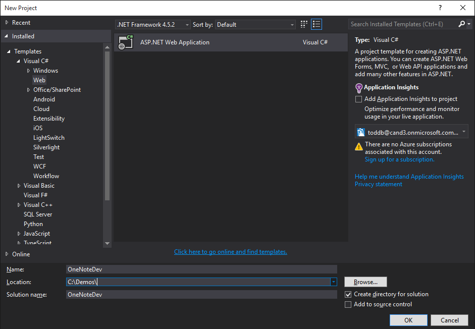
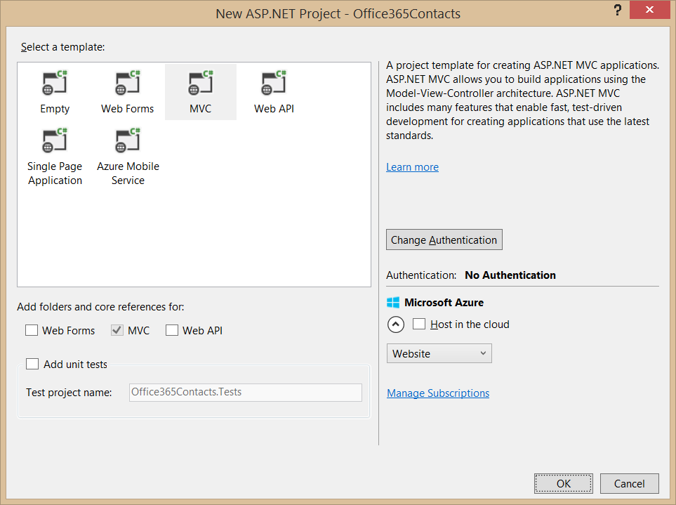

# Microsoft Graph for OneNote Services
In this lab, you will use Microsoft Graph to program against the Office 365 OneNote Service as part of an ASP.NET MVC5 application.

## Prerequisites
1. You must have an Office 365 tenant and Microsoft Azure subscription to complete this lab. If you do not have one, the lab for **O3651-7 Setting up your Developer environment in Office 365** shows you how to obtain a trial.
1. You must have Visual Studio 2015 with Update 1 installed.

## Exercise 1: Use the Microsoft Graph to access Notebooks in OneDrive for Business (Office 365)
In this exercise you will use the Microsoft Graph to access OneNote notebook that is stored in the user's OneDrive for Business in Office 365.

### Create an ASP.NET MVC5 Application
In this exercise, you will create the ASP.NET MVC5 application and register it with Azure active Directory.

1. Launch **Visual Studio 2015** as an administrator. 
1. In Visual Studio select **File/New/Project**.
1. In the **New Project** dialog, select **Templates/Visual C#/Web** and click **ASP.NET Web Application**. Name the new project **OneNoteDev** and then click **OK**.  
    
    
    > NOTE: Make sure you enter the exact same name for the Visual Studio Project that is specified in these lab instructions.  The Visual Studio Project name becomes part of the namespace in the code.  The code inside these instructions depends on the namespace matching the Visual Studio Project name specified in these instructions.  If you use a different project name the code will not compile unless you adjust all the namespaces to match the Visual Studio Project name you enter when you create the project.
    
1. In the **New ASP.NET Project** dialog, click **MVC** and then click **Change Authentication**.
1. Select **Work And School Accounts**, check **Read directory data** and click **OK**.

	

1. Uncheck **Host in the cloud**, once the **New ASP.NET Project** dialog appears like the following screenshot, click **OK**. 

	
    
1. At this point you can test the authentication flow for your application.
  1. In Visual Studio, press **F5**. The browser will automatically launch taking you to the HTTPS start page for the web application.

   > **Note:** If you receive an error that indicates ASP.NET could not connect to the SQL database, please see the [SQL Server Database Connection Error Resolution document](../../SQL-DB-Connection-Error-Resolution.md) to quickly resolve the issue. 

  1. To sign in, click the **Sign In** link in the upper-right corner.
  1. Login using your **Organizational Account**.
  1. Upon a successful login, since this will be the first time you have logged into this app, Azure AD will present you with the common consent dialog that looks similar to the following image:

    
  1. Click **Accept** to approve the app's permission request on your data in Office 365.
  1. You will then be redirected back to your web application. However notice in the upper right corner, it now shows your email address & the **Sign Out** link.
  1. In Visual Studio, press **Shift+F5** to stop debugging.

Congratulations... at this point your app is configured with Azure AD and leverages OpenID Connect and OWIN to facilitate the authentication process!

### Grant App Necessary Permissions
1. Browse to the [Azure Management Portal](https://manage.windowsazure.com) and sign in with your **Organizational Account**.
2. In the left-hand navigation, click **Active Directory**.
3. Select the directory you share with your Office 365 subscription.
4. Search for this app with the **ida:ClientId** that was created in 'Create an ASP.NET MVC5 Application' section.

    
5. Select the application. 
6. Open the **Configure** tab.
7. Scroll down to the **permissions to other applications** section. 
8. Click the **Add Application** button.
9. In the **Permissions to other applications** dialog, click the **PLUS** icon next to the **Microsoft Graph** option.
10. Click the **Check mark** icon in the lower right corner.
11. For the new **Microsoft Graph** application permission entry, select the **Delegated Permissions** dropdown on the same line and then select the following permissions:
    * **Read and write notebooks that the user can access (preview)**
12. Click the **Save** button at the bottom of the page.

### Create the OneNote API Repository
In this step you will create a repository class that will handle all communication with the OneNote API to interact with notebooks in your OneDrive for Business store.

1. This exercise will heavily leverage the OneNote REST API. To simplify working with the REST services, we will use the popular [JSON.NET](http://www.newtonsoft.com/json) JSON framework for .NET.
	1. Create a new folder in the project's **Models** folder named **JsonHelpers**.
	1. Copy all the C# files provided with this lab, located in the [\\\O3653\O3653-7 Deep Dive into the Office 365 APIs for OneNote services\Labs\Labfiles](Labs/Labfiles/JsonHelpers) folder, into this new **JsonHelpers** folder you just added in your project.

		> **Note:** These files were created using the handy utility in Visual Studio: [Paste JSON as Classes](http://blogs.msdn.com/b/webdev/archive/2012/12/18/paste-json-as-classes-in-asp-net-and-web-tools-2012-2-rc.aspx).

1. Create model objects for the OneNote notebook, section & page:
	1. Add a new class named **Notebook** to the **Models** folder in the project.
	1. Add the following code to the `Notebook` class:

		````c#
        public Notebook() {
            Sections = new List<Section>();
        }

        public string Id { get; set; }
        public string Name { get; set; }
        public string NotebookUrl { get; set; }
        public string ClientUrl { get; set; }
        public string WebUrl { get; set; }
        public bool IsDefault { get; set; }
        public DateTime CreatedDateTime { get; set; }
        public DateTime LastModifiedDateTime { get; set; }
        public string SectionsUrl { get; set; }
        public string SectionGroupsUrl { get; set; }
        public List<Section> Sections { get; set; }
		````

	1. Add a new class named **Section** to the **Models** folder in the project.
	1. Add the following code to the `Section` class:

		````c#
        public Section() {
        Pages = new List<NotePage>();
        }

        public string Id { get; set; }
        public string Name { get; set; }
        public DateTime CreatedDateTime { get; set; }
        public DateTime LastModifiedDateTime { get; set; }
        public string PagesUrl { get; set; }
        public List<NotePage> Pages { get; set; }
		````

	1. Add a new class named **NotePage** to the **Models** folder in the project.
	1. Add the following code to the `NotePage` class:

		````c#
        public string Id { get; set; }
        public string Name { get; set; }
        public DateTime CreatedDateTime { get; set; }
        public DateTime LastModifiedDateTime { get; set; }
        public string ContentUrl { get; set; }
        public string Content { get; set; }
        public string PageUrl { get; set; }
        public string WebUrl { get; set; }
        public string ClientUrl { get; set; }
		````

1. Create the repository class for communicating with the OneNote via Microsoft Graph:
	1. Add a new class to the **Models** folder named **NotebookRepository**.
	1. Ensure the following `using` statements are present at the top of the `NotebookRepository` class:

		````c#
        using System.Collections.Generic;
        using System.Linq;
        using System.Net.Http;
        using System.Security.Claims;
        using System.Threading.Tasks;
        using Microsoft.IdentityModel.Clients.ActiveDirectory;
        using Newtonsoft.Json;
        using System.Configuration;
		````

	1. Add the following private fields and class constructor to the `NotebookRepository` class:

		````c#
        private HttpClient _client;

        private string _oneNoteResourceId = string.Empty; 
        private string _oneNoteEndpoint = string.Empty; 

        public NotebookRepository()
        {
            _client = new HttpClient();
            _client.DefaultRequestHeaders.Add("Accept", "application/json");
        }
		````

	1. Next, add a new method `InitOneNoteRestConnection()` to the `NotebookRepository` class. This method will be used to obtain an access token, endpoint & resource ID for Microsoft Graph:

		````c#
        private async Task InitOneNoteRestConnection()
        {
            _oneNoteEndpoint = "https://graph.microsoft.com/beta";
            _oneNoteResourceId = "https://graph.microsoft.com/";
            var Authority = ConfigurationManager.AppSettings["ida:AADInstance"] + ConfigurationManager.AppSettings["ida:TenantId"];

            var signInUserId = ClaimsPrincipal.Current.FindFirst(ClaimTypes.NameIdentifier).Value;
            var userObjectId = ClaimsPrincipal.Current.FindFirst("http://schemas.microsoft.com/identity/claims/objectidentifier").Value;
            var clientCredential = new ClientCredential(ConfigurationManager.AppSettings["ida:ClientId"], ConfigurationManager.AppSettings["ida:ClientSecret"]);
            var userIdentifier = new UserIdentifier(userObjectId, UserIdentifierType.UniqueId);

            // create auth context
            AuthenticationContext authContext = new AuthenticationContext(Authority, new ADALTokenCache(signInUserId));
            var authResult = await authContext.AcquireTokenSilentAsync(_oneNoteResourceId, clientCredential, userIdentifier);

            // set the access token on all requests for onenote API
            _client.DefaultRequestHeaders.Add("Authorization", "Bearer " + authResult.AccessToken);

            return;
        }
		````

	1. Add a method to get a list of all OneNote notebooks for the currently logged in user's OneDrive for Business store. Add the following code to the `NotebookRepository` class:

		````c#
        public async Task<IEnumerable<Notebook>> GetNotebooks()
        {
            // ensure connection established to new onenote API
            if ((string.IsNullOrEmpty(_oneNoteEndpoint)) ||
                (string.IsNullOrEmpty(_oneNoteResourceId)))
            {
                await InitOneNoteRestConnection();
            }

            // create query
            var query = _oneNoteEndpoint + "/me/notes/notebooks";

            // create request
            var request = new HttpRequestMessage(HttpMethod.Get, query);

            // issue request & get response
            var response = await _client.SendAsync(request);
            string responseString = await response.Content.ReadAsStringAsync();
            var jsonResponse = JsonConvert.DeserializeObject<JsonHelpers.NotebooksJson>(responseString);

            // convert to model object
            var notebooks = new List<Notebook>();
            foreach (var notebook in jsonResponse.Notebooks)
            {
                var item = new Notebook
                {
                    Id = notebook.Id,
                    Name = notebook.Name,
                    NotebookUrl = notebook.NotebookUrl,
                    IsDefault = notebook.IsDefault,
                    CreatedDateTime = notebook.CreatedTime,
                    LastModifiedDateTime = notebook.LastModifiedTime,
                    SectionsUrl = notebook.SectionsUrl,
                    SectionGroupsUrl = notebook.SectionGroupsUrl,
                    ClientUrl = notebook.Links.OneNoteClientUrl.href,
                    WebUrl = notebook.Links.OneNoteWebUrl.href
                };

                notebooks.Add(item);
            }

            return notebooks.OrderBy(n => n.Name).ToList();
        }
		````

	1. Add the following code to get a single notebook based on the ID specified:

		````c#
        public async Task<Notebook> GetNotebook(string notebookid)
        {
            // ensure connection established to new onenote API
            if ((string.IsNullOrEmpty(_oneNoteEndpoint)) ||
                (string.IsNullOrEmpty(_oneNoteResourceId)))
            {
                await InitOneNoteRestConnection();
            }

            // create query
            var query = string.Format("{0}/me/notes/notebooks/?$top=1&$filter=id eq '{1}'", _oneNoteEndpoint, notebookid);

            // create request
            var request = new HttpRequestMessage(HttpMethod.Get, query);

            // issue request & get response
            var response = await _client.SendAsync(request);
            string responseString = await response.Content.ReadAsStringAsync();
            var jsonResponse = JsonConvert.DeserializeObject<JsonHelpers.NotebooksJson>(responseString).Notebooks[0];

            // convert to model object
            var notebook = new Notebook
            {
                Id = jsonResponse.Id,
                Name = jsonResponse.Name,
                NotebookUrl = jsonResponse.NotebookUrl,
                IsDefault = jsonResponse.IsDefault,
                CreatedDateTime = jsonResponse.CreatedTime,
                LastModifiedDateTime = jsonResponse.LastModifiedTime,
                SectionsUrl = jsonResponse.SectionsUrl,
                SectionGroupsUrl = jsonResponse.SectionGroupsUrl,
                ClientUrl = jsonResponse.Links.OneNoteClientUrl.href,
                WebUrl = jsonResponse.Links.OneNoteWebUrl.href
            };

            return notebook;
        }
		````

	1. Add the following code to get all the sections in the specified notebook using the Microsoft Graph. This should go in the `NotebookRepository` class.

		````c#
        public async Task<Notebook> GetNotebookSections(string notebookid)
        {
            var notebook = await GetNotebook(notebookid);
            return await GetNotebookSections(notebook);
        }

        public async Task<Notebook> GetNotebookSections(Notebook notebook)
        {
            // ensure connection established to new onenote API
            if ((string.IsNullOrEmpty(_oneNoteEndpoint)) ||
                (string.IsNullOrEmpty(_oneNoteResourceId)))
            {
                await InitOneNoteRestConnection();
            }

            // create query
            var query = notebook.SectionsUrl;

            // create request
            var request = new HttpRequestMessage(HttpMethod.Get, query);

            // issue request & get response
            var response = await _client.SendAsync(request);
            string responseString = await response.Content.ReadAsStringAsync();
            var jsonResponse = JsonConvert.DeserializeObject<JsonHelpers.SectionsJson>(responseString);

            // convert to model object
            foreach (var item in jsonResponse.Sections)
            {
                var section = new Section
                {
                    Id = item.Id,
                    Name = item.Name,
                    CreatedDateTime = item.CreatedTime,
                    LastModifiedDateTime = item.LastModifiedTime,
                    PagesUrl = item.PagesUrl
                };
                notebook.Sections.Add(section);
            }

            return notebook;
        }
		````
        
    1. Next, add the following code to load all the pages within the specified notebook section. This should also be added to the `NotebookRepository` class.

		````c#
        public async Task<Notebook> GetNotebookPages(string notebookid, string sectionid)
        {
            var notebook = await GetNotebook(notebookid);
            notebook = await GetNotebookSections(notebook);
            return await GetNotebookPages(notebook, sectionid);
        }

        public async Task<Notebook> GetNotebookPages(Notebook notebook, string sectionid)
        {
            // ensure connection established to new onenote API
            if ((string.IsNullOrEmpty(_oneNoteEndpoint)) ||
                (string.IsNullOrEmpty(_oneNoteResourceId)))
            {
                await InitOneNoteRestConnection();
            }

            HttpRequestMessage request = null;
            HttpResponseMessage response = null;
            string responseString;

            // for the specified section...
            var section = notebook.Sections.First(s => s.Id == sectionid);

            // get all the pages in the section
            request = new HttpRequestMessage(HttpMethod.Get, section.PagesUrl);
            response = await _client.SendAsync(request);

            // convert to JSON object
            responseString = await response.Content.ReadAsStringAsync();
            var jsonPages = JsonConvert.DeserializeObject<JsonHelpers.PagesJson>(responseString);

            // loop through all pages
            foreach (var jsonPage in jsonPages.Pages)
            {
                // convert pages to model objects
                var page = new NotePage
                {
                    Id = jsonPage.Id,
                    Name = jsonPage.Title,
                    CreatedDateTime = jsonPage.CreatedTime,
                    LastModifiedDateTime = jsonPage.LastModifiedTime,
                    PageUrl = jsonPage.PageUrl,
                    ClientUrl = jsonPage.Links.OneNoteClientUrl.href,
                    WebUrl = jsonPage.Links.OneNoteWebUrl.href,
                    ContentUrl = jsonPage.ContentUrl
                };

                // get the body of the page
                request = new HttpRequestMessage(HttpMethod.Get, page.ContentUrl);
                response = await _client.SendAsync(request);
                page.Content = await response.Content.ReadAsStringAsync();

                // add page to section
                section.Pages.Add(page);
            }

            return notebook;
        }
		````

	1. And finally, add the following method to delete a specified page:

		````c#
        public async Task DeletePage(string id)
        {
            // ensure connection established to new onenote API
            if ((string.IsNullOrEmpty(_oneNoteEndpoint)) ||
                (string.IsNullOrEmpty(_oneNoteResourceId)))
            {
                await InitOneNoteRestConnection();
            }

            // create query
            var query = string.Format("{0}/me/notes/pages/{1}", _oneNoteEndpoint, id);

            // create request
            var request = new HttpRequestMessage(HttpMethod.Delete, query);

            // issue request & get response
            await _client.SendAsync(request);
        }
		````

### Add Navigation
In this step you will create a link on home page to navigate to notebooks list page

1. Locate the **Views/Shared** folder in the project.
1. Open the **_Layout.cshtml** file found in the **Views/Shared** folder.
    1. Locate the part of the file that includes a few links at the top of the page... it should look similar to the following code:
    
    ````asp
    <div class="navbar-collapse collapse">
        <ul class="nav navbar-nav">
            <li>@Html.ActionLink("Home", "Index", "Home")</li>
            <li>@Html.ActionLink("About", "About", "Home")</li>
            <li>@Html.ActionLink("Contact", "Contact", "Home")</li>
        </ul>
        @Html.Partial("_LoginPartial")
    </div>
    ````

    1. Update that navigation to have a new link (the **Files (Graph)** link added below) as well as a reference to the login control you just created:

    ````asp
    <div class="navbar-collapse collapse">
        <ul class="nav navbar-nav">
            <li>@Html.ActionLink("Home", "Index", "Home")</li>
            <li>@Html.ActionLink("About", "About", "Home")</li>
            <li>@Html.ActionLink("Contact", "Contact", "Home")</li>
            <li>@Html.ActionLink("Notebooks", "Index", "Notebook")</li>
        </ul>
        @Html.Partial("_LoginPartial")
    </div>
    ````
    
### Add Notebook Controller & View
In this step you will create the ASP.NET MVC controller and view for OneNote notebooks.

1. Right-click the **Controllers** folder in the project and select **Add / Controller**.
	1. In the **Add Scaffold** dialog, select **MVC 5 Controller - Empty**.
	1. Click **Add**.
	1. When prompted for a name, enter **NotebookController**.
	1. Click **Add**.
1. Within the `NotebookController` class, add the following using statement:

	````c#
	using System.Threading.Tasks;
	using OneNoteDev.Models;
	````

1. Update `Index()` action as following to support viewing all notebooks:

    ````c#
    [Authorize]
    public async Task<ActionResult> Index()
    {
        var repository = new NotebookRepository();

        var myNotebooks = await repository.GetNotebooks();

        return View(myNotebooks);
    }
    ````

1. Now add a view to render a list of the notebooks.
	1. Right-click in the `Index()` method and select **Add View**.
    1. Within the **Add View** dialog, set the following values:
        - View Name: **Index**.
        - Template: **List**.
        - Model class: **Notebook (OneNoteDev.Models)**.
        - Data context class: <blank>
        - Create as partial view: **checked**
        - Reference script libraries: **unchecked**
    1. Click **Add**.
1. **Replace** all of the code in the file with the following:

	````html
	@model IEnumerable<OneNoteDev.Models.Notebook>

	<h1>
	  OneNote Notebooks
	</h1>

	<table class="table">
	  <tr>
	    <th>
	      @Html.DisplayNameFor(model => model.Name)
	    </th>
	    <th>
	      @Html.DisplayNameFor(model => model.CreatedDateTime)
	    </th>
	    <th>
	      @Html.DisplayNameFor(model => model.LastModifiedDateTime)
	    </th>
	    <th></th>
	  </tr>

	  @foreach (var item in Model) {
	    <tr>
	      <td>
	        @Html.DisplayFor(modelItem => item.Name)
	      </td>
	      <td>
	        @Html.DisplayFor(modelItem => item.CreatedDateTime)
	      </td>
	      <td>
	        @Html.DisplayFor(modelItem => item.LastModifiedDateTime)
	      </td>
	      <td>
	        @Html.RouteLink("View Sections", "Section", new { notebookid = item.Id, action = "Index" })
	      </td>
	    </tr>
	  }
	</table>
	````

### Add Notebook Section Controller & View
In this step you will create the ASP.NET MVC controller and view for OneNote notebook sections.

1. Right-click the **Controllers** folder in the project and select **Add / Controller**.
	1. In the **Add Scaffold** dialog, select **MVC 5 Controller - Empty**.
	1. Click **Add**.
	1. When prompted for a name, enter **SectionController**.
	1. Click **Add**.
1. Within the `SectionController` class, add the following using statement:

	````c#
	using System.Threading.Tasks;
	using OneNoteDev.Models;
	````

1. Update `Index()` action as following to support viewing all notebook sections:

    ````c#
    [Authorize]
    public async Task<ActionResult> Index(string notebookid)
    {
        var repository = new NotebookRepository();

        var notebook = await repository.GetNotebookSections(notebookid);

        ViewBag.CurrentNotebookTitle = notebook.Name; ViewBag.CurrentNotebookId = notebook.Id;

        return View(notebook.Sections.OrderBy(s => s.Name).ToList());
    }
    ````

1. Now add a view to render a list of the notebook sections.
	1. Right-click in the `Index()` method and select **Add View**.
    1. Within the **Add View** dialog, set the following values:
        - View Name: **Index**.
        - Template: **List**.
        - Model class: **Section (OneNoteDev.Models)**.
        - Data context class: <blank>
        - Create as partial view: **checked**
        - Reference script libraries: **unchecked**
    1. Click **Add**.
1. **Replace** all of the code in the file with the following:

	````html
	@model IEnumerable<OneNoteDev.Models.Section>

	<h1>
	  Sections within Notebook: @ViewBag.CurrentNotebookTitle
	</h1>

	<table class="table">
	  <tr>
	    <th>
	      @Html.DisplayNameFor(model => model.Name)
	    </th>
	    <th>
	      @Html.DisplayNameFor(model => model.CreatedDateTime)
	    </th>
	    <th>
	      @Html.DisplayNameFor(model => model.LastModifiedDateTime)
	    </th>
	    <th></th>
	  </tr>

	  @foreach (var item in Model) {
	    <tr>
	      <td>
	        @Html.DisplayFor(modelItem => item.Name)
	      </td>
	      <td>
	        @Html.DisplayFor(modelItem => item.CreatedDateTime)
	      </td>
	      <td>
	        @Html.DisplayFor(modelItem => item.LastModifiedDateTime)
	      </td>
	      <td>
	        @Html.RouteLink("View Pages", "Page", new { notebookid = ViewBag.CurrentNotebookId, sectionid = item.Id, action = "Index" })
	      </td>
	    </tr>
	  }
	</table>
	````

1. For this controller you will need to create a special route.
	1. Open the file **App_Start / RouteConfig.cs**.
	1. Add the following code before the existing *default* route:

		````c#
		routes.MapRoute(
		  "Section",
		  "Notebooks/{notebookid}/Section/{action}",
		  new { controller = "Section", action = "Index" }
		);
		````

### Add Notebook Pages Controller & View
In this step you will create the ASP.NET MVC controller and view for pages within OneNote notebook sections.

1. Right-click the **Controllers** folder in the project and select **Add / Controller**.
	1. In the **Add Scaffold** dialog, select **MVC 5 Controller - Empty**.
	1. Click **Add**.
	1. When prompted for a name, enter **PageController**.
	1. Click **Add**.
1. Within the `PageController` class, add the following using statement:

	````c#
	using System.Threading.Tasks;
	using OneNoteDev.Models;
	````

1. Update `Index()` action as following to support viewing all pages within a notebook section:

	````c#
    [Authorize]
    public async Task<ActionResult> Index(string notebookid, string sectionid)
    {
        var repository = new NotebookRepository();
        var notebook = await repository.GetNotebookPages(notebookid, sectionid);
        ViewBag.CurrentNotebookTitle = notebook.Name;
        ViewBag.CurrentNotebookId = notebook.Id;
        var section = notebook.Sections.First(s => s.Id == sectionid);
        ViewBag.CurrentSectionTitle = section.Name;
        return View(section.Pages);
    }
	````

1. Add the following action to support deleting a page:

	````c#
    [Authorize]
    public async Task<ActionResult> Delete(string id)
    {
        var repository = new NotebookRepository();
        if (id != null)
        {
            await repository.DeletePage(id);
        }
        return Redirect("/");
    }
	````

1. Now add a view to render a list of the notebook sections.
	1. Right-click in the `Index()` method and select **Add View**.
    1. Within the **Add View** dialog, set the following values:
        - View Name: **Index**.
        - Template: **List**.
        - Model class: **NotePage (OneNoteDev.Models)**.
        - Data context class: <blank>
        - Create as partial view: **checked**
        - Reference script libraries: **unchecked**
    1. Click **Add**.
1. **Replace** all of the code in the file with the following:

	````html
	@model IEnumerable<OneNoteDev.Models.NotePage>

	<h1>
	  Pages within Notebook: @ViewBag.CurrentNotebookTitle, Section: @ViewBag.CurrentSectionTitle
	</h1>

	<table class="table">
	  <tr>
	    <th>
	      @Html.DisplayNameFor(model => model.Name)
	    </th>
	    <th>
	      @Html.DisplayNameFor(model => model.CreatedDateTime)
	    </th>
	    <th>
	      @Html.DisplayNameFor(model => model.LastModifiedDateTime)
	    </th>
	    <th></th>
	  </tr>

	  @foreach (var item in Model) {
	    <tr>
	      <td>
	        @Html.DisplayFor(modelItem => item.Name)
	      </td>
	      <td>
	        @Html.DisplayFor(modelItem => item.CreatedDateTime)
	      </td>
	      <td>
	        @Html.DisplayFor(modelItem => item.LastModifiedDateTime)
	      </td>
	      <td>
	        <a href="@item.WebUrl" target="_blank">View in OneNote Web Client</a> |
	        @Html.ActionLink("Delete", "Delete", new { id = item.Id })
	      </td>
	    </tr>
	  }
	</table>
	````

1. For this controller you will need to create a special route.
	1. Open the file **App_Start / RouteConfig.cs**.
	1. Add the following code before the route you previously added for the sections:

		````c#
		routes.MapRoute(
		  "Page",
		  "Notebooks/{notebookid}/Section/{sectionid}/{action}",
		  new { controller = "Page", action = "Index", id = UrlParameter.Optional }
		);
		````

### Test the Application
The last step is to test the application you just created!

1. Press **F5** in Visual Studio to launch the application.

 > **Note:** If you receive an error that indicates ASP.NET could not connect to the SQL database, please see the [SQL Server Database Connection Error Resolution document](../../SQL-DB-Connection-Error-Resolution.md) to quickly resolve the issue. 

1. When the browser loads, click the **Sign in** link in the upper right corner and login using your Office 365 credentials.

	After logging in you will be taken back to your ASP.NET MVC application. 

1. Click the **Notebooks** link in the top navigation. You will see a list of notebooks that are currently in your OneDrive for Business store listed.
1. Click one of the notebook's **View Sections** links. You will see a list of the sections within the selected notebook.
1. Click one of the section's **View Pages** links. You will see a list of the pages within that section.
1. Click one of the page's **View in OneNote Web Client** links to see a new browser window load the notebook's page within the browser.
1. Go back to your application and click one of the page's **Delete** links. The page will be deleted and you will be taken back to the homepage of the application. If you navigate back to the list of pages within the section, you will see the page is no longer listed.

Congratulations! You have created an ASP.NET MVC application that uses the Microsoft Graph to interact with OneNote Notebooks found within a user's OneDrive for Business store.


