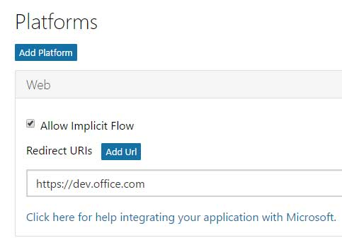
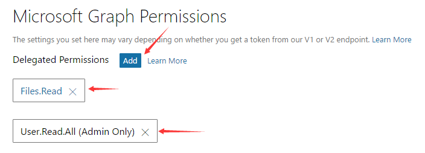
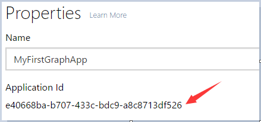
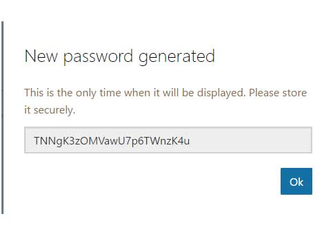

# Deep Dive into the Microsoft Graph API
In this lab, you will use the Microsoft Graph to access & program against Office 365 data using both the raw REST API and the SDK.

## Prerequisites
1. You must have an Office 365 tenant and Microsoft Azure subscription to complete this lab. If you do not have one, the lab for **O3651-7 Setting up your Developer environment in Office 365** shows you how to obtain a trial.
2. You must have access to an Exchange mailbox within an Office 365 developer tenancy.
3. You must have some files within your Office 365 OneDrive for Business. 
4. You must have Fiddler (http://www.telerik.com/fiddler) or another HTTP debugging proxy tool installed to complete exercise 2.
5. You must have Visual Studio 2015 with the latest Update installed to complete exercise 3. 
6. This lab requires you to use multiple starter files or an entire starter project from the GitHub location. You can either download the whole repo as a zip or clone the repo https://github.com/OfficeDev/TrainingContent.git for those familiar with git.

## Exercise 1: Register application for the Microsoft Graph 
In this exercise, you will register an application in Application Registration Portal.

1. Within a browser, navigate to the **Application Registration Portal**: https://apps.dev.microsoft.com
2. Sign in with either an Azure AD user or a Microsoft account (e.g. admin@sample.onmicrosoft.com).
3. Click the **Add an app** button at the top right corner. 
4. In the **New Application Registration** wizard, enter a name of **MyFirstGraphApp**. Click the **Create application** button to the next page.
5. In the **MyFirstGraphApp Registration** page, click the **Add Platform** button.
6. In the **Add Platform** wizard, select **Mobile application**
7. Click the **Add Platform** button again and select **Web**.
8. In the **Redirect URLs** text box, enter **https://dev.office.com**. 
	
9. In the **Microsoft Graph Permissions** section, click **Add** button next **Delegated Permissions**.
10. In the **Select Permission** wizard, Select **User.Read.All**, **Files.Read** permissions.
	
11. Copy the **Application Id** to a text file as you will need them later in this lab.
	
12. In the **Application Secrets** section, click the **Generate New Password** button.
13. In the **New Password Generated** popup, copy the password and paste it in a text file to use later.
	
14. Click the **Save** button at the bottom left corner.

## Exercise 2: Use the Raw REST API Interface of the Microsoft Graph
In this exercise, you will use the raw REST API interface of the Microsoft Graph to interact with the different capabilities. In order to call the Microsoft Graph, you must pass along a valid OAuth2 access token. To obtain an access token you must first authenticate with Azure AD and obtain an authorization code.

### Authenticate & Obtain an Authorization Code from Azure AD 
Use the Azure AD authorization endpoint to authenticate & obtain an authorization code.

1. Take the following URL and replace the `{tenant-id}` & `{client-id}` tokens with values obtained / set on the registered application.

	````
	https://login.microsoftonline.com/{tenant-id}/oauth2/authorize?
	client_id={client-id}
	&resource=https://graph.microsoft.com/
	&redirect_uri=https://dev.office.com
	&response_type=code
	````

2. Open Fiddler.
3. Open a browser navigate to the above URL after you replaced the tokens. Be sure to remove any line breaks from the above URL that were added for readability.
	1. You will be prompted to login using the same account you used to register the application.
	1. After logging in you will be taken to a non-existent page. This is not an error, there is just no site setup for this application yet. The important information is in the actual data sent to the page.
4. Open Fiddler and find the last session that took you to the current page after logging into Azure AD. The following figure shows what Fiddler will likely look like for you, with the highlighted session you are interested in. Specifically, you are looking for a session that has a `/?code=` in the URL:

	

	> NOTE: To simplify the screenshot, session requests for script & image files have been removed.

5. With the session selected in Fiddler, click the **Inspector** tab and then click the **WebForms** button. This will show a list of all the values submitted to the current page.
6. Copy the value for the **code** to the text file; this is the authorization code that can be used to obtain an access token.

## Obtain an OAuth2 Access Token for the Microsoft Graph
Use the Azure AD token endpoint to obtain an access token for the Microsoft Graph using the authorization code you just obtained.

1. Take the following URL and replace the `{tenant-id}` token with the values obtained in the previous exercise:

	````
	https://login.microsoftonline.com/{tenant-id}/oauth2/token
	```` 

2. Within Fiddler, click the **Composer** tab.
3. Set the HTTP action to **POST** and copy the URL above with the replaced token into the address path.
4. Within the box just below the HTTP action & URL, add the following HTTP headers:

	````
	Accept: application/json
	Content-Type: application/x-www-form-urlencoded
	````

5. Now, take the following and replace the `{client-id}` token with the value from the first exercise. Replace the `{url-encoded-client-secret}` token with the URL encoded value of the client secret from the first exercise in the lab.

	> To get the URL encoded value, search for the phrase *url encode* on [http://www.bing.com]. It will display a utility to paste the value you obtained in the first exercise and convert it to the URL encoded version.
	
	Lastly, replace the `{authorization-code}` token with the code that you got from the previous step, using Fiddler.

	````
	grant_type=authorization_code
	&redirect_uri=https://dev.office.com
	&client_id={client-id}
	&client_secret={url-encoded-client-secret}
	&resource=https://graph.microsoft.com
	&code={authorization-code}
	````

6. Take the resulting string from all the previous changes and paste it into the **Request Body** box within the **Composer** tab. Be sure to remove all line breaks form the string so you are left with something that looks like the following:

	  

7. Click the **Execute** button to make the request.
8. Select the session that was just created and click the **Inspectors** tab. Here you see the all the values that were submitted in the request.
9. Click the **JSON** button in the lower part of the **Inspector** tab. This contains the access and refresh tokens from the successful request. 
10. Copy & save the access token just like you've done with the client ID, secret & tenant ID in the previous exercise.

	  

### Issue Requests to the Microsoft Graph REST Endpoint
Now that you have an access token, create a few requests to the Microsoft Graph REST endpoint.

1. First get information about the currently logged in user from the Microsoft Graph. Within Fiddler's **Composer** tab, do the following:
	1. Set the HTTP action to **GET**.
	2. Set the endpoint URL to **https://graph.microsoft.com/v1.0/me**
	3. Set the HTTP headers to the following values, replacing the `{access-token}` token to the actual token you just obtained in the last step:
	
		````
		Accept: application/json
		Authorization: Bearer {access-token}
		````

		>NOTE: Please add one header each time. If you copy and paste the 2 headers one time, Fiddler may take them as one line and one header, rusulting in error with 401 status code.

	4. Clear the box for the **Request Body**.
	5. Click the **Execute** button.
	6. Select the session you just created and click the **Inspectors** tab. Look at the results that came back to find information about you, the currently logged in user.
	
2. Look at the files in your OneDrive for Business. *This assumes you have at least some files within your OneDrive for Business account... if not the payload returned with be empty*:
	1. Within the Fiddler **Composer** tab...
	2. Set the endpoint URL to **https://graph.microsoft.com/v1.0/me/drive/root/children**
	3. Leave the same HTTP headers in place & click the **Execute** button.
	4. Select the session you just created and click the **Inspectors** tab. Look at the results that came back to find information about the files within your OneDrive for Business account.

3. Now, see how you can query for any user's information provided you have access to it.
	1. Within the Fiddler **Composer** tab...
	2. Set the endpoint URL to the following, replacing the `{tenant-id}` and `{user-id}` with the values for your tenant: **https://graph.microsoft.com/v1.0/{tenant-id}/users/{user-id}**
	3. Leave the same HTTP headers in place & click the **Execute** button.
	4. Select the session you just created and click the **Inspectors** tab. Look at the results and notice you are now seeing the details of a user within your Azure AD directory!
	
4. Next, try something the app has not been created access to. In the first exercise the app was not given access to Office 365 Contacts. Try to access contacts to see the error that is returned:
	1. Within the Fiddler **Composer** tab...
	2. Set the endpoint URL to the following, replacing the `{tenant-id}` and `{user-id}` with the values for your tenant: **https://graph.microsoft.com/v1.0/{tenant-id}/users/{user-id}/contacts**.
		>NOTE: Please replace `{user-id}` with the id of a user with some contacts except the user you logged in with to get the authorization code.
	3. Leave the same HTTP headers in place & click the **Execute** button.
	4. Select the session you just created and click the **Inspectors** tab. Notice the request generated a HTTP 403 error with an error message of *Access is denied. Check credentials and try again.*

In this exercise, you used the raw REST API interface of the Microsoft Graph to interact with the different capabilities. 


## Exercise 3: Use the Microsoft Graph in an Native Client Application 
In this exercise, you will use the Microsoft Graph within a Windows 10 application.


### Prepare the Visual Studio Solution
Take an existing starter project and get it ready to write code that will use the Microsoft Graph.

1. Locate the [MSAL Lab Files](./MSAL Lab Files) folder that contains a starter project that contains the framework of a Windows 10 application that you will update to call the Microsoft Graph using the native for the Microsoft Graph. Open the solution **O365-Win-Profile** in Visual Studio.
2. In the Solution Explorer, right-click the **O365-Win-Profile** solution node and select **Restore NuGet Packages**.
3. Add the registered application's client ID to the project. Open the **App.xaml** file and locate the XML element with the string **ida:ClientID** in it. Paste in the GUID Client ID of the application you copied previously in this XML element.
4. Update the scopes for the application. Open the file **AuthenticationHelper.cs** and locate the line that looks like this:

	````c#
	public static string[] Scopes = {
            "https://graph.microsoft.com/User.Read.All"
        };
	````
	
	Update the scopes to the following values
	````c#
	public static string[] Scopes = {
            "https://graph.microsoft.com/User.Read.All",
            "https://graph.microsoft.com/Directory.Read.All",
            "https://graph.microsoft.com/Group.Read.All",
            "https://graph.microsoft.com/Files.Read"
        };
	````

### Update the Application to get GraphServiceClient object.
1. Open the file **AuthenticationHelper.cs**.
2. Update the **GetGraphServiceAsync** function to get GraphServiceClient:
	1. Locate the function `GetGraphServiceAsync()`.
	2. Replace the existing `return null;` line with the following code:

	   ````c#
       var accessToken = await GetGraphAccessTokenAsync();
       var graphserviceClient = new GraphServiceClient(url,
                                          new DelegateAuthenticationProvider(
                                                        (requestMessage) =>
                                                        {
                                                            requestMessage.Headers.Authorization = new AuthenticationHeaderValue("bearer", accessToken);
                                                            return Task.FromResult(0);
                                                        }));

        return graphserviceClient;
		````

### Update the Application to Retrieve Data via the Microsoft Graph
*Now you will update the project's codebase to retrieve data from the Microsoft Graph to display the values within the Windows 10 application.*

1. Open the file **UserOperations.cs**.
2. Update the **GetUsersAsync** function to get users from your Azure AD directory:
	1. Locate the function `GetUsersAsync()`.
	2. Replace the existing `return null;` line with the following code:

		````c#
        try
        {
            var graphServiceClient = await AuthenticationHelper.GetGraphServiceAsync(AuthenticationHelper.EndpointUrl);
            var userCollection = await graphServiceClient.Users.Request().
                                          Filter(string.Format("userType eq 'Member'")).
                                          Select("id,displayName,jobTitle").GetAsync();
            return userCollection.CurrentPage.ToList();
        }
        catch (Exception el)
        {
            el.ToString();
        }
        return null;
		````

3. Update the **GetUserAsync** function to get details on a specific user:
	1. Locate the function `GetUserAsync(string userId)`.
	2. Replace the existing `return null;` line with the following code:
	
		````c#
        try
        {
            var graphServiceClient = await AuthenticationHelper.GetGraphServiceAsync(AuthenticationHelper.EndpointUrl);
            UserRequestBuilder userBuilder = new UserRequestBuilder(string.Format("{0}/users/{1}", AuthenticationHelper.EndpointUrl, userId),
                                                                   graphServiceClient);
            return await userBuilder.Request().Select("id,displayName,jobTitle,email,userPrincipalName,department,mobilePhone,city,country,streetAddress").GetAsync();
        }
        catch (Exception el)
        {
            el.ToString();
        }
        return null;
		````

4. Update the **GetUserManagerAsync** function to get a specific user's direct manager:
	1. Locate the function `GetUserManagerAsync(string userId)`.
	2. Replace the existing `return null;` line with the following code:
	
		````c#
        try
        {
            var graphServiceClient = await AuthenticationHelper.GetGraphServiceAsync(AuthenticationHelper.EndpointUrl);

            UserRequestBuilder userBuilder = new UserRequestBuilder(string.Format("{0}/users/{1}", AuthenticationHelper.EndpointUrl, userId),
                                                                   graphServiceClient);
            User user = (await userBuilder.Manager.Request().GetAsync()) as User;
            return user;
        }
        catch (Exception el)
        {
            el.ToString();
        }
        return null;
		````

5. Update the **GetUserDirectReportsAsync** function to get a specific user's direct reports:
	1. Locate the function `GetUserDirectReportsAsync(string userId)`.
	2. Replace the existing `return null;` line with the following code:
	
		````c#
        try
        {
            var graphServiceClient = await AuthenticationHelper.GetGraphServiceAsync(AuthenticationHelper.EndpointUrl);
            var directReportsBuilder = new UserDirectReportsCollectionWithReferencesRequestBuilder(string.Format("{0}/users/{1}/directReports", AuthenticationHelper.EndpointUrl, userId),
                                                                                           graphServiceClient);
            var directReport = (await directReportsBuilder.Request().GetAsync()).CurrentPage.ToList();

            return directReport;
        }

        catch (Exception el)
        {
            el.ToString();
        }
        return null;
		````

6. Update the **GetUserGroupsAsync** function to get all the groups a user belongs to:
	1. Locate the function `GetUserGroupsAsync(string userId)`.
	2. Replace the existing `return null;` line with the following code:
	
		````c#
        try
        {
            var graphServiceClient = await AuthenticationHelper.GetGraphServiceAsync(AuthenticationHelper.EndpointUrl);
            UserRequestBuilder userBuilder = new UserRequestBuilder(string.Format("{0}/users/{1}", AuthenticationHelper.EndpointUrl, userId),
                                                       graphServiceClient);
            var groups = (await userBuilder.MemberOf.Request().GetAsync()).CurrentPage.ToList();
            var retGroups = groups.Where(i => i is Group).ToList();
            return retGroups;
        }

        catch (Exception el)
        {
            el.ToString();
        }
        return null;
		````

7. Update the **GetUserFilesAsync** function to get a specified user's files:
	1. Locate the function `GetUserFilesAsync(string userId)`.
	2. Replace the existing `return null;` line with the following code:
	
		````c#
        try
        {
            var graphServiceClient = await AuthenticationHelper.GetGraphServiceAsync(AuthenticationHelper.EndpointUrl);
            UserRequestBuilder userBuilder = new UserRequestBuilder(string.Format("{0}/users/{1}", AuthenticationHelper.EndpointUrl, userId),
                                                       graphServiceClient);
            return (await userBuilder.Drive.Root.Children.Request().GetAsync()).CurrentPage.ToList();
        }

        catch (Exception el)
        {
            el.ToString();
        }
        return null;
		````

8. Update the **GetPhotoAsync** function to get a specified user's files:
	1. Locate the function `GetPhotoAsync(string userId)`.
	2. Replace the existing `return null;` line with the following code:
	
		````c#
        BitmapImage bitmap = null;
        try
        {
            var graphServiceClient = await AuthenticationHelper.GetGraphServiceAsync(AuthenticationHelper.EndpointUrl);
            var photoStream = await graphServiceClient.Users[userId].Photo.Content.Request().GetAsync();

            var memStream = new MemoryStream();
            await photoStream.CopyToAsync(memStream);
            memStream.Position = 0;
            bitmap = new BitmapImage();
            await bitmap.SetSourceAsync(memStream.AsRandomAccessStream());
        }
        catch (Exception el)
        {
            el.ToString();
        }
        if (bitmap == null)
        {
            Debug.WriteLine("Unable to find an image at this endpoint.");
            bitmap = new BitmapImage(new Uri("ms-appx:///assets/UserDefault.png", UriKind.RelativeOrAbsolute));
        }
        return bitmap;
		````

9. Save your changes to the file.

### Test the Project
1. With all the changes complete, configure the following setting:

     

2. Press **F5** to build & run the project.
3. When prompted, login using your Azure AD account.
4. After successfully logging in, you will see the application load a list of all the users in your Azure AD directory.
5. Select one of the users and you will see it get populated with data from the Azure AD directory.


In this exercise, you used the Microsoft Graph SDK within Windows 10 application.


Congratulations! In this lab you have registered your first application that utilized the Microsoft Graph SDK!
