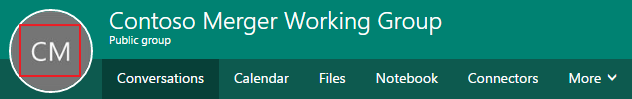
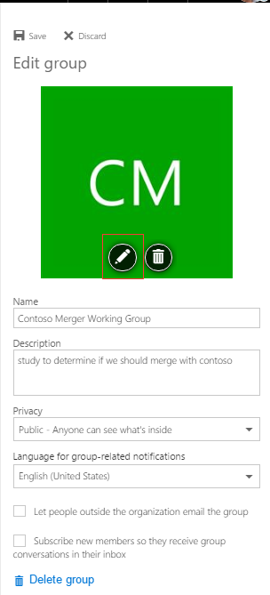
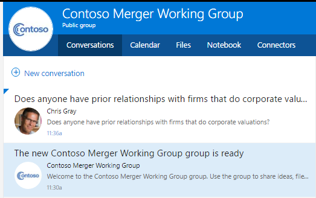
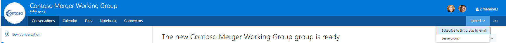
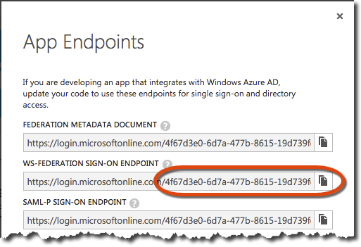
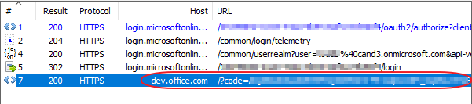
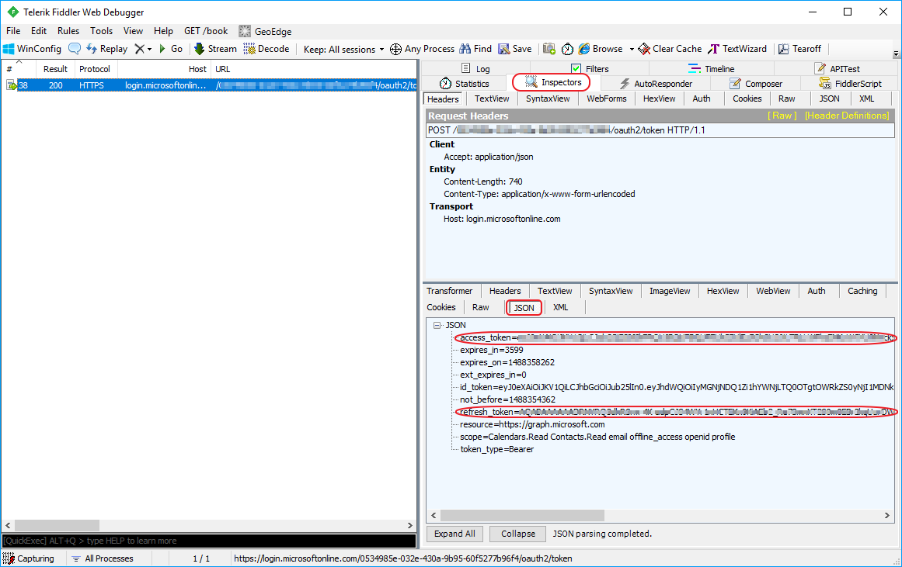

**Note: If you wish to see the MSAL version of these samples please [click here](MSAL%20Lab.md).**

# Deep Dive into the Microsoft Graph for Office 365 Groups
In this lab, you will use the Microsoft Graph to access and program against Office 365 Groups using Fiddler and MVC web app.

## Prerequisites
1. You must have an Office 365 tenant and Microsoft Azure subscription to complete this lab. If you do not have one, the lab for **O3651-7 Setting up your Developer environment in Office 365** shows you how to obtain a trial.
1. You must have access to an Exchange mailbox within an Office 365 developer tenancy.
1. You must have Fiddler (http://www.telerik.com/fiddler) or another HTTP debugging proxy tool installed to complete exercise 3.
1. You must have Visual Studio 2015 with Update 1 installed.
1. This lab requires you to use multiple starter files or an entire starter project from the GitHub location. You can either download the whole repo as a zip or clone the repo https://github.com/OfficeDev/TrainingContent.git for those familiar with git.


## Exercise 1: Create and Interact with Office 365 Groups using the Browser
In this exercise, you will use the browser to create and interact with Office 365 Groups. You'll want to ensure you have a few users in your Office 365 tenant that you can use. For this lab we've created the following users ahead of time:

	- Janice Galvin (janice.galvin@<tenantid>.onmicrosoft.com)
	- Ken Sanchez (ken.sanchez@<tenantid>.onmicrosoft.com)
	- Maria Anders (maria.anders@<tenantid>.onmicrosoft.com)
	- Rob Walters (rob.walters@<tenantid>.onmicrosoft.com)
	- Thomas Hardy (thomas.hardy@<tenantid>.onmicrosoft.com) 

Using these accounts, create and interact with some groups using the web interface.

### Create a New Group 
1. Within a browser, navigate to the **https://mail.office365.com** site & login using a valid account *(in this step, we will use Rob Walters)*.
1. Create a new group named **Contoso Merger Working Group**.
   1. In the left navigation, locate & click the **PLUS** icon.

      

   1. Set the name to **Contoso Merger Working Group** & give it a description as shown in the following figure.
      

   1. Click the **Create** button at the top to create the group.

1. After creating the group, you will be prompted to add a user as a member to the group. Add one of your test users to the group *(in this step we used Janice Galvin)*.
1. After creating the group it will appear in the left-hand navigation and indicated with a tile that contains letters from the group's name. 
   1. Update the logo for the group to be more descriptive. Click the pencil icon in the center of the group logo.
      	

   1. Then Click the pencil icon to change group icon.

      	       
               
   1. Select the **contoso.png** file in the [\\\O3653\O3653-9 Deep Dive into Office 365 with the Microsoft Graph API for Groups\Lab Files](Lab Files) folder within this lab as the new icon for the group.
   1. Click **Save** button. 
1. With the icon set, start up a conversation in the group that other members can participate in.
   1. Click the **New conversation** link in the middle-pane and enter the following message:
      ```
	  Does anyone have prior relationships with firms that do corporate valuations?
	  ```
	
   1. Once you send the message, you will see the message appear in the list of conversations:
      	

1. At this point the current user (*Rob Walters*) is not subscribed to the group. Ideally all messages to this group should show up in his mailbox. To do this, right click the group name on left-hand navigation, select **View Details**, then click the eclipse button and then click **Subscribe**.
    > Conversations are just one of the features available in groups. In addition to conversations there is a shared calendar, files, notebook and other options. Feel free to explore and add additional content.
	
    	

### Interact with the Group as a Member
1. In the last section you added another user (*Janice Galvin*) as a member when you created the group. Login as this user on the same **https://mail.office365.com** site.
1. Once you login, you will see the **Contoso Merger Working Group** listed in the left-hand navigation. Select the group.
1. Locate the conversation that was created in the previous step & click the **reply all** link to leave a comment:
    ```
    I used to work for a valuation firm... let me dig up a contact and get back to you.
    ```

1. You will see the conversation update with the message you just added.
1. Logout of **https://mail.office365.com** and login as the original user (*Rob Walters*).
    

1. Notice that when you login, the message will appear in their email inbox, not just in the group's conversations view. This is because you subscribed to the conversations.

### Search and join an Office 365 Group as another user
1. Now let's try to find the group as another user. Login as a new user (*in this step we used **Thomas Hardy**).
1. Once logged in, click the **More** link in the left-hand navigation.
    
    

1. Select **Discover** menu.
 
    

1. Enter **contoso** as the search term and press **ENTER**.

    

1. Select the group **Contoso Merger Working Group** & click the **Join** button to join the group.
1. You should now be able to go back to main page for your inbox and see the group listed in the left-hand pane. Notice that you can see all the conversations and other aspects of the group.

In this exercise you created and interacted with Office 365 Groups using the browser interface. 

## Exercise 2: Create an Azure AD Application with Necessary Permissions for the Microsoft Graph 

In this exercise, you will create an Azure AD application using the Azure Management portal and grant the application the necessary permissions to work with the Microsoft Graph.

1. Within a browser, navigate to the **Azure Management Portal**: https://manage.windowsazure.com
1. Enter the email address and password of an account that have permissions to manage the directory of the Azure AD tenant (e.g. admin@sample.onmicrosoft.com).
1. In the left-hand navigation, scroll down and click on Active Directory.
1. Click on the name of a directory to select it and display. Depending on the state of your portal, you will see the Quick Start page, or the list of Users. On either page, click **Applications** in the toolbar. 
    

1. Click the **Add** button at the bottom of the display.
1. On the **What do you want to do** page, click **Add an application my organization is developing**. This will start the **Add Application** wizard.
1. In the **Add Application** wizard, enter a name of **My First Groups API App** and choose the type **Web Application and/or Web API**. Click the arrow to advance to the next page of the wizard.
1. In the **App Properties** page, enter a **SIGN-ON URL** of **https://dev.office.com**
1. Enter an **App ID Uri** of **http://[your-O365-tenant-id].onmicrosoft.com/GroupsApiApp**.
    > NOTE: The App ID Uri must be unique within the Azure tenancy. Using a host name that matches your tenant name helps to prevent confusion, and using a value for the path that matches the app name helps to enforce uniqueness. This value can be changed if the app name or purpose changes.

1. Click the **check** image in the lower right of the wizard to create the application. The application Quick Start page will display once the application is created.
    

1. On the application Quick Start page, click on **CONFIGURE** in the toolbar.
1. Scroll down to the **Keys** section. 
   1. In the **Select Duration** dropdown, select **1 year**. 
   1. Then click the **Save** button at the bottom of the page.
      *The page will refresh and include the value of the key. In addition, a message is displayed advising that the key will not be shown a second time.*

1. For both the **Client ID** and **Key**, copy these values to a text file as you will need them later in this lab.
    

### Grant App Necessary Permissions
1. Scroll down to the **permissions to other applications** section. 
  1. Click the **Add Application** button.
  1. In the **Permissions to other applications** dialog, click the **PLUS** icon next to the **Microsoft Graph** option.
  1. Click the **CHECK** icon in the lower right corner.
  1. For the new **Microsoft Graph** application permission entry, select the **Delegated Permissions** dropdown on the same line and then select the following permissions:
     - Read all groups
     - Read directory data
  1. Click the **Save** button at the bottom of the page.

### Get the Azure AD Tenant ID
1. Click on the **View Endpoints** button in the gutter at the bottom of the page.
1. The dialog that appears you will see a list of a number of different endpoints. All of them contain a GUID which is the unique ID of the Azure AD tenant for the application as shown in the following figure:
    

	**Copy the GUID from any of the URLs and save them to a text file, just like you did for the client ID & key earlier, as you will need this later.** 

In this exercise you created an Azure AD application using the Azure Management portal and granted the application the necessary permissions to work with the Groups API.

## Exercise 3: Use Fiddler to access the Microsoft Graph for Office 365 Groups
In this exercise, you will use Fiddler to access the Microsoft Graph for Office 365 Groups to interact with the different capabilities. The Groups API is part of the Microsoft Graph. In order to call the Microsoft Graph, you must pass along a valid OAuth2 access token. To obtain an access token you must first authenticate with Azure AD and obtain an authorization code.

### Authenticate & Obtain an Authorization Code from Azure AD 
Use the Azure AD authorization endpoint to authenticate & obtain an authorization code.

1. Take the following URL and replace the `{tenant-id}` & `{client-id}` tokens with values obtained / set on the Azure AD application.

    ````
	https://login.microsoftonline.com/{tenant-id}/oauth2/authorize?
	client_id={client-id}
	&resource=https://graph.microsoft.com/
	&redirect_uri=https://dev.office.com
	&response_type=code
	````

1. Open Fiddler.
1. Open a browser navigate to the above URL after you replaced the tokens. Be sure to remove any line breaks from the above URL that were added for readability.
	
    > You will be prompted to login using the same account you used to create the Azure AD application.

1. Open Fiddler and find the last session that took you to the current page after logging into Azure AD. The following figure shows what Fiddler will likely look like for you, with the highlighted session you are interested in. Specifically, you are looking for a session that has a `/?code=` in the URL:
    

	> NOTE: To simplify the screenshot, session requests for script & image files have been removed.

1. With the session selected in Fiddler, click the **Inspector** tab and then click the **WebForms** button. This will show a list of all the values submitted to the current page.
1. Copy the value for the **code** to the text file; this is the authorization code that can be used to obtain an access token.

## Obtain an OAuth2 Access Token for the Microsoft Graph
Use the Azure AD token endpoint to obtain an access token for the Microsoft Graph using the authorization code you just obtained.

1. Take the following URL and replace the `{tenant-id}` token with the values obtained in the previous exercise:

    ````
    https://login.microsoftonline.com/{tenant-id}/oauth2/token
    ```` 

1. Within Fiddler, click the **Composer** tab.
1. Set the HTTP action to **POST** and copy the URL above with the replaced token into the address path.
1. Within the box just below the HTTP action & URL, add the following HTTP headers:

    ````
    Accept: application/json
    Content-Type: application/x-www-form-urlencoded
    ````

1. Now, take the following and replace the `{client-id}` token with the value from the first exercise. Replace the `{url-encoded-client-secret}` token with the URL encoded value of the client secret from the first exercise in the lab.

	> To get the URL encoded value, search for the phrase *url encode* on [http://www.bing.com]. It will display a utility to paste the value you obtained in the first exercise and convert it to the URL encoded version.
	
	Lastly, replace the `{authorization-code}` token with the code that you got from the previous step, using Fiddler.

    ````
    grant_type=authorization_code
    &redirect_uri=https://dev.office.com
    &client_id={client-id}
	&client_secret={url-encoded-client-secret}
	&resource=https://graph.microsoft.com
	&code={authorization-code}
	````

1. Take the resulting string from all the previous changes and paste it into the **Request Body** box within the **Composer** tab. Be sure to remove all line breaks form the string so you are left with something that looks like the following:
	  

1. Click the **Execute** button to make the request.
1. Select the session that was just created and click the **Inspectors** tab. Here you see the all the values that were submitted in the request.
1. Click the **JSON** button in the lower part of the **Inspector** tab. This contains the access and refresh tokens from the successful request. 
1. Copy & save the access token just like you've done with the client ID, secret & tenant ID in the previous exercise.
	  

### Issue Requests to the Group API's REST Endpoint via the Microsoft Graph
Now that you have an access token, create a few requests to the Microsoft Graph's REST endpoint.

1. First get information about the currently logged in user from the Microsoft Graph. Within Fiddler's **Composer** tab, do the following:
   1. Set the HTTP action to **GET**.
   1. Set the endpoint URL to **https://graph.microsoft.com/v1.0/me**
   1. Set the HTTP headers to the following values, replacing the `{access-token}` token to the actual token you just obtained in the last step:
	
    ````
    Accept: application/json
    Authorization: Bearer {access-token}
    ````

   1. Clear the box for the **Request Body**.
   1. Click the **Execute** button.
   1. Select the session you just created and click the **Inspectors** tab. Look at the results that came back to find information about you, the currently logged in user.

1. Get a list of all the groups that exist within your organization.
   1. Within the Fiddler **Composer** tab.
   1. Set the endpoint URL to **https://graph.microsoft.com/v1.0/{tenant-id}/groups**
      > NOTE: Replace the `{tenant-id}` with value obtained in the previous exercise.

   1. Leave the same HTTP headers in place & click the **Execute** button.
   1. Select the session you just created and click the **Inspectors** tab. Look at the results that came back to find a list of all the groups in your organization.
      > NOTE: Select a group and copy the `id` value and save it to a text file, we will use this value later.
	
1. Check the groups you are currently a member of. *This assumes you are logged in as a user that's a member of at least one group.*
   1. Within the Fiddler **Composer** tab.
   1. Set the endpoint URL to **https://graph.microsoft.com/v1.0/me/memberOf**
   1. Leave the same HTTP headers in place & click the **Execute** button.
   1. Select the session you just created and click the **Inspectors** tab. Look at the results that came back to find information about the groups you are a member of.
	
1. You can also search for a specific group using the OData query syntax:	
   1. Within the Fiddler **Composer** tab.
   1. Set the endpoint URL to **https://graph.microsoft.com/v1.0/{tenant-id}/groups?$filter=startswith(displayName,'Contoso')**
      > NOTE: Replace the `{tenant-id}` with value obtained in the previous exercise.

   1. Leave the same HTTP headers in place & click the **Execute** button.
   1. Select the session you just created and click the **Inspectors** tab. Look at the results that came back to find information about the group that was created in a previous exercise.

1. Now, look at the conversations within the specified group. *For this step, you need to get the ID (aka: objectId) of the group you found in the previous step*: 
   1. Within the Fiddler **Composer** tab.
   1. Set the endpoint URL to **https://graph.microsoft.com/v1.0/{tenant-id}/groups/{replace-with-group-object-id}/conversations**
      > NOTE: Replace the `{tenant-id}` with value obtained in the previous exercise, replace the `{replace-with-group-object-id}` with group id value obtained in the previous step.

   1. Leave the same HTTP headers in place & click the **Execute** button.
   1. Select the session you just created and click the **Inspectors** tab. Look at the results that came back to find a list of all conversations in the group.
      > NOTE: Select a conversation and copy the `id` value and save it to a text file, we will use this value later.

1. You can also look at the conversations as threads.
   1. Within the Fiddler **Composer** tab.
   1. Set the endpoint URL to **https://graph.microsoft.com/v1.0/{tenant-id}/groups/{replace-with-group-object-id}/threads**
      > NOTE: Replace the `{tenant-id}` with value obtained in the previous exercise, replace the `{replace-with-group-object-id}` with group id value obtained in the previous step.

   1. Leave the same HTTP headers in place & click the **Execute** button.
   1. Select the session you just created and click the **Inspectors** tab. Look at the results that came back to find a list of all threads in the group.
      > NOTE: Select a thread and copy the `id` value and save it to a text file, we will use this value later.

1. You can see all the posts within a thread.
   1. Within the Fiddler **Composer** tab.
   1. Set the endpoint URL to **https://graph.microsoft.com/v1.0/{tenant-id}/groups/{replace-with-group-object-id}/threads/{replace-with-thread-id}/posts**
      > NOTE: Replace the `{tenant-id}` with value obtained in the previous exercise, replace the `{replace-with-group-object-id}` with group id value and replace `{replace-with-thread-id}` with thread id value obtained in the previous step.

   1. Leave the same HTTP headers in place & click the **Execute** button.
   1. Select the session you just created and click the **Inspectors** tab. Look at the results that came back to find a list of all messages within a thread.
	
1. The Groups API also allows you to look at the events and files associated with the group:
   1. Within the Fiddler **Composer** tab.
   1. Set the endpoint URL to **https://graph.microsoft.com/v1.0/{tenant-id}/groups/{replace-with-group-object-id}/events**
      > NOTE: Replace the `{tenant-id}` with value obtained in the previous exercise, replace the `{replace-with-group-object-id}` with group id value obtained in the previous step.

   1. Leave the same HTTP headers in place & click the **Execute** button.
   1. Select the session you just created and click the **Inspectors** tab. Look at the results that came back to find a list of all the events within the group.
   1. Set the endpoint URL to **https://graph.microsoft.com/v1.0/{tenant-id}/groups/{replace-with-group-object-id}/drive/root/children**
   1. Leave the same HTTP headers in place & click the **Execute** button.
   1. Select the session you just created and click the **Inspectors** tab. Look at the results that came back to find a list of all the files within the group.
	
	> Note: this part of the Groups API is leveraging the capabilities of the Files and Events API endpoints in the Microsoft Graph. These specific endpoints are covered in more depth in other modules within these courses.
	
In this exercise, you used the raw REST API interface of the Groups API by Fiddler tools to interact with the different capabilities.

## Exercise 4: Use MVC web app to utilize the Microsoft Graph SDK against Office 365 Groups
In this exercise, you will use MVC web app to utilize the Microsoft Graph SDK against Office 365 Groups.

1. Within a browser, navigate to the **Azure Management Portal**: https://manage.windowsazure.com, find the application that you created in Exercise 2.
     

1. Select the application, go to the configure table.
     

1. Modify **SIGN-ON URL** using **https://localhost:44300/**.
     

1. Modify **REPLY URL** using **https://localhost:44300/**.
     

1. Click the **Save** button at the bottom of the page.
1. Locate the [\\\O3653\O3653-9 Deep Dive into Office 365 with the Microsoft Graph API for Groups\StarterFiles](StarterFiles) folder that contains a starter project.  The starter project is an ASP.NET MVC5 web application that you will update to call the Microsoft Graph.
1. Open the **Office365Group** Visual Studio solution as an administrator.
1. Open the **Web.config** file.
     

   1. Enter the value for **client id** that you got from Exercise 2.
   1. Replace the value for **ClientSecret** with the **key** that you got form Exercise 2.
   1. Replace the value for **TenantId** with the **Tenant Id** that you got form Exercise 2.
     

1. Add the code to get Graph Access token.
   1. Open **Models/GroupRespository.cs** file, use the following code to replace **GetGraphAccessTokenAsync** function.

		````c#
		var AzureAdGraphResourceURL = "https://graph.microsoft.com/";
		var Authority = ConfigurationManager.AppSettings["ida:AADInstance"] + ConfigurationManager.AppSettings["ida:TenantId"];
		var signInUserId = ClaimsPrincipal.Current.FindFirst(ClaimTypes.NameIdentifier).Value;
		var userObjectId = ClaimsPrincipal.Current.FindFirst("http://schemas.microsoft.com/identity/claims/objectidentifier").Value;
		var clientCredential = new ClientCredential(ConfigurationManager.AppSettings["ida:ClientId"], ConfigurationManager.AppSettings["ida:ClientSecret"]);
		var userIdentifier = new UserIdentifier(userObjectId, UserIdentifierType.UniqueId);
		AuthenticationContext authContext = new AuthenticationContext(Authority, new ADALTokenCache(signInUserId));
		var result = await authContext.AcquireTokenSilentAsync(AzureAdGraphResourceURL, clientCredential, userIdentifier);
		return result.AccessToken;
		````

1. Add the code to get GraphServiceClient.
   1. Open **Models/GroupRespository.cs** file, use the following code to replace **GetGraphServiceAsync** function.

		````c#
        var accessToken = await GetGraphAccessTokenAsync();
        var graphserviceClient = new GraphServiceClient(GraphResourceUrl,
                                      new DelegateAuthenticationProvider(
                                                    (requestMessage) =>
                                                    {
                                                        requestMessage.Headers.Authorization = new AuthenticationHeaderValue("bearer", accessToken);
                                                        return Task.FromResult(0);
                                                    }));
        return graphserviceClient;
		````


1. Add the **about me** interface.
   1. Open **Controllers/GroupController.cs** file, use the following code to replace **AboutMe** function.

		````c#
		var me = await _repo.GetMe();
		return View(me);
		````

   1. Open **Models/GroupRespository.cs** file, use the following code to replace **GetMe** function.

		````c#
        var graphServiceClient = await GetGraphServiceAsync();
        var me = await graphServiceClient.Me.Request().GetAsync();
        UserModel myModel = new UserModel()
        {
            displayName = me.DisplayName,
            givenName = me.GivenName,
            mail = me.Mail,
            mobilePhone = me.MobilePhone
        };
        return myModel;
		````

   1. Test this interface:
      1. In **Visual Studio**, press **F5** to begin debugging, when prompted, log in with your **Organizational Account**.
      
       > **Note:** If you receive an error that indicates ASP.NET could not connect to the SQL database, please see the [SQL Server Database Connection Error Resolution document](../../SQL-DB-Connection-Error-Resolution.md) to quickly resolve the issue. 

      1. On the **Home** page, click **Group** menu, then click **About Me** button, you will find **About Me** page like the following screenshot:
          

1. Add the **my organization groups** interface.
   1. Open **Controllers/GroupController.cs** file, use the following code to replace **MyOrganizationGroups** function.

		````c#
		var groups = await _repo.GetMyOrganizationGroups();
		return View("List", groups);
		````

   1. Open **Models/GroupRespository.cs** file, use the following code to replace **GetMyOrganizationGroups** function.

		````c#
        var graphServiceClient = await GetGraphServiceAsync();
        var groups = await graphServiceClient.Groups.Request().Filter("securityEnabled eq false").Select("id,displayName").GetAsync();
        var allGroup = groups.CurrentPage.Select(x => new GroupModel() { Id = x.Id, displayName = x.DisplayName }).ToList();
        return allGroup;
		````

   1. Test this interface:
      1. In **Visual Studio**, press **F5** to begin debugging, when prompted, log in with your **Organizational Account**.
      
       > **Note:** If you receive an error that indicates ASP.NET could not connect to the SQL database, please see the [SQL Server Database Connection Error Resolution document](../../SQL-DB-Connection-Error-Resolution.md) to quickly resolve the issue. 

      1. On the **Home** page, click **Group** menu, then click **My Organization Groups** button, you will find **My Organization Groups** page like the following screenshot:
          

1. Add the **joined groups** interface.
   1. Open **Controllers/GroupController.cs** file, use the following code to replace **JoinedGroups** function.

		````c#
		var groups = await _repo.GetJoinedGroups();
		return View("List", groups);
		````

   2. Open **Models/GroupRespository.cs** file, use the following code to replace **GetJoinedGroups** function.

		````c#
        var graphServiceClient = await GetGraphServiceAsync();
        var groups = await graphServiceClient.Me.MemberOf.Request().GetAsync();
        var allGroup = groups.CurrentPage.Where(x => x.ODataType == "#microsoft.graph.group")
                       .Select(x => new GroupModel() { Id = x.Id, displayName = (x as Group).DisplayName }).ToList();
        return allGroup;
		````

   3. Test this interface:
      1. In **Visual Studio**, press **F5** to begin debugging, when prompted, log in with your **Organizational Account**.
      
       > **Note:** If you receive an error that indicates ASP.NET could not connect to the SQL database, please see the [SQL Server Database Connection Error Resolution document](../../SQL-DB-Connection-Error-Resolution.md) to quickly resolve the issue. 

      2. On the **Home** page, click **Group** menu, then click **Joined Groups** button, you will find **Joined Groups** page like the following screenshot:
          

1. Add the **search for a specific group** interface.
   1. Open **Controllers/GroupController.cs** file, use the following code to replace **SearchGroup** function.

		````c#
		var groups = await _repo.SearchGroupByName(groupName);
		return View("List", groups);
		````

   2. Open **Models/GroupRespository.cs** file, use the following code to replace **SearchGroupByName** function.

		````c#
        var graphServiceClient = await GetGraphServiceAsync();
        var groups = await graphServiceClient.Groups.Request().Filter(string.Format("startswith(displayName,'{0}')", groupName))
                           .Select("id,displayName").GetAsync();
        var allGroup = groups.CurrentPage.Select(x => new GroupModel() { Id = x.Id, displayName = x.DisplayName }).ToList();
        return allGroup;
		````

   3. Test this interface:
      1. In **Visual Studio**, press **F5** to begin debugging, when prompted, log in with your **Organizational Account**.
      
       > **Note:** If you receive an error that indicates ASP.NET could not connect to the SQL database, please see the [SQL Server Database Connection Error Resolution document](../../SQL-DB-Connection-Error-Resolution.md) to quickly resolve the issue. 

      2. On the **Home** page, click **Group** menu, enter a **search term** that matches the name of one of your Office 365 Groups, then click **Search For a Specific Group** button, you will find the **search results** page like the following screenshot:
          

1. Add the **conversations within the specified group** interface.
    1. Open **Controllers/GroupController.cs** file, use the following code to replace **GroupConversations** function.

		````c#
		var conversations = await _repo.GetGroupConversations(id);
		return View("GroupConversations", conversations);
		````

   2. Open **Models/GroupRespository.cs** file, use the following code to replace **GetGroupConversations** function.

		````c#
	    var graphServiceClient = await GetGraphServiceAsync();
        var request = await graphServiceClient.Groups[id].Conversations.Request().
                          Select("id,topic,preview,lastDeliveredDateTime").GetAsync();
        var retConversations = request.CurrentPage.Select(x => new ConversationModel
        {
            Id = x.Id,
            topic = x.Topic,
            preview = x.Preview,
            lastDeliveredDateTime = x.LastDeliveredDateTime
        }).ToList();
        return retConversations;
		````

   3. Test this interface:
      1. In **Visual Studio**, press **F5** to begin debugging, when prompted, log in with your **Organizational Account**.
      
       > **Note:** If you receive an error that indicates ASP.NET could not connect to the SQL database, please see the [SQL Server Database Connection Error Resolution document](../../SQL-DB-Connection-Error-Resolution.md) to quickly resolve the issue. 

      2. On the **Home** page, click **Group** menu, then click **Joined Groups** button, the group list will be shown.
      3. On **Group List** page, click the **Conversations** link for any group, you will find **Group Conversations** like the following screenshot.
         

1. Add the **group threads** interface.
   1. Open **Controllers/GroupController.cs** file, use the following code to replace **GroupThreads** function.

		````c#
		var threads = await _repo.GetGroupThreads(id);
		ViewData["GroudId"] = id;
		return View("GroupThreads", threads);
		````

   2. Open **Models/GroupRespository.cs** file, use the following code to replace **GetGroupThreads** function.

		````c#
        var graphServiceClient = await GetGraphServiceAsync();
        var request = await graphServiceClient.Groups[id].Threads.Request().
                          Select("id,topic,preview,lastDeliveredDateTime").GetAsync();
        var retThreads = request.CurrentPage.Select(x => new ThreadModel
        {
            Id = x.Id,
            topic = x.Topic,
            preview = x.Preview,
            lastDeliveredDateTime = x.LastDeliveredDateTime
        }).ToList();
        return retThreads;
		````

   3. Test this interface:
      1. In **Visual Studio**, press **F5** to begin debugging, when prompted, log in with your **Organizational Account**.

       > **Note:** If you receive an error that indicates ASP.NET could not connect to the SQL database, please see the [SQL Server Database Connection Error Resolution document](../../SQL-DB-Connection-Error-Resolution.md) to quickly resolve the issue. 

      2. On the **Home** page, click **Group** menu, then click **Joined Groups** button, the group list will be shown.
      3. On **Group List** page, click the **Threads** link for any group, you will find **Group Threads** page like the following screenshot.
         

1. Add the **all the posts within a thread** interface.
   1. Open **Controllers/GroupController.cs** file, use the following code to replace **GroupThreadPosts** function.

		````c#
		var threads = await _repo.GetGroupThreadPosts(groupId, threadId);
		return View("GroupThreadPosts", threads);
		````

   2. Open **Models/GroupRespository.cs** file, use the following code to replace **GetGroupThreadPosts** function.

		````c#
        var graphServiceClient = await GetGraphServiceAsync();
        var request = await graphServiceClient.Groups[groupId].Threads[threadId].Posts.Request().
                          Select("body,from,sender").GetAsync();
        var retPosts = request.CurrentPage.Select(x => new PostModel
        {
           content = x.Body.Content,
           fromEmailAddress = x.From.EmailAddress.Address,
           senderEmailAddress = x.Sender.EmailAddress.Address
        }).ToList();
        return retPosts;
		````

   3. Test this interface:
      1. In **Visual Studio**, press **F5** to begin debugging, when prompted, log in with your **Organizational Account**.
      
       > **Note:** If you receive an error that indicates ASP.NET could not connect to the SQL database, please see the [SQL Server Database Connection Error Resolution document](../../SQL-DB-Connection-Error-Resolution.md) to quickly resolve the issue. 

      2. On the **Home** page, click **Group** menu, then click **Joined Groups** button, the group list will be shown.
      3. On **Group List** page, click **Threads** link of any group.
      4. On **Groups Threads** page, click the **Post** link for any thread, you will find **posts list** like the following screenshot. 
         

1. Add the **events associated with the group** interface.
   1. Open **Controllers/GroupController.cs** file, use the following code to replace **GroupEvents** function.

		````c#
        var groupEvents = await _repo.GetGroupEvents(id);
        return View("GroupEvents", groupEvents);
		````

   2. Open **Models/GroupRespository.cs** file, use the following code to replace **GetGroupEvents** function.

		````c#
        var graphServiceClient = await GetGraphServiceAsync();
        var request = await graphServiceClient.Groups[groupId].Events.Request().
                          Select("subject,bodyPreview,start,end,webLink").GetAsync();
        var retEvents = request.CurrentPage.Select(x => new EventModel
        {
            subject = x.Subject,
            bodyPreview = x.BodyPreview,
            webLink = x.WebLink,
            start = DateTime.SpecifyKind(DateTime.Parse(x.Start.DateTime), x.Start.TimeZone == "UTC" ? DateTimeKind.Utc : DateTimeKind.Local),
            end = DateTime.SpecifyKind(DateTime.Parse(x.End.DateTime), x.End.TimeZone == "UTC" ? DateTimeKind.Utc : DateTimeKind.Local)

        }).ToList();
        return retEvents;
		````

   3. Test this interface:
      1. In **Visual Studio**, press **F5** to begin debugging, when prompted, log in with your **Organizational Account**.
      
       > **Note:** If you receive an error that indicates ASP.NET could not connect to the SQL database, please see the [SQL Server Database Connection Error Resolution document](../../SQL-DB-Connection-Error-Resolution.md) to quickly resolve the issue. 

      2. On the **Home** page, click **Group** menu, then click **Joined Groups** button, the group list will be shown.
      3. On **Group List** page, click the **Events** link for any group, you will find **Group Events** page like the following screenshot. 
         

1. Add the **files associated with the group** interface.
   1. Open **Controllers/GroupController.cs** file, use the following code to replace **GroupFiles** function.

		````c#
		var files = await _repo.GetGroupFiles(id);
		return View("GroupFiles", files);
		````

   2. Open **Models/GroupRespository.cs** file, use the following code to replace **GetGroupFiles** function.

		````c#
            var graphServiceClient = await GetGraphServiceAsync();
            var request = await graphServiceClient.Groups[groupId].Drive.Root.Children.Request().Select("name,webUrl,lastModifiedDateTime,size").GetAsync();
            var retFiles = request.CurrentPage.Select(x => new FileModel
            {
                name = x.Name,
                webLink = x.WebUrl,
                lastModifiedDateTime = x.LastModifiedDateTime,
                size = FormatBytes((long)x.Size)
            }).ToList();
            return retFiles;
		````

   3. Test this interface:
      1. In **Visual Studio**, press **F5** to begin debugging, when prompted, log in with your **Organizational Account**.
      
       > **Note:** If you receive an error that indicates ASP.NET could not connect to the SQL database, please see the [SQL Server Database Connection Error Resolution document](../../SQL-DB-Connection-Error-Resolution.md) to quickly resolve the issue. 

      2. On the **Home** page, click **Group** menu, then click **Joined Groups** button, the group list will be shown.
      3. On **Group List** page, click the **Files** link for any group, you will find **Group Files** page like the following screenshot. 
         

19. Close the browser window, terminate the debugging session, and return to Visual Studio.

**Congratulations! You have completed working with the Microsoft Graph SDK against Office 365 Groups.**