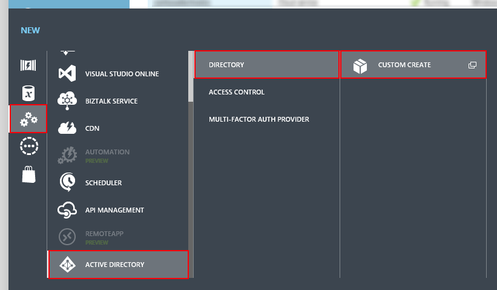
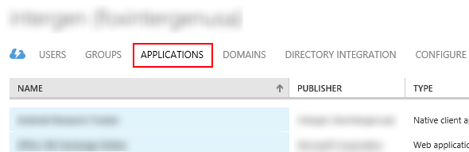
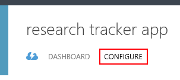

Configuring your O365 Tenant
============================

##Overview

The lab steps through the steps required to configure your O365 Tenant for authentication from your Android or iOS app.

##Objectives

- TODO: Create an O365 Tenant?
- Connect your O365 directory to your Azure subscription
- Add an Application to your O365 Tenant's Active Directory to allow authentcation from your Android or iOS app.

##Prerequisites

- [An O365 tenancy][sign-up-for-o365]
- [An Azure subscription][azure-management-portal]

[sign-up-for-o365]: http://office.microsoft.com/en-nz/business/office-365-enterprise-e3-business-software-FX103030346.aspx
[azure-management-portal]: https://manage.windowsazure.com/

##Tasks

The hands-on lab includes the following exercises:

- [**Task 1:**](#task1) Connect your O365 directory to your Azure subscription

- [**Task 2:**](#task2) Create a new Application in your O365 directory for your Android or iOS app

##Task 1: Connect your O365 directory to your Azure subscription

Here we will associate your Azure account with your O365 tenant as a global administrator.
This gives you the ability to manage the O365 directory using the Azure portal.

01. Sign into the [Azure Portal](https://manage.windowsazure.com/)

02. Click **+ New**

    

03. Select **App Services > Active Directory > Directory > Custom Create**

    

04. Select **Use existing directory**, and then **I am ready to be signed out now**

    

05. You will be signed out of the portal and redirected to a sign-in page. Sign in using the credentials for a global
    administrator in your O365 tenant.

    

06. When authenticated click **continue**. This will add your Azure account as a global administrator of the O365
    directory.

    

07. Click **Sign out now** and when prompted sign back into your Azure account.

    

You have successfully associated your Azure account with your O365 tenant as a global administrator.
This gives you the ability to manage the O365 directory using the Azure portal.

##Task 2: Create a new Application in your O365 directory for your Android or iOS app

Here we will create an Application in your O365 directory to allow your Android or iOS app to authenticate
and interact with the O365 Exchange and SharePoint APIs

01. When you're signed back in, navigate to your O365 directory in the Active Directory extension.

    

02. And then navigate to the **Applications** tab.

    

03. Select **Add** from the action bar to add a new Application.
    
    

04. Select **Add an application from my Organization**. Click **Next**.
    
    

05. Enter a name for the application, and select **Native Client Application**. Click **Next**.

    

06. Enter the following redirect URI for the application:

        http://example.com/redirect

    **NOTE:** this url does not need to resolve to anything, but we will later configure our mobile app with 
    this same url.

    

07. Click **Next**.

08. The application is created. Navigate to the **Configure** tab.

    

09. And copy down the **Client Id**.

    

10. Finally, scroll to the bottom of the screen. In the **Permissions to other applications**
    section, select **Office 365 Exchange Online** from the Select application
    dropdown.

11. From **Delegated Permissions** select the following:

    * Read and write access to users' mail
    * Send mail as user
    * Have full access to users' calendars
    * Have full access to users' contacts

    This configures your app to have delegated permission to access user data in
    Exchange.

    > Note: **do not** select "Have full access to a users' mailbox". This is
    > meant for access to a user's mailbox using an older API called Exchange
    > Web Services. If you select it, requests made to the Exchange REST API 
    > may be rejected as unauthorized.

    

12. Again from the Select application dropdown, select **Office 365 SharePoint Online**.

13. From **Delegated Permissions** select the following:

    * Edit or delete user's files
    * Read user's files
    * Create or delete items and lists in all site collections
    * Edit or delete items in all site collections
    * Read items in all site collections

    This configures your app to have delegated permission to access user data in SharePoint.

    

14. Click **Save** to save the changes.

    

You have successfully created an Application in your O365 directory to allow your Android or iOS app to authenticate
and interact with the O365 Exchange and SharePoint APIs
