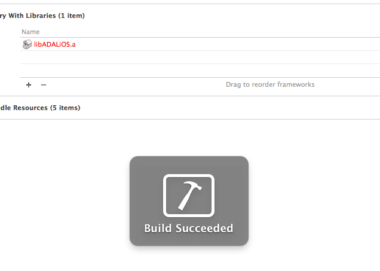
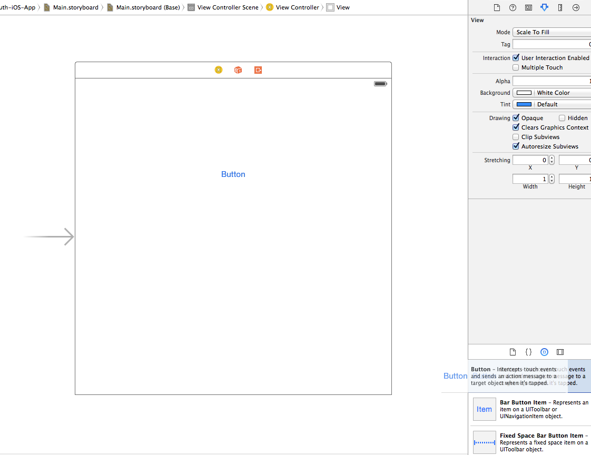
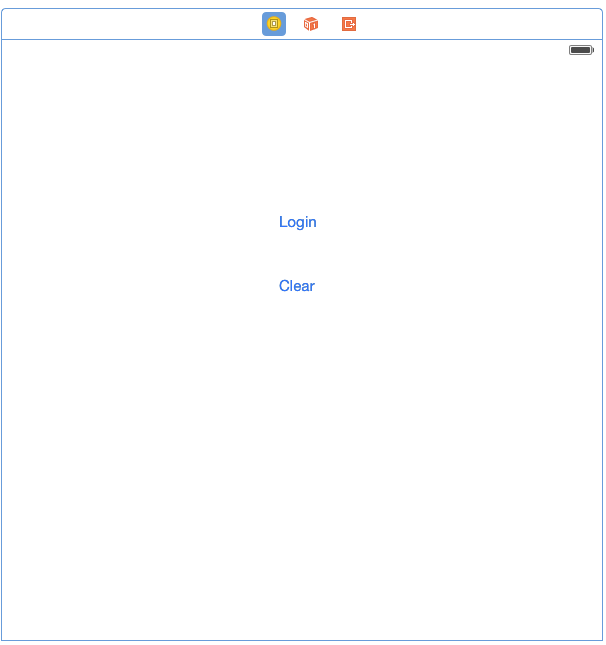
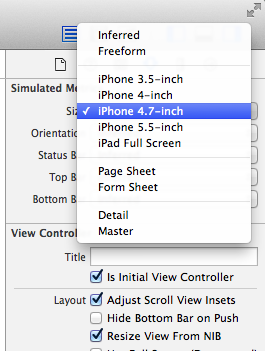
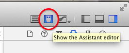
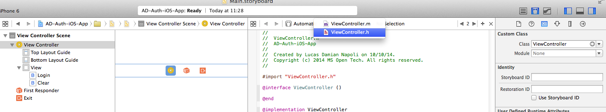
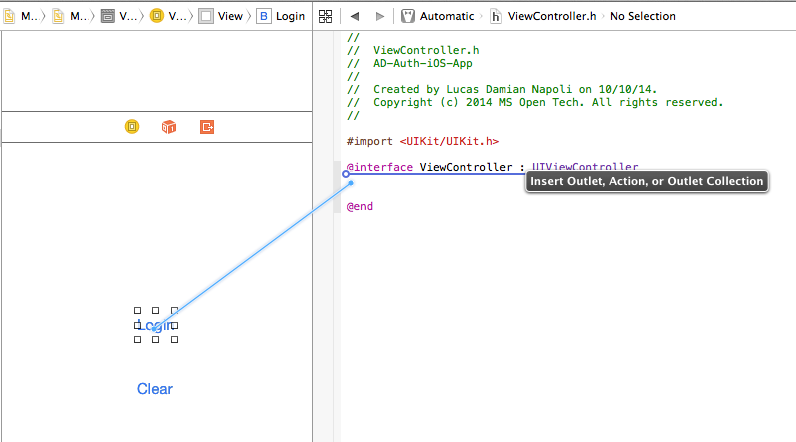
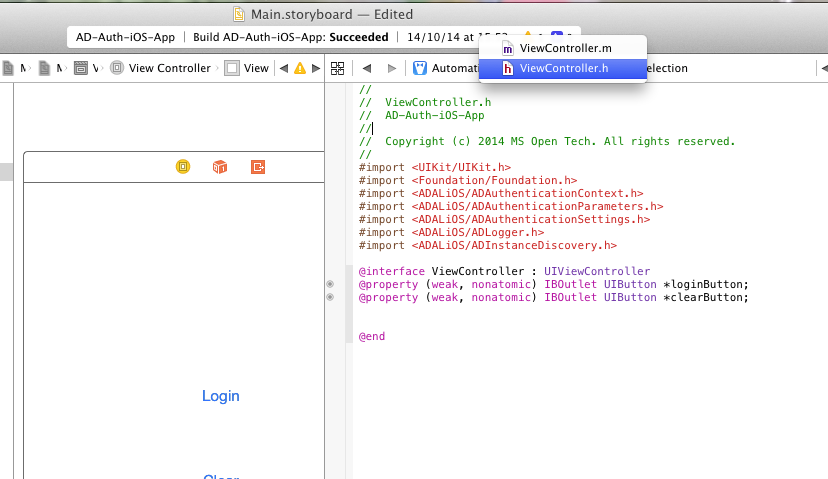
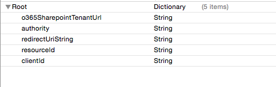

Authentication with O365
========================

##Overview

The lab lets students configure and run an iOS App which allows the user to
authenticate to an Azure ActiveDirectory account using ADALiOS library.

##Objectives

- Learn how to authenticate with Azure AD from iOS using the **Azure Active Directory Authentication Library for iOS** (ADAL)
- Learn how to get a token and store it for further requests

##Prerequisites

- OSX 10.X environment
- [XCode 6][xcode-6]
- XCode developer tools (will install git integration for XCode and the terminal)
- [Cocoapods dependency manager][cocoapods]
- Complete the [Prerequisites](../01 Azure AD Auth Prerequisites) module.

[xcode-6]: https://itunes.apple.com/nz/app/xcode/id497799835?mt=12
[cocoapods]: cocoapods.org

##Exercises

The hands-on lab includes the following exercises:

- [Create a New Project and add the ADALiOS library](#exercise1)
- [Add login and clear buttons to get a token from Azure AD](#exercise2)

<a name="exercise1"></a>
##Exercise 1: Create a New Project and add ADALiOS library
In this exercise you will create a New Project, add the ADALiOS library
as a cocoapods dependency and install it.

Then check everything is ok by starting up the app.

###Task 1 - New Project

01. Launch XCode and create a new **Sigle View Application**

    

02. Fill the inputs with the application info
     
    

03. Using Finder, on the project folder, create a new text file called **Podfile** (without extension), and add the lines

    ```ruby
    pod 'ADALiOS', '~>1.0.2'
    ```

04. Now open a terminal and navigate to the root folder of the project.
    Then execute the following command:

    ```bash
    pod install
    ```

    This will retrieve a copy of the ADALiOS library, store it into the local 
    Pods folder and import into our project.
    Always remember that this command will take effect if executed in the same 
    folder as the .xcodeproj file.

05. Close XCode and re-open the project, this time using the **.xcworkspace** file.
    This workspace includes the pod libraries.

06. Under Project Settings go to **Build Phases**

    

07. Add an Item under **Link Binary with Libraries** and select the ADALiOS packed library (the file with .a extension)

    

08. Build the project from the menu **Product -> Build** and check if succeeded
    
    

<a name="exercise2"></a>
##Exercise 2: Create the application using storyboards and ADALiOS library
In this exercise you will add the action buttons to the application, connect them to the code and use the Login and Clear token features with ADALiOS

###Task 1 - Add buttons to the view and connect to the code
.
01. Using the storyboard feature, open the Main.storyboard file and add two buttons for Login and Clear actions

    

    

02. Change the storyboard size to have a real reference of the screen. Do this selecting the view controller and changing the size settings from the right panel
        
    

03. Open the **Assistant Editor** clicking the icon on the right corner of the XCode window. This will show the counterparts of a file

    

04. Select the **ViewController.h** file to connect the buttons

    

05. Right click on the buttons and drag the line to the header file of the controller.

    

    

06. Select the **ViewController.m** in the right editor to connect actions with this counterpart

    

07. Right click on the buttons and drag the line to the implementation file of the controller

    
    

08. Finally add an Image and a Label in the main screen

    


###Task 2 - Add behaviour to the buttons and use ADALiOS methods

01. On the **ViewController.m** file add the following imports before the implementation declaration

    ```objc
    #import <ADALiOS/ADAuthenticationContext.h>
    #import <ADALiOS/ADAuthenticationParameters.h>
    #import <ADALiOS/ADAuthenticationSettings.h>
    #import <ADALiOS/ADLogger.h>
    #import <ADALiOS/ADInstanceDiscovery.h>
    ```

02. Inside the implementation declaration add the following variables

    ```objc
    ADAuthenticationContext* authContext;
    NSString* authority;
    NSString* redirectUriString;
    NSString* resourceId;
    NSString* clientId;
    NSString* token;
    ```

03. On finder, under the project folder, create a new file called **Auth.plist** and drag it into XCode under our project

04. Open the file and fill it with the following properties:

    

    Fill the values with the settings of your test environment

03. Set the variables values in the **viewDidLoad** method to initialize with the **Auth.plist** values when the application starts

    ```objc
    authority = [NSString alloc];
    resourceId = [NSString alloc];
    clientId = [NSString alloc];
    redirectUriString = [NSString alloc];
    token = [NSString alloc];

    //Azure AD account info
    NSString* plistPath = [[NSBundle mainBundle] pathForResource:@"Auth" ofType:@"plist"];
    NSDictionary *content = [NSDictionary dictionaryWithContentsOfFile:plistPath];
    
    authority = [content objectForKey:@"authority"];
    resourceId = [content objectForKey:@"resourceId"];
    clientId = [content objectForKey:@"clientId"];
    redirectUriString = [content objectForKey:@"redirectUriString"];
    ```

04. Add the following methods to the implementation file.
    
    This method attempts to acquire an authentication token using the
    `ADAuthenticationContext` class.

    ```objc
    -(void) getToken : (BOOL) clearCache completionHandler:(void (^) (NSString*))completionBlock;
    {
        ADAuthenticationError *error;
        authContext = [ADAuthenticationContext authenticationContextWithAuthority:authority error:&error];

        NSURL *redirectUri = [NSURL URLWithString:redirectUriString];

        if(clearCache){
            [authContext.tokenCacheStore removeAllWithError:nil];
        }

        [authContext acquireTokenWithResource:resourceId clientId:clientId redirectUri:redirectUri completionBlock:^(ADAuthenticationResult *result) {
            if (AD_SUCCEEDED != result.status){
                // display error on the screen
                [self showError:result.error.errorDetails];
            }
            else{
                completionBlock(result.accessToken);
            }
        }];
    }

    -(void) showError:(NSString *)error{
        dispatch_async(dispatch_get_main_queue(), ^{
            NSString *errorMessage = [@"Login failed. Reason: " stringByAppendingString: error];
            UIAlertView *alert = [[UIAlertView alloc] initWithTitle:@"Error" message:errorMessage delegate:self cancelButtonTitle:@"Retry" otherButtonTitles:@"Cancel", nil];
            [alert show];
        });
    }
    ```

05. Implement the login action by adding the following code:

    ```objc
    - (IBAction)loginAction:(id)sender {
        [self getToken:FALSE completionHandler:^(NSString *token){
            dispatch_async(dispatch_get_main_queue(), ^{
                UIAlertView *alert = [[UIAlertView alloc] initWithTitle:@"Success" message:token delegate:self cancelButtonTitle:@"Ok" otherButtonTitles:nil, nil];
                [alert show];
            });
        }];
    }
    ```

06. Implement the clear action by adding the following code:

    ```objc
    - (IBAction)clearAction:(id)sender {
        ADAuthenticationError* error;
        id<ADTokenCacheStoring> cache = [ADAuthenticationSettings sharedInstance].defaultTokenCacheStore;
        NSArray* allItems = [cache allItemsWithError:&error];

        if (allItems.count > 0)
        {
            [cache removeAllWithError:&error];
        }

        if (error)
        {
            dispatch_async(dispatch_get_main_queue(), ^{
                NSString *errorMessage = [@"Clear caché failed. Reason: " stringByAppendingString: error.errorDetails];
                UIAlertView *alert = [[UIAlertView alloc] initWithTitle:@"Error" message:errorMessage delegate:self cancelButtonTitle:@"Ok" otherButtonTitles:nil, nil];
                [alert show];
            });
            return;
        }

        NSHTTPCookieStorage* cookieStorage = [NSHTTPCookieStorage sharedHTTPCookieStorage];
        NSArray* cookies = cookieStorage.cookies;
        if (cookies.count)
        {
            for(NSHTTPCookie* cookie in cookies)
            {
                [cookieStorage deleteCookie:cookie];
            }
        }

        dispatch_async(dispatch_get_main_queue(), ^{
            UIAlertView *alert = [[UIAlertView alloc] initWithTitle:@"Success" message:@"Cookies Cleared" delegate:self cancelButtonTitle:@"Ok" otherButtonTitles:nil, nil];
            [alert show];
        });
    }
    ```

07. Build and Run application with the **Play** button in the left corner of the screen

    

08. Tap **Login** to sign in as a user from your O365 Tenant.

##Summary

By completing this hands-on lab you have learnt:

01. Some of the basics of iOS development.

02. How to add the ADALiOS library to the application using Cocoapods.

03. How to get an Access Token from Azure AD using the Active Directory
    Authentication Library.

