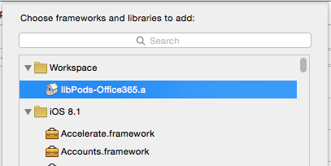
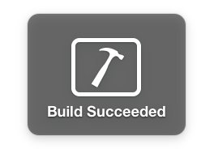
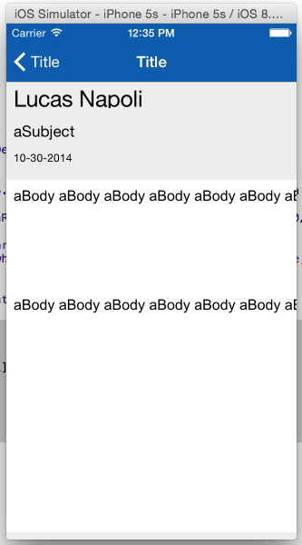

Calling the O365 Exchange API with iOS
======================================

##Overview

The lab lets students use an AzureAD account to manage an Exchange mailbox in a
O365 tenant with an iOS app.

##Objectives

- Learn how to create an O365 Exchange SDK client to manage an Exchange mailbox
- Learn how to list folders and messages

##Prerequisites

- OSX 10.X environment
- [XCode 6][xcode-6]
- XCode developer tools (will install git integration for XCode and the terminal)
- [Cocoapods dependency manager][cocoapods]
- Complete the [Prerequisites](../01 Azure AD Auth Prerequisites) module.

[xcode-6]: https://itunes.apple.com/nz/app/xcode/id497799835?mt=12
[cocoapods]: cocoapods.org

##Exercises

The hands-on lab includes the following exercises:

- [Add O365 iOS Exchange sdk library to the project](#exercise1)
- [Connect to the Exchange API to get a client object](#exercise2)
- [Connect actions in the view to Exchange client](#exercise3)

<a name="exercise1"></a>
##Exercise 1: Add O365 iOS Exchange sdk library to a project
In this exercise you will use an existing application with the AzureAD 
authentication included, to add the O365 Exchange SDK library in the project
and create a client class with empty methods in it to handle the requests 
to the O365 Exchange tenant.

###Task 1 - Open the Project
01. Clone this git repository

02. Open a Terminal and navigate to the `src/O365-Exchange-App` folder of the
    project.

    Execute the following:

    ```bash
    pod install
    ```

02. Open the **.xcworkspace** file in the **src/O365-Exchange-App** folder

03. Find and Open the **Auth.plist** file.

04. Fill the AzureAD account settings with the following configuration values:
    
    -   **o365APITenantUrl**  - "https://outlook.office365.com/api/v1.0"
    -   **resourceId**        - "https://outlook.office365.com"
    -   **authority**         - "https://login.windows.net/common"
    -   **redirectUriString** - The redirect URL configured in Azure AD, e.g. "http://example.com/redirect"
    -   **clientId**          - The client Id obtained from Azure AD, e.g. "2eea4f6c-ae81-43cc-b7cc-088449233375"
    
    

03. Build and Run the project in an iOS Simulator to check the views

    Application:
    You will see a login page with buttons to access the application and to clear credentials.
    Once authenticated, the mailbox folders list will appear with one fake entry. Selecting one,
    you will see the emails inside the folder, and also check each email.

    Environment:
    With the credentials settings we can access to the client user mailbox through the Outlook 
    Exchange tenant, and will be able to implement every single details of a complete email app,
    only using the O365-Exchange sdk
    
    

###Task 2 - Import the library
01. On Finder, open the **Podfile** file under the root folder of the project and add the line:

    ```ruby
    pod 'Office365', '~>0.5.4'
    ```

02. Open a Terminal and navigate to the root folder of the project. Execute the following:

    ```bash
    pod install
    ```

03. Go to project settings selecting the first file from the files explorer. Then click on **Build Phases** section.

04. Under **Link Binary with Libraries** add an entry pointing to **libPods-Office365.a** file

    

05. Build and Run the application to check everything is ok.

    

<a name="exercise2"></a>
##Exercise 2: Connect to the Outlook api to get a client object
In this exercise you will connect your application to get a **MSOutlookClient**. This client is able to gather different verbs and send a single command to execute and get results.

###Task 1 - Connect to a MSOutlookClient

01. Go to **ViewController.m** and find the **loginAction** method

    

    Here we ask for a token, to send in further calls to O365. But here we need to create a client
    that connects to Outlook using our tenant API

02. Replace the code with:

    ```objc
    [self getToken:FALSE completionHandler:^(NSString *t){
        dispatch_async(dispatch_get_main_queue(), ^{
            token = t;
            
            MSDefaultDependencyResolver* resolver = [MSDefaultDependencyResolver alloc];
            MSOAuthCredentials* credentials = [MSOAuthCredentials alloc];
            [credentials addToken:token];
            
            MSCredentialsImpl* credentialsImpl = [MSCredentialsImpl alloc];
            
            [credentialsImpl setCredentials:credentials];
            [resolver setCredentialsFactory:credentialsImpl];
            [[resolver getLogger] log:@"Going to call client API" :(MSLogLevel *)VERBOSE];
            
            
            NSString* plistPath = [[NSBundle mainBundle] pathForResource:@"Auth" ofType:@"plist"];
            NSString* urlApi = [NSString alloc];
            urlApi = [[NSDictionary dictionaryWithContentsOfFile:plistPath] objectForKey:@"o365APITenantUrl"];
            
            MSOutlookClient *client = [[MSOutlookClient alloc] initWitUrl:urlApi dependencyResolver:resolver];
            
            FolderListViewController *controller = [[UIStoryboard storyboardWithName:@"Main" bundle:nil] instantiateViewControllerWithIdentifier:@"folderList"];
            controller.token = t;
            controller.client = client;
            
            [self.navigationController pushViewController:controller animated:YES];
        });
    }];
    ```

03. Add the import sentence to the O365-exchange framework:

    ```objc
    #import <office365_exchange_sdk/office365_exchange_sdk.h>
    ```

04. Add a client property in the headers of each controller (**FolderListViewController.h**, **FolderContentViewController.h**, **EmailDetailViewController.h**):

    ```objc
    @property (strong, nonatomic) MSOutlookClient *client;
    ```

    Also add the import sentence as in step no. 3

    ```objc
    #import <office365_exchange_sdk/office365_exchange_sdk.h>
    ```

05. Build the application and check everything is ok.


<a name="exercise3"></a>
##Exercise 3: Connect actions in the view to Exchange client
In this exercise you will navigate in every controller class of the project, in order to connect each action (from buttons, lists and events) with Exchange operations.

The Application has every event wired up with their respective controller classes. 
We need to connect these event methods to execute a verb in Exchange and gather the results.
The verb is composed by an agregation of commands that will generate a single sentence to execute
in the server side using OData queries and filters.


###Task1 - Wiring up FolderListView

01. Open the **FolderListViewController.m** class implementation

02. Add the **getFolders** method:

    ```objc
    -(void)getFolders{
        double x = ((self.navigationController.view.frame.size.width) - 20)/ 2;
        double y = ((self.navigationController.view.frame.size.height) - 150)/ 2;
        UIActivityIndicatorView* spinner = [[UIActivityIndicatorView alloc]initWithFrame:CGRectMake(x, y, 20, 20)];
        spinner.activityIndicatorViewStyle = UIActivityIndicatorViewStyleGray;
        [self.view addSubview:spinner];
        spinner.hidesWhenStopped = YES;
        [spinner startAnimating];
        
        NSURLSessionTask* task = [[[self.client getMe] getFolders] read:^(NSArray<MSOutlookFolder> *resultFolders, NSError *error) {
            
                dispatch_async(dispatch_get_main_queue(),
                               ^{
                                   [spinner stopAnimating];
                                   folders = resultFolders;
                                   [self.tableView reloadData];
                               });
            
        }];
        
        [task resume];
    }
    ```

03. Add instance variables to hold the array that will hold the folder from the 
    account and another one to hold the current folder when selecting from the table

    ```objc
    NSArray *folders;
    MSOutlookFolder *currentFolder;
    ```

04. Call the **getFolders** method from **viewWillAppear**:

    ```objc
    - (void) viewWillAppear:(BOOL)animated{
        [self getFolders];
    }
    ```

05. Change the **UITableView** delegate methods:

    ```objc
    - (NSInteger)tableView:(UITableView *)tableView numberOfRowsInSection:(NSInteger)section{
        return [folders count];
    }

    - (UITableViewCell *)tableView:(UITableView *)tableView cellForRowAtIndexPath:(NSIndexPath *)indexPath{
        NSString* identifier = @"folderListCell";
        EmailListTableViewCell *cell =[tableView dequeueReusableCellWithIdentifier: identifier ];
        
        MSOutlookFolder *cellFolder = (MSOutlookFolder*)[folders objectAtIndex: indexPath.row];
        cell.title.text = cellFolder.DisplayName;
        
        return cell;
    }
        
    - (void)prepareForSegue:(UIStoryboardSegue *)segue sender:(id)sender
    {
        
        FolderContentViewController *controller = (FolderContentViewController *)segue.destinationViewController;
        //controller.currentFolder = currentFolder;
        controller.token = self.token;
        controller.client = self.client;
        
    }

    - (void)tableView:(UITableView *)tableView didSelectRowAtIndexPath:(NSIndexPath *)indexPath
    {
        currentFolder= [folders objectAtIndex:indexPath.row];
        
        [self performSegueWithIdentifier:@"detail" sender:self];
    }
    ```

04. Build and Run the application. Check everything is ok. Now you can see the list with all the folders from the Outlook account.

    


###Task2 - Wiring up FolderContentView

01. In **FolderListViewController.m** file, uncomment the **prepareForSegue:sender:**

    ```objc
    //controller.currentFolder = currentFolder;
    ```

    And add a property to hold the folder in **FolderContentViewController.h**

    ```objc
    @property (strong, nonatomic) MSOutlookFolder *currentFolder;
    ```

02. Now in **FolderContentViewController.m** load the folder contents adding:

    ```objc
    -(void) getFolderContent{
        double x = ((self.navigationController.view.frame.size.width) - 20)/ 2;
        double y = ((self.navigationController.view.frame.size.height) - 150)/ 2;
        UIActivityIndicatorView* spinner = [[UIActivityIndicatorView alloc]initWithFrame:CGRectMake(x, y, 20, 20)];
        spinner.activityIndicatorViewStyle = UIActivityIndicatorViewStyleGray;
        [self.view addSubview:spinner];
        spinner.hidesWhenStopped = YES;
        [spinner startAnimating];
        
        NSURLSessionTask* task = [[[[[self.client getMe] getFolders] getById:self.currentFolder.Id] getMessages] read:^(NSArray<MSOutlookMessage> *resultMessages, NSError *error) {
            
            dispatch_async(dispatch_get_main_queue(),
                           ^{
                               [spinner stopAnimating];
                               folderMessages = resultMessages;
                               [self.tableView reloadData];
                           });
            
        }];
        
        [task resume];
    }
    ```

    And add an instance variable to hold the contents, and another one to hold the current message selection

    ```objc
    NSArray<MSOutlookMessage> *folderMessages;
    MSOutlookMessage *currentMsg;
    ```

03. Add the **viewWillAppear** method and call the **getFolderContent** method

    ```objc
    -(void) viewWillAppear:(BOOL)animated{
        currentMsg = nil;
        [self getFolderContent];
    }
    ```

04. Change the **UITableView** delegate methods:

    ```objc
    - (NSInteger)tableView:(UITableView *)tableView numberOfRowsInSection:(NSInteger)section{
        return [folderMessages count];
    }

    - (UITableViewCell *)tableView:(UITableView *)tableView cellForRowAtIndexPath:(NSIndexPath *)indexPath{
        NSString* identifier = @"msgListCell";
        EmailListTableViewCell *cell =[tableView dequeueReusableCellWithIdentifier: identifier ];
        
        MSOutlookMessage *msg = [folderMessages objectAtIndex:indexPath.row];
        
        cell.title.text = msg.From.EmailAddress.Name;
        cell.subtitle.text = msg.BodyPreview;
        
        return cell;
    }
    - (void)prepareForSegue:(UIStoryboardSegue *)segue sender:(id)sender
    {
        
        EmailDetailViewController *controller = (EmailDetailViewController *)segue.destinationViewController;
        //controller.currentMsg = currentMsg;
        controller.token = self.token;
        controller.client = self.client;
        
    }
    - (void)tableView:(UITableView *)tableView didSelectRowAtIndexPath:(NSIndexPath *)indexPath
    {
        currentMsg= [folderMessages objectAtIndex:indexPath.row];
        
        [self performSegueWithIdentifier:@"msgDetail" sender:self];
    }

    - (BOOL)shouldPerformSegueWithIdentifier:(NSString *)identifier sender:(id)sender{
        return ([identifier isEqualToString:@"msgDetail"] && currentMsg);
    }
    ```

05. Add the folder name in the label. To do so, add the following in the **viewDidLoad** method.

    ```objc
    self.folderName.text = self.currentFolder.DisplayName;
    ```


06. Build and Run the application. Check everything is ok. Now you can see the list with all the messages of a Folder.

    


###Task3 - Wiring up EmailDetailView

01. In **EmailDetailViewController.h** add a property to hold the current message:

    ```objc
    @property (strong, nonatomic) MSOutlookMessage *currentMsg;
    ```

02. Now in **FolderContentViewController.m**, uncomment the line in **prepareForSegue:sender:** method

    ```objc
    //controller.currentMsg = currentMsg;
    ```

03. In the **viewDidLoad** method, set the values for labels and the email body showing the html code in a proper way to the user

    ```objc
    self.author.text = self.currentMsg.From.EmailAddress.Name;
    self.subject.text = self.currentMsg.Subject;
    
    [self.emailBody loadHTMLString:self.currentMsg.Body.Content  baseURL: nil];

    NSDate *msgDate = self.currentMsg.DateTimeSent;
    
    NSDateFormatter *formatter = [[NSDateFormatter alloc] init];
    [formatter setDateFormat:@"MM-dd-yyyy"];
    self.date.text = [formatter stringFromDate:msgDate];
    ```

04. Build and Run the application. Check everything is ok. Now you can see the email and its details

    


##Summary

By completing this hands-on lab you have learnt:

01. The way to connect an iOS application with an Office365 tenant.

02. How to retrieve information from Outlook using Exchange sdk and OData.

03. How to create a simple email client for O365.

