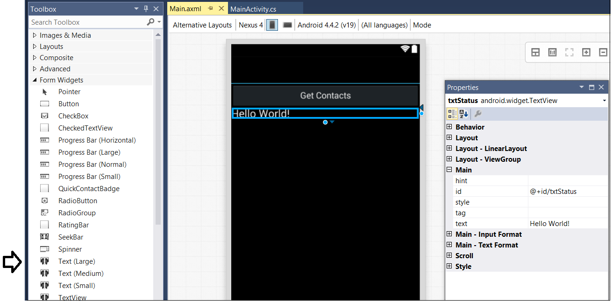

# Creating an Android App using Xamarin and Visual Studio
In this lab, you will create a Android app using the Xamarin support in Visual Studio. You will also go through the process of adding a Connected Service so that you can program your app using the Office 365 APIs.

## Prerequisites
1. You must have an Office 365 tenant and Windows Azure subscription to complete this lab. If you do not have one, the lab for **O3651-7 Setting up your Developer environment in Office 365** shows you how to obtain a trial. You must also have access to an Exchange inbox within an Office 365 developer tenancy.
2. You must have Visual Studio 2013 installed with Update 3.
3. You must have the Office 365 API Tools version 1.1.728 installed in Visual Studio 2013.
3. You must have installed Xamarin using a valid subscription or using a free trial: [https://xamarin.com/download](https://xamarin.com/download).
4. You must configure an Android emulator for debugging that runs at Android API Level 19. 

## Lab Setup: Setting up your Exchange account with Sample Contacts for Testing
1. Using the browser, navigate to https://outlook.office365.com/owa and log into your OWA mailbox.
2. In the top navigation bar, click the **People** link to navigate to the page which shows you your contacts.
3. Make sure there are a few contacts for testing. If you have no contacts or less then 10 contacts, use OWA to enter a few sample contacts so you have at least 10.
4. Once you have verified that you have a set of contacts for testing, you can move on to the next exercise where you will create and test your first app that programs against this contacts list.

## Exercise 1: Create a New Android App Project in Visual Studio
In this exercise, you will create a new Visual Studio project for a Xamarin app.

1. Launch **Visual Studio 2013** as administrator. 
2. In Visual Studio select **File/New/Project**.
3. In the **New Project** dialog, select **Templates > Visual C# > Android** and click **Blank App (Android)**. Name the project **XamarinLab** and click **OK**.    
  
4. Inspect the high-level structure of the new project that has just been created. Note that the source file at the root of the project named **MainActivity.cs** contains the code which initializes the app's user interface. You should also understand that the source file in the **Resources/layouts** folder named **Main.axml** provides a layout of controls that is used by the app's user interface.  
  
6. Right-click on the **XamarinLab** project and select Properties to display the project property dialog. On the **Application** tab, you should see that are three settings named (1) **Compile using Android version**, (2) **Minimum Android to target**, and (3) **Target Android version**. Configure each of these three settings with a value of **API Level 19 (Xamarin.Android v4.4 support)**.  
  
7. Navigate to the **Android Manifest** tab and update the **Application name** from **XamarinLab** to **Xamarin Lab**.   
  
8. Navigate to the **Android Option** tab and take a quikc look at the default settings. There is no need to actually change anything.  

9. Save your changes and close the project properties dialog.
10. Locate the Android layout file named **Main.axml** in the **Resources/layouts** folder. 
11. Double-click on **Main.axml** to open it in the Xamarin Android layout designer.  
  
12. select the button in the layout designer and .    

13. Press the **{F5}** key to begin a debugging session. The app should take a bit to start but then it should begin to run in the Ripple Android emulator which runs inside the Chrome browser.
14. Click the **Get Contacts** button and make sure you see the "hello world" message.
  
15. The final AXML code should look like this.
		
		<?xml version="1.0" encoding="utf-8"?>
		<LinearLayout xmlns:android="http://schemas.android.com/apk/res/android"
		    android:orientation="vertical"
		    android:layout_width="fill_parent"
		    android:layout_height="fill_parent">
		    <Button
		        android:id="@+id/cmdGetContacts"
		        android:layout_width="fill_parent"
		        android:layout_height="wrap_content"
		        android:text="Get Contacts" />
		    <TextView
		        android:text="Hello World!"
		        android:textAppearance="?android:attr/textAppearanceLarge"
		        android:layout_width="match_parent"
		        android:layout_height="wrap_content"
		        android:id="@+id/txtStatus" />
		</LinearLayout>
16. Open **MainActivity.cs** on a code editor.
17. Note that the **MainActivty** class is defined with the **Activity** attribute. Update the **Label** parameter of the **Activity** attribute from **XamarinLab** to **Xamarin Lab**.

17. Update the code in **MainActivity.cs** to match the following code listing.
		
		using System;
		using Android.App;
		using Android.Content;
		using Android.Runtime;
		using Android.Views;
		using Android.Widget;
		using Android.OS;
		
		namespace XamarinLab {
		  [Activity(Label = "Xamarin Lab", MainLauncher = true, Icon = "@drawable/icon")]
		  public class MainActivity : Activity {
		
		    protected override void OnCreate(Bundle bundle) {
		      base.OnCreate(bundle);
		
		      SetContentView(Resource.Layout.Main);
		
		      Button button = FindViewById<Button>(Resource.Id.cmdGetContacts);
		      button.Click += delegate {
		        // add event handler code for button
		        TextView status = FindViewById<TextView>(Resource.Id.txtStatus);
		        status.Text = "Hello from C#!";  
		      };
		    }
		  }
		}
18. Now it's time to test out your work. Press **{F5}** to start a debugging session with the Android emulator. after a bit, you should be able to see the app running in Windows Phone emulator.  

19. When you click the **Get Contacts** button you should see the message **Hello from C#**.

20. Close the Android emulator, return to Visual Studio and make sure the debugging session has been terminated.

## Exercise 2: Creating an Android Adapter Class
In this exercise, you will work with the Activity-based UI model that is the foundation of Android development platform. More specifically, you will create a new adapter class which uses an Android layout as an item template which can be used to display a collection of items such as contacts.

1. In the Solution Explorer, expand the project node to show **Resources/layouts**.
2. Right-click and the **layouts** node and select **Add > New Item**. In the **Add New Item** dialog, select the **Android Layout** item template and give it a name of **ContactListItem.axml**. Click **OK** to add the new layout into the **layouts** folder.

3. In the Android layout designer for **ContactListItem.axml**, switch to code view and copy and paste the XAML code below to create the new layout.
		
		<?xml version="1.0" encoding="utf-8"?>
		<RelativeLayout xmlns:android="http://schemas.android.com/apk/res/android"
		    android:layout_width="fill_parent"
		    android:layout_height="?android:attr/listPreferredItemHeight"
		    android:padding="6dip">
		    <TextView
		        android:id="@+id/ContactName"
		        android:textAppearance="?android:attr/textAppearanceLarge"
		        android:layout_width="fill_parent"
		        android:layout_height="wrap_content"
		        android:layout_toRightOf="@id/ContactPicture"
		        android:layout_alignParentRight="true"
		        android:layout_alignParentTop="true"
		        android:layout_above="@id/ContactEmail"
		        android:layout_alignWithParentIfMissing="true"
		        android:gravity="center_vertical" />
		    <TextView
		        android:id="@+id/ContactEmail"
		        android:layout_width="fill_parent"
		        android:layout_height="26dip"
		        android:layout_toRightOf="@id/ContactPicture"
		        android:layout_alignParentBottom="true"
		        android:layout_alignParentRight="true"
		        android:singleLine="true"
		        android:ellipsize="marquee" />
		</RelativeLayout>
4. Save and close **ContactListItem.axml**.
5. In the Solution Explorer, Create a new top-level folder for the project named **Model**.  
  
6. Right-click the **Model** folder and add a class named **MyContacts**.  
  
7. Implement the **MyContacts** class using the class definition shown in the following code listing.

		namespace XamarinLab.Model {
		  class MyContact {
		    public string Id { get; set; }
		    public string Name { get; set; }
		    public string Email { get; set; }
		  }
		}
8. Right-click the **Model** folder and add a second class named **MyContactsAdapter**.    

9. Copy-and-paste the following code listing into **MyContactsAdapter.cs** to provide the boilerplate starting point for an Android adapter class.

		
		public class MyContactsAdapter : ArrayAdapter<MyContact> {

		  public MyContactsAdapter(Activity activity, List<MyContact> myContacts)
		    : base(activity, Resource.Layout.ContactListItem, myContacts) {
		  }
		
		  public override View GetView(int position, View contactItemView, ViewGroup parent) {		
		  }
		
		}
10. Implement the **GetView** function using the following implementation.
		
		public override View GetView(int position, View contactItemView, ViewGroup parent) {
		      
		  MyContact myContactItem = this.GetItem(position);
		
		  if (contactItemView == null) {
		    contactItemView = LayoutInflater.FromContext(this.Context)
		                                    .Inflate(Resource.Layout.ContactListItem, parent, false);
		  }
		
		  var contactNameElement = contactItemView.FindViewById<TextView>(Resource.Id.ContactName);
		  contactNameElement.Text = myContactItem.Name;
		
		  var contactEmailElement = contactItemView.FindViewById<TextView>(Resource.Id.ContactEmail);
		  contactEmailElement.Text = myContactItem.Email;
		
		  return contactItemView;
		}
11. Save and close **MyContactsAdapter.cs**.
12. Open the Android layout named **Main.axml** and switch over to code view. Replace the existing AXML code with the code listing below in order to add a **ListView** control named **ContactsListView**. 
		
		<?xml version="1.0" encoding="utf-8"?>
		<LinearLayout xmlns:android="http://schemas.android.com/apk/res/android"
		    android:orientation="vertical"
		    android:layout_width="fill_parent"
		    android:layout_height="fill_parent">
		  <Button
		      android:id="@+id/cmdGetContacts"
		      android:layout_width="fill_parent"
		      android:layout_height="wrap_content"
		      android:text="Get Contacts" />
		  <ListView
		      android:id="@+id/ContactsListView"
		      android:layout_width="fill_parent"
		      android:layout_height="fill_parent" />
		</LinearLayout>
13. Save and close **Main.axml**.
14. Open **MainActivity.cs** in a code editor window.
15. Add the following import statements at the top of **MainActivity.cs**.
						
		using System.Collections.Generic;
		using XamarinLab.Model;
16. Replace the existing class definition with the following code listing.
		
		namespace XamarinLab {
		  [Activity(Label = "Xamarin Lab", MainLauncher = true, Icon = "@drawable/icon")]
		  public class MainActivity : Activity {
		
		    ListView contactsListView;
		    List<MyContact> myContacts = new List<MyContact>();
		    MyContactsAdapter myContactsAdapter;
		    	
		    protected override void OnCreate(Bundle bundle) {
		      base.OnCreate(bundle);
		
		      SetContentView(Resource.Layout.Main);
		
		      contactsListView = FindViewById<ListView>(Resource.Id.ContactsListView);
		      myContactsAdapter = new MyContactsAdapter(this, myContacts);
		      contactsListView.Adapter = myContactsAdapter;
		
		      Button button = FindViewById<Button>(Resource.Id.cmdGetContacts);
		      button.Click += delegate {
		        // add event handler code for button
		        myContacts.Clear();
		        myContacts.Add(new MyContact { Name = "Mike Fitzmaurice", Email = "Mike@fitz.net" });
		        myContacts.Add(new MyContact { Name = "Chris Sells", Email = "chris@sellsbrothers.com" });
		        myContacts.Add(new MyContact { Name = "Brian Cox", Email = "bc@adventureworks.com" });
		
		        myContactsAdapter.AddAll(myContacts);
		        myContactsAdapter.NotifyDataSetChanged();             
		      };
		    }
		  }
		}
17. Test out your work by pressing **{F5}** and starting a debugging session with the Android emulator. You should be able to click the **Get Contacts** button and see the three sample contacts that were added to the adapter in **MainActivity.cs**.

18. Close the Android emulator, return to Visual Studio and make sure the debugging session has been terminated.

## Exercise 3: Adding a Connected Service to a Xamarin App
In this exercise, you will add a Connected Service to the project in order to program against the Office 365 APIs.

1. In the **Solution Explorer**, right click the **XamarinLab** project and select **Add/Connected Service**.    

2. In the **Services Manager** dialog, click **Register Your App**.
3. When prompted, login with your **Organizational Account**. After you have logged in, you should be able to see services for which you can configure permission requests.  

4. Select **Contacts** and then click **Permissions**.
5. Check both check boxes and then click **Apply**.  

6. Click **OK** to save your changes and dismiss the **Services Manager** dialog.
7. Inspect the Office 365 API assembly references that were automatically been added to your project when you added the Connected Service.  

8. You will also notice a C# file named **ContactsApiSample.cs** has been added to your project. Open that file and inspect the C# inside to get an idea of how to program against the Office 365 APIs to authenticate and retrieve Office 365 contacts.
9. When you are done, close **ContactsApiSample.cs** and move on to the next exercise.

## Exercise 4: Programming the App using the Office 365 APIs
In this exercise, you will make use of the Connected Service you added in the previous exercise by writing code against the .NET libraries of the Office 365 APIs.

1. Create new class named **Office365Service**.
2. Copy-and-paste this code.

		using System;
		using System.Collections.Generic;
		using System.Linq;
		using System.Threading.Tasks;
		using Android.Content;
		using Microsoft.Office365.OAuth;
		using Microsoft.Office365.Exchange;
		using XamarinLab.Model;
		
		namespace XamarinLab {
		
		  public static class Office365Service {
		
		    static ExchangeClient exchangeClient;
		    static string userId;
		
		    const string ExchangeResourceId = "https://outlook.office365.com";
		    const string ExchangeServiceRoot = "https://outlook.office365.com/ews/odata";
		
		    public static async Task EnsureClientCreated(Context context) {
		      Authenticator authenticator = new Authenticator(context);
		      var authInfo = await authenticator.AuthenticateAsync(ExchangeResourceId);
		      userId = authInfo.IdToken.UPN;
		      exchangeClient = new ExchangeClient(new Uri(ExchangeServiceRoot), authInfo.GetAccessToken);
		    }
		
		    public static void SignOut(Context context) {
		      new Authenticator(context).ClearCache();
		    }
		
		    public static async Task<IEnumerable<IContact>> GetContacts() {
		      var contactsResults = await exchangeClient.Me.Contacts.OrderBy(c => c.Surname).ExecuteAsync();
		      return contactsResults.CurrentPage;
		    }
		
		    public static async Task<IContact> GetContact(string contactId) {
		      var contact = await exchangeClient.Me.Contacts.Where(c => c.Id == contactId).ExecuteSingleAsync();
		      return contact;
		    }
		
		    public static async Task<List<MyContact>> GetMyContacts() {
		      List<MyContact> contactItems = new List<MyContact>();
		      var contacts = await GetContacts();
		      if (contacts != null) {
		        foreach (var contact in contacts) {
		          contactItems.Add(new MyContact() {
		            Id = contact.Id,
		            Name = contact.DisplayName,
		            Email = contact.EmailAddress1
		          });
		        }
		      }
		      return contactItems;
		    }
		  }
		}

3. xx
		
		button.Click += async delegate {
		  // event handler code
		}
4. xx
		
		Button button = FindViewById<Button>(Resource.Id.cmdGetContacts);
		button.Click += async delegate {
		  // add event handler code for button
		  await Office365Service.EnsureClientCreated(this);
		  myContacts = await Office365Service.GetMyContacts();
		  myContactsAdapter.AddAll(myContacts);
		  myContactsAdapter.NotifyDataSetChanged();             
		};
5. Test.
 
6. Next

7. xx

Congratulations! You have completed a simple hybrid app project using Xamarin and the Office 365 APIs.

