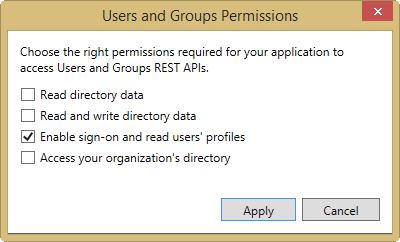

# Deep Dive into native Universal App Development with Office 365 APIs
In this lab, you will use the Office 365 APIs as part of a Windows Store Universal application. The starter project uses the sample data files that are part of the Hub App project. In this lab, you will extend the application to use the Office 365 API.

## Prerequisites
1. You must have an Office 365 tenant and Windows Azure subscription to complete this lab. If you do not have one, the lab for **O3651-7 Setting up your Developer environment in Office 365** shows you how to obtain a trial.
1. You must have the Office 365 API Tools version 1.2.41027.2 installed in Visual Studio 2013.

## Exercise 1: Configure the Starter Project and Create Data
In this exercise, you will configure the starter project to connect to your Office 365 tenant. 

1. Launch **Visual Studio 2013** as an administrator.
1. In Visual Studio, select **File/Open Project**.
1. In the **Open Project** dialog, select **HubApp2.sln** from the **Labs\Starter** folder.
1. Right-click on the **HubApp2.Windows** project and choose **Add/Connected Service**.
  1. In the **Services Manager** dialog:
    1. Click **Register Your App**.
    1. When prompted, login with your **Organizational Account**.
    1. Click **Calendar**.
      1. Click **Permissions**.      
      1. Check **Read users' calendars**.
      1. Click **Apply**.

       
    1. Click **Users and Groups**.
      1. Click **Permissions**.      
      1. Check **Enable sign-on and read users' profiles**.
      1. Click **Apply**.

       
    1. Click **My Files**.
      1. Click **Permissions**.
      1. Check **Read User's Files**.
      1. Click **Apply**.

       
    1. Click **OK**.
    
    	 
1. Obtain and store the Azure AD tenant ID in the shared settings file:
  1. Browse to the [Azure Management Portal](https://manage.windowsazure.com) and sign in with your **Organizational Account**.
  2. In the left-hand navigation, click **Active Directory**.
  3. Select the directory you share with your Office 365 subscription.
  4. In the URL, find the first GUID and copy it to the clipboard. This is your **directory tenant ID**.
    > The URL will look like the following with the **BOLD** part being the GUID you are looking for: `https://manage.windowsazure.com/[..]#Workspaces/ActiveDirectoryExtension/Directory/[YOU WANT THIS GUID: ######-####-####-####-############]/users`
  5. Within the **HubApp2.Shared** project, open the `App.xaml` file in the project.
  6. Add the following node to the `<Application.Resources>` section, setting the value equal to the **directory tenant ID** you acquired in the previous step:

    ````xml
    <x:String x:Key="tenantId">######-####-####-####-############</x:String>
    ````

## Exercise 2: Add classes to represent the data returned from the Office 365 service.
In this exercise, you will add classes to the project that will "normalize" the various data types from Office 365. These classes mimic the sample data classes from the starter project. This is intentional, since the focus of this module is on the Office 365 operations, not the XAML data binding. 
*Note: The code listed in this lab can be found in the Lab\Labfiles folder.*

1. Add a class to represent a group of items from Office 365:
	1. In **Solution Explorer**, right-click on the **DataModel** folder in the **HubApp2.Shared** project and select **Add/New Item...**
	1. In the **Add New Item** dialog, select **Class** and enter the name **O365DataGroup**.
	1. Replace the template code with the following:

		````c#
		using System;
		using System.Collections.Generic;
		using System.Collections.ObjectModel;
		using System.Text;

		namespace HubApp2.Data
		{
			public class O365DataGroup
			{
				public O365DataGroup(String uniqueId, String title, String subtitle, String imagePath, String description)
				{
					this.UniqueId = uniqueId;
					this.Title = title;
					this.Subtitle = subtitle;
					this.Description = description;
					this.ImagePath = imagePath;
					this.Items = new ObservableCollection<O365DataItem>();
				}

				public string UniqueId { get; private set; }
				public string Title { get; private set; }
				public string Subtitle { get; private set; }
				public string Description { get; private set; }
				public string ImagePath { get; private set; }
				public ObservableCollection<O365DataItem> Items { get; private set; }

				public override string ToString()
				{
					return this.Title;
				}
			}
		}
		````

1. Add a class to represent items from Office 365:
	1. In **Solution Explorer**, right-click on the **DataModel** folder in the **HubApp2.Shared** project and select **Add/New Item...**
	1. In the **Add New Item** dialog, select **Class** and enter the name **O365DataItem**.
	1. Replace the template code with the following:

		````c#
		using System;
		using System.Collections.Generic;
		using System.Text;

		namespace HubApp2.Data
		{
		    public class O365DataItem
		    {
					public O365DataItem(String uniqueId, String title, String subtitle, String imagePath, String description, String content)
					{
						this.UniqueId = uniqueId;
						this.Title = title;
						this.Subtitle = subtitle;
						this.Description = description;
						this.ImagePath = imagePath;
						this.Content = content;
					}

					public string UniqueId { get; private set; }
					public string Title { get; private set; }
					public string Subtitle { get; private set; }
					public string Description { get; private set; }
					public string ImagePath { get; private set; }
					public string Content { get; private set; }

					public override string ToString()
					{
						return this.Title;
					}
				}
		}
		````

1. Add a class to serve as the data source for Office 365 data:
	1. In **Solution Explorer**, right-click on the **DataModel** folder in the **HubApp2.Shared** project and select **Add/New Item...**
	1. In the **Add New Item** dialog, select **Class** and enter the name **O365DataSource**.
	1. Replace the template code with the following:

		````c#
		#if WINDOWS_APP
		using System;
		using System.Collections.Generic;
		using System.Collections.ObjectModel;
		using System.Linq;
		using System.Text;
		using System.Threading.Tasks;

		namespace HubApp2.Data {
		  public sealed class O365DataSource {
		    private static O365DataSource _dataSource = new O365DataSource();

		    private ObservableCollection<O365DataGroup> _groups = new ObservableCollection<O365DataGroup>();
		    public ObservableCollection<O365DataGroup> Groups {
		      get { return this._groups; }
		    }

		    public static async Task<IEnumerable<O365DataGroup>> GetGroupsAsync() {
		      await O365Helpers.AuthenticationHelper.EnsureOutlookClientCreatedAsync();
		      await _dataSource.GetO365DataGroups();
		      return _dataSource.Groups;
		    }

		    private async Task GetO365DataGroups() {
		      if (this._groups.Count != 0) {
		        return;
		      }

		      Groups.Add(new O365DataGroup("calendar", "Calendar", "Calendar events", "Assets/event.png",
		                                    "Events from your Office 365 Calendar"));
		      Groups.Add(new O365DataGroup("contacts", "Contacts", "Contacts from the \"People\" page.", "Assets/contact.png",
		                                    "Contacts from your Office 365 \"My Contacts\""));
		      Groups.Add(new O365DataGroup("mail", "Mail", "Messages from your Inbox", "Assets/mail.png",
		                                    "Messages from your Office 365 Inbox."));
		      Groups.Add(new O365DataGroup("files", "Files", "Files from your OneDrive for business", "Assets/files.png",
		                                    "Files from your OneDrive for Business"));

		      await Task.WhenAll(Groups.Select(g => GetGroupItemsAsync(g)));

		      return;
		    }

		    private async Task GetGroupItemsAsync(O365DataGroup group) {
		      switch (group.UniqueId) {
		        case "calendar":
		          var ops = new O365Helpers.CalendarOperations();
		          //var events = await ops.GetTodaysCalendar(48, 48);
		          var events = await ops.GetCalendarEvents();
		          foreach (ViewModels.EventViewModel item in events) {
		            group.Items.Add(new O365DataItem(item.Id, item.Subject, item.LocationName, "Assets/event.png", item.DisplayString, item.BodyContent));
		          }

		          break;

		        case "contacts":
		          break;
		        case "mail":
		          break;
		        case "files":
		          var fileOps = new O365Helpers.FileOperations();
		          var files = await fileOps.GetMyFilesAsync();
		          foreach (var item in files) {
		            ViewModels.FileSystemItemViewModel vm = new ViewModels.FileSystemItemViewModel(item);
		            string lastModified = String.Format("Last modified by {0} on {1:d}",
		                                    vm.FileSystemItem.LastModifiedBy,
		                                    vm.FileSystemItem.DateTimeLastModified);
		            group.Items.Add(new O365DataItem(vm.FileSystemItem.Id, vm.Name, lastModified, "Assets/file.png", vm.DisplayName, String.Empty));
		          }
		          break;
		        default:
		          break;
		      }

		    }

		    public static async Task<O365DataGroup> GetGroupAsync(string UniqueId) {
		      return _dataSource.Groups.FirstOrDefault(g => g.UniqueId.Equals(UniqueId));
		    }

		    public static async Task<O365DataItem> GetItemAsync(string uniqueId) {
		      O365DataItem result = null;

		      foreach (O365DataGroup group in _dataSource.Groups) {
		        result = group.Items.FirstOrDefault(i => i.UniqueId.Equals(uniqueId));
		        if (result != null) {
		          break;
		        }
		      }
		      return result;
		    }
		  }
		}

		#endif
		````

# Exercise 3: Add Office 365 Operations to the Projects
In this exercise, you will add classes to perform the Office 365 operations

1. Assembly references are not added to the shared projects in Universal Apps, rather they are added to the actual client projects. Therefore you need to add the following NuGet packages manually
	1. Open the Package Manager Console: **View/Other Windows/Package Manager Console**.
	1. Enter each line below in the console, one at a time, pressing **ENTER** after each one. NuGet will install the package and all dependent packages:
	
		````powershell
		PM> Install-Package -ProjectName "HubApp2.Windows" -Id Microsoft.Office365.SharePoint
		PM> Install-Package -ProjectName "HubApp2.Windows" -Id Microsoft.Office365.OutlookServices
		PM> Install-Package -ProjectName "HubApp2.Windows" -Id Microsoft.Office365.OAuth.Windows
		PM> Install-Package -ProjectName "HubApp2.Windows" -Id Microsoft.Azure.ActiveDirectory.GraphClient
		````

1. Add a class to facilitate the authorization to Azure / Office 365:
	1. In **Solution Explorer**, right-click on the **HubApp2.Shared** project and choose **Add/New Folder**. Name the folder **O365Helpers**.
	1. Right-click on the **O365Helpers** folder in the **HubApp2.Shared** project and select **Add/New Item...**
	1. In the **Add New Item** dialog, select **Class** and enter the name **AuthenticationHelper**.
	1. Replace the template code with the following:

		````c#
		#if WINDOWS_APP
		using Microsoft.Azure.ActiveDirectory.GraphClient;
		using Microsoft.IdentityModel.Clients.ActiveDirectory;
		using Microsoft.Office365.Discovery;
		using Microsoft.Office365.OAuth;
		using Microsoft.Office365.OutlookServices;
		using Microsoft.Office365.SharePoint.CoreServices;
		using Office365StarterProject.Helpers;
		using System;
		using System.Linq;
		using System.Threading.Tasks;
		using Windows.Security.Authentication.Web;

		namespace HubApp2.O365Helpers
		{
		    /// <summary>
		    /// Provides clients for the different service endpoints.
		    /// </summary>
		    internal static class AuthenticationHelper
		    {
		        // The ClientID is added as a resource in App.xaml when you register the app with Office 365. 
		        // As a convenience, we load that value into a variable called ClientID. This way the variable 
		        // will always be in sync with whatever client id is added to App.xaml.
		        private static readonly string ClientID = App.Current.Resources["ida:ClientID"].ToString();
		        private static Uri ReturnUri = WebAuthenticationBroker.GetCurrentApplicationCallbackUri();


		        // Properties used for communicating with your Windows Azure AD tenant.
		        // The AuthorizationUri is added as a resource in App.xaml when you regiter the app with 
		        // Office 365. As a convenience, we load that value into a variable called CommonAuthority, adding Common to this Url to signify
		        // multi-tenancy. This way it will always be in sync with whatever value is added to App.xaml.
		        private static readonly string CommonAuthority = App.Current.Resources["ida:AuthorizationUri"].ToString() + @"/Common";
		        private static readonly Uri DiscoveryServiceEndpointUri = new Uri("https://api.office.com/discovery/v1.0/me/");
		        private const string DiscoveryResourceId = "https://api.office.com/discovery/";

		        public static AuthenticationContext AuthenticationContext { get; set; }

		        static string _loggedInUser;
		        /// <summary>
		        /// Gets the logged in user.
		        /// </summary>
		        static internal String LoggedInUser
		        {
		            get
		            {
		                return _loggedInUser;
		            }
		        }

		        /// <summary>
		        /// Checks that a Graph client is available.
		        /// </summary>
		        /// <returns>The Graph client.</returns>
		        public static async Task<ActiveDirectoryClient> EnsureGraphClientCreatedAsync()
		        {
		            // Active Directory service endpoints
		            const string AadServiceResourceId = "https://graph.windows.net/";
		            Uri AadServiceEndpointUri = new Uri("https://graph.windows.net/");

		            try
		            {
		                AuthenticationContext = new AuthenticationContext(CommonAuthority);

		                TokenCacheItem cacheItem = null;

		                if (AuthenticationContext.TokenCache.ReadItems().Count() > 0)
		                {
		                    // Bind the AuthenticationContext to the authority that sourced the token in the cache 
		                    // this is needed for the cache to work when asking for a token from that authority 
		                    // (the common endpoint never triggers cache hits) 
		                    cacheItem = AuthenticationContext.TokenCache.ReadItems().First();
		                    AuthenticationContext = new AuthenticationContext(cacheItem.Authority);

		                }
		                else
		                {
		                    // Nothing was found in the cache, so let's acquire a token.
		                    var token = await AcquireTokenAsync(AuthenticationContext, AadServiceResourceId);

		                    // Check the token
		                    if (String.IsNullOrEmpty(token))
		                    {
		                        // User cancelled sign-in
		                        return null;
		                    }
		                    else
		                    {
		                        // If a token was acquired, the TokenCache will contain a TokenCacheItem containing
		                        // all the details of the authorization.
		                        cacheItem = AuthenticationContext.TokenCache.ReadItems().First();
		                    }
		                }

		                // Store the Id of the logged-in user so that we can retrieve more user info later.
		                _loggedInUser = cacheItem.UniqueId;
		                
		                // Create our ActiveDirectory client.
		                var client = new ActiveDirectoryClient(
		                    new Uri(AadServiceEndpointUri, cacheItem.TenantId),
		                    async () => await AcquireTokenAsync(AuthenticationContext, AadServiceResourceId));

		                return client;
		            }
		            // The following is a list of all exceptions you should consider handling in your app.
		            // In the case of this sample, the exceptions are handled by returning null upstream. 
		            catch (DiscoveryFailedException dfe)
		            {
		                MessageDialogHelper.DisplayException(dfe as Exception);

		                // Discovery failed.
		                AuthenticationContext.TokenCache.Clear();
		                return null;
		            }
		            catch (MissingConfigurationValueException mcve)
		            {
		                MessageDialogHelper.DisplayException(mcve);

		                // Connected services not added correctly, or permissions not set correctly.
		                AuthenticationContext.TokenCache.Clear();
		                return null;
		            }
		            catch (AuthenticationFailedException afe)
		            {
		                MessageDialogHelper.DisplayException(afe);

		                // Failed to authenticate the user
		                AuthenticationContext.TokenCache.Clear();
		                return null;

		            }
		            catch (ArgumentException ae)
		            {
		                MessageDialogHelper.DisplayException(ae as Exception);

		                // Argument exception
		                AuthenticationContext.TokenCache.Clear();
		                return null;
		            }
		        }

		        /// <summary>
		        /// Checks that an OutlookServicesClient object is available. 
		        /// </summary>
		        /// <returns>The OutlookServicesClient object. </returns>
		        public static async Task<OutlookServicesClient> EnsureOutlookClientCreatedAsync()
		        {
		            try
		            {
		                AuthenticationContext = new AuthenticationContext(CommonAuthority);

		                if (AuthenticationContext.TokenCache.ReadItems().Count() > 0)
		                {
		                    // Bind the AuthenticationContext to the authority that sourced the token in the cache 
		                    // this is needed for the cache to work when asking for a token from that authority 
		                    // (the common endpoint never triggers cache hits) 
		                    string cachedAuthority = AuthenticationContext.TokenCache.ReadItems().First().Authority;
		                    AuthenticationContext = new AuthenticationContext(cachedAuthority);

		                }

		                // Create a DiscoveryClient using the discovery endpoint Uri.  
		                DiscoveryClient discovery = new DiscoveryClient(DiscoveryServiceEndpointUri,
		                    async () => await AcquireTokenAsync(AuthenticationContext, DiscoveryResourceId));

		                // Now get the capability that you are interested in.
		                CapabilityDiscoveryResult result = await discovery.DiscoverCapabilityAsync("Mail");

		                var client = new OutlookServicesClient(
		                    result.ServiceEndpointUri,
		                    async () => await AcquireTokenAsync(AuthenticationContext, result.ServiceResourceId));

		                return client;
		            }
		            // The following is a list of all exceptions you should consider handling in your app.
		            // In the case of this sample, the exceptions are handled by returning null upstream. 
		            catch (DiscoveryFailedException dfe)
		            {
		                MessageDialogHelper.DisplayException(dfe as Exception);

		                // Discovery failed.
		                AuthenticationContext.TokenCache.Clear();
		                return null;
		            }
		            catch (MissingConfigurationValueException mcve)
		            {
		                MessageDialogHelper.DisplayException(mcve);

		                // Connected services not added correctly, or permissions not set correctly.
		                AuthenticationContext.TokenCache.Clear();
		                return null;
		            }
		            catch (AuthenticationFailedException afe)
		            {
		                MessageDialogHelper.DisplayException(afe);

		                // Failed to authenticate the user
		                AuthenticationContext.TokenCache.Clear();
		                return null;

		            }
		            catch (ArgumentException ae)
		            {
		                MessageDialogHelper.DisplayException(ae as Exception);
		                // Argument exception
		                AuthenticationContext.TokenCache.Clear();
		                return null;
		            }
		        }

		        /// <summary>
		        /// Checks that a SharePoint client is available to the client.
		        /// </summary>
		        /// <returns>The SharePoint Online client.</returns>
		        public static async Task<SharePointClient> EnsureSharePointClientCreatedAsync()
		        {
		            try
		            {
		                AuthenticationContext = new AuthenticationContext(CommonAuthority);

		                if (AuthenticationContext.TokenCache.ReadItems().Count() > 0)
		                {
		                    // Bind the AuthenticationContext to the authority that sourced the token in the cache 
		                    // this is needed for the cache to work when asking for a token from that authority 
		                    // (the common endpoint never triggers cache hits) 
		                    string cachedAuthority = AuthenticationContext.TokenCache.ReadItems().First().Authority;
		                    AuthenticationContext = new AuthenticationContext(cachedAuthority);

		                }

		                // Create a DiscoveryClient using the discovery endpoint Uri.  
		                DiscoveryClient discovery = new DiscoveryClient(DiscoveryServiceEndpointUri,
		                    async () => await AcquireTokenAsync(AuthenticationContext, DiscoveryResourceId));

		                // Now get the capability that you are interested in.
		                CapabilityDiscoveryResult result = await discovery.DiscoverCapabilityAsync("MyFiles");

		                var client = new SharePointClient(
		                    result.ServiceEndpointUri,
		                    async () => await AcquireTokenAsync(AuthenticationContext, result.ServiceResourceId));

		                return client;
		            }
		            catch (DiscoveryFailedException dfe)
		            {
		                MessageDialogHelper.DisplayException(dfe as Exception);

		                // Discovery failed.
		                AuthenticationContext.TokenCache.Clear();
		                return null;
		            }
		            catch (MissingConfigurationValueException mcve)
		            {
		                MessageDialogHelper.DisplayException(mcve);

		                // Connected services not added correctly, or permissions not set correctly.
		                AuthenticationContext.TokenCache.Clear();
		                return null;
		            }
		            catch (AuthenticationFailedException afe)
		            {
		                MessageDialogHelper.DisplayException(afe);

		                // Failed to authenticate the user
		                AuthenticationContext.TokenCache.Clear();
		                return null;

		            }
		            catch (ArgumentException ae)
		            {
		                MessageDialogHelper.DisplayException(ae as Exception);
		                // Argument exception
		                AuthenticationContext.TokenCache.Clear();
		                return null;
		            }
		        }


		        /// <summary>
		        /// Signs the user out of the service.
		        /// </summary>
		        public static async Task SignOutAsync()
		        {
		            if (string.IsNullOrEmpty(_loggedInUser))
		            {
		                return;
		            }

		            await AuthenticationContext.LogoutAsync(_loggedInUser);
		            AuthenticationContext.TokenCache.Clear();
		        }

		        // Get an access token for the given context and resourceId. An attempt is first made to 
		        // acquire the token silently. If that fails, then we try to acquire the token by prompting the user.
		        private static async Task<string> AcquireTokenAsync(AuthenticationContext context, string resourceId)
		        {
		            string accessToken = null;

		            try
		            {
		                // First, we are going to try to get the access token silently using the resourceId that was passed in
		                // and the clientId of the application...
		                accessToken = (await context.AcquireTokenSilentAsync(resourceId, ClientID)).AccessToken;
		            }
		            catch (Exception)
		            {
		                // We were unable to acquire the AccessToken silently. So, we'll try again with full
		                // prompting. 
		                accessToken = null;

		            }

		            if (accessToken == "" || accessToken == null)
		                accessToken = (await context.AcquireTokenAsync(resourceId, ClientID, ReturnUri)).AccessToken;

		            return accessToken;
		        }

		    }
		}
		#endif
		````


1. Add a class to assist with dialog boxes:
	1. In **Solution Explorer**, right-click on the **HubApp2.Shared** project and choose **Add/New Folder**. Name the folder **O365Helpers**.
	1. Right-click on the **O365Helpers** folder in the **HubApp2.Shared** project and select **Add/New Item...**
	1. In the **Add New Item** dialog, select **Class** and enter the name **MessageDialogHelper**.
	1. Replace the template code with the following:

		````c#
		#if WINDOWS_APP
		using Microsoft.Office365.OAuth;
		using System;
		using System.Diagnostics;
		using System.Text;
		using System.Threading.Tasks;
		using Windows.UI.Popups;

		namespace HubApp2.O365Helpers
		{
		    internal static class MessageDialogHelper
		    {

		        internal static async Task<bool> ShowYesNoDialogAsync(string content, string title)
		        {
		            bool result = false;
		            MessageDialog messageDialog = new MessageDialog(content, title);

		            messageDialog.Commands.Add(new UICommand(
		                "Yes",
		                new UICommandInvokedHandler((cmd) => result = true)
		                ));
		            messageDialog.Commands.Add(new UICommand(
		               "No",
		               new UICommandInvokedHandler((cmd) => result = false)
		               ));

		            // Set the command that will be invoked by default 
		            messageDialog.DefaultCommandIndex = 0;

		            // Set the command to be invoked when escape is pressed 
		            messageDialog.CancelCommandIndex = 1;

		            await messageDialog.ShowAsync();

		            return result;
		        }

		        internal static async void ShowDialogAsync(string content, string title)
		        {
		            MessageDialog messageDialog = new MessageDialog(content, title);
		            messageDialog.Commands.Add(new UICommand(
		               "OK",
		               null
		               ));

		            await messageDialog.ShowAsync();
		        }

		        #region Exception display helpers
		        // Display details of the exception in a message dialog.
		        // We are doing this here to help you, as a developer, understand exactly
		        // what exception was received. In a real app, you would
		        // handle exceptions within your code and give a more user-friendly behavior.
		        internal static void DisplayException(AuthenticationFailedException exception)
		        {
		            var title = "Authentication failed";
		            StringBuilder content = new StringBuilder();
		            content.AppendLine("We were unable to connect to Office 365. Here's the exception we received:");
		            content.AppendFormat("Exception: {0}\n", exception.ErrorCode);
		            content.AppendFormat("Description: {0}\n\n", exception.ErrorDescription);
		            content.AppendLine("Suggestion: Make sure you have added the Connected Services to this project as outlined in the Readme file");
		            MessageDialogHelper.ShowDialogAsync(content.ToString(), title);
		            Debug.WriteLine(content.ToString());
		        }

		        // Display details of the exception. 
		        // We are doing this here to help you, as a developer, understand exactly
		        // what exception was received. In a real app, you would
		        // handle exceptions within your code and give a more user-friendly behavior.
		        internal static void DisplayException(MissingConfigurationValueException exception)
		        {
		            var title = "Connected Services configuration failure";
		            StringBuilder content = new StringBuilder();
		            content.AppendLine("We were unable to connect to Office 365. Here's the exception we received:");
		            content.AppendFormat("Exception: {0}\n\n", exception.Message);
		            content.AppendLine("Suggestion: Make sure you have added the Connected Services to this project as outlined in the Readme file.");
		            MessageDialogHelper.ShowDialogAsync(content.ToString(), title);
		        }

		        // Display details of the exception. 
		        // We are doing this here to help you, as a developer, understand exactly
		        // what exception was received. In a real app, you would
		        // handle exceptions within your code and give a more user-friendly behavior.
		        internal static void DisplayException(Exception exception)
		        {
		            var title = "Connected Services configuration failure";
		            StringBuilder content = new StringBuilder();
		            content.AppendLine("We were unable to connect to Office 365. Here's the exception we received:");
		            content.AppendFormat("Exception: {0}\n\n", exception.Message);
		            content.AppendLine("Suggestion: Make sure you have added the Connected Services to this project as outlined in the Readme file.");
		            MessageDialogHelper.ShowDialogAsync(content.ToString(), title);
		        }
		        #endregion
		    }
		}
		#endif
		````

1. Add a base class that implements the INotifyPropertyChanged interface. This interface enables the User Interface updates as data is retrieved through the databinding capabilities of XAML.
	1. Right-click on the **O365Helpers** folder in the **HubApp2.Shared** project and select **Add/New Item...**
	1. In the **Add New Item** dialog, select **Class** and enter the name **ViewModelBase**.
	1. Replace the template code with the following:
			
		````c#
		using System;
		using System.ComponentModel;
		using System.Runtime.CompilerServices;

		namespace HubApp2.ViewModels
		{
		    /// <summary>
		    /// Base view model for working with Office 365 services.
		    /// </summary>
		    public class ViewModelBase : INotifyPropertyChanged
		    {

		        protected bool SetProperty<T>(ref T field, T value, [CallerMemberName] string propertyName = "")
		        {
		            // If the value is the same as the current value, return false to indicate this was a no-op. 
		            if (Object.Equals(field, value))
		                return false;

		            // Raise any registered property changed events and indicate to the user that the value was indeed changed.
		            field = value;
		            NotifyPropertyChanged(propertyName);
		            return true;
		        }
		      
		        public event PropertyChangedEventHandler PropertyChanged;


		        protected void NotifyPropertyChanged([CallerMemberName]string propertyName = "")
		        {
		            if (PropertyChanged != null)
		                PropertyChanged(this, new PropertyChangedEventArgs(propertyName));
		        }
		    }
		}
		````

1. Add a class to represent the data returned from Calendar operations:
	1. Right-click on the **O365Helpers** folder in the **HubApp2.Shared** project and select **Add/New Item...**
	1. In the **Add New Item** dialog, select **Class** and enter the name **LoggingViewModel**.
	1. Replace the template code with the following:

		````c#
		using HubApp2.ViewModels;

		namespace HubApp2.O365Helpers
		{
		    public class LoggingViewModel : ViewModelBase
		    {
		         public static LoggingViewModel Instance { get; private set; }

		        static LoggingViewModel() 
		        {
		            Instance = new LoggingViewModel(); 
		        }

		        private string _information;

		        public string Information
		        {
		            get
		            {
		                return _information;
		            }
		            set
		            {
		                SetProperty(ref _information, value);
		            }
		        }
		    }
		}
		````

1. Add a class to represent the data returned from Calendar operations:
	1. Right-click on the **O365Helpers** folder in the **HubApp2.Shared** project and select **Add/New Item...**
	1. In the **Add New Item** dialog, select **Class** and enter the name **EventViewModel**.
	1. Replace the template code with the following:

		````c#
		using HubApp2.Common;
		using Microsoft.Office365.OutlookServices;
		using HubApp2.Common;
		using HubApp2.O365Helpers;
		using System;
		using System.Text.RegularExpressions;
		using Windows.Globalization.DateTimeFormatting;

		namespace HubApp2.ViewModels {
		  /// <summary>
		  /// Models a calendar event
		  /// </summary>
		  public class EventViewModel : ViewModelBase {

		    private string _id;
		    private string _subject;
		    private string _locationDisplayName;
		    private bool _isNewOrDirty;
		    private DateTimeOffset _start;
		    private DateTimeOffset _end;
		    private TimeSpan _startTime;
		    private TimeSpan _endTime;
		    private string _body;
		    private string _attendees;
		    private IEvent _serverEventData;
		    private string _displayString;
		    CalendarOperations _calenderOperations = new CalendarOperations();

		    public string Subject {
		      get { return _subject; }
		      set {
		        if (SetProperty(ref _subject, value)) {
		          IsNewOrDirty = true;
		          UpdateDisplayString();
		        }
		      }
		    }
		    public string LocationName {
		      get { return _locationDisplayName; }
		      set {
		        if (SetProperty(ref _locationDisplayName, value)) {
		          IsNewOrDirty = true;
		          UpdateDisplayString();
		        }

		      }
		    }
		    public DateTimeOffset Start {
		      get { return _start; }
		      set {

		        if (SetProperty(ref _start, value)) {
		          IsNewOrDirty = true;
		          UpdateDisplayString();
		        }
		      }
		    }
		    public TimeSpan StartTime {
		      get { return _startTime; }
		      set {
		        if (SetProperty(ref _startTime, value)) {
		          IsNewOrDirty = true;
		          this.Start = this.Start.Date + _startTime;
		          UpdateDisplayString();
		        }

		      }
		    }
		    public DateTimeOffset End {
		      get { return _end; }
		      set {
		        if (SetProperty(ref _end, value)) {
		          IsNewOrDirty = true;
		          UpdateDisplayString();
		        }
		      }
		    }
		    public TimeSpan EndTime {
		      get { return _endTime; }
		      set {
		        if (SetProperty(ref _endTime, value)) {
		          IsNewOrDirty = true;
		          this.End = this.End.Date + _endTime;
		          UpdateDisplayString();
		        }
		      }
		    }
		    public string BodyContent {
		      get { return _body; }
		      set {
		        if (SetProperty(ref _body, value)) {
		          IsNewOrDirty = true;
		        }
		      }
		    }
		    public string Attendees {
		      get { return _attendees; }
		      set {
		        if (SetProperty(ref _attendees, value)) {
		          IsNewOrDirty = true;
		        }
		      }
		    }

		    public bool IsNewOrDirty {
		      get {
		        return _isNewOrDirty;
		      }
		      set {
		        if (SetProperty(ref _isNewOrDirty, value) && SaveChangesCommand != null) {
		          UpdateDisplayString();
		          LoggingViewModel.Instance.Information = "Press the Update Event button and we'll save the changes to your calendar";
		          SaveChangesCommand.RaiseCanExecuteChanged();
		        }
		      }
		    }

		    public string DisplayString {
		      get {
		        return _displayString;
		      }
		      set {
		        SetProperty(ref _displayString, value);
		      }
		    }

		    private void UpdateDisplayString() {
		      DateTimeFormatter dateFormat = new DateTimeFormatter("month.abbreviated day hour minute");

		      var startDate = (this.Start == DateTimeOffset.MinValue) ? string.Empty : dateFormat.Format(this.Start);
		      var endDate = (this.End == DateTimeOffset.MinValue) ? string.Empty : dateFormat.Format(this.End);

		      DisplayString = String.Format("Subject: {0} Location: {1} Start: {2} End: {3}",
		              Subject,
		              LocationName,
		              startDate,
		              endDate
		              );
		      DisplayString = (this.IsNewOrDirty) ? DisplayString + " *" : DisplayString;

		    }

		    public string Id {
		      set {
		        _id = value;
		      }

		      get {
		        return _id;
		      }
		    }

		    public bool IsNew {
		      get {
		        return this._serverEventData == null;
		      }
		    }

		    public void Reset() {
		      if (!this.IsNew) {
		        this.initialize(this._serverEventData);
		      }
		    }


		    /// <summary>
		    /// Changes a calendar event.
		    /// </summary>
		    public RelayCommand SaveChangesCommand { get; private set; }

		    private bool CanSaveChanges() {
		      return (this.IsNewOrDirty);
		    }

		    /// <summary>
		    /// Saves changes to a calendar event on the Exchange service and
		    /// updates the local collection of calendar events.
		    /// </summary>
		    public async void ExecuteSaveChangesCommandAsync() {
		      string operationType = string.Empty;
		      try {
		        if (!String.IsNullOrEmpty(this.Id)) {
		          LoggingViewModel.Instance.Information = "Updating event ...";
		          operationType = "update";
		          //Send changes to Exchange
		          _serverEventData = await _calenderOperations.UpdateCalendarEventAsync(
		              this.Id,
		              this.LocationName,
		              this.BodyContent,
		              this.Attendees,
		              this.Subject,
		              this.Start,
		              this.End,
		              this.StartTime,
		              this.EndTime);
		          this.IsNewOrDirty = false;
		          LoggingViewModel.Instance.Information = "The event was updated in your calendar";
		        } else {
		          LoggingViewModel.Instance.Information = "Adding event ...";
		          operationType = "save";
		          //Add the event
		          //Send the add request to Exchange service with new event properties
		          this.Id = await _calenderOperations.AddCalendarEventAsync(
		              this.LocationName,
		              this.BodyContent,
		              this.Attendees,
		              this.Subject,
		              this.Start,
		              this.End,
		              this.StartTime,
		              this.EndTime);
		          this.IsNewOrDirty = false;
		          LoggingViewModel.Instance.Information = "The event was added to your calendar";
		        }

		      } catch (Exception) {
		        LoggingViewModel.Instance.Information = string.Format("We could not {0} your calendar event in your calendar", operationType);
		      }
		    }

		    public EventViewModel(string currentUserMail) {
		      this.Subject = "New Event";
		      this.Start = System.DateTime.Now;
		      this.End = System.DateTime.Now;
		      this.Id = string.Empty;
		      this.StartTime = new TimeSpan(System.DateTime.Now.Hour, System.DateTime.Now.Minute, System.DateTime.Now.Second);
		      this.EndTime = new TimeSpan(System.DateTime.Now.Hour, System.DateTime.Now.Minute, System.DateTime.Now.Second);

		      this.Attendees = currentUserMail;

		      this.IsNewOrDirty = true;
		      this.SaveChangesCommand = new RelayCommand(ExecuteSaveChangesCommandAsync, CanSaveChanges);

		    }


		    public EventViewModel(IEvent eventData) {
		      initialize(eventData);
		    }

		    private void initialize(IEvent eventData) {
		      _serverEventData = eventData;
		      string bodyContent = string.Empty;
		      if (eventData.Body != null)
		        bodyContent = _serverEventData.Body.Content;

		      _id = _serverEventData.Id;
		      _subject = _serverEventData.Subject;
		      _locationDisplayName = _serverEventData.Location.DisplayName;
		      _start = (DateTimeOffset)_serverEventData.Start;
		      _startTime = Start.ToLocalTime().TimeOfDay;
		      _end = (DateTimeOffset)_serverEventData.End;
		      _endTime = End.ToLocalTime().TimeOfDay;


		      //If HTML, take text. Otherwise, use content as is
		      string bodyType = _serverEventData.Body.ContentType.ToString();
		      if (bodyType == "HTML") {
		        bodyContent = Regex.Replace(bodyContent, "<[^>]*>", "");
		        bodyContent = Regex.Replace(bodyContent, "\n", "");
		        bodyContent = Regex.Replace(bodyContent, "\r", "");
		      }
		      _body = bodyContent;
		      _attendees = _calenderOperations.BuildAttendeeList(_serverEventData.Attendees);

		      this.IsNewOrDirty = false;

		      this.SaveChangesCommand = new RelayCommand(ExecuteSaveChangesCommandAsync, CanSaveChanges);
		      UpdateDisplayString();
		    }
		  }
		}
		````

1. Add a class to facilitate the Calendar operations:
	1. Right-click on the **O365Helpers** folder in the **HubApp2.Shared** project and select **Add/New Item...**
	1. In the **Add New Item** dialog, select **Class** and enter the name **CalendarOperations**.
	1. Replace the template code with the following:

		````c#
		#if WINDOWS_APP
		using Microsoft.Office365.OutlookServices;
		using HubApp2.Data;
		using System;
		using System.Collections.Generic;
		using System.Linq;
		using System.Text;
		using System.Threading.Tasks;
		using HubApp2.ViewModels;

		namespace HubApp2.O365Helpers {
		  /// <summary>
		  /// Contains methods for accessing events in a calendar.
		  /// </summary>
		  internal class CalendarOperations {
		    /// <summary>
		    /// Gets the details of an event.
		    /// </summary>
		    /// <param name="SelectedEventId">string. The unique identifier of an event selected in the UI.</param>
		    /// <returns>A calendar event.</returns>
		    internal async Task<IEvent> GetEventDetailsAsync(string SelectedEventId) {
		      // Make sure we have a reference to the calendar client
		      var calendarClient = await AuthenticationHelper.EnsureOutlookClientCreatedAsync();

		      // This results in a call to the service.
		      var thisEventFetcher = calendarClient.Me.Calendar.Events.GetById(SelectedEventId);
		      var thisEvent = await thisEventFetcher.ExecuteAsync();
		      return thisEvent;
		    }

		    internal async Task<List<EventViewModel>> GetCalendarEvents() {
		      // Make sure we have a reference to the calendar client
		      var calendarClient = await AuthenticationHelper.EnsureOutlookClientCreatedAsync();

		      List<EventViewModel> returnResults = new List<EventViewModel>();

		      // Obtain calendar event data
		      var eventsResults = await (from i in calendarClient.Me.Events
		                                 where i.End >= DateTimeOffset.UtcNow
		                                 select i).Take(10).ExecuteAsync();

		      var events = eventsResults.CurrentPage.OrderBy(e => e.Start);
		      foreach (IEvent calendarEvent in events) {
		        IEvent thisEvent = await GetEventDetailsAsync(calendarEvent.Id);
		        EventViewModel calendarEventModel = new EventViewModel(thisEvent);
		        returnResults.Add(calendarEventModel);
		      }
		      return returnResults;
		    }

		    /// <summary>
		    /// Gets a collection of events for today's calendar.
		    /// </summary>
		    /// <param name="hoursBefore">int. The beginning of the TimeSpan that defines which events are returned.</param>
		    /// <param name="hoursAfter">int. The end of the TimeSpan that defines which events are returned.</param>
		    /// <returns>A collection of all calendar events found for the specified time range.</returns>
		    internal async Task<List<EventViewModel>> GetTodaysCalendar(int hoursBefore, int hoursAfter) {
		      // Make sure we have a reference to the calendar client
		      var calendarClient = await AuthenticationHelper.EnsureOutlookClientCreatedAsync();

		      List<EventViewModel> returnResults = new List<EventViewModel>();

		      // Obtain calendar event data for start times from the range of 6 hours
		      // before now to 6 hours after now. Get the first 48 calender events in the range.
		      // This results in a call to the service.
		      var eventsResults = await (from i in calendarClient.Me.Calendar.Events
		                                 where i.Start >= DateTimeOffset.Now.Subtract(new TimeSpan(hoursBefore, 0, 0)) &&
		                                 i.Start <= DateTimeOffset.Now.AddHours(hoursAfter)
		                                 select i).Take(48).ExecuteAsync();

		      var events = eventsResults.CurrentPage.OrderBy(e => e.Start);
		      foreach (IEvent calendarEvent in events) {
		        IEvent thisEvent = await GetEventDetailsAsync(calendarEvent.Id);
		        EventViewModel calendarEventModel = new EventViewModel(thisEvent);
		        returnResults.Add(calendarEventModel);
		      }
		      return returnResults;
		    }

		    /// <summary>
		    /// Adds a new event to user's default calendar
		    /// </summary>
		    /// <param name="LocationName">string. The name of the event location</param>
		    /// <param name="BodyContent">string. The body of the event.</param>
		    /// <param name="Attendees">string. semi-colon delimited list of invitee email addresses</param>
		    /// <param name="EventName">string. The subject of the event</param>
		    /// <param name="start">DateTimeOffset. The start date of the event</param>
		    /// <param name="end">DateTimeOffset. The end date of the event</param>
		    /// <param name="startTime">TimeSpan. The start hour:Min:Sec of the event</param>
		    /// <param name="endTime">TimeSpan. The end hour:Min:Sec of the event</param>
		    /// <returns></returns>
		    internal async Task<string> AddCalendarEventAsync(
		        string LocationName,
		        string BodyContent,
		        string Attendees,
		        string EventName,
		        DateTimeOffset start,
		        DateTimeOffset end,
		        TimeSpan startTime,
		        TimeSpan endTime) {
		      string newEventId = string.Empty;
		      Location location = new Location();
		      location.DisplayName = LocationName;
		      ItemBody body = new ItemBody();
		      body.Content = BodyContent;
		      body.ContentType = BodyType.Text;
		      string[] splitter = { ";" };
		      var splitAttendeeString = Attendees.Split(splitter, StringSplitOptions.RemoveEmptyEntries);
		      Attendee[] attendees = new Attendee[splitAttendeeString.Length];
		      for (int i = 0; i < splitAttendeeString.Length; i++) {
		        attendees[i] = new Attendee();
		        attendees[i].Type = AttendeeType.Required;
		        attendees[i].EmailAddress.Name = splitAttendeeString[i];
		        attendees[i].EmailAddress.Address = splitAttendeeString[i];
		      }

		      Event newEvent = new Event {
		        Subject = EventName,
		        Location = location,
		        Attendees = attendees,
		        Start = start,
		        End = end,
		        Body = body,
		      };
		      //Add new times to start and end dates.
		      newEvent.Start = (DateTimeOffset?)CalcNewTime(newEvent.Start, start, startTime);
		      newEvent.End = (DateTimeOffset?)CalcNewTime(newEvent.End, end, endTime);

		      try {
		        // Make sure we have a reference to the calendar client
		        var calendarClient = await AuthenticationHelper.EnsureOutlookClientCreatedAsync();

		        // This results in a call to the service.
		        await calendarClient.Me.Events.AddEventAsync(newEvent);
		        await ((IEventFetcher)newEvent).ExecuteAsync();
		        newEventId = newEvent.Id;
		      } catch (Exception e) {
		        throw new Exception("We could not create your calendar event: " + e.Message);
		      }
		      return newEventId;
		    }

		    /// <summary>
		    /// Updates an existing event in the user's default calendar
		    /// </summary>
		    /// <param name="selectedEventId">string. The unique Id of the event to update</param>
		    /// <param name="LocationName">string. The name of the event location</param>
		    /// <param name="BodyContent">string. The body of the event.</param>
		    /// <param name="Attendees">string. semi-colon delimited list of invitee email addresses</param>
		    /// <param name="EventName">string. The subject of the event</param>
		    /// <param name="start">DateTimeOffset. The start date of the event</param>
		    /// <param name="end">DateTimeOffset. The end date of the event</param>
		    /// <param name="startTime">TimeSpan. The start hour:Min:Sec of the event</param>
		    /// <param name="endTime">TimeSpan. The end hour:Min:Sec of the event</param>
		    /// <returns>IEvent. The updated event</returns>
		    internal async Task<IEvent> UpdateCalendarEventAsync(string selectedEventId,
		        string LocationName,
		        string BodyContent,
		        string Attendees,
		        string EventName,
		        DateTimeOffset start,
		        DateTimeOffset end,
		        TimeSpan startTime,
		        TimeSpan endTime) {
		      // Make sure we have a reference to the calendar client
		          var calendarClient = await AuthenticationHelper.EnsureOutlookClientCreatedAsync();

		      var thisEventFetcher = calendarClient.Me.Calendar.Events.GetById(selectedEventId);
		      IEvent eventToUpdate = await thisEventFetcher.ExecuteAsync();
		      eventToUpdate.Attendees.Clear();
		      string[] splitter = { ";" };
		      var splitAttendeeString = Attendees.Split(splitter, StringSplitOptions.RemoveEmptyEntries);
		      Attendee[] attendees = new Attendee[splitAttendeeString.Length];
		      for (int i = 0; i < splitAttendeeString.Length; i++) {
		        Attendee newAttendee = new Attendee();
		        newAttendee.EmailAddress.Name = splitAttendeeString[i];
		        newAttendee.EmailAddress.Address = splitAttendeeString[i];
		        newAttendee.Type = AttendeeType.Required;
		        eventToUpdate.Attendees.Add(newAttendee);
		      }

		      eventToUpdate.Subject = EventName;
		      Location location = new Location();
		      location.DisplayName = LocationName;
		      eventToUpdate.Location = location;
		      eventToUpdate.Start = (DateTimeOffset?)CalcNewTime(eventToUpdate.Start, start, startTime);
		      eventToUpdate.End = (DateTimeOffset?)CalcNewTime(eventToUpdate.End, end, endTime);
		      ItemBody body = new ItemBody();
		      body.ContentType = BodyType.Text;
		      body.Content = BodyContent;
		      eventToUpdate.Body = body;
		      try {
		        // Writes data to API client model.
		        await eventToUpdate.UpdateAsync(true);

		        // Uupdates the event on the server. This results in a call to the service.
		        await calendarClient.Context.SaveChangesAsync();
		      } catch (Exception) {
		        throw new Exception("Your calendar event was not updated on the Exchange service");
		      }
		      return eventToUpdate;
		    }

		    /// <summary>
		    /// Removes an event from the user's default calendar.
		    /// </summary>
		    /// <param name="selectedEventId">string. The unique Id of the event to delete.</param>
		    /// <returns></returns>
		    internal async Task<IEvent> DeleteCalendarEventAsync(string selectedEventId) {
		      IEvent thisEvent = null;
		      try {
		        // Make sure we have a reference to the calendar client
		        var calendarClient = await AuthenticationHelper.EnsureOutlookClientCreatedAsync();

		        // Get the event to be removed from the Exchange service. This results in a call to the service.
		        var thisEventFetcher = calendarClient.Me.Calendar.Events.GetById(selectedEventId);
		        thisEvent = await thisEventFetcher.ExecuteAsync();

		        // Delete the event. This results in a call to the service.
		        await thisEvent.DeleteAsync(false);
		      } catch (Exception) {
		        throw new Exception("Your calendar event was not deleted on the Exchange service");
		      }
		      return thisEvent;
		    }


		    /// <summary>
		    /// Builds a semi-colon delimted list of attendee email addresses from
		    /// the Attendee collection of a calendar event
		    /// </summary>
		    /// <param name="attendeeList">IList[Attendee] attendeeList</param>
		    /// <returns></returns>
		    internal string BuildAttendeeList(IList<Attendee> attendeeList) {
		      StringBuilder attendeeListBuilder = new StringBuilder();
		      foreach (Attendee attendee in attendeeList) {
		        if (attendeeListBuilder.Length == 0) {
		          attendeeListBuilder.Append(attendee.EmailAddress.Address);
		        } else {
		          attendeeListBuilder.Append(";" + attendee.EmailAddress.Address);
		        }
		      }

		      return attendeeListBuilder.ToString();
		    }

		    /// <summary>
		    /// Sets new time component of the datetimeoffset from the TimeSpan property of the UI
		    /// </summary>
		    /// <param name="OldDate">DateTimeOffset. The original date</param>
		    /// <param name="NewDate">DateTimeOffset. The new date</param>
		    /// <param name="newTime">TimeSpan. The new time</param>
		    /// <returns>DateTimeOffset. The new start date/time</returns>
		    internal DateTimeOffset CalcNewTime(DateTimeOffset? OldDate, DateTimeOffset NewDate, TimeSpan newTime) {
		      //Default return value to New start date
		      DateTimeOffset returnValue = NewDate;

		      //Get original time components
		      int hour = OldDate.Value.ToLocalTime().TimeOfDay.Hours;
		      int min = OldDate.Value.ToLocalTime().TimeOfDay.Minutes;
		      int second = OldDate.Value.ToLocalTime().TimeOfDay.Seconds;

		      //Get new time components from TimeSpan updated by UI
		      int newHour = newTime.Hours;
		      int newMin = newTime.Minutes;
		      int newSec = newTime.Seconds;

		      //Update the new datetime by the difference between old and new time components
		      returnValue = returnValue.AddHours(newHour - hour);
		      returnValue = returnValue.AddMinutes(newMin - min);
		      returnValue = returnValue.AddSeconds(newSec - second);

		      return returnValue;
		    }
		  }
		}

		#endif
		````

1. Add a class to represent the data returned from Calendar operations:
	1. Right-click on the **O365Helpers** folder in the **HubApp2.Shared** project and select **Add/New Item...**
	1. In the **Add New Item** dialog, select **Class** and enter the name **FileSystemItemViewModel**.
	1. Replace the template code with the following:

		````c#
		using Microsoft.Office365.SharePoint;
		using Microsoft.Office365.SharePoint.FileServices;

		namespace HubApp2.ViewModels
		{
		    /// <summary>
		    /// Contains the files that are used in the view model.
		    /// </summary>
		    public class FileSystemItemViewModel
		    {

		        private IItem _fileSystemItem;
		        private string _name;

		        public FileSystemItemViewModel(IItem fileSystemItem)
		        {
		            if (fileSystemItem == null)
		            {
		                throw new System.ArgumentNullException("fileSystemItem");
		            }

		            _fileSystemItem = fileSystemItem;

		            _name = fileSystemItem.Name;
		        }

		        public IItem FileSystemItem
		        {
		            get
		            {
		                return _fileSystemItem;
		            }
		            private set

		            { _fileSystemItem = value; }
		        }

		        /// <summary>
		        /// The DisplayName property is the property path used in the 
		        /// DisplayMemberPath property in the ListBox control that is
		        /// bound to the ViewModel.
		        /// </summary>
		        public string DisplayName
		        {
		            get
		            {
		                if (_fileSystemItem is Folder)
		                {
		                    return _name + " (folder)";
		                }
		                else
		                {
		                    return _name;
		                }
		            }
		        }

		        public string Name
		        {
		            get
		            {
		                return _name;
		            }

		            set
		            {
		                _name = value;
		            }
		        }

		        public override string ToString()
		        {
		            return _name;
		        }
		    }
		}
		````

1. Add a class to facilitate the File operations:
	1. Right-click on the **O365Helpers** folder in the **HubApp2.Shared** project and select **Add/New Item...**
	1. In the **Add New Item** dialog, select **Class** and enter the name **FileOperations**.
	1. Replace the template code with the following:

		````c#
		using Microsoft.OData.Client;
		using Microsoft.OData.Core;
		using Microsoft.Office365.SharePoint.FileServices;
		using HubApp2.ViewModels;
		using System;
		using System.Collections.Generic;
		using System.IO;
		using System.Linq;
		using System.Text;
		using System.Threading.Tasks;
		using Windows.Storage;
		using Windows.Storage.Pickers;

		namespace HubApp2.O365Helpers {
		  /// <summary>
		  /// Contains methods for accessing the files and folders.
		  /// </summary>
		  public class FileOperations {
		    /// <summary>
		    /// Performs a search of the default Documents folder. Displays the first page of results.
		    /// </summary>
		    /// <returns>A collection of information that describes files and folders.</returns>
		    internal async Task<IEnumerable<IItem>> GetMyFilesAsync() {
		      try {
		        var sharePointClient = await AuthenticationHelper.EnsureSharePointClientCreatedAsync();

		        // Performs a search of the default Documents folder (folder Id is "root")
		        // You could also specify another folder if you know its Id using the following syntax. 
		        // var filesResults = await sharePointClient.Files.GetById("folderId").ToFolder().Children.ExecuteAsync();
		        // This results in a call to the service.
		        var filesResults = await sharePointClient.Files.ExecuteAsync();

		        // In this example, we'll just return the first page of results
		        return filesResults.CurrentPage.OrderBy(e => e.Name);
		      } catch (ODataErrorException) {
		        return null;
		      } catch (DataServiceQueryException) {
		        return null;
		      }
		    }
		    /// <summary>
		    /// Creates a new file named demo.txt in the default document library.
		    /// </summary>
		    /// <returns>A Boolean value that indicates whether the new text file was successfully created.</returns>
		    internal async Task<bool> CreateNewTextFileAsync() {
		      bool isSuccess = false;
		      var sharePointClient = await AuthenticationHelper.EnsureSharePointClientCreatedAsync();

		      try {
		        // In this example, we'll create a simple text file and write the current timestamp into it. 
		        string createdTime = "Created at " + DateTime.Now.ToLocalTime().ToString();
		        byte[] bytes = Encoding.UTF8.GetBytes(createdTime);

		        using (MemoryStream stream = new MemoryStream(bytes)) {
		          // File is called demo.txt. If it already exists, we'll get an exception. 
		          File newFile = new File {
		            Name = "demo.txt"
		          };

		          // Create the empty file.
		          await sharePointClient.Files.AddItemAsync(newFile);

		          // Upload the file contents.
		          await sharePointClient.Files.GetById(newFile.Id).ToFile().UploadAsync(stream);
		        }

		        isSuccess = true;
		      }

		      // ODataErrorException can be thrown when you try to create a file that already exists.
		      catch (ODataErrorException) {
		        isSuccess = false;
		      }

		      return isSuccess;
		    }

		    /// <summary>
		    /// Deletes the selected item or folder from the ListBox.
		    /// </summary>
		    /// <returns>A Boolean value that indicates whether the file or folder was successfully deleted.</returns>
		    internal async Task<bool?> DeleteFileOrFolderAsync(FileSystemItemViewModel _selectedFileObject) {
		      bool? isSuccess = false;

		      try {
		        // Gets the FileSystemItem that is selected in the bound ListBox control.
		        IItem fileOrFolderToDelete = _selectedFileObject.FileSystemItem;

		        // This results in a call to the service.
		        await fileOrFolderToDelete.DeleteAsync();

		        isSuccess = true;
		      } catch (Microsoft.Data.OData.ODataErrorException) {
		        isSuccess = null;
		      } catch (NullReferenceException) {
		        isSuccess = null;
		      }

		      return isSuccess;
		    }

		    /// <summary>
		    /// Reads the contents of a text file and displays the results in a TextBox.
		    /// </summary>
		    /// <param name="_selectedFileObject">The file selected in the ListBox.</param>
		    /// <returns>A Boolean value that indicates whether the text file was successfully read.</returns>
		    internal async Task<object[]> ReadTextFileAsync(FileSystemItemViewModel _selectedFileObject) {

		      string fileContents = string.Empty;
		      object[] results = new object[] { fileContents, false };

		      try {
		        // Get a handle on the selected item.
		        IItem myFile = _selectedFileObject.FileSystemItem;

		        // Check that the selected item is a text-based file.
		        if (!myFile.Name.EndsWith(".txt") && !myFile.Name.EndsWith(".xml")) {
		          results[0] = string.Empty;
		          results[1] = false;
		          return results;
		        }

		        File file = myFile as File;

		        // Download the file contents as a string. This results in a call to the service.
		        using (Stream stream = await file.DownloadAsync()) {
		          using (StreamReader reader = new StreamReader(stream)) {
		            results[0] = await reader.ReadToEndAsync();
		            results[1] = true;
		          }
		        }
		      } catch (NullReferenceException) {
		        results[1] = false;
		      } catch (ArgumentException) {
		        results[1] = false;
		      }

		      return results;
		    }

		    /// <summary>
		    /// Update the currently selected item by appending new text.
		    /// </summary>
		    /// <param name="_selectedFileObject">The file selected in the ListBox.</param>
		    /// <param name="fileText">The updated text contents of the file.</param>
		    /// <returns>A Boolean value that indicates whether the text file was successfully updated.</returns>
		    internal async Task<bool> UpdateTextFileAsync(FileSystemItemViewModel _selectedFileObject, string fileText) {
		      File file;
		      byte[] byteArray;
		      bool isSuccess = false;

		      try {
		        // Get a handle on the selected item.
		        IItem myFile = _selectedFileObject.FileSystemItem;
		        file = myFile as File;
		        string updateTime = "\n\r\n\rLast update at " + DateTime.Now.ToLocalTime().ToString();
		        byteArray = Encoding.UTF8.GetBytes(fileText + updateTime);

		        using (MemoryStream stream = new MemoryStream(byteArray)) {
		          // Update the file. This results in a call to the service.
		          await file.UploadAsync(stream);
		          isSuccess = true; // We've updated the file.
		        }
		      } catch (ArgumentException) {
		        isSuccess = false;
		      }

		      return isSuccess;
		    }

		    /// <summary>
		    /// Downloads a file selected in the ListBox control.
		    /// </summary>
		    /// <param name="_selectedFileObject">The file selected in the ListBox.</param>
		    /// <returns>A Stream of the downloaded file.</returns>
		    internal async Task<Stream> DownloadFileAsync(FileSystemItemViewModel _selectedFileObject) {

		      File file;
		      Stream stream = null;

		      try {
		        // Get a handle on the selected item.
		        IItem myFile = _selectedFileObject.FileSystemItem;
		        file = myFile as File;
		        // Download the file from the service. This results in call to the service.
		        stream = await file.DownloadAsync();
		      } catch (NullReferenceException) {
		        // Silently fail. A null stream will be handled higher up the stack.
		      }

		      return stream;
		    }


		    /// <summary>
		    /// Uploads a file to the default document library.
		    /// </summary>
		    /// <returns>A Boolean value that indicates whether the upload was successful.</returns>
		    internal async Task<bool> UploadFileAsync() {
		      bool isSuccess = false;
		      try {
		        FileOpenPicker picker = new FileOpenPicker();
		        picker.FileTypeFilter.Add("*");
		        picker.SuggestedStartLocation = PickerLocationId.DocumentsLibrary;

		        StorageFile sFile = await picker.PickSingleFileAsync();
		        if (sFile != null) {
		          var sharePointClient = await AuthenticationHelper.EnsureSharePointClientCreatedAsync();
		          using (var stream = await sFile.OpenStreamForReadAsync()) {
		            File newFile = new File {
		              Name = sFile.Name
		            };

		            await sharePointClient.Files.AddItemAsync(newFile);
		            await sharePointClient.Files.GetById(newFile.Id).ToFile().UploadAsync(stream);
		          }
		          isSuccess = true;
		        }
		      } catch (NullReferenceException) {
		        isSuccess = false;
		      }

		      return isSuccess;
		    }
		  }
		}
		````

## Exercise 3: Modify the pages to use the Office 365 classes
In this exercise, you will replace calls to the sample data source with calls to the Office 365 data source created in the previous exercise.

1. In **Solution Explorer**, expand the **HubApp2.Windows** project. Locate and open the file **HubPage.xaml.cs**
	1. In the **NavigationHelper_LoadState**, locate the call to the sample data source:

		````c#
    // TODO: Create an appropriate data model for your problem domain to replace the sample data
    var calendarDataGroup = await SampleDataSource.GetGroupAsync("Group-1");
    this.DefaultViewModel["CalendarItems"] = calendarDataGroup;
    var contactDataGroup = await SampleDataSource.GetGroupAsync("Group-2");
    this.defaultViewModel["ContactItems"] = contactDataGroup;
    var mailDataGroup = await SampleDataSource.GetGroupAsync("Group-3");
    this.defaultViewModel["MailItems"] = mailDataGroup;
		````
	
		Replace those lines with the following:

		````c#
		var groups = await O365DataSource.GetGroupsAsync();
		this.DefaultViewModel["CalendarItems"] = 
			groups.First(g => g.UniqueId.Equals("calendar"));
		this.defaultViewModel["FileItems"] = 
			groups.First(g => g.UniqueId.Equals("files"));
		````

	1. In the **Hub_SectionHeaderClick** method, locate the line:

		````c#
		this.Frame.Navigate(typeof(SectionPage), ((SampleDataGroup)group).UniqueId);
		````

		Replace the **SampleDataGroup** class with the **O365DateGroup** class.

		````c#
		this.Frame.Navigate(typeof(SectionPage), ((O365DataGroup)group).UniqueId);
		````
			
 
	1. Similarly, in the **ItemView_ItemClick** method, location the line:  

		````c#
		var itemId = ((SampleDataItem)e.ClickedItem).UniqueId;
		````

		Replace the **SampleDataGroup** class with the **O365DateGroup** class.

		````c#
		var itemId = ((O365DataItem)e.ClickedItem).UniqueId;
		````

1. In **Solution Explorer**, locate and open the file **SectionPage.xaml.cs**
	1. In the **ItemView_ItemClick** method, location the line:  

		````c#
		var itemId = ((SampleDataItem)e.ClickedItem).UniqueId;
		````

		Replace the **SampleDataGroup** class with the **O365DateGroup** class.

		````c#
		var itemId = ((O365DataItem)e.ClickedItem).UniqueId;
		````

1. In **Solution Explorer**, locate and open the file **ItemPage.xaml.cs**
	1. In the **NavigationHelper_LoadState**, locate the call to the sample data source:

		````c#
		// TODO: Create an appropriate data model for your problem domain to replace the sample data
		var item = await SampleDataSource.GetItemAsync((string)e.NavigationParameter);
		````
            	
		Replace those lines with the following:

			````c#
			var item = await O365DataSource.GetItemAsync((string)e.NavigationParameter);
			````
 
1. In **Solution Explorer** right-click on the **HubApp2.Windows** project and select **Set as startup project**.
1. Press **F5** to run the program.

> When running the application, make sure to give it time to download data. If you try to click on the tabs or items before acquiring data from Office 365, you will have issues. 