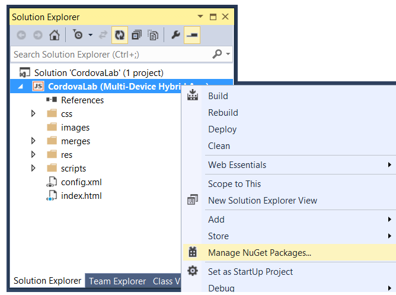
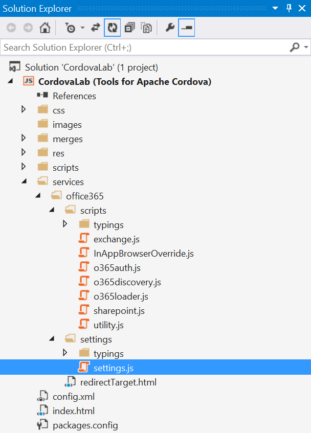
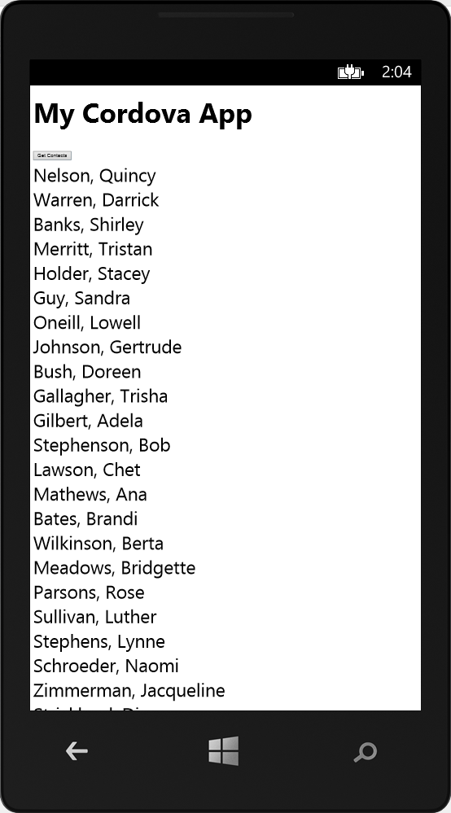

# Creating a Hybrid App using Cordova and the Office 365 APIs
In this lab, you will create a Hybrid app using Visual Studio and the Cordova platform. You will also go through the process of adding a Connected Service so that you can program your app using the Office 365 APIs.

## Prerequisites
1. You must have an Office 365 tenant and Windows Azure subscription to complete this lab. If you do not have one, the lab for **O3651-7 Setting up your Developer environment in Office 365** shows you how to obtain a trial. You must also have access to an Exchange inbox within an Office 365 developer tenancy.
2. You must have the Office 365 API Tools version 1.1.728 installed in Visual Studio 2013.
3. You must install the prerequisite software for Windows Phone and Cordova development which is outlined in the following article: [http://msdn.microsoft.com/en-us/library/dn757054.aspx](http://msdn.microsoft.com/en-us/library/dn757054.aspx). 

## Lab Setup: Setting up your Exchange account with Sample Contacts for Testing
1. Using the browser, navigate to https://outlook.office365.com/owa and log into your OWA mailbox.
2. In the top navigation bar, click the **People** link to navigate to the page which shows you your contacts.
3. Make sure there are a few contacts for testing. If you have no contacts or less then 10 contacts, use OWA to enter a few sample contacts so you have at least 10.
4. Once you have verified that you have a set of contacts for testing, you can move on to the next exercise where you will create and test your first app that programs against this contacts list.

## Exercise 1: Create New Cordova App in Visual Studio
In this exercise, you will create a new Visual Studio project for a Cordova app.

1. Launch **Visual Studio 2013** as administrator. 
2. In Visual Studio select **File/New/Project**.
3. In the **New Project** dialog, select **Templates > JavaScript > Multi-device Hybrid App** and click **Blank App (Apache Cordova)**. Name the new project **CordovaLab** and then click **OK**.    
  
4. Inspect the high-level structure of the new project that has just been created.
5. Note that the HTML page at the root of the project named **Index.html** contains the user interface that will be used when the app is launched. You should also understand that the JavaScript file in the **scripts** folder named **index.js** provides the JavaScript code which executes as the app is being initialized.  
  
6. Take a quick look at the **merges** folder. Notice it contains a child folder for each platform where you can add files and scripts that should only be added to specific platforms such as Android, iOS, Windows 8 or Windows Phone 8.  
  
7. Right-click on the top-level project node for the **CordovaLab** project and select **Manage Nuget Packages...**.   
  
8. Install the Nuget Package for **jQuery**.     

9. You should now see script files for the jQuery library along side **index.js** in the **scripts** folder.   
  
10. Open the HTML file named **index.html**. Inspect the code that was added by Visual studio which should match the following code listing.

		<!DOCTYPE html>
		<html>
		<head>
		  <meta charset="utf-8" />
		  <title>CordovaLab</title>
		
		  <!-- CordovaLab references -->
		  <link href="css/index.css" rel="stylesheet" />
		</head>
		<body>
		  
Hello, your application is ready!

		
		  <!-- Cordova reference, this is added to your app when it's built. -->
		  
		  
		
		  
		</body>
		</html>
11. Directly under the **&lt;body&gt;** begin tag, remove the **&lt;p&gt;** element with the text **Hello, your application is ready!** and replace it with the following HTML. 
		
		<h2>My Cordova App</h2>
		<button type="button" id="btnGetContacts">Get Contacts</button>
		
		

 
12. When you are done, the contents of **index.html** should match the following code listing.
		
		<!DOCTYPE html>
		<html>
		<head>
		  <meta charset="utf-8" />
		  <title>CordovaLab</title>
		
		  <!-- CordovaLab references -->
		  <link href="css/index.css" rel="stylesheet" />
		</head>
		<body>
		
		  <h2>My Cordova App</h2>
		  <button type="button" id="btnGetContacts">Get Contacts</button>
		
		  

		
		  <!-- Cordova reference, this is added to your app when it's built. -->
		  
		  
		  
		  
		</body>
		</html>
13. Open **index.js** in a code editor window and update its content to match the following code listing. This code will register an event handler to execute on the **click** event of the button with the id of **btnGetContacts**. When this button is clicked, the event handler named **onGetContacts** will add a "hello world" message into the **&lt;div&gt;** element with the id of **status**.
		
		(function () {
		  "use strict";
		
		  document.addEventListener('deviceready', onDeviceReady.bind(this), false);
		
		  function onDeviceReady() {
		    // app start up code goes here
		    $("#btnGetContacts").click(onGetContacts);
		  };
		
		  function onGetContacts() {
		    $("#status").text("Hello World!");
		  };
		
		})();
14. Now it's time to test out the app in the Visual Studio debugger. However, you must think about what target platform you'd like to use. Begin by selected **Android** in the **Solutions Platform** drop down and then selecting **Ripple - Nexus (Galaxy)** as the selected Android emulator.    

15. Press the **{F5}** key to begin a debugging session. The app should take a bit to start but then it should begin to run in the Ripple Android emulator which runs inside the Chrome browser.
16. Click the **Get Contacts** button and make sure you see the "hello world" message.
  
17. After you have played with the app in the Ripple emulator, close the Chrome browser. Return to Visual Studio and terminate the debugging session.
18. Now try debugging with a Windows Phone emulator. Select **Windows Phone** in the Platform Solutions drop down and select **Emulator WGVA** in the emulator drop down.

19. Press **{F5}** to start a debugging session with the Windows Phone emulator. after a bit, you should be able to see the app running in Windows Phone emulator.  

20. After you have tested the app, terminate the debugging session and return to Visual Studio.

## Exercise 2: Adding a Connected Service to a Cordova App
In this exercise, you will add a Connected Service to the project in order to program against the Office 365 APIs.

1. In the **Solution Explorer**, right click the **CordovaLab** project and select **Add/Connected Service**.    

2. In the **Services Manager** dialog, click **Register Your App**.
3. When prompted, login with your **Organizational Account**. After you have logged in, you should be able to see services for which you can configure permission requests.  

4. Select **Contacts** and then click **Permissions**.
5. Check both check boxes and then click **Apply**.  

6. Click **OK** to save your changes and dismiss the **Services Manager** dialog.
7. Take a moment to see what effect adding the Connected Service has had on your project. Begin by looking the the JavaScript library files such as **o365auth.js**, **o365discovery.js** and **exchange.js** that have been added to your project at the path of **services/office365/scripts**.  
  
8. Locate the file named **settings.js** which is located in the folder at the path of **services/office365/settings**.
9. Open **settings.js** and examine what's inside. As you can see that are values specific to your application. This script file will need to be referenced in the index.html page.  
			
		var O365Auth;
		(function (O365Auth) {
		    (function (Settings) {
		        Settings.clientId = '534990cf-099e-447e-aab9-6888fca3b2ba';
		        Settings.authUri = 'https://login.windows.net/common/';
		        Settings.redirectUri = 'http://localhost:4400/services/office365/redirectTarget.html';
		    })(O365Auth.Settings || (O365Auth.Settings = {}));
		    var Settings = O365Auth.Settings;
		})(O365Auth || (O365Auth = {}));

10. Now open **o365loader.js** located at the path of **services/office365/scripts**. This script file dynamically adds reference to all the other Office 365 API scripts, and thus cleaner in app pages (one script reference instead of 8).

		var O365Libraries = [
		    'services/office365/settings/settings.js',
		    'services/office365/scripts/InAppBrowserOverride.js',
		    'services/office365/scripts/utility.js',
		    'services/office365/scripts/o365auth.js',
		    'services/office365/scripts/o365discovery.js',
		    'services/office365/scripts/aadgraph.js',
		    'services/office365/scripts/exchange.js',
		    'services/office365/scripts/sharepoint.js'
		];

		O365Libraries.forEach(function (path, index, array) {
		    var scriptTag = document.createElement('script');
		    scriptTag.setAttribute('src', path);
		    document.head.appendChild(scriptTag).parentNode.removeChild(scriptTag);
		});

11. Open **Index.html** and add a script link to  both **settings.js** and **o365loader.js** just before the script link to **index.js**.
		
		
		
		
		
		
		
11. You have now added support for programming your app against the Office 365 APIs which you will begin the the next exercise.

## Exercise 3: Programming the App using the Office 365 APIs
In this exercise, you will make use of the Connected Service you added in the previous exercise by writing code against the JavaScript libraries of the Office 365 APIs.

1. Open **index.js** and update the **onGetContacts** function to match the following code listing.
		
		function onGetContacts() {
		    //authenticate to Office 365
		    var authContext = new O365Auth.Context();
		    authContext.getIdToken('https://outlook.office365.com/').then(function (token) {
		        //get access token for exchange
		        var accessTokenFn = token.getAccessTokenFn('https://outlook.office365.com');
		
		        //create exchange client and query contacts
		        var client = new Microsoft.OutlookServices.Client('https://outlook.office365.com/ews/odata', accessTokenFn);
		        client.me.contacts.getContacts().fetch().then(onContactsReceived);
		    });
		};
2. Create a new function named **onContactsReceived** directly after **onGetContacts**. Implement this method to match the following code listing.
		
		function onContactsReceived(contacts) {
		    for (var i = 0; i < contacts.currentPage.length; i++) {
		        var currentContact = contacts.currentPage[i];
		        var currentContactName =
		            currentContact.surname + ', ' + currentContact.givenName;
		        var contactDiv = $('
').text(currentContactName);
		        $('#status').append(contactDiv);
		        $('#btnGetContacts').hide();
		    }
		};
3. Now begin a debugging session using Windows Phone. Press the **{F5}** key to begin a debugging session.
4. After the app has started, press the **Get Contacts** button. You should then see a prompt to Sing In. Sign into Office 365 using your organizational account.    
  
5. Once you are signed in, you will be prompted as to whether you trust the app. Click **OK** to continue.  

6. After you have trusted the app, you code should run and display a list off contacts from your Office 365 account.

 
Congratulations! You have completed a simple hybrid app project using the Cordova platform and the Office 365 APIs.

