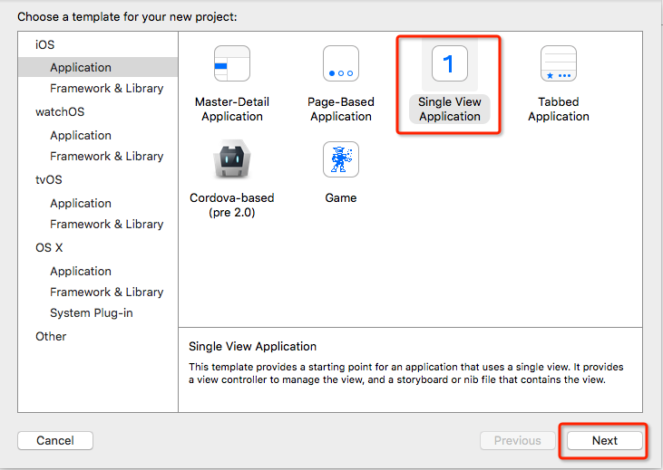
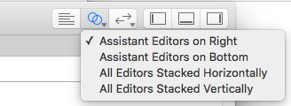
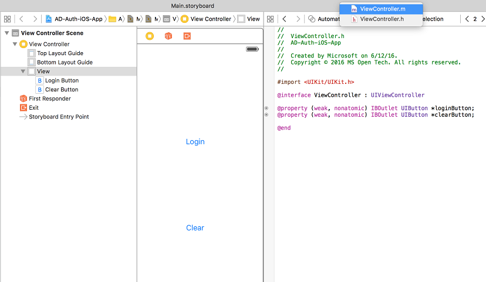
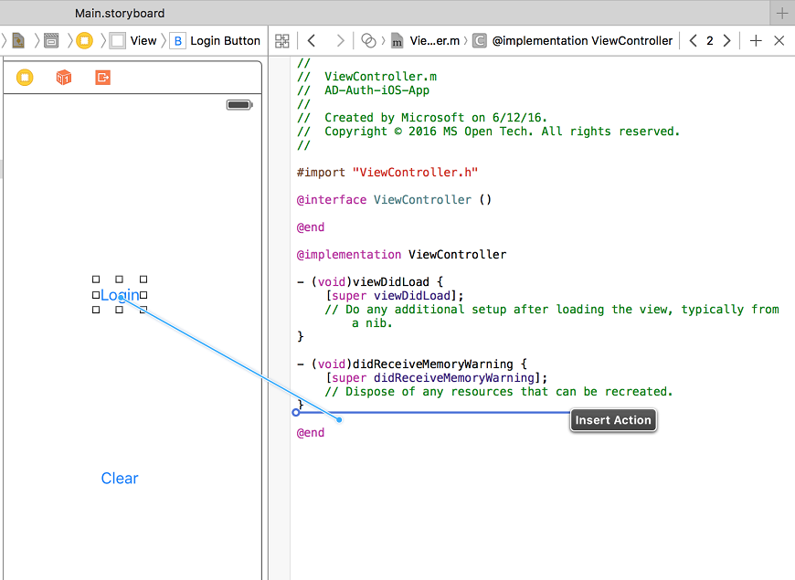
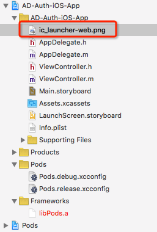
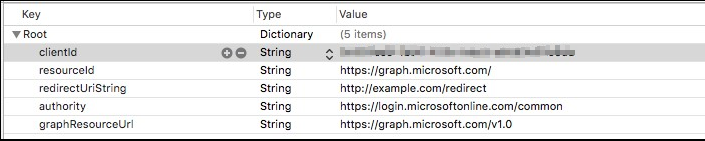
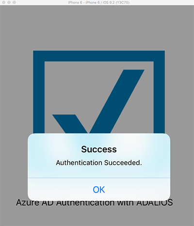
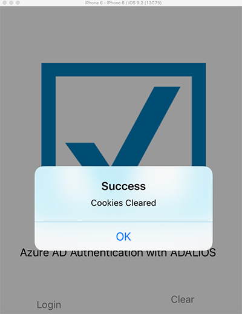

Authentication with Office 365
==============================

## Overview

The lab lets students configure and run an iOS App which allows the user to authenticate to an Azure ActiveDirectory account using ADALiOS library.

## Objectives

- Learn how to authenticate with Azure AD from iOS using the **Azure Active Directory Authentication Library (ADAL) for iOS**.
- Learn how to get a token and store it for further requests.
 
## Prerequisites

- OSX 10.X environment
- [XCode 7](https://itunes.apple.com/nz/app/xcode/id497799835?mt=12)
- [Cocoapods dependency manager][cocoapods]
- Complete the  [\\\O3654\O3654-5\01 Azure AD Auth Prerequisites](../01 Azure AD Auth Prerequisites) module.

[cocoapods]: https://cocoapods.org

## Exercises

The hands-on lab includes the following exercises:

- [Create a New Project and add the ADALiOS library](#exercise1)
- [Add login and clear buttons to get a token from Azure AD](#exercise2)

<a name="exercise1"></a>
## Exercise 1: Create a New Project and add ADALiOS library
In this exercise you will create a New Project, add the ADALiOS library as a cocoapods dependency and install it.

Then check everything is ok by starting up the app.

### Task 1 - New Project

01. Launch XCode and create a new **Single View Application**

    

02. Fill the inputs with the application info
     
    

03. Choose the destination folder
     
    

03. Using Finder, on the project folder, create a new text file called **Podfile** (without a file extension), and add the lines

    ```ruby
    target 'AD-Auth-iOS-App' do
 	 pod 'ADALiOS'
	end
    ```

04. Now open a terminal and navigate to the root folder of the project. Then execute the following command:

    ```bash
    pod install
    ```

    This will retrieve a copy of the ADALiOS library, store it into the local 
    Pods folder and import into our project. Always remember that this command will take effect if executed in the same folder as the .xcodeproj file.

05. Close XCode and re-open the project, this time using the **.xcworkspace** file.
    This workspace includes the pod libraries.

06. Build the workspace to ensure it builds successfully.

<a name="exercise2"></a>
## Exercise 2: Create the application using storyboards and ADALiOS library
In this exercise you will add the action buttons to the application, connect them to the code and use the Login and Clear token features with ADALiOS

### Task 1 - Add buttons to the view and connect to the code

01. Using the storyboard feature, open the Main.storyboard file and add two buttons for Login and Clear actions

    

02. Change the storyboard size to have a real reference of the screen. Do this selecting the view controller and changing the size settings from the right panel
        
    

03. Open **Assistant Editor on Right** This will show the counterparts of a file.

    

04. Select the **ViewController.h** file to connect the buttons

    

05. Right click on the buttons and drag the line to the header file of the controller.

    

06. Select the **ViewController.m** in the right editor to connect actions with this counterpart

    

07. Right click on the buttons and drag the line to the implementation file of the controller for **Touch Down** event.

    
    

08. Add **ic_launcher-web.png** to **AD-Auth-iOS-App** project.

     
     
09. Finally add an Image and a Label in the main screen, then adjust button position.

    


### Task 2 - Add behavior to the buttons and use ADALiOS methods

01. On the **ViewController.m** file add the following imports before the implementation declaration

    ```objc
    #import <ADALiOS/ADAL.h>
    ```

02. Inside the implementation declaration add the following variables

    ```objc
    ADAuthenticationContext* authContext;
    NSString* authority;
    NSString* redirectUriString;
    NSString* resourceId;
    NSString* clientId;
    NSString* token;
    ```

03. Create a property list file **Auth.plist** into **AD-Auth-iOS-App** project.

    

04. Open the file and fill it with the following properties:

    

    > **Note:** You can find the clientId/redirectUriString in [\\\O3654\O3654-5\01 Azure AD Auth Prerequisites\hands-on-lab.md](../01 Azure AD Auth Prerequisites/hands-on-lab.md)

05. Set the variables values in the **viewDidLoad** method to initialize with the **Auth.plist** values when the application starts

    ```objc
    //Azure AD account info
    NSString* plistPath = [[NSBundle mainBundle] pathForResource:@"Auth" ofType:@"plist"];
    NSDictionary *content = [NSDictionary dictionaryWithContentsOfFile:plistPath];
    authority = [content objectForKey:@"authority"];
    resourceId = [content objectForKey:@"resourceId"];
    clientId = [content objectForKey:@"clientId"];
    redirectUriString = [content objectForKey:@"redirectUriString"];
    ```

06. Add the following methods to the implementation file.
    
    This method attempts to acquire an authentication token using the
    `ADAuthenticationContext` class.

    ```objc
	 -(void) getToken : (BOOL) clearCache completionHandler:(void (^) (NSString*))completionBlock;
	{
	    ADAuthenticationError *error;
	    authContext = [ADAuthenticationContext authenticationContextWithAuthority:authority error:&error];
	    NSURL *redirectUri = [NSURL URLWithString:redirectUriString];
	    if(clearCache){
	        [authContext.tokenCacheStore removeAllWithError:nil];
	    }
	    [authContext acquireTokenWithResource:resourceId clientId:clientId redirectUri:redirectUri completionBlock:^(ADAuthenticationResult *result) {
	        if (AD_SUCCEEDED != result.status){
	            // display error on the screen
	            NSLog(@"Error in the authentication");
	            [self showMessage:@"Authentication failed. Check the log for errors." withTitle:@"Error"];
	        }
	        else{
	            completionBlock(result.accessToken);
	        }
	    }];
	}
	-(void)showMessage:(NSString*)message withTitle:(NSString *)title
	{
	    UIAlertController * alert=   [UIAlertController                            alertControllerWithTitle:title
	                                  message:message
	preferredStyle:UIAlertControllerStyleAlert];
	    UIAlertAction* yesButton = [UIAlertAction
	                                actionWithTitle:@"OK"
	            style:UIAlertActionStyleDefault
	                                handler:^(UIAlertAction * action)
	                                {
	                                    [alert dismissViewControllerAnimated:YES completion:nil];
	                                }];
	    [alert addAction:yesButton];
	    [self presentViewController:alert animated:YES completion:nil];
	}
    ```

07. Implement the login action by adding the following code:

    ```objc
	- (IBAction)loginAction:(id)sender {
	    [self getToken:FALSE completionHandler:^(NSString *token){
	        dispatch_async(dispatch_get_main_queue(), ^{
	            [self showMessage:@"Authentication Succeeded." withTitle:@"Success"];
	        });
	    }];
	}
    ```

08. Implement the clear action by adding the following code:

    ```objc
	- (IBAction)clearAction:(id)sender {
	    ADAuthenticationError* error;
	    id<ADTokenCacheStoring> cache = [ADAuthenticationSettings sharedInstance].defaultTokenCacheStore;
	    NSArray* allItems = [cache allItemsWithError:&error];
	    if (allItems.count > 0)
	    {
	        [cache removeAllWithError:&error];
	    }
	    if (error)
	    {
	        dispatch_async(dispatch_get_main_queue(), ^{
	            NSString *errorMessage = [@"Clear cache failed. Reason: " stringByAppendingString: error.errorDetails];
	            [self showMessage:errorMessage withTitle:@"Error"];
	        });
	        return;
	    }
	    NSHTTPCookieStorage* cookieStorage = [NSHTTPCookieStorage sharedHTTPCookieStorage];
	    NSArray* cookies = cookieStorage.cookies;
	    if (cookies.count)
	    {
	        for(NSHTTPCookie* cookie in cookies)
	        {
	            [cookieStorage deleteCookie:cookie];
	        }
	    }
	    dispatch_async(dispatch_get_main_queue(), ^{
	        [self showMessage:@"Cookies Cleared" withTitle:@"Success"];
	    });
	}
    ```

09. Build and run application with the **Play** button in the left corner of the screen

     
    
10. The following screen will display.
 
     

11. Tap **Login** to Authentication with Azure AD.

     
     
12. Login Successfully.

     
   
13. Tap **Clear** to sign out.
   
    

## Summary

By completing this hands-on lab you have learned:

01. Some of the basics of iOS development.

02. How to add the ADALiOS library to the application using Cocoapods.

03. How to get an Access Token from Azure AD using the Active Directory Authentication Library.

