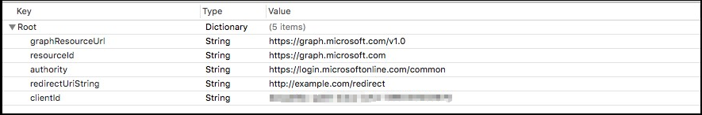
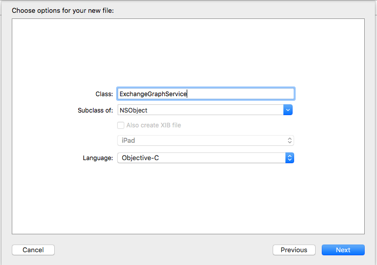
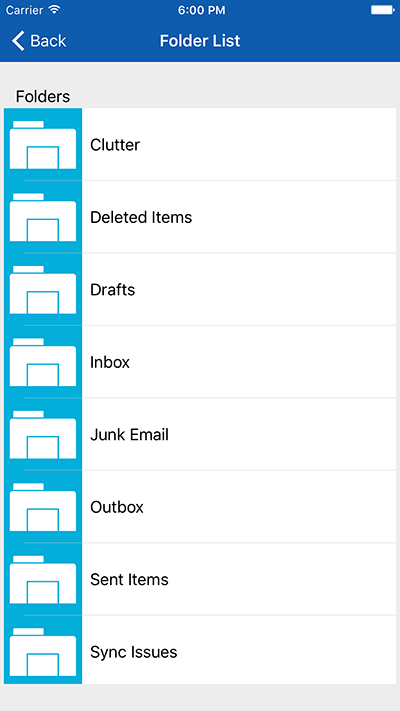
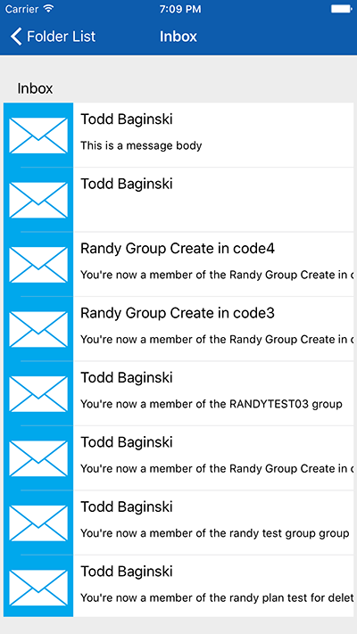
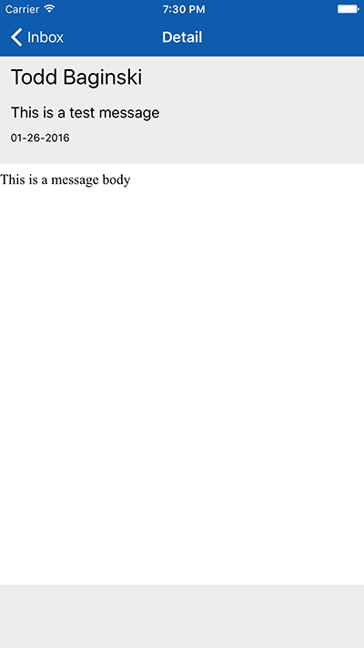

Calling Microsoft Graph for Mail APIs with iOS
==============================================

## Overview

The lab lets students use an AzureAD account to manage an Exchange mailbox in a
Office 365 tenant with an iOS app.

## Objectives

- Learn how to create a Microsoft Graph client to manage an Exchange mailbox
- Learn how to list folders and messages

## Prerequisites

- OSX 10.X environment
- [XCode 7][xcode-7]
- [Cocoapods dependency manager][cocoapods]
- Complete the  [\\\O3654\O3654-5 Native iOS Development with Office 365 APIs\01 Azure AD Auth Prerequisites](/O3654/O3654-5 Native iOS Development with Office 365 APIs/01 Azure AD Auth Prerequisites) module.

[xcode-7]: https://itunes.apple.com/nz/app/xcode/id497799835?mt=12
[cocoapods]: cocoapods.org

## Exercises

The hands-on lab includes the following exercises:

- [Add Microsoft Graph SDK library to the project](#exercise1)
- [Create a ExchangeGraphService to get access to Exchange](#exercise2)
- [Connect actions in the view to Microsoft Graph SDK for Exchange](#exercise3)

<a name="exercise1"></a>
## Exercise 1: Add Microsoft Graph SDK library to the project
In this exercise you will use an existing application with the AzureAD 
authentication included, to add Microsoft Graph SDK library in the project.

### Task 1 - Open the Project
01. Clone this git repository

02. On Finder, open the **[\\\O3654\O3654-5 Native iOS Development with Office 365 APIs\04 O365 Exchange SDK\src\O365-Exchange-App\Podfile](/O3654/O3654-5 Native iOS Development with Office 365 APIs/04 O365 Exchange SDK/src/O365-Exchange-App/Podfile)** file under the root folder of the project and add the line:

    ```ruby
    pod 'orc'
    pod 'MSGraph-SDK-iOS'
    ```
    
03. Open a Terminal and navigate to the `src/O365-Exchange-App/` folder of the project.

    Execute the following:

    ```bash
    pod install
    ```
    
02. Open the **.xcworkspace** file in the **[\\\O3654\O3654-5 Native iOS Development with Office 365 APIs\04 O365 Exchange SDK\src\O365-Exchange-App](/O3654/O3654-5 Native iOS Development with Office 365 APIs/04 O365 Exchange SDK/src/O365-Exchange-App)** folder

03. Find and Open the **Auth.plist** file.

04. Fill the AzureAD account settings with the following configuration values:
    
    > Note: You can find the clientId/redirectUriString in [\\\O3654\O3654-5 Native iOS Development with Office 365 APIs\01 Azure AD Auth Prerequisites\hands-on-lab.md](/O3654/O3654-5 Native iOS Development with Office 365 APIs/01 Azure AD Auth Prerequisites/hands-on-lab.md)
    
    -   **graphResourceUrl** - The URL of the Microsoft Graph service, it is "https://graph.microsoft.com/v1.0"
    -   **resourceId**              - The root URL of the Microsoft Graph service, it  is "https://graph.microsoft.com"
    -   **authority**               - "https://login.microsoftonline.com/common"
    -   **redirectUriString**       - The redirect URL configured in Azure AD, e.g. "http://example.com/redirect"
    -   **clientId**                - The client Id obtained from Azure AD
    
    

03. Build and Run the project in an iOS Simulator to check the views

    Application:
    You will see a login page with buttons to access the application and to clear credentials.
    Once authenticated, the mailbox folders list will appear with one fake entry. Selecting one, you will see the emails inside the folder, and also check each email.

    Environment:
    With the credentials settings we can access to the client user mailbox through the Outlook Exchange tenant, and will be able to implement every single details of a complete email app, only using Microsoft Graph SDK
    
    

<a name="exercise2"></a>
## Exercise 2: Create a ExchangeGraphService to get access to Exchange
In this exercise you will connect your application to get a **MSGraphServiceClient**. This client is able to gather different verbs and send a single command to execute and get results.

01. On the XCode files explorer, make a right click in the group **Helpers** and 
select **New File**. You will see the **New File wizard**. Click on the **iOS** 
section, select **Cocoa Touch Class** and click **Next**.

    

02. In this section, configure the new class giving it a name (**ExchangeGraphService**), and make it a subclass of **NSObject**. Make sure that the language dropdown is set with **Objective-C** because our o365-lists library is written in that programming language. Finally click on **Next**.

        

03. Now we are going to select where the new class sources files (.h and .m) will be stored. In this case we can click on **Create** directly. This will create a **.h** and **.m** files for our new class.

    

04. Open the **ExchangeGraphService.h** and add the header for the **getGraphServiceClient** method to get **MSGraphServiceClient**.

    ```objc
    -(void)getGraphServiceClient:(void (^)(MSGraphServiceClient * client, NSError *error))getClientCallBack;
    ```

    Add the import sentence

    ```objc
    #import <ADALiOS/ADAL.h>
	#import <impl/impl.h>
    #import <MSGraph-SDK-iOS/MSGraphService.h>
    #import <MSGraph-SDK-iOS/MSGraphServiceClient.h>
    ```
05. In **ExchangeGraphService.m** add the method body:

    ```objc
	-(void)getGraphServiceClient:(void (^)(MSGraphServiceClient * client, NSError *error))getClientCallBack{
	    NSString* plistPath = [[NSBundle mainBundle] pathForResource:@"Auth" ofType:@"plist"];
	    NSDictionary *content = [NSDictionary dictionaryWithContentsOfFile:plistPath];
	    
	    NSString* authority = [content objectForKey:@"authority"];
	    NSString* resourceId = [content objectForKey:@"resourceId"];
	    NSString* clientId = [content objectForKey:@"clientId"];
	    NSString* redirectUriString = [content objectForKey:@"redirectUriString"];
	    NSString* graphResourceUrl = [content objectForKey:@"graphResourceUrl"];
	    
	    ADAuthenticationError *error;
	    ADAuthenticationContext* context = [ADAuthenticationContext authenticationContextWithAuthority:authority error:&error];
	    
	    if (!context)
	    {
	        getClientCallBack(nil,error);
	        return;
	    };
	    
	    ADALDependencyResolver *resolver = [[ADALDependencyResolver alloc] initWithContext:context resourceId:resourceId clientId: clientId redirectUri:[NSURL URLWithString:redirectUriString]];
	    MSGraphServiceClient *client = [[MSGraphServiceClient alloc] initWithUrl:graphResourceUrl dependencyResolver:resolver];
	    
	    getClientCallBack(client,nil);
	}
    ```
06. Open the **ExchangeGraphService.h** and add the header for the **getGraphServiceClient** method to get folders.

    ```objc
    -(void)getFolders:(void (^)(NSArray * folders, NSError *error))getFoldersCallBack;
    ```
    
07. In **ExchangeGraphService.m** add the method body:

    ```objc
	-(void)getFolders:(void (^)(NSArray * folders, NSError *error))getFoldersCallBack{
	    [self getGraphServiceClient:^(MSGraphServiceClient *client, NSError *error) {
	        if(error!=nil){
	            getFoldersCallBack(nil,error);
	        }
	        else{
	            MSGraphServiceMailFolderCollectionFetcher *itemCollectionFetcher = [[[MSGraphServiceMailFolderCollectionFetcher alloc] initWithUrl:@"/me/mailFolders" parent:client] orderBy:@"displayName"];
	            
	            [itemCollectionFetcher readWithCallback:^(NSArray *itemCollection, MSOrcError *error) {
	                getFoldersCallBack(itemCollection,error);
	            }];
	        }
	    }];
	}
    ```
08. Open the **ExchangeGraphService.h** and add the header for the **getGraphServiceClient** method to get message list for specific folder.

    ```objc
    -(void)getFolderContent:(NSString*)folderId  callback:(void (^)(NSArray * messages, NSError *error))getFolderContentCallBack;
    ```
    
07. In **ExchangeGraphService.m** add the method body:

    ```objc
	-(void)getFolderContent:(NSString*)folderId  callback:(void (^)(NSArray * messages, NSError *error))getFolderContentCallBack
	{
	    
	    [self getGraphServiceClient:^(MSGraphServiceClient *client, NSError *error) {
	        if(error!=nil){
	            getFolderContentCallBack(nil,error);
	        }
	        else{
	            MSGraphServiceMessageCollectionFetcher *itemCollectionFetcher = [[MSGraphServiceMessageCollectionFetcher alloc] initWithUrl:[NSString stringWithFormat:@"/me/mailFolders/%@/messages",folderId] parent:client];
	            
	            [itemCollectionFetcher readWithCallback:^(NSArray *itemCollection, MSOrcError *error) {
	                getFolderContentCallBack(itemCollection,error);
	            }];
	        }
	    }];
	}
    ```
           
05. Build the application and check everything is ok.

<a name="exercise3"></a>
## Exercise 3: Connect actions in the view to Microsoft Graph SDK for Exchange
In this exercise you will navigate in every controller class of the project, in order to connect each action (from buttons, lists and events) with Exchange operations.

The Application has every event wired up with their respective controller classes. 
We need to connect these event methods to execute a verb in Exchange and gather the results.
The verb is composed by an aggregation of commands that will generate a single sentence to execute in the server side using OData queries and filters.

### Task1 - Wiring up FolderListView

01. Open the **FolderListViewController.h** class header and add two properties to hold the array that will hold the folder from the account and another one to hold the current folder when selecting from the table.

    ```objc
    @property (nonatomic) NSArray *folders;
    @property (nonatomic) MSGraphServiceMailFolder *currentFolder;
    ```
    
    And add the import sentence

    ```objc
	#import <MSGraph-SDK-iOS/MSGraphServiceClient.h>
	#import "ExchangeGraphService.h"
    ```
    
02. Open the **FolderListViewController.m** class implementation

03. Add the **getFolders** method:

    ```objc
	-(void)getFolders{
	    [self.spinner startAnimating];
	    
	    ExchangeGraphService *exchangeService =[[ExchangeGraphService alloc] init];
	    [exchangeService getFolders:^(NSArray *folders, NSError *error) {
	        self.folders = folders;
	        dispatch_async(dispatch_get_main_queue(),^{
	            [self.spinner stopAnimating];
	            [self.tableView reloadData];
	        });
	    }];
	}
    ```

04. Call the **getFolders** method from **viewWillAppear**:

    ```objc
	- (void) viewWillAppear:(BOOL)animated{
	    [self getFolders];
	}
    ```

05. Change the **UITableView** delegate methods:

    ```objc
	- (NSInteger)tableView:(UITableView *)tableView numberOfRowsInSection:(NSInteger)section{
	    return [self.folders count];
	}

	- (UITableViewCell *)tableView:(UITableView *)tableView cellForRowAtIndexPath:(NSIndexPath *)indexPath{
	    NSString* identifier = @"folderListCell";
	    EmailListTableViewCell *cell =[tableView dequeueReusableCellWithIdentifier: identifier ];
	    
	    MSGraphServiceMailFolder *cellFolder = (MSGraphServiceMailFolder*)[self.folders objectAtIndex: indexPath.row];
	    cell.title.text = cellFolder.displayName;
	    
	    return cell;
	}
        
	- (void)prepareForSegue:(UIStoryboardSegue *)segue sender:(id)sender
	{
	    
	    FolderContentViewController *controller = (FolderContentViewController *)segue.destinationViewController;
	    //controller.currentFolder = self.currentFolder;
	    
	}

	- (void)tableView:(UITableView *)tableView didSelectRowAtIndexPath:(NSIndexPath *)indexPath
	{
	    self.currentFolder= [self.folders objectAtIndex:indexPath.row];
	    
	    [self performSegueWithIdentifier:@"detail" sender:self];
	}
    ```

06. Build and Run the application. Check everything is ok. Now you can see the list with all the folders from the Outlook account.

    

### Task2 - Wiring up FolderContentView

01. In **FolderListViewController.m** file, uncomment the **prepareForSegue:sender:**

    ```objc
    controller.currentFolder = self.currentFolder;
    ```

    And add a property to hold the folder in **FolderContentViewController.h**

    ```objc
    @property (nonatomic) MSGraphServiceMailFolder *currentFolder;
    ```
    
    And add the import sentence

    ```objc
	#import <MSGraph-SDK-iOS/MSGraphServiceClient.h>
	#import "ExchangeGraphService.h"
    ```
02. And add two properties to hold the contents, and another one to hold the current message selection in **FolderContentViewController.h**
 
    ```objc
    @property (nonatomic) NSArray *folderMessages;
    @property (nonatomic) MSGraphServiceMessage *currentMsg;
    ```
    
02. Now in **FolderContentViewController.m** load the folder contents adding:

    ```objc
    -(void) getFolderContent{
    [self.spinner startAnimating];
    ExchangeGraphService *exchangeService =[[ExchangeGraphService alloc] init];
    [exchangeService getFolderContent:self.currentFolder._id callback:^(NSArray *messages, NSError *error) {
        self.folderMessages = messages;
        dispatch_async(dispatch_get_main_queue(),^{
            [self.spinner stopAnimating];
            [self.tableView reloadData];
        });
     }];
}
    ```

03. Add the **viewWillAppear** method and call the **getFolderContent** method

    ```objc
	-(void) viewDidAppear:(BOOL)animated{
	    self.currentMsg = nil;
	    [self getFolderContent];
	}
    ```

04. Change the **UITableView** delegate methods:

    ```objc
	- (NSInteger)tableView:(UITableView *)tableView numberOfRowsInSection:(NSInteger)section{
	    return [self.folderMessages count];
	}

	- (UITableViewCell *)tableView:(UITableView *)tableView cellForRowAtIndexPath:(NSIndexPath *)indexPath{
	    NSString* identifier = @"msgListCell";
	    EmailListTableViewCell *cell =[tableView dequeueReusableCellWithIdentifier: identifier ];
	    
	    MSGraphServiceMessage *msg = [self.folderMessages objectAtIndex:indexPath.row];
	    
	    cell.title.text = msg.from.emailAddress.name;
	    cell.subtitle.text = msg.bodyPreview;
	    
	    return cell;
	}
	- (void)prepareForSegue:(UIStoryboardSegue *)segue sender:(id)sender
	{
	    
	    EmailDetailViewController *controller = (EmailDetailViewController *)segue.destinationViewController;
	    //controller.currentMsg = self.currentMsg;
	    
	}
	- (void)tableView:(UITableView *)tableView didSelectRowAtIndexPath:(NSIndexPath *)indexPath
	{
	    self.currentMsg= [self.folderMessages objectAtIndex:indexPath.row];
	    
	    [self performSegueWithIdentifier:@"msgDetail" sender:self];
	}

	- (BOOL)shouldPerformSegueWithIdentifier:(NSString *)identifier sender:(id)sender{
	    return ([identifier isEqualToString:@"msgDetail"] && self.currentMsg);
	}
    ```

05. Add the folder name in the label. To do so, add the following in the **viewDidLoad** method.

    ```objc
    self.folderName.text = self.currentFolder.displayName;
    self.title = self.currentFolder.displayName;
    ```


06. Build and Run the application. Check everything is ok. Now you can see the list with all the messages of a Folder.

    

### Task3 - Wiring up EmailDetailView

01. In **EmailDetailViewController.h** add a property to hold the current message:

    ```objc
    @property (nonatomic) MSGraphServiceMessage *currentMsg;
    ```

    And add the import sentence

    ```objc
	#import <MSGraph-SDK-iOS/MSGraphServiceClient.h>
	#import "ExchangeGraphService.h"
    ```
    
02. Now in **FolderContentViewController.m**, uncomment the line in **prepareForSegue:sender:** method

    ```objc
    //controller.currentMsg = self.currentMsg;
    ```

03. In the **viewDidLoad** method, set the values for labels and the email body showing the html code in a proper way to the user

    ```objc
    self.author.text = self.currentMsg.from.emailAddress.name;
    self.subject.text = self.currentMsg.subject;
    
    [self.emailBody loadHTMLString:self.currentMsg.body.content  baseURL: nil];
    
    NSDate *msgDate = self.currentMsg.sentDateTime;
    
    NSDateFormatter *formatter = [[NSDateFormatter alloc] init];
    [formatter setDateFormat:@"MM-dd-yyyy"];
    self.date.text = [formatter stringFromDate:msgDate];
    ```

04. Build and Run the application. Check everything is ok. Now you can see the email and its details

    

## Summary

By completing this hands-on lab you have learned:

01. The way to connect an iOS application with an Office 365 tenant.

02. How to retrieve information from Outlook using Microsoft Graph SDK.