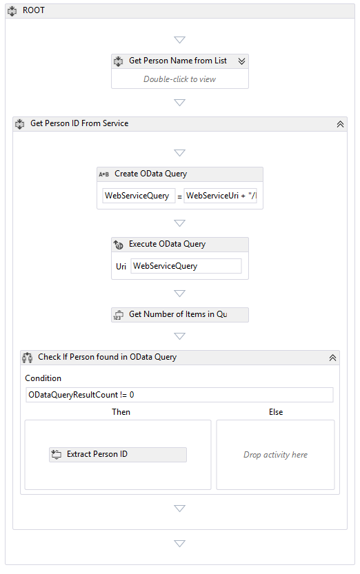
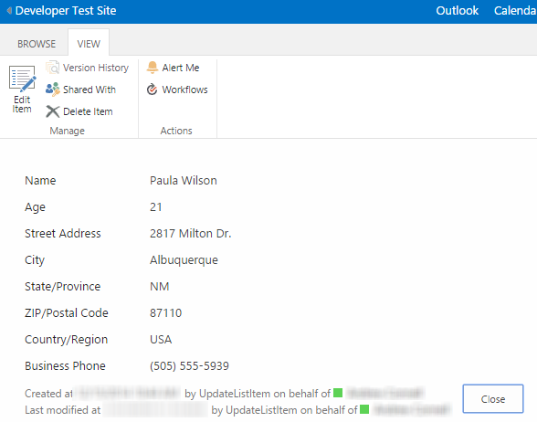

#Developing Advanced Workflow Scenarios in Office 365

In this lab you will create two workflows for your SharePoint 2013 site that will demonstrate the following capabilities: calling & consuming web services from the workflow, creating initiation forms, creating both sequential and state machine workflows, reading & updating SharePoint list items and assigning tasks to users.

## Prerequisites
1. You must have one of the following environments:
  1. An Office 365 tenant or 
  1. An On-premises SharePoint 2013 environment that has been configured & connected to an existing Workflow Manager 1.* farm.
1. You must have the Office Developer Tools for Visual STudio 2013 version 12.0.31105 installed in Visual Studio 2013.

## Exercise 1: Create Sequential Web-Service Enabled Workflow
*In this exercise you will create a sequential workflow that will lookup a provided user in a remote web service. If it finds a matching user in the remote service it takes the user's information and updates the SharePoint list item.*

1. Launch Visual Studio 2013.
1. Create a new SharePoint Hosted App project:
  1. In Visual Studio select **File/New/Project**.
  1. Select the **App for SharePoint** from the **Visual C#/Office-SharePoint/Apps** template category.
  1. Set the name of the project to **UpdateListItem** and click **OK**.
  1. In the next page of the wizard, enter the URL of a SharePoint 2013 Developer site to use for testing & set the type of app as a **SharePoint-hosted** app.
  1. Finally click **Finish**
1. Before creating the workflow, you need a list to attach it to. Therefore, create a list that will be used for testing the workflow:
  1. Right-click the project **UpdateListItem** in the **Solution Explorer** tool widow and select **Add / New Item**.
  1. In the **Add New Item** dialog, select **List**.
  1. Give the list a name of **SalesLeads** and click **Add**.
  1. On the **SharePoint Customization Wizard** page, set the name of the list to **Sales Leads**, select a **customizable list template** and pick **Default (Custom List)**.

    

  1. Click **Finish**.
  1. After Visual Studio creates the list, it will open the list designer.
  1. Make the following changes & additions to the list schema as shown in the following screen shot:
    1. Change **Title** to **Name**.
    1. Add **Age** (type = Number).
    1. Add **Street Address** (type = Single Line of Text).
    1. Add **City** (type = Single Line of Text).
    1. Add **State/Province** (type = Single Line of Text).
    1. Add **Zip/Postal Code** (type = Single Line of Text).
    1. Add **Country/Region** (type = Single Line of Text).
    1. Add **Business Phone** (type = Single Line of Text).

    

1. Because this app will test a workflow using a SharePoint list, simplify the startup experience of the app by changing the start page.
  1. Open the `AppManifest.xml` file.
  1. Change the **Start Page** to **UpdateListItem/Lists/SalesLeads** to load the list's index page when starting the app.
1. Add a new workflow to the project:
  1. Right-click the project **UpdateListItem** in the **Solution Explorer** tool widow and select **Add / New Item**.
  1. Select **Workflow** from the **Office/SharePoint** template category and set the name to **UpdateContactFromService**.
  1. Click **Add**.
  1. In the **SharePoint Customization Wizard**, set the name to **Update Contact From Service** and set it to a **List Workflow**, then click **Next**.

    

  1. On the next page in the wizard, do the following:
    1. Check the box for **Would you like Visual Studio to automatically associate the workflow**. 
    1. Set **The library or list to associate your workflow with** to **SalesLeads**.
    1. Set **The history list to display content logged by WriteToHistory activity** to **<CreateNew>**.
    1. Set **The task list where the workflow will create tasks for workflow participants** to **<CreateNew>**.
    1. Click **Finish**.
1. At this point you have an empty workflow in the design surface in Visual Studio. The first step will be to do some high-level customizations to change the overall sequence & add some global variables to the workflow.
  1. Rename the default activity:
    1. Select the single **Sequence** activity.
    1. Using the **Properties** tool window, change the **DisplayName** to **Root**.

      > This is a good practice to follow as you will see that most workflows contain multiple nested sequences. Just above the design surface where it says *workflow* is a breadcrumb-like navigation that will fill up the more nested you are in the workflow. If it said *Sequence* multiple times, it would provide zero value. Therefore starting with *ROOT* is clear that this is the top-most part of the workflow.
  1. Now add some variables that will be used throughout the workflow. At the bottom of the designer, click the **Variables** tab to bring up a new pane to create variables.

    

  1. Add the following variables with the specified data types and default values:
    1. **PersonName** (string)
    1. **WebServiceResponse** (DynamicValue)
    
      > This data type won't be visible in the selector automatically. Select **Browse for types** and type the data type **DynamicValue** in the search to find it.
    
    1. **WebServiceQuery** (string)
    1. **PersonID** (string), Default = **"-1"**
    1. **WebServiceUri** (string), Default = **"http://services.odata.org/V3/OData/OData.svc" **

    

1. Add the first sequence (step) to the workflow to retrieve the name of the person entered into the list item that you will search for in the remote web service:
  1. Using the **Toolbox**, drag a **Sequence** activity to the design surface and place it into the existing **Root** sequence.
  1. Rename the new sequence to **Get Person Name from ListItem** using the technique you used to rename the default sequence.

    

  1. Using the **Toolbox**, drag a **LookupSPListItem** activity into the sequence you just created.
  1. Select the **LookupSPListItem** activity and using the **Properties** tool window, set the following values:
    1. ItemId: **(current item)**
    1. ListId: **(current list)**
    1. DisplayName: **Get List Item Properties**
    1. Result: **WebServiceResponse**
  1. Drag a **GetDynamicValueProperties** activity just after the activity you just added in the last step. Using the **Properties** tool window, set the following values:
    1. DisplayName: **Extract Person Name to Local Value**
    1. OData DataSource: **CHECKED**
    1. Source: **WebServiceResponse**
    1. Click the **...** builder button for the **Properties** property.
      1. Set the **Entity Type** to **List Item of SalesLeads**.
      1. Select the property **Name** and assign it to the **PersonName** variable as shown in the following figure:

        

  At this point your workflow should look like he following figure:

    

1. Add a second sequence that will query the web service for a matching name entered in the list item.
  1. Add a new **Sequence** activity immediately after the existing **Get Person Name from List Item** activity.
    1. Rename the new activity to **Get Person ID from Service**.
  1. Add a new **Assign** activity & set it's properties to the following values:
    1. DisplayName: **Create OData Query**
    1. To: **WebServiceQuery**
    1. Value: **WebServiceUri + "/Persons?$select=ID&$filter=Name eq '" + PersonName + "'"**
  1. Execute the web service by adding a **HttpSend** activity. Set it's properties to the following values:
    1. DisplayName: **Execute OData Query**
    1. Method: **GET**
    1. Uri: **WebServiceQuery**
    1. ResponseContent: **WebServiceResponse**
    1. Click the **...** button on the **RequestHeaders** property.
      1. Add a header **Accept** with the value of **"application/json;odata=verbose"**.
  1. Add a new variable that will hold the number of items returned by the web service query. Use the following values to create the variable using the same technique you used previously to create variables:
    1. Name: **ODataQueryResultCount**
    1. Variable Type: **Int32**
    1. Scope: **Get Person ID from Service**
  1. Check if items were returned by the query by adding a **CountDynamicValueItems** activity with the following property values:
    1. DisplayName: **Get Number of Items in Query Results**
    1. Result: **ODataQueryResultCount**
    1. Source: **WebServiceResponse**

1. Get the ID of the person that was returned if results were returned:
  1. Add a **If** activity named **Check if Person Found in OData Query**.
    1. Set the **Condition** property of the **If** activity to **OdataQueryResultCount != 0**
  1. In the *Then* part of the **If** activity, add a **GetDynamicValueProperty<T>** activity. When you add it, Visual Studio will prompt you for the data type. Select **String**. Then set the following properties on the activity:
    1. DisplayName: **Extract Person ID**
    1. PropertyName: **d/results/(0)/ID**
    1. Result: **PersonID**
    1. Source: **WebServiceRespons**

  At this point, if you minimized the first sequence using the little down arrows in the upper-right corner, your workflow should look like the following figure:

    

1. The last step is to add a sequence that will update the item in the SharePoint list if a match was found in the web service.
  
  Add an **If** activity named **If Person Found in OData Service...** after the sequence activity you finished in the last step, but before the end of the **ROOT** sequence.

  1. Set the **Condition** of the **If** activity to **PersonID != "-1"**.
  
  The **Else** side of the **If** activity represents the condition where no  user was found in the remote service. Therefore there is nothing to do on the **Else** side.

1. In the **Then** side of the **If** activity, do the following:
  1. Add an **Assign** activity and set the following properties to the respective values:
    1. DisplayName: **Create OData Query**
    1. To: **WebServiceQuery**
    1. Value: **WebServiceUri +"/Persons(" + PersonID +")/PersonDetail"**
  1. Add an **HttpSend** activity with the following property values:
    1. DisplayName: **Execute OData Query**
    1. Uri: **WebServiceQuery**
    1. ResponseContent: **WebServiceResponse**
    1. RequestHeaders: click the **...** button and add a single header of **Accept** equal to **"application/json;odata=verbose"**
  1. Add a **GetDynamicProperties** activity with the following values:
    1. DisplayName: **Extract OData Query Response**
    1. OData DataSource: **CHCKED**
    1. Source: **WebServiceResponse**
    1. Click the **...** button for the **Properties** property.
      1. Leave the **Entity Type** to **(none)** because Visual Studio does not have any context about the remove web service this workflow is calling. This means you need to manually parse the response by adding the following **Path**s to variables:
        1. Path **d/Age** and set Assign To to **PersonAge**
        1. Path **d/Address/Street** and set Assign To to **PersonStreetAddress**
        1. Path **d/Address/City** and set Assign To to **PersonCity**
        1. Path **d/Address/State** and set Assign To to **PersonState**
        1. Path **d/Address/ZipCode** and set Assign To to **PersonZipCode**
        1. Path **d/Address/Country** and set Assign To to **PersonCountry**
        1. Path **d/Phone** and set Assign To to **PersonPhone**
      1. Before clicking the **OK** button, click the link **PopulateVariables** to let Visual Studio create all the variables for you. Then click **OK**.
  1. Add a **UpdateListItem** activity and set the following properties:
    1. ItemId: **(current item)**
    1. ListId: **(current list)**
    1. DisplayName: **Update List Item**
    1. Click the **...** button on the **ListItemPropertiesDynamicValue** property.
      1. Change the **Entity Type** to **List Item of SalesLeads**.
      2. For each variable you retrieved in the last activity, use the selectors to associate each field in the last with those values as shown from the following figure:

        

  At this point the workflow is now complete. The final big **If** statement should look like the following figure

    

1. With the workflow complete, in Visual Studio, select **Debug / Start Debugging** to launch the workflow.
  
   > If you are using a SharePoint developer site in Office 365, you may get prompted to do some extra configuration for service bus to support debugging of the workflow. You can opt to cancel / decline all the prompts to deploy without debugging, or follow the instructions in this post to configure it: **[Apps for Office & SharePoint Blog - Debugging SharePoint 2013 Workflows using Visual Studio 2013](http://blogs.msdn.com/b/officeapps/archive/2013/10/30/debugging-sharepoint-2013-workflows-using-visual-studio-2013.aspx)**.

   Test the workflow by entering the name of a user into the **SalesLeads** list. Use **Paula Wilson** or **Jose Pavarotti** as those are existing users.

   After creating the list item, select the item and click the **Workflows** button in the SharePoint ribbon. You will see a link to start the workflow you just created. 

   Once the workflow starts, go back to the list item and keep refreshing the page... after a few moments you should see all of the user's details are updated as seen in the following figure: 

    

