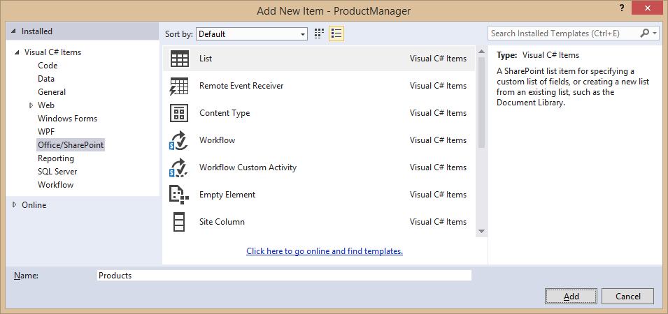
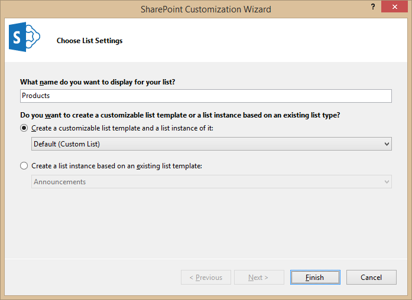
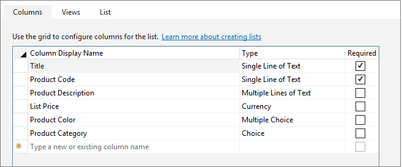
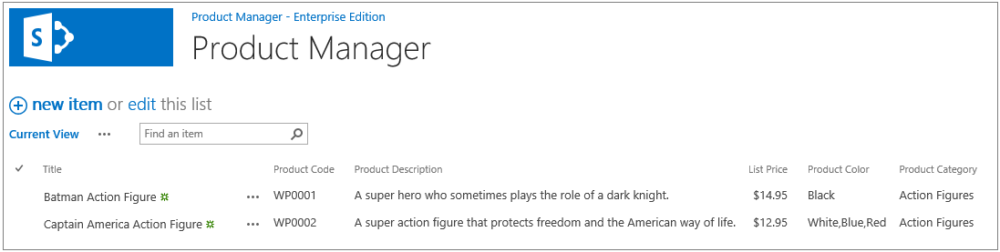

# Deep dive into SharePoint lists for data storage

In this lab you will get hands-on experience creating with site columns, a content type and a custom list. You will create these using a feature and declarative XML in a SharePoint-hosted App project.

## Exercise 1: Creating Custom Site Columns and Content Types
In this exercise you will create a new Visual Studio project for a SharePoint-hosted app. You will then add declarative XML elements to the project to create a set of custom site columns and a custom content type in the app web.

1. Launch Visual Studio 2013.
2. Create a new project by selecting the **File > New Project** command.
3. In the **New Project** dialog, select the **App for SharePoint** project template, enter a project name of **ProductManager** and click **OK**.
  
4. In the **New app for SharePoint** dialog, enter the URL for your Office 365 developer site, select the app hosting type of **SharePoint-hosted App** and click **Finish** to create the new project.
  
5. You should now have a new project with a project structure that matches the following screenshot.  
  
6. Now you will create a new set of site columns. Start by right-clicking the top-level project node in Solution Explorer and selecting the **Add > New Item** command.  
  
7. In the **Add New Item** dialog, select the **Empty Element** item template, enter a name of **CustomSiteColumns** and click **OK**.
  
8. You should now have a new folder in your project named CustomSiteColumns with a file named **Elements.xml**.
9. Inside the **Elements** elements within **Elements.xml**, add a set of site columns by copying-and-pasting the following **Field** elements.

		  <Field
		     ID="{11e6b032-2d81-4068-9766-75bb26271e31}"
		     Name="ProductCode"
		     DisplayName="Product Code"
		     Type="Text"
		     Required="TRUE"
		     Indexed="TRUE"
		     Group="Wingtip Site Columns" />
		
		  <Field
		    ID="{11e6b032-2d81-4068-9766-75bb26271e32}"
		    Name="ProductDescription"
		    DisplayName="Product Description"
		    Type="Note"
		    NumLines="4"
		    RichText="FALSE"
		    Group="Wingtip Site Columns" />
		
		  <Field
		    ID="{11e6b032-2d81-4068-9766-75bb26271e33}"
		    Name="ProductListPrice"
		    DisplayName="List Price"
		    Type="Currency"
		    Min="0"
		    Group="Wingtip Site Columns" />
		
		  <Field
		    ID="{11e6b032-2d81-4068-9766-75bb26271e34}"
		    Name="ProductColor"
		    DisplayName="Product Color"
		    Type="MultiChoice"
		    Group="Wingtip Site Columns" >
		    <CHOICES>
		      <CHOICE>White</CHOICE>
		      <CHOICE>Black</CHOICE>
		      <CHOICE>Grey</CHOICE>
		      <CHOICE>Blue</CHOICE>
		      <CHOICE>Red</CHOICE>
		      <CHOICE>Green</CHOICE>
		      <CHOICE>Yellow</CHOICE>
		    </CHOICES>
		  </Field>
		
		  <Field ID="{11e6b032-2d81-4068-9766-75bb26271e35}"
		       Name="ProductCategory"
		       DisplayName="Product Category"
		       Type="Choice"
		       Group="Wingtip Site Columns" >
		    <CHOICES>
		      <CHOICE>Action Figures</CHOICE>
		      <CHOICE>Arts and Crafts</CHOICE>
		      <CHOICE>Vehicles and RC</CHOICE>
		    </CHOICES>
		  </Field>

10. Close **Elements.xml**.
11. Right-click on the **ProductManager** project node and select **Add > New Item**.
12. In the **Add New Item** dialog, select the **Content Type** item template, enter a name of **Product** and click **Add**.
  
13. When prompted to **Choose Content Type Settings** by the **SharePoint Customization Wizard** dialog, select a base content type of **Item** and click **Finish**.
  
14. On the **Columns** tab of the Content Type Designer, add the five custom site columns created in the previous exercise.
  
15. Close the **Elements.xml** file associated with the **Product** content type.

Now that you have created a custom content type, you will now use it to create a custom list definition.

## Exercise 2: Creating a Custom List Definition
In this exercise, you will create a custom list which uses the custom site columns and the **Product** content type.

1.  Right-click on the **ProductManager** project node and select **Add > New Item**.
2. In the **Add New Item** dialog, select the **List** item template, enter a name of **Products** and click **Add**.
  
3. When you are prompted to **Choose List Settings** by the SharePoint Customization Wizard, enter a display name of **Products**. Also select the first option to **Create a customizable  list template** based on the **Default (Custom List)** template as shown in the following screenshot. Click **Finish**.
  
4. You should now see that Visual Studio has created a new top-level project node named **Products** which contains the files to create a new list definition and additionally a new list instance based on the new list definition.  
  
5. After you have created the new **Products** list, you should see the customizable **Products** list in the Visual Studio list designer. Click on the **Content Types** button to display the **Content Types Settings** dialog.
  
6. In the **Content Type Settings** dialog, remove the two existing content types and replace them with **Product** content type. Click **OK** when you are done to apply your changes. 
  
7. After adding the **Product** content type, you should now see the five custom site columns in the Columns collections of the **Products** list.  
  
8. Close the designer window with the **Products** list.
9. Open the **Elements.xml** file which is located at the root of the **Products** node. This file contains a **ListTemplate** element to define a list template in a SharePoint site. However, you must update the value of the **Type** attribute so you do not use the default value of **100** which is used by the built-in SharePoint list type for custom lists.

		
		<ListTemplate
		  Name="Products"
		  Type="100"
		  BaseType="0"
		  OnQuickLaunch="TRUE"
		  SecurityBits="11"
		  Sequence="410"
		  DisplayName="Products"
		  Description="Product List Definition"
		  Image="/_layouts/15/images/itgen.png"/>
10. Update the value of the **Type** attribute from **100** to **10001** so it lies within the acceptable range for a custom list template.

		
		<ListTemplate
		  Name="Products"
		  Type="10001"
		  BaseType="0"
		  OnQuickLaunch="TRUE"
		  SecurityBits="11"
		  Sequence="410"
		  DisplayName="Products"
		  Description="Product List Definition"
		  Image="/_layouts/15/images/itgen.png"/>
11. Close the **Elements.xml** file with the **ListTemplate** element.
12. Open the **Elements.xml** file in the **Products/ProductsInstance** folder. This files contains a ListInstance element to create an instance of the Products list. Update the TemplateType attribute from **100** to **10001**.

		  
		<ListInstance 
		  Title="Products"
		  OnQuickLaunch="TRUE"
		  TemplateType="10001"
		  Url="Lists/Products"
		  Description="Product List Instance">
		</ListInstance>
13. Next, add a **Data** element with the following XML inside the **ListInstance** element to create the **Products** list with a sample product item.
		
		<ListInstance 
		  Title="Products" 
		  OnQuickLaunch="TRUE" 
		  TemplateType="10001" 
		  Url="Lists/Products" 
		  Description="Product List Instance">
		
		  <Data>
		    <Rows>
		      <Row>
		        <Field Name="Title">Batman Action Figure</Field>
		        <Field Name="ProductCode">WP0001</Field>
		        <Field Name="ProductDescription">
                  A super hero who sometimes plays the role of a dark knight.
		        </Field>
		        <Field Name="ProductListPrice">14.95</Field>
		        <Field Name="ProductColor">;#Black;#</Field>
		        <Field Name="ProductCategory">Action Figures</Field>
		      </Row>
		    </Rows>
		  </Data>
		    
		</ListInstance>
14. Close the **Elements.xml** file with the **ListInstance** element.
15. Open the ASPX file for the app's start page file named **default.aspx** which is located in the **Pages** folder.
16. Update the **asp:Content** control inside **default.aspx** with the **ContentPlaceholderID** of **PlaceHolderPageTitleInTitleArea** with a title of **Product Manager**.

		<asp:Content ContentPlaceHolderID="PlaceHolderPageTitleInTitleArea" runat="server">
		    Product Manager
		</asp:Content>
17. Update the **asp:Content** control with the **ContentPlaceholderID** of **PlaceHolderMain** with the following code which adds a web part zone containing an instance of the **XsltListViewWebPart** web part which is configured to display the all items in the **Products** list.
		
		<asp:Content ContentPlaceHolderID="PlaceHolderMain" runat="server">
		
		  <WebPartPages:WebPartZone ID="Main" Title="Main Web Part Zone"
		                            FrameType="TitleBarOnly" runat="server">
		      <ZoneTemplate>
		        <WebPartPages:XsltListViewWebPart
		          runat="server"
		          ID="ProductsWebPart"
		          Title="Products"
		          ListUrl="Lists/Products"
		          ChromeType="None"
		          InplaceSearchEnabled="true">
		        </WebPartPages:XsltListViewWebPart>
		      </ZoneTemplate>

		  </WebPartPages:WebPartZone>
		  
		</asp:Content>
18. Save your changes and close **default.aspx**.
19. Open the app manifest file **AppManifest.xml** in the SharePoint app manifest designer. Update the **Title** property to **Product Manager - Enterprise Edition**
  
20. Save your changes and close **AppManifest.xml**.
21. Now it's time to test your app. Press the **{F5}** key to install the app in your Office 365 developer's site and begin a debugging session. When the app has been launched, the start page should load and display the **Products** list which should contain a single Product item as shown in the following screenshot.
  
22. Click on the **new item** link and create a second Product item. Fill out the New Item page using sample data like the product information shown in the following screenshot. Click Save when you are done to save the new item.
  
23. Verify that a new Product item has been created.
  
24. When you are done with your test, close the browser and terminate the debugging session.