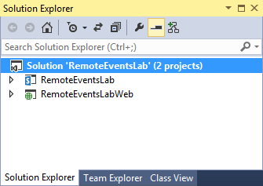
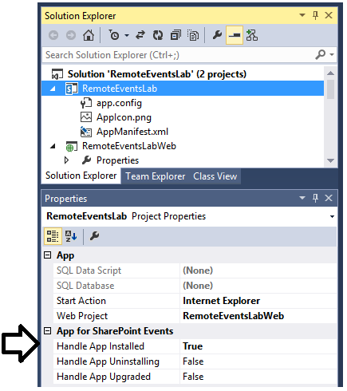

# SharePoint 2013 Remote Event Receivers
In this lab you will get hands-on experience developing a remote event receiver for a provider-hosted app. In particular, you will create a provider-hosted app which handles the **AppInstalled** all lifecycle event so that you can write custom C# code executes when the app is installed to create a list in the host web.

## Exercise 1: Creating an Azure Service Bus Endpoint for Debugging
In this exercise, you will create a Windows Azure service bus namespace to use when you debug the remote event receiver you will create in the next exercise.

1.	In order to complete your work for this lab you must install support for the PowerShell cmdlets that are provided by Microsoft Azure PowerShell. Go to the [Microsoft Azure PowerShell Download Page](http://azure.microsoft.com/en-us/documentation/articles/install-configure-powershell/ "Install Windows Azure PowerShell page.") and install **Microsoft Azure PowerShell** support before moving on to the next step.  
2.	At this point you should have **Microsoft Azure PowerShell** support installed on your local developer workstation.  

3.	Press the **Windows** key to navigate to the Windows start page. and type "Azure PowerShell". Click on the **Microsoft Azure PowerShell** tile to launch the Azure PowerShell Console window.  

4. In the Azure PowerShell Console window, execute the **Add-AzureAccount** cmdlet. When you execute this cmdlet, you will be prompted for login credentials. Log in with the credentials for your organizational account.
5. In the Azure PowerShell Console window, execute the the **New-AzureSBNamespace** cmdlet to create a service bus namespace with a name such as **DeveloperTesting**.  You should replace **East US 2** with a different Azure location if that is more appropriate for your geographical location.  

		New-AzureSBNamespace DeveloperTesting "East US 2" -CreateACSNamespace $true -NamespaceType Messaging
6. When you execute the **New-AzureSBNamespace** cmdlet, you should be able to observe that the cmdlet has executed successfully and created a new service bus namespace with ACS support.  

7.	Switch over to the browser and navigate to the **Azure Management Portal** at [https://manage.windowsazure.com](https://manage.windowsazure.com). Log in using the credentials associated with your organizational account. At this point, the Azure Management Portal should display the Azure objects that are associated with your Azure subscription.
8. Locate and click the **Service Bus** link in the left-hand navigation menu.  
 
9. On the **service bus** page, you should be able to see the service bus namespace you just created using Azure Powershell. Select this namespace and then click the **CONNECTION INFORMATION** button.

10.	On the **Access connection information** page, locate the **ACS CONNECTION STRING** setting and copy its value to the Windows clipboard.   

11. Open NOTEPAD.EXE and paste the value of the **ACS CONNECTION STRING** setting into a new text file. Save this file so that you can use this value in the following exercise.

## Exercise 2: Creating A Remote Event Receiver for the AppInstalled event
In this exercise you will create a provider-hosted app which includes a remote event receiver to handle the AppInstalled event.

1.	Launch Visual Studio as Administrator.
2.	Create a new project in Visual Studio 2013 by selecting **File > New > Project**.
3.	In the **New Project** dialog, select the **App for SharePoint 2013** template under the **Templates > Visual C# > Office / SharePoint > Apps** section. Give the new app project a name of **RemoteEventsLab** and click **OK** to create the project.  
  
4.	On the **Specify the app for SharePoint settings** page of the **New App for SharePoint** wizard, enter the URL of your Office 365 developer site and select the app hosting option of **Provider-hosted**. Click **Next** when you are done.  
  
5.	On the **Specify the web project type** page, select **ASP.NET MVC Web Application** and click **Next**.  
  
6.	On the **Configure authentication settings** page, select **Use Windows Azure Access Control Service** and click **Finish**.  
  
7.	Visual Studio has now created a new solution with two projects named **RemoteEventsLab** and **RemoteEventsLabWeb**.  
  
8.	In the top project, locate and double-click on **AppManifest.xml** to open the app manifest in the Visual Studio app manifest designer.  
  
9.	On the **General** tab of the App Manifest Designer, modify the app **Title** property **Remote Events Lab**.  
  
10.	On the **Permissions** tab of the App Manifest Designer, make sure the checkbox for the **Allow the app to make app-only calls** setting is checked. Add a permission request that is scoped to **Web** and configured with **Manage** permissions as shown in the following screenshot.  
  
11.	Save and close **AppManifest.xml**.
12.	In the Solution Explorer, right-click on the **RemoteEventLabs** project node and select **Properties**.
13.	Select the **SharePoint** tab of the Project Properties page. Check the checkbox with the **Enable debugging via Microsoft Azure Service Bus** option.  Paste the ACS connection string you obtained in the previous exercise into the textbox as shown in the following screenshot.  
  
14.	In Solution Explorer, select the top-level node for the **RemoteEventsLab** project and then inspect the project's property sheet.  Locate The **Handle App Installed** project property in the **App for SharePoint Events** section and change its value to True.  
  
15.	Move down to the bottom project named **RemoteEventsLabWeb**. You should see the C# file named **HomeController.cs** which provides the MVC controller for the app. You should also notice that the project contains a new web service file named **AppEventReceiver.svc** along with an associated code-behind file named **AppEventReceiver.svc.cs** that were created when you configured support for the **AppInstalled** event handler.  
  
16.	Open **HomeController.cs** and replace the existing implementation of the **Index** method with the following code which uses CSOM to obtain the set of non-hidden lists that exist within the host web and to pass this set of lists to the associated MVC view using the MVC **ViewBag** object.  

		[SharePointContextFilter]
		public ActionResult Index() {

		  var spContext = SharePointContextProvider.Current.GetSharePointContext(HttpContext);

		  using (var clientContext = spContext.CreateUserClientContextForSPHost()) {
		    if (clientContext != null) {		
		      clientContext.Load(clientContext.Web);
		      ListCollection Lists = clientContext.Web.Lists;
		      clientContext.Load(Lists, lists => lists.Where(list => !list.Hidden)
		                                              .Include(list => list.Title,
		                                                       list => list.DefaultViewUrl));
		      clientContext.ExecuteQuery();
		
		      Dictionary<string, string> userLists = new Dictionary<string, string>();

		      string siteUrl = clientContext.Web.Url;
		      foreach (var list in Lists) {
		        userLists.Add(siteUrl + list.DefaultViewUrl, list.Title);
		      }	

		      ViewBag.UserLists = userLists;
		    }
		  }		
		  return View();
		}
17.	Save and close **HomeController.cs**.
18.	Expand the **Views** folder and the two child folders inside so that you can see all the razor view files.  
  
19.	Open the _**Layouts.cshtml** file in the **Shared** view folder and replace its contents with the following razor code.
		
		<!DOCTYPE html>
		<html>
		<head>
		  <meta charset="utf-8" />
		  <meta name="viewport" content="width=device-width, initial-scale=1.0">
		  <title>@ViewBag.Title</title>
		  @Styles.Render("~/Content/css")
		  @Scripts.Render("~/bundles/modernizr")
		</head>
		<body>
		  

		    <h2>Remote Events Lab</h2>
		    

		    @RenderBody()
		  

		  @Scripts.Render("~/bundles/jquery")
		  @Scripts.Render("~/bundles/bootstrap")
		  @Scripts.Render("~/bundles/spcontext")
		  @RenderSection("scripts", required: false)
		</body>
		</html>
20.	Save and close _**Layouts.cshtml**.
21.	Open the **Index.cshtml** file in the **Home** view folder and replace its contents with the following razor code which will display the set of non-public lists from the host web.
		
		@{ ViewBag.Title = "Home Page"; }
		
		<h4>Lists in Host Web</h4>
		
		@{
		  @Html.Raw("<ul>");
		  foreach (var list in ViewBag.UserLists) {
		    string html = "<li><a href='" + list.Key + "' >" + list.Value + "</a></li>";
		    @Html.Raw(html);
		  }
		  @Html.Raw("</ul>");
		}
22.	Save and close **Index.cshtml**.
23.	Open **AppEventReceiver.svc.cs**.
24.	Replace the implementation of xxx with the following code.
		
		public SPRemoteEventResult ProcessEvent(SPRemoteEventProperties properties) {
		  SPRemoteEventResult result = new SPRemoteEventResult();		
		  using (ClientContext clientContext = TokenHelper.CreateAppEventClientContext(properties, useAppWeb: false)) {
		    if (clientContext != null) {
		      clientContext.Load(clientContext.Web);
		      string listTitle = "Customers";
		      
		      // delete list if it exists
		      ExceptionHandlingScope scope = new ExceptionHandlingScope(clientContext);
		      using (scope.StartScope()) {
		        using (scope.StartTry()) {
		          clientContext.Web.Lists.GetByTitle(listTitle).DeleteObject();
		        }
		        using (scope.StartCatch()) { }
		      }
		
		      // create and initialize ListCreationInformation object
		      ListCreationInformation listInformation = new ListCreationInformation();
		      listInformation.Title = listTitle;
		      listInformation.Url = "Lists/Customers";
		      listInformation.QuickLaunchOption = QuickLaunchOptions.On;
		      listInformation.TemplateType = (int)ListTemplateType.Contacts;
		
		      // Add ListCreationInformation to lists collection and return list object
		      List list = clientContext.Web.Lists.Add(listInformation);
		
		      // modify additional list properties and update
		      list.OnQuickLaunch = true;
		      list.EnableAttachments = false;
		      list.Update();
		
		      // send command to server to create list
		      clientContext.ExecuteQuery();
		
		      // create a sample item in the list
		      var customer1 = list.AddItem(new ListItemCreationInformation());
		      customer1["Title"] = "Mike";
		      customer1["FirstName"] = "Fitzmaurice";
		      customer1.Update();

			  // send command to server to create item
		      clientContext.ExecuteQuery();		
		    }
		  }		
		  return result;
		}
25. Test your work by pressing the **{F5}** key and launching the app in the Visual Studio debugger. When the app loads and displays the start page, you should see that Customers list created by the event handler for the AppInstalled event.
  
26. Click on the link for the **Customers** list to navigate to the default view of this list..
  
27. Close the browser and terminate the debugging session.